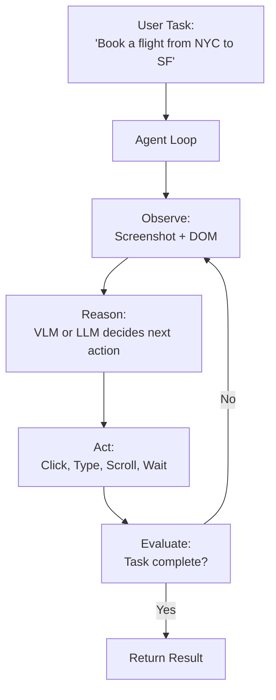

# 🌐 Browser Agents

## Introduction

Browser agents are AI systems that can autonomously navigate the web — clicking buttons, filling forms, scrolling pages, and extracting information — using the same browser interfaces humans use. Powered by vision-language models (screenshot → actions) or DOM-based reasoning (HTML → actions), they represent the convergence of LLMs with web automation.

For AI engineers, browser agents open a new category of automation: replacing brittle Selenium scripts with intelligent agents that adapt to page changes, handle unexpected popups, and reason about multi-step workflows across websites.

---

## How Browser Agents Work

### Architecture



### Vision vs DOM-Based Agents

| Approach | How It Works | Strengths | Weaknesses |
|---|---|---|---|
| **Vision (Screenshot → Actions)** | VLM sees a screenshot and outputs click coordinates | Works on any website, no DOM parsing needed | Slow (image processing), resolution-sensitive |
| **DOM (HTML → Actions)** | LLM reads HTML accessibility tree, outputs element selectors | Fast, precise element targeting | Breaks on dynamic JS, shadow DOM, iframes |
| **Hybrid** | Vision for page understanding, DOM for precise clicking | Best of both worlds | Complex implementation |

---

## Key Tools and Frameworks

| Tool | Approach | Best For |
|---|---|---|
| **Browser Use** | Open-source, vision-based agent framework | General web automation, form filling |
| **Playwright + LLM** | DOM accessibility tree + LLM for decisions | Structured website interaction |
| **WebVoyager** | Vision-language model + annotated screenshots | Research benchmark for web agents |
| **Agent-E (Emergence AI)** | Hybrid vision + DOM | Enterprise-grade web automation |
| **Claude Computer Use** | Vision-based, Anthropic's native browser capability | General computer tasks including browser |

### Playwright + LLM Example

```python
from playwright.sync_api import sync_playwright

def browser_agent(task: str):
    with sync_playwright() as p:
        browser = p.chromium.launch()
        page = browser.new_page()
        page.goto("https://example.com")

        for step in range(10):  # Safety limit
            # Get page state
            html = page.content()
            screenshot = page.screenshot()

            # LLM decides action
            action = llm.decide(task, html, screenshot)

            if action.type == "click":
                page.click(f"text={action.target}")
            elif action.type == "type":
                page.fill(action.selector, action.text)
            elif action.type == "done":
                return action.result

        browser.close()
```

---

## ⚠️ Challenges

- **Page variability:** Same website looks different across viewport sizes, dark/light mode, A/B tests. Vision agents handle this better than DOM agents.
- **Safety and permission boundaries:** Browser agents can submit forms, make purchases, delete data. Implement action confirmation for destructive operations.
- **Speed:** Vision-based agents process an image per step (1-5 seconds per action). For simple form filling, DOM-based agents are 10x faster.
- **CAPTCHA and bot detection:** Many websites detect and block automated browsers. Respect robots.txt and implement rate limiting.

---

## References

- [Browser Use (GitHub)](https://github.com/browser-use/browser-use)
- [WebVoyager (arXiv)](https://arxiv.org/abs/2401.13919)
- [Playwright Documentation](https://playwright.dev/)
