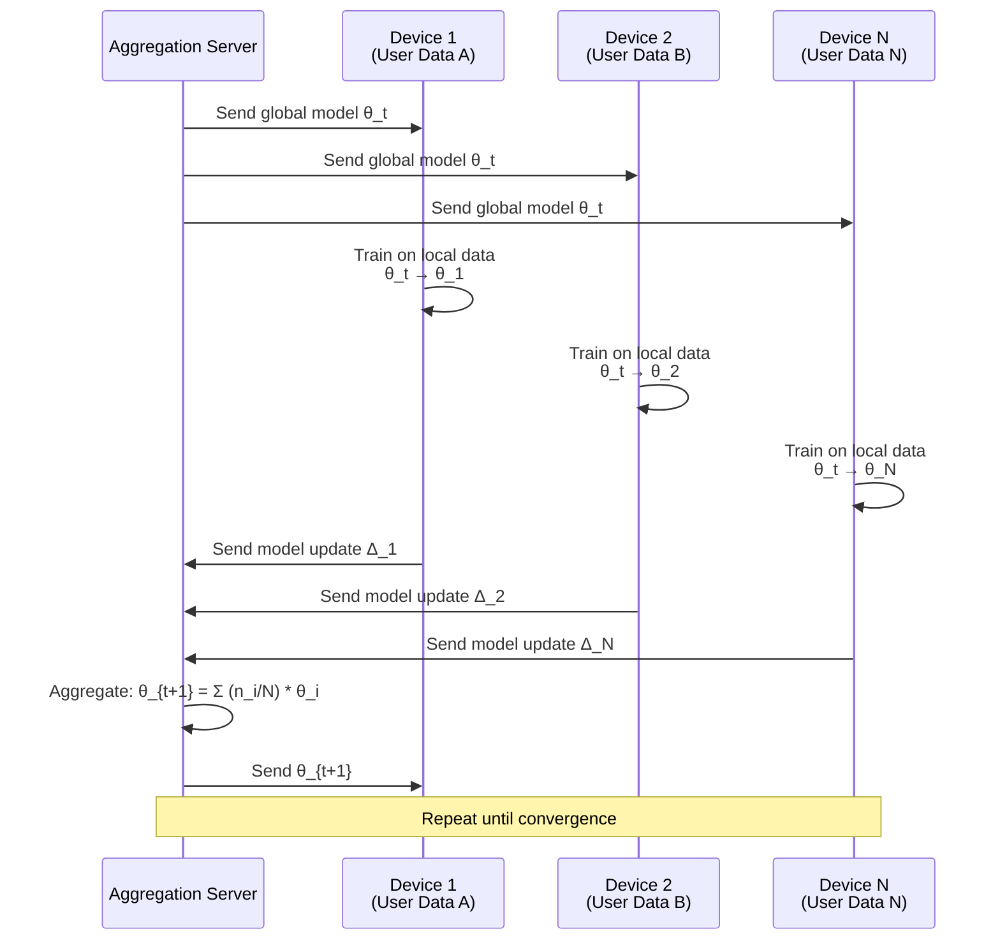

# 🔒 Federated Learning

## Introduction

Federated Learning trains ML models across decentralized devices without ever centralizing the raw data. Instead of sending user data to a cloud server, the model travels to the data — each device trains locally and only model updates (gradients or weights) are sent to a central server for aggregation. This is the technology behind Google Gboard's next-word prediction, Apple's Siri voice recognition, and healthcare AI systems that must comply with data privacy regulations.

For AI engineers, federated learning is not a niche academic topic — it is the only way to train models on sensitive data (medical records, financial transactions, personal messages) without violating privacy regulations like GDPR and HIPAA.

---

## How Federated Learning Works

### The Federated Averaging (FedAvg) Algorithm

At each round $t$:

1. Server selects a subset of $K$ clients
2. Each selected client $k$ trains the model on its local data for $E$ epochs
3. Each client sends its updated model $\theta_k$ (or gradient $\Delta_k$) to the server
4. Server aggregates: $\theta_{t+1} = \sum_{k=1}^K \frac{n_k}{n} \theta_k$

Where $n_k$ is the number of training samples on client $k$ and $n = \sum n_k$.

---

## Key Challenges and Solutions

| Challenge | Problem | Solution |
|---|---|---|
| **Non-IID Data** | User A's data (teenager texting) ≠ User B's data (executive emailing) | FedProx (proximal term to keep models close to global) |
| **Communication Cost** | Millions of devices × model size × rounds | Gradient compression, quantization, sparse updates |
| **Privacy (gradient leakage)** | Model updates can be reverse-engineered to reveal training data | Differential Privacy (add noise to gradients) |
| **Stragglers** | Some devices are slow, disconnected, or low-battery | Asynchronous FL, timeout-based selection |
| **Incentive** | Why would users let you train on their devices? | Rewards, better personalization for participants |

---

## FL Architectures

| Type | Description | Example |
|---|---|---|
| **Cross-Device FL** | Millions of mobile/edge devices | Gboard keyboard predictions |
| **Cross-Silo FL** | Tens of organizations/hospitals | Healthcare consortium training |
| **Centralized FL** | Single aggregation server | Standard topology |
| **Decentralized FL** | Peer-to-peer aggregation | Blockchain-based FL research |

---

## Production Deployments

| Organization | Product | Why FL |
|---|---|---|
| **Google** | Gboard next-word prediction | Privacy — can't upload all user keystrokes |
| **Apple** | Siri voice recognition | On-device privacy guarantee |
| **Owkin** | Medical AI for cancer diagnosis | Hospitals can't share patient data |
| **Nvidia** | Clara FL for medical imaging | Cross-hospital model training |
| **WeBank (China)** | Credit risk modeling | Financial data privacy regulations |

---

## ⚠️ Considerations

- **FL ≠ complete privacy:** Model updates can leak information (gradient inversion attacks). Always combine FL with Differential Privacy for production.
- **Non-IID is the norm, not the exception:** User data is never IID. Standard FedAvg performs poorly on non-IID data — use FedProx, SCAFFOLD, or personalization layers.
- **System heterogeneity matters more than statistical efficiency:** In production FL, device availability, battery, and bandwidth dominate training time — not gradient computation speed.

---

## References

- McMahan et al., "Communication-Efficient Learning of Deep Networks from Decentralized Data" (FedAvg, 2017)
- Li et al., "Federated Optimization in Heterogeneous Networks" (FedProx, 2020)
- [TensorFlow Federated](https://www.tensorflow.org/federated)
- [Flower Framework](https://flower.dev/) — Open-source FL framework
