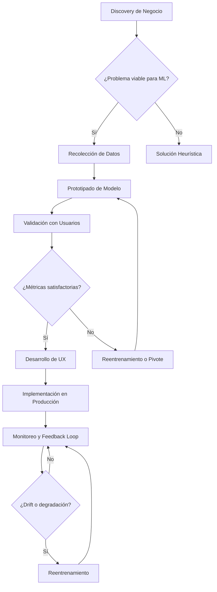
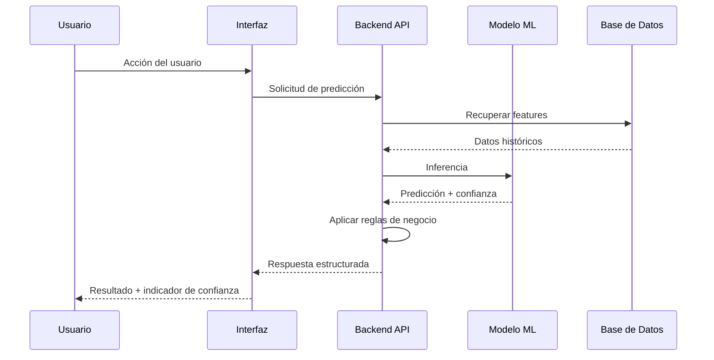

# 🎨 Diseño de Productos con IA

## Introducción
El diseño de productos con inteligencia artificial representa uno de los desafíos más complejos para los equipos de ingeniería modernos. A diferencia del software tradicional, los productos de IA no solo deben funcionar correctamente, sino que también deben gestionar la incertidumbre, comunicar sus limitaciones al usuario y mantener la confianza a lo largo del tiempo. Un [[../06 - MLOps y Produccion/22 - Introduccion a MLOps/00 - Bienvenida|pipeline de MLOps]] robusto es necesario pero insuficiente: sin una estrategia de producto clara, incluso los modelos más precisos fracasan en el mercado.

La intersección entre [[../07 - Research y Ciencia de Datos/26 - Metodologia de Investigacion en ML/00 - Bienvenida|ciencia de datos]] y diseño de producto exige un cambio de mentalidad. El ingeniero de ML debe pensar no solo en métricas técnicas como F1-score o RMSE, sino en métricas de negocio: retención de usuarios, tasa de adopción y satisfacción del cliente. Esta nota establece los fundamentos del ciclo de vida de un producto de ML, los patrones de UX específicos para IA y las fórmulas que conectan usabilidad con éxito comercial.

## 1. Ciclo de Vida del Producto ML
El desarrollo de productos impulsados por IA sigue un ciclo iterativo que difiere significativamente del desarrollo de software tradicional. Las fases principales son:

- **Discovery:** Identificación de problemas de negocio donde el ML aporta valor diferencial sobre las reglas heurísticas.
- **Prototyping:** Construcción de modelos de prueba de concepto (PoC) con datos limitados para validar la viabilidad técnica.
- **Validation:** Evaluación del prototipo con usuarios reales mediante pruebas A/B, estudios de usabilidad y análisis de errores.
- **Scaling:** Implementación de infraestructura de producción, monitoreo continuo y optimización de costos.

Caso real: Netflix. La empresa no comenzó con un sistema de recomendación perfecto. Iniciaron con un algoritmo simple de filtrado colaborativo en la fase de discovery, validaron que las recomendaciones aumentaban el tiempo de visualización, y luego escalaron hacia modelos de deep learning que hoy representan más del 80% del contenido consumido en la plataforma.

⚠️ **Advertencia:** Un error común es invertir meses en entrenar un modelo de alta precisión antes de validar que el problema de negocio realmente existe. La regla de oro es: si una simple regla `if-else` resuelve el problema adecuadamente, no necesitas ML.

💡 **Tip — La regla del Umbral:** Antes de comenzar cualquier proyecto de ML, pregúntate: "¿Puede una persona experta resolver este problema con reglas claras?" Si la respuesta es sí, pospon el ML hasta que la complejidad lo justifique.

## 2. Patrones de UX en IA
La experiencia de usuario en productos de IA debe manejar la incertidumbre de forma transparente. Los tres patrones fundamentales son:

- **Progressive disclosure:** Revelar gradualmente la complejidad del sistema. Por ejemplo, mostrar una predicción simple primero y permitir al usuario explorar los factores que influyeron en ella.
- **Confidence indicators:** Indicadores visuales de la confianza del modelo (barras de probabilidad, semáforos de riesgo) que permiten al usuario tomar decisiones informadas.
- **Human-in-the-loop:** Diseñar puntos de intervención humana donde el modelo solicita ayuda cuando su confianza es baja, creando un sistema híbrido que mejora continuamente.

Caso real: Gmail Smart Compose. Google diseñó este feature con progressive disclosure: sugiere frases cortas que el usuario puede aceptar con Tab o ignorar sin fricción. No interrumpe el flujo de escritura y utiliza confidence indicators implícitos (solo sugiere cuando la probabilidad supera un umbral alto).

La siguiente tabla compara dos arquitecturas de producto:

| Característica | Producto AI-Native | Producto AI-Augmented |
|---|---|---|
| **Dependencia del ML** | El producto no existe sin el modelo | El ML mejora una funcionalidad existente |
| **Ejemplo** | ChatGPT, Midjourney | Gmail Smart Compose, Adobe Photoshop |
| **Riesgo técnico** | Alto: fallo del modelo = fallo del producto | Medio: degradación graceful |
| **Tiempo de validación** | Largo: requiere datos masivos desde el inicio | Corto: se puede iterar sobre funcionalidad existente |
| **Métricas clave** | Task completion rate, user retention | Feature adoption, efficiency gain |

## 3. Arquitectura y Flujo de Diseño
El diseño de un producto de IA debe visualizarse como un flujo end-to-end donde los datos, el modelo y la interfaz de usuario están intrínsecamente conectados.



Otra forma de visualizar la relación entre los componentes es a través de un diagrama de secuencia del usuario interactuando con el sistema:



La imagen siguiente ilustra el ciclo de vida clásico de un producto tecnológico, aplicable también a productos de IA:


## 4. Métricas de Éxito y Fórmulas
El éxito de un producto de IA no puede medirse únicamente con métricas técnicas. La fórmula que sintetiza los factores críticos es:

$$P(success) = f(usability, accuracy, trust)$$

Donde:
- **usability** se mide con métricas de UX (SUS, task completion rate, time-on-task)
- **accuracy** se mide con métricas de ML (precision, recall, AUC-ROC)
- **trust** se mide con encuestas de percepción y tasas de aceptación de recomendaciones

Ninguno de estos factores puede compensar la ausencia total de otro. Un modelo 99% preciso con una UX terrible generará desconfianza. Un producto usable con un modelo 60% preciso dañará la reputación del brand.

El siguiente código Python calcula un score compuesto de éxito de producto:

```python
import numpy as np

def product_success_score(
    usability: float,      # 0-1, e.g., task completion rate
    accuracy: float,       # 0-1, e.g., F1-score
    trust: float,          # 0-1, e.g., survey-based trust score
    weights: tuple = (0.33, 0.33, 0.34)
) -> dict:
    """
    Calcula el Product Success Score (PSS) como función
    ponderada de usabilidad, precisión y confianza.
    """
    u_w, a_w, t_w = weights
    
    # Penalización no lineal: el factor más bajo arrastra el score
    harmonic = 3 / (1/usability + 1/accuracy + 1/trust)
    weighted = u_w * usability + a_w * accuracy + t_w * trust
    
    # Score final: combinación de media ponderada y media armónica
    pss = 0.6 * weighted + 0.4 * harmonic
    
    return {
        "usability": usability,
        "accuracy": accuracy,
        "trust": trust,
        "harmonic_mean": round(harmonic, 3),
        "weighted_mean": round(weighted, 3),
        "pss": round(pss, 3),
        "status": "viable" if pss > 0.75 else "needs_improvement"
    }

# Ejemplo: producto con buena precisión pero baja confianza
result = product_success_score(usability=0.85, accuracy=0.92, trust=0.55)
print(result)
# {'pss': 0.698, 'status': 'needs_improvement'}
# La baja confianza penaliza severamente el score global
```

---

## 📦 Código de Compresión

```python
"""
compress_product_design.py
Resume el ciclo completo de diseño de productos con IA en un
script ejecutable que simula la validación de una idea de producto.
"""

import random
from dataclasses import dataclass
from enum import Enum

class Stage(Enum):
    DISCOVERY = "discovery"
    PROTOTYPE = "prototype"
    VALIDATION = "validation"
    SCALE = "scale"

@dataclass
class MLProduct:
    name: str
    problem_fit: float  # 0-1
    data_availability: float  # 0-1
    model_accuracy: float  # 0-1
    ux_score: float  # 0-1

    def stage_gate(self, stage: Stage) -> bool:
        gates = {
            Stage.DISCOVERY: self.problem_fit > 0.6,
            Stage.PROTOTYPE: self.data_availability > 0.5,
            Stage.VALIDATION: self.model_accuracy > 0.7 and self.ux_score > 0.6,
            Stage.SCALE: self.model_accuracy > 0.85 and self.ux_score > 0.8,
        }
        return gates.get(stage, False)

    def run_lifecycle(self):
        for stage in Stage:
            passed = self.stage_gate(stage)
            status = "✅ Pasa" if passed else "❌ Bloqueado"
            print(f"{stage.value.upper():12} | {status}")
            if not passed:
                print(f"   → Acción: {self._recommendation(stage)}")
                return stage
        print("🚀 Producto listo para escalar")
        return None

    def _recommendation(self, stage: Stage) -> str:
        recs = {
            Stage.DISCOVERY: "Replantear el problema de negocio.",
            Stage.PROTOTYPE: "Recopilar más datos o features.",
            Stage.VALIDATION: "Mejorar modelo o experiencia de usuario.",
            Stage.SCALE: "Optimizar antes de escalar.",
        }
        return recs.get(stage, "Revisar estrategia.")

if __name__ == "__main__":
    product = MLProduct(
        name="Recomendador de contenido educativo",
        problem_fit=0.85,
        data_availability=0.90,
        model_accuracy=0.88,
        ux_score=0.82,
    )
    print(f"Evaluando: {product.name}\n{'-'*30}")
    product.run_lifecycle()
```

---

## 🎯 Proyecto Documentado

### Descripción
Diseño y lanzamiento de un asistente virtual de código impulsado por LLM que ayuda a desarrolladores junior a entender bases de código legacy. El producto integra un motor de RAG (Retrieval-Augmented Generation) con una interfaz de chat contextual que permite hacer preguntas sobre funciones específicas del repositorio.

### Requisitos Funcionales
1. Indexación automática de repositorios Git con parsing de AST.
2. Respuestas contextualizadas con citas al código fuente original.
3. Sistema de feedback explícito (thumbs up/down) para cada respuesta.
4. Modo progresivo: resumen de archivo → explicación de función → sugerencias de refactorización.
5. Dashboard de analytics para equipos de engineering managers.

### Componentes Principales
- **Indexador de código:** Tree-sitter + vector DB (Pinecone/Weaviate)
- **Motor RAG:** LangChain con prompt engineering para reducir alucinaciones
- **Frontend:** Plugin de VS Code con progressive disclosure de información
- **Backend:** FastAPI con caching de embeddings y rate limiting

### Métricas de Éxito
- **Task Completion Rate:** % de usuarios que logran entender un código en < 5 minutos
- **Acceptance Rate:** % de respuestas marcadas como útiles
- **Engagement:** Sesiones semanales activas por desarrollador

### Referencias
- Google. "People + AI Guidebook." Google Design, 2019.
- Spotify. "Designing ML Products: A Spotify Perspective." Spotify Engineering Blog.
- Material Design. "Machine Learning Patterns." material.io
