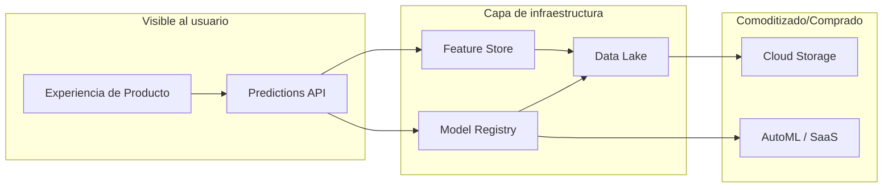
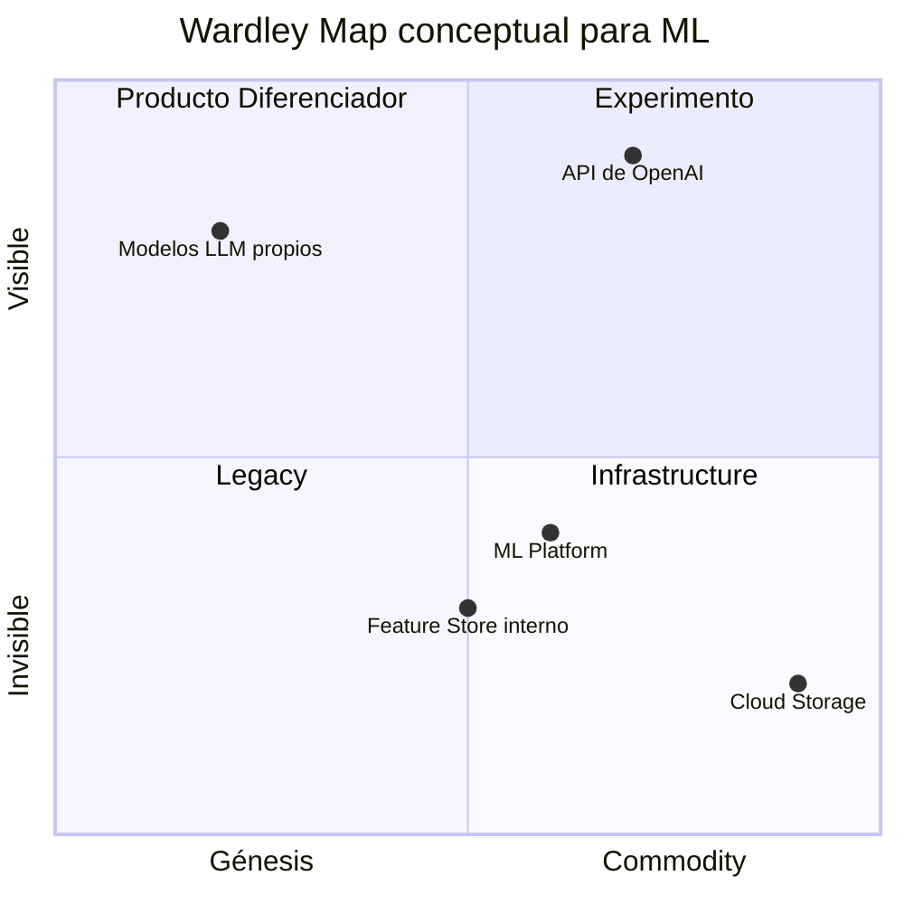

# 🗺️ Estrategia y Roadmap de ML

## Introducción
La estrategia de machine learning trasciende la selección de arquitecturas de modelo o la optimización de hiperparámetros. Para un [[../06 - MLOps y Produccion/22 - Introduccion a MLOps/00 - Bienvenida|ML Engineer]] senior, entender cómo alinear las iniciativas de IA con los objetivos de negocio es tan crítico como dominar el entrenamiento distribuido. Sin un roadmap claro, los equipos de datos caen en la trampa de construir modelos que resuelven problemas interesantes pero irrelevantes para la organización.

Esta nota introduce frameworks estratégicos como los Horizontes de Crecimiento, el análisis de deuda técnica versus velocidad de producto, y el Wardley Mapping aplicado a capacidades de ML. Comprender estos conceptos permite priorizar inversiones, gestionar expectativas de stakeholders no técnicos y construir una ventaja competitiva sostenible a través de la IA.

## 1. Framework de Horizontes (H1/H2/H3)
El framework de los tres horizontes, adaptado a machine learning, permite categorizar las iniciativas según su proximidad al negocio actual y su nivel de incertidumbre:

- **H1 — Optimizar:** Iniciativas que mejoran productos y procesos existentes con tecnología madura. Ejemplo: mejorar un modelo de recomendación actual con nuevos features.
- **H2 — Expandir:** Nuevas aplicaciones de ML en áreas adyacentes al negocio actual. Ejemplo: usar NLP para analizar tickets de soporte en una empresa de e-commerce.
- **H3 — Transformar:** Investigación y desarrollo de capacidades disruptivas. Ejemplo: desarrollar un modelo generativo para diseño de productos en una empresa de manufactura.

Caso real: Google organiza sus equipos de ML usando una variante de este framework. Los equipos de búsqueda trabajan en H1 (mejorar RankBrain), los de Cloud AI en H2 (expandir AutoML a nuevos sectores), y DeepMind en H3 (investigación en AGI y ciencia).

La siguiente tabla resume las diferencias clave:

| Dimensión | H1: Optimizar | H2: Expandir | H3: Transformar |
|---|---|---|---|
| **Horizonte temporal** | 0-12 meses | 1-3 años | 3-7 años |
| **Tecnología** | Madura y probada | Emergente | Experimental |
| **Riesgo de fallo** | Bajo (< 20%) | Medio (20-50%) | Alto (> 50%) |
| **Inversión típica** | 70% del presupuesto | 20% del presupuesto | 10% del presupuesto |
| **Éxito medido por** | ROI directo, métricas de negocio | Adopción de nuevos mercados | Publicaciones, patentes |
| **Equipo ideal** | Ingenieros de ML producto | Data Scientists + PMs | Investigadores de ML |

💡 **Tip — La regla 70-20-10:** Asigna aproximadamente 70% de recursos a H1, 20% a H2 y 10% a H3. Esta proporción, popularizada por Google, equilibra la necesidad de resultados inmediatos con la innovación a largo plazo. Si inviertes 100% en H1, tu ventaja competitiva se erosionará.

## 2. Deuda Técnica vs Velocidad de Producto
En ML, la deuda técnica es invisible hasta que es catastrófica. Sculley et al. (2015) en el paper "Machine Learning: The High Interest Credit Card of Technical Debt" identificaron que los sistemas de ML tienen una enorme capacidad de incurrir deuda debido a su dependencia de datos, features entrelazadas y pipelines opacos.

- **Deuda de datos:** Datos desactualizados, schemas inconsistentes, falta de versionado.
- **Deuda de modelo:** Monolitos de modelos difíciles de actualizar, acoplamiento entre entrenamiento e inferencia.
- **Deuda de código:** Código de investigación (notebooks) migrado a producción sin refactorización.

Caso real: Uber enfrentó una deuda técnica masiva con sus primeros sistemas de ML para estimación de tarifas y tiempos de llegada (ETA). Inicialmente, cada equipo construía sus propios pipelines, lo que generó fragmentación. La solución fue Michelangelo, una plataforma unificada de ML que estandarizó el feature store, el entrenamiento y el despliegue, reduciendo el tiempo de lanzamiento de modelos de meses a días.

⚠️ **Advertencia:** La presión por "sacar el modelo a producción rápido" genera deuda técnica que se paga con intereses compuestos. Un pipeline sin tests, sin monitoreo de data drift y sin versionado de features puede funcionar hoy, pero fallará silenciosamente en el futuro y costará 10x más arreglarlo.

## 3. Wardley Mapping para ML
El Wardley Mapping es una herramienta estratégica que permite visualizar el valor de los componentes de un sistema versus su madurez/evolución. En el contexto de ML, ayuda a decidir qué construir internamente versus qué comprar/comoditizar.



En un Wardley Map real, el eje X va de "Génesis" (novedoso) a "Utilidad/Commodity" (estandarizado). Los componentes en genesis (experimentos de modelos propietarios) deben construirse internamente; los commodities (almacenamiento, GPUs) deben comprarse.



La siguiente imagen muestra un ejemplo visual de un roadmap estratégico:


## 4. ROI de Iniciativas ML
La justificación financiera de proyectos de ML es fundamental para obtener presupuesto y mantener el apoyo ejecutivo. La fórmula general de ROI en el tiempo es:

$$ROI(t) = \frac{\sum_{i=0}^{t} Benefits_i}{\sum_{i=0}^{t} Costs_i}$$

Donde:
- **Benefits** incluyen: aumento de ingresos, reducción de costos operativos, mejora en retención.
- **Costs** incluyen: infraestructura de computación, salarios del equipo, adquisición de datos, costos de compliance.

A diferencia del software tradicional, los costos de ML no terminan en el despliegue. El monitoreo continuo, el reentrenamiento periódico y la gestión de drift son costos operativos recurrentes que deben proyectarse desde el inicio.

El siguiente código calcula el ROI de una iniciativa de ML con proyección a 3 años:

```python
import numpy as np
import pandas as pd

def ml_roi_projection(
    initial_cost: float,
    annual_ops_cost: float,
    year1_benefit: float,
    growth_rate: float,
    years: int = 3
) -> pd.DataFrame:
    """
    Proyecta ROI de una iniciativa de ML considerando
    costos iniciales, operativos anuales y beneficios crecientes.
    """
    data = []
    cumulative_cost = initial_cost
    cumulative_benefit = 0.0
    
    for year in range(1, years + 1):
        benefit = year1_benefit * ((1 + growth_rate) ** (year - 1))
        ops_cost = annual_ops_cost
        
        cumulative_cost += ops_cost
        cumulative_benefit += benefit
        roi = cumulative_benefit / cumulative_cost
        
        data.append({
            "year": year,
            "benefit": round(benefit, 2),
            "ops_cost": round(ops_cost, 2),
            "cumulative_cost": round(cumulative_cost, 2),
            "cumulative_benefit": round(cumulative_benefit, 2),
            "roi": round(roi, 2)
        })
    
    return pd.DataFrame(data)

# Caso: sistema de recomendación
df = ml_roi_projection(
    initial_cost=250_000,   # desarrollo + infra
    annual_ops_cost=60_000, # monitoreo, retraining, cloud
    year1_benefit=150_000,  # aumento de ventas cruzadas
    growth_rate=0.20        # 20% mejora anual del modelo
)
print(df)
```

---

## 📦 Código de Compresión

```python
"""
compress_ml_strategy.py
Simula la priorización de iniciativas ML usando el framework
de Horizontes y análisis de ROI simplificado.
"""

from dataclasses import dataclass
from typing import List

@dataclass
class Initiative:
    name: str
    horizon: str  # H1, H2, H3
    estimated_roi: float
    risk_score: float  # 0-1, donde 1 es máximo riesgo
    technical_debt_risk: float  # 0-1

    def priority_score(self) -> float:
        # Normalizar: queremos alto ROI, bajo riesgo, baja deuda
        if self.horizon == "H1":
            horizon_weight = 1.2
        elif self.horizon == "H2":
            horizon_weight = 1.0
        else:
            horizon_weight = 0.8
        return (self.estimated_roi * horizon_weight) / (1 + self.risk_score + self.technical_debt_risk)

def prioritize(initiatives: List[Initiative]) -> List[Initiative]:
    return sorted(initiatives, key=lambda x: x.priority_score(), reverse=True)

if __name__ == "__main__":
    initiatives = [
        Initiative("Mejorar recomendador", "H1", 2.5, 0.2, 0.1),
        Initiative("NLP para soporte", "H2", 1.8, 0.4, 0.3),
        Initiative("Generative design", "H3", 4.0, 0.8, 0.6),
        Initiative("Fraud detection v2", "H1", 3.0, 0.3, 0.2),
    ]
    
    ranked = prioritize(initiatives)
    print(f"{'Rank':<5} {'Iniciativa':<25} {'Score':<6} {'Horiz.':<6}")
    print("-" * 45)
    for i, ini in enumerate(ranked, 1):
        print(f"{i:<5} {ini.name:<25} {ini.priority_score():<6.2f} {ini.horizon:<6}")
```

---

## 🎯 Proyecto Documentado

### Descripción
Construcción de un roadmap estratégico de 3 años para una fintech que busca transformar su área de riesgo crediticio mediante ML. El proyecto incluye la transición de modelos tradicionales de scoring a un sistema híbrido que utiliza datos alternativos (transaccionales, comportamentales) y aprendizaje profundo, alineando cada fase con objetivos de negocio cuantificables.

### Requisitos Funcionales
1. Sistema de scoring crediticio en tiempo real con latencia < 200ms.
2. Pipeline de datos alternativos con ETL automatizado de fuentes externas.
3. Framework de explicabilidad integrado para auditoría regulatoria.
4. Plataforma de experimentación A/B para validar mejoras de modelo.
5. Dashboard ejecutivo con proyecciones de ROI y riesgo de cartera.

### Componentes Principales
- **Feature Platform:** Tecton / Feast para features en tiempo real
- **Model Serving:** Seldon Core sobre Kubernetes para inferencia escalable
- **Experimentation:** MLflow + estadística bayesiana para tests A/B
- **Explainability:** SHAP + LIME wrapped en microservicios

### Métricas de Éxito
- **NPL (Non-Performing Loans):** Reducción del 15% en 24 meses
- **Approval Rate:** Aumento del 10% manteniendo el riesgo constante
- **Time-to-Decision:** Reducción de 2 días a < 200ms

### Referencias
- Sculley et al. "Hidden Technical Debt in Machine Learning Systems." NeurIPS 2015.
- Wardley, Simon. "Wardley Maps." Creative Commons, 2016.
- McKinsey & Company. "The State of AI in 2023: Generative AI's Breakout Year."
