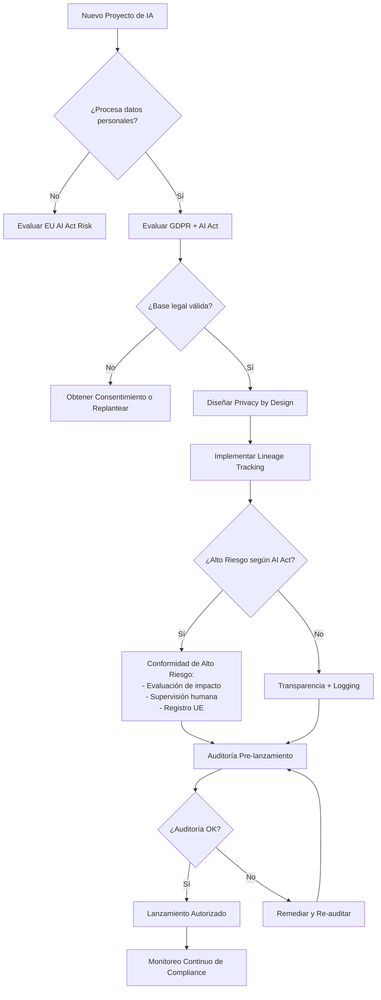
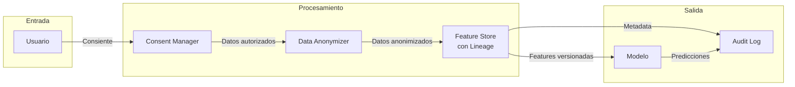

# ⚖️ Legal y Compliance en IA

## Introducción
El panorama regulatorio de la inteligencia artificial está evolucionando a una velocidad sin precedentes. Mientras los ingenieros de ML nos enfocamos en optimizar métricas técnicas, los legisladores en la Unión Europea, Estados Unidos y China están definiendo los límites legales dentro de los cuales deben operar nuestros sistemas. Desconocer estas regulaciones ya no es una excusa aceptable; una violación del GDPR puede costar hasta el 4% del volumen de negocio mundial anual de una empresa.

Esta nota analiza los marcos legales más impactantes para productos de IA, con énfasis en el GDPR y el EU AI Act. Como [[../06 - MLOps y Produccion/22 - Introduccion a MLOps/00 - Bienvenida|ML Engineer]], entender estos requisitos te permitirá diseñar sistemas que sean compliant by design, evitando costosas reingenierías posteriores al lanzamiento.

## 1. GDPR y Decisiones Automatizadas
El Artículo 22 del GDPR establece el derecho de toda persona a no ser objeto de decisiones basadas únicamente en el tratamiento automatizado, incluida la elaboración de perfiles, que produzcan efectos jurídicos significativos o le afecten de modo sustancial.

Implicaciones clave para productos de IA:
- **Derecho a explicación:** Los usuarios deben poder obtener una explicación significativa de la lógica subyacente a una decisión automatizada.
- **Consentimiento explícito:** El tratamiento de datos personales para perfiles automatizados requiere base legal clara (consentimiento o contrato).
- **Intervención humana:** Debe existir la posibilidad de intervención humana, expresión de punto de vista y impugnación de la decisión.
- **Protección de datos desde el diseño:** Implementar medidas técnicas y organizativas para garantizar la protección de datos (Privacy by Design).

Caso real: En 2020, la empresa alemana de scoring crediticio SCHUFA enfrentó una demanda por violación del Artículo 22 del GDPR. Un consumidor argumentó que el algoritmo de SCHUFA para calcular scores crediticios tomaba decisiones que afectaban su capacidad para alquilar viviendas, sin proporcionar una explicación adecuada de la lógica interna. El caso resaltó la tensión entre modelos propietarios de caja negra y los derechos de los consumidores europeos.

La siguiente tabla compara los enfoques regulatorios principales por región:

| Aspecto | Unión Europea (GDPR + AI Act) | Estados Unidos (Sectorial) | China (Regulación del Algoritmo) |
|---|---|---|---|
| **Filosofía** | Derechos del individuo, prevención de riesgos | Mercado libre con corrección ex-post | Control estatal, estabilidad social |
| **Ámbito** | Extraterritorial (cualquier empresa con usuarios UE) | Sectorial (salud, finance, transporte) | Dentro de China, data debe quedarse en China |
| **Decisiones automáticas** | Art. 22 GDPR: derecho a no ser sujeto | Fair Credit Reporting Act (FCRA) | Requiere transparencia algorítmica |
| **IA de alto riesgo** | EU AI Act: obligaciones estrictas | FDA para medical AI, SEC para finance | Registro obligatorio de algoritmos |
| **Sanciones máximas** | 4% VN worldwide (GDPR) / 7% (AI Act) | Variable por sector | Hasta suspensión del servicio |
| **Explicabilidad** | Mandatoria para alto riesgo | Recomendada, no siempre mandatoria | Requerida para "public opinion" |

💡 **Tip — Privacy by Design es más barato:** Estudios de IBM y Ponemon Institute muestran que corregir un defecto de privacidad en producción cuesta 100x más que diseñarlo correctamente desde el inicio. Integra mecanismos de anonimización, minimización de datos y control de consentimiento en tu pipeline de datos desde la fase de discovery.

## 2. EU AI Act - Categorías de Riesgo
El EU AI Act, aprobado en 2024, clasifica los sistemas de IA en cuatro niveles de riesgo, cada uno con obligaciones regulatorias distintas:

- **Prohibido:** Sistemas que manipulan subliminalmente, explotan vulnerabilidades de grupos vulnerables, o realizan scoring social por parte de Estados (con excepciones). Ejemplo: sistemas de reconocimiento emocional en trabajo o educación (con restricciones).
- **Alto Riesgo:** Sistemas que afectan seguridad fundamental o derechos fundamentales. Incluye: evaluación crediticia, selección de candidatos, sistemas médicos, justicia, educación, seguridad pública. Requieren: evaluación de riesgos, datos de alta calidad, trazabilidad, transparencia, supervisión humana.
- **Riesgo Limitado:** Sistemas con interacción directa con personas. Obligación principal: transparencia (el usuario debe saber que está interactuando con IA). Ejemplo: chatbots.
- **Riesgo Mínimo:** La mayoría de las aplicaciones de IA (recomendadores, filtros de spam, videojuegos). No hay obligaciones específicas, pero se recomienda código de conducta voluntario.

Caso real: En marzo de 2023, la Autoridad de Protección de Datos de Italia (Garante per la Protezione dei Dati Personali) impuso una prohibición temporal a ChatGPT, argumentando violaciones al GDPR relacionadas con la recolección de datos personales sin base legal adecuada y la falta de verificación de edad para menores. Aunque la prohibición fue levantada tras cambios implementados por OpenAI, ilustró el poder regulatorio de las autoridades nacionales bajo el marco europeo.

⚠️ **Advertencia:** No subestimes la categorización de riesgo de tu producto. Una startup de fintech puede pensar que su modelo de scoring es "riesgo limitado" cuando en realidad, bajo el EU AI Act, es "alto riesgo" porque afecta el acceso a servicios financieros esenciales. Una mala clasificación expone a la empresa a sanciones del 7% de su facturación global. Consulta siempre con asesoría legal especializada en IA antes del lanzamiento en Europa.

## 3. Gobernanza de Datos
Un producto de IA compliant requiere una gobernanza de datos robusta que abarque tres dimensiones:

- **Lineage (Linaje):** Trazabilidad completa del origen de los datos, transformaciones aplicadas y modelos entrenados. Herramientas como Apache Atlas, DataHub o Amundsen.
- **Consentimiento:** Gestión granular del consentimiento del usuario, con capacidad de revocación que desencadene la eliminación de sus datos de los datasets de entrenamiento.
- **Retención:** Políticas claras de tiempo de retención de datos personales y anonimización proactiva una vez cumplido el propósito.





## 4. Implementación Técnica
La gobernanza de datos no es solo un proceso legal; requiere código. El siguiente ejemplo muestra un sistema simplificado de tracking de lineage para datasets de entrenamiento:

```python
import hashlib
import json
from datetime import datetime
from typing import Dict, List

class DataLineageTracker:
    def __init__(self, project_name: str):
        self.project = project_name
        self.lineage_log: List[Dict] = []
    
    def log_dataset(
        self,
        dataset_name: str,
        source: str,
        schema: Dict,
        transformations: List[str],
        consent_basis: str
    ) -> str:
        """
        Registra un dataset con su linaje completo.
        Retorna un hash único para auditoría.
        """
        entry = {
            "timestamp": datetime.utcnow().isoformat(),
            "project": self.project,
            "dataset": dataset_name,
            "source": source,
            "schema_hash": hashlib.sha256(
                json.dumps(schema, sort_keys=True).encode()
            ).hexdigest()[:16],
            "transformations": transformations,
            "consent_basis": consent_basis,
            "retention_policy": "24_months"
        }
        entry["entry_hash"] = hashlib.sha256(
            json.dumps(entry, sort_keys=True).encode()
        ).hexdigest()
        self.lineage_log.append(entry)
        return entry["entry_hash"]
    
    def export_audit_trail(self, filepath: str):
        with open(filepath, "w", encoding="utf-8") as f:
            json.dump(self.lineage_log, f, indent=2, ensure_ascii=False)
    
    def check_consent_validity(self, dataset_name: str) -> bool:
        """Verifica que todos los datasets tengan base legal registrada."""
        for entry in self.lineage_log:
            if entry["dataset"] == dataset_name:
                if entry["consent_basis"] not in [
                    "explicit_consent", "contract", "legal_obligation", 
                    "vital_interests", "public_task", "legitimate_interests"
                ]:
                    return False
        return True

# Ejemplo de uso
tracker = DataLineageTracker("credit_scoring_v2")
hash_id = tracker.log_dataset(
    dataset_name="training_set_2024_q1",
    source="CRM_DB.customers",
    schema={"age": "int", "income": "float", "consent_flag": "bool"},
    transformations=["null_imputation", "zscore_normalization", "pii_hashing"],
    consent_basis="explicit_consent"
)
print(f"Lineage registered: {hash_id}")
tracker.export_audit_trail("lineage_audit.json")
```

---

## 📦 Código de Compresión

```python
"""
compress_compliance.py
Sistema de verificación de compliance pre-lanzamiento
para productos de IA en la UE.
"""

from dataclasses import dataclass
from enum import Enum

class RiskLevel(Enum):
    PROHIBITED = "prohibido"
    HIGH = "alto"
    LIMITED = "limitado"
    MINIMAL = "minimo"

@dataclass
class AIProductCompliance:
    name: str
    processes_personal_data: bool
    automated_decisions: bool
    sector: str  # finance, health, education, etc.
    uses_biometrics: bool
    affects_fundamental_rights: bool

    def classify_ai_act(self) -> RiskLevel:
        if self.sector in ["social_scoring_gov"] or self.uses_biometrics_for_mass_surveillance():
            return RiskLevel.PROHIBITED
        if self.sector in ["finance", "health", "justice", "education"] and self.affects_fundamental_rights:
            return RiskLevel.HIGH
        if self.automated_decisions and self.processes_personal_data:
            return RiskLevel.LIMITED
        return RiskLevel.MINIMAL
    
    def uses_biometrics_for_mass_surveillance(self):
        # Simplificación para el ejemplo
        return self.uses_biometrics and self.sector == "government"

    def generate_checklist(self) -> list:
        risk = self.classify_ai_act()
        checklist = []
        if risk == RiskLevel.HIGH:
            checklist.extend([
                "☐ Realizar evaluación de impacto fundamental",
                "☐ Registrar sistema en base de datos EU",
                "☐ Implementar supervisión humana efectiva",
                "☐ Garantizar trazabilidad completa (lineage)",
                "☐ Proporcionar explicabilidad a usuarios",
            ])
        if self.processes_personal_data:
            checklist.extend([
                "☐ Verificar base legal GDPR (Art. 6)",
                "☐ Implementar derecho de oposición (Art. 22)",
                "☐ Habilitar portabilidad de datos (Art. 20)",
            ])
        if self.automated_decisions:
            checklist.append("☐ Incluir intervención humana en loop")
        return checklist

if __name__ == "__main__":
    product = AIProductCompliance(
        name="LoanScorer Pro",
        processes_personal_data=True,
        automated_decisions=True,
        sector="finance",
        uses_biometrics=False,
        affects_fundamental_rights=True,
    )
    print(f"Producto: {product.name}")
    print(f"Riesgo AI Act: {product.classify_ai_act().value.upper()}")
    print("\nChecklist Pre-Lanzamiento:")
    for item in product.generate_checklist():
        print(f"  {item}")
```

---

## 🎯 Proyecto Documentado

### Descripción
Desarrollo de una plataforma de segmentación de clientes para retail que opera en múltiples jurisdicciones (UE, EE.UU., LATAM) y debe cumplir simultáneamente con GDPR, CCPA y la futura regulación brasileña LGPD. El sistema utiliza clustering no supervisado sobre datos pseudonimizados, garantizando que ningún dato personal cruce las fronteras sin el mecanismo de transferencia adecuado (SCCs - Standard Contractual Clauses).

### Requisitos Funcionales
1. Clasificación automática de nuevos clientes en segmentos con latencia < 100ms.
2. Motor de pseudonimización determinista para mantener utilidad estadística sin identificación directa.
3. Consent Management Platform (CMP) integrada con granularidad por propósito de uso.
4. Exportación automática de datos personales (derecho de portabilidad) en formato JSON estandarizado.
5. Alertas de retención: notificación automática cuando datos están próximos a exceder el período de retención configurado.

### Componentes Principales
- **Pseudonimization Service:** HMAC-SHA256 con clave rotativa almacenada en HSM
- **Consent DB:** PostgreSQL encriptado con registro inmutable de versiones de consentimiento
- **Segmentation Model:** K-Means sobre embeddings de comportamiento (no PII)
- **Compliance Gateway:** API que valida cada solicitud contra políticas de transferencia de datos por región

### Métricas de Éxito
- **Tiempo de respuesta a DSAR (Data Subject Access Request):** < 72 horas
- **Tasa de datos correctamente pseudonimizados:** 100%
- **Violaciones de compliance post-auditoría:** 0

### Referencias
- European Parliament. "Artificial Intelligence Act." Regulation (EU) 2024/1689.
- Voigt, P., & von dem Bussche, A. "The EU General Data Protection Regulation (GDPR)." Springer, 2017.
- OneTrust. "AI Governance Framework." onetrust.com
