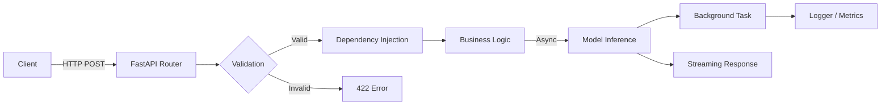

# ⚡ FastAPI for ML

## Introduction

Modern machine learning services rarely live in isolation. They sit behind REST or WebSocket endpoints, fielding thousands of concurrent requests from mobile apps, browsers, and internal microservices. [[01 - FastAPI for ML|FastAPI]] has become the de facto framework for these workloads because it unifies type-safe validation, automatic documentation, and high-performance async I/O in a single Python library.

Unlike legacy WSGI frameworks that block on every request, FastAPI is built on ASGI and `asyncio`, allowing a single process to interleave model inference, database queries, and third-party API calls without wasting CPU cycles. This is critical for ML systems where a single prediction might trigger feature store lookups, vector database searches, and post-processing pipelines.

In this course, you will learn how to structure production-grade ML APIs, validate complex tensor inputs with Pydantic v2, stream partial results to clients, and avoid the concurrency pitfalls that silently tank throughput in naive async deployments.

## 1. ASGI vs WSGI and Async Python

The Python web ecosystem is split between two gateway interface standards:

- **WSGI** (Web Server Gateway Interface) is synchronous. Each request occupies a worker process or thread until completion. Frameworks like Flask and Django traditionally rely on WSGI.
- **ASGI** (Asynchronous Server Gateway Interface) supports coroutines. A single worker can handle many concurrent connections by yielding control when waiting on I/O.

For ML inference, this distinction is existential. A WSGI worker blocked on a 200 ms model prediction cannot serve other requests. Under load, you exhaust the worker pool and drop connections. ASGI lets the event loop schedule another coroutine while the GPU or remote service works.

Real case: Netflix's dispatch framework uses ASGI-compatible services to coordinate incident response across thousands of engineers. Their internal platform handles bursty traffic by design, exactly the pattern ML APIs face during product launches or viral content spikes.

⚠️ **Warning:** Simply adding `async` to a function does not make it non-blocking. If you call a CPU-bound NumPy operation or a synchronous `requests.get()` inside an `async def` endpoint, you stall the entire event loop. Offload CPU work to `run_in_executor` or use native async libraries like `httpx`.

💡 **Tip:** Think of the event loop as a project manager. If one worker (coroutine) says "I'm waiting for a delivery" (I/O), the manager assigns tasks to others instead of staring at the clock.

## 2. Pydantic v2 for ML Input/Output Schemas

ML APIs receive heterogeneous payloads: tabular rows, image base64 strings, token sequences, or nested feature dictionaries. Pydantic v2 enforces schemas at runtime with Rust-backed validation, generating clear 422 errors for malformed inputs.

Consider a sentiment analysis endpoint:

```python
from fastapi import FastAPI
from pydantic import BaseModel, Field
from typing import List

class SentimentRequest(BaseModel):
    texts: List[str] = Field(..., min_length=1, max_length=100)
    language: str = Field(default="en", pattern="^(en|es|fr)$")

class SentimentResponse(BaseModel):
    predictions: List[float]
    model_version: str

app = FastAPI()

@app.post("/predict", response_model=SentimentResponse)
async def predict(request: SentimentRequest):
    # model inference here
    return SentimentResponse(
        predictions=[0.95, 0.12],
        model_version="bert-base-1.2.0"
    )
```

Pydantic v2 serializes responses automatically and generates OpenAPI documentation. For ML engineers, this eliminates an entire class of integration bugs caused by shape mismatches or missing feature columns.

| Feature | FastAPI + Pydantic v2 | Flask + Marshmallow | Django DRF |
|---|---|---|---|
| Auto-generated OpenAPI | ✅ Native | ⚠️ Via extensions | ✅ Native |
| Async support | ✅ ASGI | ❌ WSGI (blocking) | ⚠️ Channels (complex) |
| Validation speed | 🚀 Rust-core | 🐢 Pure Python | 🐢 Pure Python |
| ML schema ergonomics | Excellent | Moderate | Verbose |
| Dependency injection | Built-in | Manual | Built-in |

## 3. Background Tasks, WebSockets, and Streaming

Not every prediction needs an immediate response. Background tasks let you return 202 Accepted and defer heavy work.

```python
from fastapi import BackgroundTasks

def log_prediction(request_id: str, result: dict):
    # write to warehouse, notify monitoring
    pass

@app.post("/predict-async")
async def predict_async(request: SentimentRequest, background: BackgroundTasks):
    result = await run_model(request.texts)
    background.add_task(log_prediction, request_id="uuid", result=result)
    return {"status": "processing", "request_id": "uuid"}
```

For real-time ML, WebSockets enable bidirectional streaming. A speech-to-text model can push partial transcripts as audio chunks arrive, rather than buffering the entire file.

Streaming responses (using `StreamingResponse`) are ideal for token-by-token generation from LLMs. Clients receive the first token without waiting for the full sequence to complete.



## 4. Dependency Injection and Testing

FastAPI's dependency injection system (`Depends`) decouples request handling from infrastructure concerns. You can inject database sessions, feature store clients, or model singletons and override them during tests.

```python
from fastapi import Depends

def get_model():
    return SentimentModel()

@app.post("/predict")
async def predict(request: SentimentRequest, model=Depends(get_model)):
    return model.predict(request.texts)
```

For testing, swap `get_model` with a mock that returns fixed tensors. This keeps unit tests fast and deterministic, a pattern essential for [[03 - Testing in ML Systems|ML testing strategies]].

⚠️ **Warning:** Do not create a new database connection inside every dependency call. Use connection pooling or context managers to avoid exhausting file descriptors under load.

## 5. Performance Tuning and Throughput

Throughput is the cardinal metric for ML APIs:

$$
\text{Throughput} = \frac{\text{Requests}}{\text{Time}}
$$

To maximize throughput:

- Use `uvicorn` with `--loop uvloop` for a faster event loop implementation
- Enable HTTP/2 via a reverse proxy (Traefik, NGINX) to multiplex streams
- Batch small requests inside the endpoint to saturate GPU utilization
- Cache repeated queries with Redis or an in-memory LRU store

Real case: Netflix's dispatch framework achieves low-latency incident updates by combining ASGI concurrency with aggressive caching of frequently accessed runbooks. ML teams can apply the same pattern to model metadata and feature dictionaries.

💡 **Tip:** Profile with `wrk` or `locust` before optimizing. Premature batching can increase latency for individual users; measure the P99, not just the average.


---

## 📦 Compression Code

```python
"""
FastAPI ML Service Template
- Async endpoints with Pydantic v2
- Background tasks for logging
- Dependency injection for testability
"""
from fastapi import FastAPI, BackgroundTasks, Depends
from pydantic import BaseModel, Field
from typing import List
import asyncio

app = FastAPI(title="ML Gateway")

class PredictRequest(BaseModel):
    inputs: List[str] = Field(..., min_length=1)

class PredictResponse(BaseModel):
    outputs: List[float]
    version: str = "1.0.0"

class ModelStub:
    async def predict(self, texts: List[str]) -> List[float]:
        await asyncio.sleep(0.01)  # simulate I/O
        return [0.5] * len(texts)

def get_model():
    return ModelStub()

async def log_request(inputs: List[str]):
    await asyncio.sleep(0.005)
    print(f"Logged {len(inputs)} inputs")

@app.post("/predict", response_model=PredictResponse)
async def predict(
    req: PredictRequest,
    background: BackgroundTasks,
    model=Depends(get_model),
):
    outputs = await model.predict(req.inputs)
    background.add_task(log_request, req.inputs)
    return PredictResponse(outputs=outputs)
```

## 🎯 Documented Project

### Description

Build a real-time text classification gateway that accepts batch requests, validates input schemas, streams progress for large batches, and logs predictions asynchronously to a data warehouse sink.

### Functional Requirements

1. Expose a `POST /predict` endpoint accepting 1–500 texts per request with language validation.
2. Return a streamed NDJSON response for batches > 50 items to improve perceived latency.
3. Implement a `POST /predict-async` endpoint returning 202 with a job ID for batches > 200 items.
4. Log every prediction (input hash, output, model version) via background tasks.
5. Provide OpenAPI documentation and a health-check endpoint for Kubernetes probes.

### Main Components

- FastAPI application with Pydantic v2 request/response models
- Async model client with connection pooling
- Background task queue for non-blocking audit logging
- Redis cache layer for repeated identical inputs
- Reverse proxy (Traefik) for TLS termination and rate limiting

### Success Metrics

- Throughput ≥ 1,000 RPS on a single 4-vCPU instance
- P99 latency < 150 ms for batches of 10 items
- Zero 500 errors under 5× normal load (graceful degradation)
- 100% request audit coverage without blocking responses

### References

- [FastAPI Documentation](https://fastapi.tiangolo.com/)
- [Pydantic v2 Migration Guide](https://docs.pydantic.dev/latest/migration/)
- Netflix Tech Blog: "Building Netflix's Dispatch"
