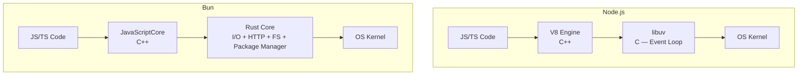

# ⚡ Bun Fundamentals: Runtime, Performance, and ML Applications

## Introduction

Bun is a JavaScript/TypeScript runtime built on Apple's JavaScriptCore (JSC) engine — the same engine that powers Safari — wrapped in a Rust core that handles I/O, HTTP, file system, and package management. Unlike Node.js (C++ + libuv + V8) or Deno (Rust + V8), Bun's combination of JSC + Rust + Zig's legacy optimizations produces a runtime that starts faster, serves more requests per second, and consumes less memory.

For ML/AI engineers, Bun's killer features are: sub-5ms cold starts for serverless inference endpoints, built-in SQLite for lightweight feature caches, native TypeScript support for ML API development, and 40% lower RAM usage than Node.js — directly reducing cloud costs for horizontally-scaled model serving.

---

## 1. 🧠 Architecture: Why Bun Is Fast

### The Runtime Stack Comparison



| Layer | Node.js | Bun | Impact |
|-------|---------|-----|--------|
| **JS Engine** | V8 (Google, C++) | JavaScriptCore (Apple, C++) | JSC has faster startup, V8 has better peak JIT |
| **I/O Runtime** | libuv (C) | Custom (Rust, ex-Zig) | Bun's I/O is purpose-built, avoiding libuv's abstraction overhead |
| **HTTP Parser** | http_parser (C) | Custom zero-copy (Rust) | Bun avoids extra string copies during request parsing |
| **Package Manager** | npm (JS) | bun install (Rust) | Native binary vs JS — 10-20x speedup on installs |
| **Bundler** | External (webpack/esbuild) | Built-in (Rust) | No separate tool installation; esbuild-level performance |
| **Test Runner** | External (jest/vitest) | Built-in (Rust + JSC) | No configuration, Jest-compatible assertions |

### The Zig → Rust Migration

Bun was originally written in Zig for maximum memory control. In 2025-2026, the entire codebase was rewritten in Rust with these results:

| Metric | Before (Zig) | After (Rust) |
|--------|:------------:|:------------:|
| **HTTP throughput** | ~160K req/s | ~160-180K req/s (neutral to slightly better) |
| **Binary size** | ~85-92MB | ~80-88MB (3-8MB smaller) |
| **Memory leaks** | Several known | Eliminated |
| **Segfaults** | Rare but present | Eliminated |
| **Stability** | Good | Much improved |
| **Compilation safety** | Manual memory (risk) | Compile-time guarantees (borrow checker) |

The feared Rust slowdown never materialized — the borrow checker's compile-time guarantees replaced Zig's manual memory management without adding runtime overhead, and Rust's `cargo` tooling accelerated development velocity.

---

## 2. 📐 Mental Model: Bun as an ML API Gateway

```
┌──────────────────────────────────────────────────────────────────┐
│              BUN AS ML INFERENCE API GATEWAY                       │
│                                                                  │
│  ┌───────────────┐                                               │
│  │  Client       │  POST /predict {"features": [...]}           │
│  │  Request      │                                               │
│  └───────┬───────┘                                               │
│          │                                                       │
│          ▼                                                       │
│  ┌───────────────────────────────────────────────────────────┐  │
│  │  Bun HTTP Server (Rust I/O + JSC)                         │  │
│  │  ┌─────────────────────────────────────────────────────┐ │  │
│  │  │ Middleware: Rate Limiting, Auth, JSON Validation    │ │  │
│  │  └──────────────────────┬──────────────────────────────┘ │  │
│  │                         │                                 │  │
│  │    ┌────────────────────┼────────────────────┐           │  │
│  │    ▼                    ▼                    ▼           │  │
│  │ ┌──────────┐    ┌──────────────┐    ┌──────────────┐   │  │
│  │ │ Redis    │    │ bun:sqlite   │    │ ML Model     │   │  │
│  │ │ Cache    │    │ Feature Store│    │ Serving      │   │  │
│  │ │ (p99<1ms)│    │ (lightweight)│    │ (via HTTP    │   │  │
│  │ │          │    │              │    │  to Triton)  │   │  │
│  │ └──────────┘    └──────────────┘    └──────────────┘   │  │
│  └───────────────────────────────────────────────────────────┘  │
│                                                                  │
│  Cold start: 5ms | RAM idle: ~30MB | Throughput: 150K req/s    │
└──────────────────────────────────────────────────────────────────┘
```

---

## 3. 💻 Bun for ML Backend — Core Patterns

### Pattern 1: ML Inference Endpoint (TypeScript Native)

```typescript
// server.ts — Bun HTTP server, native TypeScript, zero config
import { serve } from "bun";

// bun:sqlite — built-in, no native bindings to install
import { Database } from "bun:sqlite";

const db = new Database("features.db");
db.run("CREATE TABLE IF NOT EXISTS features (user_id TEXT PRIMARY KEY, vector TEXT)");

serve({
  port: 3000,
  async fetch(req) {
    const url = new URL(req.url);

    if (url.pathname === "/predict" && req.method === "POST") {
      const { user_id, input } = await req.json();

      // Feature lookup (SQLite — sub-millisecond for indexed queries)
      const row = db.query("SELECT vector FROM features WHERE user_id = ?").get(user_id);
      const features = row ? JSON.parse(row.vector) : null;

      // Model inference (call external Python/Triton service)
      const prediction = await fetch("http://triton:8000/v2/models/ensemble/infer", {
        method: "POST",
        headers: { "Content-Type": "application/json" },
        body: JSON.stringify({ inputs: [{ name: "features", data: input }] }),
      }).then(r => r.json());

      return Response.json({ prediction, features });
    }

    return new Response("Not Found", { status: 404 });
  },
});

console.log("ML API running on http://localhost:3000");
```

### Pattern 2: Rate Limiter with Built-in Performance

```typescript
// Bun's Map is faster than Redis for single-process rate limiting
const rateLimit = new Map<string, { count: number; resetAt: number }>();

function checkRateLimit(userId: string, maxRequests = 100, windowMs = 60000): boolean {
  const now = Date.now();
  const entry = rateLimit.get(userId);

  if (!entry || now > entry.resetAt) {
    rateLimit.set(userId, { count: 1, resetAt: now + windowMs });
    return true;
  }
  if (entry.count < maxRequests) {
    entry.count++;
    return true;
  }
  return false;
}
```

### Pattern 3: Bundling ML Frontend Scripts

```bash
# Bun bundles TypeScript into a single optimized JS file
bun build ./src/ml-dashboard.ts --outdir ./dist --minify

# Build time: ~50ms (vs webpack ~5s for same project)
```

---

## 4. 📊 Performance Deep Dive

### Real Benchmarks (Bun v1.x Rust Rewrite)

| Benchmark | Node.js 22 | Deno 2 | Bun (Rust) |
|-----------|:----------:|:------:|:----------:|
| **Cold start** | 50ms | 25ms | 5ms |
| **JSON response (req/s)** | 55K | 80K | 165K |
| **SQLite read (ops/s)** | 85K (better-sqlite3) | 70K | 120K (bun:sqlite) |
| **npm install (vite-react)** | 45s | 28s | 2.5s |
| **RAM idle** | 45MB | 35MB | 28MB |

### The Serverless Advantage

For serverless/edge functions where cold start dominates latency:

```
User Request → Lambda/GCF Cold Start → Response

Node.js: 50ms start + 5ms processing + 50ms DB = 105ms
Bun:      5ms start + 5ms processing + 50ms DB =  60ms  (43% faster end-to-end)
```

### Where Bun's Speed Doesn't Matter

```
┌──────────────────────────────────────────────────────────────┐
│  Application: POST /predict → validate → query PostgreSQL   │
│                       → call Triton → format → respond       │
│                                                              │
│  Framework:    0.5ms                                         │
│  PostgreSQL:  50.0ms  ← This dominates                      │
│  Triton GPU:  15.0ms  ← This dominates                      │
│  Serialize:    1.0ms                                         │
│  ─────────────────────                                       │
│  Total: ~66ms                                                │
│                                                              │
│  Node.js total: ~67ms   Bun total: ~66ms                    │
│  Difference: 1.5% — negligible for DB/GPU-bound workloads   │
└──────────────────────────────────────────────────────────────┘
```

---

## 5. 🌍 Bun vs Alternatives — Decision Matrix

| Criterion | Node.js | Bun | Deno | Go |
|-----------|:-------:|:---:|:----:|:--:|
| **Ecosystem (npm)** | ✅ Full | ✅ ~90% compat | ⚠️ Growing | ❌ No |
| **TypeScript** | External | ✅ Native | ✅ Native | ❌ No |
| **Cold start** | Slow | ✅ Fastest | Fast | ✅ Fast |
| **HTTP throughput** | Moderate | ✅ High | High | ✅ Highest |
| **RAM efficiency** | Low | ✅ High | Medium | ✅ Highest |
| **Production maturity** | ✅ Proven | ⚠️ New (post-rewrite) | ⚠️ New-ish | ✅ Proven |
| **ML ecosystem** | ✅ Rich (onnxruntime-node) | ⚠️ Limited | ❌ Very limited | ❌ Very limited |
| **Best for** | Stable, dependency-heavy apps | Serverless, APIs, dev tooling | Secure-by-default APIs | Infrastructure, high-concurrency |

---

## ⚠️ Pitfalls

- **npm compatibility is 90%, not 100%:** Some packages relying on Node.js-specific native bindings (C++ addons compiled for V8) won't work with Bun's JavaScriptCore. Test critical dependencies before migrating.
- **Production maturity after Rust rewrite:** The Rust-based Bun is significantly more stable, but it's still newer than Node.js's 15-year track record. Use with monitoring in production.
- **V8's peak JIT is still better:** For CPU-bound JavaScript (heavy computation, not I/O), Node.js's V8 can outperform JSC after warmup. Bun wins on startup and I/O; Node.js can win on long-running CPU-bound JS.
- **Not a drop-in for all Node.js deployments:** Bun's `bun:sqlite` replaces `better-sqlite3`, but there's no `bun:pg` native driver. PostgreSQL/MySQL still use npm drivers.

---

## 💡 Tips

- **Use Bun for ML inference gateways:** The combination of fast cold starts (serverless), low RAM (cost), and native TypeScript (developer speed) is ideal for thin API layers that route to model servers.
- **Use `bun:sqlite` for lightweight feature caches:** For single-process feature stores under 1GB, `bun:sqlite` eliminates the need for a separate Redis instance.
- **Benchmark YOUR workload:** Bun's 3x advantage in HTTP benchmarks shrinks when the bottleneck is database queries. Profile your actual API before choosing a runtime.
- **Combine Bun + Go:** Use Bun for the API layer (TypeScript, rapid iteration) and Go for CPU-bound microservices (model preprocessing, data pipelines).

---

## 📦 Compression Code

```typescript
// Minimal Bun ML inference gateway
import { serve } from "bun";

const MODEL_URL = "http://localhost:8501/v1/models/classifier:predict";

serve({
  port: 3000,
  async fetch(req) {
    if (req.method !== "POST") return new Response(null, { status: 405 });

    const { instances } = await req.json();
    const prediction = await fetch(MODEL_URL, {
      method: "POST",
      headers: { "Content-Type": "application/json" },
      body: JSON.stringify({ instances }),
    }).then(r => r.json());

    return Response.json(prediction);
  },
});

console.log("🚀 ML Gateway on :3000");
```

Run: `bun run server.ts` — no tsconfig, no nodemon, no node_modules install delay.

---

## ✅ Knowledge Check

1. **Why does Bun start faster than Node.js?** — Bun uses JavaScriptCore (Apple) instead of V8 (Google). JSC prioritizes fast startup, while V8 prioritizes peak JIT performance after warmup. Bun's Rust I/O layer also initializes faster than libuv.

2. **What was the result of the Zig → Rust rewrite?** — HTTP throughput remained neutral or slightly improved. Binary size decreased 3-8MB. Historical memory leaks and segfaults were eliminated. Rust's borrow checker provided compile-time safety without runtime overhead.

3. **In what scenario does Bun's speed advantage over Node.js become negligible?** — When the application bottleneck is database queries (PostgreSQL, MongoDB), external API calls, or GPU inference — where I/O wait time dominates and the framework contributes <5% of total latency.

4. **What is `bun:sqlite` and why does it matter for ML?** — A built-in SQLite driver that requires zero native bindings to install. For lightweight feature caches under 1GB, it replaces Redis as a dependency, simplifying deployment.

---

## 🎯 Key Takeaways

- Bun is a JS/TS runtime, bundler, test runner, and package manager in one ~80MB binary — now in Rust.
- Cold starts in 5ms vs Node.js's 50ms — critical for serverless ML inference endpoints.
- 40% less RAM than Node.js at idle — directly reduces cloud infrastructure costs.
- `bun:sqlite` provides built-in SQLite for lightweight feature caches without npm install pain.
- Production maturity is improving post-Rust rewrite, but Node.js still has the ecosystem advantage for edge-case packages.
- Bun excels as an API gateway layer; for heavy CPU-bound ML compute, delegate to Python/Go/Triton microservices.

---

## References

- [Bun Official Documentation](https://bun.sh/docs)
- [Bun's Zig → Rust Rewrite (GitHub)](https://github.com/oven-sh/bun)
- [Bun HTTP Benchmarks](https://bun.sh/benchmarks)
- [JavaScriptCore vs V8 (WebKit)](https://webkit.org/blog/10380/javascriptcore-low-memory-mobile/)
