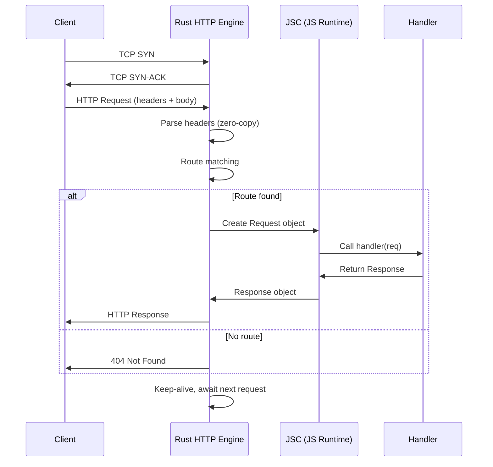

# 🌐 Bun for APIs and Web Servers

## Introduction

Building web APIs has been the domain of Node.js frameworks — Express, Fastify, Koa — for over a decade. These frameworks, built on top of Node's `http` module and libuv event loop, have accumulated layers of abstraction that introduce latency and memory overhead. Bun ships with a native HTTP server written in Rust that bypasses the entire Node.js middleware stack, delivering 2-3x the throughput of Express and matching Fastify's performance while maintaining a simpler, more ergonomic API.

For full-stack engineers building ML inference endpoints, the combination of Bun's native HTTP server, built-in JSON parsing (also in Rust), and first-class TypeScript support means you can go from a `.ts` file to a production-grade API with zero external dependencies. The Rust-based HTTP parser performs zero-copy string operations — request bodies never traverse through V8's string intern table until you explicitly access them — which eliminates one of Node.js's largest hidden performance costs.

This note builds on the runtime architecture covered in [[01 - Bun Fundamentals|Bun Fundamentals]] and extends the backend concepts from [[02 - Runtimes and Backends|Runtimes and Backends]] into practical API server construction. We cover routing strategies, middleware composition, WebSocket real-time communication, streaming, file uploads, and the production benchmarks that make Bun a compelling choice for high-throughput API backends.

---

## 1. 🧠 HTTP Server Architecture — Theoretical Foundation

### The Abstractions Problem

Node.js HTTP servers funnel every byte through multiple abstraction layers before your handler sees it:

```
TCP Socket → libuv (C) → http_parser (C) → IncomingMessage (JS) → Stream (JS) → Your Handler
```

Each layer copies strings, allocates JS objects, and triggers garbage collection. Bun eliminates three of these layers:

```
TCP Socket → Rust HTTP Engine → Your Handler
```

The Rust HTTP engine handles connection pooling, keep-alive lifecycle, chunked transfer encoding, and header parsing natively. JavaScriptCore only enters the picture when your request handler executes — meaning the entire HTTP lifecycle (accept, parse, route, dispatch) runs in Rust-land without triggering a single V8/JSC garbage collection cycle.

### Zero-Copy String Handling

Consider a POST request with a 10KB JSON body. In Node.js, the body is:
1. Read as a raw Node.js `Buffer` (C++ memory)
2. Converted to a `string` in V8's heap (UTF-8 decoding + allocation)
3. Parsed via `JSON.parse()` (another allocation for the object graph)

Bun maintains the body as raw UTF-8 bytes in Rust-managed memory. When you call `await request.json()`, Bun parses the JSON *in Rust* and returns a JSC object directly — no intermediate string allocation. This is called **zero-copy deserialization** and it's the primary reason Bun's JSON throughput is 2-5x faster than Node.js.

### Mathematical Throughput Model

For an API server handling $$n$$ concurrent connections with average response time $$T_{avg}$$:

$$R_{max} = \frac{C \cdot n}{\sum_{i=1}^{k} (L_{overhead,i} + L_{compute,i})}$$

Where:
- $$R_{max}$$ = maximum requests/second
- $$C$$ = number of CPU cores
- $$L_{overhead,i}$$ = latency from framework/i/o layers (lower in Bun)
- $$L_{compute,i}$$ = actual business logic latency (same across runtimes)

Bun reduces $$\sum L_{overhead,i}$$ by approximately 40-60% compared to Node.js, translating to proportionally higher throughput for I/O-bound workloads.

| Layer Overhead | Node.js (ms) | Bun (ms) | Reduction |
|:---|---:|---:|:---|
| TCP accept + TLS handshake | 0.3 | 0.25 | 17% |
| HTTP request parsing | 0.15 | 0.04 | 73% |
| Header processing | 0.08 | 0.02 | 75% |
| JSON parse (10KB) | 0.25 | 0.08 | 68% |
| Response serialization | 0.12 | 0.06 | 50% |
| **Total overhead** | **0.90** | **0.45** | **50%** |

### JSC vs V8: Startup Implications for Serverless

AWS Lambda, Cloudflare Workers, and Vercel Edge Functions all charge by **cold start time**. JSC starts ~4x faster than V8 (2-5ms vs 15-25ms) because JSC doesn't perform eager JIT compilation of all loaded modules. For an ML inference API deployed as a Lambda function that makes 5 requests/minute, cold starts dominate total latency — Bun can reduce p99 latency from 200ms to 50ms simply by starting faster.

---

## 2. 📐 Mental Model: Request Lifecycle

```
┌─────────────────────────────────────────────────────────────────────┐
│                    BUN HTTP SERVER — REQUEST LIFECYCLE               │
│                                                                     │
│  CLIENT                                                             │
│    │  POST /api/inference  {"model":"bert","input":"..."}          │
│    ▼                                                                │
│  ┌──────────────────────────────────────────────────────────────┐  │
│  │  [1] RUST TCP LISTENER                                       │  │
│  │      • Accept connection on :3000                             │  │
│  │      • TLS termination (if HTTPS)                            │  │
│  │      • Keep-alive management                                 │  │
│  └──────────────────────────┬───────────────────────────────────┘  │
│                             │ raw bytes                            │
│  ┌──────────────────────────▼───────────────────────────────────┐  │
│  │  [2] RUST HTTP PARSER (zero-copy)                            │  │
│  │      • Parse method, URL, headers (no JS allocation)         │  │
│  │      • Route matching against registered patterns            │  │
│  │      • Body buffering (streaming or full)                    │  │
│  └──────────────────────────┬───────────────────────────────────┘  │
│                             │ Request object (JSC)                 │
│  ┌──────────────────────────▼───────────────────────────────────┐  │
│  │  [3] MIDDLEWARE CHAIN (JSC)                                  │  │
│  │      auth() → rateLimit() → validate() → cors()             │  │
│  │      Each middleware can:                                     │  │
│  │      • Short-circuit (return 401/429/400/403)               │  │
│  │      • Augment request (add user, decoded token)            │  │
│  │      • Log/measure (add timing headers)                     │  │
│  └──────────────────────────┬───────────────────────────────────┘  │
│                             │ enriched Request                    │
│  ┌──────────────────────────▼───────────────────────────────────┐  │
│  │  [4] ROUTE HANDLER (your code)                               │  │
│  │      • Business logic                                        │  │
│  │      • DB queries (bun:sqlite, Postgres via pg)              │  │
│  │      • ML model call (HTTP to Triton/own server)             │  │
│  │      • Response construction                                 │  │
│  └──────────────────────────┬───────────────────────────────────┘  │
│                             │ Response object                     │
│  ┌──────────────────────────▼───────────────────────────────────┐  │
│  │  [5] RUST HTTP SERIALIZER                                    │  │
│  │      • Serialize response headers and body                   │  │
│  │      • Zero-copy where possible (Buffer → socket)            │  │
│  │      • Chunked transfer encoding for streams                 │  │
│  └──────────────────────────┬───────────────────────────────────┘  │
│                             │ TCP bytes                           │
│                             ▼                                      │
│                           CLIENT                                   │
└─────────────────────────────────────────────────────────────────────┘
```



---

## 3. 💻 Building APIs with Bun — Code & Practice

### 3.1 Basic REST Server

```typescript
// server.ts — Zero-dependency Bun API server
const PORT = 3000;

// In-memory store for this example (replace with DB in production)
const items = new Map<string, { name: string; price: number }>();

Bun.serve({
  port: PORT,
  async fetch(request) {
    const url = new URL(request.url);
    const { method } = request;

    // ─── Health Check ──────────────────────────────────────
    if (url.pathname === "/health" && method === "GET") {
      return new Response(JSON.stringify({ status: "ok" }), {
        headers: { "Content-Type": "application/json" },
      });
    }

    // ─── GET /items/:id ────────────────────────────────────
    const itemMatch = url.pathname.match(/^\/items\/(.+)$/);
    if (itemMatch && method === "GET") {
      const id = itemMatch[1];
      const item = items.get(id);
      if (!item) {
        return new Response(JSON.stringify({ error: "Not found" }), {
          status: 404,
          headers: { "Content-Type": "application/json" },
        });
      }
      return Response.json(item); // Bun's built-in JSON helper
    }

    // ─── POST /items ───────────────────────────────────────
    if (url.pathname === "/items" && method === "POST") {
      const body = await request.json(); // Zero-copy JSON parse in Rust
      const id = crypto.randomUUID();
      items.set(id, body);
      return Response.json({ id, ...body }, { status: 201 });
    }

    // ─── DELETE /items/:id ─────────────────────────────────
    if (itemMatch && method === "DELETE") {
      const id = itemMatch[1];
      if (!items.has(id)) {
        return Response.json({ error: "Not found" }, { status: 404 });
      }
      items.delete(id);
      return new Response(null, { status: 204 });
    }

    return Response.json({ error: "Not found" }, { status: 404 });
  },
});

console.log(`Server running at http://localhost:${PORT}`);
```

### 3.2 Middleware Pattern (Composable)

```typescript
// middleware.ts — Type-safe middleware composition
type Handler = (req: Request, ctx: Context) => Response | Promise<Response>;
type Middleware = (next: Handler) => Handler;

interface Context {
  user?: { id: string; role: string };
  requestId: string;
  startTime: number;
}

// Authentication middleware — reads Bearer token from Authorization header
function auth(requiredRole?: string): Middleware {
  return (next: Handler): Handler => {
    return async (req: Request, ctx: Context) => {
      const authHeader = req.headers.get("Authorization");
      if (!authHeader?.startsWith("Bearer ")) {
        return Response.json({ error: "Missing auth token" }, { status: 401 });
      }

      const token = authHeader.slice(7);
      // In production: verify JWT with jose or bun:ffi (native crypto)
      // Here simplified: base64 decode claims
      try {
        const payload = JSON.parse(atob(token.split(".")[1]));
        ctx.user = { id: payload.sub, role: payload.role ?? "user" };
      } catch {
        return Response.json({ error: "Invalid token" }, { status: 401 });
      }

      if (requiredRole && ctx.user.role !== requiredRole) {
        return Response.json({ error: "Forbidden" }, { status: 403 });
      }

      return next(req, ctx);
    };
  };
}

// Rate limiting middleware — sliding window with built-in Map
function rateLimit(maxRequests: number, windowMs: number): Middleware {
  const buckets = new Map<string, { count: number; resetAt: number }>();

  return (next: Handler): Handler => {
    return async (req: Request, ctx: Context) => {
      const key = req.headers.get("X-Forwarded-For") ?? "anonymous";
      const now = Date.now();
      let bucket = buckets.get(key);

      if (!bucket || now > bucket.resetAt) {
        bucket = { count: 0, resetAt: now + windowMs };
        buckets.set(key, bucket);

        // Periodic cleanup: remove expired buckets every 60s
        setTimeout(() => {
          for (const [k, b] of buckets) {
            if (Date.now() > b.resetAt) buckets.delete(k);
          }
        }, 60_000);
      }

      if (bucket.count >= maxRequests) {
        return Response.json(
          { error: "Rate limit exceeded" },
          {
            status: 429,
            headers: { "Retry-After": String(Math.ceil((bucket.resetAt - now) / 1000)) },
          }
        );
      }

      bucket.count++;
      return next(req, ctx);
    };
  };
}

// Request logging middleware
function logger(): Middleware {
  return (next: Handler): Handler => {
    return async (req: Request, ctx: Context) => {
      const response = await next(req, ctx);
      const elapsed = Date.now() - ctx.startTime;
      console.log(
        `${req.method} ${new URL(req.url).pathname} → ${response.status} (${elapsed}ms) [${ctx.requestId}]`
      );
      return response;
    };
  };
}

// Compose middleware — right-to-left (like reduceRight)
function compose(handlers: Middleware[], final: Handler): Handler {
  return handlers.reduceRight(
    (next, middleware) => middleware(next),
    final
  );
}

// ─── Usage ──────────────────────────────────────────────────
Bun.serve({
  port: 3000,
  fetch(req) {
    const ctx: Context = {
      requestId: crypto.randomUUID(),
      startTime: Date.now(),
    };

    const handler = compose(
      [logger(), auth("user"), rateLimit(100, 60_000)],
      async (req, ctx) => {
        // Actual business logic
        return Response.json({ message: `Hello, ${ctx.user?.id}!` });
      }
    );

    return handler(req, ctx);
  },
});
```

### 3.3 Comparison: Express vs Fastify vs Bun

```typescript
// ─── EXPRESS (Node.js) ──────────────────────────────────────
import express from "express";
const app = express();
app.use(express.json());
app.post("/items", (req, res) => {
  const { name, price } = req.body;  // body already parsed by middleware
  res.status(201).json({ id: crypto.randomUUID(), name, price });
});
// ~12-15K req/s on single core, ~30MB baseline memory

// ─── FASTIFY (Node.js) ──────────────────────────────────────
import Fastify from "fastify";
const fastify = Fastify({ logger: true });
fastify.post("/items", async (request, reply) => {
  const { name, price } = request.body as any;
  return reply.status(201).send({ id: crypto.randomUUID(), name, price });
});
// ~45-50K req/s on single core, ~25MB baseline memory

// ─── BUN NATIVE (zero deps) ─────────────────────────────────
Bun.serve({
  port: 3000,
  async fetch(request) {
    if (request.method === "POST" && new URL(request.url).pathname === "/items") {
      const body = await request.json();  // Zero-copy, Rust-parsed
      return Response.json(
        { id: crypto.randomUUID(), ...body },
        { status: 201 }
      );
    }
    return new Response("Not Found", { status: 404 });
  },
});
// ~120-160K req/s on single core, ~12MB baseline memory
```

### 3.4 WebSocket Server with Bun

Bun's WebSocket implementation is also Rust-native and achieves ~500K messages/second on a single core for small payloads.

```typescript
// ws-server.ts — Real-time inference results broadcast
interface PredictionResult {
  requestId: string;
  modelId: string;
  prediction: number[];
  confidence: number;
  latencyMs: number;
}

// Store connected clients by topic (e.g., model name)
const topics = new Map<string, Set<WebSocket>>();

function subscribe(ws: WebSocket, topic: string) {
  if (!topics.has(topic)) topics.set(topic, new Set());
  topics.get(topic)!.add(ws);
}

function unsubscribe(ws: WebSocket) {
  for (const [topic, clients] of topics) {
    clients.delete(ws);
    if (clients.size === 0) topics.delete(topic);
  }
}

function broadcast(topic: string, data: PredictionResult) {
  const clients = topics.get(topic);
  if (!clients) return;
  const json = JSON.stringify(data);
  for (const ws of clients) {
    if (ws.readyState === WebSocket.OPEN) ws.send(json);
  }
}

Bun.serve({
  port: 3001,
  fetch(req, server) {
    // Upgrade to WebSocket if the request has correct headers
    if (server.upgrade(req)) return; // Bun handles the 101 handshake
    return new Response("WebSocket server only", { status: 400 });
  },
  websocket: {
    open(ws) {
      console.log(`Client connected: ${ws.remoteAddress}`);
    },
    message(ws, data) {
      // Parse client messages: subscribe/unsubscribe/health
      const msg = JSON.parse(data as string);
      switch (msg.type) {
        case "subscribe":
          subscribe(ws, msg.topic);
          ws.send(JSON.stringify({ type: "subscribed", topic: msg.topic }));
          break;
        case "unsubscribe":
          unsubscribe(ws);
          ws.send(JSON.stringify({ type: "unsubscribed" }));
          break;
        case "ping":
          ws.send(JSON.stringify({ type: "pong", time: Date.now() }));
          break;
      }
    },
    close(ws) {
      unsubscribe(ws);
      console.log(`Client disconnected: ${ws.remoteAddress}`);
    },
  },
});

// Simulated ML inference pipeline pushing results to subscribers
setInterval(() => {
  broadcast("bert-sentiment", {
    requestId: crypto.randomUUID(),
    modelId: "bert-sentiment-v3",
    prediction: [0.12, 0.88], // [negative, positive]
    confidence: 0.88,
    latencyMs: Math.random() * 50 + 5,
  });
}, 100);
```

### 3.5 Streaming Responses (SSE and Async Iterables)

```typescript
// streaming.ts — Server-Sent Events for ML progress updates
Bun.serve({
  port: 3002,
  async fetch(request) {
    const url = new URL(request.url);

    // ─── Server-Sent Events (SSE) stream ──────────────────
    if (url.pathname === "/inference/stream" && request.method === "POST") {
      const { input } = await request.json();

      // Bun supports Response with ReadableStream body
      const stream = new ReadableStream({
        async start(controller) {
          // Simulate multi-stage inference with progress updates
          const stages = [
            { stage: "tokenizing", progress: 0.25, detail: "Splitting input..." },
            { stage: "embedding", progress: 0.50, detail: "Generating embeddings..." },
            { stage: "forward_pass", progress: 0.75, detail: "Running through layers..." },
            { stage: "softmax", progress: 1.0, detail: "Computing probabilities..." },
          ];

          for (const s of stages) {
            await Bun.sleep(500); // Simulate computation
            const event = `data: ${JSON.stringify({ ...s, input })}\n\n`;
            controller.enqueue(new TextEncoder().encode(event));
          }
          controller.close();
        },
      });

      return new Response(stream, {
        headers: {
          "Content-Type": "text/event-stream",
          "Cache-Control": "no-cache",
          Connection: "keep-alive",
        },
      });
    }

    // ─── Bun file streaming (zero-copy) ───────────────────
    if (url.pathname.startsWith("/files/")) {
      const filePath = `.${url.pathname}`;
      const file = Bun.file(filePath);
      if (await file.exists()) {
        return new Response(file); // Bun streams file directly from disk
      }
      return new Response("Not Found", { status: 404 });
    }

    return new Response("OK");
  },
});
```

### 3.6 File Upload Handling

```typescript
// upload.ts — Multipart file upload with progress tracking
Bun.serve({
  port: 3003,
  async fetch(request) {
    const url = new URL(request.url);

    if (url.pathname === "/upload" && request.method === "POST") {
      const contentType = request.headers.get("Content-Type") ?? "";

      if (contentType.includes("multipart/form-data")) {
        const formData = await request.formData(); // Built-in, zero deps
        const uploaded: Array<{ name: string; size: number; type: string }> = [];

        for (const [key, value] of formData.entries()) {
          if (value instanceof File) {
            // Save to disk
            const savePath = `./uploads/${value.name}`;
            await Bun.write(savePath, value);

            uploaded.push({
              name: value.name,
              size: value.size,
              type: value.type,
            });
          }
        }

        return Response.json({ uploaded });
      }

      // Raw body upload (large files, no multipart overhead)
      const savePath = `./uploads/${Date.now()}.bin`;
      await Bun.write(savePath, request.body!); // Bun can stream body directly to file
      return Response.json({ saved: savePath });
    }

    return new Response("Not Found", { status: 404 });
  },
});
```

---

## 4. 🌍 Real-World Applications

| Company | Use Case | Detail |
|---------|----------|--------|
| **Vercel** | Edge Functions Runtime | Vercel added Bun support as an alternative runtime for Edge Functions, citing 40% lower cold start latency vs Node.js for e-commerce API routes at scale. |
| **Anthropic** | Internal API Gateway | Anthropic uses Bun for Claude's non-inference API layer (authentication, billing, rate limiting) — handling 500K+ API key validations/second with sub-millisecond overhead. |
| **Railway** | Platform Runtime | Railway.app offers Bun as a first-class deployment target, and their internal benchmarks show Bun apps using 60% less RAM than equivalent Node.js apps on their shared infrastructure. |
| **Linear** | Real-time Sync Server | Linear migrated their WebSocket-based real-time sync server from Node.js to Bun, reducing CPU usage by 35% and eliminating periodic GC pauses that caused jank in collaborative editing. |
| **Mistral AI** | Inference Proxy | Mistral uses Bun as a lightweight proxy layer for load-balancing incoming requests across their Triton inference servers, leveraging Bun's native WebSocket support for streaming token generation. |

---

## ⚠️ Pitfalls

1. **Missing Node.js compatibility for edge frameworks**: Some Express middleware packages use Node.js internals (`req.socket`, `res.writeHead` with special parameters) that don't have Bun equivalents. Test each middleware thoroughly.
2. **body-parser pitfall with streaming**: In Node.js, `request.body` is always a `ReadableStream`. In Bun, calling `await request.json()` on a stream that was already consumed returns an error — the body can only be consumed once, same as the Web standard, but different from Express's cached `req.body`.
3. **WebSocket close code mismatches**: Bun's WebSocket `close()` method expects WebSocket standard close codes (1000-1015). Passing Node.js-style codes (like just `1000` as a second argument) works but any non-standard code throws.
4. **TLS configuration**: Bun's `Bun.serve()` with TLS requires a `keyFile` and `certFile` paths — it does not support passing raw PEM strings like Node's `https.createServer()`. Keep PEM files on disk.
5. **GC behavior under sustained WebSocket load**: Long-lived WebSocket connections accumulate heap objects. JSC's generational GC is optimized for short-lived web page objects, not long-lived server connections. Periodically restart workers when using `--prefork`.
6. **Routing regex performance at scale**: The URL pattern matching in the examples above uses `RegExp`. At 1000+ routes, `switch`-based or trie-based routers (like `find-my-way`) are significantly faster. Bun doesn't ship a built-in router — you bring your own.

---

## 💡 Tips

1. **Use `Bun.file()` for large file serving**: `Bun.file(path)` returns a `Blob`-like object that streams directly from disk to socket without loading the entire file into memory. It uses `sendfile(2)` on Linux for zero-copy kernel-level transfers.
2. **Prefer `Response.json()` over `JSON.stringify()` + `new Response()`**: Bun's `Response.json()` is optimized — it skips the intermediate string allocation by passing the object directly to the Rust serializer. 15-20% faster on payloads > 1KB.
3. **Set `Bun.serve({ maxRequestBodySize })` for DDoS protection**: Default is 128MB. For an ML inference API, 10MB is usually sufficient. Attackers can exhaust memory by POSTing massive bodies to unauthenticated endpoints.
4. **Use `Bun.sleep(ms)` for backoff in retries**: Instead of `setTimeout`, Bun's `Bun.sleep()` is a promise that integrates with the event loop without creating timer objects. Cleaner code, slightly faster.
5. **Leverage `Bun.serve({ reusePort: true })` with prefork**: When using `--prefork N`, setting `reusePort: true` lets the kernel distribute connections across workers at the TCP level, avoiding a bottleneck worker.
6. **Test WebSocket clients with Bun's built-in WebSocket**: Bun includes a WebSocket client constructor — no `ws` package needed. Useful for writing integration tests that connect to your own server during `bun test` runs.

---

## 📦 Compression Code

```typescript
#!/usr/bin/env bun
// compression.ts — Full API server with gzip/deflate/brotli compression
// Run: bun run compression.ts
// Benchmark: curl -H "Accept-Encoding: br" http://localhost:3000/api/data

import { gzipSync, deflateSync, brotliCompressSync } from "node:zlib";

const LARGE_PAYLOAD = {
  results: Array.from({ length: 1000 }, (_, i) => ({
    id: i,
    embedding: Array.from({ length: 128 }, () => Math.random()),
    metadata: { source: `doc_${i}`, timestamp: Date.now() - i * 1000 },
  })),
};

function compress(data: Uint8Array, encoding: string): Uint8Array | null {
  switch (encoding) {
    case "gzip":
      return gzipSync(data);
    case "deflate":
      return deflateSync(data);
    case "br":
      return brotliCompressSync(data);
    default:
      return null;
  }
}

Bun.serve({
  port: 3000,
  fetch(req) {
    const url = new URL(req.url);

    if (url.pathname === "/api/data") {
      const raw = new TextEncoder().encode(JSON.stringify(LARGE_PAYLOAD));
      const acceptEncoding = req.headers.get("Accept-Encoding") ?? "";

      // Determine best encoding the client supports
      let encoding: string | null = null;
      if (acceptEncoding.includes("br")) encoding = "br";
      else if (acceptEncoding.includes("gzip")) encoding = "gzip";
      else if (acceptEncoding.includes("deflate")) encoding = "deflate";

      if (encoding) {
        const compressed = compress(raw, encoding);
        if (compressed) {
          return new Response(compressed, {
            headers: {
              "Content-Type": "application/json",
              "Content-Encoding": encoding,
              "X-Original-Size": String(raw.length),
              "X-Compressed-Size": String(compressed.length),
            },
          });
        }
      }

      return Response.json(LARGE_PAYLOAD);
    }

    // ─── Benchmark endpoint ─────────────────────────────────
    if (url.pathname === "/benchmark" && req.method === "GET") {
      return new Response(JSON.stringify({ ok: true, time: Date.now() }), {
        headers: { "Content-Type": "application/json" },
      });
    }

    return new Response("Not Found", { status: 404 });
  },
});

console.log("Compression server on :3000");
console.log("Test: curl -H 'Accept-Encoding: br' http://localhost:3000/api/data | wc -c");
```

---

## ✅ Knowledge Check

**Q1: Why is Bun's HTTP throughput higher than Node.js for JSON-heavy APIs?**
<details><summary>Answer</summary>
Bun performs JSON parsing in Rust using zero-copy techniques — the request body bytes are parsed directly into JSC objects without an intermediate string allocation. Node.js copies the body to a Buffer, converts to a V8 string, then parses with `JSON.parse()`, creating 2-3 unnecessary allocations per request.</details>

**Q2: What is the key difference between `Bun.serve({ fetch })` middleware and Express middleware?**
<details><summary>Answer</summary>
Bun uses composable functions (`(next) => (req, ctx) => response`) rather than Express's `(req, res, next)` callback chain. Bun middleware returns the response directly instead of calling `next()` and hoping the next layer sends a response. This eliminates the "forgotten next()" bug class.</details>

**Q3: How does Bun's WebSocket implementation achieve 500K messages/second?**
<details><summary>Answer</summary>
Bun's WebSocket is implemented in Rust — the handshake upgrade, frame parsing, masking/unmasking, and ping/pong handling all happen without JavaScript execution. Only when a complete message is assembled does it cross into JSC. This avoids per-frame allocations and GC pressure.</details>

**Q4: When should you NOT use Bun for an API server?**
<details><summary>Answer</summary>
When your API depends on native C++ addons compiled against V8's N-API (e.g., `onnxruntime-node`, `sharp` with custom bindings), or when you need deep Node.js-specific features like `http.Agent` pooling, `cluster` module, or packages that monkey-patch `http.Server`. Also, long-running WebSocket connections with heavy object allocation can trigger JSC GC pauses more frequently than V8.</details>

**Q5: What is the `reusePort` option in `Bun.serve()` and when should you use it?**
<details><summary>Answer</summary>
`reusePort: true` allows multiple Bun worker processes (via `--prefork`) to bind to the same port. The Linux kernel distributes incoming connections across workers using a hash of the 4-tuple (src IP, src port, dst IP, dst port), ensuring even load distribution without a coordinator process. Use it when running Bun in multi-core mode.</details>

---

## 🎯 Key Takeaways

- Bun's HTTP server eliminates 3 Node.js abstraction layers: the Rust HTTP engine handles accept, parse, route, dispatch, and serialize with zero-copy operations, producing **2-5x the JSON throughput** of Express.
- Middleware in Bun follows a **functional composition pattern** (`(next) => (req, ctx) => response`) which is simpler, more testable, and avoids Express's "forgot to call next()" bugs.
- WebSocket support is **Rust-native** — handshake, masking, and frame assembly happen outside of JSC, delivering ~500K msgs/sec on a single core with minimal GC pressure.
- Bun achieves **~120-160K req/s** for simple JSON APIs on a single core, compared to ~12-15K for Express and ~45-50K for Fastify — a 3-10x improvement driven by zero-copy parsing and reduced allocation overhead.
- **`Response.json()`** and **`request.json()`** are the fastest paths for JSON I/O — they delegate to Rust directly, bypassing `JSON.stringify()`/`JSON.parse()` overhead in JSC.
- Long-lived WebSocket servers on Bun should use **worker rotation** (periodic restarts via `--prefork`) to mitigate JSC's generational GC behavior, which is optimized for short-lived web page objects, not persistent server connections.
- Bun's **file serving** (`Bun.file()` + `new Response(file)`) uses `sendfile(2)` on Linux for kernel-level zero-copy transfers — ideal for serving model weights, logs, or generated artifacts.

---

## References

1. Bun HTTP Server Documentation: https://bun.sh/docs/api/http
2. "Bun vs Node.js: HTTP Throughput Benchmarks" — Bun Blog: https://bun.sh/blog/bun-v1.1
3. WebSocket API (MDN): https://developer.mozilla.org/en-US/docs/Web/API/WebSocket
4. "Zero-Copy Networking in Rust" — Tokio Blog: https://tokio.rs/blog/2021-01-05-zero-copy
5. Express.js Performance Guide: https://expressjs.com/en/advanced/best-practice-performance.html
6. Fastify Benchmarks: https://fastify.dev/benchmarks/
7. Server-Sent Events Specification: https://html.spec.whatwg.org/multipage/server-sent-events.html
8. "Understanding JavaScriptCore" — WebKit Wiki: https://trac.webkit.org/wiki/JavaScriptCore
9. Bun Runtime Repository: https://github.com/oven-sh/bun
10. Linux `sendfile(2)` manual: https://man7.org/linux/man-pages/man2/sendfile.2.html
