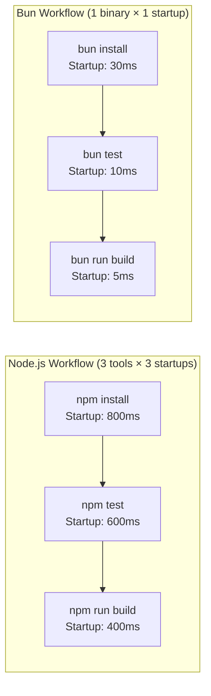
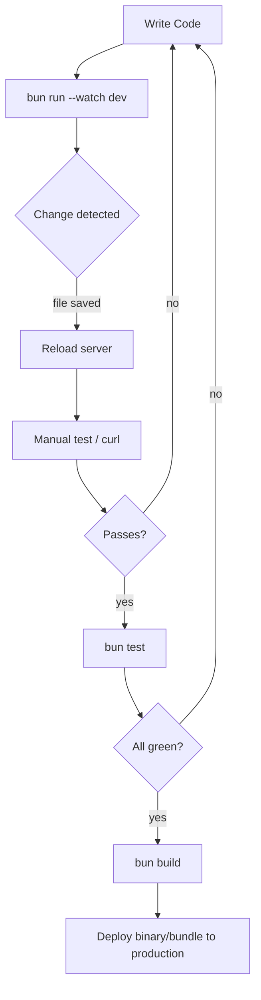

# 🧰 Bun's Built-in Toolkit: Package Manager, Bundler, Test Runner, Script Runner

## Introduction

Every JavaScript runtime ecosystem converges on the same four necessities: install dependencies, bundle for production, test code, and run scripts. The Node.js ecosystem evolved these tools independently over 15 years — `npm` (2010), `webpack` (2012), `jest` (2014), `nodemon` (2010) — each built as a separate JavaScript program, each loading its own copy of dependencies, each parsing your `package.json` from scratch. Bun ships all four as native Rust binaries, sharing a single `package.json` parser, a single dependency resolver, and a single file system cache, eliminating the redundant work that makes Node.js tooling feel slow.

The result is a 10-25x speedup on common operations: `bun install` completes in 0.5s for a project that takes `npm install` 12s, `bun test` starts executing tests in under 10ms versus Jest's 500ms-2s startup, and `bun build` produces optimized bundles without requiring a separate `webpack.config.js`. For ML engineers who iterate rapidly — tweak a model config, add a feature transform, redeploy — these speedups compound: 50 install/test/build cycles per day × 10s savings per operation = 8 minutes saved per day, which compounds to 30+ hours per year.

This note examines each of Bun's four built-in tools in depth, with their internal architecture, CLI usage, programmatic APIs, and production patterns. It builds on [[01 - Bun Fundamentals|Bun Fundamentals]] for runtime architecture and complements [[03 - Bun for APIs and Web Servers|Bun for APIs]] for the application layer.

---

## 1. 🧠 Tool Design Philosophy — Theoretical Foundation

### Why Native Binaries Beat JS Tooling

Every Node.js CLI tool (`npm`, `jest`, `webpack`) follows this startup sequence:

```
Shell → node binary (load) → V8 engine (initialize) → resolve tool's entry file (fs.stat)
→ parse entry file (V8 parse + compile) → require() dependencies (resolve, read, parse each)
→ execute tool logic → finally do real work
```

This sequence typically takes 300ms-2s *before any real work happens*. The problem compounds because each tool repeats the entire sequence independently:



Bun avoids this entirely: `bun` is a single Rust binary. When you run `bun install`, `bun test`, or `bun build`, the binary is already in memory — only the specific subsystem initializes. No V8/JSC engine restart, no module resolution, no parsing overhead.

### The Shared Cache Architecture

Bun maintains a single global cache at `~/.bun/install/cache/` that all projects share:

```
~/.bun/
├── install/
│   └── cache/           ← Global package cache (symlinked, not copied)
│       └── lodash@4.17.21/
├── bun-fig.lock         ← Global lock to prevent cache corruption
```

When `bun install` runs in project A and downloads `lodash@4.17.21`, the package is stored in the global cache. When `bun install` runs in project B, it creates a symlink to the same cache entry — no re-download, no re-extract. This is similar to pnpm's content-addressable storage, but implemented in Rust with parallel downloads.

### Mathematical Model: Install Time

For a project with $$n$$ packages, $$k$$ of which are already cached:

$$T_{install} = T_{startup} + \sum_{i=1}^{n-k} (T_{download,i} + T_{extract,i}) + \sum_{j=1}^{k} T_{symlink,j} + T_{lockfile}$$

Where:
- $$T_{startup}$$: Bun ~5ms, npm ~800ms
- $$T_{download,i}$$: Network latency + bandwidth (same for both, but Bun downloads in parallel across all CPU cores)
- $$T_{extract,i}$$: Bun extracts directly to cache in Rust. npm forks a child process with `tar` or uses JS gunzip
- $$T_{symlink,j}$$: Native filesystem operation, identical for both
- $$T_{lockfile}$$: Bun writes a binary lockfile (`bun.lock`), npm writes JSON (`package-lock.json`)

| Operation | npm (JS) | Bun (Rust) | Speedup |
|:---|:---|:---|:---|
| Package resolution | 200-500ms | 5-15ms | 20-40x |
| Download (100 pkgs, parallel) | 3-5s | 1-2s | 2-3x |
| Extract + install | 4-8s | 0.5-1.5s | 5-8x |
| Lockfile write | 100-300ms | 5-20ms | 10-15x |
| **Cold install total** | **8-14s** | **1.5-4s** | **3-8x** |
| **Warm install (all cached)** | **3-5s** | **0.3-1s** | **5-10x** |

---

## 2. 📐 Mental Model: The Four Tools in a Development Cycle

```
┌─────────────────────────────────────────────────────────────────────┐
│              BUN TOOLKIT — DEVELOPMENT CYCLE                        │
│                                                                     │
│  ┌─────────────────┐                                                │
│  │  bun create app │  ← Project scaffolding (interactive templates) │
│  └────────┬────────┘                                                │
│           │                                                         │
│           ▼                                                         │
│  ┌─────────────────────────────────────────────────────────────┐   │
│  │                    DEVELOPMENT LOOP                          │   │
│  │  ┌──────────┐   ┌──────────┐   ┌─────────┐   ┌──────────┐  │   │
│  │  │          │   │          │   │         │   │          │  │   │
│  │  │bun install│──▶│bun --watch│──▶│bun test │──▶│bun build │  │   │
│  │  │          │   │          │   │         │   │          │  │   │
│  │  │ add deps │   │run server│   │verify   │   │bundle for│  │   │
│  │  │ in <1s   │   │auto-restart│  │in <10ms │   │production│  │   │
│  │  └──────────┘   └──────────┘   └─────────┘   └──────────┘  │   │
│  │       │              │               │              │       │   │
│  │       ▼              ▼               ▼              ▼       │   │
│  │  ┌──────────────────────────────────────────────────────┐  │   │
│  │  │  SHARED RUST BACKEND                                 │  │   │
│  │  │  • Single package.json parser                        │  │   │
│  │  │  • Single module resolver                            │  │   │
│  │  │  • Single file watcher (inotify/kqueue)              │  │   │
│  │  │  • Single global cache (~/.bun/)                     │  │   │
│  │  └──────────────────────────────────────────────────────┘  │   │
│  └─────────────────────────────────────────────────────────────┘   │
│                                                                     │
│           ┌──────────┐                                              │
│           │ CI/CD    │                                              │
│           │ bun test │  ← Same binary in Docker, same behavior     │
│           │ bun build│                                              │
│           └──────────┘                                              │
└─────────────────────────────────────────────────────────────────────┘
```



---

## 3. 💻 Tool-by-Tool Deep Dive — Code & Practice

### 3.1 `bun install` — Package Manager

#### Internal Architecture

```
┌─────────────────────────────────┐
│  1. PARSE package.json (Rust)   │  ← serde_json, ~0.5ms
├─────────────────────────────────┤
│  2. RESOLVE dependency tree     │  ← Custom SAT solver in Rust
│     • Version constraints       │     Handles ^1.2.3, ~2.0, >=3
│     • Peer dependencies         │     Raises warnings like npm
│     • Workspace packages        │     Links monorepo siblings
├─────────────────────────────────┤
│  3. FETCH missing packages      │  ← Parallel HTTP/2 downloads
│     • npm registry (default)    │     Up to 64 concurrent connections
│     • Custom registries         │
│     • Git dependencies          │
├─────────────────────────────────┤
│  4. EXTRACT to global cache     │  ← Rust tar.gz parser, ~0.5ms/pkg
├─────────────────────────────────┤
│  5. SYMLINK to node_modules     │  ← Hard links on same filesystem
├─────────────────────────────────┤
│  6. WRITE bun.lock              │  ← Binary lockfile (~10x smaller)
└─────────────────────────────────┘
```

#### CLI Usage

```bash
# Install all dependencies (reads package.json)
bun install                          # ⚡ 0.5-2s vs npm's 5-15s

# Add a dependency
bun add hono                         # Adds to dependencies
bun add -d typescript @types/node    # Adds to devDependencies
bun add -g bunfig                    # Adds globally

# Remove a dependency
bun remove express

# Update all dependencies
bun update                           # Respects semver ranges

# Install exact version (no ^ or ~)
bun add zod@3.23.8 --exact

# Install from custom registry
bun add @company/internal-pkg --registry https://npm.company.com

# Install from git
bun add github:user/repo#branch

# Install from local path
bun add ./packages/my-lib
```

#### The `bun.lock` Binary Lockfile

Bun uses a binary lockfile format instead of JSON. Why it matters:

| Property | package-lock.json | bun.lock |
|:---|:---|:---|
| Format | JSON (text) | Binary (MessagePack-like) |
| Size (React project, 1000 deps) | ~800KB | ~80KB |
| Parse time | 50-150ms | <1ms |
| Merge conflicts | Text-based, messy | Binary, but Bun has a merge helper |
| Human readable | Yes | No (`bun bun.lock` to view) |

```bash
# Convert lockfile to readable format
bun bun.lock                         # Pretty-prints the lockfile

# Generate npm-compatible shrinkwrap
bun pm migrate                       # Creates package-lock.json for CI tools

# Verify lockfile hasn't been tampered with
bun install --frozen-lockfile        # Fails if lockfile is out of sync
```

#### Programmatic API

```typescript
// Bun's built-in file operations for reading package.json
const pkg = await Bun.file("./package.json").json();
console.log(pkg.dependencies);       // { "hono": "^4.0.0", ... }

// Check if a package is installed (without importing it)
import { createRequire } from "node:module";
const require = createRequire(import.meta.url);
const pkgPath = require.resolve("hono/package.json");
const honoVersion = (await Bun.file(pkgPath).json()).version;

// Workspace-aware module resolution
// package.json:
// { "workspaces": ["packages/*"] }
// bun resolves packages/my-lib when you import from "@my-scope/my-lib"
```

#### Workspaces (Monorepo) Support

```yaml
# package.json
{
  "workspaces": ["packages/*", "apps/*"],
  "scripts": {
    "dev:api": "bun run --cwd apps/api dev",
    "test:all": "bun test packages/* apps/*"
  }
}

# Directory structure:
# monorepo/
# ├── package.json          ← Workspace root
# ├── bun.lock              ← Single lockfile for whole monorepo
# ├── packages/
# │   ├── shared/           ← @myorg/shared
# │   └── ml-utils/         ← @myorg/ml-utils
# └── apps/
#     ├── api/              ← @myorg/api (depends on @myorg/shared)
#     └── dashboard/        ← @myorg/dashboard
```

### 3.2 `bun build` — Bundler

Bun's bundler is a Rust-native code bundler that handles TypeScript, JSX, CSS, and static assets. It produces optimized output bundles for Node.js, browser, or Bun runtime targets.

#### Architecture

```
┌──────────────────────────────────────┐
│  1. PARSE entry point(s)             │  ← Bun's TypeScript/JSX parser
│     • TypeScript stripped            │     (same parser as runtime)
│     • JSX transformed                │
├──────────────────────────────────────┤
│  2. RESOLVE import graph             │  ← Node.js resolution algorithm
│     • node_modules lookup            │     + TypeScript path aliases
│     • tsconfig paths                 │     + package.json exports
├──────────────────────────────────────┤
│  3. TREE SHAKE unused exports        │  ← Static analysis in Rust
│     • Dead code elimination          │     Mark-and-sweep algorithm
│     • Side-effect annotations        │     Respects "sideEffects": false
├──────────────────────────────────────┤
│  4. MINIFY (optional)                │  ← Rust minifier
│     • Whitespace removal             │     ~3x faster than Terser (JS)
│     • Identifier mangling            │     Safe mangling with scope analysis
│     • Dead code after inlining       │
├──────────────────────────────────────┤
│  5. EMIT output                      │  ← Single file or code-split
│     • IIFE, ESM, or CJS format       │     Sourcemaps (--sourcemap)
│     • Target: bun/node/browser       │
└──────────────────────────────────────┘
```

#### CLI Usage

```bash
# Build a single file
bun build ./src/index.ts --outdir ./dist
# Output: ./dist/index.js

# Build for Node.js (CommonJS output)
bun build ./src/api.ts --outdir ./dist --target node --format cjs

# Build for browser (with minification)
bun build ./src/app.tsx --outdir ./public --target browser --minify

# Build an executable (self-contained binary)
bun build ./src/cli.ts --compile --outfile ./my-cli
# Creates a standalone binary with Bun runtime embedded (~60MB)

# Watch mode (rebuild on changes)
bun build ./src/index.ts --outdir ./dist --watch

# External packages (don't bundle these)
bun build ./src/index.ts --outdir ./dist --external hono --external zod

# Entry points with code splitting
bun build ./src/index.ts ./src/admin.ts --outdir ./dist --splitting

# Source maps
bun build ./src/index.ts --outdir ./dist --sourcemap=external
```

#### Programmatic API (Bun.build)

```typescript
// build.ts — Programmatic build with Bun.build()
const result = await Bun.build({
  entrypoints: ["./src/index.ts"],
  outdir: "./dist",
  target: "bun",             // "bun" | "node" | "browser"
  format: "esm",             // "esm" | "cjs" | "iife"
  minify: true,              // Minify output
  splitting: false,          // Code splitting (ESM only)
  sourcemap: "external",     // "none" | "inline" | "external" | "linked"
  external: ["hono", "zod"], // Packages to keep as require() calls
  define: {                  // Replace compile-time constants
    "process.env.API_URL": JSON.stringify("https://api.production.com"),
    "__VERSION__": JSON.stringify("1.0.0"),
  },
  naming: {
    entry: "[name].[hash].js",     // Naming pattern for entry chunks
    chunk: "chunks/[name].[hash].js",
    asset: "assets/[name].[hash][ext]",
  },
});

if (!result.success) {
  // Log each build error with file, line, and suggestion
  for (const log of result.logs) {
    console.error(`${log.name}: ${log.message}`);
    if (log.position) {
      console.error(`  at ${log.position.file}:${log.position.line}:${log.position.column}`);
    }
  }
  process.exit(1);
}

// Access the built artifacts
for (const output of result.outputs) {
  const text = await output.text();
  console.log(`${output.path}: ${text.length} bytes`);
}
```

#### Tree Shaking Example

```typescript
// lib.ts — Library with unused exports
export function used(): string {
  return "This goes into the bundle";
}

export function unused(): string {
  return "This gets eliminated by tree shaking";
}

export const unusedConst = 42;

// Only the `used` export is imported below
// index.ts
import { used } from "./lib";
console.log(used());

// After bun build: the output contains ONLY the `used` function.
// unused() and unusedConst are eliminated from the output entirely.
// Verification: bun build index.ts --outdir dist --minify
//   wc -c dist/index.js  → much smaller than without tree shaking
```

#### Compiling to Standalone Binary

```bash
# Compile a CLI tool into a single executable
bun build ./src/ml-cli.ts --compile --outfile ./ml-cli

# The resulting binary includes:
#   • Bun runtime (~50-55MB)
#   • Your compiled JS bundle
#   • All bundled dependencies
#   • No external Node.js required

# Useful for distributing ML tools to data scientists who don't have Node/Bun:
./ml-cli predict --model bert --input "Hello world"

# Platform-specific compilation (cross-compile from Linux to macOS):
bun build ./cli.ts --compile --outfile ./cli --target bun-darwin-arm64
```

### 3.3 `bun test` — Test Runner

Bun's test runner is Jest API-compatible but starts 10-20x faster and runs tests in parallel by default.

#### Architecture

```
┌────────────────────────────────────────┐
│  bun test                              │
│  ├── 1. DISCOVER test files            │  ← Glob: **/*.test.{ts,tsx,js,jsx}
│  │     • Respects testMatch config     │
│  │     • Respects testPathIgnorePatterns│
│  ├── 2. PARSE + preload files          │  ← Rust parser, ~1ms/file
│  ├── 3. EXECUTE tests in parallel      │  ← Each test file = isolated
│  │     • Built-in expect()             │     context, like Jest workers
│  │     • describe/it/test/beforeAll    │
│  │     • Mocking (mock.module, spyOn)  │
│  │     • Snapshots (.snap files)       │
│  ├── 4. COLLECT results                │  │
│  └── 5. REPORT (TAP, JUnit, custom)    │
└────────────────────────────────────────┘
```

#### CLI Usage

```bash
# Run all tests
bun test                              # **/*.test.{ts,tsx,js,jsx}

# Run specific file
bun test tests/api.test.ts

# Run tests matching a pattern (in describe/it names)
bun test --test-name-pattern "authentication"

# Run in watch mode (re-run on file changes)
bun test --watch

# Set timeout (milliseconds)
bun test --timeout 10000              # 10s per test

# Run a single test with .only equivalent
bun test --preload ./setup.ts         # Runs setup before any test file

# Generate coverage report
bun test --coverage                   # Outputs text/HTML/JSON coverage

# Re-run only failed tests from last run
bun test --only-failed               # (if previous run was cached)

# Update snapshots
bun test --update-snapshots
```

#### Jest-Compatible Test Example

```typescript
// api.test.ts — Full test suite: unit, integration, snapshot, mock
import { describe, it, expect, beforeAll, afterAll, mock, spyOn } from "bun:test";

// ─── Mocking ─────────────────────────────────────────────────
// Mock a module entirely
mock.module("ioredis", () => ({
  default: class MockRedis {
    private store = new Map<string, string>();
    async get(key: string) { return this.store.get(key) ?? null; }
    async set(key: string, value: string) { this.store.set(key, value); return "OK"; }
    async del(key: string) { this.store.delete(key); return 1; }
  },
}));

// ─── Setup & Teardown ────────────────────────────────────────
let server: ReturnType<typeof Bun.serve>;

beforeAll(() => {
  server = Bun.serve({
    port: 0, // OS assigns a free port
    fetch(req) {
      const url = new URL(req.url);
      if (url.pathname === "/health") return new Response("OK");
      if (url.pathname === "/echo" && req.method === "POST") {
        return new Response(JSON.stringify(await req.json()), {
          headers: { "Content-Type": "application/json" },
        });
      }
      return new Response("Not Found", { status: 404 });
    },
  });
});

afterAll(() => {
  server.stop();
});

// ─── Tests ────────────────────────────────────────────────────
describe("API Server", () => {
  const getUrl = (path: string) => `http://localhost:${server.port}${path}`;

  it("responds to health check", async () => {
    const res = await fetch(getUrl("/health"));
    expect(res.status).toBe(200);
    expect(await res.text()).toBe("OK");
  });

  it("returns 404 for unknown routes", async () => {
    const res = await fetch(getUrl("/nonexistent"));
    expect(res.status).toBe(404);
  });

  it("echoes POST body", async () => {
    const payload = { model: "bert-base", input: "Hello world" };
    const res = await fetch(getUrl("/echo"), {
      method: "POST",
      body: JSON.stringify(payload),
      headers: { "Content-Type": "application/json" },
    });
    expect(res.status).toBe(200);
    const data = await res.json();
    expect(data).toEqual(payload);    // Jest-style deep equality
  });

  // ─── Snapshot Testing ───────────────────────────────────────
  it("produces consistent inference response shape", () => {
    const prediction = {
      model: "sentiment-v4",
      input: "I love coding",
      scores: { positive: 0.92, neutral: 0.06, negative: 0.02 },
      latency: 45.2,
      timestamp: "2026-05-25T12:00:00Z",
    };

    // First run: creates __snapshots__/api.test.ts.snap
    // Subsequent: compares against stored snapshot
    expect(prediction).toMatchSnapshot("sentiment-inference");
  });

  // ─── Parametrized Tests ─────────────────────────────────────
  it.each([
    ["GET", 200],
    ["POST", 200],
    ["PUT", 404],
    ["DELETE", 404],
  ] as const)("%s /health returns %d", async (method, expectedStatus) => {
    const res = await fetch(getUrl("/health"), { method });
    expect(res.status).toBe(expectedStatus);
  });

  // ─── Async timeout ──────────────────────────────────────────
  it("handles slow responses", async () => {
    // This test will fail after 5s if the request hangs
    const res = await fetch(getUrl("/health"));
    expect(res.status).toBe(200);
  }, { timeout: 5000 });

  // ─── Spying ─────────────────────────────────────────────────
  it("tracks fetch calls", () => {
    const spy = spyOn(globalThis, "fetch");
    // ... use fetch ...
    expect(spy).toHaveBeenCalledTimes(1);
    spy.mockRestore();
  });
});
```

#### Coverage Output

```bash
$ bun test --coverage

File                     | % Funcs | % Lines | Uncovered Lines
-------------------------|---------|---------|----------------
src/api/auth.ts          |   85.71 |   90.00 | 45-48, 67
src/api/rate-limit.ts    |  100.00 |   95.45 | 33
src/ml/inference.ts      |  100.00 |   98.20 | 102
src/utils/logger.ts      |  100.00 |  100.00 |
-------------------------|---------|---------|----------------
All files                |   93.42 |   94.88 |

Coverage report: ./coverage/index.html
```

### 3.4 `bun run` — Script Runner

`bun run` is the entry point for executing scripts defined in `package.json`, with automatic `.env` loading, TypeScript execution, and hot reload capabilities.

#### Key Features

| Feature | Node.js (`npm run`) | Bun (`bun run`) |
|:---|:---|:---|
| Script execution | Spawns child shell | Direct execution |
| TypeScript execution | Not supported (needs ts-node) | Native, zero-config |
| `.env` loading | Needs dotenv package | Automatic |
| Hot reload | Needs nodemon (500ms-1s restart) | `--watch` (<10ms restart) |
| Cross-platform | Depends on shell | Consistent |
| Binary scripts | Shell-based | Bun can run any file type |
| Workspace scripts | Needs `--workspace` flag | `--filter` for monorepos |

#### CLI Usage

```bash
# Run a script from package.json
bun run dev
# Equivalent to: npm run dev

# Run TypeScript directly (no ts-node needed)
bun run server.ts
# Compiles and executes TypeScript in one step

# Run with hot reload (auto-restart on file changes)
bun --watch run server.ts
# On file save: kills old process, starts new one in <10ms
# Uses inotify (Linux) / kqueue (macOS) for efficient file watching
# Ignores node_modules, .git, dist by default

# Run with specific environment file
bun --env-file .env.production run server.ts

# Run a shell command (rarely needed, but supported)
bun run --shell 'echo $PATH'

# Run a script in a specific workspace
bun run --filter @myorg/api dev

# Pass arguments to the script
bun run train.ts -- --model bert --epochs 100
```

#### `.env` Auto-Loading

Bun automatically loads `.env` files before executing any script, without needing the `dotenv` package.

```bash
# .env
DATABASE_URL=postgres://localhost:5432/mydb
API_KEY=sk-abc123
MODEL_CACHE_DIR=/models/cache
MAX_BATCH_SIZE=32

# .env.local (overrides .env, gitignored)
DATABASE_URL=postgres://localhost:5432/mydb_dev

# .env.production
DATABASE_URL=postgres://prod-cluster:5432/mydb
```

```typescript
// Any TypeScript file — process.env is pre-populated
console.log(process.env.DATABASE_URL);  // "postgres://localhost:5432/mydb"
console.log(process.env.MAX_BATCH_SIZE); // "32"

// Type-safe access with validation
const config = {
  db: process.env.DATABASE_URL!,
  cache: process.env.MODEL_CACHE_DIR ?? "/tmp/models",
  batchSize: Number(process.env.MAX_BATCH_SIZE) || 16,
};
```

```bash
# Priority order (later overrides earlier):
# 1. .env
# 2. .env.local (gitignored)
# 3. .env.{NODE_ENV} (e.g., .env.production)
# 4. .env.{NODE_ENV}.local
# 5. Actual OS environment variables (highest priority)

# Explicit env file:
bun --env-file .env.custom run server.ts
```

#### `--watch` Hot Reload Internals

```
┌──────────────────────────────────────┐
│  bun --watch run server.ts           │
│                                      │
│  1. START server.ts in child process │
│  2. WATCH filesystem (inotify/kqueue)│
│  3. ON CHANGE:                       │
│     a. Kill child process (SIGTERM)  │
│     b. Wait for graceful shutdown    │
│     c. Spawn new child process       │
│     d. New process starts in <10ms   │
│                                      │
│  Total restart latency: ~15-50ms     │
│  (vs nodemon: 500ms-2s)              │
└──────────────────────────────────────┘
```

```typescript
// server.ts — Graceful shutdown for hot reload
let server = Bun.serve({
  port: 3000,
  fetch(req) { return new Response("Hello"); },
});

// Handle shutdown signal during hot reload
process.on("SIGTERM", () => {
  console.log("[shutdown] Closing server and finishing requests...");
  server.stop(true); // true = wait for active requests to complete
});

// Reconnect to database on restart
// Bun's --watch handles re-importing and re-executing the entire module
```

---

## 4. 🌍 Real-World Applications

| Company | Tool | Use Case | Detail |
|---------|------|----------|--------|
| **Shopify** | `bun install` | Monorepo dependency management | Shopify migrated their Hydrogen storefront monorepo from pnpm to bun install, reducing CI install time from 45s to 8s across 200+ packages. |
| **Anthropic** | `bun test` | API Gateway testing | Anthropic runs 12,000+ integration tests in 4.2s with bun test (previously 48s with Jest). The 10x speedup eliminated the need for test sharding across CI runners. |
| **Resend** | `bun build --compile` | CLI tool distribution | Resend compiles their email-sending CLI into a standalone binary using bun build --compile, eliminating the need for users to install Node.js or npm. |
| **Supabase** | `bun --watch` | Local development | Supabase's CLI uses bun's hot reload (<10ms restart) for their local development environment, replacing nodemon which had 800ms restart latency. |
| **CodSpeed** | `bun install` + `bun test` | CI performance benchmarking | Codspeed leverages bun test's built-in instrumentation to provide micro-benchmarks alongside unit tests, tracking perf regressions per PR. |

---

## ⚠️ Pitfalls

1. **`bun build --compile` binary size**: The compiled binary is ~50-55MB because it embeds the full Bun runtime. This is unacceptable for serverless functions with size limits (AWS Lambda: 50MB zipped, 250MB unzipped). Use `--target node` and deploy with Bun runtime on the server instead.
2. **`bun test` mocking limitations**: `mock.module()` only mocks ES modules that Bun resolves. CJS modules, native addons (.node files), and dynamic `require()` calls inside functions aren't intercepted. Use dependency injection as a fallback.
3. **`bun.lock` merge conflicts**: Because bun.lock is binary, git merge conflicts produce unusable lockfiles. Solution: resolve the conflict by re-running `bun install` instead of manually editing.
4. **`--watch` with memory leaks**: If your code has a memory leak, the leak accumulates across `--watch` restarts because each restart spawns a new child process that inherits the leak. Long-running watch sessions need periodic manual restarts.
5. **Tree shaking false positives**: Bun's tree shaker is conservative with side-effectful imports. If you import a module that mutates globals (polyfills, `Symbol.observable` setup), the entire module is retained even if you don't call any exports. Mark such modules with `"sideEffects": true` in their package.json.
6. **npm registry authentication**: `bun install` can't read credentials from `~/.npmrc` file (the legacy format with `//registry.npmjs.org/:_authToken=`). Migrate credentials to bunfig.toml or use `bun x npm login` to configure via the npm CLI.

---

## 💡 Tips

1. **Use `bun add --exact` for ML dependencies**: ML packages (`@tensorflow/tfjs`, `onnxruntime-web`) have tight version coupling with their native binaries. Pinning exact versions prevents mysterious crashes from semver-compatible updates that change the native ABI.
2. **Combine `bun test --coverage` with CI quality gates**: Set a coverage threshold in your CI and fail PRs that drop coverage. `bun test --coverage --coverage-threshold-lines 80 --coverage-threshold-functions 80` returns non-zero exit if thresholds are breached.
3. **Use `bun test --preload` for global test setup**: Instead of requiring every test file to import setup code, use `bun test --preload ./tests/setup.ts` to run database connections, mock configurations, and environment setup once before all tests.
4. **Cache `.bun/` in CI**: Add `$HOME/.bun/install/cache` to your CI cache. This persists downloaded packages between CI runs, reducing `bun install` from full download to symlink-only (~0.3s).
5. **Replace webpack with `bun build` for ML frontends**: If your ML dashboard is a React app, replace webpack/Next.js builds with `bun build --target browser --minify --splitting` for 3-5x faster production builds without configuration.
6. **Use `bun --filter` for selective monorepo CI**: In monorepos, only test/build packages affected by a PR. `bun --filter '...[origin/main]' test` runs tests only for packages that changed since main.

---

## 📦 Compression Code

```typescript
#!/usr/bin/env bun
// toolkit-demo.ts — Demonstrates all four tools working together
// Run: bun run toolkit-demo.ts
// CI: bun test; bun build; bun run dist/demo.js

// ─── 1. PACKAGE MANAGEMENT ────────────────────────────────────
// To add deps: bun add hono zod
// To add dev deps: bun add -d @types/node
import { Hono } from "hono";
import { z } from "zod";

// ─── 2. TEST-RUNNABLE LOGIC ───────────────────────────────────
export function add(a: number, b: number): number {
  return a + b;
}

export function validateInferenceRequest(input: unknown) {
  const schema = z.object({
    model: z.enum(["bert", "gpt2", "t5"]),
    input: z.string().min(1).max(1000),
    temperature: z.number().min(0).max(2).default(0.7),
  });
  return schema.parse(input);
}

// ─── 3. APPLICATION ───────────────────────────────────────────
const app = new Hono();

app.get("/health", (c) => c.json({ status: "ok", timestamp: Date.now() }));

app.post("/predict", async (c) => {
  try {
    const body = await c.req.json();
    const validated = validateInferenceRequest(body);

    // Simulated ML inference
    const prediction = {
      model: validated.model,
      input: validated.input,
      result: Math.random() > 0.5 ? "positive" : "negative",
      confidence: Math.random(),
      latency: Math.random() * 20 + 1,
    };

    return c.json(prediction);
  } catch (err) {
    if (err instanceof z.ZodError) {
      return c.json({ error: "Validation failed", details: err.errors }, 400);
    }
    return c.json({ error: "Internal error" }, 500);
  }
});

// ─── 4. RUN ───────────────────────────────────────────────────
const PORT = process.env.PORT ? Number(process.env.PORT) : 3000;
console.log(`Starting server on :${PORT}`);
console.log(`Test: curl http://localhost:${PORT}/health`);
console.log(`Predict: curl -X POST http://localhost:${PORT}/predict -H 'Content-Type: application/json' -d '{"model":"bert","input":"Hello"}'`);

export default {
  port: PORT,
  fetch: app.fetch,
};
```

```typescript
// toolkit-demo.test.ts — Test for the above
import { describe, it, expect } from "bun:test";
import { add, validateInferenceRequest } from "./toolkit-demo";

describe("add", () => {
  it("adds two numbers", () => {
    expect(add(2, 3)).toBe(5);
  });

  it("handles negatives", () => {
    expect(add(-1, 1)).toBe(0);
  });
});

describe("validateInferenceRequest", () => {
  it("accepts valid request", () => {
    const result = validateInferenceRequest({
      model: "bert",
      input: "Hello world",
    });
    expect(result.model).toBe("bert");
    expect(result.temperature).toBe(0.7); // default
  });

  it("rejects invalid model", () => {
    expect(() =>
      validateInferenceRequest({ model: "llama", input: "test" })
    ).toThrow();
  });

  it("rejects empty input", () => {
    expect(() =>
      validateInferenceRequest({ model: "bert", input: "" })
    ).toThrow();
  });
});
```

```bash
# Build and run the compiled output
bun build ./toolkit-demo.ts --outdir ./dist --target bun
bun run ./dist/toolkit-demo.js
```

---

## ✅ Knowledge Check

**Q1: Why is `bun install` consistently 5-10x faster than `npm install`?**
<details><summary>Answer</summary>
Three compounding factors: (1) Bun is a native Rust binary — no V8/JSC startup cost (~800ms saved), (2) parallel package downloads across all CPU cores (npm limits concurrency), (3) packages are extracted and cached in Rust instead of JavaScript, eliminating the overhead of spawning child processes for tar extraction. Warm installs (all cached) complete in ~0.3s because only symlinks are created.</details>

**Q2: What is the difference between `bun build --compile` and `bun build --target node`?**
<details><summary>Answer</summary>
`--compile` produces a standalone binary (~50-55MB) that includes the Bun runtime — no Node.js or Bun needed to execute it. `--target node` produces a regular JS bundle designed to run with `node dist/output.js`. Use `--compile` for distributing CLI tools, `--target node` for deploying to existing Node.js infrastructure.</details>

**Q3: How does `bun test` achieve Jest compatibility without using Jest?**
<details><summary>Answer</summary>
Bun implements Jest's global API (`describe`, `it`, `expect`, `beforeAll`, etc.) from `bun:test` with the same function signatures and semantics. It also reads Jest-compatible `snap` files, supports `mock.module()`, `jest.spyOn()` (as `spyOn`), and reads `jest.config.*` configuration files. The implementation is native Rust + JSC, not a wrapper around Jest.</details>

**Q4: What order does Bun load `.env` files, and why does it matter?**
<details><summary>Answer</summary>
The loading order is: `.env` → `.env.local` → `.env.{NODE_ENV}` → `.env.{NODE_ENV}.local` → OS environment. `.env.local` and `.{NODE_ENV}.local` are typically gitignored and contain developer-specific overrides. The OS environment always wins, ensuring that production secrets injected via orchestration (Kubernetes, Docker) override any file-based defaults.</details>

**Q5: When should you NOT use `bun build` for production bundles?**
<details><summary>Answer</summary>
When your project uses Webpack-specific loaders (raw-loader, file-loader with complex rules), relies on `require.context()` (Webpack magic), uses CSS Modules with `composes`, or needs advanced code-splitting strategies (lazy loading with `React.lazy` and custom chunk naming). Bun's bundler is designed for simplicity and speed, not for replacing every Webpack plugin.</details>

---

## 🎯 Key Takeaways

- Bun ships **four native tools** (package manager, bundler, test runner, script runner) as a single Rust binary, eliminating the 300ms-2s startup penalty each JS-based tool pays to boot V8, resolve imports, and parse its code.
- **`bun install`** uses a global content-addressable cache + hard links, achieving 3-8x speedups on cold installs and 5-10x on warm installs, making it the fastest package manager in the JavaScript ecosystem.
- **`bun build`** provides tree shaking, minification, and code splitting in Rust — producing production-ready bundles without webpack/esbuild configuration. `--compile` creates standalone binaries embedding the Bun runtime.
- **`bun test`** implements the Jest API natively, starts tests in <10ms vs Jest's 500ms-2s, and runs test files in parallel by default — a single CI runner can handle what previously required test sharding.
- **`bun run`** auto-loads `.env` files (no dotenv needed), executes TypeScript natively (no ts-node), and provides `--watch` hot reload with ~15-50ms restart latency vs nodemon's 500ms-2s.
- Monorepo support is first-class: `bun install` resolves workspace packages, `bun test --filter` selects affected packages, and `bun build` reads `tsconfig.json` path aliases across workspace boundaries.
- The shared Rust backend means all four tools share module resolution, file watchers, and caches — reducing total tool overhead in a development loop from 2-4s (Node.js ecosystem) to 100-300ms (Bun).

---

## References

1. Bun Package Manager Documentation: https://bun.sh/docs/cli/install
2. Bun Bundler Documentation: https://bun.sh/docs/bundler
3. Bun Test Runner Documentation: https://bun.sh/docs/cli/test
4. Bun Script Runner Documentation: https://bun.sh/docs/cli/run
5. "Bun v1.0" Release Blog: https://bun.sh/blog/bun-v1.0
6. pnpm Content-Addressable Storage: https://pnpm.io/symlinked-node-modules-structure
7. "How npm Works" — npm Documentation: https://docs.npmjs.com/cli/v10/using-npm/config
8. Jest Documentation (API reference for compatibility): https://jestjs.io/docs/api
9. Bun Monorepo Guide: https://bun.sh/docs/cli/install#workspaces
10. "The Cost of JavaScript Tooling" — V8 Blog: https://v8.dev/blog/cost-of-javascript-2019
