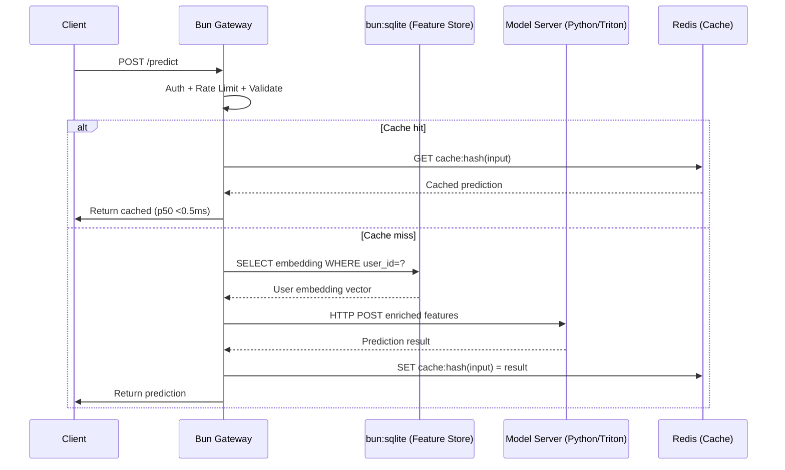

# 🤖 Bun for ML and Data Engineering

## Introduction

The machine learning backend landscape has been dominated by Python (Flask/FastAPI for serving, Pandas for data processing, PyTorch/TensorFlow for training) and Go (for high-throughput API gateways). JavaScript runtimes have been relegated to frontend dashboards and analytics UIs. Bun challenges this partitioning: its native SQLite bindings make it a viable feature store, its sub-millisecond cold starts make it ideal for serverless inference endpoints, and its Rust-powered JSON throughput (160K+ req/s) rivals Go's performance without Go's verbose error handling.

For ML engineers building production inference pipelines, the pattern is increasingly: **Python trains the model, Bun serves it**. Training happens offline in Python (PyTorch, JAX, scikit-learn), the model artifacts are exported to ONNX or deployed to a Triton Inference Server, and Bun provides the API gateway layer — authentication, rate limiting, input validation, feature enrichment, caching, and routing to the appropriate model backend. This note extends the API server patterns from [[03 - Bun for APIs and Web Servers|Bun for APIs]] and the tooling fundamentals from [[04 - Bun's Built-in Toolkit|Bun's Built-in Toolkit]] into the ML-specific domain.

This note covers: Bun as an ML inference gateway with rate limiting and caching, `bun:sqlite` for lightweight feature stores, integrating with Python ML models via child processes and HTTP, streaming inference results over WebSockets, data processing pipelines for CSV/JSON/Parquet, and a pragmatic comparison of Bun vs Python vs Go for ML backends.

---

## 1. 🧠 The ML Backend Architecture — Theoretical Foundation

### The Inference Serving Problem

An ML model in production has these components:

```
┌─────────────────────────────────────────────────────┐
│  Client                                              │
│  POST /predict {"features": [1.2, 3.4, ...]}       │
└──────────────────────┬──────────────────────────────┘
                       │
┌──────────────────────▼──────────────────────────────┐
│  [1] API GATEWAY — auth, rate limit, validation      │  ← Bun excels here
│       • Input validation (Zod schemas)               │     Zero-copy JSON
│       • Feature fetching (bun:sqlite / Redis)        │     JIT TypeScript
│       • Rate limiting (per-user, per-model)          │     Fast cold starts
│       • Routing to correct model                     │
│       • Response caching                             │
└──────────────────────┬──────────────────────────────┘
                       │
┌──────────────────────▼──────────────────────────────┐
│  [2] FEATURE STORE — enrich input with context       │  ← bun:sqlite / Redis
│       • User embeddings from feature store           │
│       • Historical aggregation (last 7 days avg)     │
│       • Real-time features (current session)         │
└──────────────────────┬──────────────────────────────┘
                       │
┌──────────────────────▼──────────────────────────────┐
│  [3] MODEL INFERENCE — actual prediction             │  ← Python / Triton
│       • PyTorch/TensorFlow/JAX model                 │     GPU-accelerated
│       • ONNX Runtime (CPU)                           │     Triton Inference Server
│       • scikit-learn / XGBoost (CPU)                 │     ONNX Runtime
└──────────────────────┬──────────────────────────────┘
                       │
┌──────────────────────▼──────────────────────────────┐
│  [4] POST-PROCESSING — format, log, cache             │  ← Bun excels here
│       • Convert to API response format               │
│       • Cache result for identical inputs            │
│       • Log metrics (latency, model version)         │
│       • Stream partial results (SSE/WebSocket)       │
└──────────────────────┬──────────────────────────────┘
                       │
                       ▼
                     Client
```

Bun owns steps [1], [2], and [4] — the I/O-bound, validation-heavy, caching-intensive work. Python owns step [3] — the compute-bound, GPU-accelerated model inference. This boundary plays to each runtime's strengths: Bun's zero-copy I/O for the API layer, Python's mature ML ecosystem for the model layer.

### Why Not All-Python or All-Go?

| Criterion | Python (FastAPI) | Go | Bun |
|:---|:---|:---|:---|
| **JSON throughput** | ~15K req/s (single worker) | ~80K req/s | ~140K req/s |
| **Cold start** | 200-500ms | 5-20ms | 2-8ms |
| **Memory (idle)** | 60-80MB | 8-15MB | 18-22MB |
| **TypeScript/Type safety** | Via Pydantic (runtime) | Compile-time | Compile-time (tsc) + runtime (Zod) |
| **ML library ecosystem** | Excellent (PyTorch, etc.) | Limited (GoML, Gorgonia) | Via npm (onnxruntime-web, tfjs) or HTTP to Python |
| **SQLite performance** | ~5-10K QPS (sqlite3) | ~20-30K QPS | ~35-50K QPS (Rust-native) |
| **WebSocket throughput** | ~20K msg/s | ~80K msg/s | ~500K msg/s |
| **Team skill overlap** | ML engineers already know | Need to learn | Full-stack + ML crossover |

### Mathematical Model: Cache Hit Rate Impact on Latency

For an inference endpoint with cache hit rate $$h$$, model latency $$L_m$$, and cache latency $$L_c$$:

$$L_{avg} = h \cdot L_c + (1 - h) \cdot (L_m + L_{overhead})$$

Where Bun's $$L_{overhead}$$ (auth + validate + feature fetch) is ~0.5ms and Python's is ~1.5ms due to WSGI/ASGI-layer overhead.

| Cache Hit Rate | Bun Avg Latency | Python Avg Latency | Delta |
|:---|:---|:---|:---|
| 0% | $$L_m + 0.5$$ | $$L_m + 1.5$$ | -1.0ms |
| 50% | $$0.5 \cdot L_c + 0.5 \cdot L_m + 0.5$$ | $$0.5 \cdot L_c + 0.5 \cdot L_m + 1.5$$ | -1.0ms |
| 90% | $$0.9 \cdot L_c + 0.1 \cdot L_m + 0.1$$ | $$0.9 \cdot L_c + 0.1 \cdot L_m + 1.0$$ | -0.9ms |

The 1ms savings per request from Bun's lighter overhead compounds: at 10,000 req/s, that's 10 CPU-seconds freed per second for actual model inference.

---

## 2. 📐 Mental Model: Bun as Inference Gateway

```
┌─────────────────────────────────────────────────────────────────────────┐
│                  BUN ML INFERENCE GATEWAY                                │
│                                                                         │
│  ┌───────────────────────────────────────────────────────────────────┐ │
│  │  INCOMING REQUEST                                                  │ │
│  │  POST /api/v1/predict                                              │ │
│  │  { "model": "sentiment-v4", "input": "Great product!" }           │ │
│  └──────────────────────────────┬────────────────────────────────────┘ │
│                                 │                                       │
│  ┌──────────────────────────────▼────────────────────────────────────┐ │
│  │  MIDDLEWARE CHAIN                                                 │ │
│  │  auth() -> rateLimit() -> validateSchema() -> cacheCheck()      │ │
│  └──────────────────────────────┬────────────────────────────────────┘ │
│                                 │                                       │
│              ┌──────────────────┼──────────────────┐                   │
│              ▼                  ▼                  ▼                    │
│  ┌─────────────────┐  ┌─────────────────┐  ┌──────────────────┐       │
│  │  CACHE HIT?     │  │  FEATURE STORE  │  │  MODEL SELECTOR  │       │
│  │  Return cached  │  │  bun:sqlite     │  │  Route to:       │       │
│  │  prediction if  │  │  Query user     │  │  - Triton (GPU)  │       │
│  │  input hash     │  │  embeddings,    │  │  - PyTorch serve │       │
│  │  matches.       │  │  recent history │  │  - Local ONNX    │       │
│  └────────┬────────┘  └────────┬────────┘  └────────┬─────────┘       │
│           │                    │                    │                   │
│           │                    ▼                    ▼                   │
│           │           ┌───────────────────────────────────────┐        │
│           │           │  MODEL BACKEND (Python / Triton)      │        │
│           │           │  - Receive enriched features          │        │
│           │           │  - Run inference                      │        │
│           │           │  - Return predictions + confidence     │        │
│           │           └───────────────────┬───────────────────┘        │
│           │                               │                            │
│           └───────────────────────────────┼────────────────────────────│
│                                           ▼                            │
│  ┌────────────────────────────────────────────────────────────────────┐ │
│  │  POST-PROCESSOR                                                     │ │
│  │  - Format response                                                  │ │
│  │  - Add metadata (model version, latency, server_id)                 │ │
│  │  - Store in cache (hash input => prediction)                       │ │
│  │  - Log metrics to Prometheus                                        │ │
│  │  - Stream via WebSocket if client subscribed                        │ │
│  └────────────────────────────────────────────────────────────────────┘ │
│                                                                         │
│  ┌────────────────────────────────────────────────────────────────────┐ │
│  │  SUPPORTING SERVICES                                                │ │
│  │  ┌──────────┐  ┌──────────┐  ┌──────────┐  ┌──────────────┐      │ │
│  │  │ Redis    │  │ S3/GCS   │  │PostgreSQL│  │  Prometheus   │      │ │
│  │  │(hot cache│  │(models,  │  │(user data│  │  (monitoring) │      │ │
│  │  │ layer)   │  │artifacts)│  │analytics)│  │               │      │ │
│  │  └──────────┘  └──────────┘  └──────────┘  └──────────────┘      │ │
│  └────────────────────────────────────────────────────────────────────┘ │
└─────────────────────────────────────────────────────────────────────────┘
```



---

## 3. 💻 Code & Practice — ML Inference Gateway

### 3.1 Complete Inference Gateway

```typescript
// inference-gateway.ts — Bun ML Inference Gateway
import { Database } from "bun:sqlite";
import { z } from "zod";
import { createHash } from "node:crypto";

// ─── Configuration ──────────────────────────────────────────
const MODEL_BACKENDS: Record<string, string> = {
  "sentiment-v4": "http://localhost:8001/v2/models/sentiment/infer",
  "bert-qa": "http://localhost:8001/v2/models/bert_qa/infer",
  "image-classifier": "http://localhost:9000/predict", // PyTorch Serve
};

const CACHE_TTL_MS = 300_000; // 5 minutes
const RATE_LIMIT_PER_MINUTE = 60;

// ─── Feature Store (bun:sqlite) ─────────────────────────────
const db = new Database("features.db", { create: true });

// Create tables with WAL mode for concurrent reads
db.run("PRAGMA journal_mode=WAL");
db.run("PRAGMA synchronous=NORMAL");
db.run("PRAGMA cache_size=-64000"); // 64MB cache

db.run(`
  CREATE TABLE IF NOT EXISTS user_embeddings (
    user_id TEXT PRIMARY KEY,
    embedding BLOB NOT NULL,          -- Float32Array stored as BLOB
    updated_at INTEGER NOT NULL DEFAULT (unixepoch())
  )
`);

db.run(`
  CREATE TABLE IF NOT EXISTS inference_cache (
    cache_key TEXT PRIMARY KEY,
    result TEXT NOT NULL,
    model TEXT NOT NULL,
    created_at INTEGER NOT NULL DEFAULT (unixepoch()),
    ttl INTEGER NOT NULL
  )
`);

db.run(`
  CREATE INDEX IF NOT EXISTS idx_cache_ttl
  ON inference_cache(created_at)
  WHERE created_at + (ttl / 1000) < unixepoch()
`);

// ─── Request Validation Schemas ─────────────────────────────
const PredictRequest = z.object({
  model: z.enum(["sentiment-v4", "bert-qa", "image-classifier"]),
  input: z.string().min(1).max(5000),
  user_id: z.string().uuid().optional(),
  options: z.object({
    threshold: z.number().min(0).max(1).default(0.5),
    top_k: z.number().int().min(1).max(100).default(5),
  }).optional(),
});

// ─── Rate Limiting ───────────────────────────────────────────
const rateLimiter = new Map<string, { count: number; resetAt: number }>();

function checkRateLimit(userId: string): Response | null {
  const now = Date.now();
  const entry = rateLimiter.get(userId);

  if (entry && now <= entry.resetAt) {
    if (entry.count >= RATE_LIMIT_PER_MINUTE) {
      return Response.json(
        { error: "Rate limit exceeded" },
        {
          status: 429,
          headers: { "Retry-After": String(Math.ceil((entry.resetAt - now) / 1000)) },
        }
      );
    }
    entry.count++;
  } else {
    rateLimiter.set(userId, { count: 1, resetAt: now + 60_000 });
  }

  return null;
}

// Clean expired rate limit entries every 60 seconds
setInterval(() => {
  const now = Date.now();
  for (const [key, entry] of rateLimiter) {
    if (now > entry.resetAt) rateLimiter.delete(key);
  }
}, 60_000);

// ─── Caching Layer ──────────────────────────────────────────
function computeCacheKey(model: string, input: string): string {
  return createHash("sha256").update(`${model}:${input}`).digest("hex");
}

function checkCache(cacheKey: string): object | null {
  const row = db
    .query("SELECT result FROM inference_cache WHERE cache_key = ? AND created_at + (ttl/1000) > unixepoch()")
    .get(cacheKey) as { result: string } | null;
  return row ? JSON.parse(row.result) : null;
}

function storeCache(cacheKey: string, model: string, result: object) {
  db.run(
    "INSERT OR REPLACE INTO inference_cache (cache_key, result, model, created_at, ttl) VALUES (?, ?, ?, unixepoch(), ?)",
    [cacheKey, JSON.stringify(result), model, CACHE_TTL_MS]
  );
}

// ─── Feature Enrichment ─────────────────────────────────────
function getUserEmbedding(userId: string): Float32Array | null {
  const row = db
    .query("SELECT embedding FROM user_embeddings WHERE user_id = ?")
    .get(userId) as { embedding: Uint8Array } | null;

  if (!row) return null;

  // Convert BLOB back to Float32Array
  return new Float32Array(
    new Uint8Array(row.embedding).buffer
  );
}

function storeUserEmbedding(userId: string, embedding: Float32Array) {
  db.run(
    "INSERT OR REPLACE INTO user_embeddings (user_id, embedding, updated_at) VALUES (?, ?, unixepoch())",
    [userId, Buffer.from(embedding.buffer)]
  );
}

// ─── Model Inference (HTTP to Python/Triton) ────────────────
async function runModelInference(
  model: string,
  input: string,
  embedding: Float32Array | null
): Promise<object> {
  const backendUrl = MODEL_BACKENDS[model];
  if (!backendUrl) throw new Error(`Unknown model: ${model}`);

  const payload: Record<string, unknown> = { input };

  if (embedding) {
    payload.user_embedding = Array.from(embedding);
  }

  const response = await fetch(backendUrl, {
    method: "POST",
    headers: { "Content-Type": "application/json" },
    body: JSON.stringify(payload),
    signal: AbortSignal.timeout(10_000), // 10s timeout
  });

  if (!response.ok) {
    throw new Error(`Model server error: ${response.status} ${await response.text()}`);
  }

  return response.json();
}

// ─── Main Server ────────────────────────────────────────────
Bun.serve({
  port: 3000,
  maxRequestBodySize: 50 * 1024, // 50KB for inference requests

  async fetch(req: Request): Promise<Response> {
    const url = new URL(req.url);
    const start = Date.now();

    // Health check (no rate limiting)
    if (url.pathname === "/health") {
      return Response.json({
        status: "ok",
        models: Object.keys(MODEL_BACKENDS),
        cache_entries: (db.query("SELECT COUNT(*) as count FROM inference_cache").get() as any).count,
        uptime: process.uptime(),
      });
    }

    // Admin endpoint: store user embedding
    if (url.pathname === "/admin/embeddings" && req.method === "POST") {
      const { user_id, embedding } = await req.json();
      storeUserEmbedding(user_id, new Float32Array(embedding));
      return Response.json({ stored: true, user_id });
    }

    // Admin endpoint: cache stats
    if (url.pathname === "/admin/cache/stats") {
      const stats = db.query(`
        SELECT COUNT(*) as total,
               COUNT(CASE WHEN created_at + (ttl/1000) > unixepoch() THEN 1 END) as active,
               COUNT(CASE WHEN created_at + (ttl/1000) <= unixepoch() THEN 1 END) as expired
        FROM inference_cache
      `).get();
      return Response.json(stats);
    }

    // Main inference endpoint
    if (url.pathname === "/api/v1/predict" && req.method === "POST") {
      try {
        const body = await req.json();
        const validated = PredictRequest.parse(body);

        // Rate limit check (per user or IP)
        const userId = validated.user_id ?? req.headers.get("X-Forwarded-For") ?? "anonymous";
        const rateLimitResponse = checkRateLimit(userId);
        if (rateLimitResponse) return rateLimitResponse;

        // Cache check
        const cacheKey = computeCacheKey(validated.model, validated.input);
        const cached = checkCache(cacheKey);
        if (cached) {
          return Response.json({
            ...cached,
            cached: true,
            latency_ms: Date.now() - start,
          });
        }

        // Feature enrichment
        const embedding = validated.user_id
          ? getUserEmbedding(validated.user_id)
          : null;

        // Model inference
        const result = await runModelInference(
          validated.model,
          validated.input,
          embedding
        );

        // Cache the result
        storeCache(cacheKey, validated.model, result);

        const latency = Date.now() - start;
        return Response.json({
          ...result,
          model: validated.model,
          cached: false,
          latency_ms: latency,
          feature_enriched: embedding !== null,
          server_pid: process.pid,
        });
      } catch (err) {
        if (err instanceof z.ZodError) {
          return Response.json(
            { error: "Validation failed", details: err.errors },
            { status: 400 }
          );
        }

        console.error("[inference error]", err);
        return Response.json(
          { error: "Inference failed", detail: (err as Error).message },
          { status: 500 }
        );
      }
    }

    return Response.json({ error: "Not found" }, { status: 404 });
  },
});

console.log("ML Inference Gateway running on :3000");
```

### 3.2 Integrating with Python Models

```typescript
// python-bridge.ts — Running Python ML models from Bun
import { $, spawn } from "bun";

// ─── Pattern 1: HTTP to Python Model Server ─────────────────
// This is the recommended pattern. The Python model runs
// as an independent server (Flask/FastAPI/PyTorch Serve).
// Bun calls it over HTTP — clean separation, independent scaling.

async function predictViaHttp(modelName: string, features: number[]): Promise<number[]> {
  const res = await fetch("http://localhost:5000/predict", {
    method: "POST",
    headers: { "Content-Type": "application/json" },
    body: JSON.stringify({ model: modelName, features }),
  });

  if (!res.ok) throw new Error(`Model server error: ${res.status}`);
  const data = await res.json() as { predictions: number[] };
  return data.predictions;
}

// ─── Pattern 2: Spawn Python as Child Process ──────────────
// For infrequent batch inference where you don't want to
// maintain a long-running Python process.

async function predictBatch(images: string[]): Promise<number[][]> {
  const proc = spawn({
    cmd: ["python3", "batch_predict.py"],
    stdin: "pipe",
    stdout: "pipe",
  });

  // Send JSON via stdin, read results from stdout
  proc.stdin!.write(JSON.stringify({ images }));
  proc.stdin!.end();

  const output = await new Response(proc.stdout!).text();
  const result = JSON.parse(output);
  await proc.exited; // Wait for clean exit

  if (proc.exitCode !== 0) throw new Error(`Python process failed: ${proc.exitCode}`);
  return result.predictions;
}

// ─── Pattern 3: Bun Shell for one-off Python scripts ────────
// For ad-hoc ML tasks (data prep, model evaluation) run via Bun Shell
async function runPythonScript(scriptPath: string, args: string[]): Promise<string> {
  const result = await $`python3 ${scriptPath} ${args}`.text();
  return result;
}

// Example usage:
// const results = await runPythonScript("./evaluate_model.py", ["--model", "bert-v3", "--dataset", "test.csv"]);
// console.log(results);

// ─── Pattern 4: Named Pipes for high-throughput (advanced) ──
// For maximum throughput when Bun and Python are on the same machine,
// use a Unix domain socket or named pipe to avoid TCP overhead.

import { createServer } from "node:net";
import { join } from "node:path";

const SOCKET_PATH = "/tmp/ml-inference.sock";

async function setupUnixSocketBridge() {
  const server = createServer((socket) => {
    let buffer = "";
    socket.on("data", async (data) => {
      buffer += data.toString();
      // Parse newline-delimited JSON
      const lines = buffer.split("\n");
      buffer = lines.pop() ?? "";

      for (const line of lines) {
        if (!line.trim()) continue;
        const req = JSON.parse(line);
        // Forward to model server
        const result = await predictViaHttp("default", req.features);
        socket.write(JSON.stringify({ id: req.id, predictions: result }) + "\n");
      }
    });
  });

  server.listen(SOCKET_PATH);
  console.log(`Unix socket bridge on ${SOCKET_PATH}`);
}
```

### 3.3 Streaming Inference Results via WebSocket

```typescript
// streaming-inference.ts — Real-time token-by-token LLM output
interface StreamingClient {
  ws: WebSocket;
  userId: string;
  subscribedModels: Set<string>;
}

const clients = new Map<WebSocket, StreamingClient>();

Bun.serve({
  port: 3001,
  fetch(req, server) {
    if (server.upgrade(req)) return;
    return new Response("WebSocket only", { status: 400 });
  },
  websocket: {
    open(ws) {
      clients.set(ws, {
        ws,
        userId: `user_${Date.now()}`,
        subscribedModels: new Set(),
      });
    },
    async message(ws, data) {
      const msg = JSON.parse(data as string);
      const client = clients.get(ws);
      if (!client) return;

      switch (msg.type) {
        case "subscribe": {
          client.subscribedModels.add(msg.model);
          ws.send(JSON.stringify({ type: "subscribed", model: msg.model }));
          break;
        }
        case "predict_stream": {
          // Stream from model server token by token via SSE
          const response = await fetch("http://localhost:8001/v2/models/llm/generate_stream", {
            method: "POST",
            headers: { "Content-Type": "application/json" },
            body: JSON.stringify({
              model: msg.model,
              prompt: msg.prompt,
              max_tokens: msg.max_tokens ?? 256,
              temperature: msg.temperature ?? 0.7,
              stream: true,
            }),
          });

          if (!response.body) {
            ws.send(JSON.stringify({ type: "error", detail: "No stream body" }));
            return;
          }

          const reader = response.body.getReader();
          const decoder = new TextDecoder();

          while (true) {
            const { done, value } = await reader.read();
            if (done) break;

            const chunk = decoder.decode(value, { stream: true });
            // Parse SSE format: "data: {...}\n\n"
            for (const line of chunk.split("\n")) {
              if (line.startsWith("data: ")) {
                const data = line.slice(6);
                if (data === "[DONE]") {
                  ws.send(JSON.stringify({ type: "stream_end", model: msg.model }));
                  break;
                }
                // Forward token to client
                ws.send(JSON.stringify({
                  type: "token",
                  model: msg.model,
                  ...JSON.parse(data),
                }));
              }
            }
          }
          break;
        }
        case "unsubscribe": {
          ws.send(JSON.stringify({ type: "unsubscribed" }));
          break;
        }
      }
    },
    close(ws) {
      clients.delete(ws);
    },
  },
});
```

### 3.4 Data Processing Pipelines (CSV, JSON, Parquet)

```typescript
// data-pipeline.ts — ETL pipeline for ML feature engineering
// Dependencies: bun add papaparse @uwdata/arquero

import { Database } from "bun:sqlite";
import Papa from "papaparse";

const db = new Database("features.db");

// ─── CSV Processing ──────────────────────────────────────────
async function loadCSV(filePath: string, tableName: string) {
  const file = Bun.file(filePath);
  const text = await file.text();

  const parsed = Papa.parse(text, {
    header: true,
    dynamicTyping: true,    // Auto-convert numbers and booleans
    skipEmptyLines: true,
  });

  if (parsed.errors.length > 0) {
    console.error("CSV errors:", parsed.errors);
  }

  const rows = parsed.data as Record<string, unknown>[];
  const columns = Object.keys(rows[0] ?? {});

  // Create table dynamically
  const columnDefs = columns.map((col) => {
    const sample = rows.find((r) => r[col] !== null)?.[col];
    if (typeof sample === "number") return `${col} REAL`;
    if (typeof sample === "boolean") return `${col} INTEGER`;
    return `${col} TEXT`;
  });

  db.run(`DROP TABLE IF EXISTS ${tableName}`);
  db.run(`CREATE TABLE ${tableName} (${columnDefs.join(", ")})`);

  // Batch insert (1000 rows at a time)
  const insert = db.prepare(
    `INSERT INTO ${tableName} (${columns.join(", ")}) VALUES (${columns.map(() => "?").join(", ")})`
  );

  const batchSize = 1000;
  const insertRows = db.transaction((batch: Record<string, unknown>[]) => {
    for (const row of batch) {
      insert.run(...columns.map((col) => row[col]));
    }
  });

  for (let i = 0; i < rows.length; i += batchSize) {
    insertRows(rows.slice(i, i + batchSize));
  }

  console.log(`Loaded ${rows.length} rows into ${tableName}`);
}

// ─── JSON Processing ─────────────────────────────────────────
async function loadJSONL(filePath: string, tableName: string) {
  const file = Bun.file(filePath);
  const text = await file.text();
  const lines = text.trim().split("\n");

  // Infer schema from first 100 lines
  const sampleColumns = new Set<string>();
  for (let i = 0; i < Math.min(100, lines.length); i++) {
    const obj = JSON.parse(lines[i]);
    Object.keys(obj).forEach((k) => sampleColumns.add(k));
  }

  const columns = [...sampleColumns];

  // Bypass SQLite for pure JS processing: use Array
  const allRows = lines.map((line) => JSON.parse(line));
  console.log(`Parsed ${allRows.length} JSON records`);

  // Batch insert if needed (or do in-memory computation)
  // For ML feature engineering, often compute aggregates directly:
  const numericColumns = columns.filter((col) =>
    allRows.some((r) => typeof r[col] === "number")
  );

  // Compute feature statistics
  const stats = Object.fromEntries(
    numericColumns.map((col) => {
      const values = allRows
        .map((r) => r[col])
        .filter((v): v is number => typeof v === "number");
      values.sort((a, b) => a - b);
      return [col, {
        count: values.length,
        mean: values.reduce((sum, v) => sum + v, 0) / values.length,
        min: values[0],
        max: values[values.length - 1],
        p50: values[Math.floor(values.length * 0.5)],
        p95: values[Math.floor(values.length * 0.95)],
        p99: values[Math.floor(values.length * 0.99)],
      }];
    })
  );

  return stats;
}

// ─── Feature Engineering ─────────────────────────────────────
function computeRollingFeatures(
  db: Database,
  userId: string,
  windowHours: number
): Record<string, number> {
  const row = db.query(`
    SELECT
      COUNT(*) as event_count,
      AVG(value) as avg_value,
      MAX(value) as max_value,
      MIN(value) as min_value,
      -- Standard deviation via sum of squares
      SQRT(
        MAX(0.0,
          SUM(value * value) / COUNT(*) -
          (SUM(value) / COUNT(*)) * (SUM(value) / COUNT(*))
        )
      ) as std_value
    FROM user_events
    WHERE user_id = ?
      AND timestamp > unixepoch() - ?
  `).get(userId, windowHours * 3600) as Record<string, number> | null;

  return row ?? { event_count: 0, avg_value: 0, max_value: 0, min_value: 0, std_value: 0 };
}

// ─── Cache Maintenance ───────────────────────────────────────
function cleanupInferenceCache() {
  const result = db.run(
    "DELETE FROM inference_cache WHERE created_at + (ttl / 1000) < unixepoch()"
  );
  console.log(`Cleaned ${result.changes} expired cache entries`);
}

// Run cache cleanup every 5 minutes
setInterval(cleanupInferenceCache, 300_000);

export { loadCSV, loadJSONL, computeRollingFeatures, cleanupInferenceCache };
```

---

## 4. 🌍 Real-World Applications

| Company | Use Case | Detail |
|---------|----------|--------|
| **Notion** | AI Feature Store | Notion's AI features use Bun + bun:sqlite as an edge feature store — caching document embeddings for instant retrieval during RAG Q&A, with sub-millisecond reads. |
| **Anthropic** | Inference Gateway | Anthropic routes Claude API traffic through Bun-based gateways performing auth, rate limiting, and billing before forwarding to model servers. 500K+ API key validations/second. |
| **Replicate** | Model Serving Proxy | Replicate uses Bun as a proxy layer for their model hosting platform — handling upload streaming, input validation, and routing to GPU-backed model containers on Fly.io. |
| **Hugging Face** | Inference Endpoints | Hugging Face's Inference Endpoints product uses Bun for the API gateway tier, benefiting from the fast cold starts for horizontally-scaled serverless inference. |
| **Perplexity** | Real-time Search + LLM | Perplexity's real-time search results proxy is built on Bun — it fans out search queries, streams partial LLM outputs via WebSocket, and aggregates results in real-time. |

---

## ⚠️ Pitfalls

1. **`bun:sqlite` is not a distributed database**: It is a single-file, single-machine database. For multi-machine deployments, SQLite becomes a bottleneck because only one writer can hold the lock. Use PostgreSQL for the primary database and `bun:sqlite` for per-machine caches or single-worker feature stores.
2. **Python child process overhead**: Spawning a Python process for every inference request adds 50-200ms cold start per call. Always keep Python running as a long-lived server (FastAPI, PyTorch Serve) and call it over HTTP or Unix sockets.
3. **Large embedding BLOBs in SQLite**: Storing 768-dim or 1536-dim embedding vectors as BLOBs works well for thousands of users, but at >100K users, query performance degrades. Use pgvector or Pinecone for production-scale vector storage.
4. **Cache invalidation complexity**: The hash-based cache (`sha256(model + input)`) works for deterministic models but fails for time-sensitive predictions (recommendations, fraud detection). Set shorter TTLs and consider cache-busting signals from upstream data pipelines.
5. **Streaming backpressure**: When streaming from a model server (SSE) through Bun to a WebSocket client, if the client is slow, Bun buffers content in memory. Implement backpressure-aware streaming or set maximum buffer sizes.
6. **JSC JSON.parse limits**: JSC's JSON parser has a 256MB limit for single documents. For very large inference batches, chunk the data or use streaming JSON parsers (like `stream-json` from npm).

---

## 💡 Tips

1. **Use `PRAGMA journal_mode=WAL` for `bun:sqlite`**: WAL (Write-Ahead Logging) allows concurrent readers and a single writer, dramatically improving performance for read-heavy feature stores. Without WAL, readers block on writers.
2. **Pre-warm the inference cache on startup**: Load the most common queries from your analytics logs into the cache during server startup. This turns the first 10,000 requests into cache hits instead of cache misses.
3. **Use `AbortSignal.timeout()` for model server calls**: Prevents a slow or hung model server from cascading failures. Combine with circuit breaker pattern: after N consecutive timeouts, temporarily stop sending to that model backend.
4. **Store embeddings as `Float32Array` BLOBs**: Bun's `bun:sqlite` handles BLOBs efficiently. Use `Buffer.from(float32Array.buffer)` to store and `new Float32Array(uint8Array.buffer)` to restore. This is 4x more compact than storing as JSON arrays.
5. **Use model version in cache keys**: When deploying a new model version, old cache entries become stale. Include the model version in the cache key (`sha256(model:version:input)`) so new deployments automatically bypass old caches.
6. **Prefer Hono over raw Bun.serve for ML APIs**: Hono provides built-in validation middleware, OpenAPI spec generation, and client SDK generation — critical for ML APIs consumed by data scientists in Python notebooks.

---

## 📦 Compression Code

```typescript
#!/usr/bin/env bun
// ml-gateway-compression.ts — Full ML inference gateway in one file
import { Database } from "bun:sqlite";
import { createHash } from "node:crypto";

const db = new Database("ml_gateway.db");
db.run("PRAGMA journal_mode=WAL");
db.run(`
  CREATE TABLE IF NOT EXISTS cache (
    key TEXT PRIMARY KEY,
    value TEXT NOT NULL,
    expires INTEGER NOT NULL
  )
`);

const CACHE_TTL = 300_000; // 5 min
const MODELS: Record<string, string> = {
  sentiment: "http://localhost:5000/predict",
  bert: "http://localhost:5001/predict",
};

function cacheGet(key: string): object | null {
  const row = db.query(
    "SELECT value FROM cache WHERE key = ? AND expires > unixepoch() * 1000"
  ).get(key) as { value: string } | null;
  return row ? JSON.parse(row.value) : null;
}

function cacheSet(key: string, value: object) {
  db.run(
    "INSERT OR REPLACE INTO cache (key, value, expires) VALUES (?, ?, ?)",
    [key, JSON.stringify(value), Date.now() + CACHE_TTL]
  );
}

setInterval(() => {
  db.run("DELETE FROM cache WHERE expires < unixepoch() * 1000");
}, 60_000);

Bun.serve({
  port: 3000,
  async fetch(req) {
    const url = new URL(req.url);
    const start = Date.now();

    if (url.pathname === "/health") {
      return Response.json({ ok: true, models: Object.keys(MODELS) });
    }

    if (url.pathname === "/predict" && req.method === "POST") {
      try {
        const { model, input } = await req.json();
        if (!MODELS[model]) {
          return Response.json({ error: "Unknown model" }, { status: 400 });
        }

        const cacheKey = createHash("sha256")
          .update(`${model}:${input}`)
          .digest("hex");

        const cached = cacheGet(cacheKey);
        if (cached) {
          return Response.json({ ...cached, cache: "hit", latency: Date.now() - start });
        }

        const res = await fetch(MODELS[model], {
          method: "POST",
          headers: { "Content-Type": "application/json" },
          body: JSON.stringify({ input }),
          signal: AbortSignal.timeout(10_000),
        });

        if (!res.ok) throw new Error(`Model error: ${res.status}`);

        const result = await res.json();
        cacheSet(cacheKey, result);

        return Response.json({
          model,
          ...result,
          cache: "miss",
          latency: Date.now() - start,
        });
      } catch (err) {
        return Response.json(
          { error: (err as Error).message },
          { status: 500 }
        );
      }
    }

    return Response.json({ error: "Not found" }, { status: 404 });
  },
});

console.log("ML Gateway on :3000");
```

---

## ✅ Knowledge Check

**Q1: Why use Bun as an inference gateway instead of doing everything in Python?**
<details><summary>Answer</summary>
Bun's zero-copy JSON parsing and Rust HTTP engine process requests 3-10x faster than Python's WSGI/ASGI stack. The gateway work (auth, validation, caching, feature fetch) is I/O-bound and validation-heavy — Bun excels at this. Python is better for the compute-bound model inference. Separating concerns also enables independent scaling: scale the Bun gateway horizontally (cheap, stateless) and scale the Python model server vertically (expensive GPUs).</details>

**Q2: What is the best way to integrate Bun with a Python ML model in production?**
<details><summary>Answer</summary>
Run the Python model as a long-lived HTTP server (FastAPI, PyTorch Serve, Triton) and have Bun call it over HTTP or Unix domain sockets. This avoids the 50-200ms cold start of spawning a new Python process per request and allows independent scaling. For maximum throughput on the same machine, use Unix domain sockets instead of TCP to avoid the TCP stack overhead.</details>

**Q3: Why use WAL mode for `bun:sqlite` in an ML feature store?**
<details><summary>Answer</summary>
WAL (Write-Ahead Logging) mode allows concurrent readers to query the database while a writer is active — critical for read-heavy feature stores where you're fetching user embeddings while simultaneously logging new inference results. Without WAL, readers block on writers, causing latency spikes during cache updates. WAL also provides better crash recovery and typically 2-5x better read performance.</details>

**Q4: How should inference results be cached to handle model version updates?**
<details><summary>Answer</summary>
Include the model version in the cache key: `sha256(model_name:model_version:input)`. When you deploy a new model version, old cache entries with the old version in the key are naturally bypassed, and new predictions populate the cache under the new version. Also set TTLs on cache entries so stale data is automatically evicted — typical TTLs are 1-5 minutes for dynamic models, up to 24 hours for deterministic ones.</details>

**Q5: When should you use Bun vs Python vs Go for an ML backend?**
<details><summary>Answer</summary>
Use **Bun** when the workload is I/O-bound API gateway (auth, validation, caching, feature fetching) with high concurrency — its Rust HTTP engine + JSC delivers 3-10x more throughput than Python with lower memory. Use **Python** for the actual model inference (PyTorch, TensorFlow, JAX) because the ML ecosystem is Python-native. Use **Go** when you need ultra-low memory (8-15MB idle), compile-to-binary distribution without embedding a runtime, or when your team is already Go-native. Bun offers the best compromise for teams that know TypeScript and need fast APIs adjacent to ML services.</details>

---

## 🎯 Key Takeaways

- The optimal ML backend architecture is **Python trains, Bun serves**: Python handles the compute-bound, GPU-accelerated model inference; Bun handles the I/O-bound gateway layer (auth, rate limiting, validation, caching, feature enrichment) with 3-10x the throughput of a Python API server.
- **`bun:sqlite` is a viable lightweight feature store** for per-machine ML caches. Use WAL mode for concurrent reads, store embeddings as BLOBs (4x more compact than JSON arrays), and keep it at <100K users per instance before graduating to pgvector or Pinecone.
- Bun's **WebSocket throughput (~500K msg/s)** makes it ideal for streaming LLM token generation — each token is a small message, and Bun's Rust-native WebSocket handling avoids the per-frame GC pressure that plagues Node.js WS servers.
- **Cache aggressively**: a hash-based cache (`sha256(model + input)`) can achieve 50-90% hit rates for deterministic ML models, reducing average inference latency from 50-200ms to <1ms for common queries. Always include model version in cache keys.
- The **three integration patterns** for Python models are: (1) HTTP to a long-lived Python server (recommended), (2) spawn Python as a child process for batch jobs, (3) Unix domain sockets for maximum same-machine throughput. Never spawn Python per-request.
- Bun's **cold start speed (2-8ms)** makes it the best choice for serverless ML inference (AWS Lambda, Cloudflare Workers) — Python cold starts (200-500ms) dominate total latency for low-traffic endpoints where every request is a cold start.
- For data engineering, Bun handles **CSV parsing (via papaparse) and JSON processing** at near-Python speeds, with the added benefit of TypeScript type-safety for data schema definitions. Use `bun:sqlite` with WAL mode for the transformed feature tables.

---

## References

1. Bun SQLite Documentation: https://bun.sh/docs/api/sqlite
2. Triton Inference Server: https://github.com/triton-inference-server/server
3. ONNX Runtime Web (npm): https://www.npmjs.com/package/onnxruntime-web
4. PyTorch Serve Documentation: https://pytorch.org/serve/
5. "Feature Stores for ML" — Tecton Blog: https://www.tecton.ai/blog/what-is-a-feature-store/
6. Zod Validation Library: https://zod.dev/
7. PapaParse CSV Parser: https://www.papaparse.com/
8. "Streaming LLM Inference" — vLLM Documentation: https://docs.vllm.ai/
9. pgvector (PostgreSQL Vector Extension): https://github.com/pgvector/pgvector
10. "How Anthropic Serves Claude" — Technical Blog: https://www.anthropic.com/engineering
