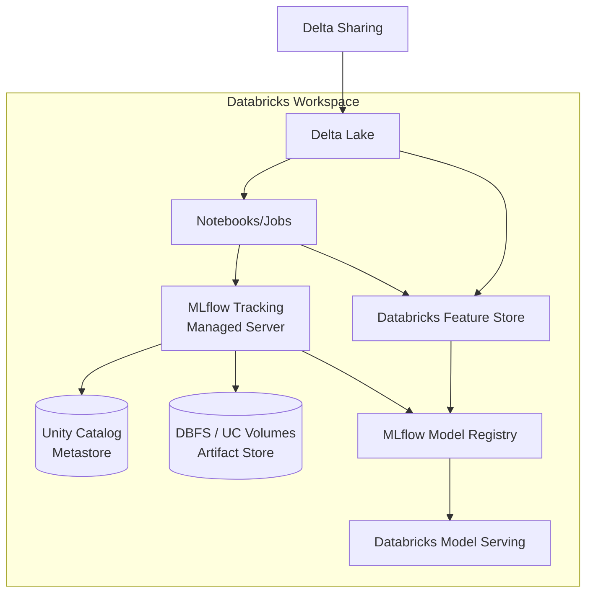
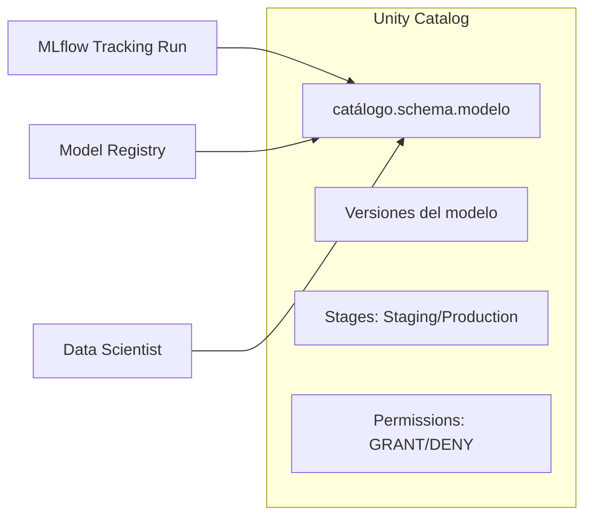
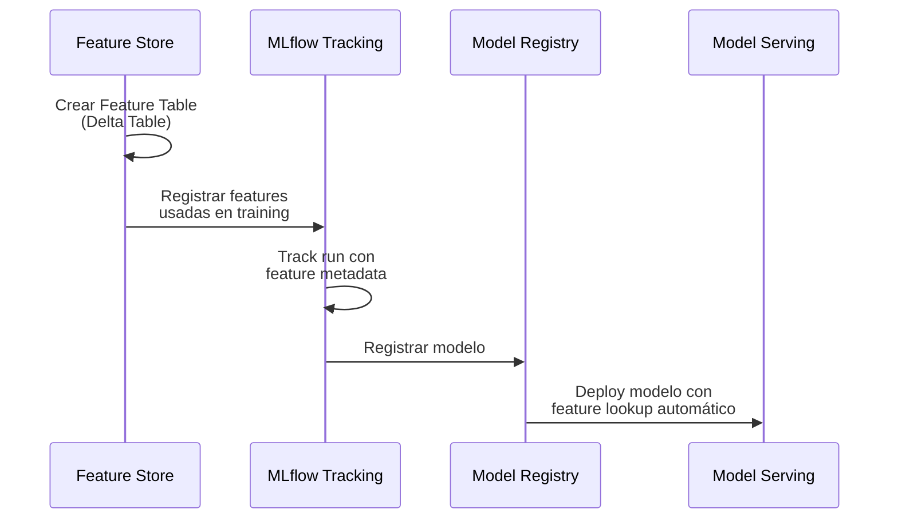
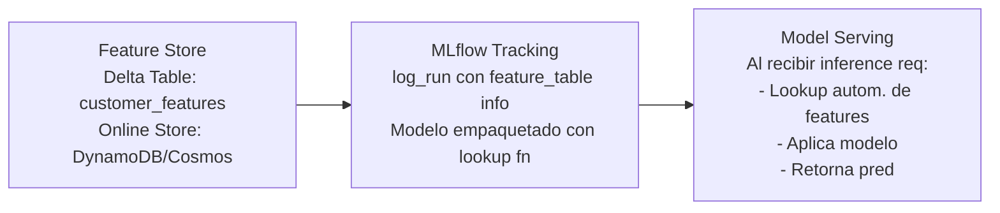
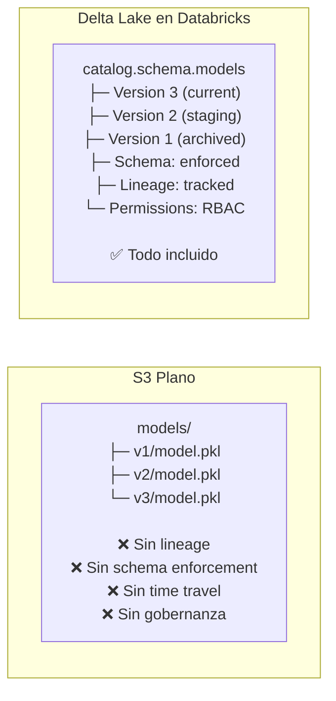
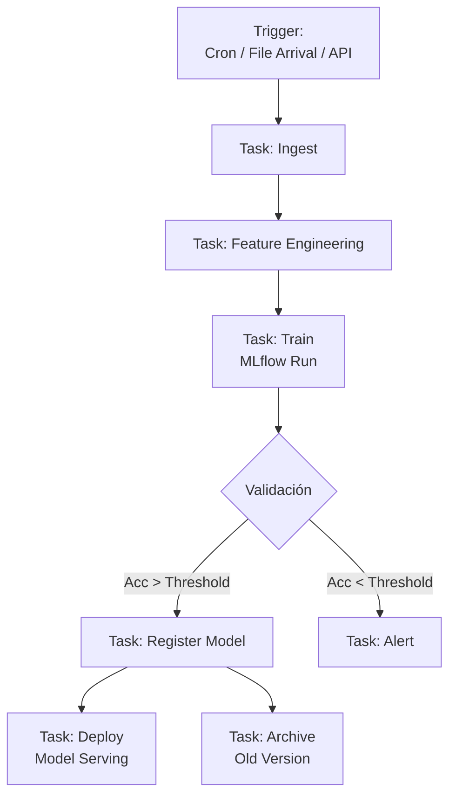
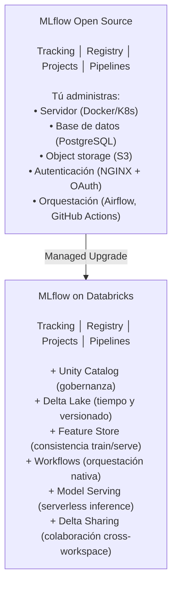

# ☁️ MLflow y Databricks: Integración Enterprise

## Introduction

Databricks es la plataforma que creó MLflow y la utiliza como su sistema nativo de tracking, model registry y experimentación. Entender la integración entre MLflow y Databricks no es solo aprender una herramienta más, sino comprender cómo funciona el MLOps en entornos enterprise cloud-native donde el tracking, el feature store, el data lakehouse y el serving convergen en una misma plataforma.

Esta nota complementa [[01 - MLflow y Tracking de Experimentos|la teoría de MLflow Tracking]] y el [[03 - Model Registry y Lifecycle|Model Registry]] con los aspectos específicos que aparecen cuando ejecutas MLflow sobre Databricks: managed tracking server, Unity Catalog como backend de metadatos, Delta Lake como artifact store, y Databricks Workflows como orquestador de pipelines MLflow.

---

## 1. 🏛️ Arquitectura: MLflow en Databricks

En Databricks, MLflow es un servicio managed. La plataforma abstracte la infraestructura y proporciona:

| Componente | MLflow Open Source | MLflow en Databricks |
|---|---|---|
| **Tracking Server** | Despliegas tu propio servidor (Docker, K8s) | Managed, provisto por el workspace |
| **Backend Store** | PostgreSQL, MySQL (tú administras) | Unity Catalog o Hive Metastore |
| **Artifact Store** | S3, GCS, Azure Blob (tú configuras) | DBFS, Unity Catalog Volumes, o S3 |
| **Autenticación** | NGINX + OAuth2 (manual) | IAM nativo del workspace |
| **Model Registry** | MLflow Model Registry | MLflow Model Registry + Unity Catalog |
| **Feature Store** | No incluido (externo: Feast) | Databricks Feature Store integrado |
| **Orquestación** | Manual (Airflow, cron) | Databricks Workflows nativo |




---

## 2. 🔐 Unity Catalog como Backend de MLflow

Unity Catalog es el catálogo de datos y metadatos unificado de Databricks. Cuando MLflow se ejecuta sobre Databricks, Unity Catalog actúa como backend store, reemplazando PostgreSQL/SQLite:



### Ventajas sobre PostgreSQL standalone

| Aspecto | PostgreSQL | Unity Catalog |
|---|---|---|
| **Gobernanza** | Manual (roles DB) | RBAC fino: `GRANT EXECUTE ON MODEL` |
| **Lineage** | No incluido | Captura automática de linaje de datos |
| **Auditoría** | Logs de DB manuales | Audit logs integrados en el workspace |
| **Discovery** | Solo via MLflow UI | Search y browse integrado en Data Explorer |
| **Sharing** | No soportado | Delta Sharing para compartir modelos entre workspaces |

### Modelo de permisos

```sql
-- Unity Catalog: permisos granulares sobre modelos MLflow
GRANT EXECUTE ON MODEL catalog.schema.iris_model TO data_science_team;
GRANT MANAGE ON MODEL catalog.schema.iris_model TO mlops_admin;
DENY EXECUTE ON MODEL catalog.schema.iris_model TO external_vendor;
```

Esto permite que diferentes equipos (DS, MLOps, QA, external) tengan accesos diferenciados a versiones y stages del modelo sin exponer la infraestructura subyacente.

---

## 3. 💻 MLflow Tracking en Databricks

En Databricks, el tracking es automático: no necesitas configurar `MLFLOW_TRACKING_URI`. Cada notebook y job registra runs en el servidor de tracking del workspace.

```python
# En Databricks, mlflow.set_tracking_uri() es opcional
# Se conecta automáticamente al servidor del workspace

import mlflow
import mlflow.sklearn
from sklearn.ensemble import RandomForestClassifier

# El experimento se crea en la UI o programáticamente
mlflow.set_experiment("/Users/leito@company.com/iris_classification")

# Autologging captura todo en el workspace
mlflow.sklearn.autolog()

with mlflow.start_run(run_name="databricks_rf_v1"):
    # El notebook path se registra automáticamente como tag
    # Los logs del cluster (Spark metrics) se capturan como métricas de sistema
    clf = RandomForestClassifier(n_estimators=200, max_depth=10)
    clf.fit(X_train, y_train)

    # El modelo se almacena en DBFS o Unity Catalog Volumes
    mlflow.sklearn.log_model(clf, "model", registered_model_name="catalog.schema.iris_model")

    print(f"Run ID: {mlflow.active_run().info.run_id}")
    print(f"Modelo registrado en: catalog.schema.iris_model")
```

### Tags automáticos de Databricks

Databricks enriquece cada run con metadatos del workspace:

| Tag | Descripción | Utilidad |
|---|---|---|
| `mlflow.databricks.notebookPath` | Ruta del notebook que generó el run | Trazabilidad completa |
| `mlflow.databricks.jobID` | ID del job si fue ejecutado vía Workflows | Relación run→pipeline |
| `mlflow.databricks.cluster.id` | Cluster que ejecutó el entrenamiento | Debugging de performance |
| `mlflow.databricks.webappURL` | URL al workspace | Acceso directo desde UI |
| `mlflow.databricks.sparkVersion` | Versión de Spark del cluster | Reproducibilidad de entorno |

---

## 4. 🔄 Databricks Feature Store + MLflow

El Databricks Feature Store se integra nativamente con MLflow Tracking. El flujo típico:



### Flujo de datos




Esto elimina el problema clásico de training-serving skew: las features se computan exactamente igual en training (por el Feature Store) que en inference (por el Model Serving endpoint que usa el mismo Feature Store).

---

## 5. 📦 Delta Lake como Artifact Store

Databricks utiliza Delta Lake — un formato de datos ACID sobre Parquet — como repositorio de artefactos de MLflow:

### ¿Qué es Delta Lake?

| Característica | Descripción |
|---|---|
| **ACID Transactions** | Escrituras atómicas, lecturas consistentes |
| **Time Travel** | Consultar datos históricos: `VERSION AS OF 5` |
| **Schema Evolution** | Agregar columnas sin reescribir la tabla completa |
| **Change Data Feed** | CDC nativo: captura inserts, updates, deletes |
| **Data Compaction** | OPTIMIZE y VACUUM para performance y limpieza |

### Ventajas sobre S3 plano




---

## 6. ⚙️ Databricks Workflows para MLflow Pipelines

Databricks Workflows orquesta pipelines de ML usando MLflow Projects o notebooks encadenados:



### Características clave del orquestador

| Feature | Descripción | Equivalente Airflow |
|---|---|---|
| **DAG de Tasks** | Notebooks, JARs, Python scripts como nodos | DAGs de Operators |
| **Trigger** | Cron, file arrival (S3/GCS), API REST | Sensors + Schedule |
| **Retry automático** | Configurable por task: timeout, reintentos, notificaciones | Retry policy |
| **Parámetros** | Pasar parámetros entre tasks (ej. run_id de MLflow) | XCom |
| **Condicionales** | `if/else` en el DAG basado en métricas del run anterior | BranchPythonOperator |
| **Repair Run** | Re-ejecutar una task fallida sin re-ejecutar todo el pipeline | Clear + rerun |

MLflow en Databricks no es un add-on, es el tejido conectivo de la plataforma: el tracking captura runs, el registry gobierna versiones, el feature store nutre features consistentes, y los workflows orquestan todo.

---

## 7. 🌉 Puente Open Source ↔ Enterprise

La relación MLflow open source vs MLflow on Databricks sigue un patrón similar a otros proyectos:




---

## ⚠️ Consideraciones Clave

- **Vendor lock-in mitigado:** MLflow es open source. El código que escribís usando `mlflow.log_metric()` funciona idéntico on-prem y en Databricks. Lo específico de Databricks (Feature Store, Unity Catalog) son capas adicionales, no reemplazos del core.
- **Costo:** Databricks cobra por DBU (Databricks Units). Los clusters para training son el costo principal. MLflow tracking en sí no agrega costo adicional.
- **Data residency:** Los artefactos de MLflow residen en tu bucket S3/GCS/Azure, no en los servidores de Databricks. Cumplimiento GDPR/HIPAA es tu responsabilidad sobre el bucket.
- **Límites de Model Registry:** Databricks impone límites (número de versiones por modelo, tamaño de artefacto). Para modelos muy grandes (>10GB), considera artifact store externo con referencia en el registry.

---

## 💡 Tips

- **Nombrado:** En Databricks, usa el path completo del workspace: `/Users/{email}/{project}/{experiment}`. Esto da namespacing automático por usuario y evita colisiones.
- **Unity Catalog requiere tres niveles:** `catalog.schema.model_name`. Configura esto desde el inicio; renombrar catálogos es complejo.
- **Feature Store lookup es determinista:** Si cambias la feature table, los modelos viejos no se actualizan automáticamente. Versiona tus feature tables junto con tus modelos.
- **Workflows + MLflow = integración nativa:** Pasar el `run_id` entre tasks del workflow permite que el task de deployment conozca exactamente qué modelo registrar.

---


## 🎯 Key Takeaways

- Databricks no es un competidor de MLflow: es el creador y el entorno enterprise nativo para ejecutarlo.
- Unity Catalog eleva el Model Registry de "carpeta de modelos" a "catálogo gobernado con RBAC y lineage".
- Delta Lake como artifact store añade garantías ACID y time travel que S3 plano no ofrece.
- Databricks Workflows + MLflow cierran el ciclo completo: trigger → train → register → deploy → monitor.
- La portabilidad open source es real: el código MLflow funciona igual en local, K8s y Databricks.

---

## Referencias

- [MLflow Guide — Databricks Documentation](https://docs.databricks.com/en/mlflow/index.html)
- [Unity Catalog Overview](https://docs.databricks.com/en/data-governance/unity-catalog/index.html)
- [Databricks Feature Store](https://docs.databricks.com/en/machine-learning/feature-store/index.html)
- [Delta Lake](https://delta.io/)
- [Databricks Workflows](https://docs.databricks.com/en/jobs/index.html)
