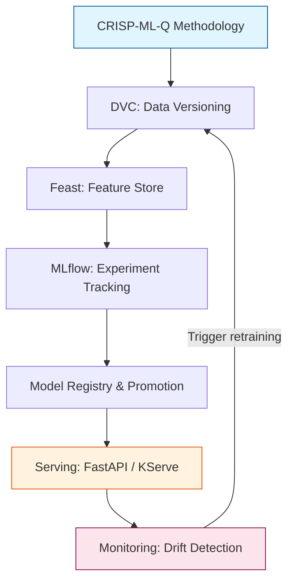

# 🔚 00 — Welcome to End-to-End ML Project

## Introduction

The gap between a Jupyter notebook model and a production ML system is not a step — it is a chasm. A model that achieves 0.94 AUC on a cleaned CSV sitting on your laptop shares almost nothing with the same model serving real customers. Production ML demands data versioning, reproducible pipelines, experiment lineage, feature consistency across training and serving, staged rollouts, and continuous monitoring for degradation. This course bridges that chasm with concrete tools, patterns, and architectural decisions drawn from the MLOps discipline.

A notebook is a snapshot. A production ML system is a living organism — it ingests shifting data distributions, serves requests at millisecond latency, and ages over time. CRISP-ML(Q) gives us the methodology; DVC, MLflow, Feast, and CI/CD give us the implementation. By the end of this course, you will design and build a complete end-to-end pipeline where every artifact is versioned, every experiment is logged, and every prediction is traceable back to the exact dataset and commit that produced it.

If you have trained a model in Python and wondered "what now?", you are in the right place. This course assumes basic Python fluency and familiarity with training a classifier or regressor using scikit-learn, PyTorch, or TensorFlow. No prior MLOps knowledge required.

---

## 1. Course Map

The course is structured as a practical walk through the ML lifecycle, with each module tackling one critical production failure mode:

| Module | Topic | Failure Mode Prevented |
|---|---|---|
| [[01 - CRISP-ML(Q) and the ML Project Lifecycle]] | Methodology & lifecycle phases | Solving the wrong problem, linear thinking |
| [[02 - Data Versioning with DVC - Pipelines, Remote Storage and CML]] | Reproducible data pipelines | "It worked on my laptop" data chaos |
| [[03 - Experiment Tracking with MLflow - Runs, Registry and Model Promotion]] | Run logging & model governance | Lost experiment history, unversioned models |
| [[04 - Feature Stores and Training-Serving Skew Prevention]] | Consistent feature computation | Silent model degradation from feature skew |

Each module contains antipattern comparisons, production case studies, compression code, and a company case study (Netflix, Uber, Databricks, or Kaggle). The course builds cumulatively: DVC manages data, MLflow logs the training run over that data, Feast serves consistent features, and all three integrate into a CI/CD pipeline.

---

## 2. Prerequisites and Tooling

You need:

- **Python 3.9+** with `pip` virtual environment experience
- **Basic ML training**: you have used scikit-learn, PyTorch, or XGBoost to train a model on a dataset
- **Git**: you can `git init`, `git commit`, and `git push`
- **Command-line comfort**: you can run shell commands and edit YAML files

The tools installed throughout this course:

```
dvc[s3]==3.x        # Data versioning
mlflow==2.x         # Experiment tracking & model registry
feast==0.x          # Feature store
pandas, scikit-learn, numpy
```

All code examples assume a Unix-like environment (Linux or macOS). Windows users should use WSL2.

---

## 3. Course Architecture



The arrow from Monitoring back to Data Versioning is not decorative — it is the core insight of MLOps. Production is not a destination; it is a loop.


*Source: Wikimedia Commons. The MLOps Venn diagram shows the intersection of ML, DevOps, and Data Engineering — the three disciplines this course unifies.*

---

## 4. How to Use This Course

Each note follows a consistent structure:

1. **Introduction** — why this topic matters in production
2. **Theory** — mental model, architecture, or mathematical foundation
3. **Implementation** — concrete code with DVC/MLflow/Feast APIs
4. **Antipatterns** — ❌ what fails vs ✅ what works, side by side
5. **Caso Real** — how a specific company solved this problem
6. **Compression Code** — a reusable micro-framework (20-30 lines)
7. **Internal Links** — connected notes for deeper exploration

Do not skip the antipatterns. Production ML is defined as much by what you avoid as by what you build.

---

## 5. References and Further Reading

- **Chip Huyen**, *Designing Machine Learning Systems* (O'Reilly, 2022) — the canonical text on production ML architecture
- **Andriy Burkov**, *Machine Learning Engineering* (True Positive, 2020) — concise, code-driven reference
- **Sculley et al.**, "Hidden Technical Debt in Machine Learning Systems" (NeurIPS 2015) — the paper that named the problem
- **Google MLOps Guide** — practitioners.google.com/mlops

Internal links for context: [[../18 - Experiment Tracking y Model Registry/00 - Bienvenida|Experiment Tracking module]], [[../19 - Feature Engineering y Feature Stores/00 - Bienvenida|Feature Engineering module]], [[../20 - Deployment y Serving/00 - Bienvenida|Deployment module]], [[../21 - Monitoreo y Mantenimiento/00 - Bienvenida|Monitoring module]], [[../27 - Feast and Feature Stores/00 - Welcome to Feast and Feature Stores for MLOps|Feast module]], [[../29 - CI-CD for ML/04 - CI-CD for ML|CI-CD module]]
