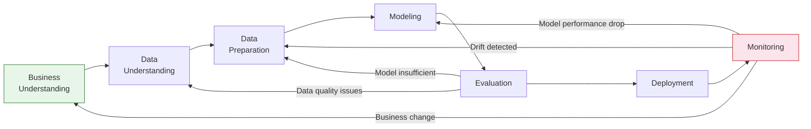

# 🔄 01 — CRISP-ML(Q) and the ML Project Lifecycle

## Introduction

Most ML teams start projects from the middle: someone hands them a dataset, and they begin optimizing for AUC. This is the fastest path to a model nobody needs. CRISP-ML(Q) — the Cross-Industry Standard Process for Machine Learning with Quality assurance — inverts this instinct. It mandates that every ML project begin with **business understanding** and end with **monitoring**, with explicit quality gates between each phase. Without these gates, teams ship models that solve the wrong problem, use poisoned data, or degrade undetected in production.

CRISP-ML(Q) extends CRISP-DM (the 1996 data mining standard) with quality assurance dimensions: Is the data good enough? Is the model good enough? Is the deployment safe? Is the monitoring sufficient? These are not questions to answer once; they are continuously re-evaluated as data shifts and business requirements evolve. This note gives each phase deep treatment and shows why linear thinking about ML projects fails catastrophically.

The MLOps maturity model (Google, 2020) maps directly onto CRISP-ML(Q): Level 0 is manual Jupyter-to-API, Level 1 introduces pipeline CI/CD, and Level 2 adds model CI/CD. By the end of this course, you will understand what a Level 2 implementation demands and how CRISP-ML(Q) guides you there.

---

## 1. The Seven Phases of CRISP-ML(Q)

### Phase 1: Business Understanding — Define Success Before You Train

**Goal:** Translate business objectives into ML objectives. If the business needs to reduce churn by 10%, the ML metric is not AUC — it is the precision at the top-k users targeted by a retention campaign, bounded by intervention cost.

**Quality Gate:** Can you write the success criterion on a Post-it note that a non-engineer understands? If your answer is "increase F1 score by 0.03," go back. The correct answer is "identify 80% of users who will churn within 30 days with a 60% precision, enabling a $2M annual retention gain."

**Key deliverables:** business objective → success criteria → ML objective (formalized as a measurable function) → project plan. The project plan must specify data sources, compute budget, latency requirements, and an estimated cost of a bad prediction (false positive vs. false negative). If a false negative costs 100x more than a false positive, optimize for recall, not precision — and state this explicitly.

¡Sorpresa! **87% of ML projects never reach production** (VentureBeat, 2019). The #1 cited reason is not model quality — it is poor business problem definition. Teams optimize the wrong metric, build features for the wrong population, or discover post-deployment that users don't need the prediction.

### Phase 2: Data Understanding — Verify Your Raw Material

**Goal:** Collect initial data, describe it statistically, verify data quality, and discover first insights. This is an exploratory phase — you are not yet cleaning or transforming.

**Quality Gate:** Is the data actually capable of answering the business question? Check: label availability, class balance, feature completeness, temporal coverage. If 90% of labels are missing because "optional" fields in your source system were never populated, stop now — more ML won't fix this.

**Key outputs:** data description report (schema, statistics, distributions, missing rates), data quality report (outliers, duplicates, inconsistencies), verified data sources.

### Phase 3: Data Preparation — Build Reproducible Feature Pipelines

**Goal:** Transform raw data into a clean, feature-engineered dataset suitable for modeling. This includes selection, cleaning, construction, integration, and formatting. **Every transformation must be codified** — no manual CSV exports.

**Quality Gate:** Can another engineer reproduce the exact training dataset from raw sources using only your code? If your process involves `df.to_csv('final_v2_REAL.csv')` and a shared drive, the answer is no.

**Key outputs:** data pipeline code, feature definitions, transformed dataset (versioned). This is where DVC enters: `dvc.yaml` captures the pipeline stages, and `dvc.lock` pins exact hashes.

### Phase 4: Modeling — Explore, Iterate, and Track Everything

**Goal:** Select modeling techniques, build models, tune hyperparameters. This phase iterates rapidly — and precisely for that reason, every run must be logged.

**Quality Gate:** Could you reproduce the best model from scratch three months from now, on a different machine, using only the tracking server? If your answer depends on "I'll remember which learning rate I used," you fail the gate.

**Key outputs:** trained models, MLflow experiment logs containing params/metrics/artifacts, model comparison report. MLflow's tracking UI lets you sort runs by any metric and identify which hyperparameter combination drove performance.

### Phase 5: Evaluation — Validate Against Business KPIs

**Goal:** Before deployment, rigorously evaluate whether the model meets the business success criteria defined in Phase 1. This is not about test-set accuracy — it is about whether the model, if deployed, would generate the expected business outcome.

**Quality Gate:** Have you tested the model on a holdout set drawn from the same time period as production data would be? Train/test splits that randomly shuffle timestamps are a time-travel cheat. You must train on the past, evaluate on the future.

**Key outputs:** evaluation report with business KPIs (not just ML metrics), review of success criteria from Phase 1, go/no-go decision for deployment.

### Phase 6: Deployment — Integrate Into Production Infrastructure

**Goal:** Deploy the model into a production environment where it serves predictions to downstream systems. The deployment strategy (batch, real-time, streaming) must match the latency requirements defined in Phase 1.

**Quality Gate:** Does the deployment include a rollback mechanism? Can you revert to the previous model version in under 5 minutes? Is there a shadow/canary stage before 100% traffic?

**Key outputs:** model served via REST/gRPC, A/B test framework configured, rollback playbook documented, model registered in MLflow Registry with Production stage.

### Phase 7: Monitoring and Maintenance — Close the Loop

**Goal:** Continuously monitor the model's input data, predictions, and business impact. Production data drifts; models silently degrade. Monitoring must trigger alerts and, when drift exceeds thresholds, retraining.

**Quality Gate:** Do you detect data drift within 24 hours? Do you have a runbook for model rollback? Is retraining automated or manually triggered?

**Key outputs:** drift dashboards, alert configurations, retraining pipeline trigger, documentation of model lifetime decisions.

---

## 2. Why Linear Thinking Fails: ML is a Continuous Loop

A common anti-pattern is treating these phases as a waterfall: finish Phase 1, move to Phase 2, never look back. This fails because:

1. **Data drifts after deployment** — the distribution you validated against in Phase 5 is no longer the distribution hitting your model in Phase 6. You must retrain, which sends you back to Phase 3 (Data Preparation).
2. **Business objectives change** — the churn threshold that made sense last year may be obsolete. Phase 1 must be revisited.
3. **Model feedback loops** — your deployed model influences user behavior, which changes the data distribution, which invalidates your evaluation assumptions. Monitoring (Phase 7) must feed back into Data Understanding (Phase 2).



The return arrows are not optional — they are the defining characteristic of a mature ML system. Without them, your first deployment is your last useful deployment.

---

## 3. The MLOps Maturity Model

Google's MLOps maturity model (2020) defines three levels that map directly onto CRISP-ML(Q) practice:

### Level 0: Manual Process (Anti-pattern)

A data scientist trains a model in a notebook, exports a pickle file, hands it to an engineer who wraps it in Flask and deploys it. No data versioning, no experiment tracking, no CI/CD, no monitoring. When the model degrades, nobody knows until users complain.

**Characteristics:** manual steps, no reproducibility, no feedback loop. The CRISP-ML(Q) phases exist only in the data scientist's head, if at all.

### Level 1: CI/CD for ML Pipeline

The pipeline (data extraction → validation → training → evaluation) is automated. When new data arrives or code changes, the pipeline runs end-to-end with tests at each stage. DVC manages data versioning; the pipeline is defined in `dvc.yaml` and executed with `dvc repro`. MLflow tracks experiments. CI/CD validates pipeline changes before merging.

**Characteristics:** automated pipeline, data validation gates, experiment tracking, continuous training (CT). Deployment of the trained model may still be a manual step. Most organizations capable of Level 1 have adopted DVC + MLflow + CI (GitHub Actions / GitLab CI).

### Level 2: CI/CD for Pipeline + Model

Extends Level 1 by automating model deployment itself. When the pipeline produces a new model that passes evaluation gates, it is automatically staged, integration-tested, and promoted to production. Monitoring triggers retraining automatically. This is the "full loop" — the CRISP-ML(Q) cycle running continuously.

**Characteristics:** automated model deployment, A/B testing integrated into CI/CD, monitoring-to-retraining loop closed, model registry with automated stage transitions.

```mermaid
graph TD
    subgraph Level 0
        L0A[Notebook] --> L0B[pickle file] --> L0C[Manual deploy]
    end
    subgraph Level 1
        L1A[Source code] --> L1B[CI: test pipeline] --> L1C[DVC repro] --> L1D[MLflow train] --> L1E[Manual deploy]
    end
    subgraph Level 2
        L2A[Source code] --> L2B[CI: test pipeline] --> L2C[DVC repro] --> L2D[MLflow train] --> L2E[Registry: Staging] --> L2F[Integration tests] --> L2G[Registry: Production] --> L2H[Auto deploy] --> L2I[Monitor] -->|Drift| L2A
    end

    style L0A fill:#ffcdd2,stroke:#b71c1c
    style L0B fill:#ffcdd2,stroke:#b71c1c
    style L0C fill:#ffcdd2,stroke:#b71c1c
    style L1A fill:#fff9c4,stroke:#f57f17
    style L1E fill:#fff9c4,stroke:#f57f17
    style L2A fill:#c8e6c9,stroke:#1b5e20
    style L2H fill:#c8e6c9,stroke:#1b5e20
    style L2I fill:#c8e6c9,stroke:#1b5e20
```



This course builds toward a complete Level 2 implementation. By Note 04, you will have connected DVC, MLflow, and Feast into a pipeline where changing any input triggers a full, reproducible retrain-and-evaluate cycle.

### Level Progression Checklist

| Capability | Level 0 | Level 1 | Level 2 |
|---|---|---|---|
| Data versioning | Manual filenames | DVC-tracked | DVC + CI trigger |
| Experiment tracking | None | MLflow per run | MLflow automated via CI |
| Pipeline | Manual Jupyter cells | `dvc repro` | GitHub Actions on push |
| Model deployment | scp pickle file | Manual registry promotion | Automated staging→production |
| Monitoring | User complaints | Weekly report | Real-time drift alerts |
| Rollback | Copy old file from backup | Registry stage revert | Automatic rollback on metric drop |
| Feature consistency | Train≠Serve SQL | Feast offline store only | Feast online+offline, point-in-time |

### Common Failure Patterns by Phase

Each CRISP-ML(Q) phase has a characteristic failure mode. Recognizing these prevents the most expensive mistakes:

**Phase 1 (Business Understanding) — Metric Misalignment:** The team optimizes RMSE when the business needs precision@k. Example: a fraud detection model optimized for AUC catches many fraudsters but generates too many false positives, overwhelming the investigation team and causing them to ignore alerts.

**Phase 2 (Data Understanding) — Sampling Bias:** Training data collected from one market (US) is used to deploy in another (Brazil). User behavior, device types, and seasonality differ — the model silently underperforms. Detection: compare feature distributions across markets before training.

**Phase 3 (Data Preparation) — Train-Serving Mismatch:** Feature engineering code is copied into the serving pipeline with slight differences (e.g., missing value imputation uses mean from training data vs. mean from serving window). Detection: feature validation in the serving pipeline comparing live feature statistics against training statistics.

**Phase 5 (Evaluation) — Temporal Leakage:** Random train/test split mixes future and past observations. The model learns patterns that won't exist at serving time. Detection: always split by time, training on earlier data, testing on later data.

**Phase 7 (Monitoring) — Alert Fatigue:** Drift thresholds set too tight trigger daily false alarms. The team learns to ignore alerts — including the real one. Detection: track alert-to-action ratio; if >80% of alerts are dismissed without action, recalibrate thresholds.

---

## 4. Antipatterns: Notebook-to-Production vs CRISP-ML(Q)+DVC+MLflow+CI

### ❌ Antipattern: Jupyter Notebook Deployed Directly

```python
# ❌ Level 0 Anti-pattern: Notebook model → export → manual deploy
import pandas as pd
from sklearn.ensemble import RandomForestClassifier
import pickle

# Data: loaded from shared drive, version unknown
df = pd.read_csv("/shared/drive/dataset_v3_final_REAL_2.csv")

# Feature engineering: undocumented, unreproducible
df["tenure_ratio"] = df["tenure"] / df["tenure"].max()
df["avg_monthly"] = df["total_charges"] / df["tenure"]  # ¡Sorpresa! division by zero not checked

X = df[["tenure_ratio", "avg_monthly", "monthly_charges"]]
y = df["churn"]

model = RandomForestClassifier(n_estimators=100, random_state=42)  # ⚠️ random_state hardcoded, not logged
model.fit(X, y)

# Export: no version, no environment, no lineage
pickle.dump(model, open("model_final.pkl", "wb"))
# ⚠️ Deployed by copying this file to a server. No rollback plan. No monitoring.
```

### ✅ Correct: CRISP-ML(Q) with DVC + MLflow + CI

```python
# ✅ Level 2: Every phase has a quality gate, every artifact is tracked
import pandas as pd
import mlflow
import mlflow.sklearn
from sklearn.ensemble import RandomForestClassifier
from sklearn.model_selection import train_test_split
from sklearn.metrics import classification_report
import dvc.api
import yaml

# PHASE 1: Business Understanding — documented in project YAML
# PHASE 2: Data Understanding — verify schema, distributions
# PHASE 3: Data Preparation — reproducible via DVC pipeline (dvc.yaml)

# Load versioned data — DVC ensures exact version
with dvc.api.open(path="data/features.parquet", repo=".", rev="HEAD") as f:
    df = pd.read_parquet(f)

# PHASE 4: Modeling — MLflow tracks everything
mlflow.set_experiment("churn_production")

X = df.drop(columns=["churn", "customer_id"])
y = df["churn"]

# Temporal split: train on past, evaluate on future — no time travel
split_date = "2024-01-01"
train_mask = df["observation_date"] < split_date
X_train, X_val = X[train_mask], X[~train_mask]
y_train, y_val = y[train_mask], y[~train_mask]

with mlflow.start_run(run_name="rf_baseline"):
    params = {"n_estimators": 100, "max_depth": 8, "class_weight": "balanced"}
    mlflow.log_params(params)
    mlflow.log_param("training_date", split_date)

    model = RandomForestClassifier(**params, random_state=42)
    model.fit(X_train, y_train)

    preds = model.predict(X_val)
    report = classification_report(y_val, preds, output_dict=True)

    # Log ALL metrics, not just accuracy
    mlflow.log_metrics({
        "accuracy": report["accuracy"],
        "recall_churn": report["1"]["recall"],
        "precision_churn": report["1"]["precision"],
        "f1_churn": report["1"]["f1-score"],
    })

    # PHASE 5: Evaluation gate — check against business KPIs
    if report["1"]["recall"] < 0.70:
        raise ValueError("Recall below business threshold — model not deployable")  # 💡 Fails fast

    # PHASE 6: Deployment preparation — register in MLflow
    mlflow.sklearn.log_model(
        sk_model=model,
        artifact_path="model",
        registered_model_name="churn_predictor",
    )

# 💡 Model now in MLflow Registry, staged as "None" — CI/CD pipeline promotes
#   to "Staging" → runs integration tests → promotes to "Production"

# PHASE 7: Monitoring — handled by separate drift detection service (Note 04)
```

⚠️ The key difference is not code length — it is the presence of quality gates, version tracking, and a documented promotion workflow. The ❌ code is shorter but creates unrecoverable technical debt. The ✅ code is longer because it encodes the process that prevents production disasters.

---

## 5. Caso Real: Netflix's Multi-Layer Recommendation Pipeline

Netflix operates one of the world's most sophisticated end-to-end ML pipelines. Their recommendation system serves 260+ million subscribers across 190 countries, handling billions of daily events. Their CRISP-ML(Q)-style process:

**Business Understanding (Phase 1):** The objective is not "build a better recommendation model" — it is "maximize member retention by delivering content that matches each member's taste profile." Success is measured in retention hours, not RMSE. Netflix discovered early that improving recommendation quality by 10% reduces churn by a measurable fraction — worth hundreds of millions annually.

**Data Understanding & Preparation (Phases 2-3):** Netflix's data platform ingests petabytes of interaction events daily (plays, ratings, searches, browsing, pauses, re-watches). They use Spark for batch processing and Kafka+Flink for streaming. All data is versioned and lineage-tracked through their internal data platform, ensuring every training dataset can be traced to its source events. Their feature platform (similar to Feast) computes 1000+ features per member-title pair.

**Modeling (Phase 4):** Netflix uses an ensemble of models trained offline in Spark MLlib, TensorFlow, and PyTorch. Their experiment tracking infrastructure (internal, analogous to MLflow at scale) logs every run across geographically distributed teams. A single model may compete against dozens of variants before promotion.

**Evaluation (Phase 5):** Offline metrics (NDCG, recall@k) are computed, but offline evaluation is treated as a screening step — never a final decision. The true evaluation happens in production through **A/B testing** (interleaving and member-level randomization). Netflix runs 250+ A/B tests simultaneously. A model only graduates to full production after showing statistically significant improvement in a holdout A/B test lasting 2-4 weeks.

**Deployment (Phase 6):** Models are served through microservices with strict latency budgets (<100ms p99). Deployment follows a canary model: 1% → 10% → 50% → 100% over days, with automatic rollback if key metrics (play rate, session length) deviate beyond thresholds.

**Monitoring (Phase 7):** Netflix monitors hundreds of metrics: ranking drift, coverage (percentage of catalog surfaced), diversity, novelty, and business KPIs (retention, hours streamed). Drift detection triggers automated retraining. The loop is continuous — monitoring always feeds back into data preparation.

The critical lesson: the recommendation model itself is <5% of the total system engineering effort. Data pipelines, feature computation, A/B infrastructure, deployment safety, and monitoring consume the other 95%.


*Source: Wikimedia Commons. CRISP-DM's original diagram shows the iterative nature of data mining. CRISP-ML(Q) extends this with explicit quality assurance gates at each transition, and adds Monitoring as the seventh phase closing the loop back to Business Understanding.*

---

## 6. Código de Compresión — CRISP-ML(Q) Phase Checklist as Python Enum

```python
"""
CRISP-ML(Q) Phase Enforcement with Quality Gates
A self-documenting checklist that prevents skipping phases.
"""
from enum import Enum
from dataclasses import dataclass, field
from typing import Callable, Optional
import datetime


class Phase(Enum):
    BUSINESS_UNDERSTANDING = "business_understanding"
    DATA_UNDERSTANDING = "data_understanding"
    DATA_PREPARATION = "data_preparation"
    MODELING = "modeling"
    EVALUATION = "evaluation"
    DEPLOYMENT = "deployment"
    MONITORING = "monitoring"

    def next_phase(self):
        phases = list(Phase)
        idx = phases.index(self)
        return phases[idx + 1] if idx + 1 < len(phases) else None


@dataclass
class QualityGate:
    description: str
    validator: Callable[[], bool]
    passed: bool = False


@dataclass
class ProjectLifecycle:
    name: str
    current_phase: Phase = Phase.BUSINESS_UNDERSTANDING
    gates: dict = field(default_factory=dict)
    started_at: str = field(default_factory=lambda: datetime.datetime.now().isoformat())

    def add_gate(self, phase: Phase, gate: QualityGate):
        self.gates.setdefault(phase, []).append(gate)

    def advance(self) -> Optional[Phase]:
        next_p = self.current_phase.next_phase()
        if next_p is None:
            raise ValueError("Already at final phase: Monitoring")
        gates = self.gates.get(self.current_phase, [])
        for g in gates:
            if not g.validator():
                raise RuntimeError(f"Gate failed: {g.description}")
            g.passed = True
        self.current_phase = next_p
        return next_p


# Usage
project = ProjectLifecycle("churn_prediction_v2")
project.add_gate(
    Phase.BUSINESS_UNDERSTANDING,
    QualityGate("Success metric defined in dollars", lambda: True),
)
project.add_gate(
    Phase.DATA_UNDERSTANDING,
    QualityGate("Label distribution verified: churn_rate=0.15", lambda: True),
)
# project.advance()  # ← moves to DATA_UNDERSTANDING after gates pass

# ¡Sorpresa! The enum+gate pattern embeds CRISP-ML(Q) into code.
#   If a team member tries to deploy without passing evaluation,
#   the code prevents it. Process enforced by the runtime.
```

---

**Internal Links:** [[00 - Welcome to End-to-End ML Project|Course Overview]], [[../18 - Experiment Tracking y Model Registry/00 - Bienvenida|Experiment Tracking (09/18)]], [[../19 - Feature Engineering y Feature Stores/00 - Bienvenida|Feature Engineering (09/19)]], [[../20 - Deployment y Serving/00 - Bienvenida|Deployment (09/20)]], [[../21 - Monitoreo y Mantenimiento/00 - Bienvenida|Monitoring (09/21)]], [[02 - Data Versioning with DVC - Pipelines, Remote Storage and CML|→ Next: DVC Data Versioning]]
