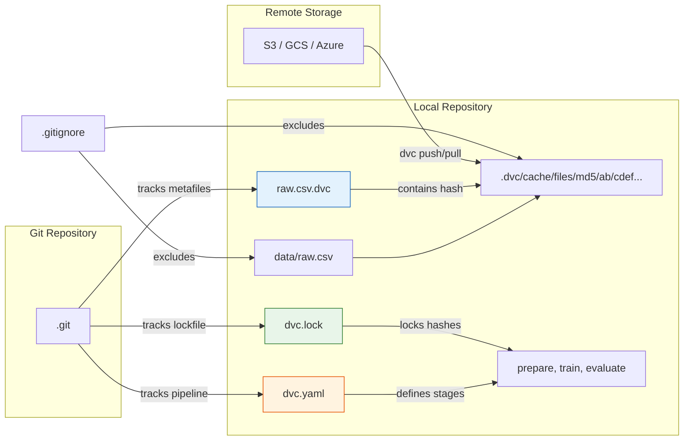

# 📦 02 — Data Versioning with DVC: Pipelines, Remote Storage, and CML

## Introduction

Git versions code perfectly. It versions datasets terribly. A 2GB CSV in Git produces a 2GB repository that grows without bound, offers no data diffing, and provides no concept of "which model was trained on which version of which dataset." DVC (Data Version Control) solves this by doing for data what Git does for code — without storing the actual data in your repository.

DVC replaces large files with small `.dvc` metafiles containing MD5 hashes. The actual data lives in remote storage (S3, GCS, Azure Blob, SSH, HDFS). `dvc push` and `dvc pull` move data to and from remotes exactly like `git push` and `git pull` for code. When you change your dataset, DVC generates a new hash — which you commit to Git. The result: every Git commit can reconstruct the exact dataset, model, and pipeline state that existed at that point in time.

DVC's second superpower is the **pipeline**: `dvc.yaml` defines stages (prepare, train, evaluate) with explicit dependencies and outputs. `dvc.lock` records the hash of every dependency, so `dvc repro` re-runs only stages whose inputs have changed. Combined with CML (Continuous Machine Learning), DVC integrates directly into GitHub Actions and GitLab CI, automatically generating metric reports in pull request comments. This is the foundation of Level 2 MLOps.

---

## 1. The DVC Mental Model: Metafiles, Hashes, and Remotes



**Key principle:** DVC never stores your data in Git. It stores **pointers** (hashes) to your data. The `.dvc` file for a 10GB dataset is ~200 bytes. When you `dvc push`, the data goes to your remote (S3 bucket, GCS bucket, etc.). When your teammate `dvc pull`s, DVC reads the hash from the `.dvc` file, looks up the cache, and downloads from the remote if needed. This is identical to how Git doesn't store file contents as diffs but as blob objects addressed by SHA-1 hashes — DVC applies the same content-addressable design to data.

---

## 2. DVC Pipeline: Stages, Dependencies, and Reproduction

A DVC pipeline is a directed acyclic graph (DAG) of stages. Each stage has:

- **cmd**: the shell command to execute (Python script)
- **deps**: input dependencies (data files, scripts)
- **outs**: output artifacts (processed data, model files, metrics)
- **metrics**: output metrics (tracked over time)
- **params**: hyperparameters from `params.yaml`

### dvc.yaml — Pipeline Definition

```yaml
stages:
  prepare:
    cmd: python src/prepare.py
    deps:
      - data/raw/customers.csv
      - src/prepare.py
    params:
      - prepare.test_size
      - prepare.random_state
    outs:
      - data/processed/train.parquet
      - data/processed/val.parquet
    metrics:
      - metrics/prepare.json:
          cache: false

  train:
    cmd: python src/train.py
    deps:
      - data/processed/train.parquet
      - src/train.py
    params:
      - train.n_estimators
      - train.max_depth
    outs:
      - models/model.pkl
    metrics:
      - metrics/train.json:
          cache: false

  evaluate:
    cmd: python src/evaluate.py
    deps:
      - models/model.pkl
      - data/processed/val.parquet
      - src/evaluate.py
    outs:
      - data/predictions.csv
    metrics:
      - metrics/evaluate.json:
          cache: false
```

### dvc.lock — Hash-Locked Reproducibility

```yaml
schema: '2.0'
stages:
  prepare:
    cmd: python src/prepare.py
    deps:
      - path: data/raw/customers.csv
        hash: md5: a3b2c1d4e5f6a7b8c9d0e1f2a3b4c5d6
      - path: src/prepare.py
        hash: md5: f1e2d3c4b5a69788
    params:
      params.yaml:
        prepare.test_size: 0.2
        prepare.random_state: 42
    outs:
      - path: data/processed/train.parquet
        hash: md5: b4c3d2e1f0g9h8i7j6k5l4m3n2o1p0
      - path: data/processed/val.parquet
        hash: md5: c1d2e3f4g5h6i7j8k9l0m1n2o3p4q5
```

¡Sorpresa! `dvc.lock` is the reproducibility guarantee. When you run `dvc repro`, DVC compares the current hashes of all dependencies against the lock file. If they match, the stage is skipped — producing the same output is unnecessary. If any hash differs, the stage re-executes. This is not a cache based on timestamps (fragile) — it is a cache based on content hashes (deterministic).

---

## 3. Remote Storage: S3, GCS, Azure, and SSH

```bash
# Initialize DVC in an existing Git project
git init
dvc init

# Configure remote storage (S3 example)
dvc remote add -d myremote s3://my-bucket/dvc-store
dvc remote modify myremote region us-east-1

# Track a dataset
dvc add data/raw/large_dataset.csv

# Push data to remote (like git push for data)
dvc push

# On another machine, clone the repo and pull data
git clone <repo-url>
dvc pull  # Downloads data from remote, restoring exact versions
```

**Best practices for remote configuration:**

| Remote Type | Command | Use Case |
|---|---|---|
| **S3** | `s3://bucket/path` | AWS-native teams |
| **GCS** | `gs://bucket/path` | GCP-native teams |
| **Azure Blob** | `azure://container/path` | Azure-native teams |
| **SSH** | `ssh://user@host/path` | On-premise or simple setups |
| **Local** | `/shared/nfs/dvc-store` | Shared filesystems (not for production) |

`dvc push` is the data equivalent of `git push`. `dvc pull` fetches the exact data versions locked in `dvc.lock`. If you check out an old Git commit and run `dvc checkout`, DVC restores the data to the state it had at that commit — full time-travel for your ML assets.

---

## 4. CML: Continuous Machine Learning with GitHub Actions

CML (Continuous Machine Learning) bridges DVC pipelines with CI/CD. It generates visual reports in PR comments showing how a code or data change affects your model's performance.

### GitHub Actions Workflow with DVC + CML

```yaml
# .github/workflows/cml.yaml
name: ML Pipeline
on: [push, pull_request]
jobs:
  run-pipeline:
    runs-on: ubuntu-latest
    steps:
      - uses: actions/checkout@v4
      - uses: iterative/setup-dvc@v2
      - uses: iterative/setup-cml@v2
      - uses: actions/setup-python@v5
        with:
          python-version: '3.11'

      - run: pip install -r requirements.txt

      - name: Configure DVC remote
        env:
          AWS_ACCESS_KEY_ID: ${{ secrets.AWS_ACCESS_KEY_ID }}
          AWS_SECRET_ACCESS_KEY: ${{ secrets.AWS_SECRET_ACCESS_KEY }}
        run: |
          dvc remote add -d myremote s3://my-bucket/dvc
          dvc pull

      - name: Reproduce pipeline
        run: dvc repro

      - name: Generate CML report
        env:
          REPO_TOKEN: ${{ secrets.GITHUB_TOKEN }}
        run: |
          echo "# 🤖 ML Pipeline Report" >> report.md
          echo "## Metrics" >> report.md
          dvc metrics diff --show-md >> report.md
          echo "## Pipeline DAG" >> report.md
          dvc dag --md >> report.md
          cml comment update report.md
```

⚠️ The `cml comment update` command posts the report as a PR comment, giving reviewers immediate visibility into how their changes affect the model. "This PR changes the training data → retraining triggered → accuracy changed from 0.89 to 0.91. Decision threshold updated." This is the difference between hoping your model stays good and **knowing** your model is good.

---

## 5. Dataset Lineage: Who Trained What on Which Data?

```bash
# Visualize the pipeline DAG
dvc dag

# Show which stages depend on a specific file
dvc dag --outs data/raw/customers.csv

# Show metric history across commits
dvc metrics show
dvc metrics diff HEAD~1 HEAD

# Show parameter history
dvc params diff HEAD~3 HEAD
```

`dvc dag` renders the pipeline as a directed acyclic graph, showing exactly which data flows into which stage. When a bug is discovered in a dataset, `dvc dag` reveals every model, metric, and downstream artifact affected.


*Source: DVC documentation (dvc.org). DVC's pipeline DAG displays stages as nodes with dependencies as arrows. Green nodes are cached (unchanged), yellow nodes are executing, red nodes failed. This is your ML pipeline's single pane of glass.*

### Best Practices: .gitignore and Data Hygiene

```bash
# .gitignore — Never commit data or cache to Git
/data/
/models/
/.dvc/cache/
*.pkl
*.parquet
*.csv  # 💡 Be specific: allow small reference CSVs via !data/reference/*.csv

# Track the .dvc metafiles in Git
git add data/raw/customers.csv.dvc dvc.yaml dvc.lock .gitignore
git commit -m "Add DVC tracking for customer dataset v1"
git push

# Push actual data to remote storage
dvc push
```

⚠️ Committing data directly to Git is the most common DVC anti-pattern. A 500MB CSV committed to Git bloats the repository forever — even if you delete the file in a later commit, it lives in Git history. The `.dvc` file is ~200 bytes and gives you full versioning without the storage cost.

---

## 6. Antipatterns: Ad-Hoc Data vs DVC Data Versioning

### ❌ Antipattern: Manual Data Management on a Shared Drive

```
/shared/drive/ml_team/
├── dataset.csv                    # Which version? Who knows.
├── dataset_v2.csv                 # v2 of what? Why?
├── dataset_v2_final.csv           # "Final" was optimistic
├── dataset_v2_final_REAL.csv      # Now this is the real one?
├── dataset_v2_final_REAL_fixed.csv # ¡Sorpresa! Someone found a bug
└── dataset_for_johns_model.csv    # Untraceable lineage, overwritten weekly
```

```python
# ❌ The code that produced these files
import pandas as pd

# Nobody knows which version this is
df = pd.read_csv("/shared/drive/ml_team/dataset_v2_final_REAL_fixed.csv")

# Feature engineering: implicit, undocumented, unreproducible
df["age_group"] = pd.cut(df["age"], bins=[0, 18, 35, 50, 100])
df.to_csv("/shared/drive/ml_team/features_v3.csv", index=False)

# ⚠️ Six months later: "Wait, which dataset did we use for the Q3 model?"
# Answer: nobody knows. The file may have been overwritten.
```

### ✅ Correct: DVC-Tracked Data with Pipeline

```bash
# Directory structure — clean, versioned, auditable
.
├── data/
│   ├── raw/
│   │   ├── customers.csv          # Tracked by DVC
│   │   └── customers.csv.dvc      # Git-committed metafile (hash)
│   ├── processed/
│   │   ├── train.parquet          # Pipeline output, not in Git
│   │   └── val.parquet
│   └── .gitignore                  # Excludes data/ and .dvc/cache
├── src/
│   ├── prepare.py
│   ├── train.py
│   └── evaluate.py
├── params.yaml                     # Hyperparameters
├── dvc.yaml                        # Pipeline definition
├── dvc.lock                        # Locked hashes (track in Git)
└── .gitignore
```

```python
# ✅ Reproducible: DVC pipeline with explicit stages
# src/prepare.py
import pandas as pd
import yaml
from sklearn.model_selection import train_test_split

params = yaml.safe_load(open("params.yaml"))

df = pd.read_csv("data/raw/customers.csv")
df["age_group"] = pd.cut(df["age"], bins=[0, 18, 35, 50, 100], labels=False)

train, val = train_test_split(
    df,
    test_size=params["prepare"]["test_size"],
    random_state=params["prepare"]["random_state"],
)

train.to_parquet("data/processed/train.parquet", index=False)
val.to_parquet("data/processed/val.parquet", index=False)

# 💡 dvc.yaml defines this exact command. dvc.lock pins hashes.
#   Run `dvc repro` to execute the whole pipeline.
#   dvc metrics diff shows what changed over time.
#   Every model is traceable to the exact dataset hash that trained it.
```

⚠️ The ❌ approach is shorter but creates a data provenance nightmare. When a labeling error is discovered six months later, you cannot identify which models were trained on affected data. The ✅ approach gives you `dvc dag` to trace the error's blast radius instantly.

---

## 7. Caso Real: Kaggle Team Tracks 47 Dataset Versions

A competitive Kaggle team working on a medical imaging challenge iterated through 47 dataset versions over 200+ experiments during a 3-month competition. They used DVC to version every preprocessing step: raw DICOM → normalized PNG, bounding box crops, augmentation strategies, and train/val splits.

**The crisis:** In week 10, the team discovered that a data augmentation rotation parameter was applied incorrectly in dataset versions 23-31, subtly distorting ~12% of training images. Without DVC, this would have been a catastrophe: they would have had to re-examine all 200 experiments to determine which used corrupted data.

**The resolution with DVC:** They ran `dvc dag --outs data/augmented/` to see every pipeline stage that consumed the augmented images. DVC's lineage showed exactly 14 experiments (runs 89-102) trained on the corrupted data. Those 14 results were discarded; the other 186 were preserved. The fix was a one-line change to the augmentation script, followed by `dvc repro` — which automatically re-ran only the affected stages and downstream dependencies.

The team won silver in the competition. They later published their DVC pipeline as an open-source reproducibility benchmark.

---

## 8. Código de Compresión — Full DVC Workflow in 25 Lines

```python
"""
DVC Pipeline Micro-Framework
dvc init → dvc add → dvc run stages → dvc push → lineage query
"""
import subprocess
import yaml
from pathlib import Path


class DVCPipeline:
    def __init__(self, remote_url: str = None):
        self._run("dvc", "init")
        if remote_url:
            self._run("dvc", "remote", "add", "-d", "origin", remote_url)

    def track(self, path: str) -> str:
        """Track a data file — returns the .dvc metafile path."""
        self._run("dvc", "add", path)
        return f"{path}.dvc"

    def stage(self, name: str, cmd: str, deps: list, outs: list,
              metrics: list = None, params: dict = None):
        """Define a pipeline stage in dvc.yaml."""
        entry = {"cmd": cmd, "deps": deps, "outs": outs}
        if metrics:
            entry["metrics"] = [{m: {"cache": False}} for m in metrics]
        if params:
            entry["params"] = [f"{name}.{k}" for k in params]
        pipeline = yaml.safe_load(open("dvc.yaml")) if Path("dvc.yaml").exists() else {"stages": {}}
        pipeline["stages"][name] = entry
        yaml.dump(pipeline, open("dvc.yaml", "w"), default_flow_style=False)
        self._run("dvc", "repro", name)

    def push(self):
        self._run("dvc", "push")

    def lineage(self, output_path: str):
        """Show what depends on a given output."""
        return self._run("dvc", "dag", "--outs", output_path, capture=True)

    @staticmethod
    def _run(*args, capture=False):
        result = subprocess.run(args, capture_output=capture, text=True)
        if result.returncode != 0:
            raise RuntimeError(result.stderr)
        return result.stdout

# Usage
# pipe = DVCPipeline("s3://my-bucket/dvc")
# pipe.track("data/raw/customers.csv")
# pipe.stage("prepare", "python src/prepare.py",
#            deps=["data/raw/customers.csv", "src/prepare.py"],
#            outs=["data/processed/train.parquet"])
# pipe.push()
# pipe.lineage("data/raw/customers.csv")
```

---

**Internal Links:** [[01 - CRISP-ML(Q) and the ML Project Lifecycle|← CRISP-ML(Q)]], [[../18 - Experiment Tracking y Model Registry/01 - MLflow y Tracking de Experimentos|MLflow Tracking (09/18)]], [[../27 - Feast and Feature Stores/00 - Welcome to Feast and Feature Stores for MLOps|Feast (09/27)]], [[03 - Experiment Tracking with MLflow - Runs, Registry and Model Promotion|→ Next: MLflow Experiment Tracking]]
