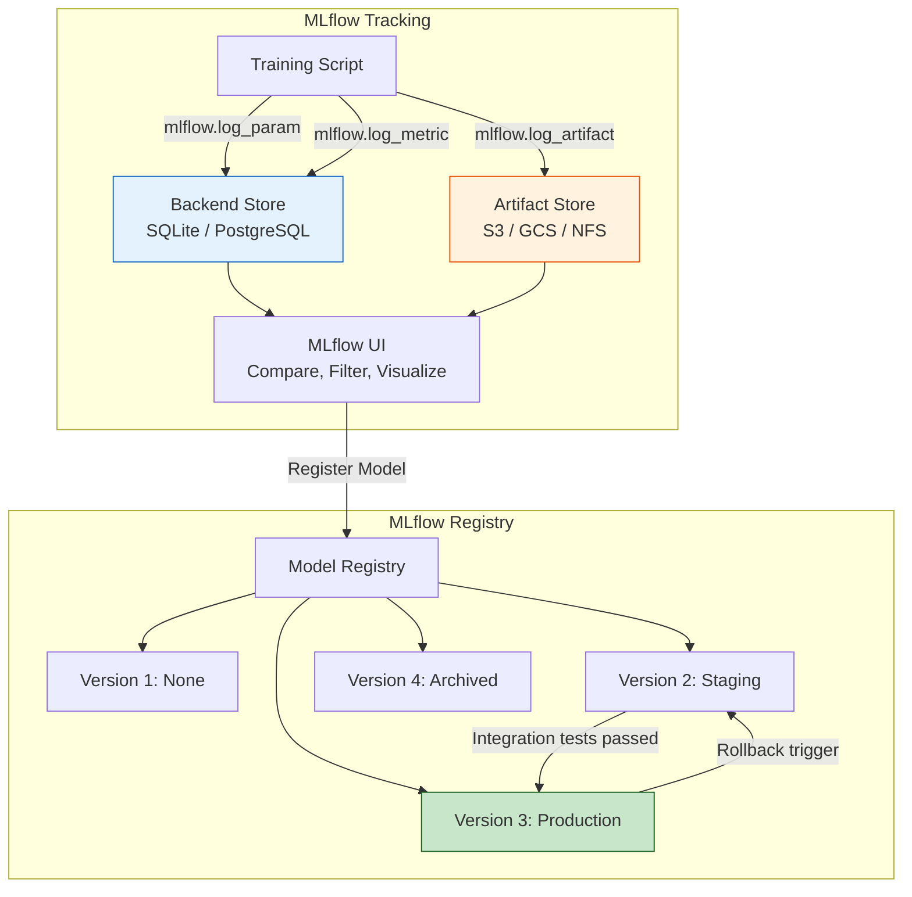

# 🧪 03 — Experiment Tracking with MLflow: Runs, Registry, and Model Promotion

## Introduction

A data scientist training models without experiment tracking is a chef cooking without writing down recipes. The best dish is unrepeatable. "I think the learning rate was 0.001... or was it 0.01? And I'm pretty sure I used 200 trees, not 100." MLflow eliminates this uncertainty by automatically recording every parameter, metric, artifact, and environment variable for every training run. It then provides a web UI for comparing runs, identifying the best hyperparameters, and promoting the winning model through a formal lifecycle: None → Staging → Production → Archived.

MLflow is a Linux Foundation project backed by Databricks and adopted by thousands of organizations. Its four components — Tracking, Registry, Projects, and Models — cover the full experiment-to-production workflow. This note focuses on Tracking and Registry because together they form the backbone of reproducible, auditable ML. Experiment tracking tells you **what happened**; the model registry ensures **what happens next** follows a controlled process.

When combined with DVC (Note 02), MLflow runs carry a reference to the exact dataset version used. The lineage is complete: Git commit → DVC dataset hash → MLflow run → model version → deployment → monitoring. Every prediction in production can be traced back to the training data that produced it.

---

## 1. MLflow Architecture



**Backend Store:** Stores lightweight metadata (params, metrics, tags, run info). Uses SQLAlchemy — works with SQLite (dev), PostgreSQL (prod), MySQL. This is where the MLflow UI queries to build comparison tables.

**Artifact Store:** Stores heavy artifacts (serialized models, plots, data snapshots). Supports S3, GCS, Azure Blob, NFS, or local filesystem. The registry's model versions link to artifact URIs.

**Separation matters:** The backend store handles high-throughput metadata queries (list all runs where `val_accuracy > 0.9`). The artifact store handles large file transfers (download 500MB model checkpoint). Using the same storage for both creates contention.

---

## 2. MLflow Tracking: Log Everything Automatically

### Manual Logging — Full Control

```python
import mlflow
import mlflow.sklearn
from sklearn.ensemble import GradientBoostingClassifier
from sklearn.metrics import accuracy_score, f1_score, roc_auc_score

mlflow.set_tracking_uri("http://mlflow-server:5000")
mlflow.set_experiment("customer_churn_v2")

with mlflow.start_run(run_name="gbm_baseline"):
    # Hyperparameters
    params = {"n_estimators": 150, "learning_rate": 0.05, "max_depth": 5}
    mlflow.log_params(params)

    # Tags for filtering later
    mlflow.set_tag("data_version", "v3")
    mlflow.set_tag("git_commit", "abc123def")
    mlflow.set_tag("author", "alicia")

    # Train
    model = GradientBoostingClassifier(**params, random_state=42)
    model.fit(X_train, y_train)

    # Log metrics
    preds = model.predict(X_val)
    probs = model.predict_proba(X_val)[:, 1]
    mlflow.log_metrics({
        "accuracy": accuracy_score(y_val, preds),
        "f1": f1_score(y_val, preds),
        "roc_auc": roc_auc_score(y_val, probs),
    })

    # Log model with signature and input example
    mlflow.sklearn.log_model(
        sk_model=model,
        artifact_path="model",
        registered_model_name="churn_predictor",
        signature=mlflow.models.infer_signature(X_val[:5], preds[:5]),
        input_example=X_val[:1],
    )

    # Log artifacts: plots, reports, anything
    mlflow.log_artifact("confusion_matrix.png")
    mlflow.log_artifact("feature_importance.csv")

print(f"Run ID: {mlflow.active_run().info.run_id}")
```

### Autologging — One Line, Everything Captured

```python
import mlflow

# ¡Sorpresa! One line captures everything: params, metrics, model, even conda env
mlflow.sklearn.autolog()

# That's it. Now train normally — MLflow intercepts everything.
from sklearn.ensemble import RandomForestClassifier
model = RandomForestClassifier(n_estimators=100).fit(X_train, y_train)

# Automatically logged:
#   - Parameters: n_estimators, max_depth, min_samples_split, all defaults
#   - Metrics: training score, training time
#   - Model: auto-serialized at end of training
#   - Environment: conda.yaml with exact package versions
```

⚠️ Autologging is powerful but can be too aggressive for production pipelines. It logs *every* parameter (including scikit-learn defaults like `min_impurity_decrease=0.0`) which clutters your parameter table. For production, prefer manual logging — you control what gets tracked.

💡 MLflow also supports `pytorch.autolog()`, `tensorflow.autolog()`, `xgboost.autolog()`, `lightgbm.autolog()`, `spark.autolog()` — the same one-line pattern across every major framework.

### The MLflow UI: Compare, Filter, and Select

```bash
# Start the UI (defaults to http://localhost:5000):
mlflow ui --backend-store-uri sqlite:///mlflow.db --port 5000
```

The UI provides:
- **Run table:** sortable by any metric, filterable by tags/params
- **Run comparison:** parallel coordinate plots for hyperparameter importance
- **Scatter plots:** any metric vs any parameter
- **Contour plots:** two-parameter interaction effects

The parallel coordinate plot is particularly useful: lines representing runs cross axes (one per hyperparameter), colored by a metric. If all top-performing runs cross through `learning_rate=0.01`, that parameter is critical. If top runs scatter across `n_estimators`, that parameter doesn't matter — remove it from your tuning grid.


*Source: MLflow documentation (mlflow.org). The MLflow Tracking UI showing run comparison, metric charts, and artifact browsing. Each row is a run; columns are configurable to show any combination of params, metrics, and tags.*

### MLflow Projects: Reproducible Run Packaging

Beyond tracking individual runs, MLflow Projects package code in a reusable, reproducible format. An MLflow Project is a directory with an `MLproject` YAML file that specifies the entry point, conda environment, and parameters:

```yaml
# MLproject
name: churn_predictor
conda_env: conda.yaml
entry_points:
  main:
    parameters:
      n_estimators: {type: int, default: 100}
      max_depth: {type: int, default: 8}
      data_path: {type: str}
    command: "python train.py --n-estimators {n_estimators} --max-depth {max_depth} --data-path {data_path}"
```

```bash
# Run a project from GitHub
mlflow run https://github.com/myteam/churn-mlproject \
  -P n_estimators=200 \
  -P data_path=s3://bucket/data.csv

# The run is automatically logged, environment is reproduced from conda.yaml
```

💡 MLflow Projects are the bridge between "it worked on my machine" and "it works on any machine with mlflow installed." Combined with DVC for data versioning, you get full reproducibility: code, environment, and data all pinned to exact versions.

---

## 3. MLflow Registry: Model Versions, Stages, and Promotion

The registry enforces a formal lifecycle for every model. No model goes directly from training to production.

### Model Stage Machine

```
[NONE] ──register──▶ [Staging] ──integration tests pass──▶ [Production]
                          ▲                                       │
                          │           [Archived] ◀────────────────┤
                          └── transition if tests fail            │
                                                                  │
              Rollback: Production ──▶ Archived, Staging ──▶ Production
```

```python
from mlflow.tracking import MlflowClient

client = MlflowClient()

# Register a model from a run
run_id = "abc123def456"
model_uri = f"runs:/{run_id}/model"
result = client.create_model_version(
    name="churn_predictor",
    source=model_uri,
    run_id=run_id,
    description="GBM baseline with SMOTE oversampling",
)

version = result.version  # e.g., 3

# Stage transitions (typically done via UI or CI/CD, not manual code)
client.transition_model_version_stage(
    name="churn_predictor",
    version=version,
    stage="Staging",
    archive_existing_versions=False,
)

# After integration tests pass:
client.transition_model_version_stage(
    name="churn_predictor",
    version=version,
    stage="Production",
    archive_existing_versions=True,  # 💡 Archive the old production model automatically
)

# Get the current production model
prod_model = client.get_latest_versions("churn_predictor", stages=["Production"])
print(f"Production version: {prod_model[0].version}, run: {prod_model[0].run_id}")

# Load the production model for serving
import mlflow.pyfunc
model = mlflow.pyfunc.load_model(f"models:/churn_predictor/Production")
predictions = model.predict(X_new)
```

¡Sorpresa! `models:/churn_predictor/Production` is a **logical URI** that always points to the current Production version. Your serving code never changes — the registry resolves to whatever model version carries the Production stage. Rollbacks are instant: transition the old version back to Production, and the serving URI picks it up without a code change.

### Stage Transition Webhooks

MLflow's registry emits webhooks on stage transitions. You can configure CI/CD (Jenkins, GitHub Actions) to run integration tests when a model enters Staging, or send Slack notifications when a model reaches Production:

```python
# Register a webhook to trigger integration tests on Staging transition
client.create_registered_model("churn_predictor")

import requests
# Webhook registration (conceptual — requires MLflow 2.8+ registry webhooks API)
# POST /api/2.0/mlflow/registry-webhooks/create
# {
#   "model_name": "churn_predictor",
#   "events": ["MODEL_VERSION_TRANSITIONED_TO_STAGING"],
#   "http_url_spec": {"url": "https://ci.example.com/mlflow-webhook"}
# }
```

---

## 4. MLflow + DVC Integration: Full Lineage

```python
import mlflow
import dvc.api
import git

# Capture full context: DVC dataset version + Git commit
repo = git.Repo(search_parent_directories=True)
git_commit = repo.head.object.hexsha

with dvc.api.open("data/processed/train.parquet", repo=".") as f:
    # DVC resolves the exact version from dvc.lock
    import pandas as pd
    df = pd.read_parquet(f)

with mlflow.start_run() as run:
    # Log the full lineage
    mlflow.set_tag("git_commit", git_commit)
    mlflow.set_tag("dvc_dataset", "data/processed/train.parquet")

    # Now every run links to:
    #   1. The exact Git commit (code version)
    #   2. The exact DVC dataset hash (data version)
    #   3. The exact MLflow run ID (experiment version)

    # ... training code ...

print(f"Full lineage: git={git_commit}, run={run.info.run_id}")
# 💡 When debugging a production issue 6 months later,
#   you can reconstruct the EXACT code + data + parameters that
#   produced the problematic prediction.
```

---

## 5. Antipatterns: model_final.pkl vs MLflow Registry

### ❌ Antipattern: Pickle File on a Shared Drive

```python
# ❌ Model management by filename convention
import pickle

# Train — no parameter logging
model = train_model()  # What params? Unknown.

# Save with "meaningful" filename
filename = "model_final_v3_production_USE_THIS_ONE.pkl"
pickle.dump(model, open(filename, "wb"))

# ⚠️ Three months later:
#   - Which dataset trained this? Unknown.
#   - What were the hyperparameters? Unknown.
#   - What was the validation accuracy? Unknown.
#   - Who promoted this to production? Unknown.
#   - Is "model_final_v4_NEW.pkl" newer? Nobody knows.

# "Deploy" by copying to server
# scp model_final_v3_production_USE_THIS_ONE.pkl prod-server:/models/

# ¡Sorpresa! When it breaks (and it will), there is no rollback mechanism.
#   You must SSH into the server, find a backup, and hope it works.
```

### ✅ Correct: MLflow Registry with Stage Enforcement

```python
# ✅ Every model version carries full lineage and a controlled lifecycle
import mlflow
import mlflow.sklearn
from mlflow.tracking import MlflowClient

client = MlflowClient()

# Train with full tracking (as shown in Section 2)
with mlflow.start_run(run_name="churn_gbm_v5") as run:
    mlflow.log_params({"n_estimators": 200, "max_depth": 6})
    # ... train ...
    mlflow.sklearn.log_model(
        model, "model",
        registered_model_name="churn_predictor",
    )

# Promotion workflow — NEVER go directly to Production
model_name = "churn_predictor"
latest = client.get_latest_versions(model_name, stages=["None"])[0]

# Step 1: Promote to Staging (triggers CI integration tests)
client.transition_model_version_stage(
    name=model_name, version=latest.version, stage="Staging"
)

# Step 2: After tests pass (CI/CD automated):
client.transition_model_version_stage(
    name=model_name, version=latest.version, stage="Production"
)

# Step 3: Load in production — URI never changes
production_model = mlflow.pyfunc.load_model(f"models:/{model_name}/Production")

# 💡 If rollback is needed: client.transition_model_version_stage(
#       name=model_name, version=PREVIOUS_VERSION, stage="Production")
#   The serving URI resolves instantly. No SSH. No file copying. No downtime.
```

⚠️ The ❌ approach works for a solo prototype but collapses under any of these conditions: team > 1 person, project duration > 2 weeks, regulatory audit required, or production SLO > 99%. These conditions describe every real ML system.

---

## 6. The Registry as Audit Trail

For regulated industries (finance, healthcare, insurance), the model registry is not optional — it is a compliance requirement. Regulators ask:

- "Show me the exact version of every model deployed to production in Q1 2024."
- "Prove that model v3 was approved by the required two reviewers before deployment."
- "Reconstruct the exact training pipeline for the model that made decision #48291 on January 15th."

The MLflow Registry answers all three:

```python
# Audit query: who promoted which model when?
import mlflow
from mlflow.tracking import MlflowClient
client = MlflowClient()

for model_name in client.search_registered_models():
    for v in client.search_model_versions(f"name='{model_name}'"):
        print(f"{v.name} v{v.version} | Stage: {v.current_stage} | "
              f"Run: {v.run_id} | Created: {v.creation_timestamp} | "
              f"User: {v.user_id if hasattr(v, 'user_id') else 'N/A'}")
```

The registry maintains immutable version history. Even after archiving, old model versions are never deleted — they accumulate metadata (who transitioned them, when, using which run). This is not overhead; it is the foundation of responsible ML engineering.

---

## 7. Caso Real: Databricks' Internal MLflow Deployment

Databricks, the company behind MLflow, runs one of the world's largest MLflow deployments to manage their own ML models. Their instance serves 10,000+ registered models across product teams (SQL AI, Unity Catalog intelligence, Lakehouse optimization).

**Pre-MLflow:** Each Databricks team managed models independently — some with ad-hoc S3 paths, some with custom databases, some with shared folders. Cross-team model discovery was impossible. A model used by the SQL optimizer team might be a duplicate of a model trained by the query analysis team. Audit compliance was manual and error-prone.

**With MLflow Registry:** All models live in a single registry with enforced promotion gates. The Staging → Production transition triggers a mandatory approval workflow: the model author submits a transition request, a second ML engineer reviews the metrics and schema, and only then does the model enter Production. Every transition is logged, creating a permanent audit trail for SOC 2 and ISO 27001 compliance.

**Key result:** Model deployment time dropped from weeks to hours. The registry's standardized API eliminated duplicate infrastructure. When a model degrades in production, the operations team can identify the responsible team and training run in under 5 minutes — previously this took days of email chains.

---

## 8. Código de Compresión — MLflow Tracking + Registry Promotion

```python
"""
MLflow Production Micro-Framework
Tracking + Registry promotion + Serving URI resolution in <30 lines.
"""
import mlflow
import mlflow.sklearn
from mlflow.tracking import MlflowClient


class MLflowPipeline:
    def __init__(self, tracking_uri: str, experiment: str):
        mlflow.set_tracking_uri(tracking_uri)
        mlflow.set_experiment(experiment)
        self.client = MlflowClient()

    def log_run(self, model, params: dict, metrics: dict,
                X_sample, model_name: str, run_name: str = None) -> str:
        with mlflow.start_run(run_name=run_name) as run:
            mlflow.log_params(params)
            mlflow.log_metrics(metrics)
            mlflow.sklearn.log_model(
                model, "model",
                registered_model_name=model_name,
                input_example=X_sample[:1],
            )
            return run.info.run_id

    def promote(self, model_name: str, version: int,
                to_stage: str = "Production"):
        self.client.transition_model_version_stage(
            name=model_name, version=version, stage=to_stage,
            archive_existing_versions=(to_stage == "Production"),
        )

    @staticmethod
    def load(model_name: str, stage: str = "Production"):
        return mlflow.pyfunc.load_model(f"models:/{model_name}/{stage}")

# Usage
# pipe = MLflowPipeline("http://mlflow:5000", "churn_experiment")
# run_id = pipe.log_run(model, params, metrics, X_val, "churn_model")
# pipe.promote("churn_model", version=1, to_stage="Production")
# prod_model = MLflowPipeline.load("churn_model")  # Always the latest Production
```

---

**Internal Links:** [[02 - Data Versioning with DVC - Pipelines, Remote Storage and CML|← DVC Data Versioning]], [[../18 - Experiment Tracking y Model Registry/01 - MLflow y Tracking de Experimentos|MLflow Tracking (09/18)]], [[../24 - Weights and Biases/00 - Welcome to Weights and Biases|W&B Alternative (09/24)]], [[../27 - Feast and Feature Stores/00 - Welcome to Feast and Feature Stores for MLOps|Feast (09/27)]], [[04 - Feature Stores and Training-Serving Skew Prevention|→ Next: Feature Stores]]
