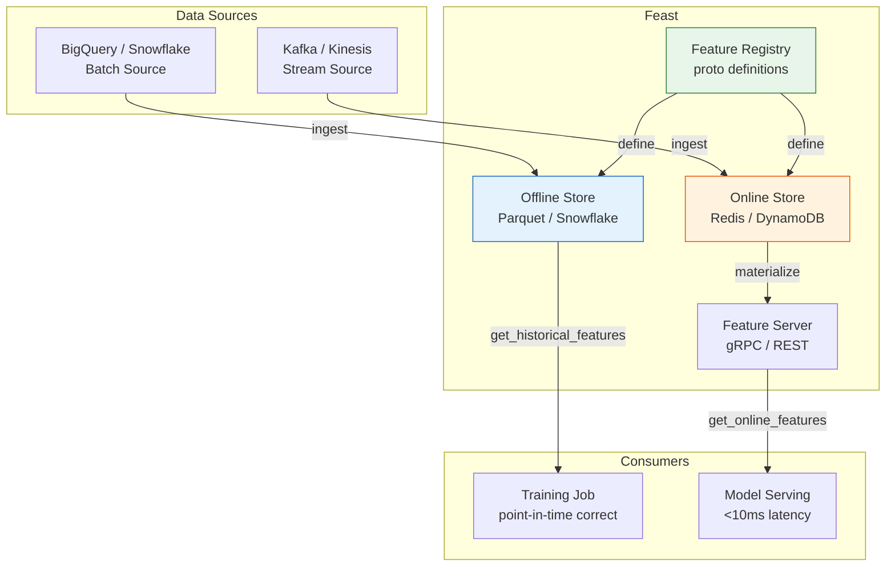

# 🏛️ 04 — Feature Stores and Training-Serving Skew Prevention

## Introduction

There is a silent killer in production ML that leaves no stack trace and triggers no alert. A model trained with 0.92 AUC degrades to 0.71 in production — not because the data drifted, but because the features themselves were computed differently during training and serving. This is **training-serving skew**, and it is the #1 root cause of production ML failures that escape offline evaluation. The model thinks `age > 18` means `is_adult = True`. At serving time, `age` is computed as `current_date - birth_date` which yields `17.8 years` for a user one month shy of 18 — `is_adult = False`. The model was never wrong; the **feature computation was inconsistent**.

Feature stores solve this by providing a single source of truth for feature definitions. Write the feature computation once, in one place, and retrieve it consistently during batch training (from the offline store) and real-time serving (from the online store). Feast (Feature Store) is the open-source implementation that generalizes lessons from Uber Michelangelo, Airbnb Zipline, and Google TFX.

This note focuses on Feast because it is the most widely adopted open-source feature store and the one you are most likely to encounter in production. The concepts — entities, feature views, point-in-time joins, online/offline retrieval — generalize to commercial alternatives like Tecton and Hopsworks.

---

## 1. The Training-Serving Skew Problem: Formal Definition

Let $f_{\text{train}}(x, t)$ be the feature vector computed at training time $t$ for entity $x$, and $f_{\text{serve}}(x, t')$ be the feature vector computed at serving time $t'$. Training-serving skew exists when:

$$
P(f_{\text{train}}(x, t)) \neq P(f_{\text{serve}}(x, t'))
$$

Even when the underlying feature definition is identical, three mechanisms cause divergence:

1. **Temporal misalignment:** Training uses a batch window `[t-30d, t]`; serving uses the current instant. If the feature is "average order value over the last 7 days," the training value is averaged over a 7-day window, while the serving value is averaged over the *same* window but computed from a streaming system with different late-arrival handling.

2. **Point-in-time leakage:** Training data is constructed by JOINing tables without timestamp filtering. A feature like `total_orders` computed as of *today* is used to predict churn that occurred *last month*. The model learns that high order counts predict retention — because it sees future data. This is not a model flaw; it is a data engineering correctness error that produces inflated offline metrics and disastrous online performance.

3. **Infrastructure divergence:** Training computes features in Spark over Parquet; serving retrieves them from a Redis cache populated by a different Flink job running different aggregation logic. Even with identical intent, floating-point differences, timezone handling, and NULL semantics create measurable skew.

The Jensen-Shannon divergence (JS) is the standard metric for quantifying drift:

$$
\text{JS}(P \parallel Q) = \sqrt{\frac{1}{2} D_{KL}(P \parallel M) + \frac{1}{2} D_{KL}(Q \parallel M)}
$$

where $M = \frac{1}{2}(P + Q)$ and $D_{KL}$ is the Kullback-Leibler divergence. JS is bounded in $[0, 1]$ and symmetric — unlike KL divergence, which is unbounded and asymmetric. This makes JS suitable for automated alerting: thresholds are interpretable across features.

```python
from scipy.spatial.distance import jensenshannon
import numpy as np

def js_drift(train_vals, serve_vals, bins=50, threshold=0.1):
    """Returns JS divergence and drift boolean for a feature."""
    t_hist, edges = np.histogram(train_vals, bins=bins, density=True)
    s_hist, _ = np.histogram(serve_vals, bins=edges, density=True)
    js = jensenshannon(t_hist + 1e-10, s_hist + 1e-10)
    return float(js), js > threshold
```

---

## 2. Feast Architecture: Offline, Online, Registro



**Offline Store:** High-capacity, high-throughput storage for historical features. Used for generating training datasets with point-in-time correct joins. Backed by Parquet files, Snowflake, BigQuery, or Redshift.

**Online Store:** Low-latency key-value store for real-time feature serving. Backed by Redis or DynamoDB. `get_online_features(entity_id)` returns in <10ms.

**Feature Registry:** Centralized catalog of feature definitions, entities, data sources, and feature views. Written as Python/PROTO files and versioned with Git. This is the source of truth that ensures training and serving compute features identically.

**Feature Server:** gRPC/REST service that wraps the online store, handling entity lookups and feature assembly. Optional — the Python SDK can query online stores directly.

---

## 3. Feast Core Concepts: Entity, Feature View, Point-in-Time Join

### Entity

The business object that features describe. Every feature is associated with exactly one entity.

```python
from feast import Entity, ValueType

driver = Entity(
    name="driver_id",
    value_type=ValueType.INT64,
    description="Unique driver identifier",
    join_keys=["driver_id"],
)
```

### Feature View

A feature view binds an entity, a data source, and a set of features. It is the central abstraction: "features A, B, C for entity X sourced from table Y."

```python
from feast import FeatureView, Feature, Field
from feast.types import Float32, Int64
from feast.data_source import BigQuerySource

driver_stats_source = BigQuerySource(
    table_ref="my_project.driver_data.driver_stats",
    event_timestamp_column="event_timestamp",
)

driver_stats_fv = FeatureView(
    name="driver_statistics",
    entities=[driver],
    ttl=timedelta(days=7),
    schema=[
        Field(name="total_trips", dtype=Int64),
        Field(name="avg_rating", dtype=Float32),
        Field(name="total_earnings", dtype=Float32),
        Field(name="acceptance_rate", dtype=Float32),
    ],
    source=driver_stats_source,
    online=True,  # 💡 Materialize this feature view to the online store
)
```

### Point-in-Time Correct Joins

This is Feast's killer feature. When you request historical features, you pass a DataFrame of entity IDs and timestamps. Feast joins the feature data **as it existed at each timestamp**, not as it exists now.

```python
from feast import FeatureStore

store = FeatureStore(repo_path="./feature_repo")

# Training data request: "for each driver at each trip timestamp,
# what were their stats AT THAT MOMENT?"
entity_df = pd.DataFrame({
    "driver_id": [1001, 1001, 1002],
    "event_timestamp": [
        datetime(2024, 1, 15, 10, 30),
        datetime(2024, 2, 20, 14, 15),
        datetime(2024, 3, 10, 9, 0),
    ],
})

training_data = store.get_historical_features(
    entity_df=entity_df,
    features=[
        "driver_statistics:total_trips",
        "driver_statistics:avg_rating",
        "driver_statistics:acceptance_rate",
    ],
).to_df()

# ¡Sorpresa! For driver 1001 on Jan 15, Feast retrieves total_trips
#   as of Jan 15 — not today's value. For Feb 20, it retrieves the
#   Feb 20 value. This is mathematically impossible with naive SQL JOINs.
```

⚠️ The "easy" way to build training data — a SQL query that JOINs 5 tables without timestamp filtering — produces point-in-time leakage. The model sees `total_trips` as of *today* and learns that high trip counts predict low churn. But at serving time, `total_trips` for a new driver is 0. The model's accuracy collapses. Feast's point-in-time joins eliminate this class of error **at the infrastructure level**. You cannot accidentally leak future data because Feast enforces `event_timestamp_column` constraints on every retrieval.

---

## 4. Online Serving: Real-Time Feature Retrieval

```python
from feast import FeatureStore

store = FeatureStore(repo_path="./feature_repo")

# Materialize latest features to the online store
store.materialize(
    start_date=datetime(2024, 1, 1),
    end_date=datetime.now(),
)

# Online retrieval: get features for specific entities
online_features = store.get_online_features(
    features=[
        "driver_statistics:total_trips",
        "driver_statistics:avg_rating",
        "driver_statistics:acceptance_rate",
    ],
    entity_rows=[
        {"driver_id": 1001},
        {"driver_id": 1002},
        {"driver_id": 1003},
    ],
).to_dict()

# online_features == {
#     "driver_id": [1001, 1002, 1003],
#     "total_trips": [847, 1203, 12],
#     "avg_rating": [4.87, 4.52, 3.1],
#     "acceptance_rate": [0.94, 0.88, 0.45],
# }

# 💡 This is what your serving endpoint calls on every prediction request.
#   Latency with Redis backend: <10ms p99 for ~10 features per entity.
```

The materialization process (`store.materialize()`) reads from the offline store and writes the latest feature values to the online store (Redis). This is typically scheduled as a periodic batch job (e.g., every 10 minutes via Airflow/Prefect). For features that must be real-time (e.g., "last 5 minutes of clickstream events"), Feast supports streaming ingestion from Kafka/Kinesis through a push API.

---

## 5. Feature Validation: Gate Before the Online Store

Features entering the online store must be validated. A null rate spike or range violation in the online store poisons every prediction that reads it. Feast supports on-demand feature validation:

```python
# feast feature_repo/feature_repo.py
from feast import FeatureView, Feature
from feast.on_demand_feature_view import on_demand_feature_view
import pandas as pd

@on_demand_feature_view(
    sources=[driver_stats_fv],
    schema=[
        Field(name="risk_score", dtype=Float32),
    ],
)
def compute_risk_score(inputs: pd.DataFrame) -> pd.DataFrame:
    df = pd.DataFrame()
    # Validate before computation
    assert inputs["acceptance_rate"].between(0, 1).all(), "Rate out of [0,1]"
    assert inputs["avg_rating"].notna().all(), "Null rating detected"
    df["risk_score"] = (
        (1 - inputs["acceptance_rate"]) * 0.6 +
        (5 - inputs["avg_rating"]) / 5 * 0.4
    )
    return df

# 💡 On-demand feature views are computed at retrieval time.
#   They never store to the online store — they are pure functions
#   over stored features. Use them for derived features that depend
#   on multiple base features.
```

---

## 6. Antipatterns: Hybrid Feature Computation vs Feast

### ❌ Antipattern: Training and Serving Use Different Feature Sources

```python
# ❌ TRAINING: Batch SQL query in Snowflake
# Run weekly, produces a CSV
training_query = """
SELECT
    u.user_id,
    u.age,
    COUNT(o.order_id) AS total_orders,       -- as of TODAY
    AVG(o.order_value) AS avg_order_value,    -- as of TODAY
    MAX(o.order_date) AS last_order_date
FROM users u
LEFT JOIN orders o ON u.user_id = o.user_id   -- No timestamp filter!
GROUP BY u.user_id, u.age
"""

# ❌ SERVING: Different microservice, different logic
def get_features_serving(user_id):
    # Calls a REST API built by a different team
    resp = requests.get(f"http://user-service/features/{user_id}").json()
    # ¡Sorpresa! user-service computes "age" as current_date - birth_date
    # while the training query used age from a snapshot that's 3 weeks old.
    # Also total_orders here includes orders placed AFTER the training cutoff.
    features = {
        "age": resp["age"],                    # Different computation!
        "total_orders": resp["total_orders"],  # Different time semantics!
        "avg_order_value": resp["avg_order"],  # Even the field name differs!
    }
    return features

# ⚠️ Result: Offline AUC = 0.91. Online AUC (measured after 2 weeks) = 0.68.
#   The model was trained on future-leaked, stale features.
#   Every prediction in production is silently wrong.
```

### ✅ Correct: Feast with Single Feature Definition

```python
# ✅ Feast feature definition — ONE source of truth for both paths
from feast import Entity, FeatureView, Field, FeatureStore
from feast.types import Float32, Int64
from feast.data_source import BigQuerySource
from datetime import timedelta

# Entity
user = Entity(name="user_id", value_type=ValueType.INT64)

# Data source with event timestamp — MANDATORY for point-in-time joins
orders_source = BigQuerySource(
    table_ref="production.user_orders",
    event_timestamp_column="order_timestamp",  # 💡 This enables point-in-time correctness
)

# Feature view — single definition used by both training AND serving
user_features = FeatureView(
    name="user_order_features",
    entities=[user],
    ttl=timedelta(days=30),
    schema=[
        Field(name="total_orders_30d", dtype=Int64),
        Field(name="avg_order_value_30d", dtype=Float32),
        Field(name="days_since_last_order", dtype=Int64),
        Field(name="age_at_prediction_time", dtype=Float32),
    ],
    source=orders_source,
    online=True,  # Materialize to online store for serving
)

store = FeatureStore(repo_path=".")

# TRAINING: Point-in-time correct retrieval
training_df = store.get_historical_features(
    entity_df=entity_timestamps,  # DataFrame with user_id + event_timestamp
    features=[
        "user_order_features:total_orders_30d",
        "user_order_features:avg_order_value_30d",
        "user_order_features:age_at_prediction_time",
    ],
).to_df()

# SERVING: Same features, online store, <10ms latency
online_features = store.get_online_features(
    features=[
        "user_order_features:total_orders_30d",
        "user_order_features:avg_order_value_30d",
        "user_order_features:age_at_prediction_time",
    ],
    entity_rows=[{"user_id": 42}],
).to_dict()

# 💡 Both paths retrieve features defined ONCE, computed from the SAME
#   source table, with the SAME logic. Zero skew by construction.
```

⚠️ The ❌ approach is the default in most organizations that haven't adopted feature stores. It works for months — offline metrics look great — until someone notices that the production model's predictions don't match expectations. By then, thousands of bad predictions have been made. The ✅ approach eliminates the root cause: dual feature computation paths.

---

## 7. Caso Real: Uber Michelangelo — Billions of Features Daily

Uber's Michelangelo platform is the canonical large-scale feature store deployment. It serves features for 1,000+ models across Uber's business lines: ETA prediction, surge pricing, driver-rider matching, Uber Eats restaurant ranking, and fraud detection.

**Before Michelangelo (2015):** Each team built their own feature pipeline. The ETA team had one `total_trips` computation in Spark; the surge pricing team had a different `total_trips` in a Python service; the fraud team had yet another one in Flink. Three different values for "total trips per driver" existed simultaneously, producing inconsistent model behavior across products. When the definition of "completed trip" changed (excluding cancelled rides), updating all three pipelines took weeks and frequently missed one.

**Michelangelo's solution:** Features are defined once in a centralized registry, using a domain-specific language. The platform automatically materializes features to the offline store (Hive) and online store (Cassandra). The point-in-time join system ensures training datasets never leak future information. By 2019, Michelangelo was serving **billions of feature retrievals per day** with p99 latency under 10ms.

**Key lesson:** A feature store is not a "nice-to-have optimization" — it is a correctness guarantee. At Uber's scale, a 1% skew in ETA predictions translates to millions of dollars in customer compensation and lost rides. The feature store's rigid consistency eliminates the entire class of skew-related production incidents.


*Source: Feast documentation (docs.feast.dev). The Feast architecture separates offline batch retrieval (for training) from online low-latency retrieval (for serving), united by a single registry that guarantees feature definitions are identical across both paths.*

### Monitoring Feature Distributions in Production

Even with a feature store eliminating training-serving skew, feature distributions still drift over time. A monitoring layer must validate features before they reach the model:

```python
import numpy as np
from scipy.spatial.distance import jensenshannon
from dataclasses import dataclass
from typing import Dict, List, Optional


@dataclass
class DriftReport:
    feature: str
    js_divergence: float
    is_drifted: bool
    threshold: float

class FeatureMonitor:
    def __init__(self, reference_histograms: Dict[str, np.ndarray],
                 thresholds: Dict[str, float]):
        self.reference = reference_histograms
        self.thresholds = thresholds

    def check(self, feature_name: str, values: np.ndarray,
              bins: int = 50) -> DriftReport:
        ref_hist = self.reference[feature_name]
        cur_hist, _ = np.histogram(values, bins=bins, density=True)
        cur_hist = cur_hist / cur_hist.sum()  # Normalize
        js = jensenshannon(ref_hist + 1e-10, cur_hist + 1e-10)
        threshold = self.thresholds.get(feature_name, 0.1)
        return DriftReport(feature_name, float(js), js > threshold, threshold)

    def check_all(self, features: Dict[str, np.ndarray]) -> List[DriftReport]:
        return [self.check(name, vals) for name, vals in features.items()]

# Usage: run before materializing features to the online store
# monitor = FeatureMonitor(reference_hists, {"total_orders_30d": 0.15})
# reports = monitor.check_all({"total_orders_30d": prod_values})
# for r in reports:
#     if r.is_drifted:
#         alert(f"Drift on {r.feature}: JS={r.js_divergence:.3f}")
```

⚠️ Feature monitoring must run **before** materialization, not after. If drifted features enter the online store, every downstream prediction is poisoned. The monitoring check is a gate: if drift exceeds the threshold, block the materialization and alert the on-call engineer. The stale (but correct) features remain available while the issue is investigated.

---

## 8. Código de Compresión — Feast Feature Definition + Online Retrieval + Point-in-Time Join

```python
"""
Feast Feature Store Micro-Framework
Entity + FeatureView + Online retrieval + Point-in-time join in <30 lines.
"""
from feast import Entity, FeatureView, Field, FeatureStore
from feast.types import Float32, Int64
from feast.data_source import FileSource, ParquetFormat
from datetime import timedelta, datetime
import pandas as pd


class FeastStore:
    def __init__(self, repo_path: str):
        self.store = FeatureStore(repo_path=repo_path)

    def define_entity(self, name: str, dtype=ValueType.INT64) -> Entity:
        return Entity(name=name, value_type=dtype, join_keys=[name])

    def feature_view(self, name: str, entity: Entity, source_path: str,
                     schema: list[Field], ttl_days: int = 7) -> FeatureView:
        source = FileSource(path=source_path, event_timestamp_column="ts")
        return FeatureView(name=name, entities=[entity], ttl=timedelta(days=ttl_days),
                          schema=schema, source=source, online=True)

    def train_features(self, features: list[str], entity_df: pd.DataFrame):
        return self.store.get_historical_features(entity_df=entity_df, features=features).to_df()

    def serve_features(self, features: list[str], entities: list[dict]):
        return self.store.get_online_features(features=features, entity_rows=entities).to_dict()

    def materialize(self, start: datetime, end: datetime):
        self.store.materialize(start_date=start, end_date=end)

# Usage
# fs = FeastStore("./feature_repo")
# driver = fs.define_entity("driver_id")
# fv = fs.feature_view("driver_stats", driver, "data/drivers.parquet",
#                       [Field(name="trips", dtype=Int64), Field(name="rating", dtype=Float32)])
# fs.materialize(datetime(2024,1,1), datetime.now())
# features = fs.serve_features(["driver_stats:trips"], [{"driver_id": 1001}])
```

---

**Internal Links:** [[03 - Experiment Tracking with MLflow - Runs, Registry and Model Promotion|← MLflow Registry]], [[../19 - Feature Engineering y Feature Stores/02 - Feature Stores (Feast, Tecton)|Feature Stores (09/19)]], [[../27 - Feast and Feature Stores/01 - Feature Store Theory and Architecture|Feast Theory (09/27)]], [[../21 - Monitoreo y Mantenimiento/01 - Data Drift y Concept Drift|Drift Detection (09/21)]], [[00 - Welcome to End-to-End ML Project|← Course Overview]]
