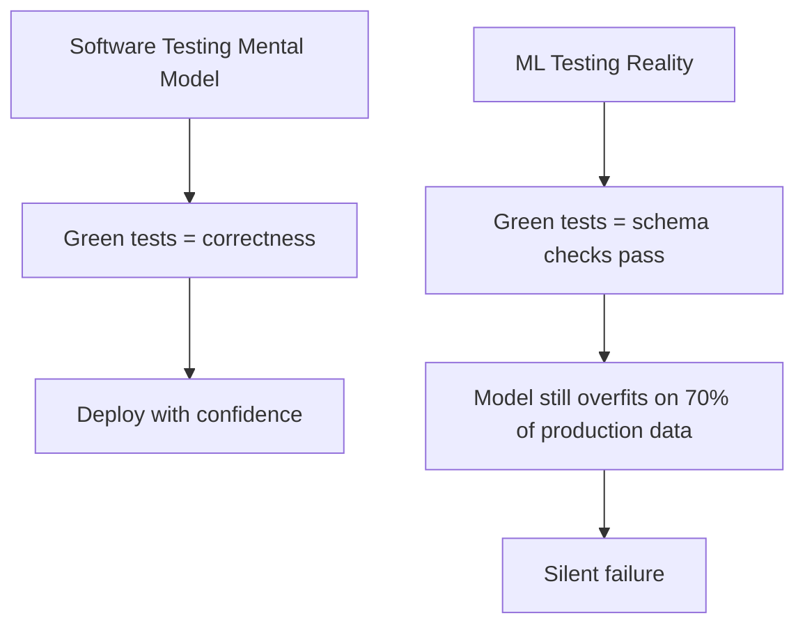
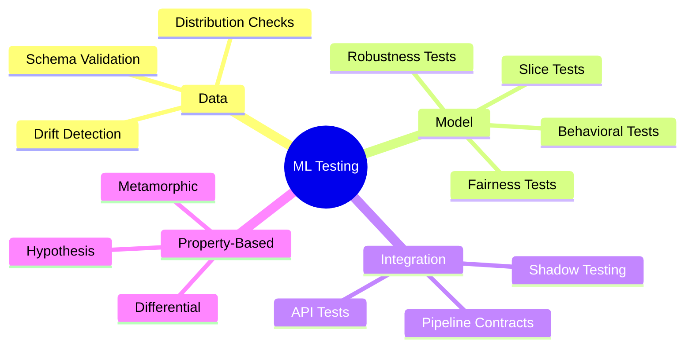

# 🧪 00 — Welcome to Testing in ML Systems

Testing in ML is **not** software testing. A green pipeline does NOT mean a good model. Your unit tests can pass with 100% coverage while your model silently hallucinates predictions it has never seen in its training distribution. The vocabulary is the same — `assert`, `test`, `coverage` — but the semantics are fundamentally different.

---

## The Mistake Everyone Makes

You write `assert accuracy_score(y, preds) > 0.95`. The test passes. Three months later, the fraud detection pipeline has deteriorated to 0.83 recall, nobody noticed, and the finance team is manually reviewing twice as many transactions. This is NOT a bug — it is a category error. Software tests verify implementations. ML tests verify the existence and shape of data, statistical properties of model predictions, and behavioral invariants that hold (or fail) probabilistically.

---

## What This Course Covers

| Layer | Focus | Tools Introduced |
|-------|-------|------------------|
| **Data Layer** | Schemas, distributions, constraints, anomalies | Great Expectations, Pandera, TFDV |
| **Model Layer** | Behavioral invariants, fairness, robustness, slice quality | CheckList, Fairlearn, Hypothesis |
| **Integration Layer** | End-to-end pipeline contracts, shadow deploys | pytest + requests, Istio, Envoy |
| **Property Layer** | Generative testing, metamorphic relations, shrinking | Hypothesis, differential testing |

---

## Why Traditional Coverage Means Nothing

In software engineering, $C = \frac{\text{lines executed}}{\text{lines total}} \times 100$ captures a meaningful proxy. In ML, a line of code that runs a transformer block executes on every single test input. You have 100% line coverage. But your model has never seen a customer with negative income because the data engineering team introduced a bug in the feature store. The test suite is green. The system is broken.

What you actually need is **scenario coverage**:

$$S = \frac{\text{data scenarios tested}}{\text{data scenarios expected}} \times 100$$

Where scenarios include: null values, out-of-range numeric values, schema changes, drift between training and serving distributions, subgroup fairness, adversarial perturbations, edge-of-distribution performance.

---

## Course Map

1. [[01 - Data Validation — Great Expectations, Pandera and TFX Data Validation|📊 Data Validation]] — Validate the raw material before your model touches it.
2. [[02 - Model Testing — Behavioral, Fairness, Robustness and Slice-Based Evaluation|🧠 Model Testing]] — Beyond accuracy: test invariants, fairness, and worst-case behavior.
3. [[03 - Property-Based Testing — Hypothesis, Metamorphic and Differential Testing|🎲 Property-Based Testing]] — Generate thousands of inputs to find what manual tests never will.
4. This page — Orientation and framework.

---

## Prerequisites

- **pytest**: You should be comfortable with `@pytest.fixture`, `conftest.py`, and `@pytest.mark.parametrize`.
- **Python**: NumPy, pandas, scikit-learn familiarity.
- **Basic ML training loop**: You've trained at least one model end-to-end.
- **Command line**: `pip install`, virtual environments.

---

## Interconnections

| Prerequisite Concepts | Where Used |
|-----------------------|------------|
| Feast feature stores | Referenced in data validation (offline/online parity checks) |
| CI/CD for ML ([[../09 - MLOps y Produccion/29 - CI-CD for ML/]]) | Tests run in CI; model deployment gates |
| Monitoring and drift ([[../09 - MLOps y Produccion/31 - Evidently for Model Monitoring/]]) | Data validation is the first line of drift defense |
| End-to-End ML pipelines ([[../09 - MLOps y Produccion/22 - End-to-End ML Pipeline/]]) | Testing integrates at every pipeline stage |

---

💡 **Tip:** Before you write a single test, enumerate every way your data or model COULD fail in production. That list is your test plan. The tools in this course only matter insofar as they implement that plan.

⚠️ **Advertencia:** Do not confuse data validation tests with model evaluation. A data validation test passes if the schema is correct and values are in range. A model evaluation measures accuracy, F1, etc. Both are testing, but they test different things. Conflating them is the fastest path to a green pipeline over a broken model.
