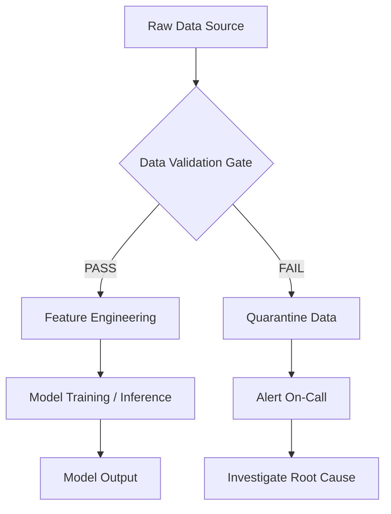
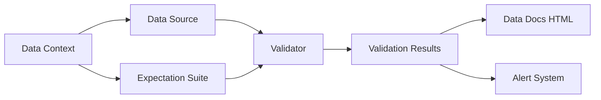
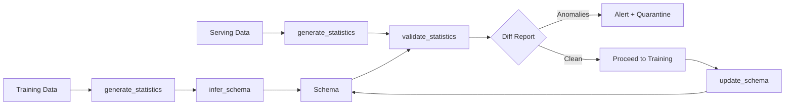
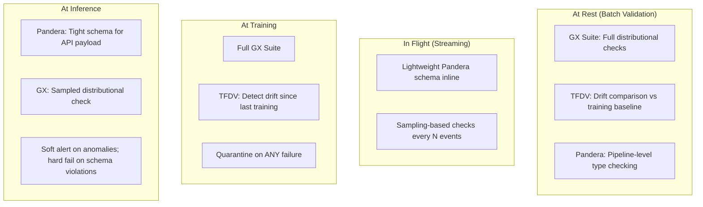

# 📊 01 — Data Validation: Great Expectations, Pandera, and TFX Data Validation

The most volatile component in any ML system is not the model architecture, not the hyperparameters, not even the code. It is **the data**. Your model code sits unchanged in a Git repository for six months. Your data changes every hour — new columns appear, old columns disappear in upstream feeds, distributions drift, nulls creep in, the category "US" becomes "United States" because a new data engineer normalized a lookup table upstream.


Data validation is the first and most critical testing layer. If garbage enters, garbage leaves — but worse, the garbage is often *silent* because the model still produces a number, and that number still passes your model evaluation tests. The damage is invisible.

---

## 1. The Data Validation Philosophy



Data validation is a **contract** between the data producer and the data consumer (your model). The contract says: "I, the data, promise that column `age` will be between 0 and 120, that `country` will be one of 195 ISO codes, and that fewer than 5% of rows will have null values." If the contract is violated, the data is quarantined. The model never sees it.

### ❌ Naive Approach

```python
import pandas as pd

df = pd.read_csv("data.csv")
assert df.shape[0] > 0              # Hope it's not empty
assert df["age"].notna().any()       # Hope SOME ages are non-null
# ... nothing about distribution, range, categories, correlations
model.fit(df.drop("target", axis=1), df["target"])
```

This passes 100% of the time until the upstream scraper adds a `null` column, renames `age` to `user_age`, and triples the row count with duplicates. Your model trains, `assert df.shape[0] > 0` passes, and you ship a corrupted model.

### ✅ Professional Approach

```python
import pandera as pa
from pandera.typing import DataFrame, Series
import great_expectations as gx

class ChurnInputSchema(pa.DataFrameModel):
    customer_id: Series[str] = pa.Field(nullable=False, str_length=36)
    tenure_days: Series[int] = pa.Field(ge=0, le=7300)
    monthly_charges: Series[float] = pa.Field(ge=0, le=10000)
    contract_type: Series[str] = pa.Field(isin=["Month-to-month", "One year", "Two year"])
    churn: Series[bool] = pa.Field()

    @pa.check("monthly_charges", name="no_fractional_cents")
    def monthly_charges_two_decimals(cls, series):
        return (series * 100 % 1 == 0).all()

validated_df = ChurnInputSchema.validate(df)
# Raises SchemaError with human-readable message if validation fails
```

This catches: null values, out-of-range tenure, impossible charges, unknown contract types, and wonky decimal precision — all before training touches a single row.

---

## 2. Great Expectations: Expectations as Code

Great Expectations (GX) is the most mature open-source data validation framework. Its central metaphor: an **Expectation** is a verifiable property of your data.

### Architecture



- **Data Context**: The runtime configuration. Points to data sources, stores expectation suites and validation results.
- **Data Source**: Connection to your data (pandas DataFrame, Spark, SQL database, S3 bucket).
- **Expectation Suite**: A collection of expectations. Stored as JSON — human-readable and version-controllable.
- **Validator**: Runs expectations against a batch of data and produces results.
- **Data Docs**: Auto-generated static HTML dashboards showing every validation result, with failed expectations highlighted in red.

### Core Expectations

```python
import great_expectations as gx

# Obtain or create a Data Context
context = gx.get_context()

# Connect to a data source
validator = context.sources.pandas_default.read_csv("churn_data.csv")

# Column existence and types
validator.expect_column_to_exist("customer_id")
validator.expect_column_values_to_be_of_type("customer_id", "str")
validator.expect_column_values_to_match_regex("customer_id", r"^[A-Z]{3}-\d{8}$")

# Nullability and uniqueness
validator.expect_column_values_to_not_be_null("tenure_days")
validator.expect_column_values_to_be_unique("customer_id")

# Range constraints
validator.expect_column_values_to_be_between("tenure_days", min_value=0, max_value=7300)
validator.expect_column_mean_to_be_between("monthly_charges", min_value=30, max_value=200)

# Categorical constraints
validator.expect_column_distinct_values_to_be_in_set(
    "contract_type",
    value_set=["Month-to-month", "One year", "Two year"]
)
validator.expect_column_unique_value_count_to_be_between("contract_type", min_value=1, max_value=3)

# Distributional constraints
validator.expect_column_quantile_values_to_be_between("tenure_days", quantiles=[0.05, 0.50, 0.95],
    value_ranges={
        "q0.05": [1, 30],
        "q0.50": [90, 500],
        "q0.95": [700, 3000]
    }
)

# Multi-column relations
validator.expect_column_pair_values_A_to_be_greater_than_B("monthly_charges", "total_charges")
validator.expect_multicolumn_sum_to_equal("monthly_charges", "tax", "total_charges")

# Aggregate expectations
validator.expect_table_row_count_to_be_between(min_value=1000, max_value=500000)
validator.expect_table_column_count_to_be_between(min_value=5, max_value=20)
validator.expect_table_columns_to_match_ordered_list([
    "customer_id", "tenure_days", "monthly_charges", "contract_type", "churn"
])

# Save the suite
validator.save_expectation_suite(discard_failed_expectations=False)
```

### Running Validations in Production

```python
validator = context.get_validator(
    batch_request=batch_request,
    expectation_suite_name="churn_data_suite"
)
results = validator.validate()

if not results["success"]:
    # Send alert, quarantine data, halt pipeline
    send_slack_alert(results["results"])
    raise DataValidationError(results)

# Store results as static HTML for auditing
context.build_data_docs()
```

### Data Docs: The Hidden Superpower

¡Sorpresa! GX Data Docs are **static HTML files** — a single folder of `.html` files. You can serve them from an S3 bucket with zero infrastructure. Host `s3://your-bucket/data-docs/` behind a CloudFront distribution and your entire team gets a live data quality dashboard. No server, no database, no authentication layer required (just S3 bucket policies + CloudFront OAI).

```mermaid
graph TD
    A[Daily Pipeline Run] --> B[GX Validator]
    B --> C[build_data_docs()]
    C --> D[s3 sync ./data_docs s3://quality-dash/]
    D --> E[CloudFront CDN]
    E --> F[Team Browser: quality.example.com]
    B -->|FAIL| G[PagerDuty Alert]
```

---

## 3. Pandera: DataFrame Schemas as Python Classes

Pandera takes a different approach: schema validation is embedded directly in your code via class-based schemas or object-based schemas. It feels like `pydantic` for DataFrames.

### Class-Based Schema (Typing Integration)

```python
import pandera as pa
from pandera.typing import DataFrame, Series
import pandas as pd

class CustomerSchema(pa.DataFrameModel):
    customer_id: Series[str] = pa.Field(nullable=False, unique=True)
    age: Series[float] = pa.Field(nullable=True, ge=0, le=120, coerce=True)
    annual_income: Series[float] = pa.Field(ge=0, le=10_000_000)
    credit_score: Series[int] = pa.Field(ge=300, le=850)
    loan_amount: Series[float] = pa.Field(ge=0)

    # Model-level check: loan amount should not exceed 5x annual income
    @pa.check("loan_amount", name="loan_to_income_ratio")
    def loan_below_income_threshold(cls, loan, annual_income):
        return loan <= annual_income * 5

    # Dataframe-level configuration
    class Config:
        strict = True          # Reject extra columns not in schema
        coerce = True          # Attempt type coercion before failing
        name = "CustomerLoanSchema"

# Usage — raises SchemaError on failure
df_validated = CustomerSchema.validate(df)

# lazy=True collects ALL errors instead of failing on first
errors = CustomerSchema.validate(df, lazy=True)
print(errors)
```

### Object-Based Schema (Dynamic / Config-Driven)

```python
import pandera as pa

schema = pa.DataFrameSchema(
    columns={
        "age": pa.Column(
            float,
            pa.Check.in_range(0, 120, include_min=True, include_max=True),
            nullable=True
        ),
        "gender": pa.Column(
            str,
            pa.Check.isin(["M", "F", "Non-binary"]),
            coerce=True
        ),
        "salary": pa.Column(
            float,
            pa.Check.greater_than(0),
            pa.Check.less_than(10_000_000)
        ),
    },
    index=pa.Index(int, name="row_id"),
    strict=False,
    ordered=True
)

validated = schema.validate(df)
```

### Integration with Pandas Pipe

Pandera schemas are callable, so they integrate seamlessly with method chaining:

```python
df_clean = (
    pd.read_csv("raw_data.csv")
    .pipe(lambda d: d.dropna(subset=["customer_id"]))
    .pipe(lambda d: d.assign(age=lambda x: x["age"].fillna(x["age"].median())))
    .pipe(CustomerSchema.validate)       # Validates BEFORE downstream processing
    .assign(income_to_loan=lambda x: x["annual_income"] / x["loan_amount"])
)
```

### Decorator-Based Validation for Functions

```python
from pandera.typing import DataFrame, Series
from pandera import check_output

class OutputSchema(pa.DataFrameModel):
    prediction: Series[float] = pa.Field(ge=0, le=1)
    confidence: Series[float] = pa.Field(ge=0, le=1)

@check_output(OutputSchema)
def predict_scores(features_df: DataFrame[CustomerSchema]) -> DataFrame[OutputSchema]:
    return model.predict_proba(features_df)
```

This validates BOTH inputs and outputs — catching bugs like a model returning probabilities of -0.3 or NaN.

---

## 4. TFX Data Validation (TFDV): Google's Production Validator

TFDV is framework-agnostic despite the "TF" prefix. It works with any data that can be loaded as a DataFrame — TensorFlow, PyTorch, JAX, scikit-learn.

### The TFDV Pipeline



### Statistics, Schema, and Anomaly Detection

```python
import tensorflow_data_validation as tfdv
from tensorflow_metadata.proto.v0 import schema_pb2, statistics_pb2

# Step 1: Compute descriptive statistics
train_stats = tfdv.generate_statistics_from_csv("train_data.csv")
serving_stats = tfdv.generate_statistics_from_csv("serving_data.csv")

# Visualize in Jupyter
tfdv.visualize_statistics(train_stats)

# Step 2: Infer a schema from training statistics
schema = tfdv.infer_schema(train_stats)

# Inspect and refine the schema
# tfdv.display_schema(schema)

# Step 3: Validate serving data against the inferred schema
anomalies = tfdv.validate_statistics(
    statistics=serving_stats,
    schema=schema
)

# Display anomalies
tfdv.display_anomalies(anomalies)

# Anomalies include:
# - New columns not present in training
# - Columns missing from serving data
# - Type mismatches (int became float)
# - Domain violations (string where enum expected)
# - Value range anomalies (new values outside training range)
# - Drift in column distributions
```

### Drift Detection with TFDV

TFDV goes beyond schema validation — it detects **distribution drift** between training and serving data using the L-infinity distance (for categoricals) and Jensen-Shannon divergence (for numerics):

```python
# Configure drift detection for specific features
schema.default_environment.append("TRAINING")
schema.default_environment.append("SERVING")

# Set drift thresholds
tfdv.get_feature(schema, "age").drift_comparator.jensen_shannon_divergence.threshold = 0.01
tfdv.get_feature(schema, "country").skew_comparator.infinity_norm.threshold = 0.01

# Detect drift + skew in one validation pass
anomalies = tfdv.validate_statistics(
    statistics=serving_stats,
    schema=schema,
    previous_statistics=train_stats
)
```

### Schema Evolution

When a data pipeline introduces a new column intentionally (e.g., `customer_segment`), TFDV detects it as an anomaly. The response is a conscious choice:

```python
# Option A: Update the schema (intentional change)
tfdv.get_feature(schema, "customer_segment")
schema = tfdv.update_schema(schema, serving_stats)

# Option B: Quarantine the data (unintentional change)
raise DataAnomalyError("Unexpected column 'customer_segment' in serving data")
```

Schema evolution should be a **deliberate, reviewed decision** — not an automated update.

---

## 5. Comparative Table

| Criterion | Great Expectations | Pandera | TFDV |
|-----------|-------------------|---------|------|
| **Primary strength** | Production monitoring dashboards | Type-safe DataFrame validation in Python | Distribution drift + schema inference |
| **Schema definition** | JSON expectation suites | Python classes or dicts | Protobuf schema (inferred or manual) |
| **Visualization** | Auto-generated Data Docs (static HTML) | None (errors are Python exceptions) | TFX visualizer (Jupyter widget + HTML) |
| **Drift detection** | Requires custom expectation | Not built-in | First-class (JS divergence, L-infinity) |
| **Integration pattern** | Standalone gateway before pipeline | Decorator or `pipe()` method | TFX pipeline component (or standalone) |
| **Learning curve** | Steep (many concepts: Context, Datasource, Suite) | Shallow (feels like pydantic) | Medium (protobuf, Apache Beam dependency) |
| **Best for teams** | Data platform teams, independent data quality | ML engineers who want validation in code | Teams deploying TF/PyTorch with structured feature pipelines |

---

## 6. Caso Real: Vimeo and 200+ Data Pipelines

Vimeo operates hundreds of data pipelines feeding recommendation, search, and content moderation ML models. Each pipeline produces data consumed by downstream models. A partner's data feed unexpectedly dropped the `video_duration` column during a schema migration at the partner's side — a change Vimeo had no visibility into.

Without data validation, the downstream models would have received null durations and:
1. The recommendation model would have demoted all partner videos (no duration → assumed short → lower engagement score).
2. The ingestion pipeline would have silently propagated the nulls.
3. The anomaly would have been detected weeks later, in a retroactive metrics review.

**With Great Expectations:** A GX expectation `expect_column_to_exist("video_duration")` caught the missing column at the ingestion boundary, quarantined the batch, and triggered a Slack alert. The Data Ops team contacted the partner, the schema migration was rolled back on the partner side, and zero downstream models were contaminated.

Let that sink in: a **single line of expectation code** prevented a multi-team, multi-week incident.

---

## 7. The Data Validation Strategy



- **At rest**: Full validation. Catch everything. Expensive but complete.
- **In flight**: Lightweight. Schema + basic range checks. Don't add latency.
- **At training**: Full + drift. Training is the most expensive operation — validate thoroughly.
- **At inference**: Hybrid. Reject malformed inputs, alert on distributional drift.

---

## 8. Código de Compresión: GX + Pandera for Customer Churn

```python
# churn_data_validation.py
import pandas as pd, pandera as pa, great_expectations as gx
from pandera.typing import DataFrame, Series

class ChurnSchema(pa.DataFrameModel):
    customer_id: Series[str] = pa.Field(nullable=False, str_length=36)
    tenure: Series[int] = pa.Field(ge=0)
    monthly_charges: Series[float] = pa.Field(ge=0)
    contract: Series[str] = pa.Field(isin=["Month-to-month","One year","Two year"])
    churn: Series[bool]

df = pd.read_csv("churn.csv")
ChurnSchema.validate(df)

validator = gx.get_context().sources.pandas_default.read_csv("churn.csv")
validator.expect_column_values_to_not_be_null("customer_id")
validator.expect_column_values_to_be_between("tenure", 0, 8760)
validator.expect_column_mean_to_be_between("monthly_charges", 20, 200)
validator.expect_column_distinct_values_to_be_in_set("contract", ["Month-to-month","One year","Two year"])
validator.save_expectation_suite("churn_suite")
```

---

## 9. Key Takeaways and Interconnections

⚠️ **Advertencia:** Data validation alone does not guarantee model quality. A model trained on perfectly valid but biased data will still produce biased predictions. Data validation is a necessary but insufficient condition. You must also test the model behavior itself ([[02 - Model Testing — Behavioral, Fairness, Robustness and Slice-Based Evaluation|Note 02]]).

⚠️ **Advertencia:** Pandera's `coerce=True` will silently convert types (e.g., `"30"` to `30`). This is convenient but can mask upstream bugs. Use `coerce=False` in production validation gates and fix the source data.

💡 **Tip:** Store your GX expectation suites as JSON in your Git repository alongside your model code. They become part of the model's contract: "this model was trained on data that satisfied these expectations." When you retrain, you can assert the same contract holds.

💡 **Tip:** Combine Pandera's decorator pattern with pytest to run schema validations as part of your test suite. `@check_output(...)` on your inference functions means every CI run validates your model's output shape and types.

[[../09 - MLOps y Produccion/31 - Evidently for Model Monitoring/|Evidently]] | [[../09 - MLOps y Produccion/27 - Feast Feature Store/|Feast Feature Store]] | [[../09 - MLOps y Produccion/29 - CI-CD for ML/|CI/CD for ML]]
