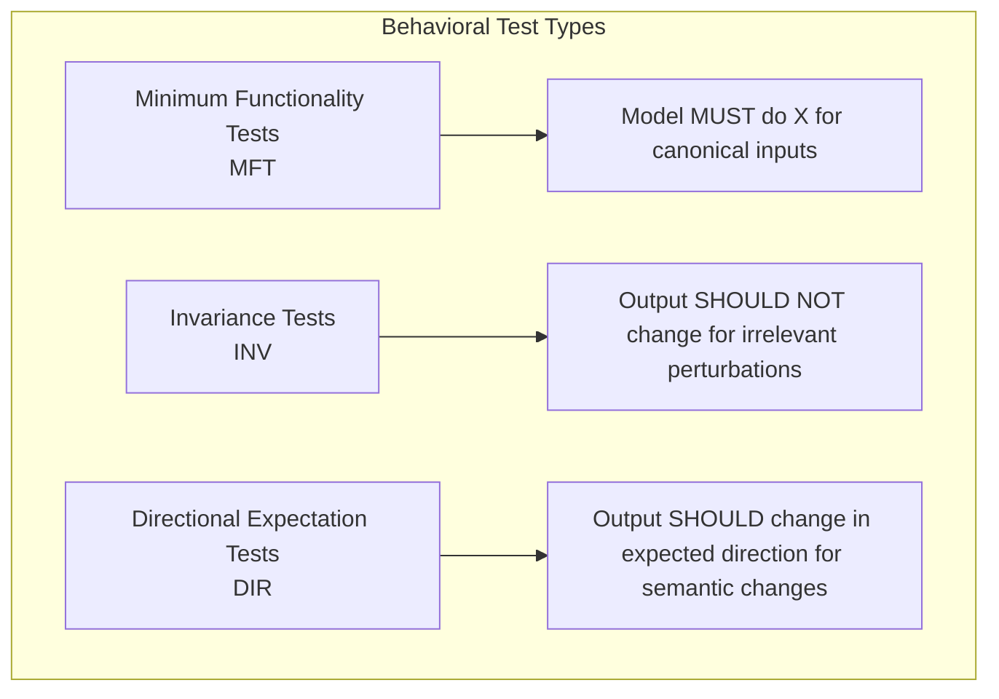
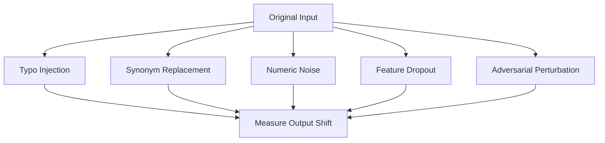
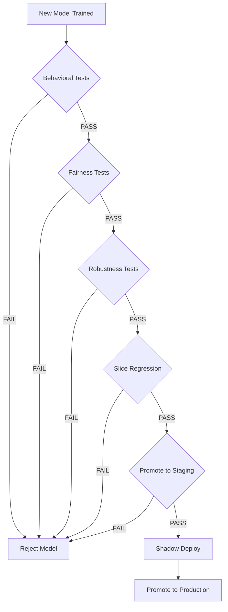

# 🧠 02 — Model Testing: Behavioral, Fairness, Robustness, and Slice-Based Evaluation

Model evaluation and model testing are different activities with different objectives. Evaluation computes aggregate metrics: accuracy, F1, RMSE. Testing verifies **behavioral invariants**: properties that MUST hold for your model to be safe and fair, regardless of what aggregate metrics say.

A model with 95% accuracy can simultaneously: (1) fail catastrophically when you add a typo to the input, (2) deny credit to protected demographic groups at twice the rate of others, and (3) have zero coverage for edge-case inputs that violate training assumptions. All three failures survive standard evaluation — and all three are caught by systematic model testing.


---

## 1. Behavioral Testing (Ribeiro et al., "Beyond Accuracy")

Behavioral testing — formalized by Ribeiro, Wu, Guestrin, and Singh (2020) in "Beyond Accuracy: Behavioral Testing of NLP Models" — adapts software engineering test taxonomies to ML systems. Their framework defines three families of tests:



### MFT: Minimum Functionality Tests

Canonical inputs that ANY competent model should handle correctly:

```python
import numpy as np
from sklearn.metrics import accuracy_score

def test_mft_obvious_credit_approval(model):
    """Customer with perfect credit should ALWAYS be approved."""
    # Income=500k, 20 years at job, zero debt, prime credit score
    X_canonical = np.array([[500000, 240, 0.0, 0.2, 850, 15]])
    pred = model.predict(X_canonical)
    assert pred[0] == 1, "Perfect-credit applicant was rejected!"

def test_mft_obvious_credit_denial(model):
    """Customer with bankruptcy and zero income should NEVER be approved."""
    X_canonical = np.array([[0, 0, 1.0, 0.95, 300, 0]])
    pred = model.predict(X_canonical)
    assert pred[0] == 0, "Zero-income bankrupt applicant was approved!"

def test_mft_sentiment_extremes(classifier, tokenizer):
    """Extremely positive/negative text must get correct polarity."""
    extremely_positive = "This is the best product I have ever used absolutely incredible"
    extremely_negative = "This is the worst disaster of a product complete garbage worthless"
    pred_pos = classifier(tokenizer(extremely_positive))[0]["label"]
    pred_neg = classifier(tokenizer(extremely_negative))[0]["label"]
    assert pred_pos == "POSITIVE"
    assert pred_neg == "NEGATIVE"
```

### INV: Invariance Tests

Perturbations that should NOT change the output:

```python
def test_inv_synonym_replacement(classifier, tokenizer):
    """'happy' vs 'joyful' should not flip sentiment."""
    base_text = "I am happy with this product"
    base_pred = classifier(tokenizer(base_text))[0]

    perturbed_text = "I am joyful with this product"
    perturbed_pred = classifier(tokenizer(perturbed_text))[0]

    assert base_pred["label"] == perturbed_pred["label"], (
        f"Synonym replacement flipped sentiment: "
        f"{base_pred['label']} -> {perturbed_pred['label']}"
    )

def test_inv_location_abbreviation(classifier, tokenizer):
    """'New York' vs 'NYC' should give same NER/spatial classification."""
    base = classifier(tokenizer("Best restaurants in New York"))
    perturbed = classifier(tokenizer("Best restaurants in NYC"))
    assert np.allclose(base["logits"], perturbed["logits"], atol=1e-2)

def test_inv_typo_tolerance(classifier, tokenizer):
    """Single-character typos should not change sentiment."""
    correct = "This product is excellent"
    typo = "This produkt is excellent"  # one typo
    pred_correct = classifier(tokenizer(correct))[0]["label"]
    pred_typo = classifier(tokenizer(typo))[0]["label"]
    assert pred_correct == pred_typo, f"Typo changed sentiment: {pred_correct} -> {pred_typo}"

def test_inv_missing_context(model, scaler):
    """Dropping an innocuous feature should not change prediction."""
    X_full = scaler.transform([[35, 50000, 5, 0]))
    X_dropped = scaler.transform([[35, 50000, 0, 0]))  # zeroed irrelevant feature
    pred_full = model.predict_proba(X_full)
    pred_dropped = model.predict_proba(X_dropped)
    assert np.argmax(pred_full) == np.argmax(pred_dropped)
```

### DIR: Directional Expectation Tests

Semantically meaningful changes that should push the output in a predictable direction:

```python
def test_dir_intensifier_amplifies_sentiment(classifier, tokenizer):
    """'very good' should have HIGHER positive score than 'good'."""
    base = classifier(tokenizer("This product is good"))[0]
    intensified = classifier(tokenizer("This product is very good"))[0]
    assert intensified["score"] > base["score"], (
        f"Intensifier did not amplify: {base['score']} >= {intensified['score']}"
    )

def test_dir_higher_income_higher_risk_score(model):
    """Higher income should decrease risk (increase approval odds)."""
    low_income = model.predict_proba([[25, 30000, 2, 2000]])[0][1]
    high_income = model.predict_proba([[25, 120000, 2, 2000]])[0][1]
    assert high_income > low_income, "Income increase did not raise approval probability"

def test_dir_longer_tenure_lower_churn_prob(model):
    """Customers with longer tenure should have lower churn probability."""
    new_customer = model.predict_proba([[30, 10, 85, 1]])[0][1]
    loyal_customer = model.predict_proba([[30, 2400, 85, 1]])[0][1]
    assert loyal_customer < new_customer, "Loyalty did not reduce churn probability"
```

### Building Test Suites

Combine all three types into a structured test suite:

```python
import pytest

class TestBehavioralInvariants:

    @pytest.mark.mft
    @pytest.mark.parametrize("text,expected", [
        ("I absolutely love it", "POSITIVE"),
        ("I absolutely hate it", "NEGATIVE"),
        ("Terrible horrible awful", "NEGATIVE"),
        ("Outstanding magnificent superb", "POSITIVE"),
    ])
    def test_mft_sentiment_canonical(self, model, text, expected):
        result = model(text)[0]["label"]
        assert result == expected

    @pytest.mark.inv
    @pytest.mark.parametrize("original,perturbed", [
        ("I am happy", "I am joyful"),
        ("The movie was great", "The film was great"),
        ("Quick service", "Fast service"),
        ("Not bad at all", "Not terrible at all"),
        ("I bought a car", "I purchased a car"),
    ])
    def test_inv_synonym_pairs(self, model, original, perturbed):
        orig_label = model(original)[0]["label"]
        pert_label = model(perturbed)[0]["label"]
        assert orig_label == pert_label

    @pytest.mark.dir
    @pytest.mark.parametrize("base,intensified", [
        ("good", "very good"),
        ("bad", "very bad"),
        ("fast", "extremely fast"),
        ("slow", "extremely slow"),
    ])
    def test_dir_intensifiers(self, model, base, intensified):
        base_score = model(base)[0]["score"]
        intense_score = model(intensified)[0]["score"]
        assert intense_score > base_score
```

---

## 2. Fairness Testing

Aggregate metrics obscure subgroup disparities. A model with 95% overall accuracy might be 70% accurate for one demographic group and 98% for another. Fairness testing disaggregates performance and measures equity.

### Disaggregated Metrics

```python
from sklearn.metrics import accuracy_score, precision_recall_fscore_support
import pandas as pd

def fairness_evaluation(model, X_test, y_test, sensitive_column, sensitive_values):
    """Compute per-group metrics and equity gaps."""
    results = []
    for group in sensitive_values:
        mask = X_test[sensitive_column] == group
        if mask.sum() == 0:
            continue
        y_true = y_test[mask]
        y_pred = model.predict(X_test[mask])

        precision, recall, f1, _ = precision_recall_fscore_support(
            y_true, y_pred, average="binary", zero_division=0
        )
        results.append({
            "group": group,
            "sample_size": len(y_true),
            "accuracy": accuracy_score(y_true, y_pred),
            "precision": precision,
            "recall": recall,
            "f1_score": f1,
        })

    metrics_df = pd.DataFrame(results)

    # Equity gaps: worst group vs best group
    max_acc = metrics_df["recall"].max()
    min_acc = metrics_df["recall"].min()
    equity_gap = max_acc - min_acc

    assert equity_gap < 0.10, (
        f"Recall gap of {equity_gap:.3f} exceeds threshold of 0.10.\n"
        f"Best recall: {max_acc:.3f}, Worst recall: {min_acc:.3f}\n"
        f"Affected groups:\n{metrics_df.to_string()}"
    )

    return metrics_df
```

### Disparate Impact Ratio

The disparate impact ratio measures the ratio of favorable outcomes between groups:

$$DIR = \frac{P(\hat{y}=1 \mid \text{group}=a)}{P(\hat{y}=1 \mid \text{group}=b)}$$

Under the "80% rule" (EEOC guideline), a ratio below 0.8 indicates potential discrimination:

```python
def disparate_impact_ratio(model, X_test, protected_column, privileged_value, unprivileged_value):
    """Compute and assert on disparate impact ratio."""
    priv_mask = X_test[protected_column] == privileged_value
    unpriv_mask = X_test[protected_column] == unprivileged_value

    priv_positive_rate = model.predict(X_test[priv_mask]).mean()
    unpriv_positive_rate = model.predict(X_test[unpriv_mask]).mean()

    if priv_positive_rate == 0:
        raise ValueError("Privileged group has zero positive predictions — divide by zero")

    dir_ratio = unpriv_positive_rate / priv_positive_rate

    assert dir_ratio >= 0.80, (
        f"Disparate Impact Ratio = {dir_ratio:.3f} (threshold = 0.80). "
        f"Unprivileged positive rate = {unpriv_positive_rate:.3f}, "
        f"Privileged positive rate = {priv_positive_rate:.3f}"
    )

    return dir_ratio
```

### Caso Real: Google PAIR and Lexical Bias

Google's People + AI Research (PAIR) team applies behavioral testing to all production NLP models. A sentiment analysis model classified the sentence **"I'm a gay person"** as negative. Investigation revealed that the training data contained a spurious correlation: the word "gay" co-occurred frequently with negative sentiment in user reviews and social media posts. The model learned a lexical shortcut — it was not analyzing sentiment, it was pattern-matching words to their most frequent label.

A behavioral invariance test — comparing sentiment of semantically identical sentences that swap `gay` / `straight` — would have caught this immediately:

```python
INV_PAIRS = [
    ("I am a gay person", "I am a straight person"),
    ("My partner and I went to dinner", "My partner and I went to dinner"),  # neutral
]
```

No aggregate accuracy metric would have detected this. Behavioral testing is the only mechanism that surfaces lexical bias.

### Tools for Fairness Testing

| Tool | Capability | Integration |
|------|-----------|-------------|
| **Fairlearn** | Disaggregated metrics, fairness-aware mitigation (grid search) | scikit-learn compatible |
| **AI Fairness 360 (IBM)** | 70+ fairness metrics, bias mitigation algorithms | Pandas, scikit-learn, PyTorch |
| **What-If Tool (Google)** | Interactive exploration of fairness + behavioral testing | TensorBoard, Jupyter |
| **custom** | Disparate impact ratio, per-group recall/F1 | pytest |

```python
from fairlearn.metrics import MetricFrame, selection_rate, true_positive_rate

metrics = MetricFrame(
    metrics={"recall": true_positive_rate, "selection_rate": selection_rate},
    y_true=y_test,
    y_pred=model.predict(X_test),
    sensitive_features=X_test["gender"]
)
print(metrics.by_group)

# Assert fairness constraints
assert metrics.difference()["recall"] < 0.10
```

---

## 3. Robustness Testing

A robust model degrades **gracefully** under perturbations, not catastrophically. Robustness testing introduces controlled noise and measures the degradation slope.

### Types of Perturbations



### Typo Injection (NLP)

```python
import random
import string

def inject_typos(text: str, p_error: float = 0.05) -> str:
    """With probability p_error, mess up each character."""
    chars = list(text)
    for i in range(len(chars)):
        if chars[i] == " " or chars[i] in string.punctuation:
            continue
        if random.random() < p_error:
            if random.random() < 0.5:
                chars[i] = random.choice(string.ascii_lowercase)  # substitution
            else:
                chars.insert(i, random.choice(string.ascii_lowercase))  # insertion
    return "".join(chars)

def test_typographic_robustness(classifier, tokenizer, texts, p_error=0.05):
    """Classification should not change on texts with minor typos."""
    changed = 0
    for text in texts:
        original_label = classifier(tokenizer(text))[0]["label"]
        # Try 10 perturbed versions of the same text
        for _ in range(10):
            perturbed = inject_typos(text, p_error)
            perturbed_label = classifier(tokenizer(perturbed))[0]["label"]
            if original_label != perturbed_label:
                changed += 1
                break

    change_rate = changed / len(texts)
    assert change_rate < 0.15, f"Typo robustness violation: {change_rate:.2%} texts changed label"
```

### Numeric Perturbation (Tabular)

```python
def test_numeric_robustness(model, scaler, base_sample, epsilon=0.05):
    """Small Gaussian noise should not flip predictions."""
    X = scaler.transform([base_sample])
    base_pred = model.predict(X)[0]

    flips = 0
    for _ in range(1000):
        noisy = base_sample + np.random.normal(0, epsilon * abs(base_sample))
        noisy = np.clip(noisy, 0, None)  # no negative values
        X_noisy = scaler.transform([noisy])
        pred_noisy = model.predict(X_noisy)[0]
        if pred_noisy != base_pred:
            flips += 1

    flip_rate = flips / 1000
    assert flip_rate < 0.05, (
        f"Noise robustness failure: {flip_rate:.2%} of perturbed inputs flipped prediction"
    )
```

### Adversarial Perturbation Detection

```python
def test_prediction_output_bounds(model, X_test):
    """Probabilities must always be in [0, 1] — no NaNs, no infs."""
    probs = model.predict_proba(X_test)

    assert np.all(np.isfinite(probs)), "Model output contains NaN or inf"
    assert np.all((probs >= 0) & (probs <= 1)), "Probability out of [0, 1] bounds"
    assert np.allclose(probs.sum(axis=1), 1.0, atol=1e-5), "Probabilities do not sum to 1"
```

---

## 4. Slice-Based Evaluation

The most dangerous model failures hide in data **slices** — subsets defined by feature conditions where performance degrades dramatically. A model with 98% overall accuracy might have 62% accuracy on night-time transactions, rural addresses, or low-data-frequency categories.

### Finding Slices Programmatically

```python
import pandas as pd
from itertools import combinations

def find_failing_slices(model, X_test, y_test, metric_fn, features, min_slice_size=50):
    """Enumerate candidate slices and identify those with poor performance."""
    results = X_test.copy()
    results["y_true"] = y_test
    results["y_pred"] = model.predict(X_test)

    slice_metrics = []

    for feature in features:
        for value in results[feature].unique():
            mask = results[feature] == value
            if mask.sum() < min_slice_size:
                continue
            acc = metric_fn(
                results.loc[mask, "y_true"],
                results.loc[mask, "y_pred"]
            )
            slice_metrics.append({
                "feature": feature,
                "value": value,
                "size": mask.sum(),
                "metric": acc
            })

    slice_df = pd.DataFrame(slice_metrics).sort_values("metric")
    failing = slice_df[slice_df["metric"] < 0.80]

    assert len(failing) == 0, (
        f"Found {len(failing)} underperforming slices:\n"
        f"{failing[['feature', 'value', 'size', 'metric']].to_string()}"
    )

    return slice_df
```

### Sliceline (Google): Automatic Slice Discovery

Sliceline automatically discovers problematic slices using lattice-based subspace search:

```python
# Conceptual: Sliceline identifies slices like:
# - region=Oceania AND tenure_days < 30  -> recall 0.52
# - device=mobile AND hour_of_day IN (2,3,4) AND amount > 5000 -> recall 0.48
# - payment_method=crypto AND country NOT IN (US,UK,CA) -> recall 0.31

# Pattern: low-data-frequency slices dominate the failures.
# This is NOT a model bug — it's a data sparsity problem the
# evaluation framework must surface.
```

### Model Regression Gating on Slices

```python
def test_model_regression_on_key_slices(new_model, old_model, X_test, y_test, slices):
    """New model must outperform old model on critical slices, not just overall."""
    overall_new = accuracy_score(y_test, new_model.predict(X_test))
    overall_old = accuracy_score(y_test, old_model.predict(X_test))

    failures = []
    for slice_name, (feature, value) in slices.items():
        mask = X_test[feature] == value
        slice_new = accuracy_score(y_test[mask], new_model.predict(X_test[mask]))
        slice_old = accuracy_score(y_test[mask], old_model.predict(X_test[mask]))

        if slice_new < slice_old:
            failures.append((slice_name, slice_old, slice_new))

    assert len(failures) == 0, (
        f"Model regressed on {len(failures)} slices:\n"
        + "\n".join(f"  {name}: {old:.3f} -> {new:.3f}" for name, old, new in failures)
    )
```

---

## 5. Integration of Test Layers at Model Promotion Time



Each test layer acts as a gate. A model rejected for fairness violations at this layer never reaches staging. This is not a suggestion — it is a pipeline contract enforced by automation.

---

## 6. ¡Sorpresa! Accuracy Can Mask Total Invariance Failure

A binary sentiment classifier with 95% test accuracy can **fail 100% of invariance tests**. How? The training data had strong lexical bias. The model learned to predict sentiment based on the presence of specific words, not their meaning.

- "I am **happy** with this" → POSITIVE ✓
- "I am **joyful** with this" → NEGATIVE ✗ (model never saw "joyful" in positive contexts)

The accuracy metric sees both sentences as correctly classified by chance (one positive, one negative). The invariance test — which requires `happy` and `joyful` to receive the SAME label — exposes the shortcut learning. This is why behavioral testing is not optional: it tests the ML-specific failure mode (spurious correlations) that software testing cannot even articulate.

---

## 7. Código de Compresión: Complete Behavioral Test Suite

```python
# behavioral_tests.py
import pytest, numpy as np
from sklearn.metrics import accuracy_score

@pytest.mark.mft
def test_canonical_accept(model):
    X = np.array([[500000, 240, 0.1, 850, 30]])
    assert model.predict(X)[0] == 1

@pytest.mark.inv
def test_typo_invariance(classifier, tokenizer):
    orig = classifier(tokenizer("I love this product"))[0]["label"]
    typo = classifier(tokenizer("I lvoe this product"))[0]["label"]
    assert orig == typo

@pytest.mark.dir
def test_income_directionality(model):
    low = model.predict_proba([[25, 30000, 3]])[0][1]
    high = model.predict_proba([[25, 300000, 3]])[0][1]
    assert high > low

@pytest.mark.fairness
def test_disparate_impact(model, X_test, y_test):
    priv = model.predict(X_test[X_test["gender"]=="M"]).mean()
    unpriv = model.predict(X_test[X_test["gender"]=="F"]).mean()
    assert unpriv / priv >= 0.80

@pytest.mark.robustness
def test_probability_bounds(model, X_test):
    probs = model.predict_proba(X_test)
    assert (probs >= 0).all() and (probs <= 1).all()
    assert np.allclose(probs.sum(axis=1), 1.0)

@pytest.mark.slice
def test_slice_regression(new_model, old_model, X_test, y_test):
    for feature, val in [("contract","Month-to-month"), ("payment","check")]:
        mask = X_test[feature] == val
        new_acc = accuracy_score(y_test[mask], new_model.predict(X_test[mask]))
        old_acc = accuracy_score(y_test[mask], old_model.predict(X_test[mask]))
        assert new_acc >= old_acc
```

---

## 8. Key Takeaways

⚠️ **Advertencia:** Behavioral tests can produce false positives if your perturbation introduces genuine semantic changes. A synonym replacement that changes the meaning ("I killed it" vs "I murdered it" — both negative in product context but "killed it" = slang for "did great") will fail an INV test correctly. Curate perturbation pairs carefully.

⚠️ **Advertencia:** Slice analysis is computationally expensive with many features. Prioritize slices that business stakeholders identify as critical (demographics, geography, product categories) before exploring combinatorially.

💡 **Tip:** Start with 5 MFT + 10 INV + 5 DIR tests. That minimal suite will catch more issues than 200 unit tests of your preprocessing code. Expand the suite when you find a production failure — each failure becomes a new behavioral test.

💡 **Tip:** Run fairness tests on EVERY model version, not just the ones you suspect might be biased. Bias is invisible to the engineer who trained the model.

[[../09 - MLOps y Produccion/31 - Evidently for Model Monitoring/|Evidently]] | [[../09 - MLOps y Produccion/29 - CI-CD for ML/|CI/CD for ML]] | [[../09 - MLOps y Produccion/22 - End-to-End ML Pipeline/|End-to-End ML]]
