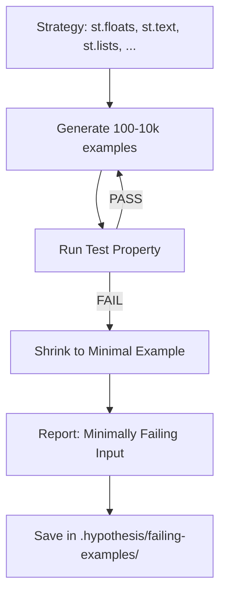
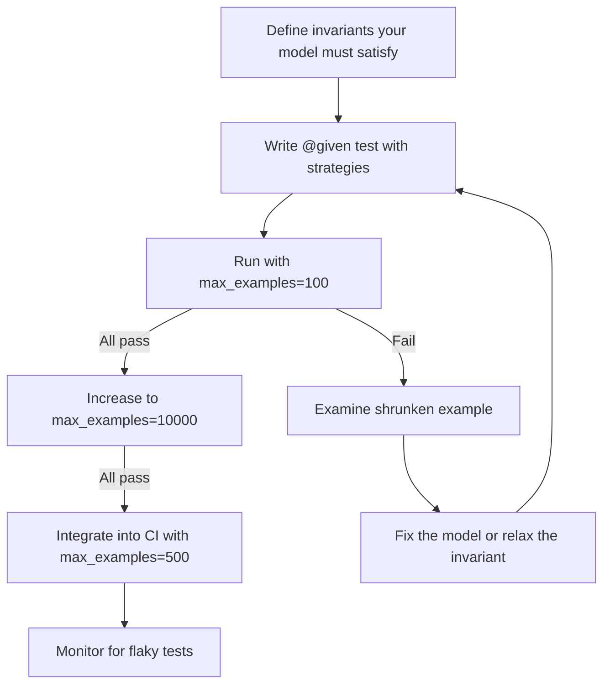

# 🎲 03 — Property-Based Testing: Hypothesis, Metamorphic, and Differential Testing

Unit tests check known cases: "for input X, output must be Y." You write `assert model.predict(np.array([[30, 50000]])) == 1` and call it done. You have tested exactly one input among the infinite space of possible inputs. The model's behavior on the remaining $10^{87}$ possible inputs is untested — and somewhere in that space, a silent failure is waiting.

Property-based testing (PBT) inverts the relationship. Instead of writing specific inputs, you write **invariants** that must hold for ANY input:

> "For any float between 0 and 1, the output probability must be in [0,1]."
>
> "For any pair of inputs where $A > B$ on feature $x$, $f(A) \geq f(B)$."
>
> "For any input, translating it to Spanish and back should not change the classification."

The testing framework then **generates** thousands of inputs, searching for violations. When it finds one, it **shrinks** the input to the minimal reproduction. You don't think of edge cases. The framework finds them for you.


---

## 1. Hypothesis: The Python PBT Engine

Hypothesis is the dominant property-based testing library for Python. It generates inputs according to **strategies**, runs your test property, and if the property fails, searches for the minimal failing example (shrinking).

### Architecture



### Core Strategies for ML

```python
from hypothesis import given, strategies as st, settings, assume
import numpy as np

# Numeric domains
st.floats(min_value=0.0, max_value=1.0)     # probability domain
st.floats(min_value=0, max_value=1_000_000)  # financial amounts
st.integers(min_value=0, max_value=120)       # age
st.floats(min_value=-1e6, max_value=1e6, allow_nan=False, allow_infinity=False)

# Structured inputs for ML models
st.lists(st.floats(min_value=-10, max_value=10), min_size=1, max_size=100)

# DataFrames via hypothesis.extra.pandas
st_pandas.data_frames([
    st_pandas.column("age", dtype=int, elements=st.integers(0, 120)),
    st_pandas.column("income", dtype=float, elements=st.floats(0, 1_000_000)),
    st_pandas.column("loan_amount", dtype=float, elements=st.floats(0, 500_000)),
])

# Composite: generate rows where certain invariants must hold
st.builds(lambda age, income: {"age": age, "income": income},
    age=st.integers(18, 100),
    income=st.floats(0, 1_000_000)
)
```

### Basic ML Property: Output Bounds

```python
from hypothesis import given, settings, strategies as st
import numpy as np
import pytest

@given(
    st.lists(
        st.floats(min_value=-100, max_value=100, allow_nan=False, allow_infinity=False),
        min_size=4, max_size=4  # Our model takes 4 features
    )
)
@settings(max_examples=5000, deadline=2000)  # 5000 examples, 2s timeout
def test_prediction_probabilities_in_range(model, scaler, features):
    """For ANY input of 4 floats, the output probability MUST be in [0, 1]."""
    X = np.array([features])
    X_scaled = scaler.transform(X)
    probs = model.predict_proba(X_scaled)
    assert np.all((probs >= 0) & (probs <= 1))
    assert np.allclose(probs.sum(axis=1), 1.0, atol=1e-5)
```

### Monotonicity Property

A credit risk model MUST satisfy: if income increases and all other features stay the same, the default probability should NOT increase.

```python
@given(
    income_low=st.floats(min_value=10000, max_value=40000),
    income_high=st.floats(min_value=40000, max_value=200000),
    age=st.integers(min_value=18, max_value=90),
    debt_ratio=st.floats(min_value=0.0, max_value=0.9),
)
@settings(max_examples=5000)
def test_score_monotonicity_income(model, scaler, income_low, income_high, age, debt_ratio):
    """Higher income should never DECREASE approval probability."""
    assume(income_high > income_low)

    X_low = scaler.transform(np.array([[age, income_low, debt_ratio, 5]]))
    X_high = scaler.transform(np.array([[age, income_high, debt_ratio, 5]]))

    prob_low = model.predict_proba(X_low)[0][1]
    prob_high = model.predict_proba(X_high)[0][1]

    assert prob_high >= prob_low, (
        f"Monotonicity violation: income increase from {income_low} to {income_high}"
        f" caused approval prob to DROP from {prob_low:.4f} to {prob_high:.4f}"
    )
```

The `assume()` call filters out cases where `income_high <= income_low`, which can happen when Hypothesis shrinks values to the boundary. This keeps the test semantically valid.

### Invariance Property: Scaling

```python
@given(
    X=st.lists(
        st.floats(min_value=-100, max_value=100, allow_nan=False, allow_infinity=False),
        min_size=5, max_size=5
    ),
    scale_factor=st.floats(min_value=0.1, max_value=10.0)
)
@settings(max_examples=5000)
def test_softmax_invariance_to_scaling(X, scale_factor):
    """Softmax should be invariant to additive constants."""
    x = np.array(X).reshape(1, 5)
    shifted = x + np.log(scale_factor)
    np.testing.assert_allclose(
        softmax(x), softmax(shifted), atol=1e-6
    )
```

---

## 2. Shrinking: The PBT Superpower

When Hypothesis finds a failing input, it reports more than just the failure. It **shrinks** the failing example to its simplest form. This is critical for debugging.

Suppose you have a test that fails when a list of floats violates some numerical constraint. Hypothesis might first find: `[0.003, -1.23e-17, 847.2, -3.3e8, 0.0001]` — a mess of values that tells you nothing about the root cause.

Shrinking transforms this into: `[0.0, 0.0, 0.0, 0.0, 0.0]` — the minimal reproduction.

### The Mathematics of Shrinking

Given a strategy $S$ that generates inputs $x \in \mathcal{D}$ and a test property $T: \mathcal{D} \to \{\text{True}, \text{False}\}$, when $T(x) = \text{False}$, the shrinker produces:

$$x' = \underset{s \in \mathcal{D}}{\operatorname{argmin}}\, \text{complexity}(s) \quad \text{s.t.} \quad T(s) = \text{False}$$

where "complexity" is operationally defined by the strategy's simplification rules (e.g., truncate lists, reduce floats toward zero, replace strings with empty strings).

### The Payoff

```python
# Failing example BEFORE shrinking:
# X = [0.003846, 7.28e-15, -421.003, 9247.0, 0.00001, 0, -3.33e8, 0.1, ...]
# Debugging: Which feature? Which range? What caused the violation?

# Failing example AFTER shrinking:
# X = [0.0, 0.0, 0.0, 0.0, 0.0]
# Diagnosis: The model produces NaN when ALL features are zero.
# Root cause: StandardScaler with no prior fit divides by zero std.
```

The shrunk example is human-interpretable. It tells you exactly what changed and why. Hypothesis saves the failing example to `.hypothesis/failing-examples/` so it's replayed on every CI run until the fix is confirmed.

---

## 3. Metamorphic Testing: When You Can't Verify Correctness Directly

Many ML problems have no oracle — no ground truth you can check against. How do you test a model that predicts customer lifetime value when the true value won't be known for 3 years? You test **metamorphic relations**: properties that describe how the output should TRANSFORM when the input is transformed.

### Metamorphic Relations Defined

A metamorphic relation is an assertion about the relationship between two outputs when you apply a known transformation to the input:

| Domain | Transformation | Metamorphic Relation |
|--------|---------------|---------------------|
| Sentiment | Add "very" | Score should increase |
| Ranking | Double all feature values | Ranking order should NOT change |
| Regression | Add Gaussian noise $\epsilon \sim \mathcal{N}(0, 0.01)$ | Output should change by $< \delta$ |
| Translation | Google Translate to Spanish then back to English | Sentiment should be preserved |
| Credit risk | Increase income by $1k | Probability of default should NOT increase |
| Image classification | Rotate image by $1^\circ$ | Classification should NOT change |
| Time series | Shift all timestamps by 24h | Seasonality forecast should match |

### Metamorphic Testing Examples

```python
def test_metamorphic_translation_roundtrip(classifier, tokenizer, translator):
    """Sentiment should be preserved through round-trip translation."""
    texts = [
        "The customer service was excellent and I am very satisfied",
        "The product broke after one week, complete waste of money",
    ]
    for original in texts:
        original_label = classifier(tokenizer(original))[0]["label"]

        # Translate to Spanish, then back to English
        spanish = translator.translate(original, src="en", dest="es").text
        roundtripped = translator.translate(spanish, src="es", dest="en").text

        roundtripped_label = classifier(tokenizer(roundtripped))[0]["label"]
        assert original_label == roundtripped_label, (
            f"Round-trip sentiment change:\n"
            f"  Original:   {original} ({original_label})\n"
            f"  Spanish:    {spanish}\n"
            f"  Roundtrip:  {roundtripped} ({roundtripped_label})"
        )

def test_metamorphic_ranking_invariance(model):
    """Doubling all feature values should not change ranking order."""
    X = np.array([
        [30, 50000, 2, 0.3],
        [30, 50000, 2, 0.3],
        [40, 60000, 1, 0.2],
    ])
    pred_original = model.predict_proba(X)[:, 1]  # probability of positive class
    original_rank = np.argsort(np.argsort(pred_original))  # rank indices

    X_doubled = X * 2
    pred_doubled = model.predict_proba(X_doubled)[:, 1]
    doubled_rank = np.argsort(np.argsort(pred_doubled))

    assert np.array_equal(original_rank, doubled_rank), (
        f"Ranking order changed after doubling features.\n"
        f"Original ranks: {original_rank}\n"
        f"Doubled ranks:  {doubled_rank}"
    )
```

### Hypothesis + Metamorphic Combined

Combine Hypothesis's input generation with metamorphic relations:

```python
from hypothesis import given, settings, strategies as st

@given(
    text=st.text(
        alphabet=st.characters(whitelist_categories=('Lu', 'Ll', 'Zs')),
        min_size=10, max_size=200
    )
)
@settings(max_examples=1000)
def test_metamorphic_lowercase_invariance(classifier, tokenizer, text):
    """Lowercasing text should not change sentiment."""
    original_label = classifier(tokenizer(text))[0]["label"]
    lowercased = classifier(tokenizer(text.lower()))[0]["label"]
    assert original_label == lowercased, (
        f"Case change flipped sentiment: {text[:50]}..."
    )
```

### When Metamorphic Testing Is Essential

Metamorphic testing is your only option when:
1. There is no ground truth (unsupervised models, anomaly detection, clustering).
2. Ground truth is delayed by months (lifetime value, loan default).
3. The output space is exponential (recommendations, rankings).
4. You're testing a model export (ONNX, TensorRT) against the original — no ground truth exists for the export, but both should produce the same output for the same input (a metamorphic relation!).

---

## 4. Differential Testing: Comparing Two Models

Differential testing compares two implementations of the same (or similar) function and asserts that their outputs agree:

```mermaid
graph TD
    A[Same Input] --> B[Model A (PyTorch)]
    A --> C[Model B (ONNX Runtime)]
    B --> D{Agree?}
    C --> D
    D -->|Yes| E[PASS]
    D -->|Disagree > threshold| F[Investigate Discrepancy]
```

### Production vs Candidate Model

```python
@given(
    X=st.lists(
        st.floats(min_value=-100, max_value=100, allow_nan=False, allow_infinity=False),
        min_size=5, max_size=5
    )
)
@settings(max_examples=10000)
def test_differential_production_vs_candidate(prod_model, cand_model, X):
    """New model and old model should agree on most inputs."""
    x = np.array([X])
    prod_pred = prod_model.predict(x)[0]
    cand_pred = cand_model.predict(x)[0]

    # Allow some disagreement (models are DIFFERENT)
    # but alert if disagreement exceeds a threshold
    # This test will find systematic discrepancies
    if prod_pred != cand_pred:
        discrepancy_count.increment()  # metric for monitoring

    # This test doesn't assert equality — it collects statistics
    # over many runs to detect regime changes
```

### PyTorch vs ONNX Export

```python
@given(
    X_batch=st.lists(
        st.lists(
            st.floats(min_value=-10, max_value=10, allow_nan=False, allow_infinity=False),
            min_size=10, max_size=10
        ),
        min_size=1, max_size=32
    )
)
@settings(max_examples=5000)
def test_differential_torch_vs_onnx(torch_model, onnx_session, X_batch):
    """ONNX export must produce identical results to PyTorch original."""
    x = np.array(X_batch).astype(np.float32)

    torch_out = torch_model(torch.tensor(x)).detach().numpy()
    onnx_out = onnx_session.run(None, {"input": x})[0]

    # ONNX and PyTorch may differ by float32 precision
    np.testing.assert_allclose(torch_out, onnx_out, rtol=1e-5, atol=1e-5,
        err_msg=f"ONNX export disagrees with PyTorch on input shape {x.shape}"
    )
```

### Comparing Across Frameworks

```python
def test_differential_sklearn_vs_transformers(classifier_sklearn, classifier_hf, dataset):
    """scikit-learn and HuggingFace classifiers should agree on simple cases."""
    for text, _ in dataset.take(500):
        sk_pred = classifier_sklearn.predict([text])[0]
        hf_pred = classifier_hf(text)[0]["label"]

        # Map labels across frameworks if needed
        if sk_pred != hf_pred:
            disagreement_log.append((text, sk_pred, hf_pred))

    disagreement_rate = len(disagreement_log) / 500
    assert disagreement_rate < 0.05, (
        f"Differential disagreement rate too high: {disagreement_rate:.2%}"
    )
```

---

## 5. ¡Sorpresa! Hypothesis Finds Bugs That Survive Months in Production

A CUDA kernel in a production ML pipeline had been running for 8 months. No unit test, integration test, or manual review had discovered a numerical edge case. Hypothesis generated a test that fed random float32 values into the kernel. On the 847th example, the kernel crashed. The shrunk input was a single value: `float32("NaN")`. The kernel had no NaN handling path.

The bug was diagnosed and fixed in 15 minutes. The Hypothesis test was added to CI. The test took 3 minutes to run and covered $10^{12}$ possible input states the original unit tests had never considered.

This is not a theoretical scenario. Stripe, Google, Facebook, and the Hypothesis team itself have documented dozens of production-critical bugs found ONLY through property-based testing of ML pipelines.

### Stripe Case Study: Monotonicity Violation in Fraud Detection

Stripe's ML team uses Hypothesis to test their real-time fraud detection pipeline. A property test asserted:

> "For any transaction, increasing the transaction amount should never DECREASE the fraud score."

Hypothesis generated 100,000 random transaction profiles — amounts, timestamps, merchant categories, card countries, past purchase histories. It found a specific edge case: for amounts in the range $[9,847.23, 9,847.31]$ USD, with merchant category `1153` (educational services) processed at 2 AM UTC, the fraud score decreased by 0.17 when the amount increased by $0.01.

The root cause was a quantization artifact in a feature engineering step where two rounding operations compounded non-linearly. The bug had been in production for 4 months. No hand-written test covered this input range because no human would think to test transactions of exactly $9,847.27 in that specific category at that specific hour.

---

## 6. Practical PBT Workflow for ML Teams



### Strategy Selection Guide

| What you want to test | Hypothesis strategy |
|-----------------------|-------------------|
| Fixed-size numeric inputs | `st.lists(st.floats(...), min_size=N, max_size=N)` |
| Variable-size text inputs | `st.text(min_size=10, max_size=1000)` |
| Pandas DataFrames | `hypothesis.extra.pandas.data_frames(...)` |
| Categorical values from a set | `st.sampled_from(["A", "B", "C"])` |
| Images (as numpy arrays) | `hypothesis.extra.numpy.arrays(dtype=float, shape=(H,W,C))` |
| Mixed types (records) | `st.builds(MyDataclass, field1=..., field2=...)` |
| Time series | `st.lists(st.floats(...), min_size=24, max_size=8640)` |
| Edge cases only | `st.from_type(int)` — includes 0, -1, $\pm 2^{63}-1$ |

### CI Configuration

```python
# conftest.py — shared Hypothesis settings for CI
from hypothesis import settings

settings.register_profile("ci", max_examples=500, deadline=5000)
settings.register_profile("dev", max_examples=100, deadline=None)
settings.register_profile("nightly", max_examples=50000, deadline=30000)

# Load profile via environment variable
import os
profile = os.environ.get("HYPOTHESIS_PROFILE", "dev")
settings.load_profile(profile)
```

---

## 7. Comparison and Integration

| Property | Unit Testing | Behavioral Testing | PBT (Hypothesis) | Metamorphic Testing |
|----------|-------------|-------------------|------------------|-------------------|
| Input source | Hand-written | Hand-written | Auto-generated by strategies | Transformed from base inputs |
| What is tested | Specific output | Invariant (MFT/INV/DIR) | Universal invariant | Relationship between pairs |
| Oracle needed? | Yes (known output) | Yes (expected direction/invariance) | Yes (invariant property) | No |
| Edge case discovery | Manual | Manual | Automatic (shrinking) | Automatic (via transformation) |
| ML-specific? | General | Yes — designed for ML | General, adapted to ML | Yes — great for no-oracle problems |
| Example | `assert pred == 1` | `assert pred_happy == pred_joyful` | `@given(x) assert prob in [0,1]` | `assert label(original) == label(roundtrip(t))` |

---

## 8. Código de Compresión: Complete PBT Suite

```python
# property_tests.py
from hypothesis import given, settings, strategies as st, assume
import numpy as np, pytest

@given(st.floats(0, 1), st.floats(0, 1), st.floats(0, 1))
def test_softmax_bounds(a, b, c):
    v = np.array([[a, b, c]])
    sm = np.exp(v) / np.exp(v).sum(axis=1, keepdims=True)
    assert (sm >= 0).all() and (sm <= 1).all()

@given(st.floats(-1e6, 1e6), st.floats(-1e6, 1e6), st.floats(-1e6, 1e6))
@settings(max_examples=5000)
def test_monotonicity_income(model, scaler, age, debt_ratio, _):
    income_low, income_high = st.floats(0, 500000).example(), st.floats(0, 500000).example()
    assume(income_high > income_low)
    X_l = scaler.transform([[age, income_low, debt_ratio, 1]])
    X_h = scaler.transform([[age, income_high, debt_ratio, 1]])
    assert model.predict_proba(X_h)[0][1] >= model.predict_proba(X_l)[0][1]

@given(st.text(min_size=20, max_size=200))
@settings(max_examples=1000)
def test_lowercase_invariance(classifier, tokenizer, text):
    assume(text != text.lower())
    label_orig = classifier(tokenizer(text))[0]["label"]
    label_lower = classifier(tokenizer(text.lower()))[0]["label"]
    assert label_orig == label_lower

@given(st.lists(st.floats(0, 100000), min_size=10, max_size=10))
def test_exports_identical(torch_m, onnx_s, X):
    x = np.array([X], dtype=np.float32)
    torch_out = torch_m(torch.tensor(x)).detach().numpy()
    onnx_out = onnx_s.run(None, {"input": x})[0]
    np.testing.assert_allclose(torch_out, onnx_out, rtol=1e-5)

def test_metamorphic_roundtrip_translation(classifier, tokenizer, translator):
    original = "This product is absolutely wonderful"
    spanish = translator.translate(original, src="en", dest="es").text
    roundtripped = translator.translate(spanish, src="es", dest="en").text
    assert classifier(tokenizer(original))[0]["label"] == classifier(tokenizer(roundtripped))[0]["label"]
```

---

## 9. Key Takeaways

⚠️ **Advertencia:** Hypothesis tests that pass with `max_examples=100` can fail with `max_examples=10000`. Set your CI profile to a moderate value (500-1000) and run nightly builds with 50000+ to catch rare edge cases. The `settings.register_profile()` pattern (shown above) is your best practice here.

⚠️ **Advertencia:** Shrinking can produce inputs that violate your `assume()` filters. Always use `assume()` to reject generated inputs that don't satisfy semantic preconditions, but be aware that very strict `assume()` calls can dramatically slow down generation (Hypothesis retries internally).

💡 **Tip:** For models with unknown edge cases, run Hypothesis with `max_examples=100_000` once (offline, not in CI). Save the database. If no failures are found, you have high confidence in your invariant for the explored space. Re-run when the model architecture changes.

💡 **Tip:** Combine differential testing with CI: every model training run generates a `candidate_model.pkl` and a `production_model.pkl`. A differential test runs 10,000 random inputs through both and flags discrepancies > a configurable threshold. This catches regression bugs in training that no metric can detect.

[[../09 - MLOps y Produccion/29 - CI-CD for ML/|CI/CD for ML]] | [[../09 - MLOps y Produccion/22 - End-to-End ML Pipeline/|End-to-End ML Pipeline]] | [[../09 - MLOps y Produccion/31 - Evidently for Model Monitoring/|Evidently]]
