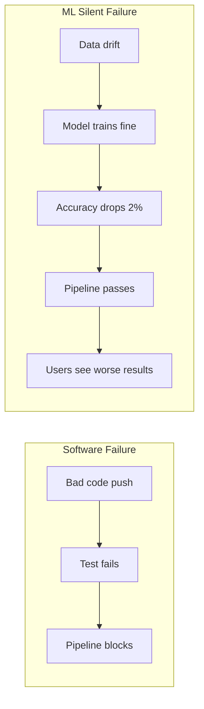

# 🔄 00 — Welcome to CI-CD for ML

## 🎯 Learning Objectives

- Define CI/CD for ML as a distinct discipline from traditional software CI/CD — different artifacts, different gates, different failure modes
- Contrast the ML deployment anti-pattern (manual script from someone's laptop) with a fully automated ML pipeline
- Navigate the 3-note course map: GitOps infrastructure, pipeline design, and advanced deployment strategies
- Identify the four critical artifacts an ML pipeline must produce and validate before production
- Connect CI/CD for ML to prerequisites in testing, deployment, and monitoring

## Introduction

CI/CD turns ML experiments into repeatable, auditable deployments. Without it, every deployment is a Python script that Susan runs from her laptop at 11 PM — passing SSH credentials on the command line, forgetting to update the model version in the ConfigMap, and discovering the GPU node is still running last week's model when Monday's predictions are inexplicably worse.


The distinction matters more in ML than in traditional software. A software CI/CD pipeline tests code correctness: does the binary compile? do unit tests pass? does the container start? An ML CI/CD pipeline must additionally test **data correctness** (has the schema changed?), **model correctness** (does the model outperform baseline on holdout?), and **operational correctness** (does the model meet latency SLOs under production traffic?). Software deployments are binary: the code works or it doesn't. ML deployments are probabilistic: the model might work correctly while serving degraded results nobody notices for weeks.

---

## 1. The Manual Deployment Anti-Pattern

```mermaid
graph TD
    A[Data Scientist trains model] --> B[Model saved to local disk]
    B --> C[SSH to production GPU node]
    C --> D[scp model.pt /var/models/]
    D --> E[kill -HUP inference-server]
    E --> F{Hope it works}
    F -->|"Seems fine"| G[Go home at 2 AM]
    F -->|"500 errors"| H[Panic, restore old model manually]
    H --> I[Boss asks "what version is running?"]
    I --> J["Uh..."]
```

This workflow has no version tracking, no audit trail, no rollback mechanism, no validation, no approval, and no guard against human error. The model version running in production is whatever survived the last `scp`. When the person who deployed it leaves the company, the deployment process leaves with them.

### ❌ The "Quick Deploy" Script (Anti-Pattern)

```bash
#!/bin/bash
# deploy_model.sh — run from laptop, 2 AM, production
scp model_v3_final_FINAL.pt gpu-node-01:/models/
ssh gpu-node-01 "docker restart inference-service"
echo "Done. Good luck."
```

### ✅ The CI/CD Pipeline (Pattern)

```yaml
# .github/workflows/ml-pipeline.yml
on:
  push:
    branches: [main]
    paths: ["model/**", "src/**"]
jobs:
  validate-data: ...
  train-and-evaluate: ...
  build-and-push: ...
  deploy-staging: ...
  smoke-tests: ...
  deploy-production: ...
```

The pipeline runs on every commit to `main`. Every stage is versioned. Every failure is logged. Every deployment is auditable.

---

## 2. What Makes ML CI/CD Different

Four artifacts distinguish an ML pipeline from a software pipeline:

| Artifact | Software CI/CD | ML CI/CD |
|----------|---------------|----------|
| **Code** | Tested with unit/integration tests | Same, plus data pipeline tests |
| **Data** | Schema may change (migrations) | Schema + distribution + quality validated per run |
| **Model** | N/A | Trained, evaluated against baseline, registered with metadata |
| **Infrastructure** | Docker image + Kubernetes manifests | Docker image + GPU scheduling + model artifact + KServe InferenceService |

The probability of silent failure is higher in ML CI/CD. A software pipeline fails loudly: a container crashes, a test assertion breaks. An ML pipeline can fail silently: the model trains successfully but accuracy degrades 2%, the data schema changes but the pipeline doesn't detect it, the model binary is pushed to the wrong registry path and production falls back to a 6-month-old checkpoint.



The ML CI/CD pipeline must detect the right failures — and it must detect them before users do.

---

## 3. Course Map

| Note | Content | Key Question |
|------|---------|-------------|
| **[[01 - GitOps and ArgoCD for ML Infrastructure]]** | GitOps pull model, ArgoCD Application CRD, model-as-GitOps-artifact, Flux vs ArgoCD | _How do I deploy ML infrastructure with Git as the single source of truth?_ |
| **[[02 - ML Pipeline Design — Stages, GPU Runners and Artifacts]]** | 10-stage pipeline, GPU self-hosted runners, artifact versioning, caching strategies | _How do I design a production-grade ML CI/CD pipeline?_ |
| **[[03 - Canary Deployments, Shadow Mode and Rollback Strategies]]** | Canary traffic splitting, shadow mirroring, automated rollback, Istio/KServe integration | _How do I safely release ML models to users?_ |

---

## 4. Prerequisites

- **Docker and containerization**: Building, tagging, pushing images to registries. See [[../../02 - Docker Profesional/]]
- **Kubernetes basics**: Pods, Deployments, Services, ConfigMaps. See [[../20 - Deployment y Serving/03 - Kubernetes para ML|Deployment y Serving]]
- **CI/CD concepts**: GitHub Actions workflows, stages, jobs, artifacts. General experience with any CI platform.
- **ML pipeline fundamentals**: Training loop, model serialization, inference endpoint. See [[../22 - End-to-End ML Project/]]
- **Testing in ML**: Data validation, model evaluation, behavioral testing. See [[../28 - Testing in ML Systems/]]

---

## 5. Interconnections

| Prerequisite Concept | Where Used |
|----------------------|------------|
| [[../28 - Testing in ML Systems/]] | Tests run as CI pipeline stages; model evaluation gates |
| [[../30 - TorchServe/]] | Model artifact packaging (.mar) and serving in CI deployment |
| [[../32 - KServe and Knative/]] | InferenceService as CD deployment target |
| [[../26 - ML Platform Engineering/]] | CI/CD as the backbone of the ML platform |
| [[../../10 - Cloud, Infra y Backend/23 - Infrastructure as Code/06 - CI-CD and GitOps for ML Infrastructure\|IaC CI/CD & GitOps]] | Infrastructure pipelines, Terraform plan as code review artifact |
| [[../31 - Evidently AI and Phoenix/]] | Data/data drift monitoring integration with CI gates |
| [[../../projects/04 - CI-CD for ML - Project Guide\|Project Guide]] | Hands-on implementation of an ML CI/CD pipeline |

---

## 🎯 Key Takeaways

- ML CI/CD is not software CI/CD with a training step — it requires data validation gates, model evaluation gates, and probabilistic failure detection
- Manual deployment is the #1 source of ML production incidents: wrong version, wrong ConfigMap, no rollback mechanism
- Four artifacts distinguish ML pipelines: code, data, model, and specialized infrastructure (GPU nodes, KServe InferenceServices)
- Silent failures are the ML CI/CD's greatest threat — data drift and model degradation pass standard pipelines unnoticed
- Every stage in an ML pipeline is a gate: if data validation fails, training never runs; if model evaluation fails, the container is never built
- GitOps extends CI/CD for ML infrastructure — the cluster self-heals to Git state within minutes, eliminating manual drift

## 📦 Código de Compresión

```bash
# The one-liner that describes the difference
# Software CI/CD:     git push → lint → test → build → deploy
# ML CI/CD:           git push → lint → test → validate_data → train → evaluate → build → deploy_staging → smoke_test → canary → production
```
