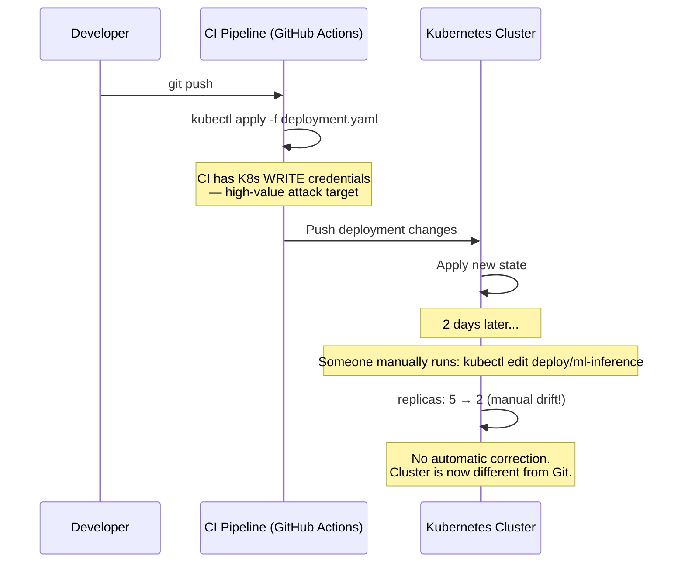
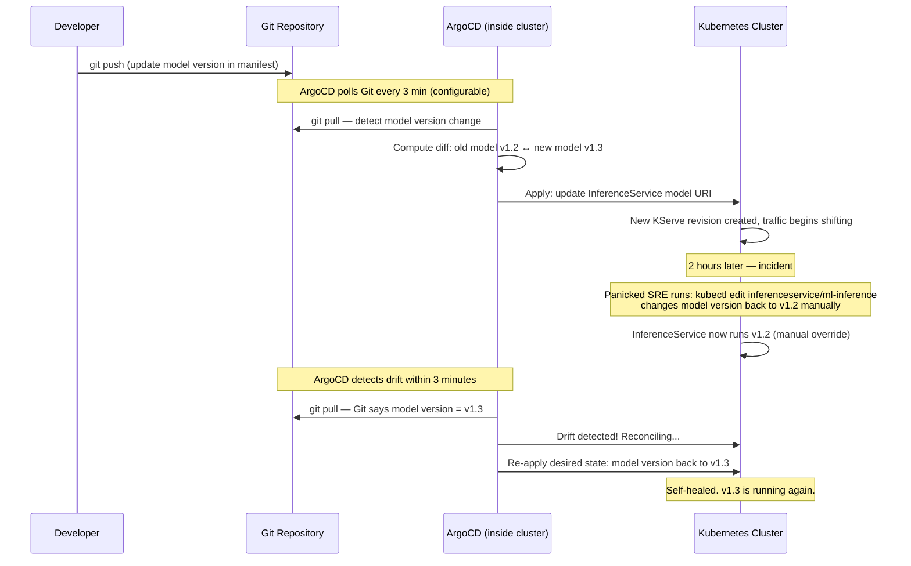
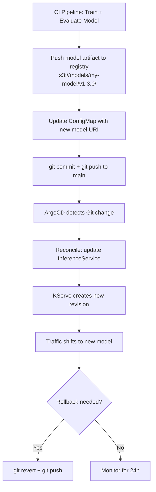

# 🚀 01 — GitOps and ArgoCD for ML Infrastructure

## 🎯 Learning Objectives

- Define GitOps and contrast the pull model (ArgoCD/Flux) with traditional push-based CI/CD — security implications and drift remediation
- Configure an ArgoCD Application CRD that deploys an ML inference service from a Git repository to a Kubernetes cluster
- Implement model versioning as a GitOps artifact: Git commit updates model URI → ArgoCD syncs → InferenceService updates → traffic shifts
- Design rollback workflows for ML models using `git revert` + ArgoCD sync — rollback time measured in seconds to minutes
- Compare ArgoCD vs Flux CD for ML use cases and select the appropriate tool based on UI, Helm support, and multi-tenancy requirements
- Understand the security architecture of pull-based GitOps — cluster agents need only Git READ access, never production cluster WRITE credentials

## Introduction

**GitOps** is the operational model where Git is the single source of truth for both infrastructure declaration and deployment automation. Coined by Alexis Richardson at Weaveworks in 2017, GitOps answers the question: _How do I know what is running in production?_ The answer: whatever is in the `main` branch of the Git repository. Not whatever someone typed into `kubectl edit` at 3 AM. Not whatever Terraform statefile sits on Susan's laptop. Whatever is in Git — and if the live cluster diverges, it converges back to Git within 3 minutes.


For ML, GitOps solves a specific and painful problem: _which model version is running?_ In a traditional setup, the model version is whatever binary was last `scp`'d to the GPU node. Nobody knows. In a GitOps setup, the model version is a field in a YAML file in Git. The running InferenceService reflects that field. The audit trail is `git log`. The rollback mechanism is `git revert`. The answer to "which version is running?" is one `git show` away.

The ML infrastructure in this note connects directly to the KServe InferenceService pattern from [[../32 - KServe and Knative/01 - KServe - Serverless Model Serving with InferenceService|KServe]] and the deployment strategies from [[03 - Canary Deployments, Shadow Mode and Rollback Strategies|Note 03]]. The pipeline that produces the Git commit flows from [[02 - ML Pipeline Design — Stages, GPU Runners and Artifacts|Note 02]].

---

## 1. The GitOps Pull Model

### Push vs Pull: The Security Argument

Traditional CI/CD is **push-based**: the CI pipeline authenticates to the Kubernetes cluster and pushes changes. This is the `kubectl apply` in your GitHub Actions workflow. The problem: the CI pipeline holds credentials that can CREATE, MODIFY, and DESTROY production infrastructure. A compromised pipeline = a compromised cluster.



**GitOps is pull-based**: an agent (ArgoCD, Flux) runs INSIDE the Kubernetes cluster. It watches the Git repository. When the desired state in Git changes, the agent pulls the new state and reconciles the cluster to match. The cluster agent only needs READ access to Git — it never needs WRITE credentials to the cluster because it already lives inside the cluster.



### ¡Sorpresa! Self-Healing Is a Feature, Not a Bug

The 3-minute reconciliation loop is not optional — it's the defining characteristic of GitOps. If someone manually changes a deployment from the console during an incident, ArgoCD REVERTS that change. This sounds aggressive until you realize: the manual change bypassed code review, testing, and approval. It has no audit trail. If it's the correct change, it should go through Git. ArgoCD enforces this discipline. No Git commit = no cluster change.

⚠️ For emergency hotfixes, you can disable auto-sync temporarily: `argocd app set ml-inference --sync-policy none`. Make your emergency change, then `git revert` + re-enable sync. The emergency window is 0 minutes (you should always go through Git). But the escape hatch exists.

### Push Model ❌ vs Pull Model ✅

**❌ Push deployment** — CI pushes to cluster, needs admin credentials, no drift correction:

```bash
# .github/workflows/deploy.yml — traditional push CD
- name: Deploy to Kubernetes
  run: |
    kubectl apply -f k8s/inference-service.yaml
    kubectl rollout status deployment/ml-inference
# CI runner needs KUBECONFIG with cluster-admin. Attackers who compromise
# the pipeline get full cluster write access.
```

**✅ Pull deployment** — ArgoCD in the cluster pulls from Git, cluster self-heals:

```yaml
# argocd/ml-inference-app.yaml — ArgoCD Application for ML inference
apiVersion: argoproj.io/v1alpha1
kind: Application
metadata:
  name: ml-inference
  namespace: argocd
spec:
  project: ml-production
  source:
    repoURL: https://github.com/company/ml-platform
    targetRevision: main
    path: k8s/production
  destination:
    server: https://kubernetes.default.svc
    namespace: ml-inference
  syncPolicy:
    automated:
      prune: true      # Delete resources removed from Git
      selfHeal: true   # Revert manual cluster changes
    syncOptions:
      - CreateNamespace=true
```

ArgoCD watches `k8s/production/` in the Git repo. The cluster agent needs only HTTPS READ access to GitHub — no `kubeconfig`, no cluster-admin secrets. If an attacker compromises the CI pipeline, they still cannot modify the cluster because the pipeline only pushes to Git, never to the cluster. The cluster pulls from Git on its own schedule.

---

## 2. Model Versioning as a GitOps Artifact

In GitOps for ML, the model version becomes a line in a YAML file. Updating the model = updating that line = `git commit` + `git push`. The deployment happens automatically when ArgoCD detects the change.

### The Model Deployment Loop



The model is never "deployed" by CI. The model binary is pushed to a registry (S3, GCS, MLflow) by CI, and the Git commit updates a pointer to that binary. ArgoCD reads the pointer and applies it.

### ConfigMap as Model Version Pointer

```yaml
# k8s/production/model-version-configmap.yaml
apiVersion: v1
kind: ConfigMap
metadata:
  name: model-version
  namespace: ml-inference
data:
  model-uri: "s3://ml-models/churn-predictor/v1.3.0/"
  model-checksum: "sha256:a1b2c3d4e5f6..."
  deployed-at: "2026-05-29T14:30:00Z"
  deployed-by: "ci-pipeline"
```

The InferenceService references this ConfigMap:

```yaml
# k8s/production/inference-service.yaml
apiVersion: serving.kserve.io/v1beta1
kind: InferenceService
metadata:
  name: churn-predictor
spec:
  predictor:
    pytorch:
      storageUri: "s3://ml-models/churn-predictor/v1.3.0/"
      resources:
        limits:
          nvidia.com/gpu: "1"
```

When the CI pipeline trains model v1.4.0, it updates `storageUri` → `git commit` → `git push`. ArgoCD sees the diff, applies the change, and KServe creates a new revision. The old revision stays available for rollback.

### Rollback = `git revert` + Wait for Sync

```bash
# Roll back model v1.4.0 to v1.3.0 — total time: one git command + ~30s sync delay
git revert HEAD
git push origin main
# ArgoCD detects within 3 min, applies revert, KServe shifts traffic to v1.3.0
```

No `kubectl rollout undo`. No SSH. No finding the old model binary on disk. The entire history is in Git. Every rollback is a `git revert` with an audit trail of who initiated it, when, and why.

### ¡Sorpresa! Git History = Model Deployment History

Your `git log` becomes your model deployment log:

```
commit f3a8b12 (HEAD -> main, origin/main)
Author: ci-pipeline <ci@company.com>
Date:   Thu May 29 14:32:00 2026

    deploy: churn-predictor v1.4.0 (accuracy 0.943 → 0.947, PR #4521)

commit e7d6c09
Author: oncall <oncall@company.com>
Date:   Thu May 29 13:15:00 2026

    ROLLBACK: churn-predictor v1.3.1 → v1.3.0 (p99 latency regression, PR #4520)

commit a2c4f11
Author: ci-pipeline <ci@company.com>
Date:   Thu May 29 09:00:00 2026

    deploy: churn-predictor v1.3.1 (bugfix: null handling in age feature)
```

No separate deployment tracking tool. No "which version was running last Tuesday?" meetings. `git log --after="2026-05-27" --before="2026-05-29"` answers the question in 0.3 seconds.

---

## 3. ArgoCD Application CRD Deep-Dive

The `Application` CRD is the core abstraction. It defines WHAT to deploy (source repo + path), WHERE to deploy (cluster + namespace), and HOW to deploy (sync policy, health checks, prune behavior).

### Application Spec for ML Workloads

```yaml
apiVersion: argoproj.io/v1alpha1
kind: Application
metadata:
  name: churn-predictor
  namespace: argocd
  finalizers:
    - resources-finalizer.argocd.argoproj.io
spec:
  project: ml-production
  source:
    repoURL: https://github.com/company/ml-platform.git
    targetRevision: main
    path: k8s/churn-predictor/production
    directory:
      recurse: true
      jsonnet: {}
  destination:
    server: https://kubernetes.default.svc
    namespace: churn-inference
  syncPolicy:
    automated:
      prune: true
      selfHeal: true
      allowEmpty: false
    syncOptions:
      - CreateNamespace=true
      - PruneLast=true
    retry:
      limit: 5
      backoff:
        duration: 5s
        factor: 2
        maxDuration: 3m
  health:
    check: |
      hs = {}
      if obj.status ~= nil then
        if obj.status.conditions ~= nil then
          for i, condition in pairs(obj.status.conditions) do
            if condition.type == "Ready" and condition.status == "True" then
              hs.status = "Healthy"
              hs.message = "InferenceService is ready"
              return hs
            end
          end
        end
      end
      hs.status = "Progressing"
      hs.message = "Waiting for InferenceService"
      return hs
```

Key fields:

| Field | Purpose | ML-Specific Consideration |
|-------|---------|--------------------------|
| `source.repoURL` | Git repository with K8s manifests | Contains model version ConfigMap + InferenceService YAML |
| `source.path` | Directory within repo to watch | Separate paths for staging vs production |
| `syncPolicy.automated.prune` | Delete resources removed from Git | Clean up old model ConfigMaps automatically |
| `syncPolicy.automated.selfHeal` | Revert manual cluster changes | Prevents SREs from manually scaling GPU pods |
| `syncPolicy.retry` | Retry failed syncs | ML deployments may fail if GPU nodes are unavailable |
| `destination.namespace` | Target namespace | Isolate models by namespace for resource quota management |

### Health Checks for ML Services

ArgoCD health checks determine whether a deployed resource is "Healthy" or "Degraded." For ML inference services, health means more than "pod is running":

```yaml
# Custom health check for KServe InferenceService
# Checks: pod ready + model loaded + endpoint responding
data:
  resource.customizations: |
    serving.kserve.io/InferenceService:
      health.lua: |
        hs = {}
        if obj.status ~= nil then
          if obj.status.conditions ~= nil then
            for i, condition in pairs(obj.status.conditions) do
              if condition.status == "False" then
                hs.status = "Degraded"
                hs.message = condition.message
                return hs
              end
            end
          end
          if obj.status.url ~= nil then
            hs.status = "Healthy"
            hs.message = "Inference endpoint: " .. obj.status.url
            return hs
          end
        end
        hs.status = "Progressing"
        hs.message = "Waiting for model to load"
        return hs
```

A GPU node outage means the InferenceService cannot become Healthy. ArgoCD marks it `Degraded` until the node recovers. This integrates with ArgoCD Notifications to send Slack/PagerDuty alerts.

---

## 4. ArgoCD vs Flux CD for ML

Both are CNCF-graduated GitOps tools. The choice depends on your team's operational style and infrastructure complexity:

| Dimension | ArgoCD | Flux CD | ML Recommendation |
|-----------|--------|---------|-------------------|
| **UI** | Rich web dashboard with diff viewer, sync history, resource tree | CLI-focused (`flux get`, `flux reconcile`); no built-in web UI | ArgoCD wins for ML — the UI helps data scientists see model deployment status without kubectl |
| **Sync model** | Polls Git every 3 min (configurable down to 1s) | Controller loop — continuous reconciliation via `source-controller` → `kustomize-controller` | Flux is mathematically tighter (instantaneous drift detection), ArgoCD is easier to reason about |
| **Helm support** | Via config management plugins or direct Helm charts | Native `HelmRelease` CRD with tight integration | Flux wins for complex Helm charts (e.g., Kubeflow deployments) |
| **Multi-tenancy** | `AppProject` CRD for RBAC-scoped application groups | Namespace-scoped by design — one Flux per team namespace | Flux's namespace-scoping is cleaner for multi-tenant ML platforms |
| **Image automation** | Separate `argocd-image-updater` component | Built-in `ImageRepository` + `ImagePolicy` + `ImageUpdateAutomation` | Flux wins for automatic model image updates from registry |
| **Drift detection** | Visual diff in UI; auto-sync is optional per app | Always reconciles — drift detection is built into every controller | Both achieve the same end state via different mechanisms |
| **Learning curve** | 1–2 days for basic Application setup | 2–4 days — CRD ecosystem is larger and more granular | ArgoCD is easier to onboard ML teams |

### Flux CD Auto-Update for Model Images

Flux's image automation is particularly useful for ML: when the CI pipeline pushes a new container image tagged with the model version, Flux detects the new image tag and automatically updates the deployment:

```yaml
# Flux ImageRepository + ImagePolicy for ML model images
apiVersion: image.toolkit.fluxcd.io/v1beta2
kind: ImageRepository
metadata:
  name: churn-predictor
  namespace: flux-system
spec:
  image: registry.company.com/ml/churn-predictor
  interval: 1m

---
apiVersion: image.toolkit.fluxcd.io/v1beta2
kind: ImagePolicy
metadata:
  name: churn-predictor
  namespace: flux-system
spec:
  imageRepositoryRef:
    name: churn-predictor
  policy:
    semver:
      range: ">=1.0.0"
```

Flux watches the registry every 60 seconds. When a new tag appears (e.g., `v1.4.0`), Flux writes it back to Git via a commit, then reconciles. The Git repository remains the source of truth — the image tag update is committed to Git before it's applied to the cluster.

💡 For teams using both: run ArgoCD for the UI and deployment workflow, Flux for image automation. ArgoCD watches the Git repo where Flux writes image tag commits. This combines ArgoCD's visibility with Flux's registry automation.

---

## 5. Multi-Cluster and Multi-Environment ML Deployments

ArgoCD supports deploying the same application to multiple clusters. For ML, this enables:

```
Git Repo (single source of truth)
  ├── k8s/staging/
  │   ├── model-version-configmap.yaml   # s3://models/v1.4.0-staging/
  │   └── inference-service.yaml
  └── k8s/production/
      ├── model-version-configmap.yaml   # s3://models/v1.4.0/
      └── inference-service.yaml
```

Two ArgoCD Applications — one for staging, one for production — watch different paths. The staging Application auto-syncs on every commit. The production Application requires manual sync (or automated but with an approval workflow).

```yaml
# Staging: auto-sync, aggressive — catch issues fast
apiVersion: argoproj.io/v1alpha1
kind: Application
metadata:
  name: churn-predictor-staging
spec:
  source:
    path: k8s/staging
  destination:
    namespace: churn-inference-staging
  syncPolicy:
    automated:
      prune: true
      selfHeal: true

---
# Production: manual sync — human approval required
apiVersion: argoproj.io/v1alpha1
kind: Application
metadata:
  name: churn-predictor-production
spec:
  source:
    path: k8s/production
  destination:
    namespace: churn-inference-production
  syncPolicy: {}  # Manual sync — engineer clicks "Sync" in ArgoCD UI
```

**Caso real: Intuit** operates 200+ ML services across multiple Kubernetes clusters using ArgoCD. Their model updates are Git commits triggered by CI pipelines. ArgoCD syncs production within 30 seconds of detection. Rollback time: `git revert` + 30 seconds of sync delay. Before GitOps, the same rollback required an engineer to SSH into each cluster, find the old model artifact, update the deployment, and verify — 45 minutes on average. Now: one command, 30 seconds, fully auditable. Their platform team maintains one ArgoCD instance per cluster, managing ~15,000 Kubernetes resources through ~200 Applications.

---

## 🎯 Key Takeaways

- GitOps is a pull model: the cluster agent reads desired state from Git and reconciles — no CI-to-cluster credentials, no attack surface from the pipeline
- ArgoCD self-heals: manual `kubectl edit` changes are reverted within 3 minutes — discipline enforced by infrastructure, not by policy
- Model version as a GitOps artifact: update `storageUri` in a YAML file → `git commit` → ArgoCD syncs → KServe creates new revision
- Rollback is `git revert` + wait for sync — no `kubectl rollout undo`, no SSH, no lost state
- `git log` = model deployment history: every model change has an author, timestamp, commit message, and PR discussion
- ArgoCD health checks must validate ML-specific readiness: InferenceService Ready condition + endpoint URL + model loaded
- Flux CD wins on Helm integration and image automation; ArgoCD wins on UI and team accessibility — hybrid deployments are common
- Multi-cluster ArgoCD: staging auto-syncs aggressively, production requires manual sync approval — same Git repo, separate Applications

## 📦 Código de Compresión

```yaml
# Complete ArgoCD Application for an ML inference service
# 30 lines that replace manual kubectl + SSH + scp workflows
apiVersion: argoproj.io/v1alpha1
kind: Application
metadata:
  name: churn-predictor
  namespace: argocd
  finalizers:
    - resources-finalizer.argocd.argoproj.io
spec:
  project: ml-production
  source:
    repoURL: https://github.com/company/ml-platform.git
    targetRevision: main
    path: k8s/production
  destination:
    server: https://kubernetes.default.svc
    namespace: churn-inference
  syncPolicy:
    automated:
      prune: true
      selfHeal: true
    syncOptions:
      - CreateNamespace=true
```

```bash
# Rollback a model deployment — one command, fully auditable
git revert HEAD
git push origin main
# ArgoCD syncs within 3 minutes. Done.

# Check which model version is running
kubectl get configmap model-version -n churn-inference -o jsonpath='{.data.model-uri}'
# Answer: s3://ml-models/churn-predictor/v1.3.0/

# Check who deployed it and when
git log --oneline -1 k8s/production/model-version-configmap.yaml
# f3a8b12 deploy: churn-predictor v1.3.0 (ci-pipeline, Thu May 29 14:32:00 2026)
```

## References

- Weaveworks. (2017). *GitOps — Operations by Pull Request*. https://www.weave.works/blog/gitops-operations-by-pull-request — Original GitOps manifesto.
- ArgoCD. (2024). *Declarative GitOps CD for Kubernetes*. https://argo-cd.readthedocs.io/ — CNCF-graduated GitOps tool.
- Flux CD. (2024). *Open and Extensible Continuous Delivery Solution for Kubernetes*. https://fluxcd.io/docs/ — CNCF-graduated alternative.
- Beetz, A. (2023). *GitOps Cookbook*. O'Reilly Media. — Practical patterns for ArgoCD and Flux in production.
- [[../32 - KServe and Knative/01 - KServe - Serverless Model Serving with InferenceService]]
- [[../../10 - Cloud, Infra y Backend/23 - Infrastructure as Code/06 - CI-CD and GitOps for ML Infrastructure|IaC: CI-CD & GitOps]]
- [[02 - ML Pipeline Design — Stages, GPU Runners and Artifacts]]
- [[03 - Canary Deployments, Shadow Mode and Rollback Strategies]]
