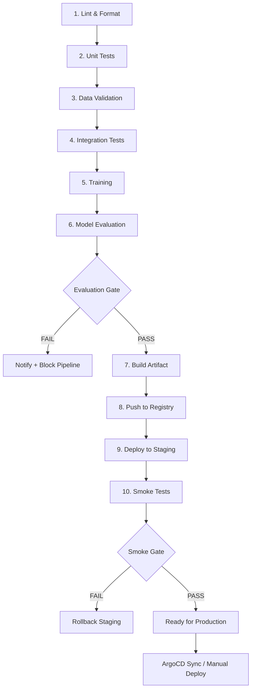
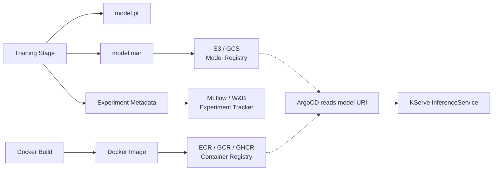

# ⚙️ 02 — ML Pipeline Design: Stages, GPU Runners, and Artifacts

## 🎯 Learning Objectives

- Design a 10-stage ML CI/CD pipeline from lint to production deployment — what each stage does, gate conditions, and expected runtimes
- Distinguish between CPU pipeline stages (lint, test, validate) and GPU pipeline stages (training, evaluation) — cost and runner configuration
- Configure GitHub Actions self-hosted GPU runners with A100/V100 labels for training jobs — 10× cost reduction vs GitHub-hosted runners
- Implement multi-level caching: Python dependencies, Docker layers, DVC-pulled datasets — avoid re-downloading 50GB datasets on every commit
- Define artifact promotion: model binary → MLflow Registry, Docker image → ECR/GCR, metadata → experiment tracker — the inventory of a model deployment

## Introduction

An ML CI/CD pipeline is a directed acyclic graph of stages where each stage consumes artifacts from previous stages, runs its own checks, and either passes the baton to the next stage or fails the pipeline. A software CI/CD pipeline typically has 3–5 stages (lint, test, build, deploy). An ML pipeline needs 8–12 — not because ML engineers love complexity, but because the failure surface is larger. Code can be wrong. Data can be wrong. Models can be wrong. And each of these failure modes requires its own detection mechanism at a specific point in the pipeline.


The pipeline in this note produces the Git commit that ArgoCD watches in [[01 - GitOps and ArgoCD for ML Infrastructure|Note 01]]. The model evaluation gates feed into the deployment strategies in [[03 - Canary Deployments, Shadow Mode and Rollback Strategies|Note 03]]. The pipeline is not a sequence of bash scripts — it is **pipeline as code**, versioned in `.github/workflows/ml-pipeline.yml`, reviewed in PRs, and the first line of defense against broken models in production.

---

## 1. The 10-Stage ML Pipeline



Each stage is a gate. If the stage fails, the pipeline stops. No code, data, or model artifact passes to the next stage without validation. The cost of a false positive (failing the pipeline when nothing is wrong) is a re-run. The cost of a false negative (passing the pipeline when something IS wrong) is a broken production model.

### Stage-by-Stage Deep Dive

#### Stage 1: Lint & Format (\(\approx 30\) seconds, CPU)

```yaml
- name: Lint & Format
  run: |
    black --check src/ tests/
    isort --check-only src/ tests/
    ruff check src/ tests/
    mypy src/
```

Catches import order violations, type errors, unused variables, and style inconsistencies. This is the cheapest failure to catch — it runs in 30 seconds on a free CPU runner. A PR with lint failures should never reach code review.

💡 Add `pre-commit` hooks to your local checkout so lint errors are caught BEFORE `git push`. CI lint is the safety net. `pre-commit` is the prevention.

#### Stage 2: Unit Tests (\(\approx 2\) minutes, CPU)

```yaml
- name: Unit Tests
  run: |
    pytest tests/unit/ \
      --cov=src/ \
      --cov-report=xml \
      --cov-fail-under=80 \
      -n auto
```

Pure Python tests: data loading functions, feature engineering transforms, model utilities, API endpoints. No GPU required. No external services. Runs `pytest` in parallel (`-n auto`) with `pytest-xdist` to use all CPU cores.

#### Stage 3: Data Validation (\(\approx 3\) minutes, CPU)

```yaml
- name: Data Validation
  run: |
    dvc pull data/train.csv.dvc
    python -m src.validate_data \
      --data data/train.csv \
      --expectations config/expectations.json \
      --output validation-results/
    great_expectations checkpoint run churn_data
```

The first ML-specific gate. Validates: schema completeness (all expected columns present), value ranges (age 0–120, charges \(\ge 0\)), category membership (contract types match expected set), null rate (missingness within acceptable thresholds), and distribution drift (statistical distance from training baseline below threshold).

⚙️ Data validation failures block training. If 15% of values in `monthly_charges` are null — a schema violation — the pipeline stops. Training on corrupted data produces a corrupted model. This is covered in depth in [[../28 - Testing in ML Systems/01 - Data Validation - Great Expectations, Pandera and TFX Data Validation|Data Validation]].

#### Stage 4: Integration Tests (\(\approx 5\) minutes, CPU)

```yaml
- name: Integration Tests
  run: |
    docker-compose -f docker/docker-compose.test.yml up -d
    sleep 10  # Wait for services
    pytest tests/integration/ -v
    docker-compose -f docker/docker-compose.test.yml down
```

Spin up dependent services (feature store, model registry, database), run end-to-end tests that exercise the full inference path: request → feature retrieval → preprocessing → prediction → response. Tests verify contracts: the model expects feature `X` in range `[0, 100]` and the feature store actually provides it in that range.

#### Stage 5: Training (\(\approx 45\) minutes to 4 hours, GPU)

```yaml
- name: Train Model
  runs-on: [self-hosted, gpu, a100]
  run: |
    dvc repro train  # Reproducible training via DVC pipeline
    python -m src.train \
      --config config/training/v2.yaml \
      --data data/processed/train.parquet \
      --output models/churn-v${GITHUB_RUN_NUMBER}.pt
```

The GPU stage. Self-hosted runner with A100 or V100 label. Training uses DVC pipeline (`dvc repro`) for reproducibility — the pipeline stage is defined in `dvc.yaml`, and DVC tracks which data, code, and parameters produced which model output.

#### Stage 6: Model Evaluation (\(\approx 15\) minutes, GPU)

```yaml
- name: Evaluate Model
  runs-on: [self-hosted, gpu, a100]
  run: |
    python -m src.evaluate \
      --model models/churn-v${GITHUB_RUN_NUMBER}.pt \
      --test-data data/processed/test.parquet \
      --baseline-model models/production/churn-current.pt \
      --thresholds config/evaluation/thresholds.yaml \
      --output evaluation-results/
```

The critical gate. Four checks determine whether the model advances:

1. **Performance threshold**: $\text{AUC}_{\text{new}} \ge \text{AUC}_{\text{baseline}} - 0.02$ (allow minor regression with explicit justification)
2. **Slice performance**: No subgroup degrades by > 5% relative to baseline
3. **Fairness parity**: $\max(|\text{FPR}_{\text{group}} - \text{FPR}_{\text{overall}}|) \le 0.05$
4. **Latency budget**: P99 inference latency \(\le 100\)ms on target hardware

If any check fails, the pipeline publishes an evaluation report as a PR comment, tags the data science team, and blocks deployment. The model is quarantined for investigation.

```yaml
# config/evaluation/thresholds.yaml
thresholds:
  auc_min: 0.85
  auc_relative_drop_max: 0.02  # Allow 2% regression
  slice_relative_drop_max: 0.05
  fairness_disparity_max: 0.05
  latency_p99_ms: 100
```

#### Stage 7: Build Artifact (\(\approx 3\) minutes, CPU)

```yaml
- name: Build Model Artifact
  run: |
    torch-model-archiver \
      --model-name churn-predictor \
      --version ${GITHUB_RUN_NUMBER} \
      --serialized-file models/churn-v${GITHUB_RUN_NUMBER}.pt \
      --handler src/serving/handler.py \
      --export-path model-store/
    docker build \
      -t registry.company.com/ml/churn-predictor:${GITHUB_RUN_NUMBER} \
      -t registry.company.com/ml/churn-predictor:latest \
      -f docker/Dockerfile.serving .
```

Two artifacts are produced: the model archive (`.mar` file for TorchServe or raw `.pt` for custom serving) and the Docker image containing the inference server.

#### Stage 8: Push to Registry (\(\approx 2\) minutes, CPU)

```yaml
- name: Push Artifacts
  run: |
    aws s3 cp model-store/churn-predictor.mar \
      s3://ml-models/churn-predictor/v${GITHUB_RUN_NUMBER}/
    docker push registry.company.com/ml/churn-predictor:${GITHUB_RUN_NUMBER}
    mlflow models register \
      --model-uri s3://ml-models/churn-predictor/v${GITHUB_RUN_NUMBER}/ \
      --name churn-predictor
```

Three registries, three artifacts:
- **S3/GCS**: model binary (.mar, .pt) — consumed by KServe InferenceService
- **ECR/GCR/ghcr.io**: Docker image — the inference server container
- **MLflow Registry**: model metadata — experiment ID, hyperparameters, metrics, author

#### Stage 9: Deploy to Staging (\(\approx 1\) minute, CPU)

```yaml
- name: Deploy to Staging
  run: |
    # Update model version in staging ConfigMap
    yq eval '.data.model-uri = "s3://ml-models/churn-predictor/v${GITHUB_RUN_NUMBER}/"' \
      k8s/staging/model-version-configmap.yaml -i
    git config user.name "ci-pipeline"
    git config user.email "ci@company.com"
    git add k8s/staging/model-version-configmap.yaml
    git commit -m "deploy: churn-predictor v${GITHUB_RUN_NUMBER} to staging"
    git push origin main
```

The pipeline commits the new model version to Git. ArgoCD detects the change and syncs the staging cluster. The pipeline does NOT `kubectl apply` — it delegates to GitOps.

#### Stage 10: Smoke Tests (\(\approx 5\) minutes, CPU against staging)

```yaml
- name: Smoke Tests
  run: |
    STAGING_URL=$(kubectl get inferenceservice churn-predictor-staging \
      -n churn-inference-staging -o jsonpath='{.status.url}')
    python -m tests.smoke \
      --url "https://${STAGING_URL}/v1/models/churn-predictor:predict" \
      --samples data/smoke-test/samples.json \
      --expected-keys "churn_probability" "prediction" \
      --max-latency-ms 500 \
      --min-success-rate 0.99
```

Smoke tests verify: the endpoint is reachable, predictions have the expected shape and range, and latency is within SLO (500ms in staging, relaxed from the production 100ms). If smoke tests fail, the pipeline marks staging as unhealthy and blocks production deployment.

---

## 2. GPU Runners: Self-Hosted vs GitHub-Hosted

Training requires GPUs. GitHub-hosted runners do not provide GPUs. The options:

| Option | Cost | Setup Complexity | GPU Types | Idle Cost |
|--------|------|-----------------|-----------|-----------|
| **GitHub-hosted** | N/A (no GPU) | Zero | None | N/A |
| **Self-hosted on-prem** | Electricity + hardware amortization | High (rack, networking, maintenance) | A100, H100 | Always on |
| **Self-hosted on EC2/GCE** | ~$3/hr (A100 on-demand) | Medium (startup script + autoscaling) | A100, V100, T4 | Spot instances or shutdown |
| **Actions Runner Controller (ARC)** | EC2/GCE instance costs | Medium (Kuberenetes operator) | A100, V100 | Scale-to-zero pods |

### Self-Hosted Runner Configuration

```yaml
# .github/workflows/ml-pipeline.yml
jobs:
  train:
    runs-on: [self-hosted, gpu, a100]  # Targets runners with both labels
    steps:
      - uses: actions/checkout@v4
      - name: Verify GPU
        run: nvidia-smi  # Confirm GPU is available
      - name: Train
        run: python -m src.train --device cuda
```

Runner labels enable job routing: lint and test jobs use `ubuntu-latest` (free CPU runner), training jobs use `[self-hosted, gpu, a100]`, and evaluation jobs use `[self-hosted, gpu, a100]` or `[self-hosted, gpu, v100]` depending on model size.

### ¡Sorpresa! Self-Hosted GPU Runners Can Cost Nearly $0

The math: GitHub Actions free tier provides 2,000 CPU minutes/month. CPU stages (lint, test, validate, build) run entirely on free runners. GPU stages run on self-hosted runners. If you use on-premises hardware (company GPU server in the office), the marginal cost is electricity — roughly $0.50/hour for an A100. If you use EC2 spot instances with auto-shutdown after idle, the cost drops to ~$0.80/hour (spot pricing vs $3/hr on-demand). A 4-hour training run costs $3.20 on spot vs $12 on-demand.

An Actions Runner Controller (ARC) on Kubernetes can auto-scale GPU runners:

```yaml
# ARC HorizontalRunnerAutoscaler for GPU runners
apiVersion: actions.github.com/v1alpha1
kind: HorizontalRunnerAutoscaler
metadata:
  name: gpu-runner-autoscaler
spec:
  scaleTargetRef:
    name: gpu-runner-deployment
  minReplicas: 0          # Scale to zero when idle
  maxReplicas: 4          # Max 4 concurrent training jobs
  metrics:
    - type: TotalNumberOfQueuedAndInProgressWorkflowRuns
      repositoryNames:
        - ml-platform
```

When no training job is queued, zero GPU runners are running. Zero cost. When a training job starts, ARC provisions a GPU node, the runner registers, the job executes, the job completes, and if no further jobs are queued, the runner scales back to zero.

---

## 3. Pipeline Caching: Don't Re-Download 50GB Datasets

The most expensive line in a naive ML CI pipeline:

```bash
# This downloads 50GB on EVERY. SINGLE. COMMIT.
dvc pull data/train.parquet data/test.parquet
```

### Multi-Level Caching Strategy

```yaml
# .github/workflows/ml-pipeline.yml
jobs:
  lint-and-test:
    steps:
      - uses: actions/checkout@v4

      # Cache 1: Python dependencies
      - uses: actions/cache@v4
        with:
          path: ~/.cache/pip
          key: pip-${{ runner.os }}-${{ hashFiles('requirements.txt') }}
          restore-keys: pip-${{ runner.os }}-

      # Cache 2: DVC data cache (the big one)
      - uses: actions/cache@v4
        with:
          path: .dvc/cache
          key: dvc-${{ hashFiles('data/*.dvc', 'dvc.lock') }}
          restore-keys: dvc-

      # Cache 3: Docker layer cache
      - uses: docker/setup-buildx-action@v3
      - uses: docker/build-push-action@v5
        with:
          cache-from: type=gha      # GitHub Actions cache
          cache-to: type=gha,mode=max

      # Cache 4: Pre-trained model cache (HuggingFace, torch hub)
      - uses: actions/cache@v4
        with:
          path: ~/.cache/huggingface
          key: hf-models-${{ hashFiles('config/model.yaml') }}
```

| Cache Target | Size | Invalidation Trigger | Hit Rate |
|-------------|------|---------------------|----------|
| pip cache | ~500MB | `requirements.txt` changes | ~95% |
| DVC cache | 5–50GB | `dvc.lock` or `.dvc` files change | ~70% |
| Docker layers | 2–10GB | `Dockerfile` changes | ~80% |
| HuggingFace cache | 1–20GB | Model config changes | ~90% |

A fully cached pipeline run completes the CPU stages in 5–10 minutes instead of 45 minutes (downloading 50GB of training data at 20MB/s = 42 minutes of download time).

⚠️ GitHub Actions cache is limited to 10GB per repository. For datasets larger than 10GB, use DVC with remote storage (S3, GCS) and control download frequency via DVC lockfile hashing. Alternatively, use a persistent EBS volume attached to self-hosted runners as a data cache mount.

---

## 4. Artifact Management: The Three Registries

At the end of a successful ML pipeline, three artifacts exist in three registries:



### Model Binary → S3/GCS

```bash
aws s3 cp model-store/churn-predictor.mar \
  s3://ml-models/churn-predictor/v1.4.0/ \
  --metadata "commit=${GITHUB_SHA},pipeline=${GITHUB_RUN_ID},accuracy=0.947"
```

The model URI (`s3://ml-models/churn-predictor/v1.4.0/`) is the value written to the Git ConfigMap that ArgoCD watches. This is the chain: pipeline produces model → writes URI to Git → ArgoCD applies URI to InferenceService → KServe downloads model from S3 → inference starts.

### Docker Image → Container Registry

```bash
docker tag churn-predictor:latest \
  registry.company.com/ml/churn-predictor:${GITHUB_RUN_NUMBER}
docker tag churn-predictor:latest \
  registry.company.com/ml/churn-predictor:latest
docker push registry.company.com/ml/churn-predictor:${GITHUB_RUN_NUMBER}
docker push registry.company.com/ml/churn-predictor:latest
```

Two tags: the specific pipeline run ID (immutable, auditable) and `latest` (mutable, convenient for staging). Production deployments reference the specific tag, never `latest`.

### Experiment Metadata → MLflow/W&B

```python
import mlflow

with mlflow.start_run(run_name=f"ci-{GITHUB_RUN_NUMBER}"):
    mlflow.log_params(config["training"])
    mlflow.log_metrics({
        "test_auc": evaluation["auc"],
        "test_f1": evaluation["f1"],
        "p99_latency_ms": evaluation["latency_p99"],
    })
    mlflow.log_artifact("config/training/v2.yaml")
    mlflow.pytorch.log_model(
        model,
        artifact_path="model",
        registered_model_name="churn-predictor"
    )
```

Every pipeline run creates an MLflow experiment entry with: hyperparameters, evaluation metrics, the training config, the model artifact, and pipeline metadata (commit SHA, run ID, timestamp). This is the provenance record for every model in production.

---

## 5. Pipeline as Code: The Complete Workflow

```yaml
# .github/workflows/ml-pipeline.yml (concise version)
name: ML CI/CD Pipeline

on:
  push:
    branches: [main]
    paths:
      - "src/**"
      - "config/**"
      - "data/**"
      - "docker/**"
  pull_request:
    branches: [main]
    paths:
      - "src/**"
      - "config/**"
  workflow_dispatch:  # Manual trigger for retraining

jobs:
  lint-and-test:
    runs-on: ubuntu-latest
    steps:
      - uses: actions/checkout@v4
      - uses: actions/setup-python@v5
        with: { python-version: "3.11" }
      - uses: actions/cache@v4
        with: { path: ~/.cache/pip, key: pip-${{ hashFiles('requirements.txt') }} }
      - run: pip install -r requirements.txt
      - run: black --check src/ tests/
      - run: ruff check src/ tests/
      - run: mypy src/
      - run: pytest tests/unit/ --cov=src/ --cov-fail-under=80

  validate-data:
    needs: lint-and-test
    runs-on: ubuntu-latest
    steps:
      - uses: actions/checkout@v4
      - uses: actions/cache@v4
        with: { path: .dvc/cache, key: dvc-${{ hashFiles('data/*.dvc', 'dvc.lock') }} }
      - run: dvc pull data/train.csv.dvc
      - run: great_expectations checkpoint run churn_data
      - run: python -m src.validate_data --data data/train.csv

  train-and-evaluate:
    needs: validate-data
    if: github.ref == 'refs/heads/main'
    runs-on: [self-hosted, gpu, a100]
    steps:
      - uses: actions/checkout@v4
      - run: nvidia-smi
      - uses: actions/cache@v4
        with: { path: .dvc/cache, key: dvc-${{ hashFiles('data/*.dvc', 'dvc.lock') }} }
      - run: dvc repro train
      - run: python -m src.train --output models/churn-v${{ github.run_number }}.pt
      - run: python -m src.evaluate --model models/churn-v${{ github.run_number }}.pt
        id: evaluate

  build-and-push:
    needs: train-and-evaluate
    runs-on: ubuntu-latest
    steps:
      - uses: actions/checkout@v4
      - uses: docker/setup-buildx-action@v3
      - uses: docker/login-action@v3
        with:
          registry: registry.company.com
          username: ${{ secrets.REGISTRY_USER }}
          password: ${{ secrets.REGISTRY_PASS }}
      - uses: docker/build-push-action@v5
        with:
          push: true
          tags: registry.company.com/ml/churn-predictor:${{ github.run_number }}
          cache-from: type=gha
          cache-to: type=gha,mode=max

  deploy-staging:
    needs: build-and-push
    runs-on: ubuntu-latest
    environment: staging
    steps:
      - uses: actions/checkout@v4
      - run: |
          yq eval '.data.model-uri = "s3://ml-models/churn-predictor/v${{ github.run_number }}/"' \
            k8s/staging/model-version-configmap.yaml -i
          git config user.name "ci-pipeline"
          git add k8s/staging/
          git commit -m "deploy: churn-predictor v${{ github.run_number }} to staging [skip-ci]"
          git push

  smoke-tests:
    needs: deploy-staging
    runs-on: ubuntu-latest
    steps:
      - uses: actions/checkout@v4
      - run: sleep 120  # Wait for ArgoCD sync + KServe revision ready
      - run: |
          URL=$(kubectl get inferenceservice churn-predictor-staging \
            -n churn-inference-staging -o jsonpath='{.status.url}')
          python -m tests.smoke --url "https://${URL}/v1/models/churn-predictor:predict"
```

---

## 6. Cost Analysis: Free Tier vs GPU Costs

### Pipeline Cost Breakdown (per run)

| Stage | Runner | Duration | Cost | Notes |
|-------|--------|----------|------|-------|
| Lint & Format | GitHub-hosted | 30s | $0 | Free tier: 2,000 min/month |
| Unit Tests | GitHub-hosted | 2m | $0 | Parallel with pytest-xdist |
| Data Validation | GitHub-hosted | 3m | $0 | + data download time if uncached |
| Integration Tests | GitHub-hosted | 5m | $0 | Docker Compose overhead |
| Training | Self-hosted GPU | 45m – 4h | $0 – $3.20 | Spot pricing A100: ~$0.80/hr |
| Evaluation | Self-hosted GPU | 15m | $0 – $0.20 | Same instance as training |
| Build & Push | GitHub-hosted | 5m | $0 | Docker layer caching critical |
| Deploy Staging | GitHub-hosted | 1m | $0 | `yq` + `git commit` only |
| Smoke Tests | GitHub-hosted | 5m | $0 | HTTP requests to staging |

**Total CPU cost per run**: $0 (within free tier). **Total GPU cost per run**: $0.60 – $3.20 depending on training duration and spot/demand pricing.

### ❌ The "All On-Demand" Anti-Pattern

Running training on an on-demand A100 ($3/hr) for every commit, downloading the 50GB dataset every time, and building Docker images without layer caching:

```
4h training × $3/hr = $12.00
40m data download (no cache) = wasted pipeline time
10m Docker build (no cache) = wasted pipeline time
Total: $12/run × 20 runs/month = $240/month
```

### ✅ The Optimized Pipeline

Self-hosted spot GPU, DVC cache, Docker layer cache:

```
4h training × $0.80/hr = $3.20
0m data download (cache hit) = $0
1m Docker build (layer cache hit) = $0
Total: $3.20/run × 20 runs/month = $64/month
```

**Caso real: HuggingFace's model hub** runs CI pipelines that validate every uploaded model. Each pipeline: (1) scans for malicious pickle files using `picklescan`, (2) runs inference smoke tests with dummy inputs, (3) generates model cards from metadata, (4) pushes validated models to the hub. Thousands of models are validated daily, and the pipeline rejects models with security issues, missing metadata, or inference failures. Before CI, every model was manually reviewed — a bottleneck that limited daily uploads to ~50. After CI: ~2,000 models validated per day, zero human reviewers.

---

## 🎯 Key Takeaways

- ML pipelines need 8–12 stages because failures can be in code, data, OR model behavior — each requires its own detection gate
- Data validation and model evaluation are the two ML-specific gates that software pipelines lack — they are the most common failure points in production
- Self-hosted GPU runners with spot pricing reduce training costs by 75–90% vs on-demand — a 4-hour training run costs $3.20 instead of $12
- Multi-level caching (pip, DVC, Docker layers, model weights) is the difference between a 10-minute pipeline and a 90-minute pipeline
- Three artifacts, three registries: model binary (S3/GCS), Docker image (ECR/GCR), experiment metadata (MLflow/W&B) — each has its own lifecycle
- Pipeline as code in `.github/workflows/` ensures every deployment is reproducible, auditable, and reviewable
- The pipeline produces a Git commit; ArgoCD consumes it — CI and CD are separate concerns with a clean interface

## 📦 Código de Compresión

```yaml
# Full ML CI/CD pipeline — GitHub Actions
name: ML Pipeline
on:
  push: { branches: [main] }
  workflow_dispatch:
jobs:
  lint: { runs-on: ubuntu-latest, steps: [{ uses: actions/checkout@v4 }, { run: "ruff check src/ && black --check src/" }] }
  test: { needs: lint, runs-on: ubuntu-latest, steps: [{ uses: actions/checkout@v4 }, { run: "pytest --cov --cov-fail-under=80" }] }
  validate: { needs: test, runs-on: ubuntu-latest, steps: [{ uses: actions/checkout@v4 }, { run: "dvc pull && great_expectations checkpoint run data_quality" }] }
  train: { needs: validate, runs-on: [self-hosted, gpu, a100], steps: [{ uses: actions/checkout@v4 }, { run: "nvidia-smi && dvc repro train" }] }
  eval: { needs: train, runs-on: [self-hosted, gpu, a100], steps: [{ uses: actions/checkout@v4 }, { run: "python evaluate.py --model output/model.pt --baseline prod/model.pt" }] }
  build: { needs: eval, runs-on: ubuntu-latest, steps: [{ uses: docker/build-push-action@v5, with: { tags: "registry/ml:${{ github.run_number }}", push: true } }] }
  deploy: { needs: build, runs-on: ubuntu-latest, steps: [{ run: "yq '.data.model-uri=\"s3://v${{ github.run_number }}\"' k8s/configmap.yaml -i && git commit -am 'deploy v${{ github.run_number }}' && git push" }] }
```

## References

- Humble, J., & Farley, D. (2010). *Continuous Delivery*. Addison-Wesley. — The foundational CI/CD text.
- GitHub Actions. (2024). *Workflow syntax for GitHub Actions*. https://docs.github.com/en/actions/using-workflows/workflow-syntax-for-github-actions
- DVC. (2024). *Data Version Control — ML Pipeline Management*. https://dvc.org/doc/user-guide/pipelines
- MLflow. (2024). *MLflow Model Registry*. https://mlflow.org/docs/latest/model-registry.html
- Actions Runner Controller. (2024). *ARC — Kubernetes Operator for GitHub Actions*. https://github.com/actions/actions-runner-controller
- [[01 - GitOps and ArgoCD for ML Infrastructure]]
- [[03 - Canary Deployments, Shadow Mode and Rollback Strategies]]
- [[../28 - Testing in ML Systems/01 - Data Validation - Great Expectations, Pandera and TFX Data Validation]]
- [[../30 - TorchServe/01 - TorchServe Architecture - MAR Files and Model Archiver]]
