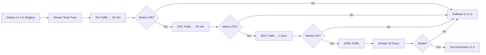
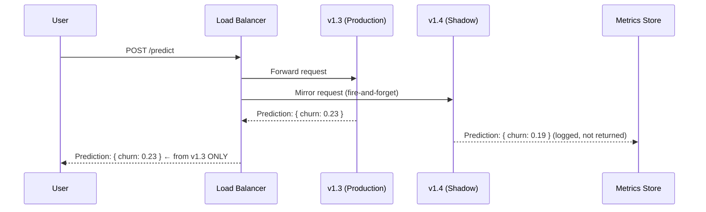
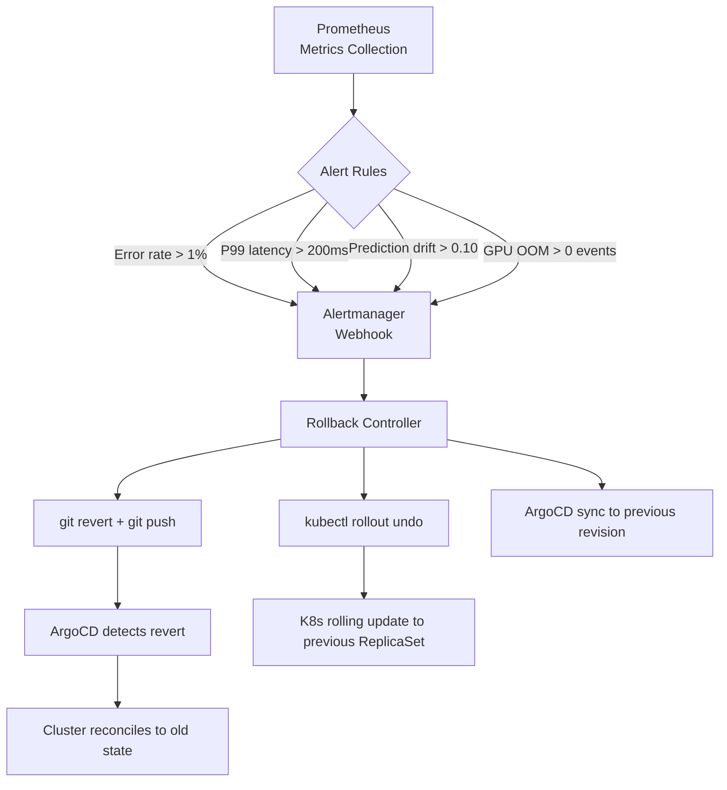
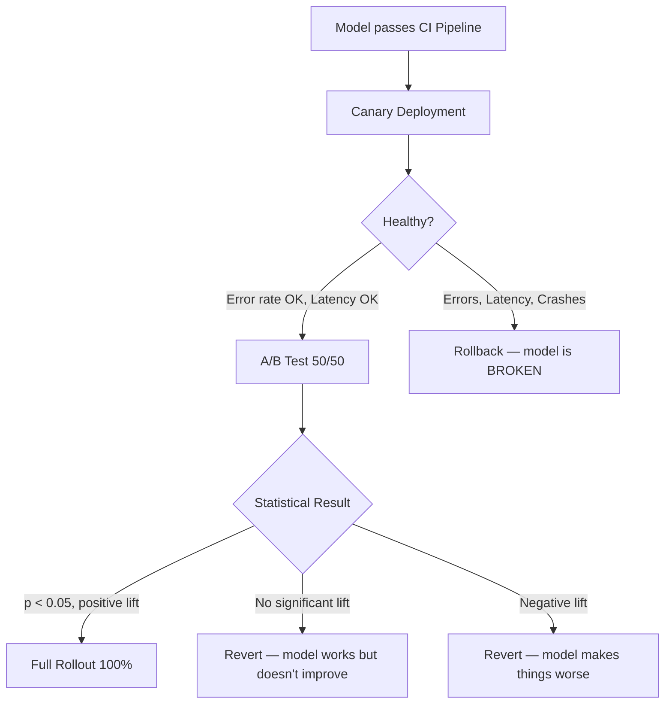

# 🐦 03 — Canary Deployments, Shadow Mode, and Rollback Strategies

## 🎯 Learning Objectives

- Implement canary deployments for ML models — staged traffic shifting (5% → 25% → 50% → 100%) with automated metric-driven gates
- Configure shadow/mirror deployments that duplicate production traffic to a new model without user impact — offline comparison before switching
- Design automated rollback triggers using Prometheus alerts — latency thresholds, error rate thresholds, prediction drift, GPU OOM events
- Differentiate canary deployments (engineering regression testing) from A/B testing (product experimentation) — different tools, different stakeholders
- Apply Istio VirtualService traffic splitting and KServe `canaryTrafficPercent` for Kubernetes-native canary deployment
- Calculate canary risk exposure: with 5% traffic and a 2% error rate increase, how many users are affected before automatic rollback?

## Introduction

Deploying a model to 100% of production traffic at 3 AM and "watching the logs" is not a deployment strategy — it is a prayer. ML models degrade in ways that software does not: a 2% accuracy drop, a latency regression on specific input patterns, a fairness issue affecting one demographic group. None of these trigger 500 errors. None of these cause pods to crash. All of them silently degrade the user experience for hours, days, or weeks until someone notices a dashboard dip.


Canary and shadow deployments are the two primary strategies for validating model changes against real traffic before full rollout. They complement the pipeline gates from [[02 - ML Pipeline Design — Stages, GPU Runners and Artifacts|Note 02]] and integrate with the ArgoCD-driven deployments from [[01 - GitOps and ArgoCD for ML Infrastructure|Note 01]]. Where the CI pipeline validates the model against historical test data, canary and shadow deployments validate the model against CURRENT production data — the only data that actually matters.

---

## 1. Canary Deployments: Gradual, Gated, Reversible

A canary deployment exposes the new model to a small percentage of production traffic, monitors key metrics, and progressively increases traffic if metrics remain healthy. Named for the canaries miners carried into coal mines to detect toxic gases, the new model is the canary: if it dies, only a small fraction of users noticed.

### The Canary Staircase



The stair-step approach limits blast radius at each stage. If v1.4 introduces a 2% error rate increase, only 5% of users experience it for 15 minutes before the pipeline rolls back — roughly 50 affected users in a system serving 10,000 requests/minute. Compare this to a 100% deployment: 10,000 users affected in the first minute.

### KServe Canary Deployment

KServe natively supports canary deployments via the `canaryTrafficPercent` field:

```yaml
# Step 1: Deploy baseline model (v1.3) — 100% traffic
apiVersion: serving.kserve.io/v1beta1
kind: InferenceService
metadata:
  name: churn-predictor
spec:
  predictor:
    pytorch:
      storageUri: "s3://ml-models/churn-predictor/v1.3.0/"

---
# Step 2: Deploy canary model (v1.4) — 5% traffic
apiVersion: serving.kserve.io/v1beta1
kind: InferenceService
metadata:
  name: churn-predictor-canary
  annotations:
    serving.kserve.io/enable-tag-routing: "true"
spec:
  predictor:
    canaryTrafficPercent: 5
    pytorch:
      storageUri: "s3://ml-models/churn-predictor/v1.4.0/"
```

KServe manages the traffic split internally via Knative routing. When `canaryTrafficPercent: 5`, Knative sends 5% of requests to the canary revision and 95% to the baseline revision. The routing is at the Knative activator level — no external service mesh configuration required for basic canary.

```bash
# Monitor canary rollout
kubectl get inferenceservice churn-predictor-canary -o jsonpath='{.status.components.predictor.latestReadyRevision}'

# Increase canary traffic to 25%
kubectl patch inferenceservice churn-predictor-canary \
  --type='json' \
  -p='[{"op": "replace", "path": "/spec/predictor/canaryTrafficPercent", "value": 25}]'

# Promote canary to baseline (100%)
# 1. Update baseline InferenceService to point to v1.4
# 2. Delete the canary InferenceService
kubectl patch inferenceservice churn-predictor \
  --type='json' \
  -p='[{"op": "replace", "path": "/spec/predictor/pytorch/storageUri", "value": "s3://ml-models/churn-predictor/v1.4.0/"}]'
kubectl delete inferenceservice churn-predictor-canary
```

### Istio VirtualService Canary

For teams using Istio as the service mesh, traffic splitting is configured at the VirtualService level:

```yaml
apiVersion: networking.istio.io/v1beta1
kind: VirtualService
metadata:
  name: churn-predictor-vs
  namespace: churn-inference
spec:
  hosts:
    - churn-predictor.churn-inference.svc.cluster.local
  http:
    - match:
        - headers:
            canary:
              exact: "true"       # Internal testing header — always canary
      route:
        - destination:
            host: churn-predictor-v1-4
            port:
              number: 8080
    - route:
        - destination:
            host: churn-predictor-v1-3
            port:
              number: 8080
          weight: 95
        - destination:
            host: churn-predictor-v1-4
            port:
              number: 8080
          weight: 5
```

Istio's `weight` field provides fine-grained traffic splitting. The `match` rule with header `canary: true` allows internal testers to force canary routing for manual verification before any production traffic reaches it.

### Automated Canary Promotion with Analysis

A basic canary deployment still requires a human to look at dashboards and decide when to increase traffic. An advanced setup uses automated analysis:

```yaml
# Argo Rollouts AnalysisTemplate — automated canary analysis
apiVersion: argoproj.io/v1alpha1
kind: AnalysisTemplate
metadata:
  name: ml-canary-analysis
spec:
  args:
    - name: service-name
    - name: baseline-hash
    - name: canary-hash
  metrics:
    - name: error-rate
      interval: 1m
      count: 5           # Evaluate over 5 minutes
      successCondition: result[0] <= 0.01  # Error rate must stay ≤ 1%
      failureLimit: 2    # 2 consecutive failures → rollback
      provider:
        prometheus:
          address: http://prometheus.monitoring.svc:9090
          query: |
            sum(rate(http_requests_total{
              service="{{args.service-name}}",
              pod=~"{{args.canary-hash}}.*",
              status=~"5.."
            }[1m])) /
            sum(rate(http_requests_total{
              service="{{args.service-name}}",
              pod=~"{{args.canary-hash}}.*"
            }[1m]))
    - name: latency-p99
      interval: 1m
      count: 5
      successCondition: result[0] <= 200   # P99 ≤ 200ms
      failureLimit: 2
      provider:
        prometheus:
          address: http://prometheus.monitoring.svc:9090
          query: |
            histogram_quantile(0.99,
              sum(rate(http_request_duration_seconds_bucket{
                service="{{args.service-name}}",
                pod=~"{{args.canary-hash}}.*"
              }[1m])) by (le))
    - name: prediction-drift
      interval: 5m
      count: 3
      successCondition: result[0] <= 0.10   # PSI ≤ 0.10
      failureLimit: 1
      provider:
        prometheus:
          address: http://prometheus.monitoring.svc:9090
          query: |
            model_drift_psi{
              model="{{args.service-name}}",
              revision="{{args.canary-hash}}"
            }
```

Three metrics gate automatic canary promotion:

1. **Error rate**: If the canary's 5xx rate exceeds 1%, roll back — something is broken.
2. **P99 latency**: If the canary's tail latency exceeds 200ms, the model is too slow — users are waiting.
3. **Prediction drift (PSI)**: If the canary's prediction distribution differs from baseline by PSI > 0.10, the model is behaving differently — investigate before promoting.

If all three metrics stay green for the required duration, Argo Rollouts automatically promotes the canary to the next traffic percentage or to full rollout.

### ❌ Deploy-at-3-AM-and-Watch-the-Logs vs ✅ Automated Canary

**❌** Anti-pattern:

```bash
# Deploy to 100% at 3 AM
kubectl apply -f inference-service-v1.4.yaml
# Watch logs for 15 minutes
kubectl logs -f deploy/churn-predictor-v1-4
# "Looks fine. Going back to sleep."
# Monday morning: 3,000 users saw incorrect churn predictions.
# Nobody knows because there are no canary metrics alerts.
```

**✅** Pattern:

```yaml
apiVersion: argoproj.io/v1alpha1
kind: Rollout
metadata:
  name: churn-predictor
spec:
  replicas: 3
  strategy:
    canary:
      steps:
        - setWeight: 5
        - pause: { duration: 15m }
        - setWeight: 25
        - pause: { duration: 30m }
        - setWeight: 50
        - pause: { duration: 60m }
        - setWeight: 100
      analysis:
        templates:
          - templateName: ml-canary-analysis
        startingStep: 1  # Begin analysis at first canary step
```

---

## 2. Shadow Deployments: Mirror Traffic, Zero User Impact

A shadow deployment runs the new model in parallel with production. 100% of production traffic is mirrored (copied) to the shadow model. The shadow model produces predictions, logs them, but **never sends a response to real users**. The production model handles all user-facing traffic. The shadow model is a silent observer, generating data for offline comparison.



Users never interact with the shadow model. Its predictions are logged alongside production predictions for offline analysis. After a week of comparisons, you analyze: distribution differences, prediction agreement rates, per-slice performance differences.

### Istio Shadow/Mirror Configuration

```yaml
apiVersion: networking.istio.io/v1beta1
kind: VirtualService
metadata:
  name: churn-predictor-vs
spec:
  hosts:
    - churn-predictor
  http:
    - route:
        - destination:
            host: churn-predictor-v1-3  # Production — serves real responses
      mirror:
        host: churn-predictor-v1-4      # Shadow — receives mirrored requests
      mirrorPercentage:
        value: 100.0                     # Mirror 100% of traffic
```

The `mirror` directive sends a copy of every request to v1.4. If v1.4 responds slowly or errors, those responses are discarded — they never reach the user. The `mirrorPercentage` field (Istio 1.18+) allows partial mirroring if 100% mirror traffic would overload the shadow model.

⚠️ Mirroring 100% of production traffic requires the shadow model to handle production-scale throughput. If the production model runs on 4 GPU nodes, the shadow model needs 4 GPU nodes too — doubling GPU cost during the shadow period. For most teams, 100% mirroring for 1–2 weeks is the cost of shipping a validated model.

### Shadow Analysis Pipeline

After a shadow period, an analysis job compares production and shadow predictions:

```python
# shadow_analysis.py — runs nightly during shadow period
import pandas as pd
from scipy.stats import ks_2samp
from evidently import ColumnMapping
from evidently.report import Report
from evidently.metrics import DataDriftTable

# Load predictions from both models (logged during shadow period)
prod_preds = pd.read_parquet("s3://ml-logs/churn-v1.3-predictions.parquet")
shadow_preds = pd.read_parquet("s3://ml-logs/churn-v1.4-shadow-predictions.parquet")

# 1. Distribution comparison: KS test
ks_stat, ks_pvalue = ks_2samp(prod_preds["churn_probability"],
                               shadow_preds["churn_probability"])
if ks_pvalue < 0.01:
    print(f"⚠️ Prediction distributions differ significantly (KS p={ks_pvalue:.4f})")

# 2. Agreement rate: how often do they agree on classification?
agreement = (prod_preds["class"] == shadow_preds["class"]).mean()
if agreement < 0.95:
    print(f"⚠️ Prediction agreement below threshold: {agreement:.2%}")

# 3. Per-slice comparison
for segment in ["premium", "basic", "enterprise"]:
    prod_seg = prod_preds[prod_preds["segment"] == segment]
    shadow_seg = shadow_preds[shadow_preds["segment"] == segment]
    seg_agreement = (prod_seg["class"] == shadow_seg["class"]).mean()
    if seg_agreement < 0.90:
        print(f"⚠️ {segment} segment agreement: {seg_agreement:.2%} — investigate!")

# 4. Evidently AI drift report
report = Report(metrics=[DataDriftTable()])
report.run(
    reference_data=prod_preds,
    current_data=shadow_preds,
    column_mapping=ColumnMapping(prediction="churn_probability")
)
report.save_html("shadow_drift_report.html")
```

### ¡Sorpresa! Shadow Deployments Catch Invisible Regressions

The most dangerous model regressions are invisible to standard monitoring. A latency drop triggers an alert. An error rate spike pages on-call. But a fairness regression — the model's false positive rate increases from 5% to 15% for a specific demographic group — triggers neither. Error rates stay flat. Latency stays flat. The model is silently discriminating, and nobody knows.

A shadow deployment catches this. The shadow analysis pipeline compares per-slice prediction distributions. If v1.4 flags 3× more users in a protected demographic as high-churn compared to v1.3, the nightly shadow analysis report flags it — before a single user is affected. The shadow period transforms "we found the fairness regression 3 weeks after deployment" into "our shadow analysis caught it on day 3; we never deployed it."

**Caso real: A major financial institution** ran a shadow deployment for a credit scoring model update. The shadow analysis detected that the new model denied credit to applicants from a specific ZIP code at 4× the rate of the baseline model. The regression was invisible to all monitoring — same accuracy, same F1, same latency. The model was never deployed. The data science team spent 2 weeks investigating the root cause (an upstream data pipeline change introduced geographic bias) and fixed it before the model ever touched a real user.

---

## 3. Automated Rollback Strategies

Canary and shadow deployments are only as good as their rollback mechanisms. A canary that detects a regression but requires a human to SSH into a pod and manually restore the old model is a canary with no teeth.

### Rollback Trigger Architecture



### Prometheus Alert Rules for ML Rollbacks

```yaml
# prometheus/alerts/ml-deployment.yml
groups:
  - name: ml-canary-alerts
    rules:
      - alert: CanaryErrorRateHigh
        expr: |
          (sum(rate(http_requests_total{service="churn-predictor",revision=~"canary.*",status=~"5.."}[5m]))
           /
           sum(rate(http_requests_total{service="churn-predictor",revision=~"canary.*"}[5m])))
          > 0.01
        for: 2m
        labels:
          severity: critical
          deployment: canary
        annotations:
          summary: "Canary error rate {{ $value | humanizePercentage }} exceeds 1%"
          action: "AUTOMATIC ROLLBACK INITIATED"

      - alert: CanaryLatencyRegression
        expr: |
          (
            histogram_quantile(0.99,
              sum(rate(http_request_duration_seconds_bucket{
                service="churn-predictor",revision=~"canary.*"
              }[5m])) by (le))
            /
            histogram_quantile(0.99,
              sum(rate(http_request_duration_seconds_bucket{
                service="churn-predictor",revision=~"baseline.*"
              }[5m])) by (le))
          ) > 2.0
        for: 5m
        labels:
          severity: critical
          deployment: canary
        annotations:
          summary: "Canary P99 latency {{ $value }}× baseline"
          action: "AUTOMATIC ROLLBACK INITIATED"

      - alert: PredictionDriftDetected
        expr: |
          model_drift_psi{model="churn-predictor",revision=~"canary.*"} > 0.15
        for: 10m
        labels:
          severity: warning
          deployment: canary
        annotations:
          summary: "Prediction drift PSI {{ $value }} exceeds 0.15 threshold"
          action: "Manual investigation recommended"

      - alert: GPUOutOfMemory
        expr: |
          increase(nvidia_gpu_memory_utilization_oom{deployment=~"churn-predictor-canary.*"}[5m]) > 0
        labels:
          severity: critical
          deployment: canary
        annotations:
          summary: "GPU OOM detected on canary deployment"
          action: "AUTOMATIC ROLLBACK — model too large for GPU"
```

### Manual vs Automatic Rollback

| Trigger | Manual Rollback | Automatic Rollback |
|---------|----------------|-------------------|
| **Error rate > 1%** | ❌ Takes 5–15 min for on-call to respond | ✅ 2 min alert + instant revert |
| **P99 latency > 2× baseline** | ❌ Users experiencing slowness for 15+ min | ✅ 5 min evaluation + automatic revert |
| **Prediction drift (PSI > 0.15)** | ⚠️ Acceptable if low severity | ✅ Recommended for mission-critical models |
| **GPU OOM** | ❌ Pods crash-looping while on-call pages | ✅ Immediate revert on first OOM event |
| **Fairness regression** | ❌ Detected weeks later in quarterly audit | 💡 Shadow deployment catches it; canary may not |

The rule of thumb: metrics that directly degrade user experience (errors, latency) → automatic rollback. Metrics that require context (drift, fairness) → automatic alert with manual investigation. The cost of an unnecessary rollback (re-running the pipeline, fixing the issue, re-deploying) is much lower than the cost of serving a broken model to users for 15 extra minutes.

### Rollback Speed by Mechanism

```
ArgoCD git revert + sync:  |██████████| 30–180 seconds  (git push + sync interval)
kubectl rollout undo:      |██| 10–30 seconds           (direct K8s API call)
KServe revision traffic:   |█| < 5 seconds              (Knative traffic shift)
```

KServe's Knative-based traffic shift is the fastest: Knative revision routing can shift 100% of traffic to the previous revision in under 5 seconds, because the routing table is updated in the activator/queue-proxy sidecar, not via pod restarts.

💡 For the fastest possible rollback, keep the previous KServe revision alive and configured with `minReplicas: 1` — the old model stays warm. Rollback = update the `traffic` block in the InferenceService spec to point 100% at the old revision. Knative shifts traffic in milliseconds without creating or destroying any pods.

---

## 4. Canary Deployments vs A/B Testing

These are frequently confused. They answer different questions for different stakeholders:

| Dimension | Canary Deployment | A/B Testing |
|-----------|------------------|-------------|
| **Question** | "Will the new model break?" | "Does the new model increase revenue?" |
| **Stakeholder** | Engineering, SRE | Product, Data Science |
| **Metric** | Error rate, latency, crash rate | Conversion rate, engagement, revenue |
| **Traffic split** | 5% → 25% → 50% → 100% (stair-step) | 50%/50% (fixed split for duration) |
| **Duration** | 1–4 hours | 1–4 weeks |
| **Decision** | Promoted or rolled back based on health | Evaluated statistically (t-test, Bayesian) |
| **Failure mode** | Model crashes / errors increase | Model works correctly but doesn't improve KPIs |
| **Tooling** | Argo Rollouts, KServe, Istio | Feature flags (LaunchDarkly), experiment platforms |

Canary: "Is the new model BROKEN?" (Engineering question — binary answer.)

A/B: "Is the new model BETTER?" (Product question — statistical answer.)

Both use traffic splitting. Both use production traffic. They exist at different points in the deployment lifecycle. A model must pass canary before entering A/B testing. A model that fails A/B testing is reverted — not because it was broken, but because it didn't improve outcomes.



---

## 5. Practical Deployment Pipeline Integration

Bringing it all together: the CI pipeline from [[02 - ML Pipeline Design — Stages, GPU Runners and Artifacts|Note 02]] produces a model artifact and commits the model version to Git. ArgoCD from [[01 - GitOps and ArgoCD for ML Infrastructure|Note 01]] deploys it to staging. Staging smoke tests pass. The model is promoted to production via canary:

```yaml
# Full deployment workflow: from CI pipeline output to canary rollout
# Step 1: CI pipeline completes → model artifact in S3 + Git commit
# Step 2: ArgoCD syncs staging → staging smoke tests pass
# Step 3: Deploy canary InferenceService
apiVersion: serving.kserve.io/v1beta1
kind: InferenceService
metadata:
  name: churn-predictor-canary
  annotations:
    serving.kserve.io/enable-tag-routing: "true"
spec:
  predictor:
    canaryTrafficPercent: 5
    pytorch:
      storageUri: "s3://ml-models/churn-predictor/v1.4.0/"
      resources:
        limits:
          nvidia.com/gpu: "1"

---
# Step 4: Argo Rollouts AnalysisTemplate monitors canary
# (see AnalysisTemplate in Section 1)

# Step 5: After 1 hour of healthy canary, promote to 100%
# Update baseline InferenceService to point to v1.4
# Remove canary InferenceService
# Total promotion cycle: ~2 hours (5% → 25% → 50% → 100%)
```

**Full-cycle timeline**: CI pipeline commit → ArgoCD detects → Staging deploy (~2 min sync) → Smoke tests (~5 min) → Canary 5% (15 min) → Canary 25% (30 min) → Canary 50% (1 hour) → 100%. Total: approximately 2 hours from Git commit to full production rollout. Rollback at any stage: approximately 5 seconds (KServe revision traffic shift) to 3 minutes (ArgoCD `git revert` + sync).

---

## 🎯 Key Takeaways

- Canary deployments stair-step traffic (5% → 25% → 50% → 100%) with automated metric gates at each step — limiting blast radius to the smallest possible user segment
- Shadow deployments duplicate 100% of production traffic to a silent model — catching regressions (including fairness/behavioral ones) before users ever interact with the new model
- Automated rollback triggers on error rate (>1%), P99 latency (>2× baseline), and prediction drift (PSI > 0.15) — Prometheus alerts → webhook → `git revert` or `kubectl rollout undo`
- KServe `canaryTrafficPercent` provides native Kubernetes canary with <5-second traffic shifts via Knative routing
- Canary tests for REGRESSIONS (engineering); A/B tests for IMPROVEMENTS (product) — different questions, different stakeholders, different durations
- The fastest rollback mechanism: keep the previous KServe revision warm (`minReplicas: 1`) and shift Knative traffic — sub-second revert
- A shadow deployment can detect fairness regressions invisible to latency and error-rate monitoring — the cost of shadow GPUs is cheaper than the cost of a biased model in production

## 📦 Código de Compresión

```yaml
# KServe Canary Deployment — model v1.4 at 5% traffic
apiVersion: serving.kserve.io/v1beta1
kind: InferenceService
metadata:
  name: model-canary
  annotations:
    serving.kserve.io/enable-tag-routing: "true"
spec:
  predictor:
    canaryTrafficPercent: 5
    pytorch:
      storageUri: "s3://models/model/v1.4/"
```

```yaml
# Istio VirtualService — 95% baseline, 5% canary + shadow mirror
apiVersion: networking.istio.io/v1beta1
kind: VirtualService
metadata:
  name: model-vs
spec:
  hosts: [model]
  http:
    - route:
        - destination:
            host: model-v1-3
          weight: 95
        - destination:
            host: model-v1-4
          weight: 5
      mirror:
        host: model-v1-5        # Silent shadow for next candidate
```

```bash
# Rollback — instant traffic shift to previous revision
kubectl patch inferenceservice model \
  --type='json' \
  -p='[{"op":"replace","path":"/spec/predictor/pytorch/storageUri","value":"s3://models/model/v1.3/"}]'
# Knative shifts traffic in <5 seconds. No pod restart required.
```

## References

- Argo Rollouts. (2024). *Progressive Delivery for Kubernetes*. https://argoproj.github.io/argo-rollouts/
- KServe. (2024). *Canary Rollout*. https://kserve.github.io/website/latest/modelserving/rollout/canary/
- Istio. (2024). *Traffic Mirroring*. https://istio.io/latest/docs/tasks/traffic-management/mirroring/
- Sato, D., et al. (2019). *Canary Deployments on Kubernetes*. Google Cloud Blog. https://cloud.google.com/blog/products/application-development/canary-deployments-on-kubernetes
- Evidently AI. (2024). *Data Drift and Model Monitoring*. https://docs.evidentlyai.com/
- [[01 - GitOps and ArgoCD for ML Infrastructure]]
- [[02 - ML Pipeline Design — Stages, GPU Runners and Artifacts]]
- [[../32 - KServe and Knative/01 - KServe - Serverless Model Serving with InferenceService]]
- [[../31 - Evidently AI and Phoenix/02 - Evidently AI — Reports, Test Suites and CI-CD Integration]]
