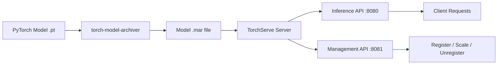

# 🏷️ Welcome to TorchServe

## 🎯 Learning Objectives
- Explain why a dedicated model serving framework is necessary beyond FastAPI/Flask wrappers
- Identify the three core components of the TorchServe ecosystem: server, model archiver, and handlers
- Navigate the 3-note course map covering architecture, custom handlers, and production deployment
- Understand TorchServe's role in the PyTorch/AWS production pipeline

## Introduction

TorchServe — literally **Torch** + **Serve** — is PyTorch's native model serving framework, born from the merger of PyTorch Serve and TorchScript serving infrastructure. Maintained jointly by AWS and the PyTorch team, it provides production-grade model serving out of the box: REST and gRPC APIs, multi-model endpoints, automatic batching, versioned model artifacts, and Prometheus metrics. If you've ever wrapped `model(x)` in a Flask endpoint and called it "deployed," this module will show you what you were missing.

The motivation for a dedicated serving framework is not academic. Raw PyTorch models are compute graphs wrapped in Python objects — they have no HTTP server, no request queuing, no batching strategy, no health checks, and no observability. A naive FastAPI wrapper works for demos but collapses under production load: one slow request blocks all others, GPU memory fragments across workers, and there is no mechanism for zero-downtime model updates. TorchServe solves these infrastructure problems so ML engineers can focus on models, not on building serving engines from scratch. This module bridges the gap between [[../../05 - Deep Learning y Computer Vision/03 - Deep Learning con PyTorch/...|Deep Learning with PyTorch]] training and production inference as covered in [[../20 - Deployment y Serving/...|Deployment y Serving]].

TorchServe is not a competitor to NVIDIA Triton or BentoML — it is PyTorch's opinionated answer to the serving question. AWS SageMaker uses TorchServe under the hood for all PyTorch model deployments, making it the de facto standard for any team shipping PyTorch models to AWS infrastructure. If your model was trained with `torch.nn.Module`, TorchServe is the path of least resistance to production.

---

## 1. Course Map

This module contains three core notes that progressively build from architecture to production:

| Note | Content | Key Question |
|------|---------|-------------|
| **[[01 - TorchServe Architecture - MAR Files and Model Archiver]]** | Frontend/backend separation, MAR packaging, model archiver CLI, management vs inference APIs | _What does TorchServe do that Flask can't?_ |
| **[[02 - Custom Handlers - Multi-Model Endpoints and Advanced Config]]** | BaseHandler lifecycle, custom preprocessing, multi-model ensembles, worker/GPU config | _How do I make TorchServe run MY model logic?_ |
| **[[03 - Production Deployment - Docker, Kubernetes, Performance and Monitoring]]** | Docker multi-stage builds, K8s GPU scheduling, HPA, benchmarking, observability | _How do I make TorchServe survive production traffic?_ |

---

## 2. Prerequisites

- **PyTorch fundamentals**: `nn.Module`, serialization with `torch.save`/`torch.load`, forward pass. See [[../../05 - Deep Learning y Computer Vision/03 - Deep Learning con PyTorch/...|05/03 - Deep Learning con PyTorch]].
- **Docker basics**: Dockerfile syntax, image layers, container networking. See [[../20 - Deployment y Serving/01 - Docker para ML]].
- **REST API concepts**: HTTP methods, JSON serialization, status codes. See [[../../10 - APIs y Microservicios/31 - FastAPI for ML/...|10/31 - FastAPI for ML]].

---

## 3. The TorchServe Difference in 60 Seconds



> **Caso real: AWS SageMaker** deploys 1000s of PyTorch models daily using TorchServe under the hood. When you call `sagemaker.deploy()` with a PyTorch estimator, the infrastructure that spins up to serve predictions is TorchServe — this is not a hobby project; it is production infrastructure at AWS scale.

---

## 🎯 Key Takeaways
- TorchServe is PyTorch's native serving framework, maintained by AWS, and powers SageMaker PyTorch endpoints
- It provides automatic batching, multi-worker concurrency, model versioning, and Prometheus metrics — none of which exist in a raw Flask wrapper
- The 3 core tools are: `torch-model-archiver` (packaging), `torchserve` (serving), and the Management API (runtime control)
- Default handlers eliminate custom code for standard model types (image classification, object detection, text classification)
- MAR files are the deployment artifact — a ZIP containing model + handler + manifest
- The separation of Inference API (port 8080) and Management API (port 8081) enables zero-downtime model updates
- Understanding the architecture BEFORE writing handlers prevents 90% of production issues

## 📦 Código de Compresión

```bash
# 1. Package your model into a MAR file
torch-model-archiver --model-name resnet50 \
  --version 1.0 --model-file model.py \
  --serialized-file resnet50.pt \
  --handler image_classifier \
  --export-path model_store

# 2. Start TorchServe
torchserve --start --model-store model_store --models resnet50=resnet50.mar

# 3. Call the inference endpoint
curl -X POST http://localhost:8080/predictions/resnet50 \
  -H "Content-Type: image/jpeg" --data-binary @cat.jpg

# 4. Check model status via management API
curl http://localhost:8081/models/resnet50
```

## References
- [TorchServe Official Documentation](https://pytorch.org/serve/)
- [TorchServe GitHub Repository](https://github.com/pytorch/serve)
- [AWS SageMaker PyTorch Deployment Guide](https://docs.aws.amazon.com/sagemaker/latest/dg/pytorch.html)
- [[../20 - Deployment y Serving/00 - Bienvenida|09/20 - Deployment y Serving]]
- [[../20 - Deployment y Serving/02 - Model Serving Patterns|09/20 - Model Serving Patterns]]
- [[../23 - Advanced MLOps/06 - Advanced MLOps|09/23 - Advanced MLOps]]
- [[../../05 - Deep Learning y Computer Vision/03 - Deep Learning con PyTorch/00 - Bienvenida|05/03 - DL con PyTorch]]
