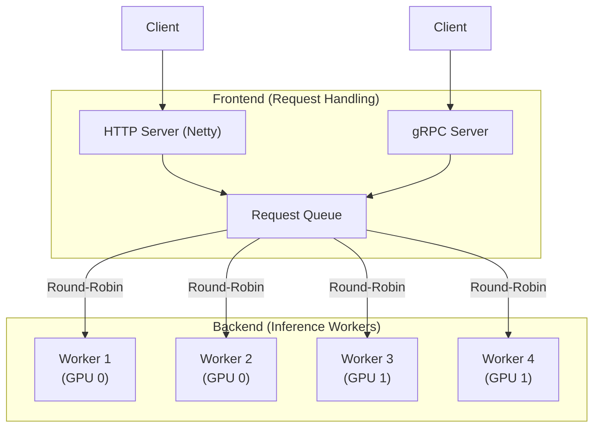
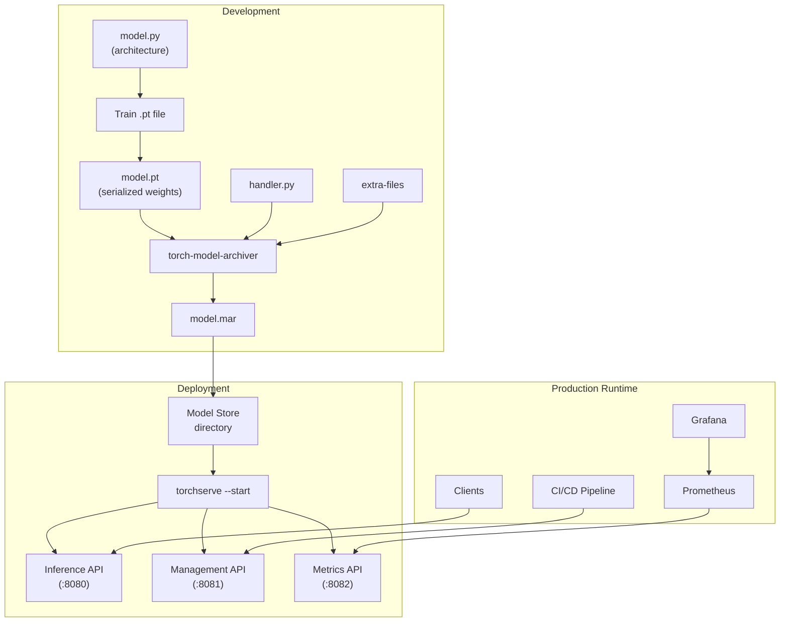

# 🏷️ TorchServe Architecture — MAR Files and Model Archiver

## 🎯 Learning Objectives
- Explain the frontend/backend separation in TorchServe and why it enables horizontal scaling
- Describe the MAR (Model Archive) file format and its role as the deployment artifact
- Use `torch-model-archiver` to package a PyTorch model with its handler into a `.mar` file
- Distinguish between the Management API (port 8081) and Inference API (port 8080)
- Understand how automatic request batching works and why it outperforms manual implementations

## Introduction

TorchServe wraps your PyTorch model in a production-grade serving layer. The architecture is not an incremental improvement over a Flask wrapper — it is a fundamentally different design, optimized for the constraints of ML inference: models are large (100MB–10GB), worker processes are memory-heavy (each loads a full model copy), and request payloads vary wildly (images, text, tensors). A serving framework must handle these constraints at the infrastructure level, not as application-level band-aids.

The core thesis of TorchServe's design is **separation of concerns**: the frontend handles HTTP/gRPC protocol concerns (TLS termination, request parsing, response serialization), while the backend handles inference (model loading, batching, GPU scheduling). This separation enables horizontal scaling of inference workers independently from request handling, and it is the reason TorchServe can achieve throughput numbers that hand-rolled Flask endpoints cannot match. We will connect this to the broader deployment strategies discussed in [[../20 - Deployment y Serving/00 - Bienvenida|Deployment y Serving]] and the platform patterns in [[../23 - Advanced MLOps/06 - Advanced MLOps|Advanced MLOps]].

Etymologically, the MAR file format inherits from Java's JAR (Java Archive) and Android's APK — it is simply a ZIP archive with a convention for contents. But unlike JARs which bundle compiled bytecode, a MAR file bundles a serialized PyTorch model graph, a Python handler module, and a manifest declaring model metadata. This standardization is what enables TorchServe to load any model from any team with zero configuration overhead — the server reads the manifest and knows exactly what to do.

---

## 1. Frontend/Backend Architecture

### 1.1 The Separation

TorchServe's process model separates request handling from inference execution:



The frontend is implemented in Java (Netty) for high-throughput, non-blocking I/O. It never touches the Python interpreter or the GPU — it parses HTTP headers, validates request formats, enqueues them, and returns responses. The backend workers are **Python processes** (not threads — more on this in [[02 - Custom Handlers - Multi-Model Endpoints and Advanced Config|Note 02]]) that load the model, run inference, and return results. This Java/Python split is controversial in some circles but practical: Java is faster at network I/O, and Python is where PyTorch lives.

### 1.2 Why This Separation Matters

Consider a naive Flask endpoint handling concurrent requests:

```python
# ❌ NAIVE APPROACH — DO NOT DEPLOY THIS
@app.route("/predict", methods=["POST"])
def predict():
    data = request.json
    tensor = torch.tensor(data["features"])
    with torch.no_grad():
        result = model(tensor)  # Blocks the GIL for entire inference
    return jsonify({"prediction": result.tolist()})
```

This serializes all requests through a single Python thread. Even with `gunicorn` workers, each worker loads its own model copy in GPU memory (see [[02 - Custom Handlers - Multi-Model Endpoints and Advanced Config|Note 02, GPU worker management]]), but there is no batching, no request coalescing, and no backpressure. TorchServe's architecture solves all three:

1. **Batching**: The frontend accumulates requests for a configurable window and sends a batch to a single backend worker. One GPU kernel launch processes N requests instead of N kernels. ⚠️ Batching only helps when `max_batch_size > 1` and `batch_delay > 0`.

2. **Backpressure**: The request queue naturally limits concurrency. If all workers are busy, the queue fills up and the frontend returns HTTP 503 (Service Unavailable) instead of silently piling up connections.

3. **Worker isolation**: A crashed worker process does not bring down the entire service — the frontend detects the crash and spawns a replacement.

### 1.3 Token-Based Request Batching 💡

TorchServe's batching is **token-based**, not time-based. The frontend opens a batch window defined by:

| Parameter | Default | Meaning |
|-----------|---------|---------|
| `batch_size` | 1 | Maximum requests per batch |
| `max_batch_delay` | 100 (ms) | Maximum time to accumulate requests before forwarding |

The batch is dispatched when **either** `batch_size` requests have accumulated **or** `max_batch_delay` milliseconds have elapsed. This dual-threshold design means that under high load, batches are size-bound (good throughput); under low load, they are time-bound (good latency).

> **¡Sorpresa!** The batch delay timer starts when the **first** request of a batch arrives, not when the previous batch was dispatched. This means if requests arrive at perfect regular intervals (e.g., one every 50ms), and `max_batch_delay = 100ms`, a batch of 2 is always dispatched every 100ms. The `batch_size` parameter acts as an **upper bound**, not a target.

```
Throughput = ─────────────────────────────────────────
             base_latency + max_batch_delay / batch_size

where:
  base_latency = time per forward pass (ms)
  batch_delay  = max_batch_delay config value (ms)
  batch_size   = max_batch_size config value
```

⚠️ When `batch_size = 1`, batching is effectively disabled — each request is forwarded immediately to a worker. This is the default and must be explicitly overridden for throughput gains.

---

## 2. MAR (Model Archive) Files

### 2.1 The Deployment Artifact

A `.mar` file is a ZIP archive with a prescribed internal structure:

```
model-name/
├── MAR-INF/
│   └── MANIFEST.json       # Model metadata
├── handler.py               # Custom inference logic (or reference to default handler)
├── model.pt                  # Serialized PyTorch model (or TorchScript)
├── model.py                  # Model architecture class definition (required if model.pt needs it)
├── index_to_name.json        # Optional: class label mapping
├── vocabulary.json           # Optional: NLP tokenizer vocabulary
└── requirements.txt          # Optional: Python dependencies (¡Sorpresa! see below)
```

The `MANIFEST.json` is the mandatory control plane file:

```json
{
  "createdOn": "15/05/2026 10:00:00",
  "runtime": "python",
  "model": {
    "modelName": "bert_classifier",
    "serializedFile": "model.pt",
    "handler": "handler.py",
    "modelVersion": "2.0",
    "requirementsFile": "requirements.txt"
  },
  "archiverVersion": "0.10.0"
}
```

> **¡Sorpresa!** The model archiver does NOT bundle Python dependencies into the MAR file. The `requirements.txt` inside the MAR is a **declaration**, not an installation. Your conda/pip environment at deployment time **must** match these requirements. The TorchServe server reads `requirements.txt` and warns if packages are missing, but it does NOT install them. This is the #1 cause of "works on my machine" issues with TorchServe — always pin exact versions and rebuild your Docker image when requirements change.

### 2.2 Why MAR over Raw .pt Files

A `.pt` file is just a serialized tensor dictionary. It doesn't know:
- What model architecture to reconstruct
- How to preprocess input data
- What Python version or PyTorch version it needs
- What class labels map to output indices

The MAR format bundles all of these into a single versioned artifact. It is the equivalent of a Docker image for models — self-describing, portable, and deployable to any TorchServe-compatible runtime.

> **Caso real: AWS SageMaker** requires MAR files for all PyTorch model deployments. When you call `model.deploy()` in the SageMaker SDK, behind the scenes it runs `torch-model-archiver` to create the MAR, uploads it to S3, and instructs the TorchServe endpoint to load it. Understanding MAR files means understanding what SageMaker actually deploys.

---

## 3. The Model Archiver CLI

The `torch-model-archiver` command packages your model into a `.mar` file:

```bash
torch-model-archiver \
  --model-name bert_classifier \
  --version 1.0 \
  --model-file model.py \
  --serialized-file model.pt \
  --handler handler.py \
  --extra-files "index_to_name.json,vocab.json" \
  --export-path model_store \
  --force
```

| Flag | Required | Purpose |
|------|----------|---------|
| `--model-name` | Yes | Name used in API paths and registration |
| `--version` | Yes | Semantic version for rollback support |
| `--serialized-file` | Yes | The `.pt` / TorchScript file |
| `--handler` | No | Python handler module (default: uses built-in handler based on model metadata) |
| `--model-file` | No | Python file defining the model class (only needed if `.pt` was saved from script) |
| `--extra-files` | No | Comma-separated list of auxiliary files (vocab, config, etc.) |
| `--export-path` | Yes | Output directory for the `.mar` file |
| `--force` | No | Overwrite existing `.mar` with same name |

💡 **Tip:** Always specify `--version`. Without it, TorchServe uses a default version that makes model rollbacks significantly harder. Production environments should treat model versions like software releases — semantic versioning with changelogs.

### 3.1 Default Handlers: Write Zero Code

For standard model types, TorchServe provides built-in handlers. You do NOT need to write a `handler.py`:

| Handler Name | Model Type | Preprocessing Handled |
|---|---|---|
| `image_classifier` | ResNet, DenseNet, VGG, etc. | PIL image → resized tensor → normalized tensor |
| `object_detector` | Faster R-CNN, YOLO, SSD | Image → tensor, NMS postprocessing |
| `image_segmenter` | DeepLabV3, FCN | Image → tensor, mask postprocessing |
| `text_classifier` | BERT, DistilBERT, RoBERTa | Tokenization, padding, attention mask |
| `text_handler` | Custom NLP with HuggingFace tokenizer | Loads tokenizer from extra-files |
| `custom` | Any model with custom preprocessing | User provides handler.py |

The `image_classifier` handler automatically applies the preprocessing pipeline saved with the model during training — normalization mean/std, resize dimensions, and tensor conversion. This information is stored in the model's metadata when you use `torchvision` transforms during training.

❌/✅ **Antipattern: Writing a handler for a standard model**

```python
# ❌ DO NOT WRITE THIS for standard image classification
class ResNetHandler(BaseHandler):
    def preprocess(self, data):
        from torchvision import transforms
        img = Image.open(io.BytesIO(data[0]["body"]))
        transform = transforms.Compose([
            transforms.Resize(224),
            transforms.ToTensor(),
            transforms.Normalize([0.485, 0.456, 0.406], [0.229, 0.224, 0.225])
        ])
        return transform(img).unsqueeze(0)
```

```bash
# ✅ JUST USE THE DEFAULT HANDLER
torch-model-archiver --model-name resnet50 --version 1.0 \
  --model-file model.py --serialized-file resnet50.pt \
  --handler image_classifier --export-path model_store
```

⚠️ The default `image_classifier` handler expects the model to have been trained with `torchvision` transforms whose metadata is embedded in the saved checkpoint. If you used custom transforms, you'll need a custom handler (see [[02 - Custom Handlers - Multi-Model Endpoints and Advanced Config|Note 02]]).

---

## 4. TorchServe Server

### 4.1 Starting the Server

```bash
torchserve --start \
  --model-store /models \
  --models resnet=resnet50.mar,bert=bert_classifier.mar \
  --ncs \
  --ts-config config.properties
```

| Flag | Purpose |
|------|---------|
| `--model-store` | Directory containing `.mar` files |
| `--models` | Comma-separated `name=file.mar` pairs to load at startup |
| `--ncs` | Disable snapshot saving (useful for stateless deployments) |
| `--ts-config` | Path to `config.properties` for server-wide settings |

⚠️ The `--models` flag registers models at startup but does NOT guarantee they are loaded into GPU memory. Lazy loading loads the model on first inference request. For production, configure `default_response_timeout` and `default_workers_per_model` in `config.properties`.

### 4.2 Configuring the Server: config.properties

```properties
# In config.properties
inference_address=http://0.0.0.0:8080
management_address=http://0.0.0.0:8081
metrics_address=http://0.0.0.0:8082
number_of_gpu=2
default_workers_per_model=4
default_response_timeout=120
load_models=resnet=resnet50.mar
```

The `config.properties` file is read once at server startup. ⚠️ Changes to `config.properties` require a server restart — they are NOT hot-reloaded. Use the Management API for runtime adjustments (worker scaling, model registration).

---

## 5. Management API vs Inference API

This separation is critical and often misunderstood:

| | Inference API | Management API |
|---|---|---|
| **Port** | 8080 | 8081 |
| **Purpose** | Serve predictions | Control the serving infrastructure |
| **Auth** | None by default (add API gateway) | None by default (add API gateway) |
| **Endpoints** | `/predictions/{model_name}` | `/models`, `/models/{name}` |
| **Who calls it** | Application clients | CI/CD pipelines, SRE tools |

### 5.1 Inference API

```bash
# Predict with a registered model
curl -X POST http://localhost:8080/predictions/resnet \
  -H "Content-Type: image/jpeg" \
  --data-binary @cat.jpg

# Response:
# {"class": "tabby cat", "probability": 0.92}
```

### 5.2 Management API

```bash
# Register a new model at runtime
curl -X POST "http://localhost:8081/models?url=bert_v2.mar&model_name=bert&initial_workers=2"

# Scale workers for a running model
curl -X PUT "http://localhost:8081/models/bert?min_worker=4"

# Describe a model (status, workers, GPU assignment)
curl http://localhost:8081/models/bert

# Unregister a model (graceful teardown with request draining)
curl -X DELETE "http://localhost:8081/models/bert_v1"
```

> **Caso real: Zero-downtime model updates** — Register `model_v2.mar` via the Management API while `model_v1` is serving. Clients gradually switch to `/predictions/model_v2`. Once `model_v1` receives zero requests for a cooldown period, unregister it. No server restart. No dropped requests. This pattern is essential for continuous delivery of ML models in production.

💡 **Tip:** The Management API is powerful but dangerous without authentication. In production, place it on a private network (Kubernetes ClusterIP service, not LoadBalancer) and authenticate access via a service mesh or API gateway.

---

## 6. Putting It All Together: The Full Workflow



❌/✅ **Full antipattern comparison**

```python
# ❌ THE NAIVE FLASK WRAPPER — does NOT handle:
#    - batching, concurrency, versioning, GPU scheduling, metrics, health checks

@app.route("/predict", methods=["POST"])
def predict():
    data = request.json
    tensor = torch.tensor(data["features"])
    result = model(tensor)
    return jsonify({"prediction": result.tolist()})
```

```bash
# ✅ THE TORCHSERVE APPROACH — 3 commands to production-grade serving

# Step 1: Package model with default handler
torch-model-archiver --model-name resnet50 --version 1.0 \
  --model-file model.py --serialized-file resnet50.pt \
  --handler image_classifier --export-path model_store

# Step 2: Start the server with automatic batching configured
torchserve --start --model-store model_store --models resnet50=resnet50.mar

# Step 3: Scale workers from CI/CD pipeline via Management API
curl -X PUT "http://localhost:8081/models/resnet50?min_worker=8"
```

---

## 🎯 Key Takeaways
- TorchServe separates frontend (Java/Netty, HTTP, queueing) from backend (Python workers, GPU inference, batching) — this is the architectural reason it outperforms Flask wrappers
- MAR files are ZIP archives containing the serialized model, handler code, and a manifest — they are the deployment artifact, analogous to Docker images for models
- The `torch-model-archiver` CLI packages models into MAR files; default handlers eliminate custom code for standard model types (image_classifier, object_detector, text_classifier)
- Token-based batching accumulates requests for a configurable window (`max_batch_delay` ms, `batch_size` max) — this is the primary mechanism for throughput optimization
- The Inference API (port 8080) serves predictions; the Management API (port 8081) controls the infrastructure — this separation enables zero-downtime model updates
- The model archiver does NOT bundle dependencies — your deployment environment must match `requirements.txt` at runtime
- AWS SageMaker uses TorchServe under the hood for all PyTorch deployments — this is production infrastructure, not a hobby framework

## 📦 Código de Compresión

```bash
# === COMPLETE TORCHSERVE DEPLOYMENT PIPELINE ===

# 1. Archive the model
torch-model-archiver \
  --model-name bert_classifier \
  --version 1.0 \
  --model-file model.py \
  --serialized-file bert_finetuned.pt \
  --handler text_classifier \
  --extra-files "index_to_name.json,vocab.json" \
  --export-path model_store \
  --force

# 2. Configure server (config.properties)
cat <<EOF > config.properties
inference_address=http://0.0.0.0:8080
management_address=http://0.0.0.0:8081
number_of_gpu=1
default_workers_per_model=2
batch_size=8
max_batch_delay=100
EOF

# 3. Start TorchServe with config
torchserve --start \
  --model-store model_store \
  --models bert_classifier=bert_classifier.mar \
  --ts-config config.properties

# 4. Health check and inference
curl http://localhost:8080/ping
# Expected: {"status": "Healthy"}

curl -X POST http://localhost:8080/predictions/bert_classifier \
  -H "Content-Type: application/json" \
  -d '{"text": "This movie was absolutely fantastic!"}'
# Expected: {"class": "positive", "probability": 0.97}

# 5. Register new version without downtime
curl -X POST "http://localhost:8081/models?url=bert_classifier_v2.mar&model_name=bert_classifier_v2&initial_workers=2"
curl -X DELETE "http://localhost:8081/models/bert_classifier"  # After v2 is live

# 6. Stop server
torchserve --stop
```

## References
- [TorchServe Architecture Documentation](https://pytorch.org/serve/architecture.html)
- [Model Archiver CLI Reference](https://github.com/pytorch/serve/blob/master/model-archiver/README.md)
- [AWS SageMaker Hosting with TorchServe](https://docs.aws.amazon.com/sagemaker/latest/dg/adapt-inference-container.html)
- [[../20 - Deployment y Serving/00 - Bienvenida|09/20 - Deployment y Serving]]
- [[../20 - Deployment y Serving/02 - Model Serving Patterns|09/20 - Model Serving Patterns]]
- [[../23 - Advanced MLOps/06 - Advanced MLOps|09/23 - Advanced MLOps]]
- [[../../05 - Deep Learning y Computer Vision/03 - Deep Learning con PyTorch/00 - Bienvenida|05/03 - DL con PyTorch]]
