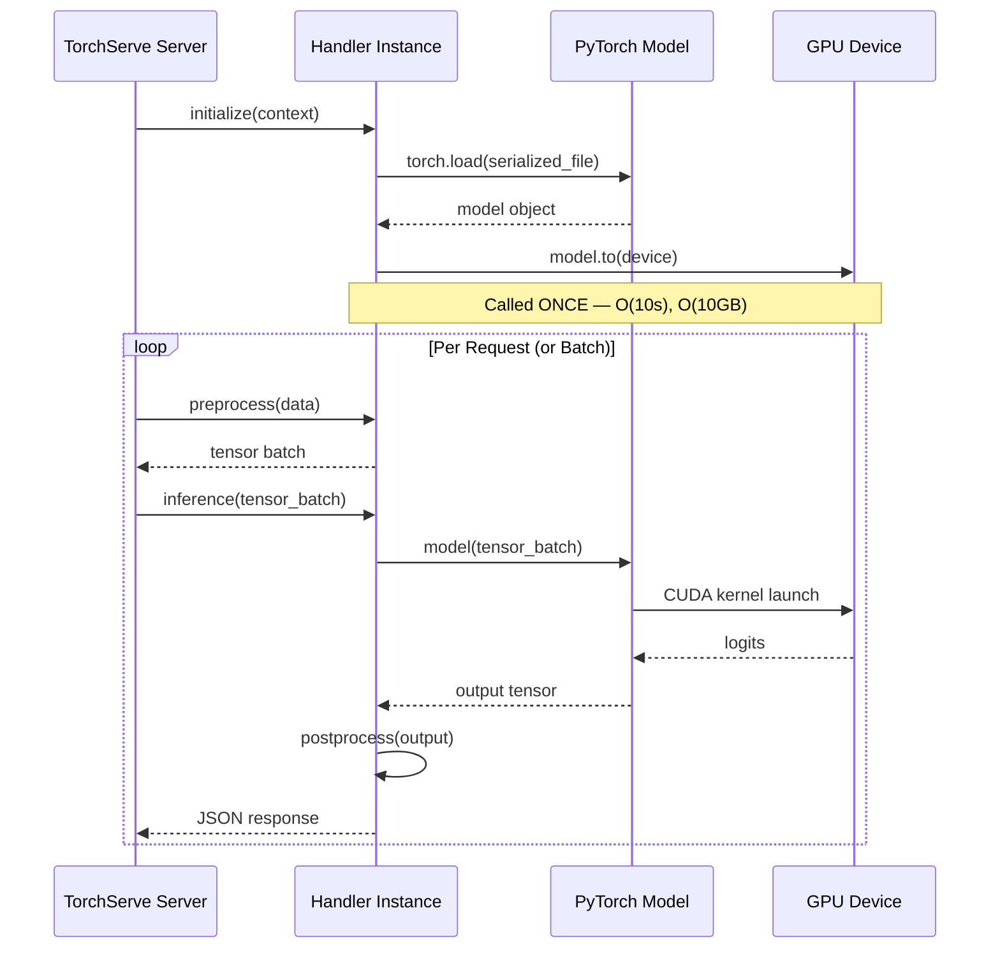
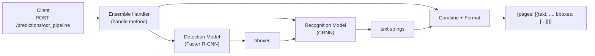

# 🏷️ Custom Handlers — Multi-Model Endpoints and Advanced Config

## 🎯 Learning Objectives
- Override each method of the BaseHandler lifecycle: `initialize`, `preprocess`, `inference`, `postprocess`
- Design custom handlers for non-standard preprocessing (custom tokenization, feature engineering, image augmentation)
- Configure multi-model endpoints that orchestrate ensemble inference through a single API call
- Tune worker pools and GPU affinity via `model-config.yaml`
- Explain why TorchServe workers are processes (not threads) and the GPU memory implications

## Introduction

Default handlers serve 80% of use cases, but the remaining 20% — custom preprocessing, multi-model ensembles, inference-time logic, and specialized batching — require understanding the handler system at depth. A TorchServe handler is not just a function wrapper; it is a class that controls the **entire lifecycle** of model serving: initialization (one-time heavy ops), preprocessing (per-request light ops), inference (per-request computation), and postprocessing (per-request serialization). This lifecycle design is the key insight: amortizing expensive operations (model loading, GPU warmup) across thousands of requests while keeping per-request costs minimal.

This note extends the architecture discussed in [[01 - TorchServe Architecture - MAR Files and Model Archiver]] and prepares you for the production deployment patterns in [[03 - Production Deployment - Docker, Kubernetes, Performance and Monitoring]]. We will build on the PyTorch fundamentals from [[../../05 - Deep Learning y Computer Vision/03 - Deep Learning con PyTorch/...|05/03 - DL con PyTorch]] and connect to API design patterns from [[../../10 - APIs y Microservicios/31 - FastAPI for ML/...|10/31 - FastAPI for ML]].

The handler system is where ML engineering truly diverges from software engineering: you are not just responding to HTTP requests — you are managing GPU memory, orchestrating model ensembles, performing feature engineering at inference time, and ensuring that a model trained on one pipeline runs correctly on a serving pipeline with different input formats. A bad handler silently returns wrong predictions; a good handler is invisible.

---

## 1. The BaseHandler Lifecycle

### 1.1 The Four Methods



The four methods form a pipeline:

```python
from ts.torch_handler.base_handler import BaseHandler

class CustomHandler(BaseHandler):
    def initialize(self, context):
        """Called ONCE at worker startup.
        context: provides model_dir, system_properties, manifest
        """
        # Load model, tokenizer, configs, label maps
        pass

    def preprocess(self, data):
        """Called per-request. Deserialize + transform input.
        data: list of raw request bodies from the batch
        Returns: torch.Tensor or list of tensors
        """
        pass

    def inference(self, data, *args, **kwargs):
        """Called per-request or per-batch. Forward pass.
        data: output from preprocess()
        Returns: model output (tensor, list, dict)
        """
        pass

    def postprocess(self, data):
        """Called per-request. Transform outputs → JSON-serializable.
        data: output from inference()
        Returns: list of dicts (one per input in batch)
        """
        pass
```

### 1.2 The `initialize(context)` Method

This is the heavyweight setup method. The `context` object provides critical runtime properties:

```python
def initialize(self, context):
    properties = context.system_properties          # CPU/GPU info
    model_dir = context.manifest["model"]["serializedFile"]  # Path to .pt file
    device = torch.device("cuda:" + str(properties.get("gpu_id")))

    self.model = torch.load(model_dir, map_location=device)
    self.model.eval()

    # ⚠️ load_state_dict is preferred over torch.load for security
    # torch.load with pickle is vulnerable to arbitrary code execution
```

| Context Attribute | Contains |
|---|---|
| `system_properties` | `gpu_id`, `batch_size`, `limit_max_image_pixels` |
| `manifest` | Raw `MANIFEST.json` contents (model name, version, serialized file path) |
| `model_name` | Registered model name string |
| `model_dir` | Directory where MAR contents were extracted |
| `get_request_header(index)` | Per-request HTTP headers (useful for multi-tenant routing) |

💡 **Tip:** Always use `torch.load(model_path, map_location=device)` rather than loading to CPU then moving — this avoids an unnecessary data copy. For large models (GPT, ViT), this saves ~1-2 seconds of startup time per worker.

> **¡Sorpresa!** `initialize()` is called once per **worker process**, not once per server. If you configure 4 workers, `initialize()` runs 4 times — once for each isolated Python process. This means file I/O (loading a 5GB model) happens 4 times sequentially (or in parallel on different GPUs). Factor this into your startup time budgets.

---

## 2. Custom Handler Patterns

### 2.1 Text Classifier with Custom Tokenization

```python
from ts.torch_handler.base_handler import BaseHandler
from transformers import AutoTokenizer
import torch
import json

class CustomTextHandler(BaseHandler):
    def initialize(self, context):
        model_dir = context.system_properties.get("model_dir")
        self.model = torch.load(f"{model_dir}/model.pt")
        self.model.eval()
        # ¡Sorpresa! The tokenizer is loaded from extra-files, not from HuggingFace Hub
        # This ensures reproducibility — the exact same tokenizer version used at training
        self.tokenizer = AutoTokenizer.from_pretrained(f"{model_dir}/tokenizer/")
        with open(f"{model_dir}/index_to_name.json") as f:
            self.labels = json.load(f)

    def preprocess(self, data):
        # data is a list of raw request bodies (batch)
        texts = []
        for row in data:
            body = row.get("data") or row.get("body")
            if isinstance(body, bytes):
                body = body.decode("utf-8")
            payload = json.loads(body)
            texts.append(payload["text"])

        # ⚠️ Tokenize the ENTIRE batch at once for efficiency
        # tokenizer.__call__ is vectorized — batching at this level is free
        encoded = self.tokenizer(
            texts,
            padding=True,           # Pad to longest in batch
            truncation=True,        # Truncate to model_max_length
            max_length=512,
            return_tensors="pt"
        )
        return encoded

    def inference(self, data):
        with torch.no_grad():
            logits = self.model(
                input_ids=data["input_ids"],
                attention_mask=data["attention_mask"]
            )
        return logits

    def postprocess(self, data):
        probs = torch.softmax(data, dim=-1)
        predictions = torch.argmax(probs, dim=-1)
        return [
            {"class": self.labels[str(pred.item())], "probability": prob.max().item()}
            for pred, prob in zip(predictions, probs)
        ]
```

### 2.2 The `handle()` Method — Bypassing the Pipeline

For complete control, override `handle(data, context)` directly. This bypasses the `preprocess → inference → postprocess` pipeline:

```python
class CustomBatcher(BaseHandler):
    def handle(self, data, context):
        """Override the full pipeline for custom batching logic."""
        # Access batch from multiple requests
        batch_size = len(data)

        # Dynamic batching: accumulate sub-batches based on sequence length
        # ⚠️ This is advanced — only needed for dynamic batching strategies
        short_texts = [d for d in data if len(json.loads(d["body"])["text"]) < 128]
        long_texts = [d for d in data if len(json.loads(d["body"])["text"]) >= 128]

        results = []
        if short_texts:
            short_batch = self.preprocess(short_texts)
            short_output = self.inference(short_batch)
            results.extend(self.postprocess(short_output))
        if long_texts:
            long_batch = self.preprocess(long_texts)
            long_output = self.inference(long_batch)
            results.extend(self.postprocess(long_output))

        return results
```

⚠️ Overriding `handle()` disables TorchServe's automatic per-request timeout tracking. You must implement your own timeout logic or accept that slow requests can block workers indefinitely.

---

## 3. Multi-Model Endpoints

### 3.1 The Ensemble Pattern

A multi-model endpoint orchestrates multiple models behind a single API path, enabling inference pipelines as a single call:



```python
class OCRPipelineHandler(BaseHandler):
    def initialize(self, context):
        import torch, json, io
        from PIL import Image
        import torchvision.transforms as T

        model_dir = context.system_properties.get("model_dir")

        # Load detection model from first MAR
        self.detector = torch.load(f"{model_dir}/detector.pt")
        self.detector.eval()

        # Load recognition model from second MAR (extra-files)
        self.recognizer = torch.load(f"{model_dir}/recognizer.pt")
        self.recognizer.eval()

        self.transform = T.Compose([T.ToTensor()])
        with open(f"{model_dir}/char_map.json") as f:
            self.char_map = json.load(f)

    def preprocess(self, data):
        # Same as standard handler — decode image
        images = []
        for row in data:
            if isinstance(row.get("body"), bytes):
                img = Image.open(io.BytesIO(row["body"])).convert("RGB")
            else:
                img = Image.open(io.BytesIO(row["data"])).convert("RGB")
            images.append(self.transform(img))
        return torch.stack(images)

    def inference(self, data):
        detections = self.detector(data)  # Returns bboxes + features
        results = []
        for img_detections in detections:
            # Crop and recognize each detected text region
            crops = self._crop_regions(img_detections)
            texts = self.recognizer(crops)
            results.append({
                "bboxes": img_detections["boxes"].tolist(),
                "texts": [self._decode(chars) for chars in texts]
            })
        return results

    def _crop_regions(self, detections):
        # ¡Sorpresa! ROI extraction on GPU is faster than numpy PIL
        # TorchServe's batching still applies — crops from multiple images
        # are processed in a single recognizer.forward() call
        pass

    def _decode(self, char_indices):
        return "".join(self.char_map[str(i)] for i in char_indices if i > 0)
```

❌/✅ **Antipattern: Separate endpoints per model for an ensemble**

```python
# ❌ Client must orchestrate the pipeline — 3 API calls, 3 round-trips
detections = requests.post("http://host:8080/predictions/detector", files=img)
bboxes = detections.json()["boxes"]
for bbox in bboxes:
    cropped = crop(img, bbox)
    text = requests.post("http://host:8080/predictions/recognizer", files=cropped)
    # N round trips for N detected regions!
```

```python
# ✅ One endpoint, one round-trip — TorchServe does the orchestration
response = requests.post("http://host:8080/predictions/ocr_pipeline", files=img)
print(response.json()["pages"][0]["texts"])
# ["Hello", "World", "OCR"]
```

> **Caso real: Notion's document understanding pipeline** deploys layout detection + OCR + text classification as a multi-model TorchServe endpoint. When a user uploads a scanned PDF, a single API call classifies the document structure, extracts text from each region, and categorizes it into headers, paragraphs, and tables — all within their 500ms SLA.

---

## 4. Configuration: model-config.yaml

### 4.1 Worker and GPU Management

```yaml
# model-config.yaml — per-model configuration
minWorkers: 2          # Min workers to keep warm
maxWorkers: 8          # Max workers allowed
batchSize: 16          # Max requests per batch (frontend-side)
maxBatchDelay: 50      # Max ms to wait for batch accumulation
responseTimeout: 120   # Max seconds per inference call
deviceType: "gpu"      # "cpu" or "gpu"
deviceIds: [0, 1]      # Which GPU IDs to use
parallelLevel: 4       # Workers per model
parallelType: "pp"     # "pp" = per process, "tp" = tensor parallelism (experimental)
```

Register with: `torchserve --start --models my_model=my_model.mar --model-config model-config.yaml`

### 4.2 Understanding Workers

TorchServe workers are **Python processes**, not threads:

```
┌─────────────────────────────────────────────┐
│              GPU 0 (24GB VRAM)               │
│                                               │
│  ┌──────────┐ ┌──────────┐ ┌──────────┐     │
│  │ Worker 1 │ │ Worker 2 │ │ Worker 3 │     │
│  │ Process  │ │ Process  │ │ Process  │     │
│  │ Model:   │ │ Model:   │ │ Model:   │     │
│  │ 6GB      │ │ 6GB      │ │ 6GB      │     │
│  └──────────┘ └──────────┘ └──────────┘     │
│                                               │
│  Total used: 18GB / 24GB                      │
│  Remaining: 6GB (OS + overhead)               │
└─────────────────────────────────────────────┘
```

> **¡Sorpresa!** TorchServe workers on the same GPU share the CUDA context, but **each has its own Python process with its own memory**. 4 workers × 2GB model = 8GB GPU memory consumption, NOT 2GB. This is fundamentally different from multi-threading where memory is shared. The Python GIL makes threads useless for GPU inference (only one thread executes Python at a time), so TorchServe opts for processes — each with its own GIL, own memory, and own CUDA stream.

⚠️ **Memory pressure rule**: `model_size_GB × n_workers ≤ available_GPU_memory_GB - 2GB` (reserve 2GB for CUDA context overhead). Exceeding this causes CUDA OOM errors that crash individual workers without affecting the frontend — but each crash loses queued requests.

```
n_workers_max = floor((GPU_memory - 2GB) / model_size)
```

💡 **Tip:** For large models (10GB+) that cannot fit multiple copies, use 1 worker per GPU and rely on frontend batching for throughput. Set `batchSize` high (32-64) so the single worker processes many requests per forward pass. Throughput with 1 worker × batch_size=64 can exceed 8 workers × batch_size=1 in many cases.

### 4.3 GPU Multi-Process Service (MPS)

CUDA MPS reduces the overhead of multiple processes sharing a single GPU by allowing their CUDA kernels to execute concurrently on the same SM (Streaming Multiprocessor) units, reducing context-switch overhead. Enable via:

```bash
# Enable CUDA MPS (requires root or admin)
nvidia-cuda-mps-control -d
```

⚠️ MPS is beneficial when workers have idle periods (e.g., waiting on I/O) but can actually degrade performance when all workers are saturated — the scheduler overhead of MPS adds latency. Benchmark with and without MPS before enabling in production.

---

## 5. Advanced Handler Patterns

### 5.1 Inference-Time Feature Engineering

> **Caso real: Stripe's fraud detection system** uses custom TorchServe handlers with feature engineering in `preprocess()`. Raw transaction data arrives as JSON. The handler computes derived features (time since last transaction, merchant risk score from a lookup table, velocity features from a Redis cache) before passing tensors to the model. This keeps the model simple and the feature logic centralized in the serving layer.

```python
class FraudDetectionHandler(BaseHandler):
    def initialize(self, context):
        self.model = torch.load(...)
        self.model.eval()
        # Load lookup tables stored as extra-files
        self.merchant_risk = json.load(open(..., "merchant_risk.json"))
        # ⚠️ Redis cache for velocity features — connection per worker
        import redis
        self.redis = redis.Redis(host=..., port=6379, decode_responses=True)

    def preprocess(self, data):
        features = []
        for row in data:
            txn = json.loads(row["body"]) if isinstance(row["body"], bytes) else row["body"]
            # Static features
            feat = [
                txn["amount"],
                self.merchant_risk.get(txn["merchant_id"], 0.5),
                txn["hour_of_day"] / 24.0,
            ]
            # Velocity features (computed at inference time)
            user_key = f"user:{txn['user_id']}:txn_count"
            recent_count = int(self.redis.get(user_key) or 0)
            feat.append(recent_count / 10.0)  # Normalized
            features.append(feat)
            self.redis.incr(user_key)
            self.redis.expire(user_key, 3600)  # 1-hour window
        return torch.tensor(features, dtype=torch.float32)
```

⚠️ External services (Redis, databases) in `preprocess` are a potential bottleneck. If Redis is slow, every worker blocks on I/O. Mitigate with: (1) local caching, (2) timeouts, (3) circuit breakers, or (4) moving feature computation to the request sender.

### 5.2 Custom Service (complete control beyond BaseHandler)

For endpoints that don't fit the `preprocess → inference → postprocess` mold, TorchServe supports a standalone "service" handler. This replaces `BaseHandler` entirely:

```python
# custom_service.py
class CustomService:
    def __init__(self):
        self._context = None
        self.model = None

    def initialize(self, context):
        self._context = context
        self.model = torch.load(context.manifest["model"]["serializedFile"])
        # ⚠️ No preprocess/inference/postprocess — manual control

    def handle(self, data, context):
        # Direct access to raw batch data
        responses = []
        for request in data:
            # Parse, route, compute, serialize — all manual
            result = self._process_single(request)
            responses.append(result)
        return responses

    def _process_single(self, request):
        # Your custom logic here
        input_data = json.loads(request["body"])
        # Route to different model paths based on input type
        if input_data.get("task") == "classification":
            return self._classify(input_data)
        elif input_data.get("task") == "regression":
            return self._regress(input_data)
        return {"error": "unknown task"}
```

💡 **Tip:** Use `BaseHandler` when your workflow fits the pipeline pattern (90% of cases). Use a custom service **only** when you need to route requests to different models or processing pipelines based on request content. The cost is you lose automatic batching, timeout tracking, and metric instrumentation.

---

## 🎯 Key Takeaways
- The BaseHandler lifecycle has four methods: `initialize` (once, heavy), `preprocess` (per-request, light), `inference` (per-request, compute), `postprocess` (per-request, serialization)
- `initialize(context)` loads the model, tokenizer, and label maps — it runs once per worker process, not once per server
- Custom `preprocess()` is where inference-time feature engineering happens (tokenization, normalization, caching lookups)
- Multi-model endpoints bundle ensemble pipelines into a single API call, eliminating client-side orchestration and multiple round-trips
- TorchServe workers are PROCESSES (not threads) due to Python GIL — each loads its own model copy, GPU memory usage is `model_size × n_workers`
- `model-config.yaml` controls `minWorkers`, `maxWorkers`, `batchSize`, `maxBatchDelay`, `deviceIds`, and `responseTimeout` per model
- Override `handle()` only when you need complete control that bypasses the pipeline — at the cost of losing automatic batching and timeout tracking
- For ensembles (like OCR pipelines), deploy as a single multi-model endpoint rather than separate per-model endpoints

## 📦 Código de Compresión

```python
# handler.py — Production-ready custom handler for text classification
import json, torch, logging
from ts.torch_handler.base_handler import BaseHandler
from transformers import AutoTokenizer

logger = logging.getLogger(__name__)

class BertClassifierHandler(BaseHandler):
    def initialize(self, context):
        """Load model + tokenizer once per worker."""
        model_dir = context.system_properties.get("model_dir")
        device = torch.device(
            "cuda" if torch.cuda.is_available() else "cpu"
        )

        self.model = torch.load(
            f"{model_dir}/model.pt", map_location=device
        )
        self.model.eval()
        # ¡Sorpresa! Tokenizer from extra-files, not HF Hub
        self.tokenizer = AutoTokenizer.from_pretrained(
            f"{model_dir}/tokenizer/"
        )
        with open(f"{model_dir}/index_to_name.json") as f:
            self.labels = json.load(f)
        logger.info(f"Handler initialized on {device}")

    def preprocess(self, data):
        """Batch preprocess: texts → token IDs + masks."""
        texts = []
        for row in data:
            body = row.get("data") or row.get("body")
            if isinstance(body, bytes):
                body = body.decode("utf-8")
            texts.append(json.loads(body)["text"])

        return self.tokenizer(
            texts, padding=True, truncation=True,
            max_length=512, return_tensors="pt"
        )

    def inference(self, data):
        """Forward pass on batched input."""
        with torch.no_grad():
            return self.model(
                data["input_ids"], data["attention_mask"]
            )

    def postprocess(self, data):
        """Logits → label + probability for each sample."""
        probs = torch.softmax(data, dim=-1)
        preds = torch.argmax(probs, dim=-1)
        return [
            {
                "class": self.labels[str(p.item())],
                "confidence": round(prob[p.item()].item(), 4)
            }
            for p, prob in zip(preds, probs)
        ]
```

## References
- [TorchServe Custom Handlers Documentation](https://pytorch.org/serve/custom_service.html)
- [TorchServe Model Configuration](https://pytorch.org/serve/configuration.html)
- [NVIDIA CUDA MPS Documentation](https://docs.nvidia.com/deploy/mps/index.html)
- [[01 - TorchServe Architecture - MAR Files and Model Archiver|Note 01 — Architecture]]
- [[03 - Production Deployment - Docker, Kubernetes, Performance and Monitoring|Note 03 — Production]]
- [[../20 - Deployment y Serving/02 - Model Serving Patterns|09/20 - Model Serving Patterns]]
- [[../../05 - Deep Learning y Computer Vision/03 - Deep Learning con PyTorch/00 - Bienvenida|05/03 - DL con PyTorch]]
- [[../../10 - APIs y Microservicios/31 - FastAPI for ML/...|10/31 - FastAPI for ML]]
