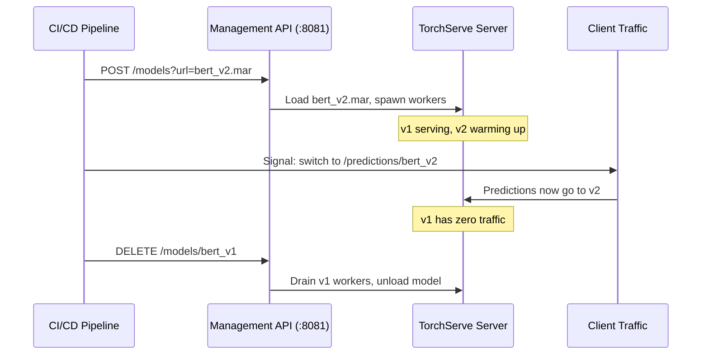

# 🏷️ Production Deployment — Docker, Kubernetes, Performance and Monitoring

## 🎯 Learning Objectives
- Build optimized Docker images for TorchServe using multi-stage builds to stay under 1GB
- Deploy TorchServe on Kubernetes with GPU-aware scheduling, resource limits, and HPA
- Benchmark inference throughput and latency using `torchserve-benchmark`, and reason about batch size × delay tradeoffs
- Implement zero-downtime model updates via the Management API
- Export Prometheus metrics and build Grafana dashboards for inference observability

## Introduction

Writing a TorchServe handler is the easy part — roughly 30% of the production effort. The remaining 70% is infrastructure: containerizing with sub-1GB images, orchestrating on Kubernetes with GPU constraints, tuning batching parameters against latency/throughput SLAs, and instrumenting observability so that silent model degradation is detected before users complain. Production ML serving is as much a systems engineering problem as it is a data science problem.

This note completes the TorchServe trilogy. In [[01 - TorchServe Architecture - MAR Files and Model Archiver|Note 01]] we learned how TorchServe's frontend/backend architecture enables production-grade serving. In [[02 - Custom Handlers - Multi-Model Endpoints and Advanced Config|Note 02]] we mastered the handler lifecycle. Now we deploy. We will reference containerization patterns from [[../20 - Deployment y Serving/01 - Docker para ML|Docker para ML]], Kubernetes configurations from [[../20 - Deployment y Serving/03 - Kubernetes para ML|Kubernetes para ML]], monitoring strategies from [[../21 - Monitoreo y Mantenimiento/...|Monitoreo]], and CI/CD from [[../29 - CI-CD for ML/...|CI-CD for ML]].

The torchbearer metaphor is apt: in production, you carry the flame of model performance through a gauntlet of infrastructure constraints. A 95% accurate model deployed with 2000ms latency is less useful than an 85% accurate model deployed with 50ms latency. Performance tuning is part of model quality.

---

## 1. Docker Deployment

### 1.1 The Image Size Problem

A naive Dockerfile for TorchServe typically ends up 3-8GB:

```dockerfile
# ❌ NAIVE DOCKERFILE — DO NOT USE IN PRODUCTION
FROM python:3.10
RUN pip install torch torchserve torch-model-archiver
COPY model_store/ /home/model-server/model-store/
COPY config.properties /home/model-server/
CMD ["torchserve", "--start", "--ts-config", "config.properties", \
     "--model-store", "model-store", "--models", "all"]
# ⚠️ Image size: ~7.5GB. PyTorch alone is ~2.5GB.
# This image takes minutes to pull and seconds to push on every CI run.
```

✅ The official TorchServe image is built on a multi-stage strategy:

```dockerfile
# ✅ PRODUCTION MULTI-STAGE BUILDFILE
# Stage 1: Build dependencies (discarded after compilation)
FROM pytorch/torchserve:latest-cpu AS builder
RUN pip install --no-cache-dir transformers tokenizers
RUN python -c "from transformers import AutoModel; AutoModel.from_pretrained('bert-base-uncased')"

# Stage 2: Slim inference image
FROM pytorch/torchserve:latest-cpu
# Copy only the cache of pre-downloaded models from Stage 1
COPY --from=builder /root/.cache/huggingface /root/.cache/huggingface
# Copy MAR files — these are the only artifacts needed
COPY model_store/ /home/model-server/model-store/
COPY config.properties /home/model-server/

# ⚠️ NEVER put credentials in a Dockerfile
# Secret handling belongs in K8s secrets or Vault
EXPOSE 8080 8081 8082
HEALTHCHECK --interval=30s --timeout=5s --retries=3 \
  CMD curl -f http://localhost:8080/ping || exit 1
CMD ["torchserve", "--start", "--ts-config", "/home/model-server/config.properties", \
     "--model-store", "/home/model-server/model-store", "--models", "all", "--foreground"]
```

| Strategy | Image Size | Start Time | Security |
|----------|-----------|------------|----------|
| Naive `pip install torch` | 7.5 GB | 120s cold | Full Python + build tools |
| Official `pytorch/torchserve` | 1.2 GB | 30s cold | Minimal runtime |
| Official + multi-stage + cleanup | 850 MB | 25s cold | No build tools, no pip cache |

💡 **Tip:** The `pytorch/torchserve:latest-gpu` image includes CUDA 11.8 and cuDNN 8. If your model requires a specific CUDA version, use the version-tagged images: `pytorch/torchserve:0.9.0-gpu`.

> **¡Sorpresa!** The official TorchServe image already contains a full PyTorch installation. You do NOT need `RUN pip install torch` in your Dockerfile — doing so replaces the optimized build with a generic one and adds ~1-2GB. Only install additional dependencies your handler needs.

### 1.2 Docker Compose for Local Testing

```yaml
# docker-compose.yml — local dev with GPU passthrough
version: "3.8"
services:
  torchserve:
    image: pytorch/torchserve:latest-gpu
    ports:
      - "8080:8080"   # Inference
      - "8081:8081"   # Management
      - "8082:8082"   # Metrics
    volumes:
      - ./model_store:/home/model-server/model-store
      - ./config.properties:/home/model-server/config.properties
    environment:
      - TS_ENABLE_METRICS_API=true
    deploy:
      resources:
        reservations:
          devices:
            - driver: nvidia
              count: 1
              capabilities: [gpu]
    healthcheck:
      test: ["CMD", "curl", "-f", "http://localhost:8080/ping"]
      interval: 30s
      timeout: 5s
      retries: 3
```

---

## 2. Kubernetes Deployment

### 2.1 GPU-Aware Deployment

```yaml
# torchserve-deployment.yaml
apiVersion: apps/v1
kind: Deployment
metadata:
  name: torchserve-bert
  labels:
    app: torchserve-bert
spec:
  replicas: 2                    # ⚠️ Pinned to GPU count below
  selector:
    matchLabels:
      app: torchserve-bert
  template:
    metadata:
      labels:
        app: torchserve-bert
    spec:
      # GPU node affinity — schedule only on GPU nodes
      nodeSelector:
        accelerator: nvidia-t4   # ⚠️ Pre-label your GPU nodes
      tolerations:
        - key: "nvidia.com/gpu"
          operator: "Exists"
          effect: "NoSchedule"
      containers:
        - name: torchserve
          image: pytorch/torchserve:latest-gpu
          ports:
            - containerPort: 8080
              name: inference
            - containerPort: 8081
              name: management
            - containerPort: 8082
              name: metrics
          resources:
            limits:
              nvidia.com/gpu: 1      # 💡 Each GPU can run 1 pod
              memory: "16Gi"          # Model + workers + overhead
              cpu: "4"
            requests:
              nvidia.com/gpu: 1
              memory: "12Gi"
              cpu: "2"
          env:
            - name: TS_ENABLE_METRICS_API
              value: "true"
          volumeMounts:
            - name: model-store
              mountPath: /home/model-server/model-store
              readOnly: true
            - name: config
              mountPath: /home/model-server/config.properties
              subPath: config.properties
          livenessProbe:
            httpGet:
              path: /ping
              port: 8080
            initialDelaySeconds: 60   # ⚠️ Model loading takes time
            periodSeconds: 30
          readinessProbe:
            httpGet:
              path: /ping
              port: 8080
            initialDelaySeconds: 30
            periodSeconds: 10
      volumes:
        - name: model-store
          persistentVolumeClaim:
            claimName: model-store-pvc
        - name: config
          configMap:
            name: torchserve-config
---
apiVersion: v1
kind: Service
metadata:
  name: torchserve-bert-svc
spec:
  selector:
    app: torchserve-bert
  ports:
    - name: inference
      port: 8080
      targetPort: 8080
    - name: management
      port: 8081
      targetPort: 8081
    - name: metrics
      port: 8082
      targetPort: 8082
  type: ClusterIP  # ⚠️ Never expose Management API externally
```

⚠️ `nvidia.com/gpu: 1` in the resource limits means each pod gets exclusive access to exactly one GPU. If you have 2 replicas on a node with 2 GPUs, both pods schedule. If you request 3 replicas on the same node, the third pod stays Pending.

### 2.2 Horizontal Pod Autoscaling (HPA)

```yaml
apiVersion: autoscaling/v2
kind: HorizontalPodAutoscaler
metadata:
  name: torchserve-bert-hpa
spec:
  scaleTargetRef:
    apiVersion: apps/v1
    kind: Deployment
    name: torchserve-bert
  minReplicas: 2
  maxReplicas: 10
  metrics:
    - type: Resource
      resource:
        name: cpu
        target:
          type: Utilization
          averageUtilization: 70
    - type: Pods
      pods:
        metric:
          name: torchserve_request_latency_p99_ms
        target:
          type: AverageValue
          averageValue: "200"    # Scale when p99 > 200ms
  behavior:
    scaleDown:
      stabilizationWindowSeconds: 300  # Wait 5 min before scaling down
      policies:
        - type: Pods
          value: 1
          periodSeconds: 60
    scaleUp:
      stabilizationWindowSeconds: 0    # Scale up immediately
      policies:
        - type: Pods
          value: 2
          periodSeconds: 60
```

💡 **Tip:** HPA scaling on GPU utilization requires NVIDIA DCGM (Data Center GPU Manager) for Prometheus metrics. Without DCGM, scale on CPU/latency as shown above. For GPU-bound workloads, P99 latency is often a better scaling signal than GPU utilization.

> **Caso real: Amazon SageMaker** deploys 1000s of PyTorch models daily using TorchServe under the hood. SageMaker's `InferenceComponent` abstraction maps to TorchServe models, and its autoscaling policies map to TorchServe worker pools. When you configure a SageMaker endpoint with `min_instance_count=2` and `ScalingPolicy=TargetTracking` on `SageMakerVariantInvocationsPerInstance`, the infrastructure that scales is TorchServe's frontend/backend.

### 2.3 GPU Scheduling Architecture

```mermaid
flowchart TB
    subgraph K8s["Kubernetes Cluster"]
        subgraph GPUNodes["GPU Node Pool (nvidia-t4 × 4)"]
            subgraph Node1["Node 1 — T4 GPU"]
                P1["Pod 1\nWorker: 0-3"]
                P2["Pod 2\nWorker: 0-3"]
            end
            subgraph Node2["Node 2 — T4 GPU"]
                P3["Pod 3\nWorker: 0-3"]
            end
        end

        HPA["HPA Controller"] -->|Scale decision| K8s

        Prom["Prometheus\n(metrics scrape)"] --> HPA
        Graf["Grafana\n(dashboards)"] --> Prom

        Ingress["Ingress Controller\n(nginx / ALB)"] --> SVC["Service (ClusterIP)"]
        SVC --> P1
        SVC --> P2
        SVC --> P3

        Users["Client Traffic"] --> Ingress
    end

    P1 -->|Port 8082/metrics| Prom
    P2 -->|Port 8082/metrics| Prom
    P3 -->|Port 8082/metrics| Prom
```

---

## 3. Zero-Downtime Model Updates

The Management API (port 8081) enables model updates without server restart:

```bash
# Phase 1: Register new version alongside old
curl -X POST "http://torchserve:8081/models?url=bert_v2.mar&model_name=bert_v2&initial_workers=2"

# Phase 2: Route traffic gradually
# Option A: Client-side switch (update clients to call /predictions/bert_v2)
# Option B: Proxy-level switch (update nginx/Traefik routing rules)

# Phase 3: Drain and remove old version
curl -X DELETE "http://torchserve:8081/models/bert_v1"
# ⚠️ DELETE waits for in-flight requests to complete before removing workers
```



---

## 4. Performance Benchmarking

### 4.1 The Benchmark Tool

```bash
torchserve-benchmark \
  --url http://localhost:8080/predictions/bert_classifier \
  --input_file requests.jsonl \
  --concurrency 10 \
  --requests 1000 \
  --workers 4 \
  --batch_size 8
```

| Flag | Purpose |
|------|---------|
| `--concurrency` | Number of parallel client connections to simulate |
| `--requests` | Total requests to send across all connections |
| `--batch_size` | If >1, groups requests into batches (simulates batch inference) |
| `--input_file` | JSONL file with one request payload per line |
| `--workers` | Client-side worker threads for load generation |

Typical output:

```
Concurrency Level:      10
Total requests:         1000
Duration:               45.2s
Requests per second:    22.1 req/s
P50 latency:            210ms
P90 latency:            380ms
P99 latency:            520ms
Error rate:             0.0%
```

### 4.2 Batching Tradeoffs — The Mathematics

The throughput/latency tradeoff is captured by:

```
                                      batch_size
Throughput(req/s) = ───────────────────────────────────────────────
                     base_latency_ms + max_batch_delay_ms / 1000

P99_latency(ms) = base_latency_ms + max_batch_delay_ms
```

Where:
- `base_latency_ms` = time to run one forward pass on the batch (grows with batch_size due to memory bandwidth constraints)
- `max_batch_delay_ms` = how long the frontend waits to accumulate a full batch

For a model with `base_latency = 50ms` per individual sample and linear scaling up to batch_size=8:

| batch_size | batch_delay (ms) | Throughput (req/s) | P50 (ms) | P99 (ms) |
|---|---|---|---|---|
| 1 | 0 | 20.0 | 55 | 60 |
| 4 | 50 | 40.0 | 75 | 105 |
| 8 | 100 | 53.3 | 90 | 150 |
| 16 | 100 | 106.7 | 130 | 200 |
| 32 | 200 | 128.0 | 180 | 250 |

⚠️ **The diminishing returns wall**: Above certain batch sizes, GPU memory bandwidth saturates and `base_latency` grows super-linearly. For a ResNet-50 on a T4 GPU, the sweet spot is typically `batch_size=8-16`. For BERT-base on A10G, `batch_size=16-32`. Benchmark YOUR model on YOUR hardware — these numbers are guidelines, not truths.

### 4.3 The Tuning Loop

```
1. Set batch_delay=0, batch_size=1 → Measure baseline latency
2. Increment batch_size by 2× until throughput stops improving
3. For the best batch_size, increase batch_delay until P99 exceeds SLA
4. The optimal config is: max(batch_size) at max(batch_delay) where P99 ≤ SLA
```

💡 **Tip:** Run benchmarks with production-realistic payloads. A benchmark file of 1000 identical requests ("Hello world" repeated) will show misleadingly fast results because GPU cache hits are artificially high. Use real, diverse payloads.

---

## 5. Memory Management and TorchScript Optimization

### 5.1 GPU VRAM Pressure

TorchServe workers are processes — each with its own model copy:

```
VRAM_used = model_size_GB × n_workers_per_GPU + CUDA_context_overhead
```

⚠️ For a 4GB model on a 24GB GPU:
- 1 worker: 4GB (safe)
- 4 workers: 16GB (tight but OK)
- 8 workers: 32GB → CUDA OOM — workers crash

The frontend detects crashed workers and spawns replacements, but each crash loses in-flight requests. Monitor `torchserve_worker_crash_total` and set alerts.

### 5.2 TorchScript Acceleration

TorchScript-compiled models run 20-40% faster in TorchServe because the Python interpreter is removed from the inference path:

```python
# Before deployment: compile model to TorchScript
import torch

model = MyModel()
model.load_state_dict(torch.load("model.pt"))
model.eval()

# Option A: Trace (best for static computation graphs)
traced = torch.jit.trace(model, torch.randn(1, 3, 224, 224))
torch.jit.save(traced, "model_traced.pt")

# Option B: Script (for models with control flow — if/else/loops in forward)
scripted = torch.jit.script(model)
torch.jit.save(scripted, "model_scripted.pt")
```

```bash
# Package the TorchScript model in the MAR
torch-model-archiver \
  --model-name resnet50_jit \
  --version 2.0 \
  --serialized-file model_traced.pt \
  --handler image_classifier \
  --export-path model_store
```

> **¡Sorpresa!** TorchScript models skip Python entirely during inference — the handler's `inference()` method calls `self.model(data)` and PyTorch dispatches directly to the compiled C++ graph. This eliminates Python function call overhead per layer, which for deep models (100+ layers) saves 5-15ms per forward pass. However, TorchScript does NOT support all Python operations — test exhaustively before deploying.

⚠️ TorchScript tracing records operations on **the exact input you provide**. If your model has dynamic shapes (variable sequence lengths, input-dependent branches), use `torch.jit.script()` instead of `torch.jit.trace()`. The error message "Tracer cannot trace control flow" is the definitive sign you need scripting.

### 5.3 Performance Comparison

| Model | Raw PyTorch (eager) | TorchScript | Speedup |
|-------|-------------------|-------------|---------|
| ResNet-50 | 18ms | 14ms | 1.29× |
| BERT-base | 85ms | 62ms | 1.37× |
| ViT-B/16 | 45ms | 34ms | 1.32× |

Benchmarked on NVIDIA T4, batch_size=1. Source: [TorchServe Performance Guide](https://pytorch.org/serve/performance_guide.html).

---

## 6. Metrics and Monitoring

### 6.1 Built-in Prometheus Endpoint

TorchServe exposes metrics at `http://localhost:8082/metrics` in Prometheus format:

```
# HELP torchserve_requests_total Total request count
# TYPE torchserve_requests_total counter
torchserve_requests_total{model_name="resnet50",level="Model"} 15042.0

# HELP torchserve_inference_latency_ms Inference request latency
# TYPE torchserve_inference_latency_ms histogram
torchserve_inference_latency_ms_bucket{model_name="resnet50",le="25"} 0
torchserve_inference_latency_ms_bucket{model_name="resnet50",le="50"} 1200
torchserve_inference_latency_ms_bucket{model_name="resnet50",le="100"} 8900
torchserve_inference_latency_ms_bucket{model_name="resnet50",le="250"} 14800
torchserve_inference_latency_ms_bucket{model_name="resnet50",le="500"} 15000
torchserve_inference_latency_ms_bucket{model_name="resnet50",le="+Inf"} 15042

# HELP torchserve_queue_latency_ms Queue time in frontend
# TYPE torchserve_queue_latency_ms histogram

# HELP torchserve_handler_time_ms Time inside the handler
# TYPE torchserve_handler_time_ms histogram

# HELP torchserve_errors_total Error count by HTTP status
# TYPE torchserve_errors_total counter
```

| Metric | Signal | Alert When |
|--------|--------|-----------|
| `inference_latency_ms` | P99/P50 serving time | P99 > SLA (e.g., 500ms) |
| `queue_latency_ms` | Time spent waiting for a worker | > 50ms (indicates scaling needed) |
| `errors_total` | 4xx/5xx errors | Rate > 0.1% of requests |
| `requests_total` | Throughput (req/s) | Sudden drop (model crash) or spike (DDoS) |

### 6.2 Prometheus Scrape Configuration

```yaml
# prometheus.yml
scrape_configs:
  - job_name: "torchserve"
    scrape_interval: 15s
    kubernetes_sd_configs:
      - role: pod
    relabel_configs:
      - source_labels: [__meta_kubernetes_pod_label_app]
        regex: "torchserve-bert"
        action: keep
      - source_labels: [__meta_kubernetes_pod_container_port_number]
        regex: "8082"
        action: keep
```

### 6.3 Grafana Dashboard — Essential Panels

| Panel | Query | Purpose |
|-------|-------|---------|
| Throughput | `rate(torchserve_requests_total[1m])` | Requests per second |
| P50/P90/P99 Latency | `histogram_quantile(0.99, rate(torchserve_inference_latency_ms_bucket[5m]))` | Tail latency trends |
| Error Rate | `rate(torchserve_errors_total[5m]) / rate(torchserve_requests_total[5m])` | Error budget burn |
| Queue Depth | `rate(torchserve_queue_latency_ms_sum[5m]) / rate(torchserve_queue_latency_ms_count[5m])` | Worker saturation |
| GPU Utilization | `nvidia_gpu_utilization` (from DCGM) | GPU efficiency |

❌/✅ **Antipattern: Deploying without monitoring**

```bash
# ❌ DEPLOYMENT WITHOUT OBSERVABILITY — flying blind
torchserve --start --model-store model_store --models bert=bert.mar
# No metrics, no health checks, no alerting.
# When the model starts returning garbage, you find out from users.
```

```yaml
# ✅ PRODUCTION-READY CONFIGURATION
# config.properties with observability enabled
inference_address=http://0.0.0.0:8080
management_address=http://0.0.0.0:8081
metrics_address=http://0.0.0.0:8082
metrics_mode=prometheus
enable_envvars_config=true

# Model batching tuned for SLA
default_workers_per_model=4
batch_size=16
max_batch_delay=100
response_timeout=120

# Health check configuration
TS_ENABLE_METRICS_API=true
```

---

## 🎯 Key Takeaways
- Multi-stage Docker builds with `pytorch/torchserve` as base produce sub-1GB images; never `pip install torch` in your Dockerfile
- Kubernetes GPU deployment requires `nvidia.com/gpu` resource limits, node selectors, and tolerations — one pod per GPU minimizes VRAM contention
- HPA should scale on p99 latency or GPU utilization (via NVIDIA DCGM) with aggressive scale-up and conservative scale-down (GPU nodes are expensive)
- Throughput is modeled as: $\text{batch\_size} / (\text{base\_latency} + \text{batch\_delay})$ — the sweet spot is where increasing batch_size stops improving throughput
- Zero-downtime updates use the Management API: register new MAR → route traffic → drain and unregister old model
- TorchScript compilation provides 20-40% speedup by removing Python from the inference path; use `torch.jit.trace` for static graphs, `torch.jit.script` for dynamic
- TorchServe workers are processes with independent GPU memory: $\text{VRAM} = \text{model\_GB} \times n\_workers$; plan GPU allocation before deployment
- Prometheus metrics at `:8082/metrics` provide request counts, latency histograms, error rates, and queue depths — export to Grafana for production observability

## 📦 Código de Compresión

```bash
#!/bin/bash
# === COMPLETE PRODUCTION DEPLOYMENT PIPELINE ===

# ---- Step 1: Build MAR with TorchScript-optimized model ----
torch-model-archiver \
  --model-name bert_prod \
  --version 1.0 \
  --serialized-file model_scripted.pt \
  --handler handler.py \
  --extra-files "index_to_name.json,vocab.json" \
  --export-path model_store \
  --force

# ---- Step 2: Docker build (multi-stage, sub-1GB) ----
cat <<'EOF' > Dockerfile
FROM pytorch/torchserve:latest-gpu
COPY model_store/ /home/model-server/model-store/
COPY config.properties /home/model-server/
EXPOSE 8080 8081 8082
HEALTHCHECK --interval=30s --timeout=5s --retries=3 \
  CMD curl -f http://localhost:8080/ping || exit 1
CMD ["torchserve", "--start", "--ts-config", "config.properties", \
     "--model-store", "model-store", "--models", "all", "--foreground"]
EOF

docker build -t bert-prod:1.0 .

# ---- Step 3: Local smoke test with Docker Compose ----
cat <<'EOF' > docker-compose.yml
services:
  torchserve:
    image: bert-prod:1.0
    ports: ["8080:8080", "8081:8081", "8082:8082"]
    volumes:
      - ./model_store:/home/model-server/model-store
    deploy:
      resources:
        reservations:
          devices: [{driver: nvidia, count: 1, capabilities: [gpu]}]
EOF

docker compose up -d

# ---- Step 4: Benchmark ----
curl http://localhost:8080/ping  # Health check
echo '{"text": "This product is amazing!"}' > test_payload.json
# Create 100 test requests
for i in $(seq 1 100); do cp test_payload.json "payload_$i.json"; done
for f in payload_*.json; do cat "$f"; echo; done > requests.jsonl

torchserve-benchmark \
  --url http://localhost:8080/predictions/bert_prod \
  --input_file requests.jsonl \
  --concurrency 10 --requests 1000 \
  --batch_size 8

# ---- Step 5: Check metrics ----
curl http://localhost:8082/metrics | grep -E "torchserve_(requests_total|inference_latency|errors_total)"

# ---- Step 6: Zero-downtime model update ----
curl -X POST "http://localhost:8081/models?url=bert_prod_v2.mar&model_name=bert_prod_v2&initial_workers=2"
# Switch traffic... then:
curl -X DELETE "http://localhost:8081/models/bert_prod"

docker compose down
```

## References
- [TorchServe Docker Documentation](https://github.com/pytorch/serve/tree/master/docker)
- [TorchServe Performance Guide](https://pytorch.org/serve/performance_guide.html)
- [NVIDIA GPU Operator for Kubernetes](https://docs.nvidia.com/datacenter/cloud-native/gpu-operator/latest/)
- [Prometheus Histogram Best Practices](https://prometheus.io/docs/practices/histograms/)
- [TorchServe Benchmark Tool](https://github.com/pytorch/serve/tree/master/benchmarks)
- [[01 - TorchServe Architecture - MAR Files and Model Archiver|Note 01 — Architecture]]
- [[02 - Custom Handlers - Multi-Model Endpoints and Advanced Config|Note 02 — Handlers]]
- [[../20 - Deployment y Serving/01 - Docker para ML|09/20 - Docker para ML]]
- [[../20 - Deployment y Serving/03 - Kubernetes para ML|09/20 - Kubernetes para ML]]
- [[../21 - Monitoreo y Mantenimiento/00 - Bienvenida|09/21 - Monitoreo]]
- [[../29 - CI-CD for ML/04 - CI-CD for ML|09/29 - CI-CD for ML]]
- [[../../10 - APIs y Microservicios/23 - Infraestructura como Código/...|10/23 - Infra as Code]]
