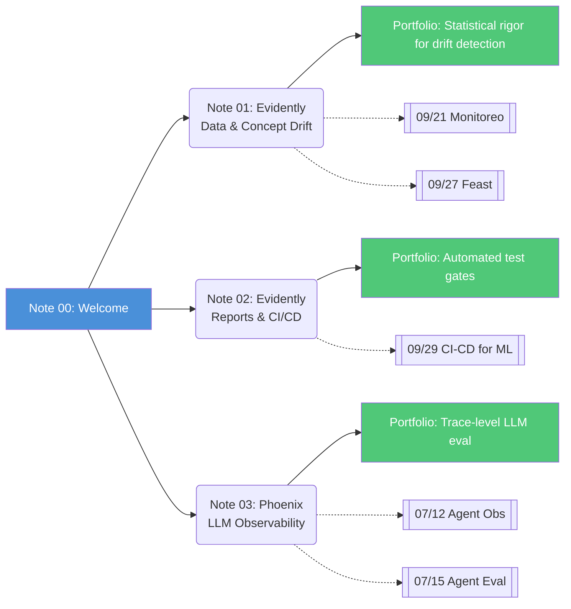

# 🏷️ Welcome to Evidently AI and Phoenix

## 🎯 Learning Objectives

- Distinguish ML monitoring from traditional DevOps monitoring at the metric and philosophical level
- Map the two-tool landscape: Evidently AI for classical ML, Phoenix by Arize for LLM observability
- Understand why **data distribution monitoring** — not infrastructure uptime — is the central challenge of production ML
- Position this course as the theoretical backbone of the Automated LLM Evaluation Suite portfolio project

## Introduction

**Etymology matters here.** *Evidently* comes from the Latin *evidens*, meaning "visible, manifest, self-evident." The mission is encoded in the name: making model quality degradation **evident** through rigorous statistical comparison of data distributions. A model that silently decays from 95% to 72% accuracy while your infrastructure dashboards glow green is the nightmare that Evidently exists to prevent. *Phoenix*, meanwhile, invokes the mythological bird reborn from its own ashes — a deliberate metaphor from Arize AI (the Apache 2.0 steward of the project). LLM deployments burn constantly: hallucination, prompt fragility, embedding space collapse. Phoenix provides the observability layer that catches these fires before they become catastrophic, and gives teams the data to rebuild better after each iteration.

Why do ML monitoring and LLM observability exist as **separate disciplines** from traditional DevOps monitoring? Because infrastructure metrics — CPU %, memory pressure, p99 latency, error rate — measure whether your *servers* are healthy. They say nothing about whether your *model* is healthy. A Kubernetes pod serving predictions at 50ms with 0.5% error rate can be perfectly operational while every prediction it serves is garbage, because the input data distribution shifted three weeks ago and nobody noticed. ML monitoring must answer a fundamentally different question: **"Is the world the model was trained on still the same world it's operating in?"** This requires distributional statistics (KS tests, JS divergence, Wasserstein distance), not threshold alerts on RAM consumption.

Your portfolio project — the **Automated LLM Evaluation Suite** — already implements semantic drift detection with a Gemma Golden Judge. This course gives that work theoretical depth: the statistical foundations that justify *why* drift detection matters, the test suites that catch degradation before it hits production, and the trace-level observability framework (Phoenix) that extends these ideas from classical ML into the LLM era. You are not learning abstract tools — you are learning the discipline that your project embodies. See [[09/21 - Monitoreo y Mantenimiento]], which introduces Evidently in its case study context, and [[07/15 - Agent Evaluation and Observability]], which covers semantic drift at the agent level.

---

## 1. The ML Monitoring Landscape: Two Tools, Two Paradigms

ML monitoring splits cleanly along a fault line created by the LLM revolution:

| Dimension | Evidently AI | Phoenix by Arize |
|---|---|---|
| **Target** | Classical ML models (tabular, structured) | LLMs, RAG pipelines, agents |
| **Core signal** | Statistical distribution drift | Embedding drift, span traces |
| **Instrumentation** | Batch reports on DataFrames | OpenTelemetry spans from frameworks |
| **License** | Apache 2.0 | Apache 2.0 |
| **Primary output** | HTML reports, JSON → CI/CD gates | Traces, UMAP clusters, eval scores |
| **Where in the pipeline** | Training-time + periodic batch | Real-time streaming traces |

This is not a "vs." comparison — these tools address different generations of the same problem. Evidently is used inside [[09/21 - Monitoreo y Mantenimiento]] as the reference implementation for drift detection; Phoenix appears in [[07/12 - Despliegue y Observabilidad de Agentes]] as the agent observability layer. Together they span the full MLOps monitoring stack.

## 2. Why Data Changes, Not Code Changes, Cause Most Failures

> "Your model doesn't degrade — your **DATA** changes."

This is the core thesis of this entire course. Software fails because of regressions in code — a bug is introduced, a dependency breaks, a race condition triggers. ML fails because the **statistical properties of the environment shift**: new user cohorts arrive, seasonal patterns invert, competitors change market dynamics, language evolves. None of these are code changes. They are data distribution changes that standard monitoring is completely blind to.

Consider a fraud detection model trained in 2023. By 2025, fraud patterns have evolved — but the model's architecture, weights, and serving infrastructure are identical to deployment day. CPU is stable, memory is low, throughput is normal. The model's precision drops from 91% to 67% because $P(Y|X)$ changed dramatically while $P(X)$ drifted more subtly. **Infrastructure monitoring is necessary but fundamentally insufficient.**

> **Caso real: Instacart's recommendation models** degraded 12% in recall over 6 months post-pandemic because grocery-buying behavior permanently shifted. Their infrastructure dashboards showed all green; an Evidently-style drift report on categorical feature distributions revealed the distribution of `department` visits had changed so drastically that the training data was from a different world.

## 3. Course Map



**Note 01** establishes the statistical foundations — KS test, JS divergence, Wasserstein distance — and shows how Evidently turns these into actionable drift reports. **Note 02** moves upstream: monitoring at *training time* via Test Suites in CI/CD pipelines. **Note 03** pivots to the LLM era with Phoenix, covering embedding drift (UMAP), span tracing, and LLM-native evaluation metrics. By the end, you will have both the theoretical understanding and the practical code to instrument any ML system for observability.

> 💡 **Tip:** If you have limited time, read Note 01 + Note 03. They capture the full spectrum: classical drift detection theory (backbone of your portfolio's semantic drift module) and LLM-native observability (the frontier your portfolio targets).

---

## 🎯 Key Takeaways

- ML monitoring is a **separate discipline** from DevOps monitoring because it measures distributional, not operational, health
- Evidently AI and Phoenix split cleanly: **classical ML vs LLM**, **batch statistics vs streaming traces**, **tabular drift vs embedding drift**
- The root cause of most production ML failures is **data change**, not code regressions — and standard monitoring is completely blind to it
- Your Automated LLM Evaluation Suite portfolio is a practical implementation of the theory in this course; this course gives it statistical depth
- Both tools are Apache 2.0 and can be integrated into existing CI/CD and observability stacks
- The course flows from **theory (drift statistics)** → **practice (test suites)** → **frontier (LLM observability)**

## 📦 Código de Compresión

```python
"""Welcome demo: Evidently detects drift, Phoenix traces LLM calls — 30 lines that capture both paradigms."""
import pandas as pd
from evidently.report import Report
from evidently.metric_preset import DataDriftPreset
from phoenix.trace.langchain import LangChainInstrumentor

# ---- Evidently: batch drift on tabular data ----
ref = pd.read_csv("training_data.csv")
cur = pd.read_csv("prod_data.csv")
report = Report(metrics=[DataDriftPreset()])
report.run(reference_data=ref, current_data=cur)
report.save_html("drift_report.html")
print("Evidently drift report saved.")

# ---- Phoenix: real-time LLM trace observability ----
from langchain.chat_models import ChatOpenAI
from langchain.chains import LLMChain
from langchain.prompts import PromptTemplate

LangChainInstrumentor().instrument()
chain = LLMChain(
    llm=ChatOpenAI(model="gpt-4", temperature=0),
    prompt=PromptTemplate.from_template("Summarize: {text}")
)
result = chain.run(text="Your production input here...")
print(f"LLM output (traced by Phoenix): {result[:100]}...")
```

## References

- Evidently AI Documentation: [docs.evidentlyai.com](https://docs.evidentlyai.com)
- Phoenix by Arize Documentation: [docs.arize.com/phoenix](https://docs.arize.com/phoenix)
- [[09/21 - Monitoreo y Mantenimiento]] — Evidently in production monitoring case study
- [[09/22 - End-to-End ML Project]] — Evidently integrated into end-to-end pipeline
- [[09/26 - ML Platform Engineering]] — Evidently in monitoring tool comparison table
- [[07/12 - Despliegue y Observabilidad de Agentes]] — Phoenix in agent observability frameworks
- [[07/15 - Agent Evaluation and Observability]] — Semantic drift detection and LLM evaluation
