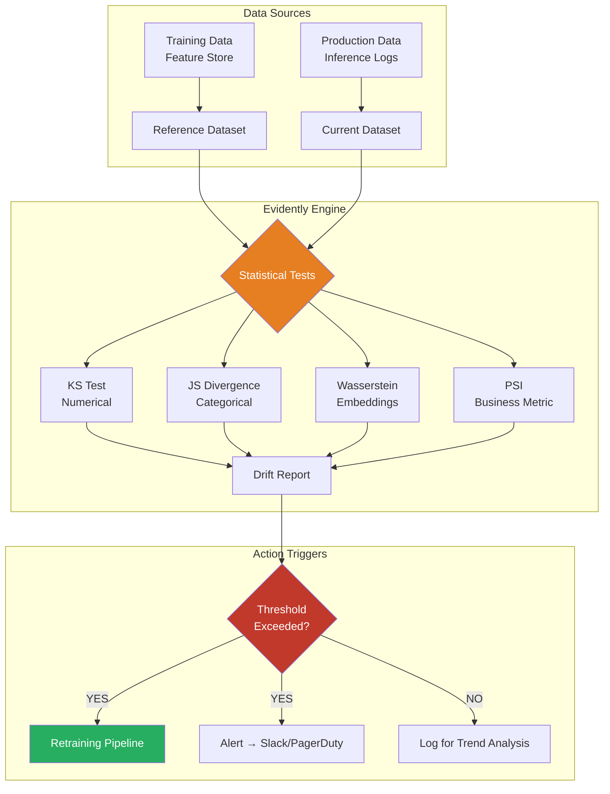

# 🏷️ Evidently AI — Data Drift, Concept Drift, and Statistical Foundations

## 🎯 Learning Objectives

- Formalize data drift (covariate shift), concept drift, and target drift with precise mathematical definitions
- Master four statistical tests for drift detection: KS, JS divergence, Wasserstein distance, and PSI
- Choose the right test for the right data type (numerical, categorical, high-dimensional embeddings)
- Build a reference window strategy that accounts for seasonality and business cycles
- Connect drift detection theory to your portfolio's semantic drift module

## Introduction

**"Your model doesn't degrade — your DATA changes."** This sentence is not a slogan; it is the fundamental axiom that justifies the entire discipline of ML monitoring. When your production model silently slips from 95% to 82% accuracy over six weeks without a single infrastructure alert firing, you are not experiencing a code regression or a hardware failure — you are experiencing **distribution shift**: the statistical world your model was trained on no longer matches the world it serves. The CPU is fine. The GPU is well under capacity. Latency is at p50 < 50ms. Nothing in your Prometheus/Grafana stack blinks, because Prometheus measures *operational* health, not *distributional* health. This is why ML monitoring is a separate discipline, and this is why Evidently AI exists — to make the invisible visible.

The concept of drift detection has deep roots in statistical process control (Shewhart, 1920s) and change-point detection (Page, 1954), but those classical methods assumed stationary univariate processes. ML systems shatter those assumptions: thousands of features, non-linear interactions, categorical and text data, and seasonal patterns that make "normal" a moving target. Evidently AI operationalizes modern non-parametric drift detection for the ML era, computing distributional distance metrics between reference and current data windows for every feature in your dataset. Your portfolio project — the Automated LLM Evaluation Suite — already detects semantic drift in LLM outputs. This note gives you the statistical theory that transforms that from a heuristic into a rigorous measurement. See [[09/21 - Monitoreo y Mantenimiento]] for the monitoring architecture where Evidently fits, and [[09/27 - Feast]] for drift detection integrated with feature stores.

---

## 1. The Three Faces of Drift: Data, Concept, and Target

### 1.1 Data Drift (Covariate Shift)

**Data drift** — formally, covariate shift — occurs when the marginal distribution of input features shifts:

$$P_{\text{train}}(X) \neq P_{\text{current}}(X)$$

For a specific feature $j$, we compare the reference distribution $P_{\text{ref}}(X_j)$ (typically training data) against the current production distribution $P_{\text{cur}}(X_j)$. If these distributions diverge beyond a threshold, **data drift is detected**. Crucially, this definition says nothing about whether prediction quality actually degraded — data drift is a *necessary but not sufficient* condition for model decay.

> **Example:** A credit scoring model was trained on applicant income data following a normal distribution $\mathcal{N}(58000, 15000^2)$. Six months later, the production distribution has shifted to $\mathcal{N}(49000, 18000^2)$ due to an economic downturn. The model is now predicting on people systematically poorer than its training population, producing biased risk scores — despite no code changes, no latency spikes, and perfectly healthy infrastructure.

> ⚠️ **Warning:** Data drift detection on a single feature is rarely actionable. Real-world drift is multivariate — the joint distribution $P(X_1, X_2, \dots, X_n)$ can shift even when all marginal distributions $P(X_i)$ appear stable. Evidently reports drifts per-feature, but always cross-reference with correlation shifts.

### 1.2 Concept Drift

**Concept drift** is the more insidious sibling: the conditional distribution $P(Y|X)$ changes — the same input now means something different:

$$P_{\text{train}}(Y|X) \neq P_{\text{current}}(Y|X)$$

> **Example:** A transaction classified as "risky fraud" in 2019 ($X$ = $1000 transfer to Eastern Europe, $Y$ = fraud) is classified as "normal" in 2025 because behavioral norms shifted and the model's concept of fraud became outdated. The transaction looks identical to the old one — but the world changed around the model.

> **¡Sorpresa!** Concept drift is **undetectable without labels**. You cannot measure $P(Y|X)$ drift unless you have ground-truth labels for current production data, which are often delayed by days or weeks. This is called the **feedback delay problem** and it's why many teams rely on proxy metrics (user complaints, churn rate, support ticket volume) to infer concept drift. Evidently's `DataDriftPreset` cannot directly detect concept drift — it detects data drift and you must cross-reference with performance metrics when labels arrive.

### 1.3 Target Drift

**Target drift** is when the prior distribution of the target variable shifts:

$$P_{\text{train}}(Y) \neq P_{\text{current}}(Y)$$

> **Example:** Click-through rate (CTR) drops from 3.2% to 1.1% globally after a UI redesign, even though the model's ranking quality is unchanged. The model isn't "wrong" — the population behavior changed. Target drift often signals a real business change, not a model failure.

> 💡 **Tip:** Target drift and concept drift are often confused. Target drift means $P(Y)$ changed (more clicks, more fraud, more churn). Concept drift means $P(Y|X)$ changed (the same input predicts differently). A model can experience target drift without concept drift, and vice versa.

---

## 2. Statistical Tests for Drift Detection

Evidently AI supports multiple distributional distance metrics. Choosing the right one depends on your feature type, sample size, sensitivity needs, and interpretability requirements.

### 2.1 Kolmogorov-Smirnov (KS) Test — Numerical Features

The **Kolmogorov-Smirnov statistic** measures the maximum vertical distance between two empirical cumulative distribution functions (ECDFs):

$$D = \max_{x} \left| F_{\text{current}}(x) - F_{\text{reference}}(x) \right|$$

where $F(x) = \frac{1}{n}\sum_{i=1}^{n} \mathbf{1}_{X_i \leq x}$ is the empirical CDF.

**Properties:**
- **Non-parametric**: makes no distributional assumptions
- **Sensitive to location shifts**: detects when the median/mean moves
- **Bounded [0, 1]**: easy to interpret and threshold
- **Insensitive to tails**: may miss distribution changes in extreme quantiles
- **Sample-size sensitive**: with large $n$, even tiny shifts become "significant" — use the statistic value, not the p-value

> ✅ **When to use:** Numerical features, quick sanity check, interpretable for stakeholders ("the maximum difference between training and production distributions is 0.14")

> ❌ **When to avoid:** Categorical features (no natural ordering), high-dimensional data (curse of dimensionality), when tail behavior matters (use Wasserstein)

> **Caso real: DoorDash** monitors 2000+ features with Evidently's KS test across 50+ models. When `avg_delivery_time` drift exceeds $D > 0.10$, it triggers a 15-minute automated retraining pipeline because historical analysis showed that KS drift on this feature predicts delivery time prediction errors with 89% recall. The retraining pipeline pulls fresh data from the feature store, retrains the ETA model, runs evaluation, and hot-swaps the model — all without human intervention.

### 2.2 Jensen-Shannon (JS) Divergence — Categorical Features

The **Jensen-Shannon divergence** is a symmetrized and smoothed version of the Kullback-Leibler divergence:

$$JS(P \parallel Q) = \frac{1}{2} \cdot KL(P \parallel M) + \frac{1}{2} \cdot KL(Q \parallel M)$$

where $M = \frac{P + Q}{2}$ is the pointwise mixture distribution, and:

$$KL(P \parallel Q) = \sum_{i} P(i) \cdot \ln\left(\frac{P(i)}{Q(i)}\right)$$

**Properties:**
- **Symmetric**: $JS(P \parallel Q) = JS(Q \parallel P)$ — unlike KL divergence
- **Bounded [0, ln(2)]**: after normalization, [0, 1] — easy thresholding
- **Works for categorical and binned numerical features**: compare probability mass functions
- **Zero when distributions are identical**: $JS(P \parallel P) = 0$

> ✅ **When to use:** Categorical features (`country`, `device_type`, `payment_method`), binned numerical features, text topic distributions

> ❌ **When to avoid:** Raw high-cardinality categorical features (bin first), distributions with zero-probability categories in one distribution (JS handles this better than KL but still sensitive)

> **¡Sorpresa!** JS divergence on a categorical feature with 3 categories will report "no drift" while your model's accuracy is crashing — if the important feature is *numerical* and you only monitored categoricals. You must monitor **all feature types** with their appropriate distance metric. JS divergence on `device_type` catches user-agent changes; KS on `transaction_amount` catches economic shifts. Together they provide coverage.

### 2.3 Wasserstein Distance — Embeddings and Complex Distributions

The **Wasserstein distance** (Earth Mover's Distance) measures the minimum "work" required to transform one distribution into another:

$$W(P, Q) = \inf_{\gamma \in \Gamma(P, Q)} \int |x - y| \cdot d\gamma(x, y)$$

where $\Gamma(P, Q)$ is the set of all joint distributions with marginals $P$ and $Q$.

For discrete empirical distributions $\hat{P}_n = \frac{1}{n}\sum_{i=1}^{n} \delta_{x_i}$ and $\hat{Q}_m = \frac{1}{m}\sum_{j=1}^{m} \delta_{y_j}$:

$$W(\hat{P}_n, \hat{Q}_m) = \min_{\pi} \sum_{i,j} \pi_{ij} \cdot |x_i - y_j|$$

subject to $\sum_j \pi_{ij} = \frac{1}{n}$ and $\sum_i \pi_{ij} = \frac{1}{m}$. This is an optimal transport problem solvable via the Hungarian algorithm or Sinkhorn iterations.

**Properties:**
- **Geometrically meaningful**: captures not just whether distributions differ, but **how far** the mass must move
- **Sensitive to both location and shape**: catches shifts KS misses (e.g., bimodal → unimodal with same mean)
- **Works in arbitrary dimensions**: suitable for embedding vectors
- ❌ **No closed-form solution for large samples** — computationally $O(n^3)$ for exact, but Sinkhorn approximation is $O(n^2)$

> ✅ **When to use:** Embedding drift (text, image), high-dimensional features, when you care about **how much** the distribution shifted (not just whether)

> **Caso real: A recommendation system** at a major e-commerce platform uses Wasserstein distance on user embedding vectors (256-dim) to detect week-over-week behavioral drift. KS and JS both reported "no significant drift" because the embedding space shift was multi-modal (some user clusters shifted up, others down, mean stayed the same). Wasserstein caught it, triggering a retraining that recovered 4.7% of recommendation recall.

### 2.4 Population Stability Index (PSI) — Industry Standard

The **Population Stability Index** is the banking industry's de facto drift metric, derived from information theory:

$$PSI = \sum_{i=1}^{B} (Q_i - P_i) \cdot \ln\left(\frac{Q_i}{P_i}\right)$$

where $P_i$ and $Q_i$ are the proportions of the reference and current populations in bin $i$ (typically 10-20 equal-width or equal-frequency bins).

**Interpretation scale:**
- PSI < 0.1: No significant drift
- 0.1 ≤ PSI < 0.25: Moderate drift — investigate
- PSI ≥ 0.25: Significant drift — action required

> ✅ **When to use:** Business reporting, regulatory compliance (banking/finance), stakeholder communication — PSI is the most widely understood drift metric in industry

> ❌ **When to avoid:** Small samples (bins become unstable), when you need spatial/ordering sensitivity (KS is better)

> ⚠️ **Warning:** PSI is **sensitive to binning strategy**. Equal-width bins vs equal-frequency bins vs quantile-based bins will produce different PSI values for the same data. Document your binning strategy and keep it consistent across monitoring cycles.

---

## 3. Reference Window Strategy

The "reference" distribution against which all drift is measured is not a trivial choice. Your reference window determines what "normal" means. Choose wrong, and you either miss real drift or drown in false positives.

### 3.1 Reference Window Options

| Strategy | Use Case | Risk |
|---|---|---|
| **Training data** (fixed) | Stable environments, model trained once and deployed long-term | Drifts eventually always detected as the world naturally evolves |
| **Last N days** (rolling) | Rapidly changing environments, detects sudden shifts | Misses slow, creeping drift — the model degrades gradually and each step looks "normal" |
| **Seasonal window** (same period last year) | Strong seasonality (retail Q4, travel summer) | Irrelevant during structural changes (e.g., post-COVID patterns) |
| **Multi-window** (training + rolling + seasonal) | Production-grade monitoring | Complex to configure but most robust |

### 3.2 The Creeping Drift Problem

> ❌ **Wrong approach:** Set a rolling 7-day reference window. Every day, the model drifts slightly. Each day, the drift is "within threshold" because you're comparing against yesterday. After 90 days, the model has drifted catastrophically, but your monitoring never fired because each step was small.

> ✅ **Right approach:** Maintain a **pinned reference** (training data or a golden validation set) AND a **rolling reference** (last 30 days). The pinned reference catches long-term drift; the rolling reference catches sudden shocks.

> 💡 **Tip:** In Evidently, you can run the same `Report` with different `reference_data` DataFrames on a schedule (daily with rolling ref, weekly with pinned ref) to get both perspectives without configuration changes.

---

## 4. Drift Detection Architecture with Evidently



---

## 5. Hands-on: Evidently Drift Report

```python
"""Evidently DataDriftPreset on production data with KS, JS, and PSI metrics."""
import pandas as pd
from evidently.report import Report
from evidently.metric_preset import DataDriftPreset

# Simulate reference (training) and current (production) data
import numpy as np
np.random.seed(42)

ref = pd.DataFrame({
    "age": np.random.normal(42, 12, 1000),
    "income": np.random.lognormal(10.8, 0.4, 1000),
    "country": np.random.choice(["US", "UK", "DE", "FR"], 1000, p=[0.4, 0.3, 0.2, 0.1]),
    "score": np.random.beta(2, 5, 1000),
})

# Simulate drift: income shifts up, country proportions change, score distribution spreads
cur = pd.DataFrame({
    "age": np.random.normal(43, 13, 1000),
    "income": np.random.lognormal(11.0, 0.6, 1000),  # Mean increased, variance increased
    "country": np.random.choice(["US", "UK", "DE", "FR", "BR", "IN"], 1000,
                                p=[0.3, 0.2, 0.15, 0.1, 0.15, 0.1]),  # New categories!
    "score": np.random.beta(3, 4, 1000),  # Distribution shifted right
})

report = Report(metrics=[DataDriftPreset()])
report.run(reference_data=ref, current_data=cur)
report.save_html("drift_report_v01.html")

# Parse JSON for automated alerting
result_json = report.json()
import json
data = json.loads(result_json)
for metric in data["metrics"]:
    if metric["metric"] == "DataDriftTable":
        for feature, values in metric["result"]["drift_by_columns"].items():
            status = "DRIFT" if values["drift_detected"] else "OK"
            print(f"[{status}] {feature}: KS={values.get('ks_statistic', 'N/A')}")
```

> ¡Sorpresa! The `country` feature will trigger drift detection because categories `BR` and `IN` appear in production data but never existed in training data. Evidently flags this as a categorical distribution shift. In production, this is **new user markets** — your fraud model was never trained on Brazilian transaction patterns. The drift detection caught a business problem, not just a statistical curiosity.


*Figure: Evidently data drift dashboard showing per-feature drift detection with KS statistic (numerical features) and JS divergence (categorical features). Green = no drift detected, yellow = moderate drift, red = significant drift. Source: Evidently AI documentation.*

---

## 🎯 Key Takeaways

- **Data drift** ($P(X)$ changes), **concept drift** ($P(Y|X)$ changes), and **target drift** ($P(Y)$ changes) are distinct phenomena requiring different detection strategies
- **KS test** is the workhorse for numerical features — interpretable, non-parametric, fast to compute; use the statistic value, not the p-value, for large samples
- **JS divergence** handles categorical and binned features — symmetric, bounded, and numerically stable compared to KL divergence
- **Wasserstein distance** captures distributional changes KS misses (shape changes, multimodal shifts), critical for embedding drift; computationally heavier but essential for high-dimensional monitoring
- **PSI** is the industry standard for regulatory reporting and stakeholder communication, but its sensitivity to binning strategy demands documentation
- Reference window strategy is as important as the statistical test — use a **pinned reference** for long-term drift AND a **rolling reference** for sudden shocks
- Concept drift is **undetectable without labels** — plan for the feedback delay by monitoring proxy metrics (churn, complaints, support ticket volume) between label arrivals

## 📦 Código de Compresión

```python
"""Minimal drift detection with all four metrics, Evidently style."""
import numpy as np
import pandas as pd
from evidently.report import Report
from evidently.metric_preset import DataDriftPreset, TargetDriftPreset
from evidently import ColumnMapping

np.random.seed(42)
ref = pd.DataFrame({"x1": np.random.normal(0, 1, 500),
                     "x2": np.random.choice(["A","B","C"], 500, p=[0.5,0.3,0.2]),
                     "target": np.random.binomial(1, 0.3, 500)})
cur = pd.DataFrame({"x1": np.random.normal(0.3, 1.3, 500),  # drifted
                     "x2": np.random.choice(["A","B","C","D"], 500, p=[0.3,0.3,0.2,0.2]),
                     "target": np.random.binomial(1, 0.3, 500)})

col_map = ColumnMapping(numerical_features=["x1"],
                         categorical_features=["x2"],
                         target="target")
Report(metrics=[DataDriftPreset(), TargetDriftPreset()]) \
    .run(reference_data=ref, current_data=cur, column_mapping=col_map) \
    .save_html("compressed_drift.html")
print("Drift report with DataDrift + TargetDrift presets saved.")
```

## References

- Evidently AI — Data Drift Documentation: [docs.evidentlyai.com/presets/data-drift](https://docs.evidentlyai.com/presets/data-drift)
- Gama, J., Žliobaitė, I., Bifet, A., Pechenizkiy, M., & Bouchachia, A. (2014). *A survey on concept drift adaptation.* ACM Computing Surveys.
- Rabanser, S., Günnemann, S., & Lipton, Z. (2019). *Failing Loudly: An Empirical Study of Methods for Detecting Dataset Shift.* NeurIPS.
- Villani, C. (2009). *Optimal Transport: Old and New.* Springer. (Wasserstein distance foundations)
- Siddiqi, N. (2006). *Credit Risk Scorecards.* Wiley. (PSI as industry standard)
- [[09/21 - Monitoreo y Mantenimiento]] — Evidently in production monitoring case study
- [[09/27 - Feast]] — Drift detection integrated with feature stores
- [[09/22 - End-to-End ML Project]] — Evidently drift reports in MLOps pipelines
- [[09/23 - Advanced MLOps]] — PSI implementation in advanced drift detection
