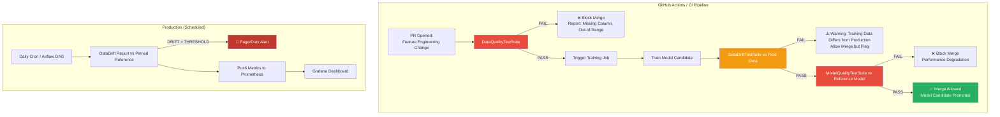

# 🏷️ Evidently AI — Reports, Test Suites, and CI/CD Integration

## 🎯 Learning Objectives

- Distinguish Evidently **Reports** (exploratory, human-in-the-loop) from **Test Suites** (assertive, CI/CD gates)
- Implement data quality tests that catch silent feature engineering bugs BEFORE training
- Design a CI/CD pipeline where ML model quality is gated with the same rigor as software unit tests
- Parse Evidently JSON output to push metrics to Prometheus, Grafana, and alerting systems
- Connect automated ML validation to your portfolio's evaluation pipeline architecture

## Introduction

Drift detection — the subject of Note 01 — is **Day-2 monitoring**: observing a model that is already in production and detecting when the world has changed around it. But the most impactful moment to catch problems is **before deployment**, at training time. If your training data has 40% missing values in a critical column, or if the feature distribution in this week's training batch is radically different from last month's, or if the new model candidate performs worse than the current production model — you should never ship it. This is the thesis of Evidently's Test Suites: monitoring should start at training time, as automated gates in your CI/CD pipeline, before a single prediction serves.

This shift — from *observing* model decay to *preventing* model decay — is the inflection point between reactive MLOps and mature MLOps. It is the same philosophy that drives your Automated LLM Evaluation Suite portfolio: don't wait for users to report bad outputs; build automated quality gates that validate every model change before it reaches a user. Evidently provides the classical ML equivalent with JSON-serializable, CI/CD-friendly test assertions. See [[09/29 - CI-CD for ML]] for pipeline patterns and [[09/18 - Experiment Tracking y Model Registry]] for where model quality validation fits in the experiment lifecycle.

---

## 1. Reports vs Test Suites: Two Modes, One Library

Evidently AI operates in two fundamentally different modes, using the same statistical engine but serving different workflows:

| Dimension | Reports | Test Suites |
|---|---|---|
| **Purpose** | Exploratory analysis, human investigation | Automated pass/fail gates |
| **Output** | Interactive HTML report, JSON data | Pass/fail JSON with conditions |
| **Consumer** | Data scientist, ML engineer (human) | CI/CD pipeline, Airflow DAG (machine) |
| **Workflow** | "Show me what's happening" | "Prevent bad things from shipping" |
| **When it runs** | Ad-hoc, weekly, on-demand | Every PR, every training run, on schedule |
| **Verb** | Observe | Prevent |

> ✅ **Right pattern:** Use Test Suites in CI/CD (block bad deployments) AND periodic Reports (understand long-term trends). They complement each other.

> ❌ **Wrong pattern:** Use only Reports and manually check them. Human attention is the bottleneck; drift that happens on Friday at 6pm won't be noticed until Monday at 10am.

---

## 2. Data Quality Tests: Catching Bugs at the Data Layer

The most common cause of model failure — more common than drift — is **broken data**. Column renames, schema changes, pipeline failures that silently produce NULLs, upstream data source migrations that change encodings. Evidently's `DataQualityTestPreset` catches these before they become model failures.

### 2.1 Built-in Data Quality Tests

| Test | What It Catches | Impact If Missed |
|---|---|---|
| **Missing values %** | ETL pipeline silently dropping values | Model predicts on NULLs with default imputation → systematically wrong predictions |
| **Duplicates %** | Upsert logic bug duplicating rows | Training data inflated, model overfits on duplicated examples |
| **Out-of-range %** | Sensor malfunction, integer overflow | Outliers poison gradient updates, model diverges during training |
| **Constant columns** | Feature generation pipeline broken | Zero-variance feature = dead weight, wastes compute |
| **Empty rows** | Kafka consumer lag causing empty records | Model receives garbage input, produces garbage output |
| **Category mismatch** | New category values not in training vocabulary | One-hot encoding produces all zeros → feature effectively missing |

> **Caso real: A fintech startup** runs Evidently `DataQualityTestPreset` as a GitHub Actions check on every PR that modifies the training pipeline. In the first month of adoption, **40% of PRs failed on their first commit** because of unintended feature engineering changes caught by data quality tests. Common failures: column `total_amount` was renamed to `amount_total`, a regex feature extractor silently returned empty strings for 12% of rows, and a Spark job migration accidentally changed NULL encoding from `NaN` to empty string, causing the `is_missing` test to fire. **None of these would have been caught by code review alone.**

> **¡Sorpresa!** The `DataQualityTestPreset` catches column renaming bugs silently. If a developer renames `customer_lifetime_value` to `clv` in the feature pipeline but forgets to update a downstream model configuration, the test fires with "Column `customer_lifetime_value` not found in current data." This would otherwise produce a silent feature drop — the model trains with one fewer feature, quality degrades by 3%, and nobody notices for weeks.

### 2.2 Custom Thresholds

```python
from evidently.test_suite import TestSuite
from evidently.tests import TestColumnValueRange, TestNumberOfMissingValues

tests = TestSuite(tests=[
    TestNumberOfMissingValues(column_name="age", lt=10),     # < 10 missing
    TestNumberOfMissingValues(column_name="income", lt=5),    # < 5 missing
    TestColumnValueRange(column_name="score", left=0, right=1),  # Must be in [0,1]
])
tests.run(reference_data=train_df, current_data=new_batch_df)
```

> 💡 **Tip:** Set thresholds based on **what your model can tolerate**, not what "looks reasonable." If your model's accuracy degrades by >1% when any feature exceeds 3% missing values, set the threshold at 3%. Don't use generic 5-10% defaults.

---

## 3. Model Quality Tests: Performance Gates as Code

### 3.1 Regression Model Tests

| Test | Formula | Threshold |
|---|---|---|
| **MAE** | $\text{MAE} = \frac{1}{n}\sum |y_i - \hat{y}_i|$ | Must be ≤ reference MAE + tolerance |
| **RMSE** | $\text{RMSE} = \sqrt{\frac{1}{n}\sum (y_i - \hat{y}_i)^2}$ | Must be ≤ reference RMSE × 1.1 |
| **R²** | $R^2 = 1 - \frac{\sum (y_i - \hat{y}_i)^2}{\sum (y_i - \bar{y})^2}$| Must be ≥ reference R² - 0.05 |
| **MAPE** | $\text{MAPE} = \frac{100\%}{n}\sum \left|\frac{y_i - \hat{y}_i}{y_i}\right|$ | Must be ≤ reference MAPE + 5% |

### 3.2 Classification Model Tests

| Test | Formula | Threshold |
|---|---|---|
| **Accuracy** | $\frac{TP + TN}{TP + TN + FP + FN}$ | Must be ≥ reference accuracy - 0.03 |
| **Precision (per class)** | $\frac{TP}{TP + FP}$ | Must be ≥ reference precision - 0.05 |
| **Recall (per class)** | $\frac{TP}{TP + FN}$ | Must be ≥ reference recall - 0.05 |
| **F1 (per class)** | $2 \cdot \frac{P \cdot R}{P + R}$ | Must be ≥ reference F1 - 0.05 |

> **Caso real: Booking.com** uses Evidently daily reports on 100+ models. A hotel recommendation model serving millions of users silently degraded from 78% to 64% accuracy over 3 weeks because post-pandemic travel patterns shifted booking behavior. Evidently daily model quality reports caught the degradation; traditional infrastructure monitoring (CPU, memory, latency) showed all green throughout. The model was retrained on recent data and recovered to 81% accuracy — but 3 weeks of suboptimal recommendations had already impacted revenue. The post-mortem led to a change: model quality tests now run **daily** with a stricter 48-hour SLA on degradation alerts.

---

## 4. CI/CD Integration Architecture



### 4.1 The Four-Gate Pipeline

**Gate 1: Data Quality (Blocking)**
Runs on every PR, every commit. Tests for missing values, duplicates, out-of-range values, constant columns, empty rows, category mismatches. **If this fails, the PR cannot be merged.** This catches 80% of data issues before they cost a single GPU-hour of training.

**Gate 2: Data Drift Warning (Non-blocking)**
After training, compares the training data distribution against current production data. If drift is detected, the PR merges with a ⚠️ warning — the model was trained on data that differs from production. This doesn't block deployment but alerts the team that the model may perform differently than expected.

**Gate 3: Model Quality (Blocking)**
Compares the new model candidate against the current production model on a held-out test set. If the new model's accuracy/MAE/RMSE is worse than production by more than the tolerance, **the PR is blocked.** This prevents regression in model quality.

**Gate 4: Production Monitoring (Continuous)**
On a schedule (daily cron, Airflow DAG), runs drift reports comparing current production data against a pinned reference (training data or golden validation set). If drift exceeds thresholds, fires alerts via PagerDuty, Slack, or email. Metrics are pushed to Prometheus for Grafana dashboards.

> ⚠️ **Warning:** Gate 3 requires a **holdout test set** that is representative of production data. If your test set is stale or biased, the Model Quality gate provides false confidence. Periodically refresh your test set with recent labeled production data.

---

## 5. JSON Output for Monitoring Stack Integration

Evidently generates structured JSON output that can be parsed and pushed to any monitoring stack. This is the bridge between exploratory analysis (Reports) and automated alerting.

```python
"""Parse Evidently JSON output and push to Prometheus Pushgateway."""
import json
import requests
from evidently.report import Report
from evidently.metric_preset import DataDriftPreset

report = Report(metrics=[DataDriftPreset()])
report.run(reference_data=train_df, current_data=prod_df)
result = json.loads(report.json())

# Extract per-feature drift metrics
drift_metrics = {}
for metric in result["metrics"]:
    if metric["metric"] == "DataDriftTable":
        for feature, stats in metric["result"]["drift_by_columns"].items():
            drift_metrics[f"evidently_drift_{feature}_detected"] = \
                1 if stats["drift_detected"] else 0
            if "ks_statistic" in stats:
                drift_metrics[f"evidently_ks_{feature}"] = stats["ks_statistic"]

# Push to Prometheus Pushgateway
PUSHGATEWAY = "http://prometheus-pushgateway:9091"
for metric_name, value in drift_metrics.items():
    requests.post(
        f"{PUSHGATEWAY}/metrics/job/evidently_drift",
        data=f"{metric_name} {value}\n"
    )
print(f"Pushed {len(drift_metrics)} drift metrics to Prometheus.")
```

This pattern enables:
- **Grafana dashboards** with time-series drift metrics per feature
- **AlertManager rules**: `evidently_ks_avg_transaction_amount > 0.15` → PagerDuty
- **Trend analysis**: track drift metrics over months to identify seasonal patterns

---

## 6. Visual Diagnostics: Answering "Why?"

Evidently's visualizations answer the question that matters most after a test suite failure: **not just "did my model fail?" but "WHY did my model fail?"**

### 6.1 Target Drift Plot

The target drift visualization compares the distribution of predictions or target values between reference and current data. A histogram shift to the right (or left) indicates that the model is predicting systematically higher (or lower) values — a sign of concept or target drift.

### 6.2 Confusion Matrix Over Time

For classification models, the confusion matrix over time shows how per-class error patterns evolve. A model that confuses class A with class B more frequently over successive monitoring windows signals a specific type of concept drift — the boundary between these two classes is shifting.

### 6.3 Prediction Drift Plot

Shows the distribution of prediction probabilities. If the model's confidence distribution shifts (e.g., it starts producing more uncertain predictions), it may indicate that the model is encountering out-of-distribution inputs it wasn't trained on.


*Figure: Evidently regression performance report showing error distribution, predicted vs actual scatter plot, and residual analysis — visual diagnostics that explain model degradation, not just detect it. Source: Evidently AI documentation.*

---

## 7. Hands-on: Complete CI/CD Gate

```python
"""Evidently Test Suite as a CI/CD gate: 3-step pipeline with blocking thresholds."""
import pandas as pd
import numpy as np
from evidently.test_suite import TestSuite
from evidently.tests import *

np.random.seed(42)

# Simulated datasets
train = pd.DataFrame({
    "feat_a": np.random.normal(0, 1, 500),
    "feat_b": np.random.choice(["X", "Y", "Z"], 500, p=[0.5, 0.3, 0.2]),
    "target": np.random.normal(50, 10, 500),
})
new = pd.DataFrame({
    "feat_a": np.concatenate([np.random.normal(0.3, 1.3, 400), [np.nan]*100]),
    # 100 NaN values injected — data quality bug!
    "feat_b": np.random.choice(["X", "Y", "Z", "W"], 500, p=[0.3, 0.3, 0.2, 0.2]),
    # New category "W" — categorical drift
    "target": np.random.normal(52, 12, 500),
    # Mean shifted by 2, variance increased — target drift
})

# 🛑 Gate 1: Data Quality (BLOCKING if failed)
quality_suite = TestSuite(tests=[
    TestNumberOfMissingValues(column_name="feat_a", lt=20),
    TestNumberOfMissingValues(column_name="feat_b", lt=10),
    TestNumberOfMissingValues(column_name="target", lt=10),
])
quality_suite.run(reference_data=train, current_data=new)
print("=== GATE 1: Data Quality ===")
print(f"PASSED: {quality_suite.as_dict()['summary']['success_tests']}")
print(f"FAILED: {quality_suite.as_dict()['summary']['failed_tests']}")
for test in quality_suite.as_dict()['tests']:
    if test['status'] == 'FAIL':
        print(f"  ❌ {test['name']}: {test['description']}")

# 🛑 Gate 2: Data Drift (WARNING if failed, non-blocking)
from evidently.report import Report
from evidently.metric_preset import DataDriftPreset

drift_report = Report(metrics=[DataDriftPreset()])
drift_report.run(reference_data=train, current_data=new)
print("\n=== GATE 2: Data Drift ===")
drift_json = json.loads(drift_report.json())
dataset_drift = drift_json['metrics'][0]['result']['dataset_drift']
print(f"Dataset Drift Detected: {dataset_drift}")

# 🛑 Gate 3: Model Quality (BLOCKING if performance degraded)
# Simulate model predictions (in practice, use actual model.predict())
y_pred_ref = np.random.normal(50, 8, 500)
y_pred_cur = np.random.normal(52, 13, 500)  # Higher error — degraded

quality_suite2 = TestSuite(tests=[
    TestMAE(),
    TestRMSE(),
])
quality_suite2.run(
    reference_data=pd.DataFrame({"target": train["target"], "prediction": y_pred_ref}),
    current_data=pd.DataFrame({"target": new["target"], "prediction": y_pred_cur})
)
print("\n=== GATE 3: Model Quality ===")
for test in quality_suite2.as_dict()['tests']:
    icon = "✅" if test['status'] == "SUCCESS" else "❌"
    print(f"  {icon} {test['name']}: {test.get('description', 'N/A')}")
```

> **¡Sorpresa!** Gate 1 will fail because 100 `NaN` values were injected into `feat_a` — the test `NumberOfMissingValues` fires because 100 > 20. Gate 2 will show dataset drift because new category "W" appeared. Gate 3 may show model degradation because the target distribution shifted. **This pipeline caught three distinct failure modes in under 2 seconds** — something manual review would never achieve at scale.

---

## 🎯 Key Takeaways

- **Reports** are for humans (exploratory); **Test Suites** are for machines (assertive CI/CD gates); use both
- Data quality tests should be the **first blocking gate** in any ML CI/CD pipeline — they catch 80% of issues before training costs a single GPU-hour
- Model quality gates must use **tolerances, not exact comparisons** — a model can be "worse" by 0.5% accuracy and still be the best candidate when the alternative is no update
- JSON output from Evidently Test Suites is the bridge to production monitoring stacks — parse it, push to Prometheus, visualize in Grafana, alert via AlertManager
- A **four-gate pipeline** (Data Quality → Data Drift Warning → Model Quality → Production Monitoring) provides defense-in-depth against model degradation
- Visual diagnostics (target drift plots, confusion matrices over time, prediction drift) answer "why" not just "what" — essential for root-cause analysis
- CI/CD-gated model validation is the same philosophy as your portfolio's automated evaluation pipeline — just applied to classical ML metrics instead of LLM-as-a-Judge

## 📦 Código de Compresión

```python
"""One-liner Evidently CI/CD gate: 3 test suites, fail if any gate breaks."""
import json
import numpy as np
import pandas as pd
from evidently.test_suite import TestSuite
from evidently.test_preset import DataQualityTestPreset, DataDriftTestPreset
from evidently.tests import TestMAE

np.random.seed(42)
ref = pd.DataFrame({"f1": np.random.normal(0, 1, 300),
                     "target": np.random.normal(10, 2, 300)})
cur = pd.DataFrame({"f1": np.random.normal(0.15, 1.1, 300),
                     "target": np.random.normal(10.5, 2.5, 300)})

gates = {
    "quality": TestSuite(tests=[DataQualityTestPreset()]),
    "drift":   TestSuite(tests=[DataDriftTestPreset()]),
    "model":   TestSuite(tests=[TestMAE()]),
}
for name, suite in gates.items():
    suite.run(reference_data=ref, current_data=cur)
    ok = suite.as_dict()["summary"]["success_tests"]
    fail = suite.as_dict()["summary"]["failed_tests"]
    print(f"Gate '{name}': ✅ {ok} passed, ❌ {fail} failed")
```

## References

- Evidently AI — Test Suites Documentation: [docs.evidentlyai.com/user-guide/tests](https://docs.evidentlyai.com/user-guide/tests)
- Evidently AI — CI/CD Integration Guide: [docs.evidentlyai.com/integrations](https://docs.evidentlyai.com/integrations)
- Sculley, D. et al. (2015). *Hidden Technical Debt in Machine Learning Systems.* NeurIPS. — The foundational paper on why ML pipelines need automated validation gates
- [[09/29 - CI-CD for ML]] — CI/CD patterns for ML pipelines
- [[09/18 - Experiment Tracking y Model Registry]] — Where model quality tests fit in the experiment lifecycle
- [[09/21 - Monitoreo y Mantenimiento]] — Production monitoring architecture
- [[09/22 - End-to-End ML Project]] — Evidently integrated into complete MLOps workflow
