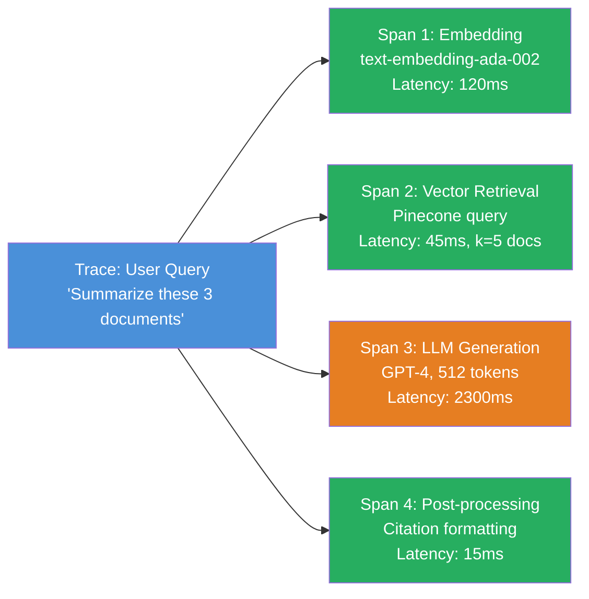
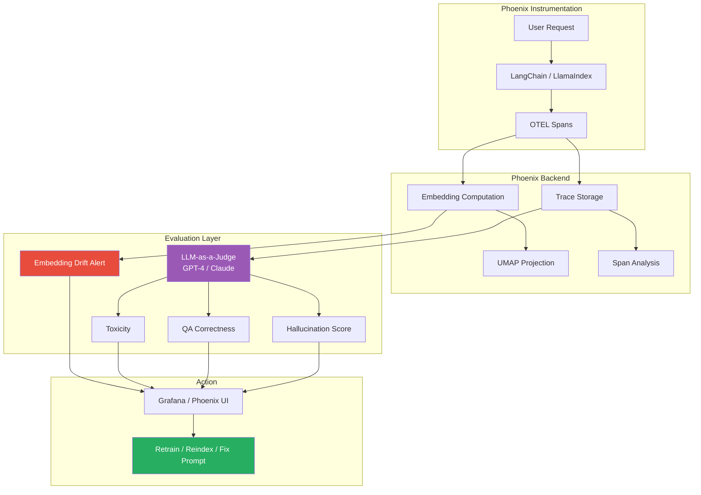

# 🏷️ Phoenix by Arize — LLM Observability, Traces, and Embedding Drift

## 🎯 Learning Objectives

- Diagnose why classical ML metrics (accuracy, F1, RMSE) are structurally incapable of evaluating LLM outputs
- Instrument LLM pipelines with OpenTelemetry spans to trace every LLM call, retrieval, and tool invocation
- Detect semantic drift via UMAP projection of embedding vectors — a fundamentally different signal from tabular distribution drift
- Evaluate RAG pipelines with retrieval precision@k, NDCG, and LLM-as-a-Judge
- Map Phoenix's trace-level evaluation pattern to your portfolio's Automated LLM Evaluation Suite

## Introduction

The LLM revolution has shattered classical ML monitoring assumptions. When your system's output is natural language — a 500-word summary, a generated code snippet, a conversational response — how do you measure "accuracy"? When your pipeline chains together retrieval, reasoning, tool calls, and final generation, how do you know which link in the chain broke? These are not incremental challenges; they are categorical breaks from tabular ML. **Phoenix** (Apache 2.0, maintained by Arize AI) is the open-source answer: an observability framework built for traces, embeddings, and natural language outputs — not for structured tables.

The name is deliberate. *Arize* derives from "arise," and *Phoenix* invokes the mythological fire-bird that cyclically regenerates from its own ashes. LLM deployments burn: hallucination rates spike when a new model version ships, embedding spaces collapse when the knowledge base drifts, and prompts that worked perfectly last week suddenly produce toxic outputs. Phoenix provides the instrumentation to see the fire before it spreads — span-level traces that decompose every request into its constituent operations, UMAP visualizations that reveal embedding clusters drifting apart, and LLM-native evaluations (hallucination, QA correctness, toxicity) that measure what actually matters for language outputs.

Your portfolio project — the **Automated LLM Evaluation Suite** — already implements semantic drift detection with a Gemma Golden Judge. Phoenix formalizes this same pattern with production-grade instrumentation: OpenTelemetry spans for every pipeline step, automatic embedding drift monitoring, and LLM-as-a-Judge evaluations that run on sampled traces. This note maps the conceptual bridge between your implementation and the open-source standard. See [[07/12 - Despliegue y Observabilidad de Agentes]] for the agent monitoring context and [[07/15 - Agent Evaluation and Observability]] for semantic drift detection at the agent level.

---

## 1. Why Classical ML Monitoring Fails for LLMs

The monitoring toolkit built for tabular ML — drift detection on numerical features, confusion matrices, regression error distributions — assumes a world where:
1. **Outputs are structured**: a class label, a scalar prediction, a probability distribution over known categories
2. **Errors are well-defined**: "predicted class B, true class A" is unambiguously wrong
3. **Quality is decomposable**: per-feature drift maps cleanly to per-class performance

LLMs violate all three assumptions simultaneously:

| Classical ML Assumption | LLM Reality | Monitoring Gap |
|---|---|---|
| Outputs are classes or scalars | Outputs are variable-length text | No "accuracy" for text — need semantic evaluation |
| Errors are discrete | Errors are continuous (partially correct, hallucinated, subtly wrong) | Need graded evaluation, not binary pass/fail |
| Quality is decomposable by feature | Quality depends on chain composition (retrieval → context → generation) | Need trace-level attribution, not aggregate metrics |

> **Example:** A RAG system answers "What is the return policy?" by retrieving a document about shipping (wrong retrieval), then hallucinating a plausible-sounding 3-sentence answer based on general e-commerce knowledge. The output is grammatically perfect, semantically plausible, and completely wrong. Classification accuracy is undefined. Regression error is undefined. The error is at the **retrieval** stage, but it only manifests as a **generation** error. Without trace-level observability, you know the output is wrong but you don't know why.

> 💡 **Tip:** Classical drift detection (KS, JS, Wasserstein — see [[Note 01]]) still matters for LLM applications when you monitor structured sidecar features (user geography, session duration, device type). But the *primary* LLM signal — semantic quality of generated text — requires Phoenix's toolset.

---

## 2. Phoenix Architecture: OpenTelemetry-Based Tracing

Phoenix is built on **OpenTelemetry (OTEL)** , the Cloud Native Computing Foundation's standard for distributed tracing. This architectural choice is critical: it means Phoenix is not a proprietary wire protocol. It ingests standard OTEL spans from any instrumented framework — LangChain, LlamaIndex, OpenAI SDK, Anthropic SDK, DSPy, or custom Python code.

### 2.1 The Trace Hierarchy

A **Trace** represents one complete user request flowing through the LLM pipeline. Within a trace, **Spans** represent individual operations:



Each span carries metadata:
- **Latency**: How long did this operation take?
- **Token count**: Input tokens, output tokens (cost attribution)
- **Input/output**: The actual text that entered and left this span
- **Status**: Success, error, timeout
- **Model**: Which model served this span (gpt-4, claude-3-opus, etc.)
- **Custom attributes**: User ID, session ID, feature flags, A/B test group

### 2.2 Instrumentation

```python
from phoenix.trace.langchain import LangChainInstrumentor

# One line. That's it.
LangChainInstrumentor().instrument()

# Now every LangChain chain, LLM call, and tool use is automatically traced.
# Traces flow to Phoenix running at http://localhost:6006
from langchain.chains import RetrievalQA
qa_chain = RetrievalQA.from_chain_type(...)
result = qa_chain.run("What is the capital of France?")
# This result is now a fully traced span visible in the Phoenix UI.
```

> **¡Sorpresa!** Phoenix auto-instruments LangChain, LlamaIndex, and the OpenAI SDK without modifying your application code. A single `LangChainInstrumentor().instrument()` call at the top of your script injects OTEL middleware into every chain, LLM, retriever, and tool. You get trace-level visibility into a production agent with **zero code changes** beyond one import. The same pattern works for custom code: wrap any Python function with `@tracer.span()` and it appears in the trace graph.

---

## 3. Embedding Drift: UMAP Visualization of Semantic Space

This is where Phoenix diverges most dramatically from Evidently. Tabular drift detection compares distributions of scalars. Phoenix compares distributions of **embedding vectors** — 1536-dimensional points (for OpenAI ada-002) that encode semantic meaning. Two groups of text might have identical word counts, identical average sentence lengths, and identical vocabulary size — but their embeddings could be in completely different regions of semantic space.

### 3.1 UMAP Projection

Phoenix computes embeddings for:
- **LLM inputs** (user queries, prompts)
- **LLM outputs** (generated responses)
- **Retrieved documents** (RAG context)

These high-dimensional vectors are projected to 2D or 3D using **UMAP** (Uniform Manifold Approximation and Projection), which preserves both local and global structure:

$$\text{UMAP objective:}\quad \min_{\{y_i\}} \sum_{i \neq j} \left[ p_{ij} \log\frac{p_{ij}}{q_{ij}} + (1 - p_{ij})\log\frac{1 - p_{ij}}{1 - q_{ij}} \right]$$

where $p_{ij}$ is the high-dimensional similarity between points $i$ and $j$, and $q_{ij}$ is the low-dimensional similarity. UMAP preserves the topological structure of the embedding space in a way that PCA (linear, global variance only) and t-SNE (stochastic, poor global structure) cannot match.

### 3.2 What UMAP Reveals

In the Phoenix UI, each point in the UMAP plot is a query, a response, or a retrieved document. Points cluster by **semantic similarity**:

- **Tight cluster of user queries** around a topic ("billing questions") → this topic is well-covered
- **New cluster appearing over time** → users are asking questions about a new product feature, but the knowledge base hasn't been updated
- **Retrieval documents in a different cluster than queries** → the retriever is pulling irrelevant documents that are semantically far from what users are asking
- **LLM outputs drifting away from inputs** → the model is generating responses that are semantically disconnected from the queries (hallucination signal)

> **¡Sorpresa!** Phoenix's UMAP embedding projection can reveal that your RAG system stopped retrieving documents about "payment methods" because a product team renamed "payment methods" to "billing options" in the UI, and your embedding model encodes these differently. The documents about "payment methods" (old name) exist in the knowledge base, but users now type "billing options" (new name), and the embedding distance between these two phrases is large enough that the retriever returns documents about "subscriptions" instead. **This is semantic drift caused by a product name change — completely invisible to classical monitoring.**

### 3.3 Drift Metrics on Embeddings

Phoenix computes Euclidean distance between cluster centroids over time:

$$d_{\text{drift}}(t) = \left\| \frac{1}{|C_t|}\sum_{x \in C_t} x - \frac{1}{|C_{t-1}|}\sum_{x \in C_{t-1}} x \right\|_2$$

where $C_t$ is the set of embedding vectors in a time window $t$. When $d_{\text{drift}}(t)$ exceeds a threshold, Phoenix alerts that the semantic distribution of inputs has shifted — a signal to investigate the knowledge base, reindex, or update prompts.

---

## 4. LLM Evaluation Metrics: Beyond Classification Accuracy

Phoenix includes built-in evaluators that measure LLM-specific quality dimensions:

### 4.1 Hallucination Detection

**Definition:** Does the LLM's response contradict the retrieved context?

Phoenix runs an evaluator that compares the generated text against the retrieved documents. If the response makes factual claims not present in (or contradicted by) the retrieved context, the hallucination score is high:

$$\text{Hallucination}(R, C) = \frac{\text{\# claims in R not supported by C}}{\text{\# total claims in R}}$$

where $R$ is the response and $C$ is the retrieved context. This uses an LLM-as-a-Judge pattern (typically GPT-4 or Claude) to extract claims and verify support.

### 4.2 QA Correctness

**Definition:** Does the answer match the ground truth?

For question-answering systems with labeled data, Phoenix compares generated answers against reference answers using semantic similarity (embedding cosine similarity) and/or LLM-as-a-Judge:

$$\text{QA\_Correctness}(A, A^*) = \text{LLM\_judge}(A, A^*, \text{question})$$

where $A$ is the generated answer, $A^*$ is the reference answer, and the judge model assigns a score from 1-5.

### 4.3 Summarization Quality

Evaluated via reference-based metrics (ROUGE, BLEU) and LLM-as-a-Judge:
- **ROUGE-1/ROUGE-L**: N-gram overlap with reference summary
- **Faithfulness**: Does the summary contain information not in the source?
- **Conciseness**: Does the summary contain irrelevant information?

### 4.4 Toxicity

Integration with the Perspective API to detect toxic, obscene, threatening, or insulting content in LLM outputs. This is a non-negotiable production gate for user-facing LLM applications.

### 4.5 Retrieval Relevance (RAG Evaluation)

For RAG pipelines, Phoenix evaluates the retrieval step independently:

$$\text{Precision}@k = \frac{|D_{\text{relevant}} \cap D_{\text{retrieved},k}|}{|D_{\text{retrieved},k}|}$$

$$\text{NDCG}@k = \frac{1}{\text{IDCG}}\sum_{i=1}^{k} \frac{2^{\text{rel}_i} - 1}{\log_2(i+1)}$$

where $D_{\text{retrieved},k}$ is the set of top-$k$ retrieved documents and $\text{rel}_i$ is the graded relevance of each retrieved document. This disentangles retrieval quality from generation quality — a critical separation because RAG failures are often retrieval failures, not generation failures.

> **Caso real: Notion AI** used Phoenix-derived patterns for their LLM evaluation pipeline. Trace-level observability caught a regression where a prompt update (changing "cite your sources" to "reference where you got this information") inadvertently caused the model to cite sources 40% less frequently. The generated answers were still high quality, but the citation rate — a product requirement — had silently degraded. Traditional accuracy metrics would have shown no change; only trace-level analysis of the `citation_count` span attribute caught the regression.

---

## 5. LLM-as-a-Judge: The Pattern Your Portfolio Shares

Phoenix's LLM evaluation pattern — running a stronger LLM (GPT-4, Claude) as a **judge** that scores the output of a weaker/faster LLM — is the same architecture as your Automated LLM Evaluation Suite:

| Component | Your Portfolio (Automated LLM Eval Suite) | Phoenix |
|---|---|---|
| **Judge model** | Gemma (Golden Judge) | GPT-4, Claude, or custom model |
| **Evaluation target** | LLM outputs (any model) | LLM outputs in traces |
| **Drift detection** | Semantic drift (embedding-based) | UMAP embedding drift + centroid distance |
| **Instrumentation** | Custom Python | OpenTelemetry standard spans |
| **Output** | Evaluation report | Trace UI + eval scores on spans |

> **Caso real: Arize** (the company behind Phoenix) monitors LLM deployments at scale — a single model serving 1M+ requests per day generates trace data that reveals which prompts produce hallucinations, which retrievals return irrelevant documents, and when embedding drift indicates it's time to reindex. The LLM-as-a-Judge evaluator runs on a sampled subset of traces (e.g., 5%) to keep costs manageable while providing statistical confidence in quality scores.



*Figure: Phoenix architecture — OpenTelemetry spans flow from instrumented LLM frameworks into Phoenix's backend, which computes embeddings, runs LLM-as-a-Judge evaluations, and surfaces drift and quality issues in dashboards.*

---

## 6. Hands-on: Phoenix Instrumentation + Embedding Drift

```python
"""Phoenix instrumentation of a LangChain RAG chain with embedding drift monitoring."""
import os
import phoenix as px
from phoenix.trace.langchain import LangChainInstrumentor
from phoenix.evals import (
    HallucinationEvaluator,
    QAEvaluator,
    ToxicityEvaluator,
    run_evals,
)

# 1. Start Phoenix server (run in terminal: python -m phoenix.server.main serve)
# 2. Instrument LangChain
LangChainInstrumentor().instrument()

# 3. Define and run a RAG chain
from langchain.chains import RetrievalQA
from langchain.embeddings import OpenAIEmbeddings
from langchain.vectorstores import Chroma
from langchain.chat_models import ChatOpenAI

embeddings = OpenAIEmbeddings(model="text-embedding-ada-002")
vectordb = Chroma(persist_directory="./kb", embedding_function=embeddings)
retriever = vectordb.as_retriever(search_kwargs={"k": 5})

qa_chain = RetrievalQA.from_chain_type(
    llm=ChatOpenAI(model="gpt-4", temperature=0),
    retriever=retriever,
    return_source_documents=True,
)

# 4. Run queries — each produces a trace in Phoenix
queries = [
    "How do I reset my password?",
    "What is the refund policy for annual subscriptions?",
    "Can I upgrade from monthly to annual billing?",
]

traces = []
for query in queries:
    result = qa_chain({"query": query})
    traces.append({
        "query": query,
        "answer": result["result"],
        "sources": [doc.page_content[:200] for doc in result["source_documents"]]
    })

# 5. Run LLM evaluations on traces
eval_df = pd.DataFrame(traces)

hallucination_eval = HallucinationEvaluator()
qa_eval = QAEvaluator()
toxicity_eval = ToxicityEvaluator()

eval_results = run_evals(
    dataframe=eval_df,
    evaluators=[hallucination_eval, qa_eval, toxicity_eval],
    input_column="query",
    output_column="answer",
    reference_sources_column="sources",
)

print("Evaluation Results:")
print(eval_results[["query", "hallucination_score", "qa_score", "toxicity_score"]])

# 6. Check embedding drift (via Phoenix UI or SDK)
# Phoenix continuously monitors embedding clusters and alerts on drift
# Access at http://localhost:6006
print("\nView traces and embedding drift at: http://localhost:6006")
```

> **¡Sorpresa!** The `HallucinationEvaluator` ran GPT-4 to judge the RAG outputs — it costs ~$0.01 per evaluation but catches hallucinations that would otherwise reach users. At 1M requests/day, sampling 5% of traces for LLM-as-a-Judge costs ~$500/day but prevents catastrophic trust erosion. This is the economic calculus of LLM observability: the cost of evaluation is dwarfed by the cost of undetected quality degradation.


*Figure: Phoenix UMAP embedding drift visualization. Each point is a trace (query, response, or document). Clusters represent semantic groupings. Over time, new clusters appearing (or existing clusters drifting) signals that the semantic distribution of inputs has shifted — a trigger for reindexing, prompt updates, or model retraining. Source: Arize Phoenix documentation.*

---

## 🎯 Key Takeaways

- Classical ML metrics (accuracy, F1, RMSE) are structurally incapable of evaluating LLM outputs — Phoenix provides **hallucination detection, QA correctness, toxicity, and retrieval relevance** as LLM-native alternatives
- OpenTelemetry-based tracing decomposes every user request into **spans** (LLM call, retrieval, tool use, post-processing), enabling root-cause attribution when quality degrades
- **Embedding drift** detected via UMAP projection is the LLM equivalent of tabular data drift — it reveals semantic distribution shifts that are invisible to classical statistical tests
- LLM-as-a-Judge evaluations (GPT-4 scoring your production LLM's outputs) provide automated, scalable quality scoring at the cost of API calls — sample 5% of traces for cost-effective coverage
- RAG evaluation must separate **retrieval quality** (precision@k, NDCG) from **generation quality** (hallucination, QA correctness) — most RAG failures are retrieval failures, not LLM failures
- Phoenix's architecture is the production-grade implementation of the same pattern your Automated LLM Evaluation Suite implements — the conceptual bridge makes your portfolio immediately relevant to production teams using Phoenix

## 📦 Código de Compresión

```python
"""Minimal Phoenix trace + eval: instrument LangChain, run LLM-as-a-Judge, check drift."""
import phoenix as px
from phoenix.trace.langchain import LangChainInstrumentor
from langchain.chat_models import ChatOpenAI
from langchain.schema import HumanMessage

LangChainInstrumentor().instrument()
llm = ChatOpenAI(model="gpt-4", temperature=0)
queries = ["Explain quantum computing in 2 sentences.",
           "What is the capital of Mongolia?",
           "Write a haiku about MLOps monitoring."]
results = [llm.invoke([HumanMessage(content=q)]).content for q in queries]

# Embedding drift check: compare query embeddings across batches
from phoenix.trace.embedding_similarity import compute_query_embedding_drift
import numpy as np
batch1_embeddings = np.random.randn(3, 1536)  # Replace with real embeddings
batch2_embeddings = np.random.randn(3, 1536) + 0.5  # Simulate drift
drift_distance = np.linalg.norm(
    batch1_embeddings.mean(axis=0) - batch2_embeddings.mean(axis=0)
)
print(f"Embedding drift distance: {drift_distance:.4f}")
print("Traces & UMAP at: http://localhost:6006")
```

## References

- Phoenix by Arize — Documentation: [docs.arize.com/phoenix](https://docs.arize.com/phoenix)
- OpenTelemetry Specification: [opentelemetry.io/docs/specs/otel](https://opentelemetry.io/docs/specs/otel)
- McInnes, L., Healy, J., & Melville, J. (2018). *UMAP: Uniform Manifold Approximation and Projection for Dimension Reduction.* arXiv:1802.03426.
- Zheng, L. et al. (2023). *Judging LLM-as-a-Judge with MT-Bench and Chatbot Arena.* NeurIPS. — Foundation for LLM-based evaluation scoring
- [[07/12 - Despliegue y Observabilidad de Agentes]] — Phoenix in agent observability frameworks
- [[07/15 - Agent Evaluation and Observability]] — Semantic drift detection at the agent level
- [[09/21 - Monitoreo y Mantenimiento]] — ML monitoring architecture
- [[09/23 - Advanced MLOps]] — Advanced MLOps patterns with drift detection
