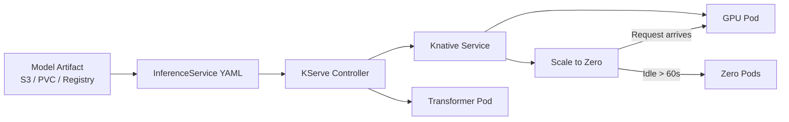

# 🏷️ Welcome to KServe and Knative

## 🎯 Learning Objectives
- Explain why serverless model serving on Kubernetes is a paradigm shift from traditional GPU deployments
- Identify KServe as the serverless model serving layer and Knative as the underlying serverless infrastructure
- Estimate GPU cost savings (60–80%) from scale-to-zero compared to always-on GPU pods
- Navigate the 2-note course map covering InferenceService and Knative Eventing for ML
- Connect KServe to the broader MLOps landscape (Kubeflow, TorchServe, deployment pipelines)

## Introduction

KServe — originally KFServing, the serving component of Kubeflow — is the Kubernetes-native serverless model serving platform. It wraps any model (PyTorch, TensorFlow, ONNX, vLLM, XGBoost, scikit-learn) into a production-ready inference endpoint with automatic autoscaling, canary deployments, explainability, and zero-resource idle mode. At its foundation sits Knative, the Kubernetes serverless layer that provides scale-to-zero, request-based concurrency scaling, and event-driven triggers.

The value proposition is brutally simple: traditional Kubernetes deployments keep GPU pods running 24/7, consuming electricity and cloud credits even at 3 AM when no one is calling the API. KServe + Knative scales the GPU pod to zero when idle, then spins it back up — cold start included — when a request arrives. For teams running dozens of models (research, staging, shadow), the difference is 60–80% GPU cost reduction. This is not a minor optimization; it is the difference between running 5 GPUs and running 20 GPUs for the same workload.

KServe sits at the intersection of model serving and platform engineering. It does not replace TorchServe or Triton — it **wraps** them in a Kubernetes-native API that adds serverless capabilities and multi-framework support. If TorchServe is the engine, KServe is the car. This module bridges the deployment patterns from [[../20 - Deployment y Serving/...|Deployment y Serving]] and the platform architecture from [[../26 - ML Platform Engineering/...|ML Platform Engineering]], extending into the serverless paradigm covered in [[../30 - TorchServe/...|TorchServe]].

---

## 1. Course Map

This module contains two core notes that build from the InferenceService abstraction to event-driven ML:

| Note | Content | Key Question |
|------|---------|-------------|
| **[[01 - KServe - Serverless Model Serving with InferenceService]]** | InferenceService CRD, Predictor/Transformer/Explainer, canary, scale-to-zero, multi-framework | _How do I serve any model serverlessly on Kubernetes?_ |
| **[[02 - Knative Serving and Eventing for ML Workloads]]** | Knative Serving internals, Eventing triggers, event-driven inference, S3/Kafka sources, revision management | _How do I trigger inference from events without any orchestrator?_ |

---

## 2. Prerequisites

- **Kubernetes fundamentals**: Pods, Deployments, Services, Ingress, CRDs. See [[../20 - Deployment y Serving/03 - Kubernetes para ML]].
- **Docker and containerization**: Building and pushing container images. See [[../20 - Deployment y Serving/01 - Docker para ML]].
- **Model serving concepts**: Inference endpoints, batching, GPU scheduling. See [[../30 - TorchServe/01 - TorchServe Architecture - MAR Files and Model Archiver|TorchServe Architecture]].
- **Istio/Gateway API awareness**: KServe uses Istio or Envoy for traffic routing (optional, defaults work out of the box).

---

## 3. KServe in 60 Seconds



> **Caso real: Bloomberg** runs 500+ models on their internal ML platform using KServe. The scale-to-zero feature saves them an estimated $2M/year in GPU costs because research models — used sporadically throughout the week — do not consume GPU resources 24/7. Each model idles at zero cost until a data scientist queries it.

---

## 🎯 Key Takeaways
- KServe is the Kubernetes-native serverless model serving platform built on Knative
- Scale-to-zero eliminates idle GPU costs — the #1 financial argument for adopting KServe
- Knative provides both the Serving layer (scale-to-zero, revisions) and the Eventing layer (event-driven triggers)
- KServe InferenceService wraps multiple serving frameworks (Triton, vLLM, TorchServe, ONNX) behind a unified API
- Canary deployments and traffic splitting are built into the InferenceService spec — no external service mesh config required
- KServe integrates with Kubeflow but works independently on any Kubernetes cluster
- The cold start penalty (30–60s) is the tradeoff for zero-idle-cost — mitigate with `minReplicas: 1`

## 📦 Código de Compresión

```yaml
# Minimal KServe InferenceService — serverless model serving in 15 lines
apiVersion: serving.kserve.io/v1beta1
kind: InferenceService
metadata:
  name: sklearn-iris
spec:
  predictor:
    sklearn:
      storageUri: "gs://kfserving-examples/models/sklearn/1.0/model"
```

```bash
# Deploy and test
kubectl apply -f inference-service.yaml
kubectl get inferenceservice sklearn-iris

# Send a prediction request
curl -X POST "http://sklearn-iris.default.example.com/v1/models/sklearn-iris:predict" \
  -H "Content-Type: application/json" \
  -d '{"instances": [[5.1, 3.5, 1.4, 0.2]]}'

# Watch it scale to zero after 60s idle
kubectl get pod -l serving.knative.dev/service=sklearn-iris -w
```

## References
- [KServe Official Documentation](https://kserve.github.io/website/)
- [Knative Official Documentation](https://knative.dev/docs/)
- [KServe GitHub Repository](https://github.com/kserve/kserve)
- [[../20 - Deployment y Serving/00 - Bienvenida|09/20 - Deployment y Serving]]
- [[../26 - ML Platform Engineering/...|09/26 - ML Platform Engineering]]
- [[../30 - TorchServe/00 - Welcome to TorchServe|09/30 - TorchServe]]
- [[../23 - Advanced MLOps/...|09/23 - Advanced MLOps]]
