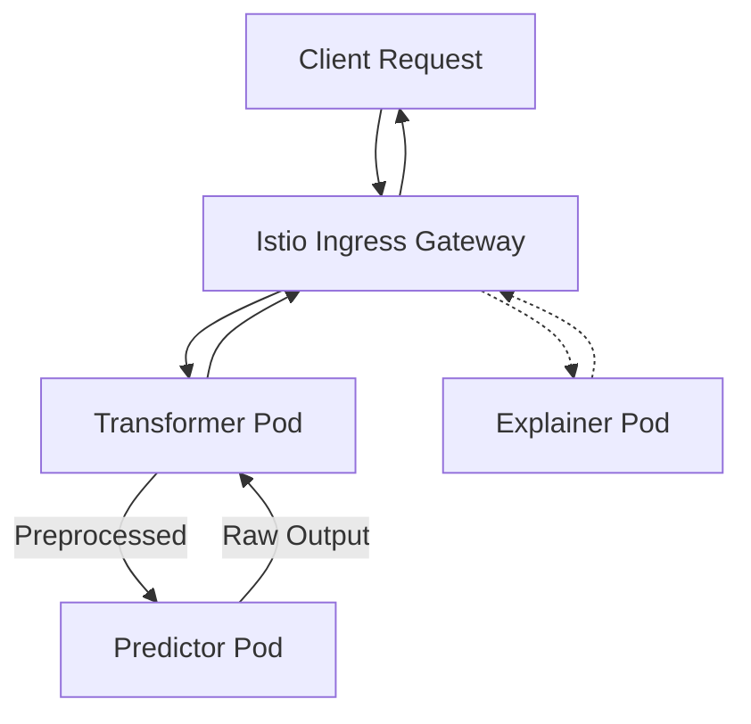
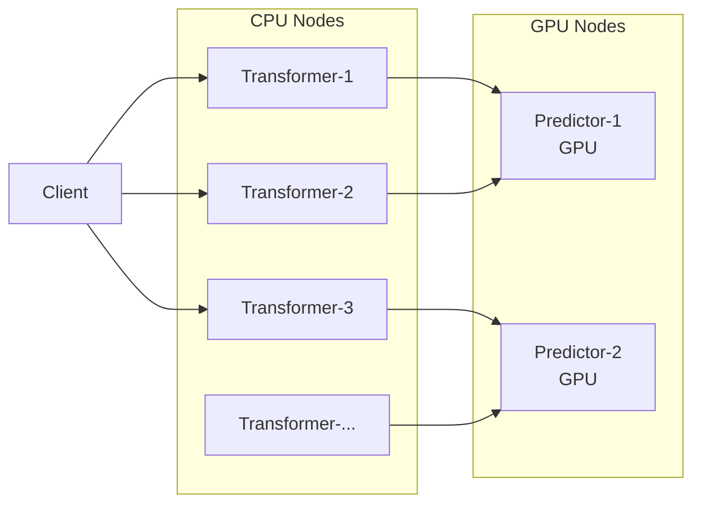
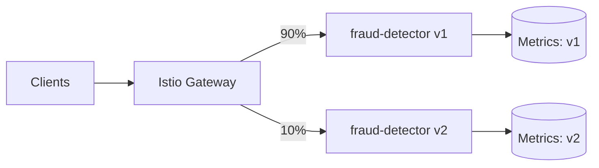

# 🏷️ KServe — Serverless Model Serving with InferenceService

## 🎯 Learning Objectives
- Define the InferenceService CRD and its three components: Predictor, Transformer, Explainer
- Write a complete InferenceService YAML that serves any framework (Triton, vLLM, ONNX, scikit-learn) from cloud storage
- Explain the Transformer pattern for separating preprocessing from inference and scaling them independently
- Explain the Explainer pattern for automatic SHAP/LIME/Anchor explanations in regulated industries
- Describe how Knative-driven scale-to-zero and concurrency-based autoscaling eliminate idle GPU costs
- Configure canary deployments with percentage-based traffic splitting for zero-downtime model rollouts

## Introduction

Running a model on Kubernetes as a raw `Deployment` means you inherit all the infrastructure problems that Kubernetes was designed to abstract away: manual HPA rules, GPU pods burning money at idle, no rollback mechanism beyond `kubectl rollout undo`, no request batching, and no built-in explainability. You end up writing more YAML for the infrastructure than you wrote Python for the model.

KServe's central thesis is that model serving should be a **single custom resource** — InferenceService — that declares *what* model to serve, *where* it lives, *how* to preprocess inputs, *how* to explain predictions, and *what percentage* of traffic each version receives. The Kubernetes controller reconciles this into a network of Knative Services, Istio VirtualServices, and autoscaling rules. The ML engineer writes one YAML; the platform handles the rest.

Etymologically, the name "InferenceService" is deliberate: it is a **service** that performs inference, not a pod, not a deployment, not a job. This semantic distinction matters — KServe treats your model as a continuously available service with serverless lifecycle, not as a batch process that starts and stops. This note extends the deployment concepts from [[../20 - Deployment y Serving/...|Deployment y Serving]] and the platform architecture from [[../26 - ML Platform Engineering/...|ML Platform Engineering]], and it complements the model-serving specifics in [[../30 - TorchServe/...|TorchServe]].

---

## 1. The InferenceService CRD

### 1.1 One Resource, Three Components

The InferenceService is the single Kubernetes resource that defines your entire model serving topology:

```yaml
apiVersion: serving.kserve.io/v1beta1
kind: InferenceService
metadata:
  name: sentiment-classifier
  namespace: ml-models
spec:
  predictor:
    # REQUIRED: The model server — what runs inference
  transformer:
    # OPTIONAL: Pre/post-processing in a separate pod
  explainer:
    # OPTIONAL: SHAP/LIME/Anchor explanations endpoint
```

Each component runs in its own pod (or set of pods), with its own autoscaling rules, resource limits, and container image. The KServe controller stitches them together with Istio/Envoy routing so that the client sees a single endpoint:



The three components are:

| Component | Required? | Runs | Scaling | Purpose |
|-----------|-----------|------|---------|---------|
| **Predictor** | Yes | GPU/CPU pod | Concurrency-based | Model inference (the forward pass) |
| **Transformer** | No | CPU pod | Concurrency-based | Preprocessing (tokenization, normalization) and postprocessing (label mapping, softmax) |
| **Explainer** | No | CPU pod | Concurrency-based | Feature attribution (SHAP, LIME, Anchor) via dedicated `/explain` endpoint |

### 1.2 This Is Not a Flask Wrapper

Consider what happens when you wrap a model in Flask and call it "deployment":

```yaml
# ❌ RAW KUBERNETES DEPLOYMENT FOR MODEL SERVING
apiVersion: apps/v1
kind: Deployment
metadata:
  name: sentiment-model
spec:
  replicas: 3  # Always burning 3 GPUs, even at 3 AM
  template:
    spec:
      containers:
      - name: model
        image: my-model:v1
        resources:
          limits:
            nvidia.com/gpu: 1  # ⚠️ 3 GPUs × 24h × 30 days = $$$$
---
# Manual HPA — CPU based, not request-concurrency based
apiVersion: autoscaling/v2
kind: HorizontalPodAutoscaler
metadata:
  name: sentiment-hpa
spec:
  scaleTargetRef:
    apiVersion: apps/v1
    kind: Deployment
    name: sentiment-model
  minReplicas: 1
  maxReplicas: 10
  metrics:
  - type: Resource
    resource:
      name: cpu
      target:
        type: Utilization
        averageUtilization: 70  # 💡 CPU is a terrible proxy for inference load
```

⚠️ CPU-based HPA is wrong for GPU inference. A model may be at 100% GPU utilization while showing 5% CPU usage (the GPU does all the work). The HPA will never scale up, and your latency will degrade under load.

```yaml
# ✅ KServe InferenceService — serverless, scale-to-zero, canary-ready
apiVersion: serving.kserve.io/v1beta1
kind: InferenceService
metadata:
  name: sentiment-classifier
spec:
  predictor:
    minReplicas: 0          # Scale to zero when idle
    maxReplicas: 10         # Scale up under load
    pytorch:
      storageUri: "s3://models/sentiment/v2/"
      resources:
        limits:
          nvidia.com/gpu: 1
```

This is the difference in abstraction level: from "manage pods, HPAs, and rolling updates" to "here is my model, serve it."

---

## 2. Predictor — The Inference Engine

### 2.1 Framework Specification

The Predictor is the only required component. It defines the model framework and model location:

```yaml
spec:
  predictor:
    # Built-in framework runtimes — KServe has pre-built Docker images for each
    tensorflow:
      storageUri: "s3://models/tf-mnist/"
    pytorch:
      storageUri: "s3://models/resnet50/"
    triton:
      storageUri: "s3://models/llama-7b/"
    onnx:
      storageUri: "s3://models/yolo-v8/"
    vllm:
      storageUri: "s3://models/mixtral-8x7b/"
    sklearn:
      storageUri: "s3://models/iris-classifier/"
    xgboost:
      storageUri: "s3://models/fraud-detector/"
    mlflow:
      storageUri: "s3://mlflow-artifacts/1/abc123/model/"
    # Custom container — any Docker image that implements KServe's protocol
    custom:
      image: my-registry/my-custom-server:latest
```

> **¡Sorpresa!** KServe does NOT embed a model server binary. It ships pre-built Docker images for each framework runtime. When you specify `predictor.pytorch`, KServe pulls the `kserve/pytorch-serving-runtime` image. When you update `storageUri`, it re-downloads the model files on pod startup. This means the **same InferenceService YAML** can serve PyTorch today and vLLM tomorrow by changing one field.

### 2.2 Model Storage

KServe downloads the model from the `storageUri` on first use using a storage-initializer init container:

```yaml
spec:
  predictor:
    pytorch:
      storageUri: "s3://my-models/bert-fine-tuned/"
      # KServe init container downloads model to /mnt/models before the server starts
```

**Storage backends supported:**
- **S3 / GCS / Azure Blob**: `s3://`, `gs://`, `https://` — KServe's init container handles the download with cloud credentials
- **PersistentVolumeClaim (PVC)** : `pvc://model-volume/` — for models already on a shared filesystem, avoiding per-pod downloads
- **Model registry**: `mlflow://` — direct integration with MLflow Model Registry, resolves to the latest production version
- **Local path**: For development and testing

⚠️ Large models (Llama-70B at 140GB) take minutes to download from S3. The storage-initializer downloads the model on **every** cold start (scale from zero). For large models, use a PVC with pre-loaded weights to eliminate this startup latency.

### 2.3 Resource and Autoscaling Configuration

```yaml
spec:
  predictor:
    minReplicas: 0          # 💡 0 = scale to zero; 1 = always warm
    maxReplicas: 10
    containerConcurrency: 5 # Max concurrent requests per pod
    scaleTarget: 10         # Target concurrency before scaling up
    pytorch:
      resources:
        requests:
          nvidia.com/gpu: 1
          memory: "16Gi"
        limits:
          nvidia.com/gpu: 1
          memory: "32Gi"
```

The autoscaling metric is **request concurrency**, not CPU. If `containerConcurrency = 5` and `scaleTarget = 10`, KServe scales up when average concurrency across pods exceeds 10. This is the correct metric for inference: a GPU pod handling 10 concurrent requests may show 15% CPU but 95% GPU utilization.

> **¡Sorpresa!** `containerConcurrency` is a hard limit, not a target. If set to 5 and a 6th request arrives, it is **queued** (not rejected) until a pod has capacity. This queuing is handled by Knative's proxy sidecar — the client sees HTTP 200 after a delay, not HTTP 503. This is a fundamentally different backpressure model than raw Kubernetes, where excess requests are dropped or must be handled by custom middleware.

---

## 3. Transformer Pattern — Pre/Post-Processing Separation

### 3.1 Why Separate Bother

Model inference has two distinct CPU profiles:

1. **Preprocessing**: Tokenization, image resizing, feature normalization — CPU-bound, RAM-heavy, no GPU
2. **Inference**: Forward pass through the model — GPU-bound, RAM-light

Putting both in one pod means GPU pods waste expensive GPU memory on tokenizers and label maps. Separating them into Transformer (CPU) and Predictor (GPU) pods allows independent scaling:



10 CPU Transformer pods can feed 3 GPU Predictor pods. A text classification pipeline: 15 lightweight Tokenizer pods (2 vCPU each) feed 3 heavy BERT-GPU pods (1 A100 each). Total cost: 30 vCPU + 3 A100 vs. 3 A100 with tokenization competing for compute on the GPU node.

### 3.2 Transformer Implementation

```yaml
apiVersion: serving.kserve.io/v1beta1
kind: InferenceService
metadata:
  name: text-classifier
spec:
  predictor:
    minReplicas: 1
    pytorch:
      storageUri: "s3://models/bert-classifier/"
      resources:
        limits:
          nvidia.com/gpu: 1
  transformer:
    minReplicas: 2
    maxReplicas: 10
    containers:
    - name: kserve-container
      image: my-registry/text-preprocessor:latest
      resources:
        requests:
          cpu: "2"
          memory: "4Gi"
```

The Transformer container implements a KServe-compatible REST/gRPC interface:
- **preprocess** handler: receives raw JSON, transforms to tensors, forwards to Predictor
- **postprocess** handler: receives raw model output, transforms to application-level response (labels, confidences)

The Transformer → Predictor communication is over localhost or cluster-internal gRPC, with KServe handling serialization. From the client's perspective, the Transformer **is** the endpoint — the Predictor is invisible.

---

## 4. Explainer Pattern — Feature Attribution Out of the Box

### 4.1 Why It Matters

In regulated industries (finance, healthcare, insurance), you cannot say "the model decided because the model decided." You must provide feature-level explanations — which input features contributed most to this specific prediction. This is not optional; it is regulatory requirement.

KServe ships with an Explainer component that deploys a **separate pod** exposing a `/v1/models/<model>:explain` endpoint. Supported algorithms:

| Algorithm | Library | Use Case |
|-----------|---------|----------|
| **SHAP** (SHapley Additive exPlanations) | `shap` | Game-theoretic feature importance for any model |
| **LIME** (Local Interpretable Model-agnostic Explanations) | `lime` | Local surrogate models for black-box explanations |
| **Anchor** | `alibi` | High-precision if-then rules for individual predictions |

### 4.2 Explainer Configuration

```yaml
apiVersion: serving.kserve.io/v1beta1
kind: InferenceService
metadata:
  name: credit-scorer
spec:
  predictor:
    sklearn:
      storageUri: "s3://models/credit-classifier/"
  explainer:
    minReplicas: 1
    alibi:
      type: AnchorTabular  # Generates if-then rules
      storageUri: "s3://models/credit-classifier/"
      config:
        threshold: 0.95    # Minimum precision for anchor rules
```

> **¡Sorpresa!** The Explainer pod calls the **Predictor's API** internally to compute explanations — it does not have its own model copy. It sends perturbed versions of the input, observes the Predictor's output changes, and derives feature importance. This means explanations are always consistent with whatever model version the Predictor is running — no desynchronization possible.

⚠️ SHAP explanations are computationally expensive — O(2^N) for exact computation, where N is the number of features. For models with 100+ features, use approximation methods or keep an eye on the Explainer pod's CPU. The Explain endpoint adds 500ms–5s of latency at inference time, depending on the algorithm and feature count.

---

## 5. Serverless Autoscaling — Scale to Zero

### 5.1 The Mechanism

KServe delegates autoscaling to Knative Serving, which uses the **Knative Pod Autoscaler (KPA)** — a concurrency-based autoscaler that is fundamentally different from Kubernetes' HPA:

| Feature | Kubernetes HPA | Knative KPA |
|---------|---------------|-------------|
| Scaling metric | CPU / Memory | Request concurrency |
| Scale to zero | No (minReplicas ≥ 1) | Yes (minReplicas = 0) |
| Scale decision latency | 15–30s (metrics pipeline) | <1s (sidecar proxy metrics) |
| Burst handling | Queues in kube-proxy | Queues in sidecar proxy with backpressure |

### 5.2 Scale-to-Zero Lifecycle

```
Time:  0s      Request arrives → cold start begins
      30s      Pod scheduled, image pulled, storage-initializer downloads model
      60s      Model loaded into GPU, server ready → inference runs → response returned
      120s     No more requests
      180s     Idle timeout (configurable, default 60s) → pods deleted → GPU freed
```

**Cold start composition:**
- Pod scheduling: 1–5s
- Container image pull: 5–30s (depends on image size)
- Storage-initializer (model download): 10–120s (depends on model size and network)
- Model loading / GPU warmup: 5–30s (model architecture dependent)

Total cold start: 30s – 3 minutes. This is the price of zero-idle-cost.

> **¡Sorpresa!** KServe's scale-to-zero is aggressive — a model that gets no requests for the configurable `scale-to-zero-grace-period` (default 60s) will be **completely unloaded from GPU memory**. Pods are deleted, CUDA context destroyed. The next request initiates a full cold start. For latency-sensitive production APIs, set `minReplicas: 1` to keep one warm pod — the cost is 1 GPU × 24h, still far cheaper than 3 always-on GPUs.

### 5.3 Configuring the Grace Period

```yaml
apiVersion: serving.kserve.io/v1beta1
kind: InferenceService
metadata:
  name: latency-sensitive-api
  annotations:
    autoscaling.knative.dev/scale-to-zero-grace-period: "300s"  # 5 minutes idle before zero
    autoscaling.knative.dev/min-scale: "1"                       # Always keep 1 warm
    autoscaling.knative.dev/max-scale: "20"
    autoscaling.knative.dev/target: "10"                          # Scale at 10 concurrent reqs/pod
```

---

## 6. Multi-Framework Support

KServe's framework runtimes are pre-built Docker images that implement a standard inference protocol. You do not install TorchServe, Triton, or ONNX Runtime — you specify which one KServe should use:

```yaml
# Serve PyTorch model with TorchServe under the hood
predictor:
  pytorch:
    storageUri: "s3://models/bert-classifier/"
    # KServe pulls kserve/pytorch-serving-runtime (TorchServe-based)

# Serve LLM with vLLM for PagedAttention and continuous batching
predictor:
  vllm:
    storageUri: "s3://models/mistral-7b/"
    # KServe pulls the vLLM runtime image with PagedAttention support

# Serve any model via MLflow's pyfunc interface
predictor:
  mlflow:
    storageUri: "s3://mlflow-artifacts/1/abc123/model/"
    # KServe pulls kserve/mlflow-serving-runtime
```

The framework is auto-detected from the model format when not explicitly specified. A `.onnx` file triggers the ONNX runtime; a `model.pkl` file triggers the scikit-learn runtime.

---

## 7. Canary Deployments and Traffic Splitting

### 7.1 The Canary Workflow

Deploying a new model version without A/B testing is gambling. KServe's `canaryTrafficPercent` field makes it trivial:

```yaml
apiVersion: serving.kserve.io/v1beta1
kind: InferenceService
metadata:
  name: fraud-detector
spec:
  predictor:
    pytorch:
      storageUri: "s3://models/fraud/v1/"
  canaryTrafficPercent: 10  # 10% of traffic goes to canary
```

The canary deployment is a **separate InferenceService** with the same name but suffix `-canary`. KServe automatically creates the canary service and configures Istio traffic splitting:

```yaml
# The canary — deployed separately
apiVersion: serving.kserve.io/v1beta1
kind: InferenceService
metadata:
  name: fraud-detector-canary  # Name must be <parent>-canary
spec:
  predictor:
    pytorch:
      storageUri: "s3://models/fraud/v2/"
  # canaryTrafficPercent is set on the PARENT, not the canary
```



**Canary lifecycle:**
1. Deploy `v2` with `canaryTrafficPercent: 5` on the parent → 5% traffic to v2
2. Monitor latency, error rates, prediction distribution for 24 hours
3. If metrics are healthy: `canaryTrafficPercent: 50` → 50% traffic
4. After 24 more hours: `canaryTrafficPercent: 100` → promote v2 to 100%
5. Delete the canary InferenceService → v2 is now the primary
6. **Rollback**: Set `canaryTrafficPercent: 0` → all traffic returns to v1 instantly

This is **zero-downtime deployment** — no dropped connections, no 503s, no client-side retry logic needed.

---

## 8. ❌/✅ Antipatterns

```python
# ❌ MODEL SERVING AS RAW K8S DEPLOYMENT
# Anti-pattern: Model wrapped in a Deployment with manual HPA

apiVersion: apps/v1
kind: Deployment
metadata:
  name: model-server
spec:
  replicas: 3  # 3 GPUs, 24/7, $15K/month
  template:
    spec:
      containers:
      - name: flask-model
        image: my-registry/flask-model:v1
        ports:
        - containerPort: 5000
        resources:
          limits:
            nvidia.com/gpu: 1

# Problems:
# - 3 GPUs always on (even at 3 AM)
# - No canary (manual rolling update at best)
# - No explainability
# - CPU-based HPA for GPU workload
# - No built-in queuing or backpressure
# - Model version tied to Docker image tag
```

```yaml
# ✅ Kserve InferenceService
# Solution: Single CRD, serverless, canary, explainability

apiVersion: serving.kserve.io/v1beta1
kind: InferenceService
metadata:
  name: model-server
spec:
  predictor:
    minReplicas: 0          # Scale to zero → save 60-80% GPU cost
    maxReplicas: 20         # Burst handling
    canaryTrafficPercent: 10  # 10% traffic to canary version
    pytorch:
      storageUri: "s3://models/classifier/v3/"
      resources:
        limits:
          nvidia.com/gpu: 1
      env:
      - name: MODEL_VERSION
        value: "v3"
  explainer:
    alibi:
      type: AnchorTabular
      storageUri: "s3://models/classifier/v3/"
```

---

## 🎯 Key Takeaways
- InferenceService is the single CRD that defines all model serving behavior — eliminate manual HPA, Service, and Deployment YAML
- The three components (Predictor, Transformer, Explainer) run in separate pods, scale independently, and are stitched together by Istio
- Transformer pattern separates CPU-bound preprocessing from GPU-bound inference, enabling independent horizontal scaling
- Explainer pattern provides regulatory-grade feature attributions (SHAP/LIME/Anchor) with zero additional engineering
- Scale-to-zero is the killer feature: GPU pods are deleted when idle, saving 60–80% GPU costs
- Cold start penalty (30–180s) is the tradeoff — mitigate with `minReplicas: 1` for latency-sensitive production APIs
- Canary deployments are a single integer field (`canaryTrafficPercent`) — no external service mesh configuration
- Multi-framework support means the same API serves PyTorch, Triton, vLLM, ONNX, XGBoost, and custom containers
- KServe's autoscaling uses request concurrency (correct for inference), not CPU (wrong for GPU workloads)

## 📦 Código de Compresión

```yaml
# === COMPLETE Kserve InferenceService WITH PREDICTOR + TRANSFORMER + CANARY ===
apiVersion: serving.kserve.io/v1beta1
kind: InferenceService
metadata:
  name: nlp-classifier
  namespace: production
  annotations:
    autoscaling.knative.dev/min-scale: "0"
    autoscaling.knative.dev/max-scale: "10"
    autoscaling.knative.dev/target: "5"
    autoscaling.knative.dev/scale-to-zero-grace-period: "120s"
spec:
  predictor:
    minReplicas: 0
    maxReplicas: 10
    containerConcurrency: 3
    pytorch:
      storageUri: "s3://ml-models/bert-sentiment/v3/"
      resources:
        requests:
          nvidia.com/gpu: 1
          memory: "16Gi"
        limits:
          nvidia.com/gpu: 1
          memory: "32Gi"
  transformer:
    minReplicas: 2
    maxReplicas: 15
    containerConcurrency: 10
    containers:
    - name: kserve-container
      image: registry.example.com/nlp-preprocessor:v2.1
      resources:
        requests:
          cpu: "2"
          memory: "4Gi"
        limits:
          cpu: "4"
          memory: "8Gi"
  canaryTrafficPercent: 10  # 10% traffic to nlp-classifier-canary

---
# Canary InferenceService — deployed separately
apiVersion: serving.kserve.io/v1beta1
kind: InferenceService
metadata:
  name: nlp-classifier-canary
  namespace: production
spec:
  predictor:
    minReplicas: 1
    pytorch:
      storageUri: "s3://ml-models/bert-sentiment/v4/"  # New model version
      resources:
        limits:
          nvidia.com/gpu: 1
```

```bash
# Deploy primary
kubectl apply -f inference-service.yaml

# Deploy canary for 10% traffic
kubectl apply -f inference-service-canary.yaml

# Promote canary to 50%
kubectl patch inferenceservice nlp-classifier \
  --type=merge -p '{"spec":{"canaryTrafficPercent":50}}'

# Full promotion — canary becomes primary
kubectl patch inferenceservice nlp-classifier \
  --type=merge -p '{"spec":{"canaryTrafficPercent":100}}'

# Delete canary (v2 is now the primary)
kubectl delete inferenceservice nlp-classifier-canary

# Rollback — set canary traffic to 0
kubectl patch inferenceservice nlp-classifier \
  --type=merge -p '{"spec":{"canaryTrafficPercent":0}}'
```

## References
- [KServe Official Documentation](https://kserve.github.io/website/)
- [Knative Serving Autoscaling](https://knative.dev/docs/serving/autoscaling/)
- [KServe InferenceService API Reference](https://kserve.github.io/website/latest/reference/api/)
- [KServe Fairing — Python SDK](https://kserve.github.io/website/latest/sdk_docs/fairing/)
- [[../20 - Deployment y Serving/00 - Bienvenida|09/20 - Deployment y Serving]]
- [[../20 - Deployment y Serving/02 - Model Serving Patterns|09/20 - Model Serving Patterns]]
- [[../26 - ML Platform Engineering/...|09/26 - ML Platform Engineering]]
- [[../30 - TorchServe/01 - TorchServe Architecture - MAR Files and Model Archiver|09/30 - TorchServe Architecture]]
- [[../23 - Advanced MLOps/...|09/23 - Advanced MLOps]]
