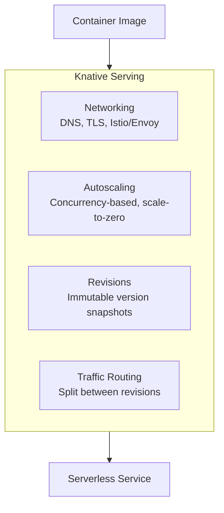
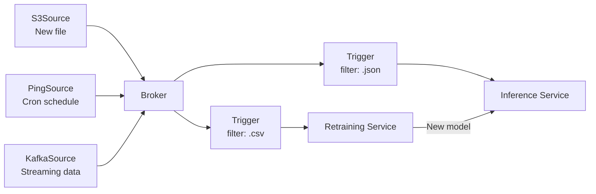
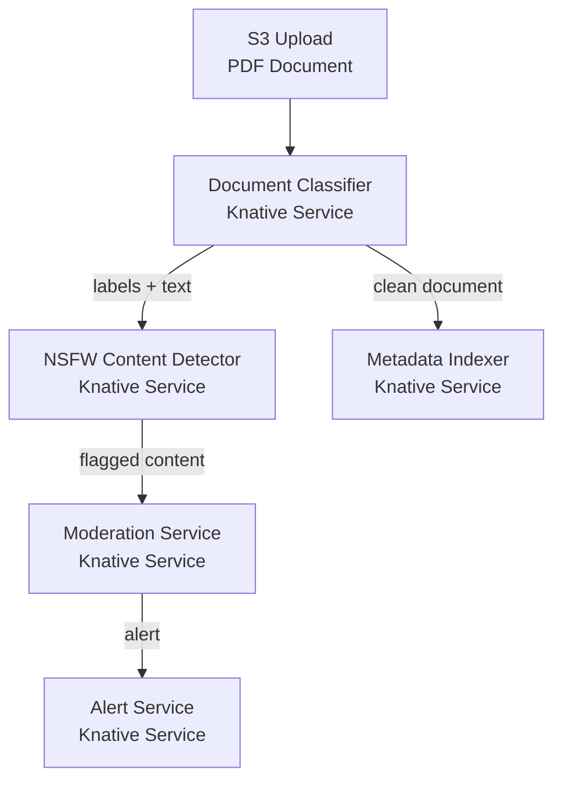
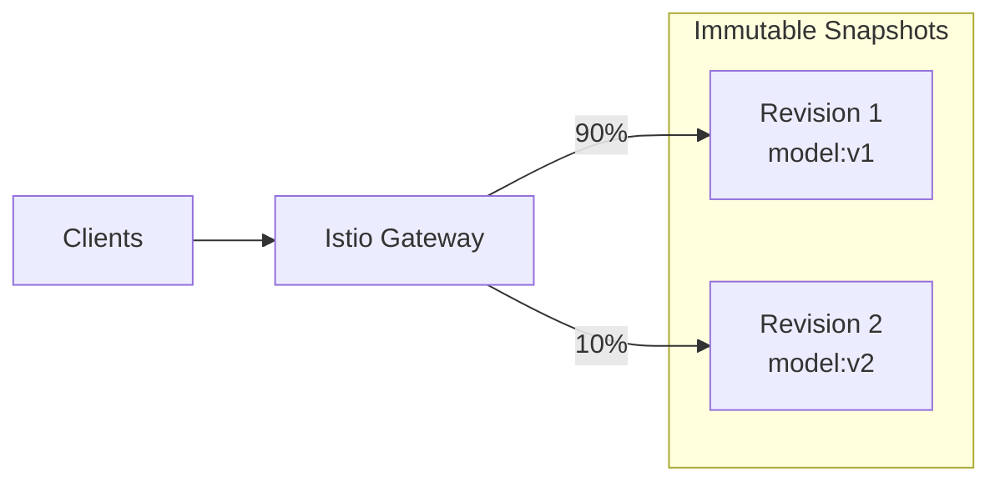

# 🏷️ Knative Serving and Eventing for ML Workloads

## 🎯 Learning Objectives
- Describe how Knative Serving provides the scale-to-zero and request routing layer beneath KServe InferenceService
- Configure event-driven ML pipelines: trigger inference when a new file lands in S3, a Kafka message arrives, or a cron job fires
- Implement cron-based model retraining using Knative Eventing PingSource without an external orchestrator
- Chain multiple Knative Services into serverless ML pipelines (classification → moderation → alerting)
- Manage immutable revisions for canary rollouts and instant rollback
- Optimize cold start latency for production ML serving workloads

## Introduction

KServe uses Knative Serving for scale-to-zero and request routing, but Knative is not just KServe's dependency — it is a standalone serverless platform that enables event-driven ML workflows without any external orchestrator. While Airflow, Prefect, and Dagster schedule pipelines, Knative Eventing **reacts to events**: a new file in S3, a message in Kafka, a scheduled cron job, a GitHub webhook. Each event triggers a Knative Service that processes the event and scales to zero when done.

The thesis of this note is that Knative transforms Kubernetes from a **container orchestrator** into an **event-driven ML platform**. You can build a complete ML pipeline — file ingestion, preprocessing, inference, postprocessing, alerting — entirely from Knative Services and Eventing triggers, with every component scaling independently and consuming zero resources when idle. This is serverless ML: no long-running Airflow workers, no idle Kubernetes Jobs, no always-on pipeline infrastructure.

Etymologically, Knative (pronounced "kay-native") is a portmanteau of **K**ubernetes + **native** — a framework that makes Kubernetes feel native for serverless workloads, the same way a native app feels natural on an operating system. This note extends the InferenceService abstraction from [[01 - KServe - Serverless Model Serving with InferenceService|Note 01]] and the platform patterns from [[../26 - ML Platform Engineering/...|ML Platform Engineering]].

---

## 1. Knative Serving — The Serverless Compute Layer

### 1.1 What Knative Serving Provides

Knative Serving converts any container image into a serverless service with four responsibilities:



1. **Networking**: Assigns a routable URL (`https://my-service.namespace.example.com`), provisions TLS certificates via cert-manager, configures Istio/Envoy for ingress
2. **Autoscaling**: Knative Pod Autoscaler (KPA) scales pods based on in-flight request concurrency, down to zero
3. **Revisions**: Every configuration change creates an immutable revision — a snapshot of the pod spec at that moment
4. **Traffic routing**: Split traffic between revisions with percentage-based rules

### 1.2 A Knative Service Is Not a Kubernetes Service

```yaml
# A Knative Service — serverless from a container image
apiVersion: serving.knative.dev/v1
kind: Service
metadata:
  name: inference-worker
spec:
  template:
    metadata:
      annotations:
        autoscaling.knative.dev/min-scale: "0"   # Scale to zero
        autoscaling.knative.dev/max-scale: "20"  # Burst to 20 pods
        autoscaling.knative.dev/target: "5"      # Scale at 5 concurrent requests
    spec:
      containers:
      - name: model
        image: registry.example.com/bert-inference:v2
        resources:
          limits:
            nvidia.com/gpu: 1
```

This single YAML replaces a Kubernetes Deployment, Service, HorizontalPodAutoscaler, and Ingress. KServe's InferenceService is a **wrapper** around a Knative Service — the InferenceService CRD generates this Knative Service YAML internally, adding model-download init containers and framework-specific configuration.

### 1.3 Concurrency-Based Autoscaling in Depth

The Knative Pod Autoscaler (KPA) is the mechanism behind `min-scale: 0`:

```
                                Request
Desired Pods = ceil(───────────────────────────)
                    target-concurrency-per-pod
```

- `target-concurrency-per-pod = 5`: the autoscaler aims to keep each pod handling 5 concurrent requests
- If 22 requests arrive simultaneously: `ceil(22 / 5) = 5 pods` are created
- If those 5 pods finish and no new requests arrive for 60s: `pods → 0`

The KPA uses the **queue-proxy sidecar** to measure concurrency — every pod has a sidecar container that counts in-flight requests. This gives sub-second scaling decisions compared to Kubernetes HPA's 15–30s metric pipeline delay.

---

## 2. Knative Eventing — Event-Driven ML

### 2.1 The Eventing Primitives

Knative Eventing introduces three abstractions for event-driven architectures:

| Primitive | Role | Example |
|-----------|------|---------|
| **Source** | Produces events | S3 upload, Kafka message, Cron schedule, GitHub webhook |
| **Broker** | Routes events to consumers | A channel that accepts events and forwards to matching Triggers |
| **Trigger** | Connects sources to services with filters | "When a `.csv` file lands in S3 → trigger retraining Service" |



### 2.2 S3-Triggered Inference

```yaml
# 1. S3Source — watches an S3 bucket for new objects
apiVersion: sources.knative.dev/v1beta1
kind: S3Source
metadata:
  name: document-uploads
spec:
  bucket: ml-document-input
  endpoint: https://s3.amazonaws.com
  region: us-east-1
  eventTypes:
  - s3:ObjectCreated:Put
  sink:
    ref:
      apiVersion: eventing.knative.dev/v1
      kind: Broker
      name: ml-events
---
# 2. Trigger — routes S3 events to the inference service
apiVersion: eventing.knative.dev/v1
kind: Trigger
metadata:
  name: document-classifier-trigger
spec:
  broker: ml-events
  filter:
    attributes:
      type: s3:ObjectCreated:Put
      extension:
        suffix: ".pdf"    # Only PDF uploads
  subscriber:
    ref:
      apiVersion: serving.knative.dev/v1
      kind: Service
      name: document-classifier
---
# 3. Knative Service — the inference worker
apiVersion: serving.knative.dev/v1
kind: Service
metadata:
  name: document-classifier
spec:
  template:
    spec:
      containers:
      - name: classifier
        image: registry.example.com/doc-classifier:v1
        env:
        - name: OUTPUT_BUCKET
          value: "ml-document-output"
```

**Flow:** Upload PDF to S3 → S3Source detects the Put event → sends CloudEvent to Broker → Trigger matches the `.pdf` suffix filter → forwards to `document-classifier` Service → Service processes the document → scales to zero.

⚠️ The S3Source must have IAM credentials to list and read objects from the S3 bucket. These credentials are stored as a Kubernetes Secret and referenced in the S3Source spec.

### 2.3 Event-Driven Inference Chaining



> **¡Sorpresa!** Knative Eventing can chain services without any orchestrator. Each service emits CloudEvents with its output, and downstream services subscribe to those events via Brokers and Triggers. This is a serverless ML pipeline: S3 upload → classification → NSFW detection → moderation → alerting. No Airflow, no Prefect, no Dagster. Every service scales independently and costs zero when idle.

---

## 3. CronJob-Based Model Retraining

### 3.1 PingSource — Scheduled Events

The PingSource produces events on a cron schedule. For ML, this replaces Airflow's scheduler for periodic retraining:

```yaml
apiVersion: sources.knative.dev/v1
kind: PingSource
metadata:
  name: nightly-retraining
spec:
  schedule: "0 3 * * *"  # Every day at 3 AM UTC
  data: '{"pipeline": "full", "dataset_version": "latest"}'
  sink:
    ref:
      apiVersion: serving.knative.dev/v1
      kind: Service
      name: retraining-pipeline
---
apiVersion: serving.knative.dev/v1
kind: Service
metadata:
  name: retraining-pipeline
spec:
  template:
    spec:
      containers:
      - name: trainer
        image: registry.example.com/ml-trainer:v3
        env:
        - name: MLFLOW_TRACKING_URI
          value: "http://mlflow-server:5000"
        - name: GPU_COUNT
          value: "2"
        resources:
          limits:
            nvidia.com/gpu: 2
```

**Flow:** 3 AM → PingSource fires CloudEvent → Knative activates the `retraining-pipeline` Service (cold start, 30–60s) → Service fetches latest dataset, trains model, evaluates metrics → If new model outperforms production, Service updates the KServe InferenceService via `kubectl patch` → Service scales to zero.

> **Caso real: TriggerMesh** (Knative Eventing vendor) helped a media company build an event-driven video processing pipeline: S3 upload → Knative triggers → frame extraction service → object detection service → metadata indexing service. All serverless, all scale-to-zero, all on a single Kubernetes cluster with no external orchestrator.

---

## 4. Kafka Integration for Streaming Inference

### 4.1 KafkaSource

Real-time ML — fraud detection, anomaly detection, recommendation engines — requires reacting to streaming data with sub-second latency. Knative's KafkaSource connects directly to Kafka topics:

```yaml
apiVersion: sources.knative.dev/v1beta1
kind: KafkaSource
metadata:
  name: transaction-events
spec:
  consumerGroup: fraud-detection-group
  bootstrapServers:
  - kafka-broker.kafka:9092
  topics:
  - transactions.raw
  sink:
    ref:
      apiVersion: serving.knative.dev/v1
      kind: Service
      name: fraud-detector
---
apiVersion: serving.knative.dev/v1
kind: Service
metadata:
  name: fraud-detector
spec:
  template:
    metadata:
      annotations:
        autoscaling.knative.dev/min-scale: "2"   # Always warm for low latency
        autoscaling.knative.dev/max-scale: "50"  # Burst during peak transaction hours
        autoscaling.knative.dev/target: "10"
    spec:
      containers:
      - name: detector
        image: registry.example.com/fraud-detector:v4
        resources:
          limits:
            nvidia.com/gpu: 1
```

⚠️ Real-time inference with Kafka requires careful partition management. Each Kafka partition maps to one Knative pod (processing order guarantee). If you have 12 partitions and `max-scale: 50`, only 12 pods will consume — the other 38 idle. Set `max-scale` ≤ partition count unless you use keyed fan-out.

---

## 5. Revision Management and Instant Rollback

### 5.1 Immutable Revisions

Every change to a Knative Service's `spec.template` creates an immutable revision:

```bash
kn revision list -n ml-services
# NAME                  SERVICE             TRAFFIC   TAGS   GENERATION   AGE
# inference-worker-00001 inference-worker   90%       @dev   1            2d
# inference-worker-00002 inference-worker   10%       -      2            4h
```

A revision is a point-in-time snapshot of:
- Container image and tag
- Environment variables
- Resource limits
- Autoscaling annotations

Revisions cannot be mutated — they are the serverless equivalent of immutable infrastructure. This enables instant rollback by pointing traffic to a previous revision number.

### 5.2 Traffic Splitting and Canary

```bash
# Deploy v2
kn service update inference-worker --image registry.example.com/model:v2

# Route 10% traffic to v2, 90% to v1
kn service update inference-worker \
  --traffic inference-worker-00001=90 \
  --traffic inference-worker-00002=10

# If v2 is healthy after 24h — full promotion
kn service update inference-worker \
  --traffic @latest=100 \
  --tag @latest=production

# If v2 degrades — instant rollback
kn service update inference-worker \
  --traffic inference-worker-00001=100  # Back to v1
```



---

## 6. Cold Start Optimization

### 6.1 Why Cold Starts Hurt ML Workloads

ML models are large (100MB–140GB) and slow to load (5–30s GPU warmup). A cold start is not just a container boot — it includes:

1. Pod scheduling + image pull: 5–30s
2. Model download from S3 (storage-initializer): 10–120s
3. Model GPU loading + warmup: 5–30s
4. First inference (CUDA kernel compilation): 0.5–2s

Total: 30s – 4 minutes. This is unacceptable for user-facing APIs where a cold start means the user waits 3 minutes for a response.

### 6.2 Mitigation Strategies

| Strategy | Mechanism | Cost | Latency Impact |
|----------|-----------|------|---------------|
| `min-scale: 1` | Keep 1 pod always warm | 1 GPU × 24h | Zero cold start |
| Pre-warmed PVC | Model on shared NVMe PVC, no download | Storage cost | Eliminates model download (10–120s saved) |
| Container image optimization | Multi-stage Docker, remove dev deps, use `distroless` | Engineering time | 5–15s saved |
| GPU node with pre-pulled image | DaemonSet that pre-caches model images | Node GPU reservation | 5–20s saved |
| Scheduled warm-up | CronJob that sends dummy requests before business hours | Minimal | Prevents cold starts during peak |

```yaml
# Production configuration: pre-warmed PVC, min 1 replica
apiVersion: serving.knative.dev/v1
kind: Service
metadata:
  name: latency-sensitive-inference
spec:
  template:
    metadata:
      annotations:
        autoscaling.knative.dev/min-scale: "1"
        autoscaling.knative.dev/scale-to-zero-grace-period: "300s"
    spec:
      containers:
      - name: model
        image: registry.example.com/llm-inference:latest  # Optimized, < 400MB
        volumeMounts:
        - name: model-weights
          mountPath: /mnt/models  # 💡 Models pre-downloaded to PVC
      volumes:
      - name: model-weights
        persistentVolumeClaim:
          claimName: llm-model-weights-pvc
```

---

## 7. ❌/✅ Antipatterns

```python
# ❌ AIRFLOW CRON JOB TRIGGERING KUBERNETES JOB
# Anti-pattern: Long-running Airflow scheduler + manual Kubernetes Job

from airflow import DAG
from airflow.providers.cncf.kubernetes.operators.kubernetes_pod import KubernetesPodOperator

with DAG("daily_retraining", schedule="0 3 * * *") as dag:
    train_task = KubernetesPodOperator(
        task_id="train_model",
        image="registry.example.com/trainer:v3",
        resources={"limits": {"nvidia.com/gpu": "1"}},
    )

# Problems:
# - Airflow scheduler runs 24/7 (perpetual cost)
# - Kubernetes Job has no autoscaling
# - No event-driven triggers (only cron)
# - Manual error handling and retry logic
# - Job crashes → restart from scratch
```

```yaml
# ✅ KNATIVE EVENTING PINGSOURCE → KNATIVE SERVICE
# Solution: Serverless, event-driven, scale-to-zero

apiVersion: sources.knative.dev/v1
kind: PingSource
metadata:
  name: daily-retraining
spec:
  schedule: "0 3 * * *"
  sink:
    ref:
      apiVersion: serving.knative.dev/v1
      kind: Service
      name: retraining-pipeline
---
apiVersion: serving.knative.dev/v1
kind: Service
metadata:
  name: retraining-pipeline
spec:
  template:
    metadata:
      annotations:
        autoscaling.knative.dev/min-scale: "0"
        autoscaling.knative.dev/max-scale: "1"
    spec:
      containers:
      - name: trainer
        image: registry.example.com/trainer:v3
        resources:
          limits:
            nvidia.com/gpu: 1
```

---

## 🎯 Key Takeaways
- Knative Serving converts any container image into a serverless service with networking, autoscaling, revision management, and traffic routing
- KServe InferenceService is a wrapper around Knative Service — the same scale-to-zero and concurrency scaling applies
- Knative Eventing enables event-driven ML pipelines: S3 uploads, Kafka messages, cron schedules, and GitHub webhooks all trigger serverless services
- Services can be chained into complex ML pipelines (classification → moderation → alerting) without any orchestrator
- Immutable revisions enable instant rollback by pointing traffic to a previous revision by name
- Cold starts (30s–4 minutes) are the primary production challenge for ML workloads on Knative — mitigate with `min-scale: 1`, pre-warmed PVCs, and optimized images
- The Knative Pod Autoscaler (KPA) uses request concurrency, not CPU, making it correct for GPU inference workloads
- Event-driven inference with Kafka requires partition awareness — max pods ≤ partition count for ordered processing

## 📦 Código de Compresión

```yaml
# === COMPLETE EVENT-DRIVEN INFERENCE PIPELINE ===

# 1. S3Source — watches bucket for new PDFs
apiVersion: sources.knative.dev/v1beta1
kind: S3Source
metadata:
  name: document-ingestion
  namespace: ml-pipelines
spec:
  bucket: ml-documents-input
  endpoint: https://s3.amazonaws.com
  region: us-east-1
  eventTypes: [s3:ObjectCreated:Put]
  sink:
    ref:
      apiVersion: eventing.knative.dev/v1
      kind: Broker
      name: ml-events

---
# 2. Broker — routes events to matching triggers
apiVersion: eventing.knative.dev/v1
kind: Broker
metadata:
  name: ml-events
  namespace: ml-pipelines

---
# 3. Trigger — routes .pdf S3 events to classifier
apiVersion: eventing.knative.dev/v1
kind: Trigger
metadata:
  name: pdf-classifier-trigger
  namespace: ml-pipelines
spec:
  broker: ml-events
  filter:
    attributes:
      type: s3:ObjectCreated:Put
      extension:
        suffix: ".pdf"
  subscriber:
    ref:
      apiVersion: serving.knative.dev/v1
      kind: Service
      name: document-classifier

---
# 4. Knative Service — the inference worker
apiVersion: serving.knative.dev/v1
kind: Service
metadata:
  name: document-classifier
  namespace: ml-pipelines
spec:
  template:
    metadata:
      annotations:
        autoscaling.knative.dev/min-scale: "0"
        autoscaling.knative.dev/max-scale: "10"
        autoscaling.knative.dev/target: "5"
    spec:
      containers:
      - name: classifier
        image: registry.example.com/doc-classifier:v2
        env:
        - name: OUTPUT_BUCKET
          value: "ml-documents-output"
        - name: MODEL_PATH
          value: "/mnt/models/classifier/"
        resources:
          requests:
            nvidia.com/gpu: 1
            memory: "8Gi"
          limits:
            nvidia.com/gpu: 1
            memory: "16Gi"
        volumeMounts:
        - name: model-weights
          mountPath: /mnt/models
      volumes:
      - name: model-weights
        persistentVolumeClaim:
          claimName: model-weights-pvc

---
# 5. PingSource — nightly model retraining
apiVersion: sources.knative.dev/v1
kind: PingSource
metadata:
  name: nightly-retraining
  namespace: ml-pipelines
spec:
  schedule: "0 3 * * *"
  data: '{"dataset_version": "latest", "eval_split": "0.2"}'
  sink:
    ref:
      apiVersion: serving.knative.dev/v1
      kind: Service
      name: retraining-pipeline
```

```bash
# Deploy the complete event-driven ML pipeline
kubectl apply -f 01-s3-source.yaml
kubectl apply -f 02-broker.yaml
kubectl apply -f 03-trigger.yaml
kubectl apply -f 04-inference-service.yaml
kubectl apply -f 05-ping-source.yaml

# Upload a document to trigger the pipeline
aws s3 cp document.pdf s3://ml-documents-input/
# → S3Source fires → Trigger routes → document-classifier processes → scales to zero

# Monitor events
kubectl get events -n ml-pipelines --watch

# Check revisions
kn revision list -n ml-pipelines

# Rollback inference service to previous version
kn service update document-classifier -n ml-pipelines \
  --traffic document-classifier-00001=100
```

## References
- [Knative Serving Documentation](https://knative.dev/docs/serving/)
- [Knative Eventing Documentation](https://knative.dev/docs/eventing/)
- [Knative Eventing Sources](https://knative.dev/docs/eventing/sources/)
- [TriggerMesh Integration Platform](https://triggermesh.com/)
- [[01 - KServe - Serverless Model Serving with InferenceService|Note 01 — KServe InferenceService]]
- [[../20 - Deployment y Serving/00 - Bienvenida|09/20 - Deployment y Serving]]
- [[../26 - ML Platform Engineering/...|09/26 - ML Platform Engineering]]
- [[../23 - Advanced MLOps/...|09/23 - Advanced MLOps]]
