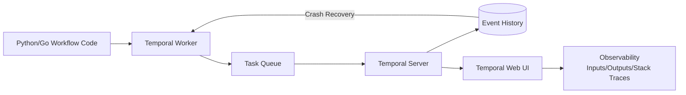

# 🏷️ Welcome to Temporal for ML Pipelines

## 🎯 Learning Objectives
- Define Temporal as a durable execution platform that guarantees workflow completion through crashes
- Distinguish Temporal's execution model from Airflow's scheduling model
- Identify ML-specific failure modes that Temporal handles natively (GPU OOM, spot termination, human approval gates)
- Navigate the 2-note course map covering Temporal fundamentals and ML pipeline orchestration
- Understand the etymology of "Temporal" and its philosophical basis in time-agnostic execution

## Introduction

Temporal is a durable execution platform: you write workflows as regular code in Go, Python, TypeScript, or Java, and Temporal guarantees they run to completion — surviving process crashes, machine restarts, network partitions, and cloud zone outages. Unlike Airflow, which **schedules** DAGs to run at specific times, Temporal **executes** your code with the promise that if it fails halfway through, it will resume from the exact point of failure, not from the beginning.

For ML pipelines, this distinction is catastrophic versus cosmetic. A training job running on a spot instance that gets reclaimed at 1 hour 59 minutes into a 2-hour run loses 119 minutes of work with every orchestrator except Temporal. A batch inference job processing 1 million documents that crashes on document 847,321 must restart from document 1 — unless Temporal manages the work. A human approval gate that requires a reviewer to click "Approve" over a long weekend cannot live in a Python script's memory for 72 hours. Temporal handles all of these because its execution model is event-sourced: every state change is persisted, and recovery is replay, not restart.

The name "Temporal" comes from the Latin *temporalis* — relating to time. The platform's core promise is that your code runs to completion over **arbitrary time periods**: minutes, hours, days, weeks, or months. Time becomes irrelevant to correctness. This module connects to the deployment pipelines in [[../20 - Deployment y Serving/...|Deployment y Serving]], the CI/CD patterns in [[../29 - CI-CD for ML/...|CI-CD for ML]], and the Go microservices architecture in [[../../13 - Go ML Backend/...|13/06 - Go ML Backend]].

---

## 1. Course Map

This module contains two core notes that build from durable execution concepts to full ML pipeline orchestration:

| Note | Content | Key Question |
|------|---------|-------------|
| **[[01 - Temporal Fundamentals - Workflows, Activities and Durable Execution]]** | Durable execution model, Workflows vs Activities, Python/Go SDKs, retries, signals, Temporal vs Airflow | _How does a crashed workflow resume from the exact point of failure?_ |
| **[[02 - Temporal in ML Pipelines - Training Orchestration and Human-in-the-Loop]]** | Training orchestration, GPU failure recovery, batch inference, HITL, parallel training, pipeline observability | _How do I build an ML pipeline that survives spot instance termination and human delays?_ |

---

## 2. Prerequisites

- **Python or Go proficiency**: Temporal's Python SDK for ML workflows; Go SDK for high-performance workers. See [[../../13 - Go ML Backend/06 - Go ML Backend|13/06 - Go ML Backend]].
- **Container orchestration concepts**: Docker, Kubernetes, worker processes. See [[../20 - Deployment y Serving/01 - Docker para ML]].
- **ML pipeline experience**: Training loops, evaluation, model deployment lifecycle. See [[../23 - Advanced MLOps/...|09/23 - Advanced MLOps]].
- **CI/CD basics**: Automated deployment, approval gates. See [[../29 - CI-CD for ML/...|09/29 - CI-CD for ML]].

---

## 3. Temporal in 60 Seconds



> **Caso real: Netflix** runs 10M+ Temporal workflows per day for their video encoding pipeline. An encoding job might run for hours across multiple workers and multiple cloud zones. Instance failures, worker crashes, and network blips are absorbed transparently — the workflow continues from its last persisted state without human intervention.

---

## 🎯 Key Takeaways
- Temporal is a **durable execution** platform — it guarantees that your code runs to completion through failures
- Airflow schedules; Temporal **executes** — the key philosophical difference in the MLOps toolchain
- Workflows are deterministic orchestration code; Activities are non-deterministic side effects (training, API calls, DB writes)
- Temporal's event-sourced architecture means recovery is **replay**, not restart — no work is lost
- ML-specific superpowers: surviving GPU OOMs, spot instance termination, batch inference partial failures, human approval gates
- Temporal workers can be hot-upgraded while workflows are running (versioned execution)
- The Web UI provides natural ML pipeline observability: every input, output, retry, and stack trace

## 📦 Código de Compresión

```python
# Minimal Temporal ML workflow — durable training pipeline
from temporalio import workflow, activity

@activity.defn
async def train_model(config: dict) -> str:
    # GPU training — if this crashes, Temporal retries it
    import torch
    model = torch.nn.Linear(10, 1)
    # ... training loop ...
    return "s3://models/v1/model.pt"

@workflow.defn
class TrainingPipeline:
    @workflow.run
    async def run(self, config: dict) -> str:
        model_uri = await workflow.execute_activity(
            train_model, config,
            start_to_close_timeout=timedelta(hours=2),
            retry_policy=RetryPolicy(maximum_attempts=3)
        )
        return model_uri  # Survives worker crashes, spot terminations
```

```bash
# Start Temporal dev server and worker
temporal server start-dev
python worker.py  # Registers workflow + activities with Temporal
```

## References
- [Temporal Official Documentation](https://docs.temporal.io/)
- [Temporal GitHub Repository](https://github.com/temporalio/temporal)
- [Temporal Python SDK](https://github.com/temporalio/sdk-python)
- [[../20 - Deployment y Serving/00 - Bienvenida|09/20 - Deployment y Serving]]
- [[../23 - Advanced MLOps/...|09/23 - Advanced MLOps]]
- [[../29 - CI-CD for ML/...|09/29 - CI-CD for ML]]
- [[../../13 - Go ML Backend/06 - Go ML Backend|13/06 - Go ML Backend]]
