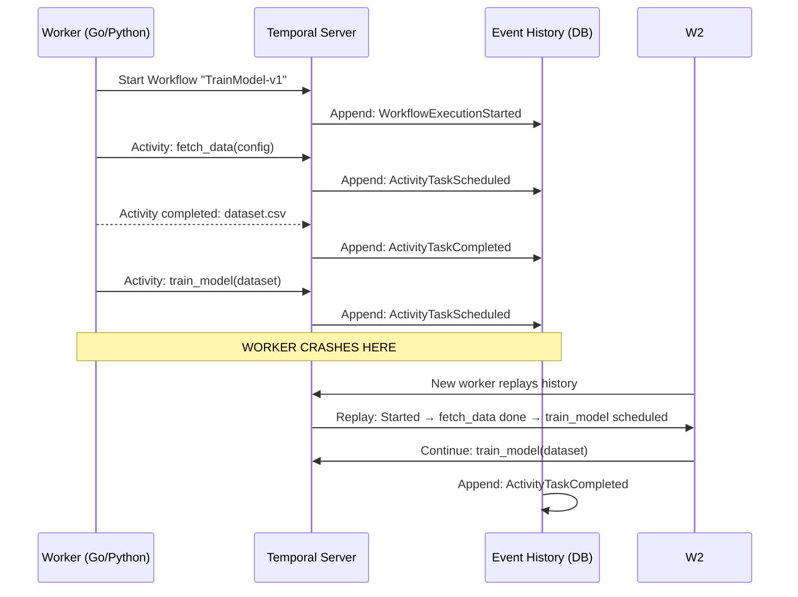

# 🏷️ Temporal Fundamentals — Workflows, Activities, and Durable Execution

## 🎯 Learning Objectives
- Explain the durable execution model: how Temporal persists every program state and replays event history through crashes
- Distinguish deterministic Workflow code from non-deterministic Activity code and explain why the separation exists
- Write a complete ML training pipeline as a Temporal workflow in both Python and Go
- Configure retry policies, timeouts, and heartbeat monitoring for Activities (training jobs, API calls)
- Use Signals and Queries to interact with long-running workflows (human approval, status queries)
- Compare Temporal's execution model with Airflow's scheduling model, Prefect's orchestration, and raw Python scripts

## Introduction

A workflow in Temporal is **regular code** — loops, conditionals, function calls, exception handlers. You write it as if crashes, restarts, and network failures do not exist. The runtime handles them by persisting every variable assignment, every function call, every timer, every async await into an append-only event history. If the worker crashes mid-execution, a new worker replays the event history to reconstruct the exact program state, and execution continues from the last persisted point. This is **durable execution**: the runtime guarantees your code completes, even if it takes days and survives multiple infrastructure failures.

For ML engineers, this changes everything. A training job that crashes after 1 hour 59 minutes of a 2-hour run restarts from 1 hour 59 minutes, not from zero. A batch inference job processing 1 million documents that crashes on document 847,321 resumes from document 847,322. A human approval gate that sits for 3 weeks over the holiday season is persisted durably in Temporal's database, not in ephemeral Python memory. The code you write is the code that runs — without retry boilerplate, without checkpointing logic, without state-machine orchestration frameworks.

Etymologically, "Temporal" refers to the management of time in distributed systems. The event history is a temporal log: a totally ordered sequence of events that, when replayed, deterministically reproduces the program's state at any point in time. This note connects to the CI/CD patterns in [[../29 - CI-CD for ML/...|CI-CD for ML]], the deployment strategies in [[../20 - Deployment y Serving/...|Deployment y Serving]], and the Go backend architecture in [[../../13 - Go ML Backend/...|13/06 - Go ML Backend]].

---

## 1. The Durable Execution Model

### 1.1 Event-Sourced State

Every operation in a workflow is recorded as an event in Temporal's event history:



The event history is the single source of truth. When a worker replays:
1. Temporal sends the full event history to the new worker
2. The worker re-executes the workflow code from the beginning
3. For each line, Temporal checks: "was this already recorded in the history?"
4. If yes → skip execution, use the persisted result
5. If no → execute the code, record the result as a new event

This means the workflow code **must be deterministic** — given the same event history, it must produce the same sequence of decisions. Otherwise, the replay diverges from history, and Temporal raises a non-determinism error.

### 1.2 Determinism Constraints

```python
# ❌ NON-DETERMINISTIC WORKFLOW CODE — WILL FAIL ON REPLAY
@workflow.defn
class TrainingPipeline:
    @workflow.run
    async def run(self, config: dict) -> dict:
        import random
        experiment_id = random.uuid4()      # ❌ Different UUID on replay
        start_time = time.time()            # ❌ Different timestamp on replay
        batch_size = random.randint(32, 128) # ❌ Different value on replay
        return {"id": experiment_id}

# ✅ DETERMINISTIC WORKFLOW — survivable through crashes
@workflow.defn
class TrainingPipeline:
    @workflow.run
    async def run(self, config: dict) -> dict:
        # Use workflow.random() — deterministic random seeded by workflow ID
        experiment_id = str(workflow.random().uuid4())
        batch_size = await workflow.execute_activity(
            select_batch_size, config,    # Non-determinism in Activity
            start_to_close_timeout=timedelta(minutes=1)
        )
        return {"id": experiment_id, "batch_size": batch_size}
```

The rule: **anything non-deterministic goes in an Activity**. Activities are the escape hatch for side effects: API calls, DB writes, GPU training, file I/O, timestamps, random numbers, and UUID generation.

> **¡Sorpresa!** Temporal's Go and Python SDKs provide deterministic replacements inside workflows: `workflow.Now()` instead of `time.Now()`, `workflow.Sleep()` instead of `time.Sleep()`, `workflow.random()` instead of `random.random()`. These are not just wrappers — `workflow.Sleep()` records a TimerFired event in the history (not an actual kernel sleep), so the worker can be killed and resumed with the timer still counting. The sleep is **logical time** in the event history, not wall-clock time on the worker.

---

## 2. Workflows vs Activities — The Separation

### 2.1 Two Execution Domains

| Property | Workflow | Activity |
|----------|----------|----------|
| **Purpose** | Orchestration logic | Side effects and computation |
| **Determinism** | Must be deterministic | Can be non-deterministic |
| **Persistence** | Event-sourced | Heartbeat + result persistence |
| **Retries** | Workflow retries via `RetryPolicy` on the entire workflow | Individual activity retry policies |
| **Timeouts** | WorkflowExecutionTimeout, RunTimeout | ScheduleToCloseTimeout, StartToCloseTimeout, HeartbeatTimeout |
| **Long-running** | Yes (days, weeks, months) | Yes, with heartbeats |
| **Network I/O** | Forbidden (use Activities) | Allowed and expected |

### 2.2 Python SDK Implementation

```python
from temporalio import workflow, activity
from datetime import timedelta
from temporalio.common import RetryPolicy

# === ACTIVITIES (non-deterministic side effects) ===

@activity.defn
async def fetch_dataset(config: dict) -> str:
    """Download dataset from S3. Non-deterministic: network I/O."""
    import boto3
    s3 = boto3.client("s3")
    s3.download_file(config["bucket"], config["key"], "/tmp/dataset.csv")
    return "/tmp/dataset.csv"

@activity.defn
async def train_model(dataset_path: str, hyperparams: dict) -> dict:
    """Train on GPU. Non-deterministic: time, GPU state, random init."""
    import torch
    model = torch.nn.Sequential(
        torch.nn.Linear(hyperparams["input_dim"], 128),
        torch.nn.ReLU(),
        torch.nn.Linear(128, hyperparams["output_dim"])
    )
    # Training loop with heartbeats
    for epoch in range(hyperparams["epochs"]):
        # ... training step ...
        activity.heartbeat(f"Epoch {epoch+1}/{hyperparams['epochs']}")
    return {"accuracy": 0.94, "model_path": "s3://models/v1/model.pt"}

@activity.defn
async def evaluate_model(model_path: str, test_data: str) -> dict:
    """Evaluate on test set."""
    return {"accuracy": 0.93, "f1": 0.91, "precision": 0.92}

# === WORKFLOW (deterministic orchestration) ===

@workflow.defn
class TrainingPipeline:
    @workflow.run
    async def run(self, config: dict) -> dict:
        # Step 1: Fetch data — will retry automatically on S3 errors
        dataset_path = await workflow.execute_activity(
            fetch_dataset, config,
            start_to_close_timeout=timedelta(minutes=10),
            retry_policy=RetryPolicy(
                initial_interval=timedelta(seconds=1),
                backoff_coefficient=2.0,
                maximum_attempts=3
            )
        )

        # Step 2: Train model — 2-hour timeout, retries on GPU OOM
        training_result = await workflow.execute_activity(
            train_model, dataset_path, config["hyperparameters"],
            start_to_close_timeout=timedelta(hours=2),
            heartbeat_timeout=timedelta(minutes=5),  # Must heartbeat every 5 min
            retry_policy=RetryPolicy(
                maximum_attempts=3,
                initial_interval=timedelta(seconds=30)
            )
        )

        # Step 3: Evaluate — don't retry if evaluation fails (data issue)
        eval_result = await workflow.execute_activity(
            evaluate_model, training_result["model_path"], config["test_data"],
            start_to_close_timeout=timedelta(minutes=15),
            retry_policy=RetryPolicy(maximum_attempts=1)  # No retry
        )

        return {
            "model_path": training_result["model_path"],
            "training_accuracy": training_result["accuracy"],
            "test_accuracy": eval_result["accuracy"],
            "status": "completed"
        }
```

⚠️ `activity.heartbeat()` is critical for long-running activities. If a training job runs for 90 minutes without a heartbeat, and `heartbeat_timeout=5 minutes` is set, Temporal assumes the activity died and schedules a retry — even if the original activity is still running. Always call `heartbeat()` from the training loop. 💡 Heartbeats can carry progress data — pass a string with the current epoch or percentage so the retry can resume from a checkpoint.

---

## 3. Go SDK — Native Temporal

### 3.1 The Same Model in Go

Temporal's Go SDK is the first-class citizen — all other SDKs are built on the same architectural patterns:

```go
package workflows

import (
    "time"
    "go.temporal.io/sdk/workflow"
    "go.temporal.io/sdk/temporal"
)

// Activities must be registered functions
func FetchDataset(ctx context.Context, config Config) (string, error) {
    // ... S3 download ...
    return "/tmp/dataset.csv", nil
}

func TrainModel(ctx context.Context, datasetPath string, hp Hyperparams) (TrainingResult, error) {
    for epoch := 0; epoch < hp.Epochs; epoch++ {
        // ... training step ...
        activity.RecordHeartbeat(ctx, fmt.Sprintf("epoch %d/%d", epoch+1, hp.Epochs))
    }
    return TrainingResult{Accuracy: 0.94, ModelPath: "s3://models/v1/"}, nil
}

// Workflow — deterministic orchestration
func TrainingPipeline(ctx workflow.Context, config Config) (Result, error) {
    options := workflow.ActivityOptions{
        StartToCloseTimeout: 10 * time.Minute,
        RetryPolicy: &temporal.RetryPolicy{
            InitialInterval:    1 * time.Second,
            BackoffCoefficient: 2.0,
            MaximumAttempts:    3,
        },
    }
    ctx = workflow.WithActivityOptions(ctx, options)

    var datasetPath string
    err := workflow.ExecuteActivity(ctx, FetchDataset, config).Get(ctx, &datasetPath)
    if err != nil {
        return Result{}, err
    }

    trainingOpts := workflow.ActivityOptions{
        StartToCloseTimeout: 2 * time.Hour,
        HeartbeatTimeout:    5 * time.Minute,
        RetryPolicy: &temporal.RetryPolicy{
            MaximumAttempts: 3,
        },
    }
    trainingCtx := workflow.WithActivityOptions(ctx, trainingOpts)

    var trainResult TrainingResult
    err = workflow.ExecuteActivity(trainingCtx, TrainModel, datasetPath, config.Hp).Get(trainingCtx, &trainResult)
    if err != nil {
        return Result{}, err
    }

    return Result{
        ModelPath: trainResult.ModelPath,
        Accuracy:  trainResult.Accuracy,
        Status:    "completed",
    }, nil
}
```

The Go SDK is preferred for high-performance workers because of Go's goroutine scheduler — a single worker process can handle thousands of concurrent workflow executions with minimal memory overhead. The Python SDK uses asyncio, which is efficient but not as lightweight for extreme concurrency.

---

## 4. Retries, Timeouts, and Heartbeats

### 4.1 The Complete Timeout Model

Temporal provides four timeout dimensions for every Activity:

```python
await workflow.execute_activity(
    train_model, dataset, hyperparams,
    schedule_to_close_timeout=timedelta(hours=3),   # Total time from scheduling to completion
    start_to_close_timeout=timedelta(hours=2),      # Max execution time once started
    heartbeat_timeout=timedelta(minutes=5),          # Max time between heartbeats
    schedule_to_start_timeout=timedelta(minutes=10), # Max time in queue waiting for worker
    retry_policy=RetryPolicy(
        initial_interval=timedelta(seconds=1),
        backoff_coefficient=2.0,
        maximum_interval=timedelta(seconds=100),
        maximum_attempts=3,
        non_retryable_error_types=["ValidationError"]  # Don't retry on data errors
    )
)
```

```
                    schedule_to_close_timeout
    ├──────────────────────────────────────────────────┤
    │ schedule_to_start │       start_to_close         │
    │    (queue wait)    │      (execution time)       │
    │←──────────────────→│←─────────────────────────────→│
                         │  heartbeats every 5 min      │
                         │  ↑  ↑  ↑  ↑  ↑  ↑  ↑        │
```

If a training activity doesn't heartbeat for 5 minutes, Temporal:
1. Marks the activity as timed out
2. Schedules a retry (if `maximum_attempts > 0`)
3. The new attempt starts on a new worker (possibly a new GPU)

> **¡Sorpresa!** If an activity times out on heartbeat but the original activity is still running (e.g., network partition), Temporal will **attempt to cancel** the original activity. The SDK's activity context provides a `cancelled` callback: you can listen for cancellation and gracefully clean up (save a checkpoint, release GPU memory). Without this, you risk two concurrent training runs on the same dataset — corrupted state.

### 4.2 Retry with Increasing Batch Size

```python
@workflow.defn
class AdaptiveTrainingPipeline:
    @workflow.run
    async def run(self, config: dict) -> dict:
        batch_size = config["initial_batch_size"]
        for attempt in range(3):
            try:
                result = await workflow.execute_activity(
                    train_model, config["dataset"], batch_size,
                    start_to_close_timeout=timedelta(hours=2),
                    retry_policy=RetryPolicy(maximum_attempts=1)  # Manual retry
                )
                return result
            except ApplicationError as e:
                if "CUDA out of memory" in str(e):
                    batch_size = batch_size // 2  # Halve batch size on OOM
                    continue
                raise  # Different error — don't retry
```

---

## 5. Signals and Queries — Interactive Workflows

### 5.1 Human-in-the-Loop with Signals

```python
@workflow.defn
class ModelDeploymentPipeline:
    def __init__(self):
        self._approval_received = False
        self._approved = False

    @workflow.signal
    async def approve_deployment(self, reviewer: str, notes: str):
        self._approval_received = True
        self._approved = True

    @workflow.signal
    async def reject_deployment(self, reviewer: str, reason: str):
        self._approval_received = True
        self._approved = False

    @workflow.query
    def get_training_accuracy(self) -> float:
        return self._training_accuracy

    @workflow.run
    async def run(self, config: dict) -> dict:
        # Step 1: Train
        train_result = await workflow.execute_activity(train_model, config)
        self._training_accuracy = train_result["accuracy"]

        # Step 2: Wait for human approval — days or weeks
        await workflow.wait_condition(lambda: self._approval_received)

        if not self._approved:
            # Branch to retraining with different hyperparameters
            return await workflow.execute_activity(
                retrain_with_adjusted_params, config
            )

        # Step 3: Deploy
        deployment_result = await workflow.execute_activity(
            deploy_to_kserve, train_result["model_path"]
        )
        return deployment_result
```

**Signals** are asynchronous messages sent to a running workflow. The workflow can `await workflow.wait_condition()` and resume when a condition becomes true. The workflow state (including wait conditions) is persisted in the event history — it survives worker restarts across days or weeks of waiting.

**Queries** return workflow state without modifying history. A dashboard can call `get_training_accuracy` to display live metrics without affecting the workflow's execution.

---

## 6. Temporal vs Airflow vs Prefect

| Dimension | Airflow | Prefect | Temporal |
|-----------|---------|---------|----------|
| **Primary function** | Schedule DAGs at specific times | Orchestrate data pipelines | Guarantee durable execution |
| **Execution model** | Stateless: each run is independent | Stateful: tasks have persistent state | Event-sourced: every step is a logged event |
| **Failure recovery** | Restart the entire DAG run | Retry tasks from database state | Replay event history, resume from exact point |
| **Long-running tasks** | 2-hour tasks possible but fragile | Supported with checkpointing | First-class: heartbeats, cancellation, months-long |
| **Human-in-the-loop** | Sensors (poll-based, fragile) | Manual approval signals | Durable signals (persisted in event history) |
| **Scaling model** | Workers poll the scheduler | Workers poll the server | Workers pull tasks from task queues |
| **Language** | Python only (DAG definition) | Python only | Go, Python, TypeScript, Java |
| **Versioning** | DAGs are files — version in Git | Flows versioned with code | Workflow versioning built into runtime |

```python
# ❌ AIRFLOW DAG FOR ML PIPELINE
# Anti-pattern: 2-hour task that crashes at 1:59 → restarts from 0

from airflow import DAG
from airflow.operators.python import PythonOperator

with DAG("ml_training", schedule="@daily") as dag:
    def train():
        for epoch in range(100):
            pass  # 2-hour training loop
        return "model.pt"

    train_task = PythonOperator(task_id="train_model", python_callable=train)
    # CRASH AT EPOCH 99 → RESTART FROM EPOCH 0 → 2 hours wasted
```

```python
# ✅ TEMPORAL WORKFLOW FOR ML PIPELINE
# Solution: Crash at epoch 99 → replay → resume at epoch 99

@workflow.defn
class TrainingPipeline:
    @workflow.run
    async def run(self):
        result = await workflow.execute_activity(
            train_model, config,
            start_to_close_timeout=timedelta(hours=2),
            heartbeat_timeout=timedelta(minutes=5)
        )
        # CRASH AT 1:59 → REPLAY → ACK that fetch_data already ran
        # → Re-execute train_model → Temporal sees it already ran
        # → Uses persisted result → workflow continues to evaluate_model
        return result
```

> **Caso real: Netflix** runs 10M+ Temporal workflows per day for their encoding pipeline. A video encoding job might run for hours across multiple workers in multiple cloud zones. Instance failures, worker crashes, and network blips are absorbed transparently — the workflow continues from the last persisted event. Airflow could not handle this workload because encoding jobs are not DAGs — they are long-running, stateful processes that must survive infrastructure failures without restarting.

---

## 7. Workflow Versioning — Zero-Downtime Deploys

> **¡Sorpresa!** Temporal workers can be updated while workflows are **running**. Old workflows continue executing with old code (deterministic replay of old event histories). New workflows use the new code. This is "workflow versioning" via the `GetVersion` API:

```python
@workflow.defn
class TrainingPipeline:
    @workflow.run
    async def run(self, config: dict) -> dict:
        # GetVersion returns the version associated with this workflow's start
        version = workflow.get_version(
            "training_strategy",
            workflow.DEFAULT_VERSION,  # Default for workflows started before this change
            1                           # For workflows started with new code
        )

        if version == workflow.DEFAULT_VERSION:
            result = await workflow.execute_activity(train_model_sgd, config)
        else:
            result = await workflow.execute_activity(train_model_adam, config)
        return result
```

This means you can deploy a new training algorithm, and workflows started with the old algorithm continue to completion with the old logic — no forced restarts, no stuck pipelines, no data corruption. This is the holy grail of CI/CD for long-running ML pipelines, and it connects directly to the deployment strategies in [[../29 - CI-CD for ML/...|CI-CD for ML]].

> **Caso real: Snap** uses Temporal for deploying new ML models with human approval workflows. Model training completes → Temporal signals the ML review team → a human reviews the model metrics in a dashboard → clicks "Approve" → signal sent to the running workflow → workflow resumes → triggers deployment to KServe → monitors deployment metrics for 4 hours → if metrics degrade, the workflow triggers automatic rollback. The entire process can take 5 business days, and Temporal persists the workflow state across the entire duration.

---

## 🎯 Key Takeaways
- Temporal's durable execution model event-sources every operation — recovery is replay, not restart
- Workflows must be deterministic; non-deterministic operations (network I/O, GPU training, random) must be Activities
- Activity heartbeats are the mechanism for detecting stalled long-running tasks — without them, Temporal cannot know if a training job is alive
- Retry policies, four timeout dimensions, and heartbeat timeouts give precise control over failure recovery
- Signals enable human-in-the-loop workflows that persist for days, weeks, or months
- Queries provide live workflow state without modifying history — ideal for dashboards and monitoring
- Temporal's Go SDK is the native language; Python SDK supports asyncio-based workflows
- Workflow versioning enables zero-downtime deploys: old workflows run old code, new workflows run new code
- Airflow schedules DAGs; Temporal executes durable workflows — the difference is resuming from the exact point of failure vs restarting from scratch

## 📦 Código de Compresión

```python
# === COMPLETE ML TRAINING PIPELINE AS TEMPORAL WORKFLOW ===

from temporalio import workflow, activity
from temporalio.common import RetryPolicy
from datetime import timedelta
from dataclasses import dataclass

@dataclass
class TrainingConfig:
    bucket: str
    dataset_key: str
    test_split: float = 0.2
    input_dim: int = 784
    hidden_dim: int = 256
    output_dim: int = 10
    epochs: int = 20
    batch_size: int = 128
    learning_rate: float = 0.001

# === ACTIVITIES ===

@activity.defn
async def fetch_dataset(config: TrainingConfig) -> str:
    """Download and split dataset. Returns path to train/test files."""
    import boto3, pandas as pd
    from sklearn.model_selection import train_test_split

    s3 = boto3.client("s3")
    s3.download_file(config.bucket, config.dataset_key, "/tmp/dataset.csv")
    df = pd.read_csv("/tmp/dataset.csv")
    train, test = train_test_split(df, test_size=config.test_split)
    train.to_csv("/tmp/train.csv", index=False)
    test.to_csv("/tmp/test.csv", index=False)
    activity.heartbeat("Dataset loaded and split")
    return "/tmp"

@activity.defn
async def train_model(data_dir: str, config: TrainingConfig) -> dict:
    """Train a PyTorch model with heartbeats."""
    import torch, torch.nn as nn
    from torch.utils.data import DataLoader, TensorDataset
    import pandas as pd

    df_train = pd.read_csv(f"{data_dir}/train.csv")
    X = torch.tensor(df_train.drop("label", axis=1).values, dtype=torch.float32)
    y = torch.tensor(df_train["label"].values, dtype=torch.long)
    loader = DataLoader(TensorDataset(X, y), batch_size=config.batch_size)

    model = nn.Sequential(
        nn.Linear(config.input_dim, config.hidden_dim),
        nn.ReLU(), nn.Dropout(0.2),
        nn.Linear(config.hidden_dim, config.output_dim)
    )
    optimizer = torch.optim.Adam(model.parameters(), lr=config.learning_rate)
    criterion = nn.CrossEntropyLoss()

    for epoch in range(config.epochs):
        total_loss = 0
        for batch_x, batch_y in loader:
            optimizer.zero_grad()
            loss = criterion(model(batch_x), batch_y)
            loss.backward()
            optimizer.step()
            total_loss += loss.item()
        activity.heartbeat(f"Epoch {epoch+1}/{config.epochs}, loss: {total_loss:.4f}")
        # ⚠️ Heartbeat is critical — without it, Temporal assumes the
        # activity died and retries from scratch

    torch.save(model.state_dict(), f"{data_dir}/model.pt")
    return {
        "model_path": f"{data_dir}/model.pt",
        "final_loss": total_loss,
        "epochs_completed": config.epochs
    }

@activity.defn
async def evaluate_model(data_dir: str, model_path: str, config: TrainingConfig) -> dict:
    """Evaluate model on test set."""
    import torch, pandas as pd

    df_test = pd.read_csv(f"{data_dir}/test.csv")
    X = torch.tensor(df_test.drop("label", axis=1).values, dtype=torch.float32)
    y = torch.tensor(df_test["label"].values, dtype=torch.long)

    model = load_model(config)
    model.load_state_dict(torch.load(model_path))
    model.eval()
    with torch.no_grad():
        preds = model(X).argmax(dim=1)
        accuracy = (preds == y).float().mean().item()
    activity.heartbeat(f"Evaluation done, accuracy: {accuracy:.4f}")
    return {"test_accuracy": accuracy}

# === WORKFLOW ===

@workflow.defn
class MLTrainingPipeline:
    @workflow.run
    async def run(self, config: TrainingConfig) -> dict:
        data_dir = await workflow.execute_activity(
            fetch_dataset, config,
            start_to_close_timeout=timedelta(minutes=10),
            heartbeat_timeout=timedelta(seconds=30),
            retry_policy=RetryPolicy(maximum_attempts=3)
        )

        training_result = await workflow.execute_activity(
            train_model, data_dir, config,
            start_to_close_timeout=timedelta(hours=4),
            heartbeat_timeout=timedelta(minutes=2),
            retry_policy=RetryPolicy(
                maximum_attempts=3,
                initial_interval=timedelta(seconds=10),
                backoff_coefficient=2.0,
                maximum_interval=timedelta(minutes=5)
            )
        )

        eval_result = await workflow.execute_activity(
            evaluate_model, data_dir, training_result["model_path"], config,
            start_to_close_timeout=timedelta(minutes=15),
            retry_policy=RetryPolicy(maximum_attempts=1)
        )

        return {
            "model_path": training_result["model_path"],
            "training_loss": training_result["final_loss"],
            "test_accuracy": eval_result["test_accuracy"],
            "status": "completed"
        }
```

```bash
# Start Temporal dev server
temporal server start-dev

# Start the worker (registers workflow + activities)
python worker.py

# Trigger a training run
python client.py --dataset s3://ml-data/mnist/dataset.csv --epochs 20

# Query the running workflow for progress
temporal workflow describe --workflow-id ml-training-2026-01

# Signal the workflow (e.g., approve deployment)
temporal workflow signal --workflow-id ml-training-2026-01 \
  --name approve_deployment --input '{"reviewer":"alice","notes":"LGTM"}'
```

## References
- [Temporal Documentation — Workflows](https://docs.temporal.io/workflows)
- [Temporal Documentation — Activities](https://docs.temporal.io/activities)
- [Temporal Python SDK Guide](https://docs.temporal.io/dev-guide/python)
- [Temporal Go SDK Guide](https://docs.temporal.io/dev-guide/go)
- [Temporal Architecture — Event History](https://docs.temporal.io/clusters)
- [[../20 - Deployment y Serving/00 - Bienvenida|09/20 - Deployment y Serving]]
- [[../23 - Advanced MLOps/...|09/23 - Advanced MLOps]]
- [[../29 - CI-CD for ML/...|09/29 - CI-CD for ML]]
- [[../../13 - Go ML Backend/06 - Go ML Backend|13/06 - Go ML Backend]]
