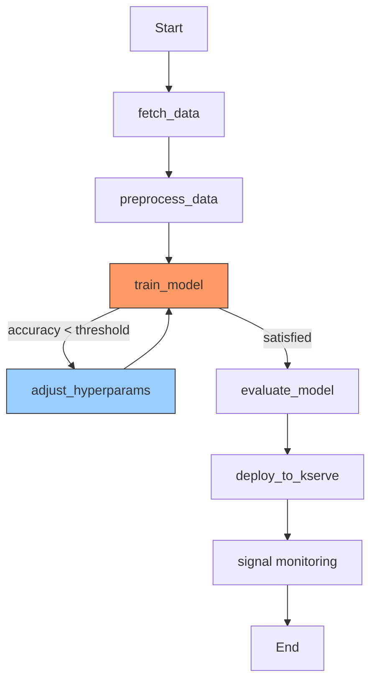
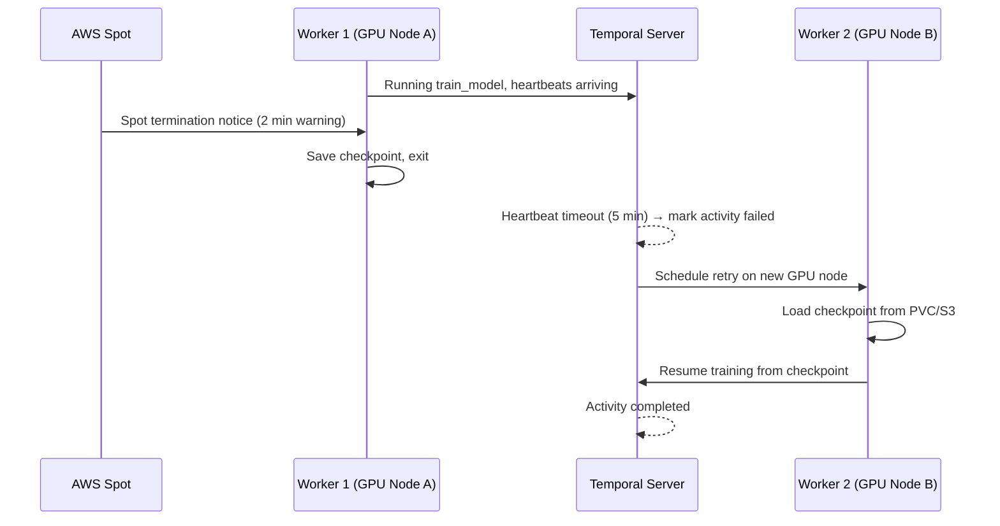
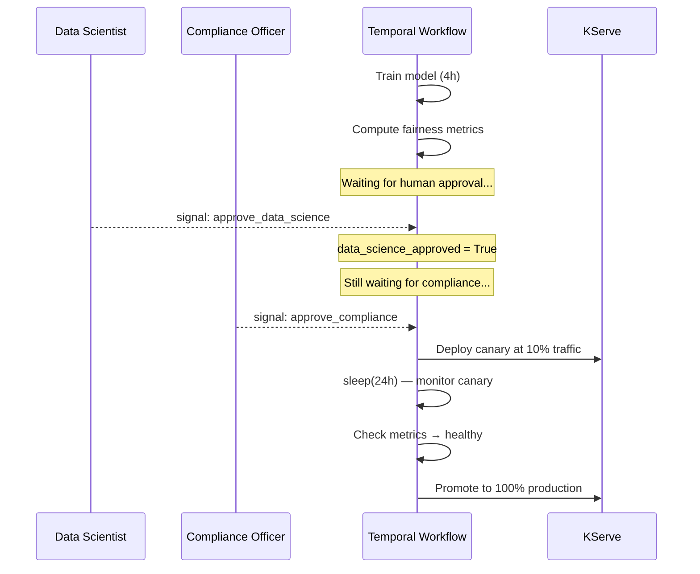

# 🏷️ Temporal in ML Pipelines — Training Orchestration and Human-in-the-Loop

## 🎯 Learning Objectives
- Design a Temporal workflow that orchestrates a complete ML training pipeline (fetch → preprocess → train → evaluate → deploy)
- Handle GPU-specific failure modes: CUDA out of memory, spot instance termination, and worker death mid-training
- Implement batch inference with partial retries — if batch 47 fails, only batch 47 retries
- Build human-in-the-loop (HITL) workflows that persist for days or weeks during review periods
- Orchestrate parallel hyperparameter search using Temporal's concurrent activity execution
- Integrate Temporal with ML-specific tooling: MLflow, Weights & Biases, Docker, and kubectl
- Use Temporal's Web UI for ML pipeline observability — every input, output, retry, and stack trace

## Introduction

ML pipelines have failure modes that general-purpose orchestrators were never designed to handle. A training job running on a spot instance gets reclaimed by AWS at 1 hour 59 minutes into a 2-hour run — Airflow restarts from scratch, wasting 119 minutes of GPU time and $4.50 in cloud costs. A batch inference job processing 1 million documents hits a rate limit at document 847,321 — a raw Python script crashes and requires restarting from document 1. A model deployment requires human approval that might take 5 business days over a holiday — no in-memory orchestrator survives for 5 days without persistence. Temporal handles all three because its execution model treats time and failure as first-class citizens in the runtime.

This note applies the fundamental concepts from [[01 - Temporal Fundamentals - Workflows, Activities and Durable Execution|Note 01]] to real-world ML pipeline patterns. We will build a complete end-to-end training pipeline that survives spot instance termination, a batch inference workflow that retries only failed batches, a human-in-the-loop deployment gate that lasts for days, and a parallel hyperparameter search that runs on N GPUs simultaneously — all as regular Python/Go code, all durably executed by Temporal.

---

## 1. Training Pipeline Orchestration

### 1.1 The Complete Pipeline



The workflow handles branching logic that traditional DAGs struggle with:

```python
from temporalio import workflow, activity
from temporalio.common import RetryPolicy
from datetime import timedelta

@workflow.defn
class EndToEndTrainingPipeline:
    """
    Complete ML pipeline: fetch → preprocess → train → evaluate → deploy.
    Trains with adaptive hyperparameters if accuracy is below threshold.
    Deploys to KServe on success.
    """
    @workflow.run
    async def run(self, config: TrainingConfig) -> dict:
        # Stage 1: Data preparation
        raw_data = await workflow.execute_activity(
            fetch_data, config.s3_bucket, config.dataset_key,
            start_to_close_timeout=timedelta(minutes=30),
            retry_policy=RetryPolicy(maximum_attempts=3)
        )

        processed_data = await workflow.execute_activity(
            preprocess_data, raw_data, config.feature_config,
            start_to_close_timeout=timedelta(minutes=15),
            retry_policy=RetryPolicy(maximum_attempts=2)
        )

        # Stage 2: Training with adaptive hyperparameters
        max_training_attempts = 5
        current_hyperparams = config.hyperparameters

        for attempt in range(max_training_attempts):
            training_result = await workflow.execute_activity(
                train_model, processed_data, current_hyperparams,
                start_to_close_timeout=timedelta(hours=4),
                heartbeat_timeout=timedelta(minutes=2),
                retry_policy=RetryPolicy(
                    maximum_attempts=2,  # Per-attempt retries for GPU failures
                    initial_interval=timedelta(seconds=30)
                )
            )

            # Stage 3: Evaluate
            eval_result = await workflow.execute_activity(
                evaluate_model,
                training_result["model_path"],
                processed_data["test_split"],
                start_to_close_timeout=timedelta(minutes=15)
            )

            if eval_result["accuracy"] >= config.accuracy_threshold:
                break  # Model meets requirements

            if attempt < max_training_attempts - 1:
                # Adjust hyperparameters and retry
                current_hyperparams = await workflow.execute_activity(
                    adjust_hyperparameters, current_hyperparams, eval_result,
                    start_to_close_timeout=timedelta(minutes=2)
                )

        if eval_result["accuracy"] < config.accuracy_threshold:
            raise ApplicationError(
                f"Training failed: max accuracy {eval_result['accuracy']} "
                f"< threshold {config.accuracy_threshold}"
            )

        # Stage 4: Deploy to KServe
        deploy_result = await workflow.execute_activity(
            deploy_to_kserve,
            training_result["model_path"],
            config.inference_service_name,
            start_to_close_timeout=timedelta(minutes=10),
            retry_policy=RetryPolicy(maximum_attempts=3)
        )

        # Stage 5: Signal monitoring service
        await workflow.execute_activity(
            notify_monitoring, deploy_result, eval_result,
            start_to_close_timeout=timedelta(minutes=2),
            retry_policy=RetryPolicy(maximum_attempts=1)
        )

        return {
            "model_path": training_result["model_path"],
            "accuracy": eval_result["accuracy"],
            "deployment_status": deploy_result["status"],
            "training_attempts": attempt + 1
        }
```

⚠️ The `train_model` activity has both a retry policy (`maximum_attempts=2`) AND the workflow loop (`max_training_attempts=5`). The retry policy handles infrastructure failures (spot termination, GPU OOM → retry with lower batch size). The workflow loop handles model quality failures (accuracy too low → adjust hyperparameters and retrain). These are different failure domains.

---

## 2. GPU Failure Handling

### 2.1 Spot Instance Survival

Training on spot instances (60–90% cheaper than on-demand) is standard practice, but spot instances can be reclaimed with only 2 minutes' notice. Temporal makes this survivable:

```python
@activity.defn
async def train_on_spot_instance(
    data_path: str,
    hyperparams: dict,
    checkpoint_path: str
) -> dict:
    """
    Training activity designed for spot instance preemption.
    Heartbeats carry checkpoint information for resumption.
    """
    import torch, torch.nn as nn, signal, sys

    model = build_model(hyperparams)
    optimizer = torch.optim.Adam(model.parameters(), lr=hyperparams["lr"])
    dataloader = create_dataloader(data_path, hyperparams["batch_size"])

    # Resume from checkpoint if it exists (in case of retry)
    start_epoch = 0
    if os.path.exists(checkpoint_path):
        checkpoint = torch.load(checkpoint_path)
        model.load_state_dict(checkpoint["model_state"])
        optimizer.load_state_dict(checkpoint["optimizer_state"])
        start_epoch = checkpoint["epoch"] + 1

    # Register signal handler for spot termination (cleanup)
    def handle_spot_termination(signum, frame):
        torch.save({
            "model_state": model.state_dict(),
            "optimizer_state": optimizer.state_dict(),
            "epoch": current_epoch
        }, checkpoint_path)
        sys.exit(0)

    signal.signal(signal.SIGTERM, handle_spot_termination)

    for epoch in range(start_epoch, hyperparams["epochs"]):
        current_epoch = epoch
        total_loss = 0.0
        for batch_idx, (data, target) in enumerate(dataloader):
            optimizer.zero_grad()
            output = model(data)
            loss = nn.functional.cross_entropy(output, target)
            loss.backward()
            optimizer.step()
            total_loss += loss.item()

            # Heartbeat every 100 batches — carries checkpoint info
            if batch_idx % 100 == 0:
                activity.heartbeat(
                    f"Epoch {epoch}, Batch {batch_idx}, "
                    f"Loss: {total_loss / (batch_idx + 1):.4f}, "
                    f"Checkpoint: {checkpoint_path}"
                )

    # Save final model
    torch.save(model.state_dict(), f"{data_path}/model_final.pt")
    return {"model_path": f"{data_path}/model_final.pt", "final_loss": total_loss}
```



**Critical requirement:** The checkpoint must be saved to a shared location (PVC, S3, NFS) — not to the worker's ephemeral storage. The retry runs on a different node.

> **Caso real: Stripe** uses Temporal for their payment ML pipeline. Model training + feature computation + A/B test setup + gradual rollout runs on spot instances. A single workflow orchestrates the entire process across 50+ workers, each handling a different stage. If any stage fails (spot termination, GPU OOM, API rate limit), only that stage retries — all upstream results are preserved in the event history.

### 2.2 CUDA Out of Memory Handling

```python
@workflow.defn
class GPUTrainingWorkflow:
    @workflow.run
    async def run(self, config: TrainingConfig) -> dict:
        batch_size = config.initial_batch_size

        while batch_size >= 1:
            try:
                return await workflow.execute_activity(
                    train_model, config.dataset_path,
                    {**config.hyperparameters, "batch_size": batch_size},
                    start_to_close_timeout=timedelta(hours=4),
                    heartbeat_timeout=timedelta(minutes=2),
                    retry_policy=RetryPolicy(maximum_attempts=1)
                )
            except ApplicationError as e:
                if "CUDA out of memory" in str(e):
                    batch_size = batch_size // 2
                    workflow.logger.warning(
                        f"OOM at batch_size={batch_size * 2}, "
                        f"retrying with batch_size={batch_size}"
                    )
                    continue
                raise  # Unexpected error — fail the workflow
```

---

## 3. Batch Inference with Partial Retries

### 3.1 The Problem

Processing 1 million documents through an LLM for classification:

```python
# ❌ SINGLE PYTHON SCRIPT — CRASHES → RESTART FROM DOCUMENT 1
def batch_inference(documents: list[str], model: Any) -> list[dict]:
    results = []
    for i, doc in enumerate(documents):
        try:
            result = model.classify(doc)
            results.append({"index": i, "label": result})
        except RateLimitError:
            time.sleep(60)  # ⚠️ Blocks everything
            result = model.classify(doc)
        if i % 1000 == 0:
            print(f"Processed {i}/{len(documents)}")
    return results

# Crash at document 847,321 → all 847,321 results lost → restart from 0
```

Temporal's solution: split into N activities, each processing a slice. Failed activities retry independently:

```python
@activity.defn
async def process_batch(
    documents: list[str],
    model_endpoint: str,
    batch_id: int
) -> list[dict]:
    """Process one batch of documents. Retried independently on failure."""
    import httpx
    results = []
    client = httpx.Client(timeout=30)

    for i, doc in enumerate(documents):
        try:
            response = client.post(
                model_endpoint,
                json={"text": doc}
            )
            response.raise_for_status()
            results.append(response.json())
        except httpx.HTTPStatusError as e:
            if e.response.status_code == 429:  # Rate limit
                activity.heartbeat(f"Rate limited at doc {i}, retrying...")
                time.sleep(e.response.headers.get("Retry-After", 5))
                response = client.post(model_endpoint, json={"text": doc})
                results.append(response.json())
            else:
                raise

        if i % 100 == 0:
            activity.heartbeat(f"Batch {batch_id}: {i}/{len(documents)}")

    return results


@workflow.defn
class BatchInferencePipeline:
    @workflow.run
    async def run(self, config: BatchConfig) -> list[dict]:
        # 1. Fetch all documents
        documents = await workflow.execute_activity(
            fetch_documents, config.s3_bucket, config.document_key,
            start_to_close_timeout=timedelta(minutes=30),
            retry_policy=RetryPolicy(maximum_attempts=3)
        )

        # 2. Split into batches
        batch_size = 10_000  # 10K docs per batch
        batches = [
            documents[i:i + batch_size]
            for i in range(0, len(documents), batch_size)
        ]

        # 3. Process all batches concurrently
        batch_tasks = []
        for batch_id, batch in enumerate(batches):
            task = workflow.execute_activity(
                process_batch, batch, config.model_endpoint, batch_id,
                start_to_close_timeout=timedelta(hours=2),
                heartbeat_timeout=timedelta(minutes=5),
                retry_policy=RetryPolicy(
                    maximum_attempts=5,
                    initial_interval=timedelta(seconds=10),
                    backoff_coefficient=2.0
                )
            )
            batch_tasks.append(task)

        # 4. Wait for all batches — only failed batches retry
        all_results = []
        for task in batch_tasks:
            batch_result = await task  # Suspend until batch completes
            all_results.extend(batch_result)

        # 5. Merge and return
        return sorted(all_results, key=lambda x: x["index"])
```

**Key insight:** If batch 47 of 100 fails (API rate limit), Temporal retries only batch 47. Batches 0–46 and 48–99 are already persisted as completed activities in the event history. The workflow continues when batch 47 succeeds — zero wasted work.

> **¡Sorpresa!** Temporal's `asyncio.gather` (Python) and `workflow.Go` (Go) run activities **concurrently within a single workflow**. This is not parallel Python threads — it is the Temporal runtime scheduling N activity tasks to N workers simultaneously. A 100-batch inference job can leverage 100 workers, completing in ~2% of the single-worker time. The workflow collects results as they complete, and failed activities do not block successful ones.

---

## 4. Human-in-the-Loop (HITL)

### 4.1 The Pattern

ML deployment in regulated environments requires human approval. A data scientist reviews model metrics, a compliance officer signs off on fairness metrics, a product manager approves the rollout percentage. This process can take days:

```python
@workflow.defn
class RegulatedDeploymentPipeline:
    def __init__(self):
        self._data_science_approved = False
        self._compliance_approved = False
        self._rollout_percentage = 10  # Initial canary percentage

    @workflow.signal
    async def approve_data_science(self, reviewer: str, notes: str):
        workflow.logger.info(f"Data Science approved by {reviewer}: {notes}")
        self._data_science_approved = True

    @workflow.signal
    async def approve_compliance(self, reviewer: str, notes: str):
        workflow.logger.info(f"Compliance approved by {reviewer}: {notes}")
        self._compliance_approved = True

    @workflow.signal
    async def set_rollout_percentage(self, percentage: int):
        if percentage < 0 or percentage > 100:
            raise ValueError(f"Invalid percentage: {percentage}")
        self._rollout_percentage = percentage

    @workflow.signal
    async def reject_deployment(self, reviewer: str, reason: str):
        workflow.logger.warning(f"Deployment rejected by {reviewer}: {reason}")
        self._rejected = True
        self._rejection_reason = reason

    @workflow.query
    def get_status(self) -> dict:
        return {
            "data_science_approved": self._data_science_approved,
            "compliance_approved": self._compliance_approved,
            "rollout_percentage": self._rollout_percentage,
            "rejected": self._rejected
        }

    @workflow.run
    async def run(self, config: DeploymentConfig) -> dict:
        # Stage 1: Train the model
        training_result = await workflow.execute_activity(
            train_model, config,
            start_to_close_timeout=timedelta(hours=4),
            heartbeat_timeout=timedelta(minutes=2),
            retry_policy=RetryPolicy(maximum_attempts=3)
        )

        # Stage 2: Compute fairness and bias metrics
        fairness_result = await workflow.execute_activity(
            compute_fairness_metrics,
            training_result["model_path"], config.test_data,
            start_to_close_timeout=timedelta(minutes=30),
            retry_policy=RetryPolicy(maximum_attempts=2)
        )

        # Stage 3: WAIT for human approval — could be days
        await workflow.wait_condition(
            lambda: (self._data_science_approved and self._compliance_approved)
                    or self._rejected
        )

        if self._rejected:
            # Branch to retraining with adjusted fairness constraints
            return await workflow.execute_activity(
                retrain_with_fairness_constraints,
                config, self._rejection_reason
            )

        # Stage 4: Canary deployment
        deploy_result = await workflow.execute_activity(
            deploy_canary_to_kserve,
            training_result["model_path"],
            self._rollout_percentage,
            start_to_close_timeout=timedelta(minutes=10)
        )

        # Stage 5: Monitor canary for 24 hours
        await workflow.sleep(timedelta(hours=24))

        monitor_result = await workflow.execute_activity(
            evaluate_canary_metrics,
            config.inference_service_name,
            start_to_close_timeout=timedelta(minutes=5)
        )

        if monitor_result["error_rate"] > config.max_error_rate:
            # Automatically rollback
            await workflow.execute_activity(
                rollback_canary, config.inference_service_name,
                start_to_close_timeout=timedelta(minutes=5)
            )
            raise ApplicationError("Canary metrics degraded — rolled back")

        # Stage 6: Full deployment
        return await workflow.execute_activity(
            promote_canary_to_production,
            config.inference_service_name,
            start_to_close_timeout=timedelta(minutes=5)
        )
```



> **¡Sorpresa!** The `workflow.sleep(timedelta(hours=24))` in line 174 is NOT a Python `time.sleep()` that blocks a worker thread for 24 hours. It is a **durable timer** — Temporal records a `TimerStarted` event in the event history, the worker is freed immediately, and the next action is triggered 24 hours of wall-clock time later, potentially on a different worker, after multiple restarts and server upgrades. The workflow survives all of it.

> **Caso real: Coinbase** uses Temporal for their fraud detection model deployment pipeline. The workflow: training (GPU cluster) → backtesting (6 months of historical transaction data, takes 8 hours) → compliance review (human, 5 business days to review model fairness across demographic groups) → staging deployment (4 hours observation on shadow traffic) → production canary (10% for 24 hours) → full deployment. Temporal ensures no step is skipped and every failure is retried — including the 5-day human review that no other orchestrator can persist reliably.

---

## 5. Parallel Hyperparameter Search

### 5.1 Concurrent Training Runs

```python
@workflow.defn
class HyperparameterSearch:
    @workflow.run
    async def run(self, config: SearchConfig) -> dict:
        # Define the search space
        hyperparameter_sets = [
            {"lr": 0.001, "batch_size": 64, "optimizer": "adam"},
            {"lr": 0.0005, "batch_size": 128, "optimizer": "adam"},
            {"lr": 0.001, "batch_size": 64, "optimizer": "sgd"},
            {"lr": 0.0001, "batch_size": 256, "optimizer": "adamw"},
            {"lr": 0.01, "batch_size": 32, "optimizer": "adam"},
        ]

        # Launch all training runs in parallel
        training_tasks = []
        for hp in hyperparameter_sets:
            task = workflow.execute_activity(
                train_model, config.dataset_path,
                {**config.base_hyperparams, **hp},
                start_to_close_timeout=timedelta(hours=2),
                heartbeat_timeout=timedelta(minutes=2),
                retry_policy=RetryPolicy(maximum_attempts=2)
            )
            training_tasks.append(task)

        # Wait for all to complete — failed runs retry independently
        results = []
        for task in training_tasks:
            try:
                result = await task
                results.append(result)
            except Exception as e:
                workflow.logger.error(f"Hyperparameter run failed: {e}")
                # Failed run is discarded; remaining runs continue

        # Pick the best model
        best_result = max(results, key=lambda r: r["accuracy"])

        # Evaluate best model on held-out test set
        eval_result = await workflow.execute_activity(
            evaluate_model, best_result["model_path"], config.test_data,
            start_to_close_timeout=timedelta(minutes=15),
            retry_policy=RetryPolicy(maximum_attempts=1)
        )

        return {"best_model": best_result["model_path"],
                "test_accuracy": eval_result["accuracy"],
                "all_results": results}
```

⚠️ Parallel training runs on the same GPU cluster require careful resource management. Each Activity schedules to a task queue; if all 5 runs target the same limited GPU queue, they will be serialized on available workers. Use **multiple task queues** — one per GPU — to ensure parallelism:

```python
# Each hyperparameter run targets a specific GPU task queue
for i, hp in enumerate(hyperparameter_sets):
    task = workflow.execute_activity(
        train_model, config.dataset_path, hp,
        task_queue=f"gpu-queue-{i % gpu_count}",  # Round-robin across GPUs
        start_to_close_timeout=timedelta(hours=2)
    )
```

---

## 6. Pipeline Observability — Temporal Web UI

Temporal's Web UI provides natural ML pipeline observability without additional tooling:

- **Workflow list**: All training pipelines, status (Running/Completed/Failed), duration, workflow ID
- **Timeline view**: Every Activity start and end time, total pipeline duration, activity-level latency
- **Input/Output viewer**: See exactly what data was passed into each activity (config, dataset paths, hyperparameters)
- **Stack traces**: Full Python tracebacks for failed activities (GPU OOM, shape mismatches, API errors)
- **Retry history**: How many times each activity retried, why it failed, what interval was used
- **Query results**: Live status queries return the current state without modifying history

This is the observability that ML platforms spend months building — dashboards, run histories, failure analysis — and Temporal provides it as a free side effect of the execution model.

---

## 7. Integration with ML Tools

Temporal does not replace ML tools — it orchestrates them with durability:

```python
@activity.defn
async def train_with_mlflow(config: TrainingConfig) -> dict:
    """Training activity that integrates with MLflow for experiment tracking."""
    import mlflow, torch

    mlflow.set_tracking_uri(config.mlflow_uri)
    mlflow.set_experiment(config.experiment_name)

    with mlflow.start_run(run_name=config.run_name) as run:
        mlflow.log_params(config.hyperparameters)

        model = build_model(config)
        # ... training loop with wandb logging ...
        for epoch in range(config.epochs):
            # ... training step ...
            mlflow.log_metric("loss", loss, step=epoch)
            activity.heartbeat(f"Epoch {epoch}, loss: {loss:.4f}")

        mlflow.pytorch.log_model(model, "model")
        mlflow.register_model(f"runs:/{run.info.run_id}/model", config.model_name)

        return {"mlflow_run_id": run.info.run_id, "model_uri": f"runs:/{run.info.run_id}/model"}


@activity.defn
async def deploy_via_kubectl(model_uri: str, service_name: str) -> dict:
    """Deploy the model to KServe by patching the InferenceService."""
    import subprocess

    result = subprocess.run([
        "kubectl", "patch", "inferenceservice", service_name,
        "--type=merge",
        "-p", f'{{"spec":{{"predictor":{{"mlflow":{{"storageUri":"{model_uri}"}}}}}}}}'
    ], capture_output=True, text=True)

    activity.heartbeat(f"Patched InferenceService {service_name}")

    if result.returncode != 0:
        raise ApplicationError(f"Deploy failed: {result.stderr}")
    return {"status": "deployed", "service": service_name}
```

⚠️ When integrating Temporal with external tools, wrap all tool calls in Activities. Never call `kubectl`, `mlflow`, or `docker` from Workflow code — these are non-deterministic side effects that will fail on replay.

---

## 8. ❌/✅ Antipatterns

```python
# ❌ PYTHON SCRIPT LOOPING OVER MODELS — CRASH = TOTAL WASTE
# Anti-pattern: Sequential training loop, crash on model 7 → 6 models wasted

models_to_train = ["model_a", "model_b", "model_c", ..., "model_j"]  # 10 models
results = []

for model_name in models_to_train:
    try:
        result = train_and_evaluate(model_name)  # 30 min each
        results.append(result)
    except Exception as e:
        print(f"Model {model_name} failed: {e}")
        # ⚠️ All previous results are in memory — crash = all lost
        # ⚠️ No retry mechanism for model 7
        continue

# If the process crashes on model 7:
#   - models 0-6 results: lost (in-memory)
#   - model 7: lost
#   - models 8-9: never started
# Total waste: 3.5 hours of GPU time
```

```python
# ✅ TEMPORAL WORKFLOW WITH PARALLEL ACTIVITIES
# Solution: Concurrent activities, independent retries, persisted results

@workflow.defn
class MultiModelPipeline:
    @workflow.run
    async def run(self, models: list[str]) -> list[dict]:
        tasks = []
        for model_name in models:
            task = workflow.execute_activity(
                train_and_evaluate, model_name,
                start_to_close_timeout=timedelta(minutes=30),
                heartbeat_timeout=timedelta(minutes=2),
                retry_policy=RetryPolicy(
                    maximum_attempts=3,
                    initial_interval=timedelta(seconds=30)
                )
            )
            tasks.append(task)

        results = []
        for task in tasks:
            try:
                result = await task
                results.append(result)
            except Exception:
                pass  # Failed model doesn't block others

        return results
        # Crash on model 7:
        #   - models 0-6: persisted in event history → no loss
        #   - model 7: retried independently (max 3 attempts)
        #   - models 8-9: continue executing on other workers
```

> **¡Sorpresa!** A Temporal workflow can run for **months**. A model training + human review + compliance audit + staged deployment pipeline might take 30 days end-to-end. Temporal persists the workflow state across that entire duration — surviving worker restarts, server upgrades, cloud migrations, and holiday weekends. No other orchestrator makes this guarantee. Airflow's scheduler would need to run uninterrupted for 30 days; a Python script would evaporate on the first restart.

---

## 🎯 Key Takeaways
- Temporal orchestrates complete ML pipelines (data → train → evaluate → deploy) as regular Python/Go code with durable execution
- GPU failure handling: spot termination → checkpoint to PVC → heartbeat timeout triggers retry on new GPU node → resume from checkpoint
- Batch inference with partial retries: split into N activities → each activity retries independently → failed batches don't invalidate successful ones
- Human-in-the-loop: `workflow.wait_condition()` + Signals enable review gates that persist for days or weeks
- Parallel hyperparameter search: `workflow.execute_activity()` with multiple task queues → concurrent training across GPUs → collect best result
- Temporal's Web UI provides natural ML pipeline observability: inputs, outputs, retry history, stack traces — no additional tooling
- Integration pattern: wrap MLflow, kubectl, Docker calls in Activities — the workflow orchestrates, the tools execute
- Workflows can run for months, surviving worker restarts, server upgrades, and cloud migrations

## 📦 Código de Compresión

```python
# === END-TO-END ML TRAINING PIPELINE WITH HUMAN-IN-THE-LOOP ===

from temporalio import workflow, activity
from temporalio.common import RetryPolicy
from datetime import timedelta
from dataclasses import dataclass, field
from typing import Optional

@dataclass
class MLPipelineConfig:
    s3_bucket: str
    dataset_key: str
    model_name: str
    epochs: int = 50
    batch_size: int = 128
    learning_rate: float = 0.001
    accuracy_threshold: float = 0.85
    max_training_attempts: int = 5
    inference_service_name: str = "production-model"
    mlflow_uri: str = "http://mlflow:5000"

# === ACTIVITIES ===

@activity.defn
async def fetch_and_preprocess_data(config: MLPipelineConfig) -> dict:
    import boto3, pandas as pd
    from sklearn.model_selection import train_test_split
    s3 = boto3.client("s3")
    s3.download_file(config.s3_bucket, config.dataset_key, "/tmp/data.csv")
    df = pd.read_csv("/tmp/data.csv")
    train, test = train_test_split(df, test_size=0.2)
    train.to_csv("/tmp/train.csv", index=False)
    test.to_csv("/tmp/test.csv", index=False)
    activity.heartbeat("Data preprocessed")
    return {"train_path": "/tmp/train.csv", "test_path": "/tmp/test.csv"}

@activity.defn
async def train_with_retry(data_paths: dict, config: MLPipelineConfig, attempt: int) -> dict:
    import mlflow, torch, torch.nn as nn, pandas as pd
    from torch.utils.data import DataLoader, TensorDataset

    df = pd.read_csv(data_paths["train_path"])
    X = torch.tensor(df.drop("label", axis=1).values, dtype=torch.float32)
    y = torch.tensor(df["label"].values, dtype=torch.long)
    loader = DataLoader(TensorDataset(X, y), batch_size=config.batch_size)

    mlflow.set_tracking_uri(config.mlflow_uri)
    with mlflow.start_run(run_name=f"{config.model_name}-attempt-{attempt}"):
        mlflow.log_param("batch_size", config.batch_size)
        mlflow.log_param("learning_rate", config.learning_rate)

        model = nn.Sequential(nn.Linear(X.shape[1], 256), nn.ReLU(),
                              nn.Dropout(0.3), nn.Linear(256, len(y.unique())))
        optimizer = torch.optim.Adam(model.parameters(), lr=config.learning_rate)

        for epoch in range(config.epochs):
            total_loss = 0
            for batch_x, batch_y in loader:
                optimizer.zero_grad()
                loss = nn.CrossEntropyLoss()(model(batch_x), batch_y)
                loss.backward()
                optimizer.step()
                total_loss += loss.item()
            mlflow.log_metric("train_loss", total_loss / len(loader), step=epoch)
            activity.heartbeat(f"Attempt {attempt}, Epoch {epoch+1}/{config.epochs}")

        torch.save(model.state_dict(), "/tmp/model.pt")
        mlflow.pytorch.log_model(model, "model")
        return {"model_path": "/tmp/model.pt", "final_loss": total_loss / len(loader)}

@activity.defn
async def evaluate_on_test(data_paths: dict, model_path: str, config: MLPipelineConfig) -> dict:
    import torch, pandas as pd
    df = pd.read_csv(data_paths["test_path"])
    X = torch.tensor(df.drop("label", axis=1).values, dtype=torch.float32)
    y = torch.tensor(df["label"].values, dtype=torch.long)

    model = build_model(config)
    model.load_state_dict(torch.load(model_path))
    model.eval()
    with torch.no_grad():
        preds = model(X).argmax(dim=1)
        accuracy = (preds == y).float().mean().item()
    activity.heartbeat(f"Test accuracy: {accuracy:.4f}")
    return {"test_accuracy": accuracy}

@activity.defn
async def deploy_to_kserve(model_path: str, service_name: str, accuracy: float) -> dict:
    import subprocess
    result = subprocess.run([
        "kubectl", "patch", "inferenceservice", service_name, "--type=merge",
        "-p", f'{{"spec":{{"predictor":{{"pytorch":{{"storageUri":"{model_path}"}}}}}}}}'
    ], capture_output=True, text=True)
    activity.heartbeat(f"Service {service_name} deployed, accuracy={accuracy:.3f}")
    return {"status": "deployed" if result.returncode == 0 else "failed"}

@activity.defn
async def rollback_deployment(service_name: str) -> dict:
    import subprocess
    result = subprocess.run([
        "kubectl", "patch", "inferenceservice", service_name, "--type=merge",
        "-p", '{"spec":{"canaryTrafficPercent":0}}'
    ], capture_output=True, text=True)
    return {"status": "rolled_back" if result.returncode == 0 else "rollback_failed"}

# === WORKFLOW ===

@workflow.defn
class E2EMLPipeline:
    def __init__(self):
        self._approved = False
        self._rejected = False
        self._rejection_reason = ""

    @workflow.signal
    async def approve_deployment(self, reviewer: str):
        self._approved = True

    @workflow.signal
    async def reject_deployment(self, reviewer: str, reason: str):
        self._rejected = True
        self._rejection_reason = reason

    @workflow.query
    def pipeline_status(self) -> dict:
        return {"approved": self._approved, "rejected": self._rejected}

    @workflow.run
    async def run(self, config: MLPipelineConfig) -> dict:
        # Stage 1: Data preparation
        data_paths = await workflow.execute_activity(
            fetch_and_preprocess_data, config,
            start_to_close_timeout=timedelta(minutes=15),
            retry_policy=RetryPolicy(maximum_attempts=3)
        )

        # Stage 2: Adaptive training
        final_result = None
        for attempt in range(config.max_training_attempts):
            train_result = await workflow.execute_activity(
                train_with_retry, data_paths, config, attempt,
                start_to_close_timeout=timedelta(hours=4),
                heartbeat_timeout=timedelta(minutes=2),
                retry_policy=RetryPolicy(
                    maximum_attempts=2,
                    initial_interval=timedelta(seconds=30)
                )
            )

            eval_result = await workflow.execute_activity(
                evaluate_on_test, data_paths, train_result["model_path"], config,
                start_to_close_timeout=timedelta(minutes=15),
                retry_policy=RetryPolicy(maximum_attempts=1)
            )

            if eval_result["test_accuracy"] >= config.accuracy_threshold:
                final_result = {**train_result, **eval_result}
                break

            config.learning_rate *= 0.5  # Halve LR and retry

        if final_result is None:
            raise ApplicationError("All training attempts failed")

        # Stage 3: Human approval (wait up to 30 days)
        await workflow.wait_condition(
            lambda: self._approved or self._rejected,
            timeout=timedelta(days=30)
        )

        if self._rejected:
            return {"status": "rejected", "reason": self._rejection_reason}

        # Stage 4: Deploy
        deploy_result = await workflow.execute_activity(
            deploy_to_kserve,
            final_result["model_path"],
            config.inference_service_name,
            final_result["test_accuracy"],
            start_to_close_timeout=timedelta(minutes=10),
            retry_policy=RetryPolicy(maximum_attempts=3)
        )

        if deploy_result["status"] != "deployed":
            await workflow.execute_activity(rollback_deployment, config.inference_service_name)
            raise ApplicationError("Deployment failed after 3 attempts")

        return {
            "status": "deployed",
            "model_path": final_result["model_path"],
            "test_accuracy": final_result["test_accuracy"],
            "training_attempts": attempt + 1
        }
```

```bash
# Start the complete ML pipeline
temporal workflow start \
  --task-queue ml-training-queue \
  --type E2EMLPipeline \
  --input '{"s3_bucket":"ml-data","dataset_key":"train.csv","model_name":"fraud-detector"}'

# Check pipeline status
temporal workflow describe --workflow-id <workflow-id>

# Query live status
temporal workflow query --workflow-id <workflow-id> \
  --name pipeline_status

# Approve deployment
temporal workflow signal --workflow-id <workflow-id> \
  --name approve_deployment --input '"alice"'

# Reject deployment (triggers rollback)
temporal workflow signal --workflow-id <workflow-id> \
  --name reject_deployment --input '["bob","fairness metrics below threshold"]'
```

## References
- [Temporal Documentation — Long-Running Workflows](https://docs.temporal.io/develop/quality-of-service)
- [Temporal Python SDK — Signals and Queries](https://docs.temporal.io/dev-guide/python/features)
- [Temporal Web UI Guide](https://docs.temporal.io/web-ui)
- [Temporal + MLflow Integration Patterns](https://temporal.io/blog/temporal-machine-learning)
- [[01 - Temporal Fundamentals - Workflows, Activities and Durable Execution|Note 01 — Temporal Fundamentals]]
- [[../20 - Deployment y Serving/00 - Bienvenida|09/20 - Deployment y Serving]]
- [[../23 - Advanced MLOps/...|09/23 - Advanced MLOps]]
- [[../29 - CI-CD for ML/...|09/29 - CI-CD for ML]]
- [[../../13 - Go ML Backend/06 - Go ML Backend|13/06 - Go ML Backend]]
