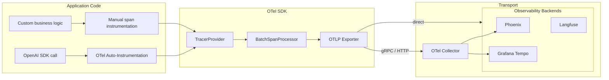

# 🔭 Welcome to OpenTelemetry for AI Engineers

You have 3 LLM services running in production. A user reports "the chat is slow today". You open the logs and see... 200 lines from 8 services, no obvious correlation. The LLM provider's dashboard says the call took 1.2s. Your agent logs say it took 18s. Phoenix shows a Phoenix span. LangSmith shows a LangSmith trace. **Each tool speaks its own dialect, and none of them correlate.** This is the world before OpenTelemetry.

OpenTelemetry (OTel) is the **CNCF standard** for distributed tracing, metrics, and logs. Born from merging OpenTracing and OpenCensus in 2019, today every major observability backend speaks OTLP (OpenTelemetry Line Protocol): Phoenix (Arize), Langfuse, LangSmith, Datadog, Honeycomb, Jaeger, Grafana Tempo, Dynatrace, New Relic, AWS X-Ray. **One instrumentation library, vendor-neutral export.** Switch backends without changing code. Add a new service to a trace without changing existing services.

For AI engineers, OTel is the **unifying layer** between the dozens of LLM SDKs (OpenAI, Anthropic, Cohere, HuggingFace, LiteLLM), agent frameworks (LangGraph, CrewAI, smolagents), vector stores (Qdrant, Pinecone, ChromaDB), and your application code. Every LLM call, every retrieval, every tool invocation, every agent step — **one trace, one vendor-neutral export, one query language**. The course teaches you to wire it into your portfolio.

This is the **operational depth** that the existing [[../31 - Evidently AI and Phoenix/03 - Phoenix by Arize - LLM Observability, Traces and Embedding Drift.md|Phoenix]] notes touch but never make first-class. Phoenix is one backend; OTel is the standard that makes Phoenix, Langfuse, Tempo, and Datadog interchangeable. Master OTel and you can move between them at will.

## 🎯 Learning Objectives

- Master OTel primitives: **spans, traces, context propagation** (W3C Trace Context).
- Apply **auto-instrumentation** for OpenAI, Anthropic, Cohere, HuggingFace, LiteLLM SDKs.
- Configure **OTLP exporters** to Phoenix, Tempo, Jaeger, and OTLP-compatible backends.
- Wire OTel into **LangGraph agents** with `thread_id` propagation.
- Trace **RAG pipelines** end-to-end: query → retrieval → rerank → generation → citation.
- Apply production patterns: **sampling, cost control, PII redaction**.
- Build a **multi-service RAG system** with full OTel coverage as the capstone.

## Course Map

| # | Note | Core concept | Closes gap |
|:-:|------|--------------|------------|
| 00 | [[00 - Welcome to OpenTelemetry for AI Engineers\|You are here]] | Why OTel is the unifying layer for AI observability | Course map |
| 01 | [[01 - OTel Primitives - Spans Traces and Context Propagation\|Primitives]] | Spans, traces, baggage, W3C Trace Context | Gap #1 |
| 02 | [[02 - Auto-Instrumentation for LLM SDKs\|Auto-Instrumentation]] | OpenAI, Anthropic, Cohere, HuggingFace, LiteLLM | Gap #2 |
| 03 | [[03 - OTLP Exporters - Phoenix Tempo Jaeger and Beyond\|Exporters]] | OTLP gRPC/HTTP, vendor selection, multi-backend | Gap #3 |
| 04 | [[04 - OTel for LangGraph and Agent Frameworks\|Agent Tracing]] | thread_id, agent loops, subgraph spans | Gap #4 |
| 05 | [[05 - OTel for RAG Pipelines - Retrieval and Generation\|RAG Tracing]] | End-to-end query-to-citation traces | Gap #5 |
| 06 | [[06 - Production Patterns - Sampling Costs and PII Redaction\|Production]] | Sampling strategies, cost control, PII redaction | Gap #6 |
| 07 | [[07 - Capstone - Multi-Service RAG with OpenTelemetry\|Capstone]] | Production OTel-wired RAG system | Integration |

## Why OpenTelemetry Is the 2026 Standard

Three forces converged to make OTel mandatory:

1. **LLM applications are inherently distributed.** Query → retrieval → reranking → LLM generation → post-processing → response. Each step may live in a different service (FastAPI, Qdrant, vLLM, LiteLLM gateway, post-processor). Without a standard tracing context, debugging is archaeology across log formats.

2. **Vendor lock-in is expensive.** Today you use Phoenix. Tomorrow your boss says "we're moving to Datadog" or "we're moving to Langfuse" or "we need a self-hosted option for compliance". **OTel-native code makes the switch a config change, not a rewrite.**

3. **The frameworks have already converged.** LangGraph, CrewAI, OpenAI Agents SDK, smolagents, LiteLLM, LlamaIndex, DSPy, Phoenix, Langfuse, LangSmith — **all of them emit OTel spans**. The framework war is over; OTel won.

## The OTel Architecture



The same instrumented code sends to any backend. Phoenix for AI-specific (spans, embeddings, evals). Tempo for general distributed tracing. Datadog if your company pays for it. The OTel Collector can fan out to multiple backends simultaneously.

## Prerequisites

- **Python 3.10+** with `pip install opentelemetry-api opentelemetry-sdk opentelemetry-exporter-otlp`.
- **Phoenix basics** ([[../31 - Evidently AI and Phoenix/00 - Welcome to Evidently AI and Phoenix.md|09/31/00]]) — one specific OTel-native backend.
- **LangGraph fundamentals** ([[../../07 - AI Agents y Agentic Systems/18 - LangGraph Deep Patterns/00 - Welcome to LangGraph Deep Patterns.md|07/18/00]]) — for note 04 on agent tracing.
- **Production RAG** ([[../../06 - Large Language Models/12 - Production RAG/00 - Welcome to Production RAG.md|06/12/00]]) — for note 05 on RAG tracing.

## How to Read This Course

1. **Notes 01-02** are foundational: primitives + auto-instrumentation. The 80% you need.
2. **Notes 03-05** are the practitioner surface: exporters, agent tracing, RAG tracing. The 20% that makes you expert.
3. **Notes 06-07** are production: sampling, cost, capstone integration.

## 📦 Compression Code

```python
# 📦 Welcome - OTel-instrumented LLM call in 10 lines

from openai import OpenAI
from opentelemetry import trace
from opentelemetry.sdk.trace import TracerProvider
from opentelemetry.sdk.trace.export import BatchSpanProcessor
from opentelemetry.exporter.otlp.proto.http.trace_exporter import OTLPSpanExporter

# 1. Set up OTel SDK
provider = TracerProvider()
processor = BatchSpanProcessor(OTLPSpanExporter(endpoint="http://localhost:6006/v1/traces"))
provider.add_span_processor(processor)
trace.set_tracer_provider(provider)

# 2. Auto-instrument the OpenAI SDK
from opentelemetry.instrumentation.openai import OpenAIInstrumentor
OpenAIInstrumentor().instrument()

# 3. Call OpenAI — every API call now emits OTel spans automatically
tracer = trace.get_tracer(__name__)
with tracer.start_as_current_span("user_query") as span:
    span.set_attribute("user_id", "u-42")
    span.set_attribute("query_length", 24)

    client = OpenAI()
    response = client.chat.completions.create(
        model="gpt-4o-mini",
        messages=[{"role": "user", "content": "What is OpenTelemetry?"}],
    )

    span.set_attribute("response_tokens", response.usage.total_tokens)
    print(response.choices[0].message.content)
```

That's it. Every API call to OpenAI is now traced. **Spans flow to Phoenix (or whichever OTLP endpoint you configure).** Same pattern works for Anthropic, Cohere, HuggingFace, and any framework that supports OTel auto-instrumentation.

## References

- [[../31 - Evidently AI and Phoenix/03 - Phoenix by Arize - LLM Observability, Traces and Embedding Drift.md|Phoenix]] — the most-used OTel-native AI observability backend.
- [[../21 - Monitoreo y Mantenimiento/02 - Monitoreo de Modelos en Produccion.md|Model Monitoring]] — Spanish-language monitoring foundations.
- [[../../06 - Large Language Models/19 - LLM Gateway Patterns and LiteLLM/04 - Observability, Cost Tracking and Rate Limiting.md|LiteLLM Observability]] — OTel integration via `success_callback`.
- OTel docs: https://opentelemetry.io/docs/
- CNCF OTel: https://landscape.cncf.io/card-mode?project=opentelemetry