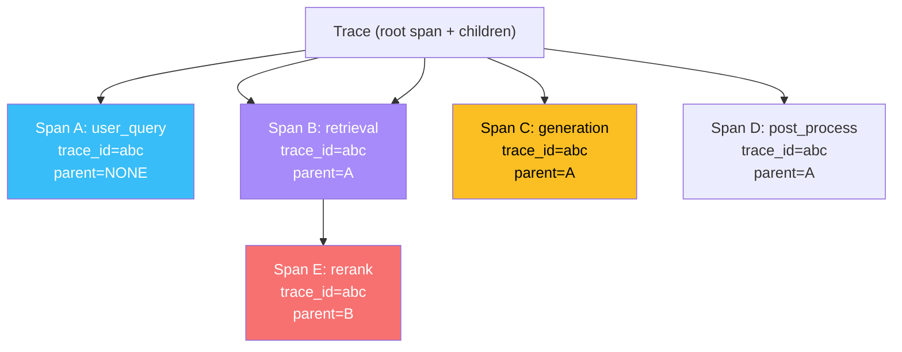
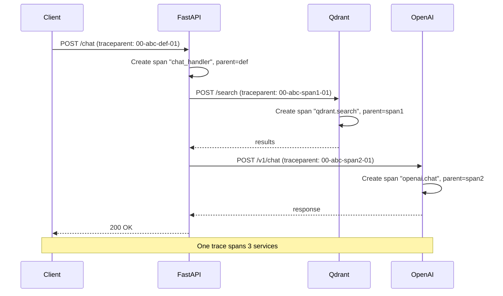

# 🧱 OTel Primitives — Spans, Traces, and Context Propagation

OpenTelemetry has three primitive types: **spans** (units of work), **traces** (directed acyclic graphs of spans), and **context** (metadata that propagates across service boundaries). Master these three and you can instrument any system — LLM calls, agent loops, RAG pipelines, vector retrievals — in a way that any OTel backend can visualize, query, and alert on. The vocabulary is small but precise; getting it right is the difference between traces that answer questions and traces that lie.

This note covers the data model (what spans actually are), the propagation story (how context crosses processes, threads, and async boundaries), and the W3C Trace Context standard that makes vendor neutrality possible. By the end you will be able to read any OTel-instrumented code and predict the trace it produces.

## 🎯 Learning Objectives

- Define the OTel data model: spans, traces, attributes, events, links, status.
- Apply the W3C Trace Context standard (`traceparent`, `tracestate`) for cross-service propagation.
- Use OpenTelemetry's Python API to create manual spans with semantic attributes.
- Propagate context across threads, async tasks, and HTTP requests.
- Distinguish between **baggage** (business context) and **trace context** (technical IDs).
- Avoid the four most common OTel instrumentation mistakes.

## 1. The Data Model



### Trace

A **trace** is a directed acyclic graph (DAG) of spans that share a `trace_id` (16-byte random identifier). A trace represents a single end-to-end request — from "user asked a question" to "answer was delivered". Every span in a trace has the same `trace_id`.

```python
trace_id = "0af7651916cd43dd8448eb211c80319c"  # 32 hex chars = 16 bytes
```

### Span

A **span** is a unit of work with a start time, end time, name, and metadata. Each span has:

| Field | Description |
|-------|-------------|
| `name` | Operation name (e.g., `"openai.chat"`, `"qdrant.search"`) |
| `trace_id` | Identifies the trace |
| `span_id` | Identifies the span (8-byte) |
| `parent_span_id` | Identifies the parent (None for root span) |
| `start_time` / `end_time` | Nanosecond-precision timestamps |
| `attributes` | Key-value metadata (e.g., `model="gpt-4o-mini"`, `tokens=150`) |
| `events` | Time-stamped log entries within the span |
| `links` | References to spans in other traces (for async/cross-trace relationships) |
| `status` | `OK`, `ERROR`, or `UNSET` |

```python
from opentelemetry import trace

tracer = trace.get_tracer(__name__)

with tracer.start_as_current_span("retrieve_documents") as span:
    span.set_attribute("collection", "research_papers")
    span.set_attribute("top_k", 10)
    span.set_attribute("query_length", 24)

    # Add an event (timestamped log)
    span.add_event("started_search", {"query_id": "q-42"})

    results = vector_db.search(...)

    span.set_attribute("results_returned", len(results))
    span.set_attribute("latency_ms", 12)
```

### Attributes

**Attributes** are key-value pairs attached to a span. The OTel spec defines semantic conventions (`http.method`, `db.system`, `gen_ai.model`) that backends understand natively. Always use the semantic conventions when available — backends have built-in dashboards for them.

```python
# ✅ Use semantic conventions
span.set_attribute("gen_ai.system", "openai")
span.set_attribute("gen_ai.request.model", "gpt-4o-mini")
span.set_attribute("gen_ai.usage.input_tokens", 24)
span.set_attribute("gen_ai.usage.output_tokens", 156)

# ❌ Don't invent your own when a convention exists
span.set_attribute("openai_model", "gpt-4o-mini")  # not idiomatic
```

### Events

**Events** are time-stamped log entries attached to a span. Use them for notable moments within a span:

```python
with tracer.start_as_current_span("llm_call") as span:
    span.add_event("rate_limit_warning", {"retry_in_seconds": 30})
    span.add_event("retry_attempt_2")
    response = client.chat.completions.create(...)
```

### Links

**Links** connect a span to other traces. The classic case: an async batch operation that processes items from a queue — each item's processing trace links back to the queue-consumption trace.

```python
from opentelemetry.trace import Link

# The current span links to a parent in another trace
ctx = trace.set_span_in_context(span, links=[Link(trace.SpanContext(...))])
```

### Status

Every span has a status: `OK`, `ERROR`, or `UNSET`. Set it explicitly when something fails:

```python
from opentelemetry.trace import Status, StatusCode

try:
    response = client.chat.completions.create(...)
except Exception as e:
    span.set_status(Status(StatusCode.ERROR, str(e)))
    span.record_exception(e)
    raise
```

`span.record_exception(e)` captures the full traceback as a span event — invaluable for debugging.

## 2. W3C Trace Context

The **W3C Trace Context** standard defines two HTTP headers that propagate context across service boundaries:

- `traceparent`: `00-<trace_id>-<parent_span_id>-<flags>` (55 chars)
- `tracestate`: vendor-specific extension data

```http
traceparent: 00-0af7651916cd43dd8448eb211c80319c-b7ad6b7169203331-01
```

When a service receives a request with `traceparent`, it extracts the `trace_id` and creates a new span whose `parent_span_id` matches the sender's `span_id`. **The trace continues across services.**



Without `traceparent`, every service creates an unrelated trace — debugging becomes impossible.

### Propagation in Python

```python
from opentelemetry.propagate import inject, extract

# Outgoing HTTP request: inject context into headers
headers = {}
inject(headers)
response = httpx.post("http://qdrant:6333/search", headers=headers, json=payload)

# Incoming HTTP request: extract context from headers
context = extract(request.headers)
with tracer.start_as_current_span("qdrant_search", context=context):
    ...
```

FastAPI middleware, the `requests` library, `httpx`, `aiohttp`, and `grpc` all support auto-instrumentation that injects/extracts trace context automatically. **You don't usually write `inject` / `extract` by hand** — the OTel contrib libraries do it for you.

## 3. Context Propagation Across Threads and Async

### Threads

```python
from opentelemetry.context import attach, detach
from concurrent.futures import ThreadPoolExecutor

with tracer.start_as_current_span("parent") as parent_span:
    ctx = trace.set_span_in_context(parent_span)
    token = attach(ctx)

    try:
        # Run work in a thread — context is propagated
        with ThreadPoolExecutor() as executor:
            future = executor.submit(some_blocking_work)
            result = future.result()
    finally:
        detach(token)
```

### Async

```python
# asyncio context is propagated automatically by opentelemetry-instrumentation-asyncio
import asyncio

async def async_work():
    with tracer.start_as_current_span("async_op"):
        await asyncio.sleep(0.1)  # context preserved
        result = await client.post(...)  # context propagated
```

## 4. Baggage: Business Context

**Trace context** is technical (`trace_id`, `span_id`). **Baggage** is business context (`user_id`, `tenant_id`, `experiment_id`) that travels with the trace and is accessible in any downstream service:

```python
from opentelemetry import baggage

# Set baggage
ctx = baggage.set_baggage("user_id", "u-42")
ctx = baggage.set_baggage("tenant_id", "acme", context=ctx)
token = attach(ctx)

try:
    # ... do work ...
    # Downstream service can read it
finally:
    detach(token)

# Read baggage from context
user_id = baggage.get_baggage("user_id")
```

Baggage propagates as the `baggage` HTTP header (separate from `traceparent`). Downstream services can extract it without a database lookup. **Use it for tenant_id, experiment_id, request_source — anything you want every span to know.**

> ⚠️ **Advertencia:** Baggage is **public** in the sense that any service with access to the trace context can read it. **Never put secrets, PII, or sensitive business data in baggage.** Use it for non-sensitive IDs.

## 5. Span Lifecycle

```python
from opentelemetry import trace
from opentelemetry.trace import Status, StatusCode

tracer = trace.get_tracer(__name__)

# Best practice: use context managers
def my_function():
    with tracer.start_as_current_span("my_function") as span:
        try:
            span.set_attribute("arg", "value")
            result = do_work()
            span.set_attribute("result_size", len(result))
            return result
        except Exception as e:
            span.set_status(Status(StatusCode.ERROR, "do_work failed"))
            span.record_exception(e)
            raise

# Manual control (for async or unusual flows)
span = tracer.start_span("my_function")
try:
    ...
    span.set_status(Status(StatusCode.OK))
finally:
    span.end()
```

The context manager is the right default. Manual `start/end` is for cases where the span must span async boundaries or the function returns before the work completes.

## 6. ❌/✅ Antipatterns

### ❌ Span per LLM token

```python
# ⚠️ 1000+ spans per LLM call — overwhelms backends
for token in response.iter_tokens():
    with tracer.start_as_current_span("token") as span:
        ...
```

### ✅ One span per LLM call

```python
with tracer.start_as_current_span("openai_chat") as span:
    response = client.chat.completions.create(...)
```

### ❌ Missing semantic conventions

```python
# ⚠️ Backends can't group by model — Phoenix dashboard is broken
span.set_attribute("model", "gpt-4o-mini")
span.set_attribute("tokens_input", 24)
```

### ✅ Use semantic conventions

```python
# ✅ Phoenix dashboards group by gen_ai.request.model natively
span.set_attribute("gen_ai.system", "openai")
span.set_attribute("gen_ai.request.model", "gpt-4o-mini")
span.set_attribute("gen_ai.usage.input_tokens", 24)
span.set_attribute("gen_ai.usage.output_tokens", 156)
```

### ❌ Spans without context

```python
# ⚠️ New trace per call — debugging across services is impossible
def background_task():
    tracer.start_as_current_span("background")  # no parent
```

### ✅ Capture parent context

```python
ctx = copy_context()  # copy current context
executor.submit(run_in_background, ctx)

def run_in_background(ctx):
    token = attach(ctx)
    try:
        with tracer.start_as_current_span("background"):
            ...
    finally:
        detach(token)
```

### ❌ Sensitive data in span attributes

```python
# ⚠️ Visible in trace UI, persists in storage
span.set_attribute("user.email", "alice@example.com")
span.set_attribute("user.credit_card", "1234-5678-9012")
```

### ✅ Filter or hash sensitive attributes

```python
# ✅ Trace shows the user, not the PII
span.set_attribute("user.id", hash_user_id("alice@example.com"))  # "u_a1b2c3"
# Or: don't capture at all
```

## 7. Production Reality

**Caso real — Multi-Agent Research System:** Before OTel, debugging "why is this trace slow?" required grepping logs from 4 services. After OTel with Phoenix, the entire trace renders as a tree: `chat_handler → retrieval → qdrant.search → rerank → generation → post_process`. Latency for each span is visible; the slow one (rerank, 4.2s of 18s total) is obvious. Phoenix's LLM-specific span attributes (`gen_ai.usage.total_tokens`) enable cost-per-trace analytics directly.

**Caso real — LLM Edge Gateway:** Litellm's `success_callback: ["otel"]` exports every LLM call as OTel spans. The Go/Fiber gateway's OTel auto-instrumentation exports its own HTTP spans. **Same trace_id across both** because the gateway forwards the `traceparent` header. One trace per user request, 4 services, 12 spans — all queryable in Phoenix.

## 📦 Compression Code

```python
# 📦 Compression: OTel primitives in 60 lines

from opentelemetry import trace, baggage
from opentelemetry.context import attach, detach
from opentelemetry.trace import Status, StatusCode
from opentelemetry.propagate import inject, extract

tracer = trace.get_tracer(__name__)

def manual_span_demo():
    """Manual span with attributes, events, status."""
    with tracer.start_as_current_span("llm_call") as span:
        span.set_attribute("gen_ai.system", "openai")
        span.set_attribute("gen_ai.request.model", "gpt-4o-mini")
        span.set_attribute("user_id", "u-42")

        # Add baggage for downstream services
        ctx = baggage.set_baggage("tenant_id", "acme")
        token = attach(ctx)
        try:
            span.add_event("started_request")

            # Simulate work
            response = {"tokens": 150, "content": "Hello"}

            span.set_attribute("gen_ai.usage.total_tokens", response["tokens"])
            span.set_status(Status(StatusCode.OK))
            return response["content"]
        except Exception as e:
            span.record_exception(e)
            span.set_status(Status(StatusCode.ERROR, str(e)))
            raise
        finally:
            detach(token)

def cross_service_demo():
    """Inject/extract trace context across HTTP boundary."""
    # Outgoing request: inject
    headers = {}
    inject(headers)
    # headers now has {"traceparent": "00-abc-def-01"}
    # response = httpx.post("http://other-service", headers=headers)

    # Incoming request: extract
    incoming_headers = {"traceparent": "00-abc-def-01"}
    ctx = extract(incoming_headers)
    with tracer.start_as_current_span("downstream_handler", context=ctx) as span:
        # This span is now part of the trace that originated elsewhere
        span.set_attribute("processed_by", "downstream")
```

## 🎯 Key Takeaways

1. **Spans are units of work, traces are DAGs of spans, context is the thread that ties them together.**
2. **W3C Trace Context** (`traceparent` header) is the standard that makes cross-service propagation vendor-neutral.
3. **Always use semantic conventions** — backends have dashboards for them.
4. **One span per logical operation** (LLM call, retrieval, etc.) — not per token, not per byte.
5. **Baggage is for business context** (user_id, tenant_id, experiment_id) — never secrets or PII.
6. **Set status explicitly on errors** + `record_exception` for tracebacks.
7. **Manual `start_as_current_span`** is rare; auto-instrumentation handles 95% of cases.

## References

- [[00 - Welcome to OpenTelemetry for AI Engineers|Welcome]] — course map.
- [[02 - Auto-Instrumentation for LLM SDKs|Auto-Instrumentation]] — the 80% use case.
- [[03 - OTLP Exporters|Exporters]] — what to do with the spans.
- [[04 - OTel for LangGraph and Agent Frameworks|Agent Tracing]] — context propagation across nodes.
- OTel Python docs: https://opentelemetry.io/docs/languages/python/
- W3C Trace Context: https://www.w3.org/TR/trace-context/
- Semantic Conventions: https://opentelemetry.io/docs/specs/semconv/