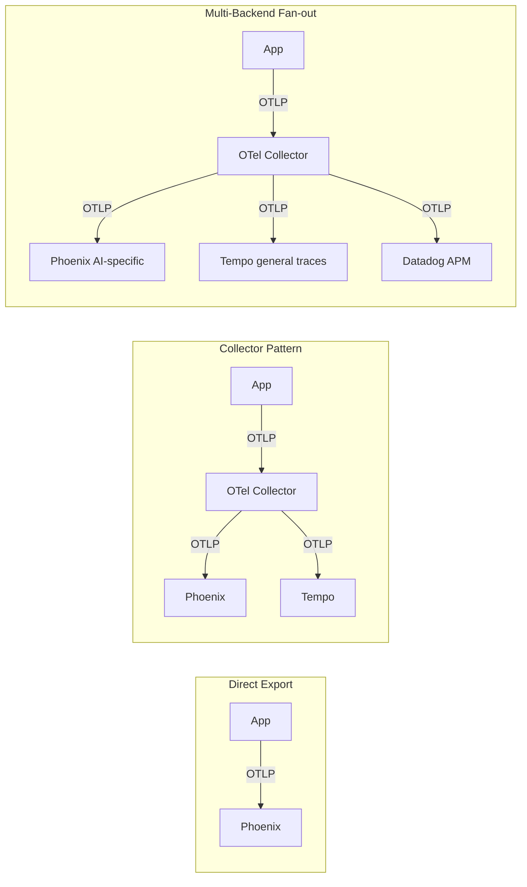
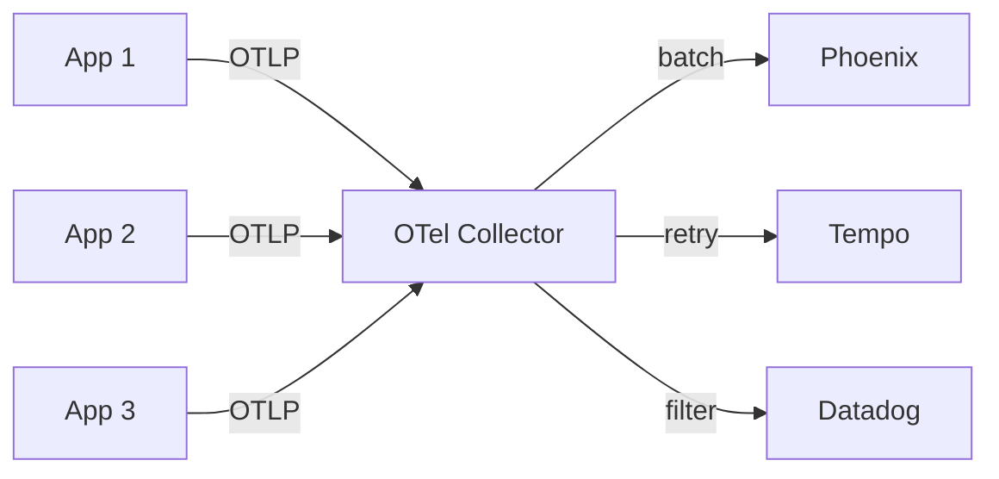

# 📤 OTLP Exporters — Phoenix, Tempo, Jaeger, and Multi-Backend Fan-out

Spans are emitted in-process; they don't help unless they reach a backend where you can query them. The **OTLP (OpenTelemetry Line Protocol)** is the wire format every OTel SDK speaks, and dozens of backends accept it: Phoenix (Arize), Grafana Tempo, Jaeger, Datadog, Honeycomb, AWS X-Ray, New Relic, Langfuse. **One instrumentation library, any backend.** The exporter is just configuration.

This note covers three patterns: (1) **direct OTLP export** to a single backend, (2) the **OTel Collector** as a middleman that buffers, retries, and fans out, and (3) **multi-backend fan-out** for teams that need Phoenix for AI-specific queries and Tempo for general distributed tracing. By the end you can move between backends with a config change.

## 🎯 Learning Objectives

- Configure OTLP exporters for HTTP and gRPC transports.
- Deploy an OTel Collector as a production buffer/retry layer.
- Fan out to multiple backends (Phoenix + Tempo + Datadog simultaneously).
- Pick between **direct export**, **Collector**, and **agent** patterns.
- Apply production exporter configuration: batching, retries, TLS.
- Avoid the four most common OTLP exporter pitfalls.

## 1. The Three Export Patterns



| Pattern | When to use |
|---------|-------------|
| **Direct OTLP** | Single backend, simple setup, dev environments |
| **Collector** | Production: buffer, retry, batch, multi-export, sampling |
| **Fan-out** | Multiple teams / backends; AI-specific + general traces |

## 2. Direct OTLP Export

```python
from opentelemetry.exporter.otlp.proto.http.trace_exporter import OTLPSpanExporter
from opentelemetry.exporter.otlp.proto.grpc.trace_exporter import OTLPSpanExporter as GRPCExporter

# HTTP transport (simpler, works through most proxies)
http_exporter = OTLPSpanExporter(
    endpoint="http://localhost:6006/v1/traces",  # Phoenix default
    headers={"authorization": "Bearer ..."},
    timeout=30,
)

# gRPC transport (more efficient, binary protocol)
grpc_exporter = GRPCExporter(
    endpoint="http://localhost:4317",  # OTLP gRPC default port
    headers={"authorization": "Bearer ..."},
    timeout=30,
)

provider.add_span_processor(BatchSpanProcessor(http_exporter))
```

The HTTP exporter uses JSON over HTTP/1.1. The gRPC exporter uses Protocol Buffers over HTTP/2. **gRPC is faster** (lower CPU, smaller payloads) but requires HTTP/2 support in your infrastructure.

### Standard OTLP Endpoints

| Backend | HTTP endpoint | gRPC endpoint |
|---------|---------------|---------------|
| Phoenix (default) | `http://localhost:6006/v1/traces` | `http://localhost:4317` |
| Grafana Tempo | `http://tempo:4318/v1/traces` | `http://tempo:4317` |
| Jaeger | `http://jaeger:4318/v1/traces` | `http://jaeger:4317` |
| Datadog | (use Agent) | (use Agent) |
| Langfuse | `https://cloud.langfuse.com/api/public/otel/v1/traces` | — |
| Honeycomb | `https://api.honeycomb.io/v1/traces` | — |

## 3. Production: The OTel Collector

For production, **never have apps talk directly to backends**. The OTel Collector is the production pattern:



The Collector:
- **Buffers** spans in memory (avoids app backpressure when backend is slow).
- **Retries** failed exports (with exponential backoff).
- **Batches** spans into larger payloads (efficiency).
- **Filters** PII before sending (data redaction at the edge).
- **Fans out** to multiple backends simultaneously.
- **Samples** high-volume traces (tail-based sampling).

### Collector Configuration

```yaml
# otel-collector-config.yaml
receivers:
  otlp:
    protocols:
      grpc:
        endpoint: 0.0.0.0:4317
      http:
        endpoint: 0.0.0.0:4318

processors:
  batch:
    timeout: 5s
    send_batch_size: 1024
    send_batch_max_size: 2048

  memory_limiter:
    check_interval: 1s
    limit_percentage: 80
    spike_limit_percentage: 20

  # Tail-based sampling — keep traces with errors, sample 10% of successful traces
  tail_sampling:
    decision_wait: 10s
    num_traces: 50000
    expected_new_traces_per_sec: 100
    policies:
      - name: errors
        type: status_code
        status_code: {status_codes: [ERROR]}
      - name: latency
        type: latency
        latency: {threshold_ms: 2000}
      - name: sample-success
        type: probabilistic
        probabilistic: {sampling_percentage: 10}

  # Filter PII before export
  attributes/remove_pii:
    actions:
      - key: user.email
        action: delete
      - key: user.credit_card
        action: delete
      - key: gen_ai.prompt
        action: hash

exporters:
  otlp/phoenix:
    endpoint: phoenix:4317
    tls:
      insecure: false
      cert_file: /etc/certs/phoenix.crt
  otlp/tempo:
    endpoint: tempo:4317
  otlp/datadog:
    endpoint: https://trace.agent.datadoghq.com
    headers:
      DD-API-KEY: ${DD_API_KEY}

service:
  pipelines:
    traces:
      receivers: [otlp]
      processors: [memory_limiter, tail_sampling, attributes/remove_pii, batch]
      exporters: [otlp/phoenix, otlp/tempo, otlp/datadog]
```

### Running the Collector

```yaml
# docker-compose.yml
services:
  otel-collector:
    image: otel/opentelemetry-collector-contrib:0.110.0
    command: ["--config=/etc/otelcol/config.yaml"]
    volumes:
      - ./otel-collector-config.yaml:/etc/otelcol/config.yaml:ro
      - ./certs:/etc/certs:ro
    ports:
      - "4317:4317"   # gRPC
      - "4318:4318"   # HTTP
    environment:
      - DD_API_KEY=${DD_API_KEY}
    depends_on:
      - phoenix
      - tempo
```

## 4. App Configuration: Send to the Collector

```python
# All apps send to the Collector — never directly to backends
OTLP_ENDPOINT = os.environ.get("OTEL_EXPORTER_OTLP_ENDPOINT", "http://otel-collector:4317")

provider.add_span_processor(
    BatchSpanProcessor(
        OTLPSpanExporter(endpoint=OTLP_ENDPOINT),  # gRPC to collector
    )
)
```

The app config is **the same regardless of which backends the Collector fans out to**. Switch backends by editing `otel-collector-config.yaml`, not app code.

## 5. Phoenix (Self-Hosted)

```bash
docker run -d \
  --name phoenix \
  -p 6006:6006 \
  -p 4317:4317 \
  -e PHOENIX_SQL_DATABASE_URL=postgresql://user:pass@db:5432/phoenix \
  arizephoenix/phoenix:latest
```

Phoenix accepts OTLP on port `4317` (gRPC) or `6006/v1/traces` (HTTP). The UI is at `http://localhost:6006`.

### Phoenix Cloud

```python
OTLP_ENDPOINT = "https://app.phoenix.arize.com/v1/traces"
headers = {
    "api_key": os.environ["PHOENIX_API_KEY"],
    "authorization": f"Bearer {os.environ['PHOENIX_API_KEY']}",
}
provider.add_span_processor(BatchSpanProcessor(OTLPSpanExporter(
    endpoint=OTLP_ENDPOINT, headers=headers,
)))
```

## 6. Grafana Tempo

```bash
docker run -d \
  --name tempo \
  -p 4317:4317 \
  -p 3200:3200 \
  -v ./tempo.yaml:/etc/tempo.yaml \
  grafana/tempo:latest --config.file=/etc/tempo.yaml
```

```yaml
# tempo.yaml
server:
  http_listen_port: 3200
distributor:
  receivers:
    otlp:
      protocols:
        grpc:
          endpoint: 0.0.0.0:4317
        http:
          endpoint: 0.0.0.0:4318
storage:
  trace:
    backend: local
    local:
      path: /var/tempo/blocks
    wal:
      path: /var/tempo/wal
```

Tempo pairs with Grafana for queries. OpenTelemetry traces → Tempo → Grafana dashboards.

## 7. Jaeger

```bash
docker run -d \
  --name jaeger \
  -p 16686:16686 \  # UI
  -p 4317:4317 \     # OTLP gRPC
  jaegertracing/all-in-one:latest
```

Jaeger is the older CNCF tracing project; OTel is its successor. Jaeger accepts OTLP via the all-in-one image; production Jaeger uses Elasticsearch or Kafka backends.

## 8. Langfuse

```python
# Langfuse Cloud (default)
OTLP_ENDPOINT = "https://cloud.langfuse.com/api/public/otel/v1/traces"
headers = {
    "authorization": f"Basic {base64(f'{pk}:{sk}')}",  # public + secret key
}
provider.add_span_processor(BatchSpanProcessor(OTLPSpanExporter(
    endpoint=OTLP_ENDPOINT, headers=headers,
)))
```

Langfuse specializes in LLM-specific observability (similar to Phoenix) and is popular in EU.

## 9. Datadog (via Agent)

```yaml
# datadog-agent.yaml
otlp_config:
  receiver:
    protocols:
      grpc:
        endpoint: 0.0.0.0:4317
```

Datadog Agent runs on every host, receives OTLP, forwards to Datadog. No direct Datadog API call from apps.

## 10. ❌/✅ Antipatterns

### ❌ Direct OTLP to multiple backends from the app

```python
# ⚠️ App is coupled to backend availability
provider.add_span_processor(BatchSpanProcessor(OTLPSpanExporter(endpoint="phoenix:4317")))
provider.add_span_processor(BatchSpanProcessor(OTLPSpanExporter(endpoint="tempo:4317")))
```

### ✅ Send to Collector, Collector fans out

```python
# ✅ App is backend-agnostic
provider.add_span_processor(BatchSpanProcessor(OTLPSpanExporter(endpoint="collector:4317")))
# Collector handles fan-out
```

### ❌ No batching

```python
# ⚠️ Every span = 1 HTTP request → slow, expensive
provider.add_span_processor(SimpleSpanProcessor(OTLPSpanExporter(...)))
```

### ✅ Batch by default

```python
# ✅ Batched: efficient, fewer HTTP requests
provider.add_span_processor(BatchSpanProcessor(
    OTLPSpanExporter(...),
    max_queue_size=2048,
    max_export_batch_size=512,
    schedule_delay_millis=5000,
))
```

### ❌ No retries

```python
# ⚠️ Spans lost on transient network error
provider.add_span_processor(BatchSpanProcessor(OTLPSpanExporter(...)))
```

### ✅ Let the Collector handle retries

```yaml
# otel-collector-config.yaml
exporters:
  otlp/phoenix:
    endpoint: phoenix:4317
    retry_on_failure: true
    sending_queue:
      enabled: true
      num_consumers: 10
      queue_size: 1000
```

### ❌ Mixing HTTP and gRPC exporters

```python
# ⚠️ Different protocols = different observability
http_exporter = OTLPSpanExporter(endpoint="http://phoenix:4318/v1/traces")
grpc_exporter = OTLPSpanExporter(endpoint="http://tempo:4317")
```

### ✅ Pick one transport

```python
# ✅ Use gRPC everywhere (more efficient, OTLP standard)
grpc_exporter = OTLPSpanExporter(endpoint="http://collector:4317")
```

## 11. Production Reality

**Caso real — Production RAG Project:** The OTLP Collector is a sidecar in Docker Compose. Apps send to `http://collector:4317`. The Collector fans out to Phoenix (for AI-specific queries: token counts, embedding drift, LLM-as-Judge evals) and Tempo (for general HTTP spans, infrastructure context). When the team decides to add Datadog next quarter, it's a Collector config change — zero app changes.

**Caso real — Multi-Agent Research System:** Phoenix Cloud hosts the traces (no self-host). Apps send to `https://app.phoenix.arize.com/v1/traces` with API key in headers. The Phoenix Cloud dashboard shows the agent trace tree, token costs per request, and embedding drift over time. No Collector needed for the simple case.

## 📦 Compression Code

```python
# 📦 Compression: OTLP setup with Collector in 30 lines

import os
from opentelemetry import trace
from opentelemetry.sdk.trace import TracerProvider, BatchSpanProcessor
from opentelemetry.sdk.resources import Resource
from opentelemetry.exporter.otlp.proto.grpc.trace_exporter import OTLPSpanExporter

provider = TracerProvider(
    resource=Resource.create({
        "service.name": os.environ.get("SERVICE_NAME", "ai-service"),
        "service.version": os.environ.get("SERVICE_VERSION", "1.0.0"),
    })
)

# Always send to the Collector (or direct backend in dev)
provider.add_span_processor(
    BatchSpanProcessor(
        OTLPSpanExporter(
            endpoint=os.environ.get(
                "OTEL_EXPORTER_OTLP_ENDPOINT",
                "http://otel-collector:4317",  # Collector default
            ),
            headers=os.environ.get("OTEL_EXPORTER_OTLP_HEADERS", "").split(",") or None,
        ),
        max_queue_size=2048,
        max_export_batch_size=512,
    )
)
trace.set_tracer_provider(provider)
```

## 🎯 Key Takeaways

1. **OTLP is the wire format** — every backend speaks it. Pick a backend, configure endpoint.
2. **Collector is the production pattern** — apps send to it; it buffers, retries, fans out.
3. **Backend choice is reversible** — switch from Phoenix to Tempo by changing Collector config.
4. **Fan-out to multiple backends** — Phoenix for AI queries, Tempo for general traces, Datadog for APM.
5. **BatchSpanProcessor by default** — SimpleSpanProcessor loses spans on shutdown.
6. **gRPC transport preferred** — faster, smaller payloads, OTLP standard.
7. **PII redaction at the Collector** — filter spans before they reach backends.

## References

- [[00 - Welcome to OpenTelemetry for AI Engineers|Welcome]] — course map.
- [[01 - OTel Primitives|Spans, traces, context]] — what gets exported.
- [[04 - OTel for LangGraph|Agent Tracing]] — span propagation in agent loops.
- [[../31 - Evidently AI and Phoenix/00 - Welcome to Evidently AI and Phoenix.md|Phoenix]] — the AI-specific OTel backend.
- OTel Collector: https://opentelemetry.io/docs/collector/
- OTLP spec: https://opentelemetry.io/docs/specs/otlp/