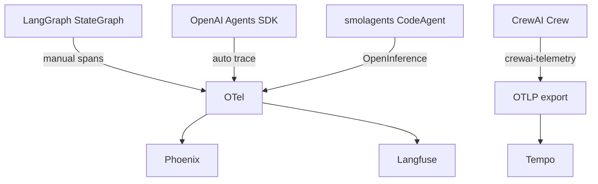
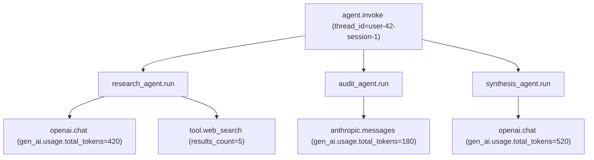

# 🤖 OTel for LangGraph and Agent Frameworks

LangGraph's `StateGraph` (covered in [[../../07 - AI Agents y Agentic Systems/18 - LangGraph Deep Patterns/00 - Welcome to LangGraph Deep Patterns.md|07/18]]) is a graph of nodes and edges where each invocation can produce a trace with 5, 50, or 500 spans depending on the workflow. Without OpenTelemetry instrumentation, debugging a slow agent invocation means stitching together `print()` statements from each node. With OTel, every node becomes a span, every conditional edge becomes a branch in the trace tree, and `thread_id` propagation preserves the conversation context across nodes (and across services).

This note covers the integration of OTel with three agent frameworks your vault uses: **LangGraph** (the StateGraph primitive), **CrewAI** (the role-based multi-agent framework), and **smolagents** (HuggingFace's minimal code-as-action loop). Each needs a slightly different instrumentation pattern because each has a different control flow model. By the end you will be able to trace any of these agents and capture the full execution tree.

## 🎯 Learning Objectives

- Instrument **LangGraph** nodes with manual OTel spans.
- Propagate `thread_id` from LangGraph state into OTel baggage.
- Trace **CrewAI** crews with the built-in `crewai-telemetry` exporter.
- Wire **smolagents** with OpenInference auto-instrumentation.
- Trace **OpenAI Agents SDK** with OTel export to a self-hosted backend.
- Distinguish between **per-node spans** and **per-invocation spans**.
- Avoid the four most common agent-tracing pitfalls.

## 1. The Agent Tracing Landscape



| Framework | Built-in tracing | OTel export |
|-----------|-------------------|-------------|
| **LangGraph** | LangSmith | Manual OTel spans per node |
| **CrewAI** | `crewai-telemetry` | Direct OTLP export |
| **OpenAI Agents SDK** | First-class trace | OTel export (manual or `OpenAIAgentsTracingProcessor`) |
| **smolagents** | None | OpenInference → OTel |
| **DSPy** | None | Manual OTel spans |

## 2. LangGraph: Manual Spans Per Node

LangGraph doesn't ship OTel auto-instrumentation. You add manual spans to each node:

```python
# LangGraph with OTel instrumentation
from opentelemetry import trace
from langgraph.graph import StateGraph, START, END

tracer = trace.get_tracer(__name__)

class State(TypedDict):
    query: str
    findings: list[str]
    draft: str

def research_node(state: State) -> dict:
    with tracer.start_as_current_span("research_node") as span:
        span.set_attribute("langgraph.node", "research")
        span.set_attribute("query", state["query"][:100])

        # Baggage for downstream services
        from opentelemetry import baggage
        from opentelemetry.context import attach
        ctx = baggage.set_baggage("thread_id", state.get("thread_id", ""))
        token = attach(ctx)
        try:
            findings = tavily_search(state["query"])
            span.set_attribute("findings_count", len(findings))
            return {"findings": findings}
        finally:
            from opentelemetry.context import detach
            detach(token)

def audit_node(state: State) -> dict:
    with tracer.start_as_current_span("audit_node") as span:
        span.set_attribute("langgraph.node", "audit")
        score = validate(state["findings"])
        span.set_attribute("confidence", score)
        return {"confidence": score}

# Build the graph
graph = StateGraph(State)
graph.add_node("research", research_node)
graph.add_node("audit", audit_node)
graph.add_edge(START, "research")
graph.add_edge("research", "audit")
graph.add_edge("audit", END)

app = graph.compile(checkpointer=MemorySaver())

# === Invoke with thread_id ===
config = {"configurable": {"thread_id": "user-42-session-1"}}
with tracer.start_as_current_span("langgraph.invoke") as span:
    span.set_attribute("langgraph.thread_id", config["configurable"]["thread_id"])
    result = app.invoke({"query": "LangGraph OTel"}, config)
```

The result: a **parent span** `langgraph.invoke` with two **child spans** `research_node` and `audit_node`, all carrying the `thread_id` as both a span attribute and baggage.

### Custom SpanKind for Human-in-the-Loop

The [[../../07 - AI Agents y Agentic Systems/18 - LangGraph Deep Patterns/05 - Human-in-the-Loop with interrupt() and Command.md|07/18/05]] note showed `interrupt()`. Wrap it with a span to make the pause visible in the trace:

```python
from opentelemetry.trace import Status, StatusCode

def human_approval_node(state: State) -> dict:
    with tracer.start_as_current_span("human_approval") as span:
        span.set_attribute("approval.required", True)
        span.set_attribute("approval.options", ["approve", "reject"])

        response = interrupt({
            "question": "Approve this draft?",
            "draft": state["draft"],
        })

        approved = response.get("choice") == "approve"
        span.set_attribute("approval.outcome", "approved" if approved else "rejected")

        if not approved:
            span.set_status(Status(StatusCode.ERROR, "rejected by human"))
        return {"approved": approved}
```

When the human resumes via `Command(resume=...)`, the same span continues — the trace shows the pause explicitly.

## 3. CrewAI: Built-in `crewai-telemetry`

CrewAI ships with `crewai-telemetry` for first-class tracing:

```bash
pip install crewai[otel]
```

```python
import os
from crewai import Crew, Agent, Task

# Configure OTel export endpoint for CrewAI
os.environ["OTEL_EXPORTER_OTLP_ENDPOINT"] = "http://otel-collector:4317"

crew = Crew(
    agents=[researcher_agent, writer_agent, critic_agent],
    tasks=[research_task, write_task, critique_task],
    verbose=True,
)

result = crew.kickoff(inputs={"topic": "OpenTelemetry for LLMs"})
# Every agent execution, task, and tool call is traced automatically.
# Spans: crewai.crew.kickoff → crewai.task.execute → crewai.agent.execute → crewai.tool
```

### Custom Spans in CrewAI

If you write custom tools, add spans to them:

```python
from crewai.tools import tool
from opentelemetry import trace

tracer = trace.get_tracer(__name__)

@tool("Custom Search")
def search(query: str) -> str:
    """Search the web for the given query."""
    with tracer.start_as_current_span("custom_search") as span:
        span.set_attribute("query", query)
        results = tavily.search(query)
        span.set_attribute("results_count", len(results))
        return "\n".join([r["content"] for r in results])
```

## 4. OpenAI Agents SDK: First-Class Tracing

The OpenAI Agents SDK ships with **automatic tracing** to OpenAI's platform and supports OTel export:

```python
from agents import Agent, Runner
from agents.tracing import set_tracing_processor
from openinference.instrumentation.openai_agents import OpenAIAgentsTracingProcessor

# Route traces to your OTel backend (not OpenAI's platform)
processor = OpenAIAgentsTracingProcessor()  # exports as OTel
set_tracing_processor(processor)

agent = Agent(
    name="Research Agent",
    instructions="You are a research assistant.",
    tools=[web_search_tool],
)

result = await Runner.run(agent, input="What is OpenTelemetry?")
# Spans: agents.run → agents.agent → agents.tool → agents.llm
```

For OpenTelemetry-compatible OTel export:

```python
import os
from opentelemetry import trace
from opentelemetry.sdk.trace import TracerProvider
from opentelemetry.sdk.trace.export import BatchSpanProcessor
from opentelemetry.exporter.otlp.proto.http.trace_exporter import OTLPSpanExporter

# Set up OTel first
provider = TracerProvider()
provider.add_span_processor(
    BatchSpanProcessor(OTLPSpanExporter(
        endpoint="http://otel-collector:4317",
        headers={"authorization": f"Bearer {os.environ['OTEL_TOKEN']}"},
    ))
)
trace.set_tracer_provider(provider)

# Then any agent framework that emits OTel spans (including OpenAI Agents SDK
# via OpenInference) automatically exports to the collector.
```

## 5. smolagents: OpenInference Auto-Instrumentation

smolagents integrates with OpenInference, the OTel-native instrumentor for AI frameworks:

```python
from phoenix.otel import register
from openinference.instrumentation.smolagents import SmolagentsInstrumentor

# Phoenix's OTel registration (one-liner)
tracer_provider = register(
    project_name="smolagents-eval",
    endpoint="http://localhost:6006/v1/traces",  # Phoenix default
)

# Auto-instrument smolagents
SmolagentsInstrumentor().instrument(tracer_provider=tracer_provider)

from smolagents import CodeAgent, HfApiModel

agent = CodeAgent(
    tools=[web_search_tool, python_calculator_tool],
    model=HfApiModel("Qwen/Qwen2.5-Coder-32B-Instruct"),
)

result = agent.run("What is the population of Tokyo?")
# Spans: smolagents.run → smolagents.code_agent → smolagents.model_call → smolagents.tool
```

After this one setup, every `agent.run()`, every tool call, every model call, and every Python code execution is traced.

## 6. Propagating `thread_id` Across Agents

For multi-turn conversations ([[../../07 - AI Agents y Agentic Systems/18 - LangGraph Deep Patterns/03 - Persistence, Checkpointers and thread_id.md|07/18/03]]), you want every span in a session to share a `thread_id` tag — making it easy to query "all traces for user-42-session-1":

```python
from opentelemetry import baggage
from opentelemetry.context import attach, detach

def invoke_with_thread(app, input, config):
    thread_id = config["configurable"]["thread_id"]
    # Set baggage for the entire invocation
    ctx = baggage.set_baggage("thread_id", thread_id)
    ctx = baggage.set_baggage("user_id", config["configurable"].get("user_id", ""), context=ctx)
    token = attach(ctx)
    try:
        with tracer.start_as_current_span("agent.invoke") as span:
            span.set_attribute("thread.id", thread_id)
            span.set_attribute("user.id", config["configurable"].get("user_id", ""))
            return app.invoke(input, config)
    finally:
        detach(token)
```

Every child span (per node, per LLM call, per tool) inherits `thread_id` from baggage. Phoenix shows them as a single conversation trace.

## 7. The Span Tree for a Multi-Agent Workflow



Phoenix shows this tree with one click. **Total tokens per thread**: 420 + 180 + 520 = 1120. **Per-agent cost**: Research $0.05, Audit $0.04, Synthesis $0.07. **Latency breakdown**: which agent is slow?

## 8. ❌/✅ Antipatterns

### ❌ No thread_id propagation

```python
# ⚠️ Traces across turns are disconnected — can't query "all spans for user-42"
result1 = app.invoke(input1, config)
result2 = app.invoke(input2, config)  # different trace_id
```

### ✅ Propagate thread_id via baggage

```python
ctx = baggage.set_baggage("thread_id", config["configurable"]["thread_id"])
token = attach(ctx)
try:
    result = app.invoke(input, config)
finally:
    detach(token)
```

### ❌ Span per agent step (too granular)

```python
# ⚠️ Hundreds of micro-spans — backend overwhelmed
for step in agent.execution_steps:
    with tracer.start_as_current_span(f"step_{i}"):
        ...
```

### ✅ Span per logical operation

```python
# ✅ One span per agent invocation
with tracer.start_as_current_span("agent.run"):
    result = agent.run(query)
```

### ❌ LLM-as-judge spans without semantic conventions

```python
# ⚠️ Phoenix can't group by model — no useful dashboards
span.set_attribute("judge", "gpt-4o-mini")
span.set_attribute("prompt", full_prompt_text)
```

### ✅ Use semantic conventions + PII redaction

```python
span.set_attribute("gen_ai.system", "openai")
span.set_attribute("gen_ai.request.model", "gpt-4o-mini")
# Do NOT set prompt content in span attributes
```

### ❌ Capturing full conversation as baggage

```python
# ⚠️ Baggage is propagated in cleartext headers — leak risk
baggage.set_baggage("conversation_history", str(messages))
```

### ✅ Use spans for trace context, baggage only for IDs

```python
baggage.set_baggage("thread_id", "user-42-session-1")  # safe
# Conversation content goes in span events, with PII redaction
```

## 9. Production Reality

**Caso real — Production RAG Project:** The chat service uses LangGraph with manual OTel spans per node. Every span carries `thread_id` baggage. Phoenix shows the full agent tree for each conversation: research → fact-audit → synthesis. When a customer reports "my chat is hanging", the support engineer pulls the trace by `thread_id` in 30 seconds — no log archaeology.

**Caso real — Multi-Agent Research System:** CrewAI's `crewai-telemetry` exports to the OTLP Collector, which fans out to Phoenix (for AI queries) and Tempo (for general trace queries). The team uses thread_id baggage to correlate across multiple Crew invocations in a session.

## 📦 Compression Code

```python
# 📦 Compression: Agent tracing pattern in 30 lines

from opentelemetry import trace, baggage
from opentelemetry.context import attach, detach

tracer = trace.get_tracer(__name__)

def invoke_with_tracing(app, input, config):
    """Invoke any agent app with thread_id propagation."""
    thread_id = config["configurable"]["thread_id"]
    user_id = config["configurable"].get("user_id", "")

    ctx = baggage.set_baggage("thread_id", thread_id)
    ctx = baggage.set_baggage("user_id", user_id, context=ctx)
    token = attach(ctx)

    try:
        with tracer.start_as_current_span("agent.invoke") as span:
            span.set_attribute("thread.id", thread_id)
            span.set_attribute("user.id", user_id)
            span.set_attribute("input.length", len(str(input)))
            result = app.invoke(input, config)
            span.set_attribute("output.length", len(str(result)))
            return result
    finally:
        detach(token)

# Usage:
# from otel_setup import setup_telemetry
# setup_telemetry("chat-service")
# result = invoke_with_tracing(app, {"query": "..."}, config)
```

## 🎯 Key Takeaways

1. **LangGraph needs manual spans per node** — no built-in OTel, but `tracer.start_as_current_span` is enough.
2. **CrewAI ships `crewai-telemetry`** — set `OTEL_EXPORTER_OTLP_ENDPOINT` and you're done.
3. **OpenAI Agents SDK exports OTel** — use `OpenAIAgentsTracingProcessor` to route to your backend.
4. **smolagents uses OpenInference** — one-line `SmolagentsInstrumentor().instrument()` covers the loop.
5. **Propagate `thread_id` via baggage** — every span in a session inherits the same conversation ID.
6. **Span per logical operation**, not per token or per step.
7. **PII redaction at the Collector** — never in app code; capture content is rarely needed.

## References

- [[00 - Welcome to OpenTelemetry for AI Engineers|Welcome]] — course map.
- [[02 - Auto-Instrumentation for LLM SDKs|LLM SDK instrumentors]] — covered in note 02.
- [[03 - OTLP Exporters|Exporters]] — where traces go.
- [[../../07 - AI Agents y Agentic Systems/18 - LangGraph Deep Patterns/00 - Welcome to LangGraph Deep Patterns.md|LangGraph Deep Patterns]] — the graph primitive.
- [[../../07 - AI Agents y Agentic Systems/17 - Production Agent Frameworks/00 - Welcome to Production Agent Frameworks.md|Production Agent Frameworks]] — multi-framework capstones.
- CrewAI: https://docs.crewai.com/how-to/Enable-OTel-Tracing
- OpenInference: https://github.com/Arize-ai/openinference