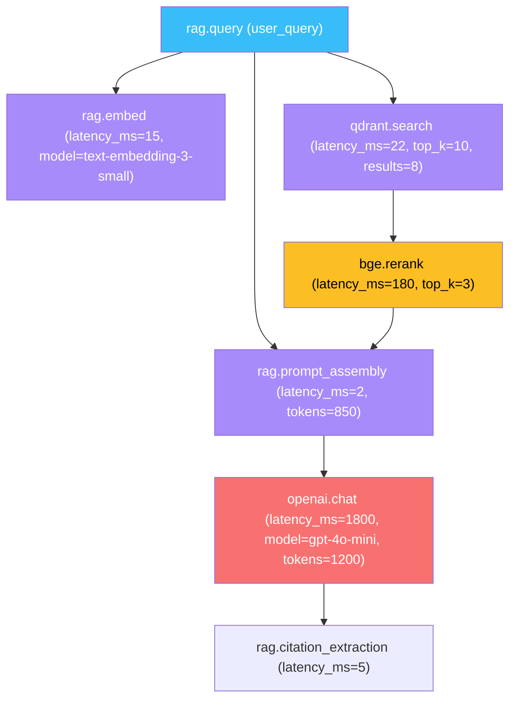

# 🔍 OTel for RAG Pipelines — Retrieval and Generation

A RAG pipeline is a 5-stage workflow: **query → embed → retrieve → rerank → generate → cite**. Each stage has its own latency, token cost, and failure mode. Without tracing, "the answer is wrong" could be a bad embedding (40ms), a wrong vector index (5ms), a missing document (200ms rerank), or a hallucination (2s generation). With OTel, you see which stage is slow, which is failing, and where to optimize. **OTel is the microscope for RAG debugging.**

This note covers the standard RAG tracing pattern: one parent span per user query, child spans per stage, attributes for the metrics that matter (latency, tokens, retrieval quality), and the integration with Phoenix's RAG-specific evaluations. By the end you can build a trace tree that shows the complete request lifecycle and lets you answer "what went wrong?" in seconds, not hours.

## 🎯 Learning Objectives

- Trace a RAG pipeline end-to-end with parent/child spans per stage.
- Capture stage-specific attributes (latency, token cost, retrieval quality).
- Use **semantic conventions for vector DB operations** (db.system, db.operation).
- Wire RAG eval (RAGAS) into the same trace context as the live RAG call.
- Build latency budgets that alert when a stage exceeds its SLA.
- Identify the slow stage of a slow RAG call without log archaeology.

## 1. The RAG Pipeline Trace Tree



Total latency: ~2,024ms. **Rerank + generation = 99% of latency.** Without OTel, you couldn't see this — you'd just see "the answer took 2 seconds".

## 2. The Standard Tracing Pattern

```python
# rag_pipeline.py
from opentelemetry import trace, baggage
from opentelemetry.context import attach, detach
from opentelemetry.semconv.trace import SpanAttributes

tracer = trace.get_tracer(__name__)


def rag_query(query: str, user_id: str = "", thread_id: str = "") -> dict:
    """End-to-end RAG pipeline with full OTel instrumentation."""

    # Set baggage for downstream services
    ctx = baggage.set_baggage("thread_id", thread_id)
    ctx = baggage.set_baggage("user_id", user_id, context=ctx)
    token = attach(ctx)

    try:
        with tracer.start_as_current_span("rag.query") as parent:
            parent.set_attribute("rag.user_query", query[:200])
            parent.set_attribute("rag.thread_id", thread_id)

            # Stage 1: Embedding
            with tracer.start_as_current_span("rag.embed") as span:
                query_embedding = embed_query(query)
                span.set_attribute("gen_ai.system", "openai")
                span.set_attribute("gen_ai.request.model", "text-embedding-3-small")
                span.set_attribute("gen_ai.usage.input_tokens", len(query) // 4)
                span.set_attribute("embedding.dimensions", len(query_embedding))

            # Stage 2: Vector retrieval
            with tracer.start_as_current_span("qdrant.search") as span:
                span.set_attribute("db.system", "qdrant")
                span.set_attribute("db.operation", "search")
                span.set_attribute("db.collection", "research_papers")
                span.set_attribute("db.qdrant.top_k", 10)
                candidates = qdrant.search(query_embedding, top_k=10)
                span.set_attribute("db.qdrant.results_count", len(candidates))

            # Stage 3: Reranking
            with tracer.start_as_current_span("bge.rerank") as span:
                span.set_attribute("rerank.model", "BAAI/bge-reranker-v2-m3")
                span.set_attribute("rerank.input_count", len(candidates))
                ranked = bge_rerank(query, candidates, top_k=3)
                span.set_attribute("rerank.output_count", len(ranked))

            # Stage 4: Prompt assembly
            with tracer.start_as_current_span("rag.prompt_assembly") as span:
                context_text = "\n\n".join([d.content for d in ranked])
                prompt = build_prompt(query, context_text)
                span.set_attribute("prompt.context_tokens", len(context_text) // 4)
                span.set_attribute("prompt.total_tokens", len(prompt) // 4)

            # Stage 5: Generation
            with tracer.start_as_current_span("openai.chat") as span:
                span.set_attribute("gen_ai.system", "openai")
                span.set_attribute("gen_ai.request.model", "gpt-4o-mini")
                response = openai_client.chat.completions.create(
                    model="gpt-4o-mini",
                    messages=[{"role": "user", "content": prompt}],
                )
                answer = response.choices[0].message.content
                span.set_attribute("gen_ai.usage.input_tokens", response.usage.prompt_tokens)
                span.set_attribute("gen_ai.usage.output_tokens", response.usage.completion_tokens)

            # Stage 6: Citation extraction
            with tracer.start_as_current_span("rag.citation_extraction") as span:
                citations = extract_citations(answer, ranked)
                span.set_attribute("citations.count", len(citations))

            parent.set_attribute("rag.citations.count", len(citations))
            return {"answer": answer, "citations": citations}

    finally:
        detach(token)
```

## 3. Latency Attribution

Every span has `start_time` and `end_time`. **Sum them per stage** to find bottlenecks:

```python
def attribute_latencies(parent_span):
    """Walk children and compute per-stage latency."""
    stages = {}
    for child in parent_span.iter_children():
        duration_ms = (child.end_time - child.start_time) / 1e6
        stages[child.name] = {
            "duration_ms": duration_ms,
            "attributes": dict(child.attributes or {}),
        }
    return stages

# Example output:
# {
#   "rag.embed": {"duration_ms": 15, "attributes": {...}},
#   "qdrant.search": {"duration_ms": 22, ...},
#   "bge.rerank": {"duration_ms": 180, ...},
#   "openai.chat": {"duration_ms": 1800, ...},
#   "rag.citation_extraction": {"duration_ms": 5, ...},
# }
# Total: 2022ms
```

In Phoenix, this is visualized automatically — but the same data is accessible in any OTel backend.

## 4. Semantic Conventions for RAG

OpenTelemetry's GenAI semantic conventions are stabilizing (mid-2026). Use them where available:

```python
# GenAI conventions
span.set_attribute("gen_ai.system", "openai")               # openai, anthropic, vertex_ai, etc.
span.set_attribute("gen_ai.request.model", "gpt-4o-mini")
span.set_attribute("gen_ai.usage.input_tokens", 850)
span.set_attribute("gen_ai.usage.output_tokens", 156)

# Database conventions (vector DBs)
span.set_attribute("db.system", "qdrant")                   # qdrant, milvus, pinecone, etc.
span.set_attribute("db.operation", "search")
span.set_attribute("db.collection", "research_papers")

# Custom RAG attributes
span.set_attribute("rag.retrieval.top_k", 10)
span.set_attribute("rag.retrieval.results_count", 8)
span.set_attribute("rag.rerank.input_count", 8)
span.set_attribute("rag.rerank.output_count", 3)
```

> 💡 **Tip:** Phoenix's RAG dashboards group by `gen_ai.request.model`, `db.system`, `db.collection`. Without semantic conventions, you can't filter "show me all traces that hit the Pinecone prod collection".

## 5. RAGAS Evaluation as a Span

When running [[../../06 - Large Language Models/20 - RAG Evaluation Deep Dive/00 - Welcome to RAG Evaluation Deep Dive.md|06/20 RAGAS]] on your RAG system, wrap each evaluation in a span:

```python
from ragas import evaluate
from ragas.metrics import faithfulness, answer_relevancy

def eval_rag_pipeline(rag_pipeline, test_samples):
    """Run RAGAS eval, with each eval step as an OTel span."""
    with tracer.start_as_current_span("ragas.eval_run") as parent:
        parent.set_attribute("eval.test_set_size", len(test_samples))
        parent.set_attribute("eval.metrics", ["faithfulness", "answer_relevancy"])

        # Run RAG on each sample
        answers = []
        contexts_list = []
        for sample in test_samples:
            with tracer.start_as_current_span("eval.sample") as span:
                span.set_attribute("sample.id", id(sample))
                result = rag_pipeline(sample.user_input)
                answers.append(result["answer"])
                contexts_list.append(result["contexts"])
                span.set_attribute("answer.length", len(result["answer"]))

        # Run RAGAS metrics
        dataset = ...  # build dataset
        with tracer.start_as_current_span("ragas.compute_metrics") as span:
            results = evaluate(dataset, metrics=[faithfulness, answer_relevancy])
            span.set_attribute("eval.faithfulness", float(results["faithfulness"].mean()))
            span.set_attribute("eval.answer_relevancy", float(results["answer_relevancy"].mean()))
            return results
```

The eval run becomes a single trace with child spans per sample and a final span with aggregate metrics.

## 6. Latency Budgets and Alerts

For each stage, define a target latency and alert when it's exceeded:

```python
LATENCY_BUDGETS = {
    "rag.embed": 50,           # 50ms
    "qdrant.search": 100,      # 100ms
    "bge.rerank": 300,         # 300ms
    "rag.prompt_assembly": 10, # 10ms
    "openai.chat": 3000,       # 3s
    "rag.citation_extraction": 20,
}
TOTAL_BUDGET = 3500  # 3.5s target end-to-end

def check_budget(span):
    duration_ms = (span.end_time - span.start_time) / 1e6
    budget = LATENCY_BUDGETS.get(span.name, 1000)
    if duration_ms > budget:
        span.set_attribute("budget.exceeded", True)
        span.set_attribute("budget.exceeded_by_ms", duration_ms - budget)
        # Optional: emit a metric for alerting
        from opentelemetry import metrics
        meter = metrics.get_meter(__name__)
        counter = meter.create_counter("rag.budget_exceeded")
        counter.add(1, {"stage": span.name})
```

Pair this with a Prometheus alert:

```yaml
# alerts/rag_latency.yml
- alert: RAGStageOverBudget
  expr: increase(rag_budget_exceeded_total[5m]) > 10
  for: 5m
  labels: {severity: warning}
  annotations:
    summary: "RAG stage {{ $labels.stage }} exceeds budget"
    description: "{{ $value }} budget violations in last 5 min"
```

## 7. ❌/✅ Antipatterns

### ❌ Span per vector search candidate

```python
# ⚠️ 100+ spans per retrieval — backend overwhelmed
for i, candidate in enumerate(candidates):
    with tracer.start_as_current_span(f"candidate_{i}"):
        ...
```

### ✅ One span per retrieval operation

```python
with tracer.start_as_current_span("qdrant.search") as span:
    span.set_attribute("db.qdrant.results_count", len(candidates))
    results = qdrant.search(...)
```

### ❌ Mixing timing of HTTP and instrumentation

```python
# ⚠️ Network latency measured, not the actual operation
with tracer.start_as_current_span("qdrant.search"):
    response = requests.post(...)  # includes connection setup
```

### ✅ Measure the operation, not the wrapper

```python
# ✅ Inside the span, time just the query
import time
with tracer.start_as_current_span("qdrant.search") as span:
    start = time.perf_counter()
    response = qdrant.search(...)  # just the query
    span.set_attribute("latency.ms", (time.perf_counter() - start) * 1000)
```

### ❌ No attributes for downstream debugging

```python
# ⚠️ Span has no useful metadata
with tracer.start_as_current_span("openai.chat"):
    response = client.chat(...)
```

### ✅ Attributes for debugging

```python
with tracer.start_as_current_span("openai.chat") as span:
    span.set_attribute("gen_ai.request.model", "gpt-4o-mini")
    span.set_attribute("gen_ai.usage.input_tokens", response.usage.prompt_tokens)
    span.set_attribute("gen_ai.usage.output_tokens", response.usage.completion_tokens)
```

### ❌ Capturing retrieved context in span attributes

```python
# ⚠️ PII / IP leakage to trace storage
span.set_attribute("retrieved.contexts", str(contexts))
```

### ✅ Aggregate, don't capture

```python
span.set_attribute("retrieved.results_count", len(contexts))
span.set_attribute("retrieved.avg_score", sum(c.score for c in contexts) / len(contexts))
```

## 8. Production Reality

**Caso real — Production RAG Project:** The RAG pipeline emits 6 spans per request (embed, retrieve, rerank, prompt, generate, cite). The average trace shows generation = 80% of latency. Three months in, the team swapped `bge-reranker-v2-m3` for `cohere-rerank-3-mini` — rerank dropped from 180ms to 90ms, **discovered via OTel latency attribution**. Without tracing, they would have guessed.

**Caso real — Multi-Agent Research System:** Phoenix's RAG dashboards group by `db.collection` and `gen_ai.request.model`. When the `research_papers` collection started returning low-quality results, the team's first action was checking OTel traces for `db.qdrant.results_count` — it had dropped from 8 to 3 due to a recent re-index. OTel attribution pinpointed the bug in 15 minutes.

## 📦 Compression Code

```python
# 📦 Compression: RAG pipeline tracing in 50 lines

from opentelemetry import trace, baggage
from opentelemetry.context import attach, detach

tracer = trace.get_tracer(__name__)


def traced_stage(name: str, **attrs):
    """Context manager that traces a RAG stage with attributes."""
    return tracer.start_as_current_span(name, attributes=attrs)


def rag_pipeline(query: str, thread_id: str = "") -> dict:
    """Full RAG pipeline with OTel tracing."""
    ctx = baggage.set_baggage("thread_id", thread_id)
    token = attach(ctx)

    try:
        with traced_stage("rag.query", **{"rag.user_query": query[:200]}):

            with traced_stage("rag.embed", **{"gen_ai.request.model": "text-embedding-3-small"}):
                embedding = embed(query)

            with traced_stage("qdrant.search", **{"db.system": "qdrant", "db.qdrant.top_k": 10}):
                candidates = qdrant.search(embedding, top_k=10)

            with traced_stage("bge.rerank", **{"rerank.input_count": len(candidates)}):
                ranked = bge_rerank(query, candidates, top_k=3)

            with traced_stage("rag.prompt_assembly"):
                prompt = build_prompt(query, ranked)

            with traced_stage("openai.chat", **{"gen_ai.request.model": "gpt-4o-mini"}):
                answer = openai_chat(prompt)

            return {"answer": answer, "sources": ranked}
    finally:
        detach(token)
```

## 🎯 Key Takeaways

1. **One parent span per query, child spans per stage** — embed, retrieve, rerank, prompt, generate, cite.
2. **Use semantic conventions** — `gen_ai.*`, `db.*` so Phoenix/Tempo dashboards work.
3. **Latency attribution is the killer feature** — find the slow stage without log archaeology.
4. **RAGAS eval as a span** — same trace context as live RAG calls.
5. **Latency budgets + alerts** — catch when a stage exceeds its SLA in production.
6. **Aggregate retrieved context, don't capture it** — counts, scores, never the raw passages.
7. **Trace PII-redacted, attribute everything else** — `capture_content=False` is the default.

## References

- [[00 - Welcome to OpenTelemetry for AI Engineers|Welcome]] — course map.
- [[02 - Auto-Instrumentation for LLM SDKs|LLM SDKs]] — most spans come from auto-instrumentation.
- [[03 - OTLP Exporters|Exporters]] — where traces go.
- [[../31 - Evidently AI and Phoenix/03 - Phoenix by Arize - LLM Observability, Traces and Embedding Drift.md|Phoenix]] — RAG-specific dashboards.
- [[../../06 - Large Language Models/12 - Production RAG/02 - Vector Databases for RAG - HNSW, IVF, PQ and Filtering.md|Vector Databases for RAG]] — the retrieval layer.
- [[../../06 - Large Language Models/20 - RAG Evaluation Deep Dive/00 - Welcome to RAG Evaluation Deep Dive.md|RAG Evaluation Deep Dive]] — eval integration.
- OTel semantic conventions: https://opentelemetry.io/docs/specs/semconv/gen-ai/
- OpenInference: https://github.com/Arize-ai/openinference