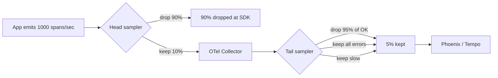

# ⚙️ Production Patterns — Sampling, Costs, and PII Redaction

A production LLM service emits **thousands of spans per second**. Without discipline, your observability backend becomes a money pit (storage costs), a performance liability (export latency), and a privacy nightmare (PII in trace attributes). This note teaches the four production patterns that keep OTel observability **affordable, fast, and safe**:

1. **Sampling** — keep the traces that matter, drop the noise.
2. **Cost attribution** — know which service / user / model is costing what.
3. **PII redaction** — ensure sensitive data never reaches the backend.
4. **Storage tiering** — recent traces in hot storage, old traces in cold.

By the end you can operate OTel observability at production scale (10K+ spans/sec) without bankrupting the team or leaking user data.

## 🎯 Learning Objectives

- Apply **head-based** and **tail-based** sampling strategies.
- Configure **cost attribution** via span attributes and resource labels.
- Implement **PII redaction** at the SDK and Collector levels.
- Set up **storage tiering** for trace retention.
- Define **production SLAs** for trace completeness and latency.
- Avoid the four most common production OTel pitfalls.

## 1. The Scale Problem

A typical LLM service emits:

| Service | Spans/request | QPS | Spans/sec |
|---------|--------------:|----:|----------:|
| RAG API | 6 | 100 | 600 |
| Embedding service | 2 | 50 | 100 |
| LangGraph agent | 8 | 20 | 160 |
| Reranker | 3 | 50 | 150 |
| Eval runner | 50 | 1 | 50 |
| **Total** | | | **~1060** |

At 1060 spans/sec = **91M spans/day** = **2.7B spans/month**. At Phoenix's pricing ($0.10/1M spans ingested + $0.05/GB storage), that's **$270/month in ingest + storage**. **Doubling** if you add long-context traces.

The answer: **sample**. Don't keep every trace; keep the ones that matter.

## 2. Sampling Strategies



### Head-Based Sampling (in the SDK)

```python
from opentelemetry.sdk.trace.sampling import (
    TraceIdRatioBased,
    ParentBased,
    ALWAYS_ON,
    ALWAYS_OFF,
    RateLimitingSampler,
)

# Always sample (dev)
sampler = ALWAYS_ON

# Sample 10% of traces (production low-traffic)
sampler = TraceIdRatioBased(0.1)

# Sample 10% but always keep child spans if parent was sampled
sampler = ParentBased(TraceIdRatioBased(0.1))

# Rate-limit to 100 traces/sec
sampler = RateLimitingSampler(100)

provider = TracerProvider(
    resource=resource,
    sampler=sampler,  # SDK-side sampling
)
```

Head-based sampling is **fast and free** — dropped spans never leave the SDK. The downside: you can't decide what to keep based on the trace contents (you only have the trace_id at decision time).

### Tail-Based Sampling (in the Collector)

```yaml
# otel-collector-config.yaml
processors:
  tail_sampling:
    decision_wait: 10s         # wait 10s for the trace to complete
    num_traces: 50000          # max concurrent traces
    expected_new_traces_per_sec: 1000
    policies:
      # Always keep error traces
      - name: errors
        type: status_code
        status_code:
          status_codes: [ERROR]

      # Keep traces with high latency
      - name: high-latency
        type: latency
        latency:
          threshold_ms: 5000    # > 5s

      # Sample 10% of successful, fast traces
      - name: success-sample
        type: probabilistic
        probabilistic:
          sampling_percentage: 10

      # Always keep traces with specific attributes
      - name: keep-flagged
        type: string_attribute
        string_attribute:
          key: trace.priority
          values: [high, critical]
```

Tail-based sampling **waits for the trace to complete**, then decides. **Keep all errors and slow traces**; sample successful fast traces. This is the production sweet spot.

### Sampling for AI-Specific Traces

```yaml
processors:
  tail_sampling:
    decision_wait: 30s   # LLM calls can be slow
    policies:
      - name: errors
        type: status_code
        status_code: {status_codes: [ERROR]}

      - name: expensive-trace
        type: numeric_attribute
        numeric_attribute:
          key: gen_ai.usage.total_tokens
          min_value: 5000
          # Keep all traces that used > 5000 tokens

      - name: low-confidence
        type: string_attribute
        string_attribute:
          key: rag.confidence
          values: [low, very_low]
        # Keep traces where RAG confidence was low (likely errors)

      - name: sample-fast
        type: probabilistic
        probabilistic:
          sampling_percentage: 5
```

This policy keeps:
- All error traces (debugging value: highest)
- All traces with >5K tokens (cost review)
- All low-confidence RAG traces (quality review)
- 5% of the rest (general monitoring)

## 3. Cost Attribution

Per-span attributes enable cost dashboards in Phoenix/Tempo:

```python
from opentelemetry.semconv.resource import ResourceAttributes

resource = Resource.create({
    ResourceAttributes.SERVICE_NAME: "rag-api",
    ResourceAttributes.SERVICE_VERSION: "1.2.3",
    ResourceAttributes.DEPLOYMENT_ENVIRONMENT: "production",
    "cost.center": "ai-platform",
    "cost.team": "search",
})

# Per-span
with tracer.start_as_current_span("openai.chat") as span:
    span.set_attribute("cost.model", "gpt-4o-mini")
    span.set_attribute("cost.input_tokens", 850)
    span.set_attribute("cost.output_tokens", 156)
    # Phoenix / Tempo dashboards group by service.name and gen_ai.request.model
```

Phoenix's cost dashboard:
- Total cost per service (sum of input + output token cost)
- Cost per user (`baggage.user_id` propagation)
- Cost per model (`gen_ai.request.model` grouping)
- Cost over time (rolling 7-day window)

For dollar attribution:

```python
MODEL_PRICING = {
    "gpt-4o-mini": {"input": 0.00015 / 1000, "output": 0.0006 / 1000},
    "gpt-4o": {"input": 0.0025 / 1000, "output": 0.01 / 1000},
    "claude-3-5-sonnet-20241022": {"input": 0.003 / 1000, "output": 0.015 / 1000},
}

def attribute_cost(span, model: str, input_tokens: int, output_tokens: int):
    if model not in MODEL_PRICING:
        return
    pricing = MODEL_PRICING[model]
    cost_usd = (
        input_tokens * pricing["input"] +
        output_tokens * pricing["output"]
    )
    span.set_attribute("cost.usd", cost_usd)
    span.set_attribute("cost.input_usd", input_tokens * pricing["input"])
    span.set_attribute("cost.output_usd", output_tokens * pricing["output"])
```

## 4. PII Redaction

Three layers of PII defense:

### Layer 1: SDK — Disable Content Capture

```python
# Default to False in production
OpenAIInstrumentor().instrument(
    capture_prompts=False,        # no prompt content in spans
    capture_completions=False,    # no completion content in spans
)
```

### Layer 2: App — Filter Sensitive Attributes

```python
import re

PII_PATTERNS = {
    "user.email": re.compile(r"[\w\.-]+@[\w\.-]+"),
    "user.credit_card": re.compile(r"\d{4}-?\d{4}-?\d{4}-?\d{4}"),
    "user.ssn": re.compile(r"\d{3}-?\d{2}-?\d{4}"),
}

def redact_pii(attribute_key: str, value: str) -> str:
    """Replace PII with a hash."""
    if attribute_key in PII_PATTERNS:
        return f"<redacted:{hash(value)[:8]}>"
    return value

# Span processor that redacts before export
class PIIRedactionProcessor(SpanProcessor):
    def on_end(self, span):
        if span.attributes:
            for key in list(span.attributes.keys()):
                value = span.attributes[key]
                if isinstance(value, str):
                    span.attributes[key] = redact_pii(key, value)

provider.add_span_processor(PIIRedactionProcessor())
```

### Layer 3: Collector — Final Defense

```yaml
# otel-collector-config.yaml
processors:
  attributes/remove_pii:
    actions:
      # Delete PII attributes entirely
      - key: user.email
        action: delete
      - key: user.credit_card
        action: delete
      - key: gen_ai.prompt
        action: delete
      - key: gen_ai.completion
        action: delete

      # Hash values that look like emails but key isn't explicit
      - key: request.headers.authorization
        action: delete

      # Hash IDs to keep referential integrity
      - key: user_id
        action: hash

service:
  pipelines:
    traces:
      processors: [memory_limiter, tail_sampling, attributes/remove_pii, batch]
      exporters: [...]
```

**Always redact at the Collector**, not just at the SDK. The SDK might be misconfigured; the Collector is your last line of defense.

## 5. Storage Tiering

```yaml
# otel-collector-config.yaml
exporters:
  otlp/phoenix_hot:
    endpoint: phoenix-prod:4317
    sending_queue:
      enabled: true
      num_consumers: 10

  otlp/tempo_cold:
    endpoint: tempo-cold:4317
    sending_queue:
      enabled: true
      num_consumers: 4
```

Use Collector routing to send "hot" traces (errors, recent, important users) to Phoenix (fast query) and "cold" traces (everything else) to Tempo (cheap storage).

```yaml
# Routing example (using routing connector)
connectors:
  routing:
    default_pipelines: [traces/tempo]
    error_mode: ignore
    table:
      - context: span
        condition: attributes["gen_ai.usage.total_tokens"] > 10000
        pipelines: [traces/phoenix]
      - context: span
        condition: attributes["error"] == true
        pipelines: [traces/phoenix]
```

## 6. Production SLAs

Define SLAs for trace observability:

| SLA | Target | How to measure |
|-----|--------|----------------|
| **Trace completeness** | 100% of in-process spans exported | `OTel metrics: dropped_spans` |
| **Export latency** | <5s p99 | `OTel metrics: export_latency_ms` |
| **Backend availability** | 99.9% | Phoenix/Tempo uptime |
| **Cost per request** | <$0.001 | Token cost attributes |
| **PII leakage** | 0 events/month | Audit logs on Collector |

### Prometheus Alerts

```yaml
groups:
- name: otel_alerts
  rules:
  - alert: OTELDroppedSpans
    expr: rate(otelcol_exporter_sent_spans[5m]) / rate(otelcol_exporter_spans_total[5m]) < 0.99
    for: 10m
    labels: {severity: warning}
    annotations:
      summary: "OTel dropped {{ $value | humanizePercentage }} of spans"

  - alert: OTELHighLatency
    expr: histogram_quantile(0.99, rate(otelcol_exporter_queue_size[5m])) > 1000
    for: 5m
    labels: {severity: warning}
    annotations:
      summary: "OTel export latency exceeds 1s"
```

## 7. ❌/✅ Antipatterns

### ❌ `ALWAYS_ON` sampling in production

```python
# ⚠️ Keeps every span — costs explode at scale
provider = TracerProvider(sampler=ALWAYS_ON)
```

### ✅ Head + tail sampling combo

```python
# ✅ SDK samples 10% by trace_id; Collector keeps errors/slow
provider = TracerProvider(sampler=ParentBased(TraceIdRatioBased(0.1)))
```

### ❌ `capture_prompts=True` in production

```python
# ⚠️ PII in trace storage
OpenAIInstrumentor().instrument(capture_prompts=True)
```

### ✅ `capture_prompts=False` + Collector redaction

```python
OpenAIInstrumentor().instrument(capture_prompts=False)
# Collector config also redacts gen_ai.prompt attribute
```

### ❌ No PII redaction at the Collector

```yaml
# ⚠️ Apps might leak PII; Collector lets it through
processors: [batch]
```

### ✅ PII redaction is a Collector-level concern

```yaml
processors: [attributes/remove_pii, batch]
```

### ❌ Cost tracked in app only

```python
# ⚠️ Backend can't group costs by user / service
span.set_attribute("cost_usd", 0.05)  # free-form attribute
```

### ✅ Use semantic cost attributes

```python
span.set_attribute("cost.usd", 0.05)
span.set_attribute("cost.model", "gpt-4o-mini")
span.set_attribute("cost.input_tokens", 850)
span.set_attribute("cost.output_tokens", 156)
```

## 8. Production Reality

**Caso real — Production RAG Project:** Started with `ALWAYS_ON` and `capture_prompts=True`. Trace volume hit 5M spans/day and storage costs hit $1,200/month. Switched to: (1) `ParentBased(TraceIdRatioBased(0.1))` head sampling, (2) Collector tail-sampling with error/latency policies, (3) `capture_prompts=False` everywhere, (4) Collector-level PII redaction. **Result**: $120/month, same debugging capability (all errors still kept, slow traces still kept).

**Caso real — Multi-Agent Research System:** Cost dashboard per user (via `baggage.user_id`) revealed that 3 power users consumed 40% of the LLM budget. Product decision: tiered plans. The cost attribution pattern turned a vague complaint ("the bill is high") into actionable data.

## 📦 Compression Code

```python
# 📦 Compression: Production OTel setup in 50 lines

import os
from opentelemetry import trace
from opentelemetry.sdk.trace import TracerProvider, BatchSpanProcessor, SpanProcessor
from opentelemetry.sdk.trace.sampling import ParentBased, TraceIdRatioBased
from opentelemetry.sdk.resources import Resource
from opentelemetry.exporter.otlp.proto.grpc.trace_exporter import OTLPSpanExporter
from opentelemetry.instrumentation.openai import OpenAIInstrumentor

# Resource labels for cost attribution
resource = Resource.create({
    "service.name": os.environ["SERVICE_NAME"],
    "service.version": os.environ.get("SERVICE_VERSION", "1.0.0"),
    "deployment.environment": os.environ.get("ENV", "production"),
    "cost.center": os.environ.get("COST_CENTER", "ai-platform"),
})

# Head sampling: 10% base, always keep children of sampled parents
provider = TracerProvider(
    resource=resource,
    sampler=ParentBased(TraceIdRatioBased(0.1)),
)

# OTLP export
provider.add_span_processor(
    BatchSpanProcessor(
        OTLPSpanExporter(
            endpoint=os.environ.get("OTEL_EXPORTER_OTLP_ENDPOINT", "http://otel-collector:4317"),
        ),
        max_queue_size=2048,
        max_export_batch_size=512,
    )
)
trace.set_tracer_provider(provider)

# LLM SDKs — NEVER capture content in production
OpenAIInstrumentor().instrument(
    capture_prompts=False,
    capture_completions=False,
)
```

## 🎯 Key Takeaways

1. **Always sample in production** — `ParentBased(TraceIdRatioBased(0.1))` head + tail-based Collector.
2. **Always keep errors and slow traces** — these are the highest-value debugging signals.
3. **Tail sampling for AI-specific policies** — keep high-token, low-confidence traces.
4. **`capture_prompts=False` in production** — default, opt-in only in dev with explicit consent.
5. **PII redaction at the Collector** — defense in depth; never rely on app-level filtering alone.
6. **Cost attribution via span attributes** — `cost.usd`, `cost.model`, `cost.input_tokens`.
7. **Production SLAs and alerts** — dropped spans, export latency, PII leakage.

## References

- [[00 - Welcome to OpenTelemetry for AI Engineers|Welcome]] — course map.
- [[01 - OTel Primitives|Context, baggage]] — how attributes flow.
- [[02 - Auto-Instrumentation|Auto-Instrumentation]] — what to instrument.
- [[03 - OTLP Exporters|Exporters]] — backend configuration.
- OTel Sampling: https://opentelemetry.io/docs/specs/otel/trace/sdk/#sampling
- OTel Collector tail sampling: https://github.com/open-telemetry/opentelemetry-collector-contrib/tree/main/processor/tailsamplingprocessor