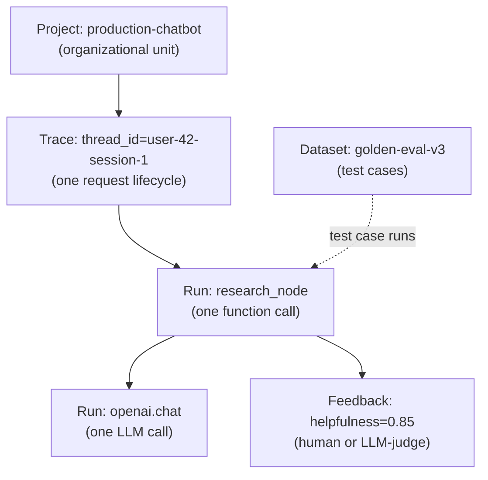
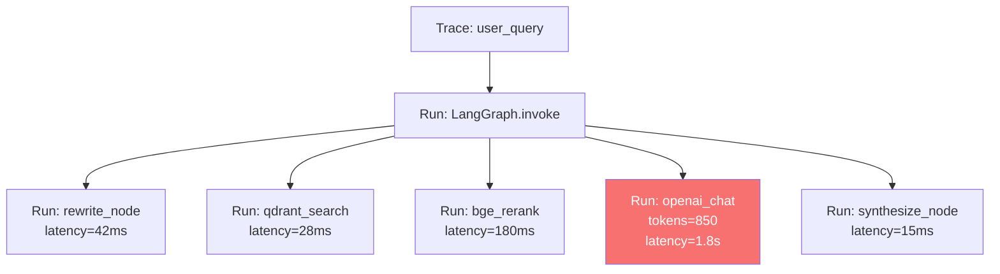

# 🔗 LangSmith Core — Traces, Runs, Projects, Datasets

LangSmith's data model has five primitives: **Projects** (organizational unit), **Traces** (one full request lifecycle), **Runs** (one LLM call or function), **Feedback** (annotation scores), and **Datasets** (versioned test sets). Master these five and the rest of the platform — evaluators, annotation queues, A/B tests — is composition. This note covers the data model, the trace tree structure, the project organization patterns, and the SDK API for working with each primitive programmatically.

By the end you can build a complete observability workflow: projects per environment, traces per request, runs per node, feedback per evaluation, datasets per version. The [[../../../09 - MLOps y Produccion/34 - OpenTelemetry for AI Engineers/01 - OTel Primitives - Spans Traces and Context Propagation.md|OTel equivalent]] of these primitives is the same mental model with different terminology.

## 🎯 Learning Objectives

- Master the **data model**: Projects, Traces, Runs, Feedback, Datasets.
- Use **trace nesting** to model multi-agent workflows.
- Organize **projects** by environment, service, or team.
- Programmatically **query traces** via the SDK.
- Apply **metadata and tags** for filtering.
- Avoid the four most common LangSmith data-model pitfalls.

## 1. The Data Model



| Primitive | Definition | Example |
|-----------|-----------|---------|
| **Project** | Top-level container | `production-chatbot` |
| **Trace** | One end-to-end request | `thread_id=user-42-session-1` |
| **Run** | One operation within a trace | `research_node` |
| **Feedback** | Score attached to a run | `helpfulness=0.85` |
| **Dataset** | Versioned test cases | `golden-eval-v3` (200 examples) |

## 2. Tracing — The Foundation

LangSmith tracing is **automatic** for any LangChain/LangGraph call and **opt-in** for custom code via `@traceable`:

```python
import os
os.environ["LANGSMITH_API_KEY"] = "lsv2_pt_..."
os.environ["LANGSMITH_TRACING"] = "true"
os.environ["LANGSMITH_PROJECT"] = "my-app"

from langchain_openai import ChatOpenAI

# Auto-traced: LangChain components emit runs automatically
llm = ChatOpenAI(model="gpt-4o-mini")
response = llm.invoke("What is X?")

# Custom functions: opt-in with @traceable
from langsmith import traceable

@traceable
def my_preprocessor(text: str) -> str:
    return text.strip().lower()

@traceable(name="custom_search")  # custom name in UI
def search(query: str) -> list[str]:
    return ["result1", "result2"]

# Nested tracing
@traceable
def parent_function(query: str):
    preprocessed = my_preprocessor(query)  # child run
    results = search(preprocessed)         # child run
    return results
```

Every `@traceable` function creates a **run** in LangSmith. Nested calls form a **trace tree**.

## 3. Trace Tree Visualization

A LangGraph agent invocation produces this trace tree:



Each run shows inputs, outputs, latency, and token usage inline.

## 4. Metadata, Tags, and Inputs/Outputs

```python
from langsmith import traceable

@traceable(
    metadata={"environment": "production", "service": "chat-api"},
    tags=["rag", "gpt-4o-mini", "user-tier:premium"],
)
def my_step(query: str) -> str:
    return llm.invoke(query)
```

**Metadata** is for filterable, structured data (key-value pairs). **Tags** are for free-form labels. **Inputs/outputs** are the I/O of the function.

### Querying by Tags

```python
from langsmith import Client

client = Client()

# Get all runs with tag "user-tier:premium" from last 24 hours
runs = client.list_runs(
    project_name="my-app",
    filter='and(eq(tags, "user-tier:premium"), gte(start_time, "2024-12-01"))',
    limit=100,
)
```

## 5. Projects — Organization

Projects are the top-level container. Common patterns:

```python
# By environment
os.environ["LANGSMITH_PROJECT"] = "production-chatbot"
os.environ["LANGSMITH_PROJECT"] = "staging-chatbot"
os.environ["LANGSMITH_PROJECT"] = "dev-chatbot"

# By service
os.environ["LANGSMITH_PROJECT"] = "chat-api"
os.environ["LANGSMITH_PROJECT"] = "embedding-service"
os.environ["LANGSMITH_PROJECT"] = "agent-orchestrator"

# By team
os.environ["LANGSMITH_PROJECT"] = "team-search"
os.environ["LANGSMITH_PROJECT"] = "team-chatbot"
```

**Recommendation**: organize by **environment** (production / staging / dev) for production observability. Use tags for service/team breakdown.

## 6. Trace Context Propagation

Like OTel, LangSmith supports context propagation across services:

```python
from langsmith import traceable, get_current_run_tree

# In one service: set metadata on the current run
@traceable
def request_handler():
    run = get_current_run_tree()
    run.add_metadata({"user_id": "u-42", "tenant_id": "acme"})
    # ...

# The metadata is attached to the run automatically
```

For **cross-service** propagation (e.g., API → agent → embedding):

```python
import httpx
from langsmith import get_current_run_tree

# Outgoing HTTP: inject the trace context
@traceable
async def call_external_service(payload):
    headers = {"traceparent": "00-..."}  # OTel-compatible
    response = await httpx.post("http://other-service", json=payload, headers=headers)
    return response.json()

# Incoming HTTP: extract trace context
@traceable
async def handler(request):
    # LangSmith extracts trace context from incoming headers automatically
    # (when configured with the right middleware)
    return {"ok": True}
```

## 7. ❌/✅ Antipatterns

### ❌ One project for everything

```python
# ⚠️ Can't filter by environment or service
os.environ["LANGSMITH_PROJECT"] = "default"  # everything goes here
```

### ✅ One project per environment

```python
# ✅ Production traces separate from dev
os.environ["LANGSMITH_PROJECT"] = f"{ENV}-chatbot"
```

### ❌ No metadata

```python
# ⚠️ Can't filter "show me all queries from user-42"
@traceable
def my_function(query):
    return process(query)
```

### ✅ Add metadata for filterability

```python
# ✅ Filterable later
@traceable(metadata={"user_id": user_id, "thread_id": thread_id})
def my_function(query):
    return process(query)
```

### ❌ Using `@traceable` for everything

```python
# ⚠️ Trace explosion — every internal function is a run
@traceable
def add(a, b):
    return a + b
```

### ✅ Trace at business-logic boundaries

```python
# ✅ Only the meaningful functions are runs
@traceable(name="process_query")
def process(query):
    preprocessed = preprocess(query)  # internal, not traced
    return llm.invoke(preprocessed)
```

### ❌ PII in run inputs/outputs

```python
# ⚠️ User email is persisted to LangSmith storage
@traceable
def process(user):
    return llm.invoke(f"Email {user.email} about ...")
```

### ✅ Strip PII before tracing

```python
@traceable
def process(user):
    safe_query = f"User {user.id} about ..."  # no PII
    return llm.invoke(safe_query)
```

## 8. Production Reality

**Caso real — Production RAG Project:** Each FastAPI request creates a trace. Inside the LangGraph agent, every node is a run. Every LLM call has token counts and latency inline. When a user reports "the answer is wrong", the support engineer searches LangSmith by `thread_id`, sees the full trace, and identifies the failing node in 2 minutes.

**Caso real — Multi-Agent Research System:** Projects per environment (`prod-research-agent`, `staging-research-agent`). Tags per agent (`agent:research`, `agent:audit`, `agent:synthesis`). Metadata per user tier. **One search filters all of it.**

## 📦 Compression Code

```python
# 📦 Compression: LangSmith primitives in 30 lines

import os
from langsmith import traceable, Client

# Configure
os.environ["LANGSMITH_API_KEY"] = "lsv2_pt_..."
os.environ["LANGSMITH_TRACING"] = "true"
os.environ["LANGSMITH_PROJECT"] = "my-app"

# Trace custom function
@traceable(
    metadata={"service": "chat-api"},
    tags=["rag", "gpt-4o-mini"],
)
def my_step(query: str) -> str:
    return llm.invoke(query)

# Use
result = my_step("What is X?")

# Query LangSmith programmatically
client = Client()
runs = client.list_runs(
    project_name="my-app",
    filter='gte(start_time, "2024-12-01")',
    limit=10,
)
for run in runs:
    print(f"{run.name}: {run.latency_ms}ms, {run.total_tokens} tokens")
```

## 🎯 Key Takeaways

1. **Five primitives**: Project, Trace, Run, Feedback, Dataset.
2. **Auto-traced** for LangChain; `@traceable` for custom code.
3. **Projects by environment** — production / staging / dev.
4. **Metadata + tags** for filterability — add them at every trace.
5. **Trace at business-logic boundaries** — not every internal function.
6. **Cross-service context** via OTel-compatible `traceparent` headers.
7. **Strip PII** before tracing; never put secrets in inputs/outputs.

## References

- [[00 - Welcome to LangSmith|Welcome]] — course map.
- [[02 - Auto-Instrumentation for LLM SDKs|Auto-Instrumentation]] — the SDK integrations.
- [[03 - Datasets and Evaluations|Datasets]] — versioned test sets.
- [[04 - Online Evaluators|Online Evals]] — production-time scoring.
- [[../../../07 - AI Agents y Agentic Systems/18 - LangGraph Deep Patterns/00 - Welcome to LangGraph Deep Patterns.md|LangGraph]] — native integration.
- LangSmith API: https://docs.smith.langchain.com/observability