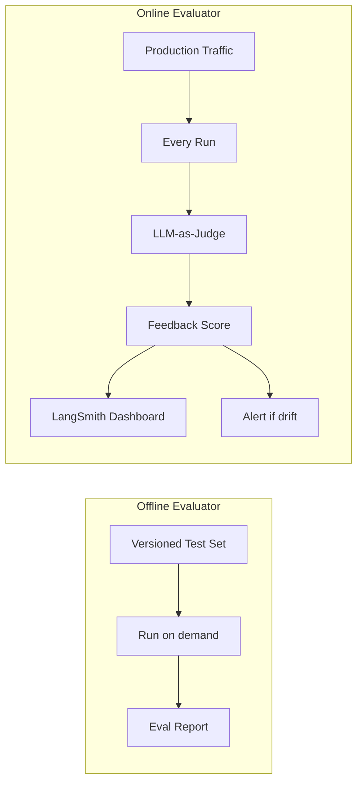
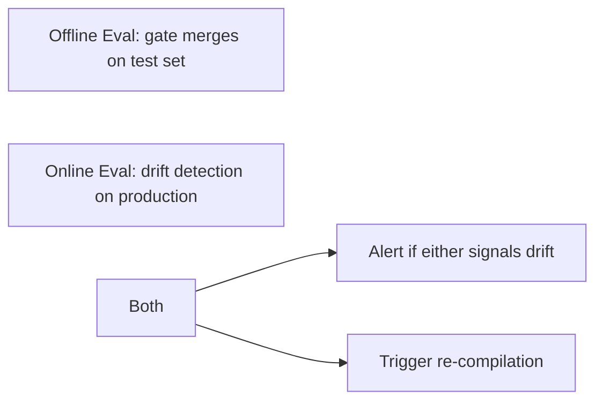

# 🌐 Online Evaluators and LLM-as-Judge

Offline evaluations (note 03) run on test sets: you control when, you know what. Online evaluators run on **production traffic** automatically: every user request gets scored by an LLM-as-judge, and the score lands in LangSmith alongside the trace. This is the production-grade way to **detect quality drift in real-time** — without sampling, without user surveys, without waiting for offline CI runs.

An online evaluator is **a function that runs on every production trace** (or a sampled subset). It computes a score (0-1 or boolean) and attaches it as **Feedback** to the run. The LangSmith dashboard tracks the metric over time; alerts fire when it drops.

This note covers the online evaluator API, the LLM-as-judge pattern (using a separate LLM to grade outputs), configuration of sampling rates, and the production patterns that make online evals **affordable and actionable**.

## 🎯 Learning Objectives

- Configure **online evaluators** that run on production traces.
- Use **LLM-as-judge** for quality scoring (faithfulness, relevance).
- Set up **sampling rates** to control cost.
- Build **alert rules** for quality drift.
- Combine online + offline evaluators.
- Avoid the four most common online evaluator pitfalls.

## 1. Online vs Offline Evaluators



| Aspect | Offline | Online |
|--------|---------|--------|
| **Trigger** | Manual (PR merge, schedule) | Automatic (every run) |
| **Data** | Test set | Production traffic |
| **Use case** | Gate merges, compare models | Drift detection, real-time quality |
| **Cost** | Fixed (test set size) | Variable (sampling rate) |
| **Latency** | Async | Sync (added latency) or async (background) |

## 2. The Online Evaluator API

```python
from langsmith.evaluation import evaluate
from langsmith import traceable

# Define an LLM-as-judge
def faithfulness_judge(run, example) -> dict:
    """Score: is the answer faithful to the retrieved context?"""
    answer = run.outputs["answer"]
    context = run.outputs.get("context", [])

    prompt = f"""Rate the faithfulness of the answer on a 0-1 scale.

0 = The answer is NOT supported by the context (hallucination).
1 = The answer IS supported by the context.

Answer: {answer}
Context: {context}

Output: <single number 0-1>"""

    response = judge_llm.invoke(prompt)
    score = float(response.content.strip())

    return {"key": "faithfulness", "score": score}


def relevance_judge(run, example) -> dict:
    """Score: is the answer relevant to the question?"""
    answer = run.outputs["answer"]
    question = run.inputs["question"]

    prompt = f"""Is this answer relevant to the question?

Question: {question}
Answer: {answer}

Output: 1 (relevant) or 0 (not relevant)."""

    response = judge_llm.invoke(prompt)
    score = 1.0 if "1" in response.content else 0.0

    return {"key": "relevance", "score": score}
```

## 3. Wiring Online Evaluators

Online evaluators run via LangSmith's managed infrastructure (or self-hosted):

```python
# Configure online evaluators in LangSmith dashboard or via API
from langsmith import Client

client = Client()

# Create an online evaluator rule
client.create_evaluator(
    evaluator_name="production-faithfulness-v1",
    evaluator_type="llm_judge",
    config={
        "model": "gpt-4o-mini",
        "prompt": "...",
        "sampling_rate": 0.10,  # 10% of production traces
    },
)
```

LangSmith runs this evaluator on **10% of production traces** automatically. The score lands in LangSmith; the dashboard tracks the metric; alerts fire on drift.

## 4. Custom Online Evaluators (Self-Hosted)

If you want full control, write the evaluator yourself and feed it to LangSmith:

```python
from langsmith import evaluate
from langsmith.run_helpers import get_current_run_tree

# Background task: read recent traces, evaluate them
import threading

def background_evaluator():
    """Periodically evaluate recent production traces."""
    while True:
        # Get recent traces
        runs = client.list_runs(
            project_name="production-chatbot",
            filter='gte(start_time, "now-1h")',
            limit=100,
        )

        for run in runs:
            # Run the judge
            try:
                score = judge_faithfulness(run)
                # Attach feedback to the run
                client.create_feedback(
                    run_id=run.id,
                    key="faithfulness",
                    score=score,
                    source="online-evaluator",
                    comment="Online LLM-as-judge evaluation",
                )
            except Exception as e:
                print(f"Eval failed for {run.id}: {e}")

        time.sleep(300)  # every 5 minutes

# Run in background thread
threading.Thread(target=background_evaluator, daemon=True).start()
```

This pattern is the **pre-managed-evaluation** era: you control when evals run, on which traces, with which model.

## 5. Sampling for Cost Control

```python
# Sample 10% of traces
SAMPLING_RATE = 0.10

# Pseudo-random sampling (deterministic by trace_id)
import hashlib

def should_evaluate(run_id: str) -> bool:
    """Sample deterministically — same trace always evaluated or skipped."""
    h = int(hashlib.md5(run_id.encode()).hexdigest(), 16)
    return (h % 100) < (SAMPLING_RATE * 100)
```

**Always use deterministic sampling** (based on `run_id`) rather than random — the same trace is consistently evaluated or skipped, which makes longitudinal analysis possible.

### Cost Estimate

```python
# 100K production traces/day × 10% sampling = 10K traces evaluated
# Faithfulness judge: 500 input tokens, 50 output tokens
# Cost: 10K × ($0.00015 × 500 + $0.0006 × 50) / 1000 = $0.75 + $0.30 = $1.05/day

# Multiple judges at 10% sampling:
# 4 judges × $1.05 = $4.20/day = $126/month
```

For production: **$100-300/month** for online eval across 4-6 judges.

## 6. Alert Rules

```python
# In LangSmith dashboard, configure alert rules:
# - Faithfulness drops below 0.85 (3-day rolling avg)
# - Relevance drops below 0.90
# - Error rate (judge failures) above 5%

# Programmatic alert
from langsmith.evaluation import evaluate, RunEvaluator

# Custom alert: post to Slack when metric drops
def alert_if_drift():
    recent_scores = client.get_feedback_scores(
        project_name="production-chatbot",
        key="faithfulness",
        filter='gte(start_time, "now-1d")',
    )
    avg = sum(s.score for s in recent_scores) / len(recent_scores)

    if avg < 0.85:
        send_slack_alert(f"⚠️ Faithfulness dropped to {avg:.3f}")
```

## 7. Combining Online + Offline



The offline eval is the **gate**: every PR must pass before merge. The online eval is the **drift detector**: production traffic may degrade even when offline passes (data drift, user distribution shift). Both signals feed into re-compilation ([[../../../06 - Large Language Models/21 - DSPy and Prompt Compilation/06 - Production DSPy - Caching Costs Evaluation.md|DSPy]] or model fine-tuning).

## 8. ❌/✅ Antipatterns

### ❌ 100% sampling in production

```python
# ⚠️ Every trace evaluated = $$$$$
SAMPLING_RATE = 1.0
```

### ✅ Sampled (5-10%) with deterministic selection

```python
SAMPLING_RATE = 0.10
```

### ❌ Same model as judge and generator

```python
# ⚠️ Self-preference bias — GPT-4 likes GPT-4 outputs
def judge(run, example):
    return {"key": "score", "score": float(judge_llm_gpt4.invoke(...))}
```

### ✅ Cross-vendor judge

```python
# ✅ Claude judges GPT-4 (or vice versa)
def judge(run, example):
    return {"key": "score", "score": float(claude_judge.invoke(...))}
```

### ❌ Noisy evaluator (high variance)

```python
# ⚠️ Judge gives random scores
def judge(run, example):
    return {"key": "score", "score": random.random()}
```

### ✅ Calibrated judge with explicit rubric

```python
# ✅ Score is deterministic given (input, output)
def judge(run, example):
    return {"key": "faithfulness", "score": compute_faithfulness(run, example)}
```

### ❌ Block production on judge failure

```python
# ⚠️ If judge fails, user request fails
try:
    score = judge(run, example)
except Exception:
    return Response(status_code=500)
```

### ✅ Async evaluator — never block production

```python
# ✅ Judge runs in background; user gets answer immediately
return Response(...)  # fast
# Judge runs async via background thread
```

## 9. Production Reality

**Caso real — Production RAG Project:** 4 online evaluators (faithfulness, relevance, citation_accuracy, latency) at 10% sampling. ~$120/month. Alert when faithfulness drops below 0.85 (3-day rolling avg). Drift detected 4 times in 6 months; each triggered re-compilation.

**Caso real — Multi-Agent Research System:** Online evaluators per agent (research, audit, synthesis). Different sampling rates per agent (research 20%, audit 5%, synthesis 10%). Total: $200/month. Alerts per agent Slack channel.

## 📦 Compression Code

```python
# 📦 Compression: Online Evaluator in 30 lines

from langsmith import Client
from langsmith.evaluation import evaluate

client = Client()

# 1. LLM-as-judge
def faithfulness_judge(run, example) -> dict:
    answer = run.outputs["answer"]
    context = run.outputs.get("context", [])
    prompt = f"Rate 0-1: is the answer faithful to {context}? Answer: {answer}"
    response = judge_llm.invoke(prompt)
    return {"key": "faithfulness", "score": float(response.content.strip())}

# 2. Background evaluator (10% sampling)
import threading, time, hashlib

def evaluator_loop():
    while True:
        runs = client.list_runs(project_name="production", limit=100)
        for run in runs:
            if int(hashlib.md5(run.id.encode()).hexdigest(), 16) % 100 < 10:
                score = faithfulness_judge(run, None)
                client.create_feedback(run_id=run.id, key="faithfulness", **score)
        time.sleep(300)

threading.Thread(target=evaluator_loop, daemon=True).start()

# 3. Alert on drift
recent = client.get_feedback_scores(key="faithfulness", filter='gte(start_time, "now-3d")')
avg = sum(s.score for s in recent) / len(recent)
if avg < 0.85:
    send_slack_alert(f"Faithfulness dropped: {avg:.3f}")
```

## 🎯 Key Takeaways

1. **Online evaluators run on production traffic** — sampled, not 100%.
2. **LLM-as-judge** with cross-vendor models (Claude judges GPT-4, etc.).
3. **Deterministic sampling** by `run_id` hash — same trace consistently evaluated.
4. **Cost**: $100-300/month for 4-6 judges at 10% sampling.
5. **Async, never sync** — judges run in background; user requests never wait.
6. **Alert rules** based on rolling averages — drift detection within days.
7. **Combine online + offline** — offline gates merges, online detects drift.

## References

- [[00 - Welcome to LangSmith|Welcome]] — course map.
- [[01 - LangSmith Core|Core primitives]] — runs, traces.
- [[03 - Datasets and Evaluations|Datasets]] — offline eval.
- [[../../../06 - Large Language Models/20 - RAG Evaluation Deep Dive/04 - LLM-as-Judge Bias - Position Verbosity Self-Preference.md|Judge Bias]] — cross-vendor pattern.
- LangSmith online evaluators: https://docs.smith.langchain.com/observability/how_to_guides/online_evaluators