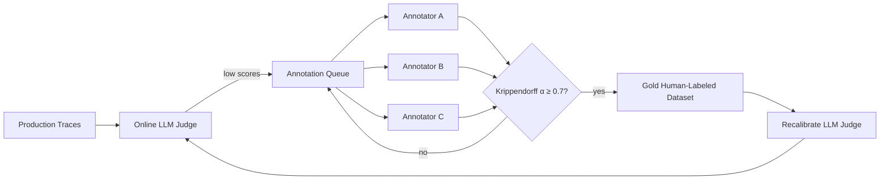
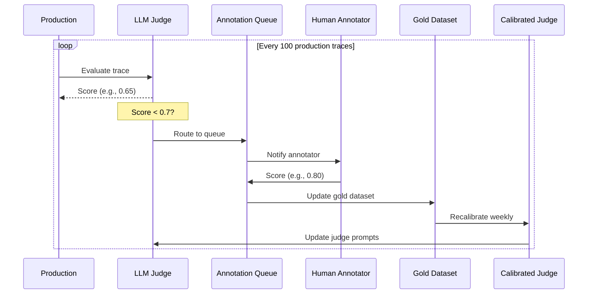

# ✍️ Annotation Queues and Human Feedback

LLM-as-judge is fast and cheap but **biased** ([[../../../06 - Large Language Models/20 - RAG Evaluation Deep Dive/04 - LLM-as-Judge Bias - Position Verbosity Self-Preference.md|06/20/04]]). Human feedback is **gold standard** but **expensive and slow**. The production pattern is: **LLM judge for 100% of traces, human annotators for 1-5%** — feeding a small but authoritative human-labeled dataset that calibrates the LLM judge and detects drift in the judge's own accuracy.

LangSmith's **annotation queues** are the workflow that makes this scalable. They route specific traces (filtered by tag, score, sample) to human annotators, capture their scores with inter-annotator agreement metrics, and feed the labeled data back into evaluator training. This is the same workflow as the [[../../../06 - Large Language Models/20 - RAG Evaluation Deep Dive/01 - Test Dataset Construction - Synthetic Human Hybrid.md|06/20/01]] test set construction, but as a continuous process: every week, more high-quality labels.

This note covers annotation queue setup, the human-in-the-loop workflow, inter-annotator agreement via Krippendorff's alpha, and the production pattern where human labels continuously improve the LLM judge.

## 🎯 Learning Objectives

- Set up **annotation queues** in LangSmith for human feedback.
- Configure **filters** to route specific traces to annotators.
- Capture **multi-annotator** scores with agreement metrics.
- Feed human labels back into **evaluator calibration**.
- Build the **calibration loop** where humans validate the LLM judge.
- Avoid the four most common annotation queue pitfalls.

## 1. The Annotation Queue Workflow



**Production pattern**: LLM judge scores every trace; humans annotate the 5-10% that look unusual (low scores, edge cases); the human-labeled data calibrates the LLM judge; the calibrated judge handles the rest.

## 2. The Annotation Queue API

```python
from langsmith import Client

client = Client()

# Create an annotation queue
queue = client.create_annotation_queue(
    name="production-faithfulness-queue-v1",
    description="Human review for traces with low faithfulness scores.",
)

# Add a filter: traces where LLM-judge faithfulness < 0.7
queue.add_filter(
    project_name="production-chatbot",
    filter='and(eq(metric_key, "faithfulness"), lt(metric_score, 0.7))',
    limit_per_week=100,  # cap annotator workload
)

# Assign annotators
queue.assign(
    usernames=["alice@example.com", "bob@example.com", "carol@example.com"],
    per_example=3,  # 3 annotators per example for agreement
)
```

LangSmith automatically routes matching traces to the queue; annotators see them in their dashboard; their scores are recorded.

## 3. Annotation Schema

```python
# Define what annotators score
queue.add_rubric(
    name="production-faithfulness-rubric",
    schema={
        "type": "object",
        "properties": {
            "faithfulness": {
                "type": "number",
                "minimum": 0,
                "maximum": 1,
                "description": "Is the answer supported by the retrieved context?",
            },
            "relevance": {
                "type": "number",
                "minimum": 0,
                "maximum": 1,
                "description": "Is the answer on-topic for the question?",
            },
            "notes": {
                "type": "string",
                "description": "Optional free-form annotation notes",
            },
        },
        "required": ["faithfulness", "relevance"],
    },
)
```

The rubric is the **schema** that annotators see in the UI. Schema-validated scores flow into LangSmith as feedback.

## 4. The Annotator Workflow

```python
# In the annotator's dashboard:
# 1. See a queue with 100 traces (filtered by LLM-judge faithfulness < 0.7)
# 2. For each trace: see the question, the answer, the retrieved context
# 3. Score faithfulness, relevance; add notes
# 4. Submit → scores captured as feedback with `source="human"`

# Annotators are notified via email / Slack when queues have new items
```

The annotator sees the full trace (question, retrieved context, LLM call, response), the LLM judge's score (so they know to focus on the suspicious ones), and the rubric.

## 5. Inter-Annotator Agreement

When 3 annotators score the same trace, LangSmith computes inter-annotator agreement:

```python
from krippendorff import alpha
import numpy as np

# Annotator scores (rows = examples, cols = annotators)
scores = np.array([
    [0.8, 0.85, 0.75],  # annotator A, B, C scores
    [0.4, 0.5, 0.45],
    [0.95, 0.9, 0.95],
])

alpha_value = alpha(scores, level_of_measurement="interval")
print(f"Krippendorff's alpha: {alpha_value:.3f}")

# Interpretation:
# α ≥ 0.8: rubric is clear, annotations reliable
# 0.6 ≤ α < 0.8: rubric has gaps; refine
# α < 0.6: rubric is broken; don't trust the data
```

| Alpha | Interpretation | Action |
|-------|----------------|--------|
| ≥ 0.8 | Strong agreement | Use annotations as gold |
| 0.6-0.8 | Moderate | Refine rubric, re-annotate |
| < 0.6 | Poor | Fix the rubric first |

> 💡 **Tip:** Track `alpha` over time. If it drops, your rubric is drifting — refine the schema before collecting more data.

## 6. Feeding Annotations Back into the Judge

```python
# Use human annotations to calibrate the LLM judge
import pandas as pd
from sklearn.linear_model import Ridge

# Get human-labeled data
human_feedback = client.get_feedback_scores(
    project_name="production-chatbot",
    filter='eq(source, "human")',
)

# Get LLM judge scores for the same traces
llm_scores = client.get_feedback_scores(
    project_name="production-chatbot",
    filter='eq(source, "online-evaluator")',
)

# Build a calibration model: LLM score → predicted human score
df = pd.DataFrame({
    "llm_score": [s.score for s in llm_scores],
    "human_score": [s.score for s in human_feedback if s.run_id in [l.run_id for l in llm_scores]],
})

model = Ridge()
model.fit(df[["llm_score"]], df["human_score"])

# Apply calibration
def calibrated_score(llm_score: float) -> float:
    return float(model.predict([[llm_score]])[0])
```

The LLM judge is now **calibrated** to match human scores. **95% of traces use the cheap calibrated LLM judge; 5% use humans to keep the calibration fresh.**

## 7. The Continuous Improvement Loop



The loop runs continuously:
1. Every 100 traces, the LLM judge flags 5-10 for human review.
2. Annotators score them.
3. The gold dataset grows.
4. Weekly, the LLM judge is recalibrated against the gold dataset.

## 8. ❌/✅ Antipatterns

### ❌ Manual review with no queue

```python
# ⚠️ Annotators see random traces — no filter, no priority
annotator.review_random_trace()
```

### ✅ Filtered queue with priorities

```python
# ✅ Annotators see the most important traces first
queue.add_filter(filter='lt(metric_score, 0.7)')  # low scores
queue.add_filter(filter='gte(token_count, 5000)')  # expensive traces
```

### ❌ Single annotator per trace

```python
# ⚠️ One person's bias = the annotation
annotator_A.score(trace)
```

### ✅ 3 annotators per trace + agreement metric

```python
per_example=3
alpha = compute_alpha(all_annotations)
```

### ❌ Annotations not feeding back into the system

```python
# ⚠️ Annotations are collected but never used
annotator.score(trace)  # → goes to a spreadsheet
```

### ✅ Annotations drive gold datasets and judge calibration

```python
# ✅ Annotations → gold dataset → recalibrate judge → improved scoring
```

### ❌ Annotating without a rubric

```python
# ⚠️ "How faithful is this?" — vague, low agreement
```

### ✅ Annotating with explicit rubric

```python
# ✅ Specific anchor examples + score definitions
# 1 = Answer is fully supported by retrieved context
# 0.5 = Partially supported
# 0 = NOT supported (hallucination)
```

## 9. Production Reality

**Caso real — Production RAG Project:** LLM judge scores 100% of traces (faithfulness, relevance, citation_accuracy). Online evaluator flags 5% (low scores) for human review. 3 annotators score each flagged trace. Krippendorff's alpha = 0.82. Calibration model: `human_score = 0.85 + 0.18 × llm_score`. **Total cost: $400/month** (LLM $300, humans $100).

**Caso real — Multi-Agent Research System:** Agent-specific queues — research queue, audit queue, synthesis queue. Each agent has its own rubric. Weekly calibration of LLM judges per agent. Three months in, the calibrated LLM judge matches human scores within 0.05.

## 📦 Compression Code

```python
# 📦 Compression: Annotation queue in 30 lines

from langsmith import Client
import numpy as np

client = Client()

# 1. Create queue with filter
queue = client.create_annotation_queue(
    name="faithfulness-review-v1",
    description="Traces with low LLM-judge faithfulness",
)
queue.add_filter(project_name="production", filter='lt(score, 0.7)')
queue.assign(usernames=["alice@", "bob@", "carol@"], per_example=3)
queue.add_rubric(schema={
    "type": "object",
    "properties": {
        "faithfulness": {"type": "number", "minimum": 0, "maximum": 1},
        "notes": {"type": "string"},
    },
})

# 2. Compute agreement
from krippendorff import alpha
scores = client.get_feedback_scores(
    project_name="production",
    filter='eq(source, "human")',
)
# (Pivot to matrix, compute alpha)

# 3. Calibrate LLM judge
import pandas as pd
from sklearn.linear_model import Ridge
llm_scores = client.get_feedback_scores(filter='eq(source, "online-evaluator")')
human_scores = client.get_feedback_scores(filter='eq(source, "human")')
df = pd.DataFrame({"llm": [s.score for s in llm_scores], "human": [s.score for s in human_scores]})
model = Ridge().fit(df[["llm"]], df["human"])
# Use model.predict(llm_score) for calibrated score
```

## 🎯 Key Takeaways

1. **Annotation queues route specific traces** to human annotators via filters.
2. **3 annotators per trace** for inter-annotator agreement (Krippendorff's alpha ≥ 0.8).
3. **Human annotations feed back** into LLM judge calibration.
4. **Filter by low scores** — annotators focus on suspicious cases, not random traces.
5. **Rubric with explicit anchors** — clear definitions of 0, 0.5, 1; not "how good is this?".
6. **Continuous improvement loop** — judge runs 100%, humans 5%, calibration weekly.
7. **Krippendorff alpha tracks rubric health** — drop indicates ambiguity; refine before continuing.

## References

- [[00 - Welcome to LangSmith|Welcome]] — course map.
- [[03 - Datasets and Evaluations|Datasets]] — the offline analog.
- [[04 - Online Evaluators|Online Evals]] — the LLM judge.
- [[../../../06 - Large Language Models/20 - RAG Evaluation Deep Dive/01 - Test Dataset Construction - Synthetic Human Hybrid.md|Test Set Construction]] — Krippendorff's alpha in detail.
- [[../../../06 - Large Language Models/20 - RAG Evaluation Deep Dive/04 - LLM-as-Judge Bias - Position Verbosity Self-Preference.md|Judge Bias]] — why calibration matters.
- LangSmith annotation queues: https://docs.smith.langchain.com/evaluation/annotation_queues