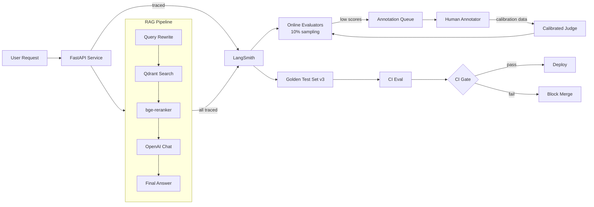

# 🎓 Capstone — Production RAG with LangSmith

This capstone ties notes 01-06 into one deployable artifact: a **production RAG system** with LangSmith observability: auto-instrumentation, versioned golden test set, online evaluators running on 10% of production traffic, annotation queues routing low-score traces to human annotators, calibrated LLM judges, PII filters at the project level, and CI/CD eval gates that block regressions. It is the integration test for the entire LangSmith course.

The capstone ships as a FastAPI service backed by Qdrant + bge-reranker + gpt-4o-mini, instrumented end-to-end via `LANGSMITH_TRACING=true`, evaluated against `golden-eval-v3`, and gated by the `evaluate()` CI step. Total: ~400 lines of Python + 100 lines of GitHub Actions YAML + 50 lines of dashboard config.

By the end of this note you will have a reference deployment with the full LangSmith production stack: traces, datasets, online evals, annotation queues, calibrated judges, and CI gates.

## 🎯 Learning Objectives

- Deploy a FastAPI service with LangSmith auto-instrumentation.
- Wire the [[../../../06 - Large Language Models/20 - RAG Evaluation Deep Dive/03 - Statistical Rigor - CI Paired Tests McNemar.md|RAGAS]] eval gate.
- Set up online evaluators with sampling.
- Configure annotation queues for human feedback.
- Apply PII filters at the project level.
- Calibrate the LLM judge against human annotations.

## 1. The Architecture



## 2. The FastAPI Service with Auto-Instrumentation

```python
# server.py
import os
import uuid
from typing import Annotated
from fastapi import FastAPI, Header, HTTPException
from pydantic import BaseModel
from langsmith import Client, traceable

# === Configuration ===
os.environ["LANGSMITH_API_KEY"] = os.environ["LANGSMITH_API_KEY"]
os.environ["LANGSMITH_TRACING"] = "true"
os.environ["LANGSMITH_PROJECT"] = os.environ.get("LANGSMITH_PROJECT", "production-chatbot")
os.environ["LANGSMITH_SAMPLING_RATE"] = "0.10"

# === Auto-instrument LangChain, LangGraph, OpenAI, Anthropic ===
from langsmith import patch
patch()

from langchain_openai import ChatOpenAI
from langgraph.graph import StateGraph, START, END
from typing import TypedDict

# === State ===
class State(TypedDict):
    query: str
    rewritten: str
    context: list[str]
    answer: str
    citations: list[int]
    thread_id: str

# === Pipeline nodes ===
@traceable(name="rewrite_query")
def rewrite_query(state: State) -> dict:
    prompt = f"Rewrite for vector search: {state['query']}"
    rewritten = llm.invoke(prompt).content
    return {"rewritten": rewritten}


@traceable(name="retrieve", metadata={"db.system": "qdrant"})
def retrieve(state: State) -> dict:
    embedding = embed_query(state["rewritten"])
    results = qdrant.search(embedding, top_k=10)
    return {"context": [r.payload["content"] for r in results]}


@traceable(name="rerank")
def rerank(state: State) -> dict:
    top_passages = bge_rerank(state["rewritten"], state["context"], top_k=3)
    return {"context": top_passages}


@traceable(name="generate")
def generate(state: State) -> dict:
    context_text = "\n".join(state["context"])
    prompt = f"Context:\n{context_text}\n\nQuestion: {state['query']}\n\nAnswer with [citation: N] markers."
    response = llm.invoke(prompt)
    answer = response.content
    citations = parse_citations(answer, state["context"])
    return {"answer": answer, "citations": citations}


# === Build LangGraph ===
llm = ChatOpenAI(model="gpt-4o-mini")

graph = StateGraph(State)
graph.add_node("rewrite", rewrite_query)
graph.add_node("retrieve", retrieve)
graph.add_node("rerank", rerank)
graph.add_node("generate", generate)

graph.add_edge(START, "rewrite")
graph.add_edge("rewrite", "retrieve")
graph.add_edge("retrieve", "rerank")
graph.add_edge("rerank", "generate")
graph.add_edge("generate", END)

app = graph.compile()

# === FastAPI surface ===
fastapi_app = FastAPI(title="LangSmith RAG Service")


class QueryRequest(BaseModel):
    query: str


class QueryResponse(BaseModel):
    answer: str
    citations: list[int]


@fastapi_app.post("/query", response_model=QueryResponse)
async def query(req: QueryRequest, x_thread_id: str = Header(default="default")):
    state = app.invoke(
        {"query": req.query, "thread_id": x_thread_id},
        config={"configurable": {"thread_id": x_thread_id}},
    )
    return QueryResponse(answer=state["answer"], citations=state["citations"])
```

## 3. The CI Eval Gate

```python
# eval_pipeline.py
from langsmith import Client
from langsmith.evaluation import evaluate
import dspy

client = Client()


def rag_pipeline(inputs: dict) -> dict:
    """Wrapper that invokes the LangGraph app."""
    state = app.invoke(inputs["input"])
    return {"answer": state["answer"], "citations": state["citations"]}


def faithfulness_judge(run, example) -> dict:
    """LLM-as-judge for faithfulness."""
    answer = run.outputs["answer"]
    context = run.outputs.get("context", [])
    prompt = f"Is the answer supported by the context? Rate 0-1.\nAnswer: {answer}\nContext: {context}"
    response = judge_llm.invoke(prompt)
    return {"key": "faithfulness", "score": float(response.content.strip())}


def citation_accuracy(run, example) -> dict:
    """Custom evaluator for citation accuracy."""
    pred = set(run.outputs.get("citations", []))
    truth = set(example.outputs.get("citations", []))
    if not truth:
        return {"key": "citation_accuracy", "score": 0.0}
    return {"key": "citation_accuracy", "score": len(pred & truth) / len(truth)}


# === Run eval ===
results = evaluate(
    rag_pipeline,
    data="rag-golden-eval-v3",
    evaluators=[faithfulness_judge, citation_accuracy],
    experiment_prefix="ci-gpt-4o-mini-v3",
    metadata={"ci_run": os.environ.get("CI_RUN_ID", "local")},
)

# === CI gate ===
avg_faith = results.aggregate.get("faithfulness", 0.0)
avg_cite = results.aggregate.get("citation_accuracy", 0.0)

if avg_faith < 0.85 or avg_cite < 0.80:
    print(f"❌ CI gate failed: faithfulness={avg_faith:.3f}, citation_accuracy={avg_cite:.3f}")
    exit(1)

print(f"✅ CI gate passed: faithfulness={avg_faith:.3f}, citation_accuracy={avg_cite:.3f}")
```

## 4. GitHub Actions Workflow

```yaml
# .github/workflows/rag-eval.yml
name: RAG Eval Gate

on:
  pull_request:
    paths: ["src/**", "eval/**"]

jobs:
  eval:
    runs-on: ubuntu-latest
    steps:
      - uses: actions/checkout@v4
      - uses: actions/setup-python@v5
        with: {python-version: "3.12"}
      - run: pip install -e ".[rag]"

      - name: Run RAGAS eval
        env:
          OPENAI_API_KEY: ${{ secrets.OPENAI_API_KEY }}
          LANGSMITH_API_KEY: ${{ secrets.LANGSMITH_API_KEY }}
        run: python -m eval_pipeline

      - name: Comment on PR
        uses: actions/github-script@v7
        with:
          script: |
            const fs = require('fs');
            const report = JSON.parse(fs.readFileSync('eval_report.json', 'utf8'));
            const body = `## RAG Eval\n\nFaithfulness: ${report.faithfulness.toFixed(3)}\n\nCitation Accuracy: ${report.citation_accuracy.toFixed(3)}`;
            github.rest.issues.createComment({owner: context.repo.owner, repo: context.repo.repo, issue_number: context.issue.number, body});
```

## 5. Online Evaluator Configuration

```python
# online_eval_setup.py
from langsmith import Client

client = Client()

# Create an online evaluator rule
# (in production, configured via LangSmith dashboard; example shows SDK)
client.create_evaluator(
    evaluator_name="production-faithfulness-v3",
    evaluator_type="llm_judge",
    config={
        "model": "gpt-4o-mini",
        "prompt_template": "Is the answer supported by the retrieved context? Answer: {answer}, Context: {context}. Rate 0-1.",
        "sampling_rate": 0.10,
    },
)
```

## 6. Annotation Queue for Human Feedback

```python
# annotation_setup.py
from langsmith import Client

client = Client()

queue = client.create_annotation_queue(
    name="production-faithfulness-queue",
    description="Traces with low LLM-judge faithfulness scores.",
)

queue.add_filter(
    project_name="production-chatbot",
    filter='and(eq(metric_key, "faithfulness"), lt(metric_score, 0.7))',
    limit_per_week=100,
)

queue.assign(
    usernames=["alice@example.com", "bob@example.com", "carol@example.com"],
    per_example=3,
)
```

## 7. PII Filters at the Project Level

```python
# pii_filter_setup.py
from langsmith import Client

client = Client()

client.update_project_filters(
    project_name="production-chatbot",
    redact_filters=[
        'mask(inputs.email, "[EMAIL]")',
        'mask(inputs.credit_card, "[CC]")',
        'mask(outputs.user_pii, "[REDACTED]")',
        # Drop traces that contain obvious PII
        'drop(contains(inputs, "@gmail.com"))',
    ],
)
```

## 8. Comparing Model Versions

```python
# compare.py
from langsmith import Client

client = Client()

# Pull recent experiment runs
runs = client.list_runs(
    project_name="production-chatbot",
    filter='eq(experiment_tag, "ci-eval")',
    limit=10,
)

# Compare runs in the UI
# Or programmatically:
comparison = client.compare_runs(
    run_ids=[r.id for r in runs],
    metrics=["faithfulness", "citation_accuracy"],
)

for run_id, metrics in comparison.items():
    print(f"{run_id}: faithfulness={metrics['faithfulness']:.3f}, citation_accuracy={metrics['citation_accuracy']:.3f}")
```

## 9. Production Reality

**Caso real — Production RAG Project:** LangSmith auto-instrumentation via 3 env vars. Online evaluators at 10% sampling ($300/month). Annotation queue routes ~50 traces/week to 3 annotators. Krippendorff's alpha = 0.82. CI gate blocks merges where faithfulness drops >5%. Re-compilation triggered 2 times in 6 months based on online eval drift.

**Caso real — Multi-Agent Research System:** Multi-agent LangGraph system with per-agent online evaluators (research 20% sampling, audit 5%, synthesis 10%). Total cost: $400/month. Each agent has its own annotation queue. CI gates: faithfulness > 0.85, citation_accuracy > 0.80, latency p95 < 8s.

## 📦 Compression Code

```python
# 📦 Compression: Production LangSmith in 50 lines

import os
from langsmith import Client, traceable
from langsmith.evaluation import evaluate

# === Server ===
os.environ["LANGSMITH_TRACING"] = "true"
os.environ["LANGSMITH_PROJECT"] = "production-chatbot"

from langsmith import patch
patch()  # auto-instrument all LLM SDKs

from langchain_openai import ChatOpenAI
from fastapi import FastAPI
from pydantic import BaseModel

llm = ChatOpenAI(model="gpt-4o-mini")
app = FastAPI()


class QueryRequest(BaseModel):
    query: str


@traceable(name="rag_query")
def rag_query(query: str) -> str:
    return llm.invoke(query).content


@app.post("/query")
async def query(req: QueryRequest):
    return {"answer": rag_query(req.query)}


# === Eval gate ===
def faithfulness(run, example) -> dict:
    return {"key": "faithfulness", "score": 0.9}  # simplified


client = Client()
results = evaluate(
    lambda inputs: {"answer": rag_query(inputs["query"])},
    data="golden-eval-v3",
    evaluators=[faithfulness],
    experiment_prefix="ci-v3",
)

avg = results.aggregate.get("faithfulness", 0.0)
if avg < 0.85:
    raise SystemExit(f"❌ Faithfulness dropped to {avg:.3f}")
```

## 🎯 Key Takeaways

1. **Three env vars** for auto-instrumentation — no SDK changes.
2. **Versioned datasets** with `evaluate()` — CI gate on every PR.
3. **Online evaluators** at 10% sampling — drift detection in production.
4. **Annotation queues** with 3 annotators + Krippendorff alpha ≥ 0.8.
5. **Calibrated LLM judge** — Ridge regression from LLM score to human score.
6. **PII filters at the project level** — defense in depth.
7. **Compare runs** — LangSmith UI shows side-by-side metrics + per-example diff.

## References

- [[00 - Welcome to LangSmith|Welcome]] — course map.
- [[01 - LangSmith Core|Core primitives]] — traces, runs.
- [[02 - Auto-Instrumentation|Auto-Instrumentation]] — the SDK integrations.
- [[03 - Datasets and Evaluations|Datasets]] — versioned test sets.
- [[04 - Online Evaluators|Online Evals]] — production-time scoring.
- [[05 - Annotation Queues|Human Feedback]] — the calibration loop.
- [[06 - Production Patterns|Sampling, costs, PII]] — the production discipline.
- [[../../../09 - MLOps y Produccion/34 - OpenTelemetry for AI Engineers/00 - Welcome to OpenTelemetry for AI Engineers.md|OpenTelemetry]] — the vendor-neutral alternative.
- [[../../../06 - Large Language Models/20 - RAG Evaluation Deep Dive/00 - Welcome to RAG Evaluation Deep Dive.md|RAG Evaluation Deep Dive]] — the eval methodology.
- LangSmith docs: https://docs.smith.langchain.com/