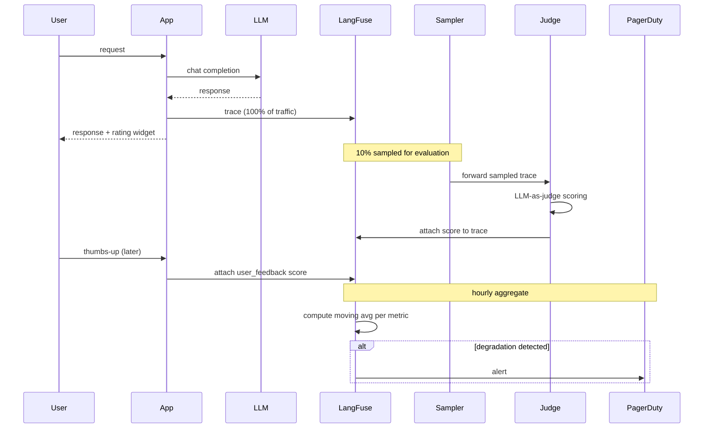

# 🎯 04 - Online Evaluators and Production Patterns

> **Wire LLM-as-Judge into 10% of live traffic. Detect drift in real time. Alert on quality degradation before users complain.**

## 🎯 Learning Objectives
- Wire online evaluators that run on a sampled fraction of production traffic
- Collect thumbs-up / thumbs-down feedback from end users via a simple API
- Detect quality drift by trending evaluation scores over time
- Alert on degradation with PagerDuty, Slack, or email integrations
- Design the cost-effective 80/20 approach: full tracing on all traffic, evaluation on sampled
- Implement trace-to-ground-truth loops where user ratings flow into datasets

## Introduction

Offline evaluation (Note 03) is **predictive**: it asks "is this prompt good?" against historic data. Online evaluation is **observational**: it asks "is this prompt good right now?" against live traffic. The two together give you a complete picture — historic quality assessment before shipping, and live quality assessment after shipping.

LangFuse's online evaluation pattern has three components: **sampling** (run the evaluator on 10% of traces, not all of them), **collecting feedback** (let users rate responses), and **alerting** (notify when scores degrade). Each component is independent and composable.

The cost argument is decisive. An LLM-as-Judge call costs ~$0.001 per evaluation. At 10M traces/day, evaluating all of them is $10K/day; evaluating 10% is $1K/day. Sampling keeps the observability budget manageable while still providing statistical visibility.

The feedback collection is even cheaper — no LLM call, just a `score()` API call from the frontend. Users give a thumbs-up, the score attaches to the trace, and the trace becomes a labeled example for future fine-tuning or evaluation calibration.

Drift detection is the natural consequence. Once you have a stream of scores, plot them over time. If the moving average drops by 5%, alert. If the moving average drops by 20%, page someone. The thresholds are arbitrary; the cadence (every minute, every hour) depends on traffic volume.


This is the **last-mile observability**: tracing tells you the call happened; offline eval tells you the prompt was good; online eval tells you the prompt is good *in the world users actually see*. Without all three, you are flying blind.

---

## 1. The Online Evaluator Lifecycle



The flow:
1. Every trace uploaded (full sampling on tracing, no rate limit)
2. Online evaluator runs on 10% sampled traces (LLM-as-Judge)
3. User feedback (thumbs up/down) attaches to specific traces
4. Aggregator computes moving averages over hours
5. Alert if degradation exceeds threshold

---

## 2. Implementing Online Evaluators

### 2.1 Configuration in the LangFuse UI

Navigate to a project → Settings → Evaluators → New Evaluator. Select:

- **Type**: LLM-as-Judge (recommended) or Code (Python custom)
- **Model**: gpt-4o-mini (fast, cheap) or claude-3-5-sonnet (stronger)
- **Sampling rate**: 0.1 (10%) typical; 1.0 for full eval; 0.01 for very high traffic
- **Score name**: e.g. "answer_quality"
- **Prompt template**: structured prompt that takes `{question}`, `{output}`, `{expected_output}` (optional)

The UI generates the prompt template from a few examples. For complex scoring rubrics, paste a structured rubric directly:

```
You are evaluating the quality of an answer to a user question.

Question: {question}
Model answer: {output}
Expected answer (if available): {expected_output}

Rate on a 0-1 scale:
- 1.0: perfect, correct, concise, helpful
- 0.8: correct but slightly verbose or missing a minor detail
- 0.6: mostly correct but missing an important detail
- 0.4: partially correct, factual errors
- 0.2: irrelevant or off-topic
- 0.0: completely wrong or hallucinated

Output JSON: {"score": <number>, "reasoning": "<one sentence>"}
```

Save the evaluator. It runs automatically on every new trace matching the sampling rate.

### 2.2 Programmatic configuration

For more control, use the LangFuse API:

```python
from langfuse import Langfuse

langfuse = Langfuse()

# Create an LLM-as-Judge evaluator
langfuse.create_evaluator(
    name="answer_quality",
    type="llm_as_judge",
    model="gpt-4o-mini",
    sampling_rate=0.1,  # 10%
    prompt_template="""...""",  # as above
    config={"temperature": 0.3, "max_tokens": 200},
    metadata={"owner": "team-rag", "version": "1.0.0"},
)

# Create a code evaluator (Python function)
langfuse.create_evaluator(
    name="length_check",
    type="code",
    code="""
def evaluate(trace):
    output = trace.output.get('answer', '')
    return {
        'score': min(len(output) / 500, 1.0),
        'reasoning': f'Length is {len(output)} chars; target is 500.'
    }
""",
    sampling_rate=1.0,  # always
)
```

Code evaluators are cheaper than LLM-as-Judge (no model call) and run synchronously. Use them for objective metrics: length, JSON validity, schema conformance, regex match, keyword presence.

### 2.3 Reusing dataset items for online eval

For evaluation against a held-out set, run the same offline evaluator online:

```python
@observe(as_type="evaluation")
def online_evaluation(trace, dataset_name="rag_eval_v1"):
    # Find the matching dataset item (by question similarity)
    items = langfuse.get_dataset(dataset_name).items
    matching_item = find_matching(trace.input["question"], items)
    if matching_item is None:
        return  # not in eval set; skip
    
    expected = matching_item.expected_output["answer"]
    
    # Run the LLM-as-judge
    judge_prompt = f"""..."""
    judge_response = openai_client.chat.completions.create(...)
    score = parse_score(judge_response)
    
    langfuse_context.score_current_trace(
        name="rag_eval_score",
        value=score,
        metadata={"expected": expected, "trace_id": trace.id},
    )
```

This pattern enables **continuous evaluation against a fixed gold set**: every trace that happens to match a question in the dataset is judged against the ground-truth answer.

---

## 3. User Feedback Collection

### 3.1 Thumbs up / thumbs down

The simplest feedback mechanism — two clicks, one HTTP call:

```python
@app.post("/feedback")
async def submit_feedback(trace_id: str, score: int):
    """User feedback endpoint. trace_id returned by the LLM call."""
    langfuse.score(
        trace_id=trace_id,
        name="user_feedback",
        value=score,  # 1 (thumbs up) or 0 (thumbs down)
    )
    return {"status": "ok"}
```

The frontend stores `trace_id` in the response payload and submits feedback asynchronously (no need to block the user's UI on the API call).

For a more granular 1-5 rating:

```python
@app.post("/feedback/rating")
async def submit_rating(trace_id: str, rating: int, comment: str = ""):
    if rating < 1 or rating > 5:
        raise HTTPException(400, "Rating must be 1-5")
    langfuse.score(
        trace_id=trace_id,
        name="user_rating",
        value=rating,
        comment=comment,
    )
```

### 3.2 Implicit feedback signals

Some teams derive feedback from user behavior:
- **Time-on-page** — did the user stay on the response or click "show more"?
- **Scroll depth** — did they read the full response?
- **Follow-up question** — "Can you explain more?" implies the response was inadequate.
- **Copy interaction** — copying the response implies it was useful.
- **Regenerate click** — clicking "regenerate" implies the response was bad.

Capture these as scores via the same `langfuse.score()` API:

```python
# Frontend event
emit("feedback.implicit", {
    "trace_id": trace_id,
    "signal": "regenerate",
    "value": 0,  # negative
})

# Backend
@app.post("/feedback/implicit")
async def implicit_feedback(trace_id: str, signal: str, value: int):
    langfuse.score(
        trace_id=trace_id,
        name=f"implicit_{signal}",
        value=value,
    )
```

Implicit signals are noisier than explicit ratings but occur 10-100× more often — valuable for high-traffic production.

### 3.3 Trace-to-dataset bootstrap

User-rated traces become dataset candidates:

```python
# Pull high-rated traces
traces = langfuse.fetch_traces(
    filters=[
        {"name": "user_feedback", "operator": ">", "value": 0.8}
    ],
    limit=500,
    days_back=7,
)

# Create a new dataset from them
dataset = langfuse.create_dataset(name="user_curated_2026_07")
for trace in traces:
    langfuse.create_dataset_item(
        dataset_name="user_curated_2026_07",
        input=trace.input,
        expected_output=trace.output,
        metadata={"trace_id": trace.id, "user_rating": trace.scores.get("user_feedback", {}).get("value")},
    )
```

This is **active learning by behavior**: the dataset grows with high-quality real interactions rather than synthetic examples.

---

## 4. Drift Detection

### 4.1 The moving average

Online scores form a time series. The **24-hour moving average** is the standard drift indicator:

```python
from datetime import datetime, timedelta

async def compute_moving_average(metric_name: str, window_hours: int = 24):
    now = datetime.utcnow()
    start = now - timedelta(hours=window_hours)
    
    scores = langfuse.fetch_scores(
        name=metric_name,
        from_timestamp=start.isoformat(),
        to_timestamp=now.isoformat(),
    )
    
    values = [s.value for s in scores.data if s.value is not None]
    if not values:
        return None
    
    return sum(values) / len(values)
```

Run this every 5 minutes via cron / scheduled task. Store the result in a time-series DB (InfluxDB, CloudWatch) for graphing.

### 4.2 Alert thresholds

| Drop | Severity | Action |
|------|----------|--------|
| -2% moving average | Info | Slack notification |
| -5% moving average | Warning | Slack + email |
| -10% moving average | Critical | PagerDuty oncall |
| -20% moving average | Emergency | Page oncall + auto-rollback |

The exact thresholds depend on the metric's normal variance. For LLM-as-Judge scores on a 0-1 scale, 5% is typical noise; anything ≥ 10% is a real signal.

### 4.3 Auto-rollback for emergencies

For the most critical prompts, attach a watchdog that auto-rolls back:

```python
async def check_and_rollback():
    current = await compute_moving_average("qa_quality", window_hours=1)
    baseline = await compute_moving_average("qa_quality", window_hours=24*7)  # week baseline
    
    if baseline and current < baseline - 0.20:  # -20% drop
        # Auto-rollback to previous prompt version
        langfuse.update_prompt_labels(
            name="qa_system_prompt",
            version=PREVIOUS_PROD_VERSION,
            labels=["production"],
        )
        await send_pagerduty("Auto-rollback triggered: qa_system_prompt")
```

⚠️ **Watch out:** Auto-rollback is a powerful but risky feature. Test in staging; require a manual approval flow for production; never auto-rollback a critical path without a tested alternative.

---

## 5. Cost Control

### 5.1 The cost calculator

For 10M traces/month with online evaluation:

| Component | Volume | Unit Cost | Monthly |
|-----------|-------:|----------:|--------:|
| Trace ingestion | 10M | $0.0002 | $2000 |
| Online eval (LLM-as-judge, 10% sample) | 1M | $0.001 | $1000 |
| User feedback (free) | 100K | $0 | $0 |
| Storage (Postgres + ClickHouse) | — | — | $200-400 |
| **Total** | — | — | **~$3200-3400/mo** |

For a 1M traces/month team:

| Component | Volume | Unit Cost | Monthly |
|-----------|-------:|----------:|--------:|
| Trace ingestion | 1M | $0.0002 | $200 |
| Online eval (10% sample) | 100K | $0.001 | $100 |
| Storage | — | — | $100-200 |
| **Total** | — | — | **~$400-500/mo** |

Self-hosting the OSS LangFuse on your own VM cuts the trace-ingestion cost entirely (your storage, your compute). LangFuse Cloud charges per-trace; self-hosting is a fixed cost.

### 5.2 Where to cut

| Lever | Effect | Risk |
|-------|--------|------|
| Reduce sampling rate (10% → 5%) | -50% eval cost | Less statistical power |
| Use gpt-4o-mini instead of gpt-4o for judge | -90% eval cost | Lower judge accuracy |
| Cache judge results on identical inputs | -30-50% eval cost | Stale scores |
| Self-host LangFuse | -100% per-trace fee | Adds DevOps cost |
| Filter to specific tags (production only) | -50% eval cost on dev/staging | None in production |

A typical cost-optimized setup:
- 100% trace ingestion (debug-ability requires it)
- 5-10% online eval sampling
- gpt-4o-mini as judge (with structured rubric)
- Filter to `tags=["production"]` (eval only production traffic)
- Self-hosted Postgres + ClickHouse on existing infrastructure

---

## 6. Antipatterns

### 6.1 Antipattern 1: Evaluating 100% of traffic "to be safe"

```python
# ❌ $10K/day to evaluate every trace
sampling_rate=1.0

# ✅ Sample 5-10%; use trend analysis on the sample
sampling_rate=0.1
```

The extra 90% gives no incremental visibility but doubles the bill.

### 6.2 Antipattern 2: Trusting the first dropped score

```python
# ❌ Alert on the first low score
if current_score < threshold:
    alert("Drift detected!")

# ✅ Smooth the moving average over 1+ hour; require sustained drop
if sum(last_12_scores) / 12 < baseline - 0.05:
    alert("Sustained drift")
```

LLM-as-Judge is noisy. Single low scores are common; sustained drops over an hour are signals.

### 6.3 Antipattern 3: Using user thumbs-down for evaluation calibration

```python
# ❌ Bias: users thumb-down long responses, not bad responses
evaluator = train_on(thumbs_down_traces)  # learns to penalize length

# ✅ Use thumbs-up + thumbs-down + LLM-judge; treat as three separate signals
# Calibration requires diverse signals; don't collapse them into one
```

User behavior encodes preferences (length, style, format) that may not align with quality. Use multiple evaluators; do not collapse.

### 6.4 Antipattern 4: Ignoring the cold-start problem

```python
# ❌ First 100 traces: noise dominates signal
if score_count < 100:
    return  # no alert; signals are unreliable

# ✅ Require a minimum sample size for alerts
if score_count < 200 and (current < baseline - 0.20):  # extremely strict threshold for small samples
    alert(f"Early signal from {score_count} scores")
```

The first day of a new evaluator has high variance. Either suppress alerts or use a stricter threshold.

### 6.5 Antipattern 5: Not deduplicating sampled traces

```python
# ❌ Same trace scored multiple times by different eval calls
for scorer in [judge_1, judge_2, judge_3]:
    scorer.evaluate(trace)  # 3 LLM calls per trace

# ✅ Each scorer samples independently; deduplicate at score level
trace_scores = {}
for scorer_name, scorer in scorers.items():
    score = scorer.evaluate(trace)
    trace_scores[scorer_name] = score
# Aggregate as different metrics, not multiple scores for the same metric
```

Multiple scorers should attach scores with different names, not multiple scores for the same metric name.

---

## 🎯 Key Takeaways

- Online evaluators run on sampled production traces (typical 5-10%); LLM-as-Judge is the standard for subjective metrics.
- User feedback (thumbs up/down, 1-5 rating, implicit signals) attaches via `langfuse.score()` and feeds dataset curation.
- Drift detection: 24-hour moving average per metric; alert on -5%, -10%, -20% drops.
- Auto-rollback is powerful but risky — require staging validation and manual approval for production.
- Cost at 10M traces/month with 10% online eval: $3,200/mo Cloud vs ~$2,400/mo self-hosted.
- Use offline eval (Note 03) to justify prompt changes; use online eval to confirm changes are good in production.
- Avoid 100% sampling on 10M traces, single-score alerts, user-thumbs-down calibration, cold-start alerts, and scorer deduplication.

## References

- LangFuse Online Evaluations — [langfuse.com/docs/evaluation/online-evaluation](https://langfuse.com/docs/evaluation/online-evaluation)
- LangFuse User Feedback — [langfuse.com/docs/scores/user-feedback](https://langfuse.com/docs/scores/user-feedback)
- LangFuse Alerting — [langfuse.com/docs/scores/alerting](https://langfuse.com/docs/scores/alerting)
- [[06 - Large Language Models/20 - RAG Evaluation Deep Dive|RAG Evaluation Deep Dive]] — offline evaluation rigor
- [[09 - MLOps y Produccion/31 - Evidently AI and Phoenix|Evidently AI and Phoenix]] — drift detection on input features (orthogonal to LLM-judge drift)
- [[09 - MLOps y Produccion/36 - LangFuse - Open-Source LLM Observability/03 - Datasets, Evaluations and Prompt Management|Note 03 — Datasets, Evaluations and Prompt Management]]
- [[09 - MLOps y Produccion/36 - LangFuse - Open-Source LLM Observability/05 - Capstone - Self-Hosted LangFuse for Multi-Provider RAG|Note 05 — Capstone]]
