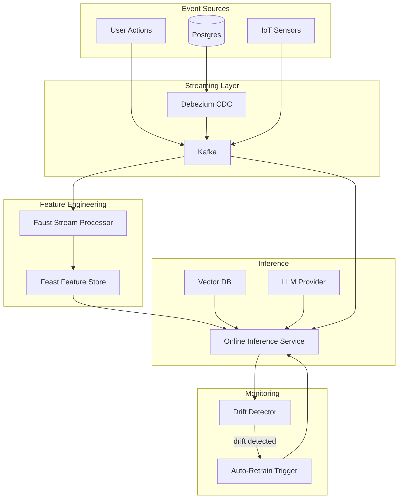

# 🏷️ Welcome — Real-time ML Systems

## 🎯 Learning Objectives
- Build streaming feature pipelines with Kafka and Faust/Bytewax
- Implement change data capture (CDC) for ML feature pipelines
- Deploy online inference services with sub-second latency
- Detect drift in real time and trigger auto-retraining
- Architect end-to-end real-time ML pipelines with feature stores
- Distinguish real-time patterns by workload: fraud detection, recommendation, monitoring
- Apply the patterns to portfolio projects (LLM Edge Gateway, Eval Suite, etc.)

## Introduction

The shift from batch to real-time ML is the most consequential operational change in production ML between 2024 and 2026. Where most ML systems previously made predictions once a day, modern systems make them **continuously, on each new event**: fraud detection on every transaction, recommendations on every page view, anomaly detection on every sensor reading.

This course teaches the four patterns that make real-time ML work:

1. **Streaming feature engineering** — Kafka, Faust, Bytewax, online aggregations
2. **Online inference** — event-driven ML services with sub-second latency
3. **Change data capture** — CDC for ML feature pipelines from PostgreSQL
4. **Drift detection in real time** — ADWIN, Page-Hinkley, auto-retraining triggers

By the end of these six notes you will have built a complete real-time ML pipeline that ingests events, computes features online, serves predictions in <100ms, detects drift, and triggers auto-retraining when needed. The capstone is the **twelfth portfolio project**: the real-time ML skill.

---

## 1. The 2026 Real-time ML Landscape

| Pattern | Use case | Latency | Example |
|---------|----------|---------|---------|
| **Streaming features** | Aggregations over time windows | 100ms-1s | User clicks per minute |
| **Online inference** | Per-event prediction | <50ms | Fraud detection |
| **CDC** | Database changes → ML features | <5s | User profile updates |
| **Drift detection** | Real-time quality monitoring | 1m-1h | Model accuracy on live traffic |
| **Auto-retraining** | Triggered by drift | minutes-hours | Fine-tune on new data |

These patterns combine in production:
- A **recommendation system** uses CDC (for new users/items), streaming features (for real-time context), online inference (per request), and drift detection (for quality).
- A **fraud detection system** uses streaming features (transaction velocity), online inference (per transaction), and drift detection (for adversarial adaptation).

---

## 2. Why This Course Now

Three forces drive the shift to real-time ML:

1. **Customer expectations.** Users expect personalization in <100ms. A 1-second delay in recommendations loses 7% of conversions (Akamai study).
2. **Competitive advantage.** Real-time fraud detection saves $X per caught fraud. Real-time personalization increases revenue.
3. **Operational maturity.** The infrastructure (Kafka, Feast, real-time feature stores) has matured. Production-ready tools exist.

The engineers who master real-time ML get hired first for senior ML platform roles. The engineers who only know batch ML are stuck building yesterday's systems.

---

## 3. Course Map

| Note | Title | Focus |
|------|-------|-------|
| 00 | Welcome — Why Real-time ML Systems | This overview |
| 01 | Streaming Feature Engineering | Kafka, Faust, online aggregations, windows |
| 02 | Online Inference and Event-Driven ML | Sub-50ms predictions, event-driven architectures |
| 03 | Change Data Capture for ML | Debezium, Kafka Connect, CDC for features |
| 04 | Drift Detection in Real-time | ADWIN, Page-Hinkley, auto-retraining |
| 05 | Capstone — Production Real-time ML Pipeline | End-to-end pipeline with Docker Compose |

---

## 4. Prerequisites

You should already be comfortable with:

- **Python async** — asyncio, FastAPI from [[03 - Advanced Python/08 - Async Python Patterns Reference|03/08 Async Python Patterns Reference]]
- **Production LLM serving** — FastAPI, LiteLLM from [[06 - Large Language Models/19 - LLM Gateway Patterns and LiteLLM|06/19 LLM Gateway]]
- **Docker Compose** — multi-service stacks from [[10 - Cloud, Infra y Backend/31 - FastAPI for ML|10/31 FastAPI]]
- **MLflow / observability** — basics from [[09 - MLOps y Produccion/22 - End-to-End ML Project|09/22 E2E ML Project]]
- **Feast basics** — online feature store from [[09 - MLOps y Produccion/27 - Feast and Feature Stores|09/27 Feast]]

💡 If you have not yet read [[10 - Cloud, Infra y Backend/29 - Distributed ML Infrastructure/01 - Apache Kafka|Kafka note 01]], skim it before Note 01 — Kafka fundamentals are assumed.

---

## 5. Cross-Module Connections

| Vault Module | Connection |
|--------------|-----------|
| [[09 - MLOps y Produccion/27 - Feast and Feature Stores\|Feast]] | Online feature store integration |
| [[09 - MLOps y Produccion/31 - Evidently AI and Phoenix\|Evidently]] | Drift detection integration |
| [[09 - MLOps y Produccion/22 - End-to-End ML Project\|E2E ML Project]] | CI/CD for retraining |
| [[10 - Cloud, Infra y Backend/29 - Distributed ML Infrastructure/01 - Apache Kafka\|Kafka]] | Streaming foundation |
| [[06 - Large Language Models/19 - LLM Gateway Patterns and LiteLLM\|LLM Gateway]] | Multi-provider LLM in real-time |
| [[06 - Large Language Models/23 - Serverless LLM Platforms\|Serverless LLM]] | Burst inference for real-time |
| [[09 - MLOps y Produccion/39 - Production Incident Response for AI Systems\|Incident Response]] | Real-time alerting |

---

## 6. What You Will Build

By Note 05, you will have:

- A streaming feature pipeline using Kafka + Faust
- CDC from PostgreSQL into the feature pipeline
- An online feature store (Feast) with low-latency reads
- A real-time inference service (FastAPI) with sub-100ms latency
- A drift detector (ADWIN) with Prometheus + Grafana dashboards
- An auto-retraining trigger that updates the model on drift
- A complete Docker Compose stack that boots the whole pipeline

This is the **twelfth portfolio project**: the real-time ML skill.

---

## 7. The Cutting Edge in 2026

Three frontiers are emerging:

1. **LLM + streaming features** — Realtime context for LLM agents: per-event features fed to LangChain agents for sub-second personalized responses.
2. **Feature store convergence** — Feast, Tecton, and Hopswork are converging on online/offline parity. Same feature definition works for both batch training and online serving.
3. **Auto-retraining at the edge** — Real-time model updates at edge devices (covered in [[15 - Transversal Skills/04 - WebGPU and On-Device ML|15/04 WebGPU]]) using streaming features.

These map directly onto the user's portfolio: the **LLM Edge Gateway** benefits from real-time context; the **Automated LLM Evaluation Suite** can be triggered by drift; the **Multi-Agent Research System** needs streaming features for fresh context; the **StayBot** could use CDC to keep listing data fresh.

---

⚠️ The real-time ML ecosystem evolves fast. Kafka's KRaft mode (2024) replaced ZooKeeper; Faust was archived in 2024 (use Bytewax); Feast added streaming features in 1.x. The **patterns** in this course are stable; the **library APIs and configuration** will need updating. Always cross-check against the relevant docs (kafka.apache.org, bytewax.io, feast.dev) before deploying.